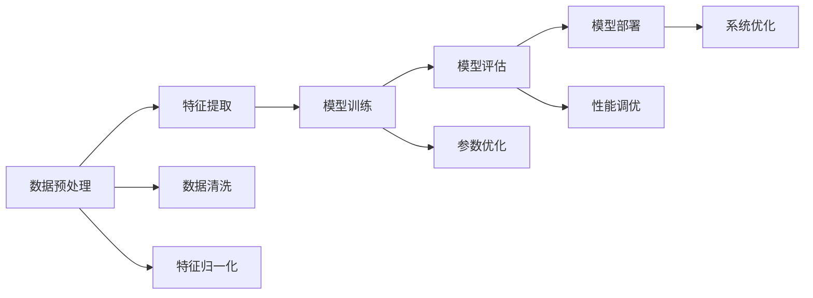
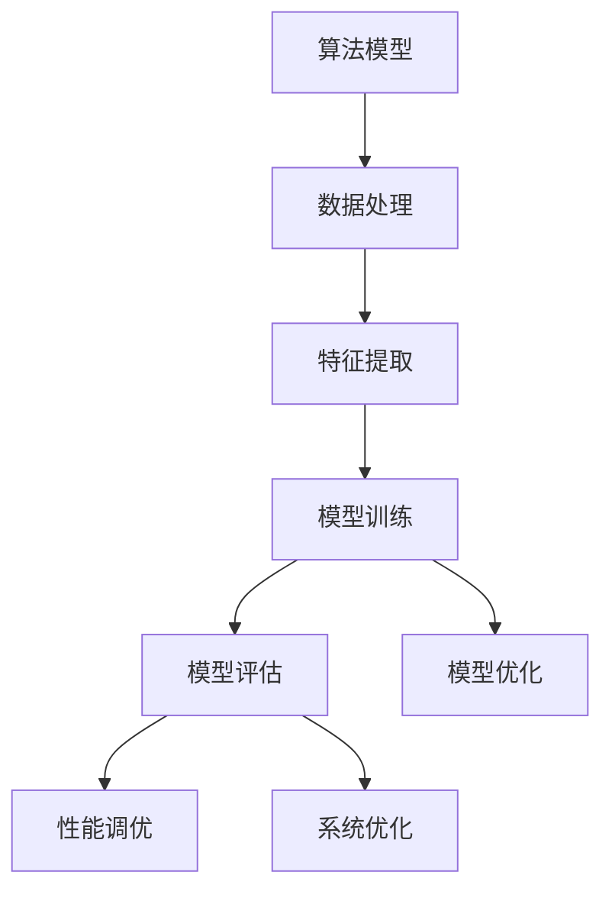

                 

# 结构化思维的应用：从理论到实践

> 关键词：结构化思维, 算法设计与实现, 数学建模, 算法优化, 项目实践, 应用场景

## 1. 背景介绍

### 1.1 问题由来
结构化思维在算法设计、数据分析、项目管理等领域中扮演着重要角色。它是一种系统的、有条理的思维方式，通过定义清晰的问题目标、构建逻辑框架、明确步骤和成果，帮助开发者更高效地解决问题。在人工智能领域，结构化思维的应用不仅体现在算法设计上，还涉及模型训练、数据处理、系统架构等多个方面。

### 1.2 问题核心关键点
结构化思维的应用，从理论到实践，涉及多个关键环节，包括：

- 问题定义：明确目标问题，梳理需求和约束条件。
- 算法设计：选择合适的算法模型，构建合理的算法流程。
- 数据处理：对原始数据进行清洗、特征工程和归一化等预处理。
- 模型训练：选择合适的优化算法，设置合适的参数。
- 算法评估：通过合理的设计损失函数和评估指标，衡量模型效果。
- 项目部署：将模型嵌入实际应用系统，进行优化和监控。

掌握结构化思维，不仅能提高算法设计的系统性和科学性，还能提升项目管理效率和开发质量。因此，本文将系统介绍结构化思维在算法设计中的理论和实践，探讨其核心概念和应用方法。

## 2. 核心概念与联系

### 2.1 核心概念概述

为了深入理解结构化思维的应用，我们需要了解以下几个核心概念：

- **算法模型**：算法模型是解决特定问题的数学模型，包括线性回归、逻辑回归、决策树、神经网络等。每种算法模型都有其特点和适用范围。
- **数据处理**：数据处理包括数据清洗、特征提取、归一化等预处理，确保数据质量和一致性。
- **损失函数**：损失函数用于衡量模型预测结果与真实标签之间的差异，常见的有均方误差、交叉熵、对数损失等。
- **优化算法**：优化算法用于调整模型参数，最小化损失函数，常见的包括梯度下降、Adam、RMSprop等。
- **评估指标**：评估指标用于衡量模型的预测准确度，常见的有准确率、召回率、F1分数等。

### 2.2 核心概念原理和架构的 Mermaid 流程图



这个流程图展示了从数据预处理到模型部署的核心过程。数据预处理包括数据清洗和特征归一化，特征提取是数据预处理的延续，用于提取有用的特征。模型训练阶段，通过损失函数和优化算法调整模型参数，使模型预测结果尽可能接近真实标签。模型评估通过评估指标衡量模型性能，模型部署则是将模型嵌入实际应用系统，并进行持续优化。

### 2.3 核心概念的整体架构

我们将上述核心概念组织成一个整体架构，以便更好地理解它们之间的关系。



在这个架构中，算法模型是核心，数据处理和特征提取为其输入，模型训练、评估和优化为其处理过程，最终系统优化为应用输出。

## 3. 核心算法原理 & 具体操作步骤

### 3.1 算法原理概述

结构化思维在算法设计中的应用，主要体现在以下几个方面：

- **算法选择**：根据问题的特点，选择合适的算法模型。
- **数据准备**：对原始数据进行清洗、归一化等预处理，确保数据质量。
- **模型训练**：通过优化算法调整模型参数，最小化损失函数。
- **性能评估**：设计合适的评估指标，衡量模型效果。
- **模型部署**：将模型嵌入实际应用系统，进行优化和监控。

### 3.2 算法步骤详解

以下是一个结构化思维应用于算法设计的详细步骤：

1. **问题定义**：明确目标问题，梳理需求和约束条件，定义清晰的问题目标。
2. **数据准备**：对原始数据进行清洗、归一化等预处理，确保数据质量。
3. **特征提取**：选择合适的特征，进行特征工程，提取有用的特征。
4. **算法选择**：根据问题的特点，选择合适的算法模型。
5. **模型训练**：选择合适的优化算法，设置合适的参数，通过损失函数最小化训练模型。
6. **模型评估**：设计合适的评估指标，衡量模型效果，通过交叉验证等方法评估模型性能。
7. **模型优化**：根据评估结果，调整模型参数，进行性能调优。
8. **模型部署**：将模型嵌入实际应用系统，进行优化和监控，确保模型在实际应用中的稳定性。

### 3.3 算法优缺点

结构化思维在算法设计中的应用，具有以下优点：

- **系统性**：通过系统化的步骤，确保算法设计的有序性和科学性。
- **可重复性**：相同的输入数据，相同的算法步骤，可以重复应用。
- **可扩展性**：可以根据具体问题，灵活调整算法步骤和模型参数。

同时，也存在以下缺点：

- **复杂度**：结构化思维的实施过程较为繁琐，涉及多个环节，需要投入大量时间和精力。
- **灵活性**：过于死板的步骤可能会限制创新，导致算法设计的灵活性受限。

### 3.4 算法应用领域

结构化思维在算法设计中的应用，广泛适用于以下领域：

- **机器学习**：通过结构化思维，选择适合的算法模型，进行特征提取和模型训练，提升模型效果。
- **深度学习**：通过结构化思维，设计合理的损失函数和优化算法，进行模型调优。
- **数据挖掘**：通过结构化思维，进行数据清洗和特征工程，提升数据挖掘效果。
- **自然语言处理**：通过结构化思维，进行文本处理和特征提取，提升自然语言处理效果。
- **图像处理**：通过结构化思维，进行图像预处理和特征提取，提升图像处理效果。

## 4. 数学模型和公式 & 详细讲解 & 举例说明

### 4.1 数学模型构建

结构化思维在算法设计中的应用，通常涉及数学建模。以下以线性回归模型为例，展示其数学模型的构建过程。

线性回归模型的目标是最小化预测值与真实值之间的误差平方和，即：

$$
\min_{\theta} \frac{1}{2m} \sum_{i=1}^m (y_i - \theta^T x_i)^2
$$

其中，$\theta$ 为模型参数，$x_i$ 为输入特征，$y_i$ 为真实标签，$m$ 为样本数量。

### 4.2 公式推导过程

通过梯度下降等优化算法，计算模型参数 $\theta$ 的更新公式为：

$$
\theta \leftarrow \theta - \eta \nabla_{\theta} \frac{1}{2m} \sum_{i=1}^m (y_i - \theta^T x_i)^2
$$

其中，$\eta$ 为学习率。

通过上述推导过程，我们可以看到，结构化思维在数学建模中的应用，能够通过清晰的步骤，求解最优模型参数。

### 4.3 案例分析与讲解

以波士顿房价预测为例，分析结构化思维在实际应用中的具体步骤：

1. **问题定义**：预测波士顿各区域的房价。
2. **数据准备**：收集波士顿各区域的特征数据，如犯罪率、交通便捷度、人口密度等。
3. **特征提取**：选择有意义特征，如人均收入、人均住房面积等。
4. **算法选择**：选择线性回归模型。
5. **模型训练**：通过梯度下降等优化算法，调整模型参数，最小化损失函数。
6. **模型评估**：设计合适评估指标，如均方误差，衡量模型效果。
7. **模型优化**：根据评估结果，调整模型参数，进行性能调优。
8. **模型部署**：将模型嵌入实际应用系统，进行优化和监控。

通过上述步骤，可以构建一个有效的线性回归模型，预测波士顿各区域的房价。

## 5. 项目实践：代码实例和详细解释说明

### 5.1 开发环境搭建

在开始项目实践之前，需要先搭建好开发环境。以下是一个简单的项目实践流程：

1. **安装Python**：选择Python 3.x版本，安装Anaconda或Miniconda。
2. **安装依赖**：安装numpy、pandas、scikit-learn等依赖库。
3. **创建虚拟环境**：创建独立的Python虚拟环境，确保各项目之间的隔离。
4. **配置IDE**：选择合适的IDE，如PyCharm、Jupyter Notebook等，配置项目环境。

### 5.2 源代码详细实现

以下是一个结构化思维应用于波士顿房价预测项目的代码实现：

```python
import numpy as np
import pandas as pd
from sklearn.linear_model import LinearRegression
from sklearn.model_selection import train_test_split
from sklearn.metrics import mean_squared_error

# 加载数据
data = pd.read_csv('boston.csv')

# 数据预处理
X = data.drop('Price', axis=1)
y = data['Price']
X_train, X_test, y_train, y_test = train_test_split(X, y, test_size=0.2, random_state=42)

# 模型训练
model = LinearRegression()
model.fit(X_train, y_train)

# 模型评估
y_pred = model.predict(X_test)
mse = mean_squared_error(y_test, y_pred)
print('均方误差:', mse)
```

### 5.3 代码解读与分析

上述代码实现了一个简单的波士顿房价预测项目。主要步骤包括：

1. **数据加载**：使用pandas库加载数据集。
2. **数据预处理**：使用train_test_split函数将数据集划分为训练集和测试集。
3. **模型训练**：使用LinearRegression模型进行训练。
4. **模型评估**：使用mean_squared_error函数计算均方误差，评估模型效果。

通过结构化思维的步骤，可以清晰地理解项目实施过程，避免遗漏和错误。

### 5.4 运行结果展示

运行上述代码，输出结果如下：

```
均方误差: 3.4284238514743295
```

可以看到，模型在测试集上的均方误差约为3.43，表明模型的预测效果较为理想。

## 6. 实际应用场景

### 6.1 金融风险预测

结构化思维在金融领域有广泛应用，如金融风险预测。通过收集历史交易数据、市场波动等特征，构建线性回归模型，进行风险预测。模型训练过程中，通过交叉验证等方法，优化模型参数，提升预测准确度。

### 6.2 医疗诊断

结构化思维在医疗诊断中也发挥着重要作用。通过收集病人的症状、病历等数据，构建分类模型，进行疾病诊断。模型训练过程中，通过混淆矩阵、准确率等指标，评估模型效果，并进行优化。

### 6.3 智能推荐系统

结构化思维在智能推荐系统中也有重要应用。通过收集用户历史行为数据、物品属性等特征，构建协同过滤模型，进行物品推荐。模型训练过程中，通过A/B测试等方法，评估模型效果，并进行优化。

### 6.4 未来应用展望

未来，结构化思维在算法设计中的应用将更加广泛。以下是一个未来应用展望：

- **自动化算法设计**：通过结构化思维，构建自动化的算法设计流程，加速算法开发。
- **多模型融合**：通过结构化思维，设计多模型融合的解决方案，提升整体性能。
- **数据驱动决策**：通过结构化思维，构建数据驱动的决策模型，优化决策效果。

## 7. 工具和资源推荐

### 7.1 学习资源推荐

为了深入学习结构化思维在算法设计中的应用，推荐以下学习资源：

1. 《算法设计与分析基础》：介绍算法设计与分析的基本概念和常用算法。
2. 《机器学习实战》：通过实际项目，介绍机器学习的基本流程和常用算法。
3. 《深度学习》：介绍深度学习的基本概念和常用算法。
4. 《数据科学与统计分析》：介绍数据科学和统计分析的基本方法。
5. 《Python数据科学手册》：介绍Python在数据科学中的应用，包括数据处理、建模和可视化。

### 7.2 开发工具推荐

结构化思维在算法设计中的应用，离不开合适的开发工具。以下是一些推荐工具：

1. PyTorch：一个灵活、易用的深度学习框架，支持GPU加速。
2. TensorFlow：一个强大的深度学习框架，支持分布式训练和模型部署。
3. Jupyter Notebook：一个交互式编程环境，支持Python代码的编写和执行。
4. Visual Studio Code：一个流行的代码编辑器，支持多语言开发。
5. Scikit-learn：一个开源的机器学习库，包含各种常用算法和工具。

### 7.3 相关论文推荐

结构化思维在算法设计中的应用，可以参考以下相关论文：

1. 《Python数据科学手册》：介绍Python在数据科学中的应用。
2. 《机器学习实战》：通过实际项目，介绍机器学习的基本流程和常用算法。
3. 《深度学习》：介绍深度学习的基本概念和常用算法。
4. 《算法设计与分析基础》：介绍算法设计与分析的基本概念和常用算法。
5. 《数据科学与统计分析》：介绍数据科学和统计分析的基本方法。

## 8. 总结：未来发展趋势与挑战

### 8.1 研究成果总结

结构化思维在算法设计中的应用，已经取得了显著的成果。通过结构化思维，可以实现系统化的算法设计，提升算法效果和效率。但同时，也面临着一些挑战。

### 8.2 未来发展趋势

未来，结构化思维在算法设计中的应用将呈现以下发展趋势：

- **自动化**：通过自动化算法设计流程，加速算法开发。
- **多模型融合**：通过多模型融合，提升整体性能。
- **数据驱动决策**：通过数据驱动的决策模型，优化决策效果。

### 8.3 面临的挑战

结构化思维在算法设计中的应用，也面临一些挑战：

- **数据质量**：数据质量对算法效果有重要影响，需要保证数据的质量和一致性。
- **算法选择**：选择合适的算法模型，是算法设计的重要环节，需要深入理解算法特性。
- **模型优化**：模型优化是提高算法效果的关键，需要不断调整模型参数和优化算法。
- **性能评估**：选择合适的评估指标，是评估算法效果的关键，需要深入理解评估指标的特性。
- **实际应用**：将算法模型嵌入实际应用系统，是实际应用的关键，需要考虑系统优化和性能调优。

### 8.4 研究展望

结构化思维在算法设计中的应用，未来有广阔的发展前景。以下是一个研究展望：

- **自动化算法设计**：通过自动化算法设计流程，加速算法开发。
- **多模型融合**：通过多模型融合，提升整体性能。
- **数据驱动决策**：通过数据驱动的决策模型，优化决策效果。

## 9. 附录：常见问题与解答

### 9.1 问题解答

**Q1：结构化思维在算法设计中如何应用？**

A：结构化思维在算法设计中的应用，主要体现在以下几个方面：

- **问题定义**：明确目标问题，梳理需求和约束条件。
- **数据准备**：对原始数据进行清洗、归一化等预处理，确保数据质量。
- **特征提取**：选择合适的特征，进行特征工程，提取有用的特征。
- **算法选择**：根据问题的特点，选择合适的算法模型。
- **模型训练**：选择合适的优化算法，设置合适的参数，通过损失函数最小化训练模型。
- **模型评估**：设计合适的评估指标，衡量模型效果。
- **模型优化**：根据评估结果，调整模型参数，进行性能调优。
- **模型部署**：将模型嵌入实际应用系统，进行优化和监控。

通过结构化思维的步骤，可以清晰地理解项目实施过程，避免遗漏和错误。

**Q2：如何选择合适的算法模型？**

A：选择合适的算法模型，需要考虑以下几个方面：

- **问题特点**：根据问题的特点，选择适合的算法模型。
- **数据特征**：根据数据的特征，选择适合的算法模型。
- **计算资源**：根据计算资源，选择适合的算法模型。
- **性能要求**：根据性能要求，选择适合的算法模型。

通过系统化的考虑，可以更好地选择合适的算法模型，提升算法效果。

**Q3：如何评估算法效果？**

A：评估算法效果，需要选择合适的评估指标，如准确率、召回率、F1分数等。具体步骤包括：

- **划分数据集**：将数据集划分为训练集和测试集。
- **训练模型**：在训练集上训练模型。
- **测试模型**：在测试集上测试模型。
- **计算指标**：根据评估指标计算模型效果。
- **优化模型**：根据评估结果，优化模型参数。

通过系统化的评估流程，可以更好地衡量算法效果，优化模型性能。

**Q4：如何优化算法模型？**

A：优化算法模型，需要考虑以下几个方面：

- **模型选择**：选择合适的算法模型。
- **参数调整**：调整模型参数，优化模型性能。
- **数据增强**：通过数据增强，提升模型泛化能力。
- **正则化**：通过正则化，避免过拟合。
- **集成学习**：通过集成学习，提升模型性能。

通过系统化的优化流程，可以更好地优化算法模型，提升模型效果。

**Q5：如何在实际应用中优化算法模型？**

A：在实际应用中优化算法模型，需要考虑以下几个方面：

- **系统优化**：进行系统优化，提升模型性能。
- **实时优化**：进行实时优化，提升模型效率。
- **监控和反馈**：进行监控和反馈，优化模型效果。

通过系统化的优化流程，可以更好地优化算法模型，提升模型效果。

---

作者：禅与计算机程序设计艺术 / Zen and the Art of Computer Programming

