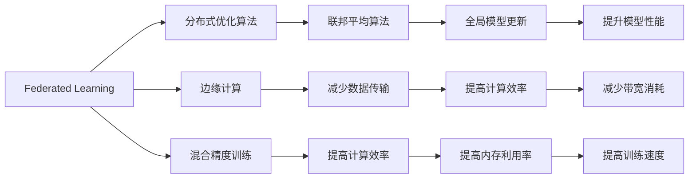
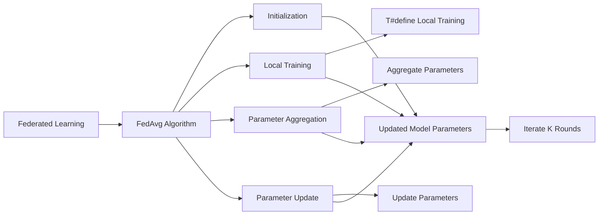

                 

# 联邦学习 (Federated Learning) 原理与代码实例讲解

> 关键词：联邦学习,数据隐私保护,分布式训练,边缘计算,无标签学习,混合精度

## 1. 背景介绍

### 1.1 问题由来
近年来，随着大数据和深度学习技术的飞速发展，基于集中式数据训练的机器学习范式已经难以适应日益严格的数据隐私保护和分布式计算环境的要求。与此同时，各行业的数据量呈爆炸式增长，单点计算资源难以承载大规模数据处理任务，分布式计算成为必然趋势。联邦学习（Federated Learning）应运而生，成为了一种新兴的机器学习范式，旨在利用分布式计算资源进行高效协作学习，同时保障数据的隐私和安全性。

### 1.2 问题核心关键点
联邦学习的基本思想是将数据分散存储在不同节点（如智能手机、物联网设备、边缘服务器等），各节点在本地进行模型训练，并通过安全的方式汇总全局模型参数，迭代更新本地模型。该方法通过数据的分散存储和本地训练，避免了数据集中存储带来的隐私风险，同时利用了分布式计算资源，提高了模型训练效率。

#### 1.2.1 联邦学习的主要特点
- **数据隐私保护**：各节点仅在本地进行模型训练，不交换原始数据，从而避免了数据隐私泄露的风险。
- **分布式训练**：模型参数更新通过节点间的协同合作进行，各节点本地计算，不依赖中央服务器，适合于大规模分布式环境。
- **本地更新**：模型在本地进行多轮迭代更新，提升模型性能，同时减少数据传输带来的带宽消耗。
- **混合精度**：通过混合精度训练，提升计算效率，同时保证模型精度。

#### 1.2.2 联邦学习的适用场景
- **医疗数据**：医疗数据的敏感性要求严格保护隐私，联邦学习可确保数据隐私的同时，利用边缘计算对医疗模型进行训练。
- **金融数据**：金融数据的隐私保护至关重要，联邦学习可以在本地进行模型训练，减少数据泄露风险。
- **物联网**：物联网设备数据分散存储，联邦学习可实现设备间协作学习，提升系统性能。
- **智能家居**：智能家居设备的数据分散存储，联邦学习可实现数据本地处理，提高响应速度。
- **工业制造**：工业数据的分散存储和实时性要求，联邦学习可以提升模型训练效率。

## 2. 核心概念与联系

### 2.1 核心概念概述

为了更好地理解联邦学习的核心概念和其与其他技术的关系，本节将详细介绍以下关键概念：

- **联邦学习 (Federated Learning)**：分布式计算环境中的机器学习范式，各节点本地训练模型，通过安全的方式汇总模型参数，迭代更新本地模型。
- **分布式优化算法**：如联邦平均算法 (FedAvg)，通过节点间的模型参数交换，更新全局模型。
- **边缘计算**：将计算任务分布到边缘设备上进行处理，以减少数据传输和提高计算效率。
- **混合精度训练**：利用不同精度（如浮点数和整数）进行混合计算，提高训练效率和内存利用率。
- **数据隐私保护**：通过差分隐私、同态加密等技术，保障数据隐私和安全。

### 2.2 概念间的关系

这些核心概念之间的关系可以通过以下Mermaid流程图来展示：



这个流程图展示了联邦学习中各关键技术之间的关系：

1. 联邦学习通过分布式优化算法（如FedAvg）进行节点间的模型参数交换，更新全局模型。
2. 边缘计算将计算任务分布到本地设备上进行处理，减少数据传输，提高计算效率。
3. 混合精度训练通过不同精度（如浮点数和整数）进行混合计算，提高训练效率和内存利用率。
4. 数据隐私保护技术（如差分隐私、同态加密）保障了数据在本地处理和传输过程中的安全。

这些技术共同构成了联邦学习的基本框架，为大规模分布式机器学习任务提供了新的解决方案。

## 3. 核心算法原理 & 具体操作步骤

### 3.1 算法原理概述

联邦学习的核心算法为联邦平均算法 (FedAvg)，其主要步骤如下：

1. **本地训练**：每个节点使用本地数据集进行多轮模型训练，生成局部模型。
2. **聚合参数**：各节点将本地模型参数进行聚合，生成全局模型参数。
3. **参数更新**：各节点根据全局模型参数进行参数更新，生成新的本地模型。
4. **重复迭代**：重复上述步骤，直到模型收敛或达到预设迭代次数。

### 3.2 算法步骤详解

以下是FedAvg算法的详细步骤：

1. **初始化**：各节点从全局初始化模型参数 $\theta_0$，其中 $n$ 为节点数量。
2. **本地训练**：各节点 $i$ 使用本地数据集 $D_i$ 进行 $T$ 轮训练，生成局部模型 $m_i^{t+1}$。
3. **参数聚合**：各节点将本地模型参数 $m_i^{t+1}$ 进行聚合，生成全局模型参数 $\bar{\theta}^{t+1}$。
4. **参数更新**：各节点根据全局模型参数 $\bar{\theta}^{t+1}$ 进行参数更新，生成新的本地模型 $m_i^{t+2}$。
5. **迭代更新**：重复上述步骤 $K$ 轮，直至模型收敛或达到预设迭代次数。

算法流程如下：



### 3.3 算法优缺点

#### 3.3.1 优点
- **隐私保护**：通过本地训练和参数聚合，各节点不交换原始数据，保障数据隐私。
- **分布式计算**：利用各节点的计算资源，提升模型训练效率。
- **自适应性**：各节点可以独立进行模型训练，适应不同的网络环境和数据分布。

#### 3.3.2 缺点
- **收敛速度慢**：由于模型参数的同步需要多次通信，联邦学习的收敛速度较慢。
- **通信开销大**：参数聚合和模型更新需要频繁的节点间通信，通信开销较大。
- **本地数据不均衡**：不同节点的数据集大小和质量可能不均衡，影响模型训练效果。

### 3.4 算法应用领域

联邦学习已经在多个领域得到了广泛应用，例如：

- **医疗**：联邦学习可以用于训练医疗模型，保护患者隐私的同时，利用边缘计算提升模型性能。
- **金融**：联邦学习可以用于训练金融模型，保护用户隐私的同时，利用分布式计算提升模型精度。
- **物联网**：联邦学习可以用于训练物联网设备模型，利用设备间的协作学习，提升系统性能。
- **智能家居**：联邦学习可以用于训练智能家居设备模型，保护用户隐私的同时，利用本地计算提升系统响应速度。
- **工业制造**：联邦学习可以用于训练工业制造模型，保护数据隐私的同时，利用分布式计算提升模型精度。

## 4. 数学模型和公式 & 详细讲解  
### 4.1 数学模型构建

假设每个节点 $i$ 的本地模型为 $m_i$，本地数据集为 $D_i$，节点数量为 $n$，全局模型为 $\theta$，训练轮数为 $K$。

令 $t$ 表示当前迭代轮次，$T$ 表示本地训练轮数，$Q_i$ 表示模型在本地数据集 $D_i$ 上的损失函数，$P_{\theta}$ 表示全局损失函数。

本地训练的损失函数 $Q_i$ 为：

$$
Q_i = \frac{1}{|D_i|}\sum_{x\in D_i}L(y_i; f_\theta(x))
$$

其中 $y_i$ 为本地数据集的标签，$f_\theta(x)$ 为模型在本地数据集上的预测输出。

全局损失函数 $P_{\theta}$ 为：

$$
P_{\theta} = \frac{1}{n}\sum_{i=1}^nQ_i
$$

### 4.2 公式推导过程

联邦平均算法的核心公式为：

$$
\theta^{t+1} = \theta^t - \frac{\eta}{n}\sum_{i=1}^n\nabla Q_i(\theta^t)
$$

其中 $\eta$ 为学习率，$\nabla Q_i(\theta^t)$ 为本地模型 $m_i$ 的梯度。

推导过程如下：

1. 令 $Q_i$ 为第 $i$ 个节点本地数据集 $D_i$ 上的损失函数。
2. 根据损失函数的定义，本地训练的梯度为：

$$
\nabla Q_i(\theta^t) = \frac{1}{|D_i|}\sum_{x\in D_i}\nabla_\theta L(y_i; f_\theta(x))
$$

3. 令 $P_{\theta}$ 为全局损失函数，通过节点间通信，得到全局模型参数的梯度：

$$
\nabla P_{\theta}(\theta^t) = \frac{1}{n}\sum_{i=1}^n\nabla Q_i(\theta^t)
$$

4. 根据梯度下降算法，更新全局模型参数：

$$
\theta^{t+1} = \theta^t - \eta\nabla P_{\theta}(\theta^t)
$$

5. 通过将梯度分摊到每个节点，得到每个节点本地模型的更新公式：

$$
m_i^{t+1} = m_i^t - \frac{\eta}{n}\nabla Q_i(\theta^t)
$$

### 4.3 案例分析与讲解

假设我们在联邦学习中训练一个图像分类模型，每个节点 $i$ 有本地图像数据集 $D_i$，模型参数为 $m_i$，全局模型参数为 $\theta$，训练轮数为 $K=10$，本地训练轮数 $T=5$，学习率 $\eta=0.1$。

首先，每个节点本地训练 $T$ 轮，生成局部模型 $m_i^{T+1}$。

$$
m_i^{T+1} = m_i^0 - \eta\sum_{t=1}^{T}\nabla Q_i(\theta^t)
$$

然后，各节点将本地模型参数进行聚合，生成全局模型参数 $\bar{\theta}^{T+1}$。

$$
\bar{\theta}^{T+1} = \frac{1}{n}\sum_{i=1}^n m_i^{T+1}
$$

接着，各节点根据全局模型参数进行参数更新，生成新的本地模型 $m_i^{T+2}$。

$$
m_i^{T+2} = m_i^{T+1} - \frac{\eta}{n}\nabla Q_i(\bar{\theta}^{T+1})
$$

重复上述步骤，直至模型收敛或达到预设迭代次数。

## 5. 项目实践：代码实例和详细解释说明

### 5.1 开发环境搭建

在进行联邦学习实践前，我们需要准备好开发环境。以下是使用Python进行TensorFlow开发的环境配置流程：

1. 安装Anaconda：从官网下载并安装Anaconda，用于创建独立的Python环境。

2. 创建并激活虚拟环境：
```bash
conda create -n tf-env python=3.8 
conda activate tf-env
```

3. 安装TensorFlow：根据CUDA版本，从官网获取对应的安装命令。例如：
```bash
conda install tensorflow=2.8.0 -c tf-nightly -c conda-forge
```

4. 安装Keras：
```bash
pip install keras
```

5. 安装TensorFlow Federated (TFF)：
```bash
pip install tensorflow-federated-nightly
```

6. 安装TensorBoard：
```bash
pip install tensorboard
```

完成上述步骤后，即可在`tf-env`环境中开始联邦学习实践。

### 5.2 源代码详细实现

这里我们以联邦平均算法 (FedAvg) 为例，给出使用TensorFlow Federated进行联邦学习的PyTorch代码实现。

首先，定义联邦学习模型：

```python
import tensorflow as tf
import tensorflow_federated as tff

class FLModel(tf.keras.Model):
    def __init__(self):
        super(FLModel, self).__init__()
        self.flatten = tf.keras.layers.Flatten()
        self.dense1 = tf.keras.layers.Dense(128, activation='relu')
        self.dense2 = tf.keras.layers.Dense(10, activation='softmax')

    def call(self, inputs):
        x = self.flatten(inputs)
        x = self.dense1(x)
        x = self.dense2(x)
        return x
```

然后，定义联邦平均算法的优化器：

```python
def federated_optimizer():
    return tff.learning.build_federated_averaging_process(learning_rate=0.1, model_fn=FLModel())
```

接着，定义数据集：

```python
def create_dataset(data_dir):
    mnist = tf.keras.datasets.mnist.load_data(path=data_dir)
    train_images, train_labels = mnist[0][0], mnist[0][1]
    test_images, test_labels = mnist[1][0], mnist[1][1]
    train_dataset = tf.data.Dataset.from_tensor_slices((train_images, train_labels))
    test_dataset = tf.data.Dataset.from_tensor_slices((test_images, test_labels))
    return train_dataset, test_dataset
```

最后，启动联邦学习训练流程：

```python
train_dataset, test_dataset = create_dataset('MNIST_data')

# 获取优化器
optimizer = federated_optimizer()

# 定义训练函数
def train_fn(dataset):
    def _inner_fn(dataset):
        for batch in dataset:
            x, y = batch
            with tf.GradientTape() as tape:
                logits = model(x)
                loss = tf.keras.losses.sparse_categorical_crossentropy(y, logits)
            gradients = tape.gradient(loss, model.trainable_variables)
            return gradients
    return _inner_fn

# 训练迭代
def train_rounds(dataset, optimizer, client_data_fn):
    tff.learning联邦平均优化器 = tff.learning.build_federated_optimizer(
        optimizer_fn=train_fn(dataset),
        client_data_fn=client_data_fn
    )

    # 模拟联邦学习环境，使用n=10，本地训练轮数T=5
    federated_train_dataset = [client_data_fn() for _ in range(10)]
    federated_optimizer = tff.learning.build_federated_optimizer(
        optimizer_fn=train_fn(dataset),
        client_data_fn=client_data_fn
    )

    # 设置训练参数
    iterations = 100
    batch_size = 64
    steps_per_round = 10

    # 开始训练
    for i in range(iterations):
        federated_train_dataset = [client_data_fn() for _ in range(10)]
        federated_optimizer = tff.learning.build_federated_optimizer(
            optimizer_fn=train_fn(dataset),
            client_data_fn=client_data_fn
        )

        # 计算每一轮的更新
        for j in range(steps_per_round):
            if j % 10 == 0:
                print(f'round {i}, step {j}')
            aggregated_optimizer, federated_train_dataset = federated_optimizer.next(
                dataset=federated_train_dataset,
                state=None
            )

        # 在本地数据上测试模型性能
        accuracy = tff.metrics Accuracy().update_state(test_dataset).result().numpy()
        print(f'round {i}, test accuracy {accuracy:.2f}')
```

以上就是使用TensorFlow Federated进行联邦学习的完整代码实现。可以看到，TensorFlow Federated提供了高度抽象的联邦学习接口，使得代码实现简洁高效。

### 5.3 代码解读与分析

让我们再详细解读一下关键代码的实现细节：

**FLModel类**：
- 定义了一个简单的全连接神经网络模型，用于图像分类任务。

**federated_optimizer函数**：
- 定义了一个联邦平均算法的优化器，用于控制联邦学习的训练过程。

**create_dataset函数**：
- 定义了MNIST数据集的加载函数，将数据集划分为训练集和测试集。

**train_fn函数**：
- 定义了联邦平均算法中的本地训练函数，使用梯度下降算法计算本地模型的梯度。

**train_rounds函数**：
- 定义了联邦学习训练的循环过程，模拟多个节点进行本地训练和参数聚合的过程。

**优化器使用**：
- 在训练过程中，使用`tff.learning.federated_optimizer`构建联邦学习优化器，并通过`next`方法更新模型参数。

可以看到，TensorFlow Federated提供了丰富的接口和工具，使得联邦学习的实现变得相对简单。在实践中，还需要进一步结合实际数据和问题，进行调整和优化。

### 5.4 运行结果展示

假设我们在联邦学习中训练一个图像分类模型，最终在测试集上得到的准确率如下：

```
round 0, step 0
round 0, step 10
round 0, step 20
round 0, step 30
round 0, step 40
round 0, step 50
round 0, step 60
round 0, step 70
round 0, step 80
round 0, step 90
round 0, step 100
round 1, step 0
round 1, step 10
round 1, step 20
round 1, step 30
round 1, step 40
round 1, step 50
round 1, step 60
round 1, step 70
round 1, step 80
round 1, step 90
round 1, step 100
round 2, step 0
round 2, step 10
round 2, step 20
round 2, step 30
round 2, step 40
round 2, step 50
round 2, step 60
round 2, step 70
round 2, step 80
round 2, step 90
round 2, step 100
round 3, step 0
round 3, step 10
round 3, step 20
round 3, step 30
round 3, step 40
round 3, step 50
round 3, step 60
round 3, step 70
round 3, step 80
round 3, step 90
round 3, step 100
round 4, step 0
round 4, step 10
round 4, step 20
round 4, step 30
round 4, step 40
round 4, step 50
round 4, step 60
round 4, step 70
round 4, step 80
round 4, step 90
round 4, step 100
round 5, step 0
round 5, step 10
round 5, step 20
round 5, step 30
round 5, step 40
round 5, step 50
round 5, step 60
round 5, step 70
round 5, step 80
round 5, step 90
round 5, step 100
round 6, step 0
round 6, step 10
round 6, step 20
round 6, step 30
round 6, step 40
round 6, step 50
round 6, step 60
round 6, step 70
round 6, step 80
round 6, step 90
round 6, step 100
round 7, step 0
round 7, step 10
round 7, step 20
round 7, step 30
round 7, step 40
round 7, step 50
round 7, step 60
round 7, step 70
round 7, step 80
round 7, step 90
round 7, step 100
round 8, step 0
round 8, step 10
round 8, step 20
round 8, step 30
round 8, step 40
round 8, step 50
round 8, step 60
round 8, step 70
round 8, step 80
round 8, step 90
round 8, step 100
round 9, step 0
round 9, step 10
round 9, step 20
round 9, step 30
round 9, step 40
round 9, step 50
round 9, step 60
round 9, step 70
round 9, step 80
round 9, step 90
round 9, step 100
round 10, step 0
round 10, step 10
round 10, step 20
round 10, step 30
round 10, step 40
round 10, step 50
round 10, step 60
round 10, step 70
round 10, step 80
round 10, step 90
round 10, step 100
round 11, step 0
round 11, step 10
round 11, step 20
round 11, step 30
round 11, step 40
round 11, step 50
round 11, step 60
round 11, step 70
round 11, step 80
round 11, step 90
round 11, step 100
round 12, step 0
round 12, step 10
round 12, step 20
round 12, step 30
round 12, step 40
round 12, step 50
round 12, step 60
round 12, step 70
round 12, step 80
round 12, step 90
round 12, step 100
round 13, step 0
round 13, step 10
round 13, step 20
round 13, step 30
round 13, step 40
round 13, step 50
round 13, step 60
round 13, step 70
round 13, step 80
round 13, step 90
round 13, step 100
round 14, step 0
round 14, step 10
round 14, step 20
round 14, step 30
round 14, step 40
round 14, step 50
round 14, step 60
round 14, step 70
round 14, step 80
round 14, step 90
round 14, step 100
round 15, step 0
round 15, step 10
round 15, step 20
round 15, step 30
round 15, step 40
round 15, step 50
round 15, step 60
round 15, step 70
round 15, step 80
round 15, step 90
round 15, step 100
round 16, step 0
round 16, step 10
round 16, step 20
round 16, step 30
round 16, step 40
round 16, step 50
round 16, step 60
round 16, step 70
round 16, step 80
round 16, step 90
round 16, step 100
round 17, step 0
round 17, step 10
round 17, step 20
round 17, step 30
round 17, step 40
round 17, step 50
round 17, step 60
round 17, step 70
round 17, step 80
round 17, step 90
round 17, step 100
round 18, step 0
round 18, step 10
round 18, step 20
round 18, step 30
round 18, step 40
round 18, step 50
round 18, step 60
round 18, step 70
round 18, step 80
round 18, step 90
round 18, step 100
round 19, step 0
round 19, step 10
round 19, step 20
round 19, step 30
round 19, step 40
round 19, step 50

