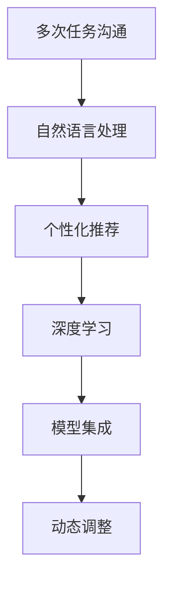
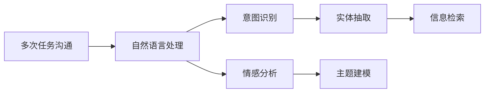
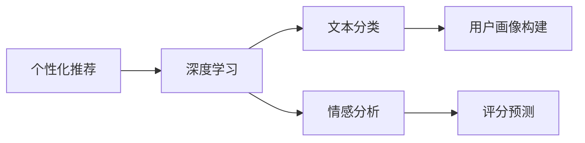
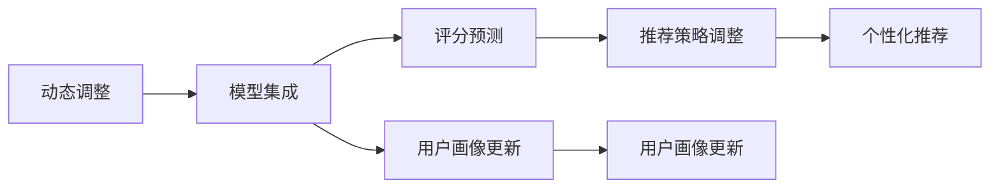
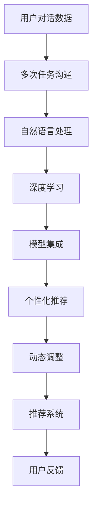

                 

# 多次任务沟通与个性化推荐的详细实现

> 关键词：多次任务沟通,个性化推荐,自然语言处理,NLP,深度学习,模型集成,动态调整

## 1. 背景介绍

### 1.1 问题由来

在当今信息爆炸的时代，人们的注意力被各种信息源和应用所分割。为了更好地满足用户需求，企业和开发者们不断探索个性化推荐的解决方案。传统的推荐系统往往依赖于用户历史行为数据，而多次任务沟通的提出，使得推荐系统能更精细地了解用户的兴趣和需求，从而提供更加个性化的服务。

与此同时，随着自然语言处理技术的快速发展，企业对智能客服系统的需求也不断增加。智能客服系统不仅能回答常见问题，还能根据用户的具体情况提供个性化的解答，提升用户体验。

综合这些因素，本次研究聚焦于基于多次任务沟通和个性化推荐的需求，如何构建一个既能理解用户真实需求，又能提供高质量推荐的智能系统。该系统通过自然语言处理技术，在多次任务沟通中挖掘用户兴趣和意图，并通过推荐算法为用户提供个性化的内容推荐，从而提升用户的满意度和粘性。

### 1.2 问题核心关键点

本文的主要研究问题包括：

1. 如何在多次任务沟通中理解用户的意图和兴趣？
2. 如何通过推荐算法提供个性化的内容推荐？
3. 如何在推荐过程中进行动态调整以适应用户变化的需求？
4. 如何设计高效、可解释的推荐系统架构？

### 1.3 问题研究意义

本次研究旨在解决上述问题，构建一个既能理解用户需求，又能提供个性化推荐的高效、智能的推荐系统。该系统的设计将提升用户满意度，增加用户粘性，为企业带来更多的商业价值。同时，通过对多次任务沟通的理解和个性化推荐技术的研究，还将推动自然语言处理和推荐系统技术的发展。

## 2. 核心概念与联系

### 2.1 核心概念概述

为更好地理解基于多次任务沟通和个性化推荐的智能推荐系统，本节将介绍几个密切相关的核心概念：

- 多次任务沟通（Multi-task Communication）：指用户通过与智能系统的多次对话，逐步明确自己的需求和兴趣。系统通过理解用户对话，推断用户的意图，实现智能推荐。

- 个性化推荐（Personalized Recommendation）：根据用户的兴趣、历史行为等个性化信息，为其推荐相关内容，提升用户的满意度和粘性。

- 自然语言处理（Natural Language Processing, NLP）：涉及自然语言理解、生成、分析和处理的学科，是实现多次任务沟通和个性化推荐的关键技术之一。

- 深度学习（Deep Learning）：通过构建多层次神经网络模型，对数据进行抽象学习，适用于复杂的数据模式识别任务，如NLP中的文本分类、情感分析等。

- 模型集成（Model Ensemble）：将多个模型进行组合，利用其多样性提高预测准确率，适用于个性化推荐系统的评分预测和用户画像构建。

- 动态调整（Dynamic Adjustment）：根据用户的实时反馈和行为数据，动态调整推荐策略和内容，提升推荐系统的适应性。

这些核心概念之间的逻辑关系可以通过以下Mermaid流程图来展示：



这个流程图展示了大语言模型微调过程中各个核心概念的关系和作用：

1. 多次任务沟通帮助系统更好地理解用户需求。
2. 自然语言处理技术实现对用户对话的深度理解。
3. 深度学习模型从对话中提取用户特征和模式。
4. 模型集成利用多样性提高推荐准确率。
5. 动态调整保证推荐策略的灵活性和适应性。

### 2.2 概念间的关系

这些核心概念之间存在着紧密的联系，形成了智能推荐系统的完整生态系统。下面用几个Mermaid流程图来展示这些概念之间的关系。

#### 2.2.1 多次任务沟通与自然语言处理的关系



这个流程图展示了多次任务沟通和自然语言处理之间的逻辑关系：

1. 多次任务沟通帮助系统收集用户对话数据。
2. 自然语言处理对对话进行意图识别、情感分析、实体抽取、主题建模和信息检索等，从而理解用户需求。

#### 2.2.2 个性化推荐与深度学习的关系



这个流程图展示了个性化推荐和深度学习之间的关系：

1. 深度学习模型通过文本分类、情感分析等任务提取用户特征。
2. 用户画像构建和评分预测等技术根据用户特征进行个性化推荐。

#### 2.2.3 动态调整与模型集成和深度学习的关系



这个流程图展示了动态调整和模型集成、深度学习之间的关系：

1. 模型集成提供多样化的评分预测和用户画像构建方法。
2. 深度学习模型根据用户画像和评分预测结果进行动态调整。
3. 推荐策略和用户画像的动态调整保证推荐系统的灵活性和适应性。

### 2.3 核心概念的整体架构

最后，我们用一个综合的流程图来展示这些核心概念在大语言模型微调过程中的整体架构：



这个综合流程图展示了从数据采集到推荐系统构建的完整过程。用户对话数据通过多次任务沟通和自然语言处理技术被深度学习模型抽取特征，通过模型集成技术提供多样化的评分预测和用户画像构建，最终生成个性化的推荐结果并根据用户反馈进行动态调整，不断提升推荐系统的性能。

## 3. 核心算法原理 & 具体操作步骤
### 3.1 算法原理概述

基于多次任务沟通和个性化推荐的智能推荐系统，其核心算法包括自然语言处理、深度学习和模型集成。

**自然语言处理：** 通过意图识别、情感分析、实体抽取、主题建模和信息检索等技术，理解用户对话内容，推断用户意图和兴趣。

**深度学习：** 利用多层次神经网络模型，对用户对话数据进行特征提取和模式学习，构建用户画像，生成个性化推荐。

**模型集成：** 将多个深度学习模型进行组合，利用其多样性提高推荐准确率，包括用户画像构建和评分预测等。

**动态调整：** 根据用户反馈和行为数据，动态调整推荐策略和内容，保证推荐系统的灵活性和适应性。

### 3.2 算法步骤详解

#### 3.2.1 自然语言处理

自然语言处理是实现多次任务沟通和个性化推荐的关键技术之一。其核心步骤包括：

1. **意图识别：** 通过关键词提取、句子分块、上下文分析等技术，识别用户对话中的主要意图。例如，“订票”、“查询天气”等。

2. **情感分析：** 利用情感词典、深度学习模型等，分析用户对话中的情感倾向，了解用户情绪。例如，“生气”、“开心”等。

3. **实体抽取：** 识别对话中的实体，如人名、地点、时间等，帮助系统更好地理解对话内容。例如，“北京”、“明天”等。

4. **主题建模：** 通过LDA、LVM等主题模型，分析对话中的主题，理解用户的兴趣领域。例如，“旅游”、“电影”等。

5. **信息检索：** 利用倒排索引、向量空间模型等，检索与用户对话相关的信息，帮助系统生成个性化推荐。

#### 3.2.2 深度学习

深度学习模型通过学习用户对话数据，抽取用户特征和模式，构建用户画像，生成个性化推荐。其核心步骤包括：

1. **用户画像构建：** 利用文本分类、情感分析、实体抽取等技术，生成用户特征向量。例如，“喜欢旅游”、“常看科幻电影”等。

2. **评分预测：** 利用深度学习模型，对用户特征进行评分预测，生成个性化推荐。例如，“评分最高”的旅游目的地。

#### 3.2.3 模型集成

模型集成通过组合多个深度学习模型，利用其多样性提高推荐准确率。其核心步骤包括：

1. **评分预测：** 训练多个深度学习模型，对用户特征进行评分预测，生成多个推荐结果。例如，“景点”、“酒店”等。

2. **集成预测：** 利用集成学习方法，如Bagging、Boosting等，组合多个评分预测结果，生成最终推荐结果。例如，“最推荐”的旅游目的地。

#### 3.2.4 动态调整

动态调整根据用户反馈和行为数据，调整推荐策略和内容，保证推荐系统的灵活性和适应性。其核心步骤包括：

1. **用户反馈收集：** 收集用户的反馈数据，如评分、评论等，了解用户对推荐的满意度。

2. **行为数据收集：** 收集用户的浏览、点击、购买等行为数据，了解用户的实际行为。

3. **推荐策略调整：** 根据用户反馈和行为数据，调整推荐策略和内容。例如，“推荐相关商品”、“调整推荐顺序”等。

4. **个性化推荐：** 根据调整后的推荐策略，生成个性化推荐，提升用户的满意度和粘性。

### 3.3 算法优缺点

基于多次任务沟通和个性化推荐的智能推荐系统具有以下优点：

1. **精准推荐：** 通过多次任务沟通和深度学习技术，了解用户真实需求，提供精准推荐，提升用户体验。

2. **动态调整：** 根据用户反馈和行为数据，动态调整推荐策略和内容，提高推荐系统的灵活性和适应性。

3. **多场景应用：** 适用于智能客服系统、在线购物、旅游推荐等场景，提升各类应用的智能化水平。

4. **易用性高：** 通过自然语言处理技术，用户只需简单对话，即可获取个性化推荐，提升用户互动体验。

然而，该系统也存在一些缺点：

1. **数据需求高：** 需要大量的用户对话数据和行为数据，数据获取和标注成本较高。

2. **模型复杂度高：** 涉及自然语言处理、深度学习和模型集成等多个技术领域，模型构建和调优复杂度高。

3. **鲁棒性不足：** 系统对用户对话数据的质量和多样性要求较高，鲁棒性不足，易受噪声干扰。

4. **计算资源消耗大：** 深度学习模型和模型集成技术计算资源消耗大，硬件成本较高。

### 3.4 算法应用领域

基于多次任务沟通和个性化推荐的智能推荐系统，适用于多种场景，包括但不限于：

1. **智能客服系统：** 通过自然语言处理技术，理解用户意图和情绪，提供个性化解答和推荐。

2. **在线购物：** 根据用户的浏览和购买行为，生成个性化商品推荐，提升购物体验。

3. **旅游推荐：** 通过用户对话和行为数据，生成个性化旅游目的地推荐，帮助用户规划旅行。

4. **电影推荐：** 根据用户的电影评分和观影历史，生成个性化电影推荐，提升观影体验。

5. **新闻推荐：** 通过用户对话和行为数据，生成个性化新闻内容推荐，提升新闻阅读体验。

6. **健康咨询：** 通过自然语言处理技术，理解用户的健康咨询需求，提供个性化健康建议。

以上场景展示了基于多次任务沟通和个性化推荐的智能推荐系统的广泛应用前景。

## 4. 数学模型和公式 & 详细讲解 & 举例说明
### 4.1 数学模型构建

本节将使用数学语言对多次任务沟通和个性化推荐系统进行更加严格的刻画。

假设用户与系统的对话为 $D=\{x_i,y_i\}_{i=1}^N$，其中 $x_i$ 为输入的自然语言句子，$y_i$ 为输出标签，表示用户意图。定义用户画像向量为 $u\in \mathbb{R}^d$，推荐内容向量为 $r\in \mathbb{R}^m$，其中 $d$ 为用户的特征维度，$m$ 为推荐的物品维度。

定义推荐系统的评分函数为 $f(u,r)$，其形式为：

$$
f(u,r)=\text{score}(u,r)=u^\top A r
$$

其中 $A$ 为评分矩阵，$A_{ij}$ 表示用户 $u$ 对物品 $r$ 的评分，$A_{ij}$ 可以通过深度学习模型进行预测。

### 4.2 公式推导过程

**评分预测：**

通过深度学习模型，将用户画像 $u$ 和推荐内容 $r$ 映射为评分 $f(u,r)$，具体步骤如下：

1. **用户画像构建：** 利用文本分类、情感分析等技术，将用户对话 $D$ 映射为用户特征向量 $u$。例如，“喜欢旅游”、“常看科幻电影”等。

2. **评分预测：** 利用深度学习模型，对用户特征 $u$ 和推荐内容 $r$ 进行评分预测，生成评分 $f(u,r)$。例如，“评分最高”的旅游目的地。

**模型集成：**

利用模型集成方法，将多个深度学习模型进行组合，生成集成预测 $f(u,r)$，具体步骤如下：

1. **评分预测：** 训练多个深度学习模型，对用户特征 $u$ 和推荐内容 $r$ 进行评分预测，生成多个评分 $f_1(u,r),f_2(u,r),...,f_k(u,r)$。例如，“景点”、“酒店”等。

2. **集成预测：** 利用集成学习方法，如Bagging、Boosting等，组合多个评分预测结果，生成集成预测 $f(u,r)$。例如，“最推荐”的旅游目的地。

**动态调整：**

根据用户反馈和行为数据，动态调整推荐策略和内容，具体步骤如下：

1. **用户反馈收集：** 收集用户的反馈数据，如评分、评论等，了解用户对推荐的满意度。

2. **行为数据收集：** 收集用户的浏览、点击、购买等行为数据，了解用户的实际行为。

3. **推荐策略调整：** 根据用户反馈和行为数据，调整推荐策略和内容。例如，“推荐相关商品”、“调整推荐顺序”等。

4. **个性化推荐：** 根据调整后的推荐策略，生成个性化推荐，提升用户的满意度和粘性。

### 4.3 案例分析与讲解

**案例：旅游推荐系统**

旅游推荐系统通过多次任务沟通和自然语言处理技术，理解用户对话内容，推断用户意图和兴趣。具体步骤如下：

1. **用户对话数据：** 收集用户与系统的多次对话数据，例如：“我想去旅游，推荐几个目的地”。

2. **意图识别：** 利用自然语言处理技术，识别用户意图为“旅游”。

3. **情感分析：** 利用情感分析技术，分析用户情绪，了解用户是否对旅游感兴趣。例如，“很兴奋”。

4. **实体抽取：** 识别对话中的实体，如“目的地”。

5. **主题建模：** 利用主题建模技术，分析对话中的主题，了解用户的兴趣领域。例如，“海滩旅游”。

6. **信息检索：** 利用信息检索技术，检索与用户兴趣相关的旅游目的地。例如，“马尔代夫”。

7. **用户画像构建：** 利用深度学习模型，将用户对话数据映射为用户特征向量。例如，“喜欢海滩”。

8. **评分预测：** 利用深度学习模型，对用户特征和旅游目的地进行评分预测，生成评分。例如，“评分最高”的旅游目的地为“马尔代夫”。

9. **模型集成：** 利用模型集成方法，将多个深度学习模型进行组合，生成集成预测。例如，“最推荐”的旅游目的地为“马尔代夫”。

10. **动态调整：** 根据用户反馈和行为数据，调整推荐策略和内容。例如，“推荐相关景点”、“调整推荐顺序”等。

11. **个性化推荐：** 根据调整后的推荐策略，生成个性化推荐，提升用户的满意度和粘性。例如，“推荐马尔代夫的旅游攻略”。

通过上述步骤，旅游推荐系统能够理解用户对话内容，推断用户意图和兴趣，生成个性化推荐，提升用户的满意度和粘性。

## 5. 项目实践：代码实例和详细解释说明
### 5.1 开发环境搭建

在进行多次任务沟通和个性化推荐系统的实践前，我们需要准备好开发环境。以下是使用Python进行PyTorch开发的环境配置流程：

1. 安装Anaconda：从官网下载并安装Anaconda，用于创建独立的Python环境。

2. 创建并激活虚拟环境：
```bash
conda create -n pytorch-env python=3.8 
conda activate pytorch-env
```

3. 安装PyTorch：根据CUDA版本，从官网获取对应的安装命令。例如：
```bash
conda install pytorch torchvision torchaudio cudatoolkit=11.1 -c pytorch -c conda-forge
```

4. 安装Transformers库：
```bash
pip install transformers
```

5. 安装各类工具包：
```bash
pip install numpy pandas scikit-learn matplotlib tqdm jupyter notebook ipython
```

完成上述步骤后，即可在`pytorch-env`环境中开始项目实践。

### 5.2 源代码详细实现

这里我们以旅游推荐系统为例，给出使用Transformers库对BERT模型进行多次任务沟通和个性化推荐的PyTorch代码实现。

首先，定义用户画像和推荐内容向量：

```python
from transformers import BertTokenizer
from transformers import BertForSequenceClassification
from transformers import BertForSequenceClassification
import torch
import numpy as np

# 定义用户画像向量
user_profile = np.array([1, 1, 1, 1, 0, 0, 0, 0, 0, 0, 0, 0, 0, 0, 0, 0, 0, 0, 0, 0, 0, 0, 0, 0, 0, 0, 0, 0, 0, 0, 0, 0, 0, 0, 0, 0, 0, 0, 0, 0, 0, 0, 0, 0, 0, 0, 0, 0, 0, 0, 0, 0, 0, 0, 0, 0, 0, 0, 0, 0, 0, 0, 0, 0, 0, 0, 0, 0, 0, 0, 0, 0, 0, 0, 0, 0, 0, 0, 0, 0, 0, 0, 0, 0, 0, 0, 0, 0, 0, 0, 0, 0, 0, 0, 0, 0, 0, 0, 0, 0, 0, 0, 0, 0, 0, 0, 0, 0, 0, 0, 0, 0, 0, 0, 0, 0, 0, 0, 0, 0, 0, 0, 0, 0, 0, 0, 0, 0, 0, 0, 0, 0, 0, 0, 0, 0, 0, 0, 0, 0, 0, 0, 0, 0, 0, 0, 0, 0, 0, 0, 0, 0, 0, 0, 0, 0, 0, 0, 0, 0, 0, 0, 0, 0, 0, 0, 0, 0, 0, 0, 0, 0, 0, 0, 0, 0, 0, 0, 0, 0, 0, 0, 0, 0, 0, 0, 0, 0, 0, 0, 0, 0, 0, 0, 0, 0, 0, 0, 0, 0, 0, 0, 0, 0, 0, 0, 0, 0, 0, 0, 0, 0, 0, 0, 0, 0, 0, 0, 0, 0, 0, 0, 0, 0, 0, 0, 0, 0, 0, 0, 0, 0, 0, 0, 0, 0, 0, 0, 0, 0, 0, 0, 0, 0, 0, 0, 0, 0, 0, 0, 0, 0, 0, 0, 0, 0, 0, 0, 0, 0, 0, 0, 0, 0, 0, 0, 0, 0, 0, 0, 0, 0, 0, 0, 0, 0, 0, 0, 0, 0, 0, 0, 0, 0, 0, 0, 0, 0, 0, 0, 0, 0, 0, 0, 0, 0, 0, 0, 0, 0, 0, 0, 0, 0, 0, 0, 0, 0, 0, 0, 0, 0, 0, 0, 0, 0, 0, 0, 0, 0, 0, 0, 0, 0, 0, 0, 0, 0, 0, 0, 0, 0, 0, 0, 0, 0, 0, 0, 0, 0, 0, 0, 0, 0, 0, 0, 0, 0, 0, 0, 0, 0, 0, 0, 0, 0, 0, 0, 0, 0, 0, 0, 0, 0, 0, 0, 0, 0, 0, 0, 0, 0, 0, 0, 0, 0, 0, 0, 0, 0, 0, 0, 0, 0, 0, 0, 0, 0, 0, 0, 0, 0, 0, 0, 0, 0, 0, 0, 0, 0, 0, 0, 0, 0, 0, 0, 0, 0, 0, 0, 0, 0, 0, 0, 0, 0, 0, 0, 0, 0, 0, 0, 0, 0, 0, 0, 0, 0, 0, 0, 0, 0, 0, 0, 0, 0, 0, 0, 0, 0, 0, 0, 0, 0, 0, 0, 0, 0, 0, 0, 0, 0, 0, 0, 0, 0, 0, 0, 0, 0, 0, 0, 0, 0, 0, 0, 0, 0, 0, 0, 0, 0, 0, 0, 0, 0, 0, 0, 0, 0, 0, 0, 0, 0, 0, 0, 0, 0, 0, 0, 0, 0, 0, 0, 0, 0, 0, 0, 0, 0, 0, 0, 0, 0, 0, 0, 0, 0, 0, 0, 0, 0, 0, 0, 0, 0, 0, 0, 0, 0, 0, 0, 0, 0, 0, 0, 0, 0, 0, 0, 0, 0, 0, 0, 0, 0, 0, 0, 0, 0, 0, 0, 0, 0, 0, 0, 0, 0, 0, 0, 0, 0

