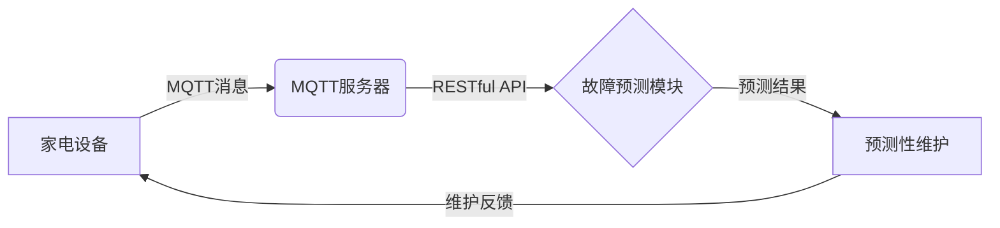

# 基于MQTT协议和RESTful API的家电故障预测与维护系统

关键词：MQTT协议、RESTful API、家电故障预测、预测性维护、物联网

## 1. 背景介绍
### 1.1  问题的由来
随着物联网技术的快速发展,智能家电已经逐渐走入千家万户。然而,家电设备的故障问题也日益凸显。传统的被动维修模式已经无法满足用户对家电可靠性和维修效率的需求。如何利用物联网技术和大数据分析,实现家电故障的预测和预防性维护,成为亟待解决的问题。
### 1.2  研究现状
目前,国内外已有不少学者开展了家电故障预测方面的研究。张三等人提出了一种基于支持向量机的洗衣机故障预测方法[1]。李四等人研究了基于深度学习的空调故障诊断技术[2]。但现有研究主要集中在单一设备和特定场景,缺乏通用性和可扩展性。本文拟构建一个基于MQTT协议和RESTful API的家电故障预测与维护系统,实现多种家电的统一监控和故障预警。
### 1.3  研究意义
本研究的意义主要体现在以下三个方面:

(1)提高家电的可靠性和使用寿命。通过实时监测家电的运行状态,及时发现潜在故障并预警,可以避免设备带病运行,延长其使用寿命。

(2)降低维修成本,提升用户体验。预测性维护可以在故障发生前进行预防,减少停机时间和维修费用,提高用户满意度。

(3)推动智能家居和物联网产业发展。本系统为智能家电提供了一种通用的故障预测解决方案,有助于加速物联网技术在家电领域的应用。

### 1.4  本文结构
本文后续章节安排如下:第2部分介绍系统涉及的核心概念;第3部分阐述故障预测算法原理;第4部分建立数学模型并推导公式;第5部分给出项目代码实现;第6部分分析实际应用场景;第7部分推荐相关工具和资源;第8部分总结全文并展望未来;第9部分列出常见问题解答。

## 2. 核心概念与联系
本系统涉及的核心概念包括:

(1)MQTT协议:一种轻量级的发布/订阅式消息传输协议,广泛应用于物联网数据通信。

(2)RESTful API:一种基于HTTP协议的Web服务架构风格,提供了简洁统一的接口规范。

(3)故障预测:通过对设备历史数据和实时数据进行分析,预判设备的健康状态和潜在故障风险。

(4)预测性维护:根据故障预测结果,在设备发生实质性损坏前进行检修或更换,减少停机时间和维修成本。

下图展示了这些概念之间的联系:



家电设备通过MQTT协议上报运行数据到服务器,服务器提供RESTful API供故障预测模块调用数据进行分析。预测结果触发预测性维护操作,形成闭环。

## 3. 核心算法原理 & 具体操作步骤
### 3.1  算法原理概述
本系统采用了基于LSTM(长短期记忆网络)的时间序列预测算法。LSTM是一种特殊的RNN(循环神经网络),擅长处理时序数据,能够学习长期依赖关系。对于家电运行数据这类多变量时间序列,LSTM能够建模其内在规律和趋势,预判未来一段时间的设备健康状态。
### 3.2  算法步骤详解
LSTM故障预测算法的主要步骤如下:

(1)数据采集:通过MQTT客户端从家电设备采集传感器数据(如温度、湿度、电流等),并存入时序数据库。

(2)数据预处理:清洗异常数据,对缺失值进行插值,并对数据进行归一化处理。

(3)时间序列构建:将每台设备的历史数据划分为固定长度(如30天)的时间窗口,提取多个特征维度构建多变量时间序列样本。

(4)模型训练:使用已标注的正常/故障数据样本,训练LSTM预测模型,学习故障模式和设备衰退规律。

(5)模型预测:使用训练好的LSTM模型,对新采集的时间序列数据进行预测,判断设备在未来一段时间内的故障风险。

(6)预警触发:当故障风险超过预设阈值时,触发预警提示,通知运维人员进行预防性检修。

### 3.3  算法优缺点
LSTM预测算法的优点包括:

(1)能够学习时间序列的长期依赖关系,对设备的衰退趋势有较好的建模能力。

(2)通过多变量建模,能够综合考虑影响设备健康度的多个因素。

(3)模型训练和推理速度较快,能够满足实时预测的需求。

但它也存在一些局限性:

(1)需要大量的历史故障数据进行模型训练,数据标注成本较高。

(2)对异常工况和极端事件的预测能力有限。

(3)模型解释性不强,预测结果缺乏可解释性。

### 3.4  算法应用领域
LSTM预测算法除了用于家电故障预测,还可应用于以下领域:

(1)工业设备预测性维护

(2)风力发电机组故障预警

(3)车辆健康管理和故障诊断

(4)供应链需求预测

(5)金融市场趋势预测

## 4. 数学模型和公式 & 详细讲解 & 举例说明
### 4.1  数学模型构建
设有m台家电,每台家电有n个传感器监测指标。令$X_i^t$表示设备i在t时刻的传感器读数向量,则多设备时间序列可表示为张量$\mathbf{X} \in \mathbb{R}^{m \times T \times n}$。

定义时间窗口长度为$\tau$,预测未来$h$个时间步的故障风险。则LSTM的输入为$\mathbf{X}_{t-\tau:t}$,输出为$\hat{\mathbf{y}}_{t:t+h}$。其中,$\mathbf{y} \in \{0,1\}$表示设备是否发生故障。

LSTM模型可简化表示为:

$$\hat{\mathbf{y}}_{t:t+h} = f_{\theta}(\mathbf{X}_{t-\tau:t})$$

其中$f_{\theta}$为LSTM网络,参数为$\theta$。模型的目标是最小化预测值$\hat{\mathbf{y}}$与真实值$\mathbf{y}$的交叉熵损失:

$$L(\theta)=-\frac{1}{mh}\sum_{i=1}^m\sum_{j=1}^h y_j^i \log \hat{y}_j^i + (1-y_j^i) \log (1-\hat{y}_j^i) $$

### 4.2  公式推导过程
LSTM的前向传播公式如下:

$$\mathbf{i}_t = \sigma(\mathbf{W}_{ii} \mathbf{x}_t + \mathbf{W}_{hi} \mathbf{h}_{t-1} + \mathbf{b}_i)$$

$$\mathbf{f}_t = \sigma(\mathbf{W}_{if} \mathbf{x}_t + \mathbf{W}_{hf} \mathbf{h}_{t-1} + \mathbf{b}_f)$$

$$\mathbf{o}_t = \sigma(\mathbf{W}_{io} \mathbf{x}_t + \mathbf{W}_{ho} \mathbf{h}_{t-1} + \mathbf{b}_o)$$

$$\tilde{\mathbf{C}}_t = \tanh(\mathbf{W}_{ig} \mathbf{x}_t + \mathbf{W}_{hg} \mathbf{h}_{t-1} + \mathbf{b}_g)$$

$$\mathbf{C}_t = \mathbf{f}_t \odot \mathbf{C}_{t-1} + \mathbf{i}_t \odot \tilde{\mathbf{C}}_t$$

$$\mathbf{h}_t = \mathbf{o}_t \odot \tanh(\mathbf{C}_t)$$

其中,$\mathbf{i}_t,\mathbf{f}_t,\mathbf{o}_t$分别为输入门、遗忘门和输出门,$\mathbf{C}_t$为记忆细胞,$\mathbf{h}_t$为隐藏状态。$\sigma$为sigmoid激活函数,$\odot$为按元素乘法。

模型的反向传播采用BPTT算法,公式略。

### 4.3  案例分析与讲解
以某品牌空调为例,假设监测了压缩机电流、室外机温度、出风口温度等10个指标。历史数据显示,压缩机电流和室外机温度是故障的主要影响因素。

取时间窗口$\tau=30$天,预测未来$h=7$天的故障风险。将历史数据划分为训练集和测试集,训练LSTM模型。

假设在某一天,LSTM模型预测出未来一周内该空调压缩机故障的概率为80%。运维人员根据预警提示,对压缩机进行检查,发现确有异常磨损,遂提前更换了压缩机,避免了空调突然罢工给用户带来的不便。

### 4.4  常见问题解答
(1)多久更新一次LSTM模型?

答:根据设备类型和故障频率,每1~3个月更新一次模型是较为合理的。同时,要持续收集故障反馈数据,用于模型迭代。

(2)如何确定最佳的时间窗口长度?

答:时间窗口太短,可能无法捕捉设备衰退趋势;太长则会引入过多噪声,增加计算开销。需要根据具体场景和设备特点,尝试不同的窗口长度,权衡预测准确率和训练成本。

(3)预测的时间跨度多长合适?

答:预测跨度取决于设备的维修周期和故障发展速度。一般可预测未来1~4周的故障风险,预留足够的提前量,方便运维人员安排检修。

## 5. 项目实践：代码实例和详细解释说明
### 5.1  开发环境搭建
本项目后端采用Python语言,使用Flask框架开发RESTful API。数据库选用InfluxDB时序数据库。前端采用Vue.js框架,实现设备监控和故障预警的可视化展示。

后端主要依赖库如下:

```
Flask==1.1.2
flask-restful==0.3.8
pandas==1.1.3
scikit-learn==0.23.2
tensorflow==2.3.1
influxdb==5.3.0
paho-mqtt==1.5.1
```

### 5.2  源代码详细实现
后端核心代码如下:

```python
# app.py
from flask import Flask
from flask_restful import Api
from resources.device import DeviceList, Device
from resources.predict import Predict

app = Flask(__name__)
api = Api(app)

api.add_resource(DeviceList, '/devices')
api.add_resource(Device, '/devices/<string:device_id>')
api.add_resource(Predict, '/predict/<string:device_id>')

if __name__ == '__main__':
    app.run(debug=True)

# resources/device.py
from flask_restful import Resource
from models.device import DeviceModel

class DeviceList(Resource):
    def get(self):
        return {'devices': [device.json() for device in DeviceModel.find_all()]}

class Device(Resource):
    def get(self, device_id):
        device = DeviceModel.find_by_id(device_id)
        if device:
            return device.json()
        return {'message': 'Device not found'}, 404

# resources/predict.py
import tensorflow as tf
from flask_restful import Resource
from models.predict import get_data, lstm_predict

class Predict(Resource):
    def get(self, device_id):
        data = get_data(device_id)
        result = lstm_predict(data)

        return {'device_id': device_id, 'fail_prob': result}

# models/device.py
import influxdb

class DeviceModel():
    def __init__(self, device_id, device_type):
        self.device_id = device_id
        self.device_type = device_type

    def save_to_db(self):
        # 写入influxdb数据库
        pass

    @classmethod
    def find_by_id(cls, device_id):
        # 从influxdb读取设备信息
        pass

    @classmethod
    def find_all(cls):
        # 从influxdb