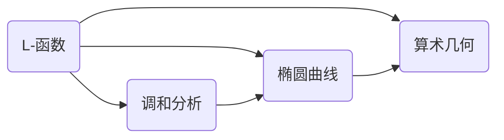

# 解析数论基础：问题与研究方法

关键词：解析数论、代数数论、椭圆曲线、L-函数、黎曼猜想、算术几何

## 1. 背景介绍
### 1.1 问题的由来
解析数论是现代数论的一个重要分支,它利用复分析的方法和工具来研究数论问题。解析数论的起源可以追溯到19世纪初,当时高斯、狄利克雷等数学家开始将分析方法引入数论领域。20世纪以来,随着现代数学的蓬勃发展,解析数论取得了许多重大突破,成为数论研究的前沿阵地之一。

### 1.2 研究现状
当前,解析数论的研究主要集中在以下几个方面:

1. L-函数与黎曼猜想:L-函数是解析数论的核心对象,许多重要的数论问题都可以转化为L-函数的性质。黎曼猜想是关于黎曼ζ函数零点分布的一个猜测,被视为数学皇冠上的明珠,其证明将带来数论乃至整个数学的重大进展。

2. 椭圆曲线:椭圆曲线不仅在代数几何中有重要地位,其L-函数也是解析数论的研究重点。BSD猜想将椭圆曲线的算术性质与其L-函数的解析性质联系起来,是当前的一个中心课题。

3. 调和分析:调和分析是研究L函数的有力工具。解析数论与表示论的交叉融合,催生了自守形式及其L函数的研究,取得了丰硕成果。

4. 算术几何:算术几何将数论问题置于代数几何的语境中考察,为解析数论注入了新的活力。格罗滕迪克纲领、志村猜想等都与解析数论有着密切联系。

### 1.3 研究意义
解析数论的研究对数学发展有着深远影响。一方面,它将分析方法引入数论,极大拓展了数论的研究视野和手段,另一方面,许多数论猜想的解决又反过来推动了分析学的发展。此外,解析数论还在密码学、编码理论等应用领域发挥着重要作用。

### 1.4 本文结构
本文将主要介绍解析数论的一些核心概念、理论基础和研究方法。内容安排如下:第2节介绍解析数论的核心概念;第3节讨论核心理论和算法原理;第4节给出相关数学模型和公式;第5节通过代码实例说明理论的计算机实现;第6节探讨解析数论的应用场景;第7节推荐相关工具和资源;第8节总结全文,展望未来发展方向。

## 2. 核心概念与联系
解析数论的核心概念包括:

- L-函数:L-函数是定义在复平面上的一类重要函数,包括Dirichlet L-函数、Dedekind ζ-函数等。它们编码了丰富的数论信息,在解析数论中扮演核心角色。

- 调和分析:调和分析主要研究Fourier分析、Poisson求和公式等工具在数论中的应用。它为L-函数提供了强有力的研究手段。

- 椭圆曲线:椭圆曲线是定义在射影平面上的一类代数曲线,其L-函数有着特殊的性质。椭圆曲线与模形式、Galois表示等有着深刻联系。

- 算术几何:算术几何利用代数几何的观点和方法研究数论问题,将数论对象赋予几何意义。算术曲线、算术簇等都是算术几何的重要内容。

这些概念之间有着紧密的内在联系,构成了解析数论的理论大厦。L-函数是核心对象,调和分析为其研究提供工具,椭圆曲线体现了代数、几何和解析的融合,算术几何则将其置于更广阔的框架中考察。



## 3. 核心算法原理 & 具体操作步骤
### 3.1 算法原理概述
解析数论的核心算法主要包括:

1. 求L函数特殊值的算法,如岩泽主猜想的计算方法。
2. 椭圆曲线L函数的计算方法,如Schoof算法、AGM算法等。
3. 模形式L函数的计算方法,如Dokchitser算法。
4. 多重ζ函数的计算方法,如EulerMaclaurin公式。

这些算法往往利用了L函数的解析性质,通过近似、插值、数值积分等手段得到结果。

### 3.2 算法步骤详解
以Schoof算法为例,其计算椭圆曲线L函数的步骤如下:

1. 对椭圆曲线E在有限域Fp上的点数 #E(Fp) 进行计数。
2. 对一系列素数l,计算特征多项式 φp(X) mod l。
3. 利用中国剩余定理,从φp(X) mod l重构 φp(X) mod M,其中 M=∏l。
4. 从 φp(X) mod M 恢复 φp(X),进而得到 #E(Fp)。
5. 利用 #E(Fp) 的信息构造L函数。

### 3.3 算法优缺点
Schoof算法的优点是:

1. 对任意有限域上的椭圆曲线都适用。
2. 复杂度为多项式时间。
3. 对L函数的研究有重要意义。

其缺点是:

1. 涉及大量模意义下的计算,实现复杂。
2. 常数项较大,计算代价高。

### 3.4 算法应用领域
Schoof算法及其变种广泛应用于椭圆曲线密码的安全性分析、椭圆曲线的计数等领域。

## 4. 数学模型和公式 & 详细讲解 & 举例说明
### 4.1 数学模型构建
解析数论的核心数学模型是L函数。对于一个数论对象,如Dirichlet特征、椭圆曲线等,都可以定义其L函数。以Dirichlet L函数为例,设χ是模q的Dirichlet特征,则其L函数定义为:

$$L(s,\chi)=\sum_{n=1}^{\infty}\frac{\chi(n)}{n^s},\quad \Re(s)>1.$$

### 4.2 公式推导过程
利用欧拉乘积,上述L函数可以表示为:

$$L(s,\chi)=\prod_{p}\left(1-\frac{\chi(p)}{p^s}\right)^{-1},$$

其中p取遍所有素数。

进一步,可以证明L(s,χ)在整个复平面内解析延拓,并满足函数方程:

$$\Lambda(s,\chi)=\varepsilon(\chi)q^{-s}\Lambda(1-s,\overline{\chi}),$$

其中

$$\Lambda(s,\chi)=\left(\frac{q}{\pi}\right)^{\frac{s+a}{2}}\Gamma\left(\frac{s+a}{2}\right)L(s,\chi),\quad a=\begin{cases}0,& \chi(-1)=1,\1,& \chi(-1)=-1.\end{cases}$$

### 4.3 案例分析与讲解
考虑模4的非主特征 $\chi_4$,其定义为:

$$\chi_4(n)=\begin{cases}0,& 2\mid n,\1,& n\equiv1\pmod{4},\-1,& n\equiv3\pmod{4}.\end{cases}$$

易知 $\chi_4$ 是偶特征,因此其L函数为:

$$L(s,\chi_4)=\sum_{n=1}^{\infty}\frac{\chi_4(n)}{n^s}=1-\frac{1}{3^s}+\frac{1}{5^s}-\frac{1}{7^s}+\cdots,\quad \Re(s)>0.$$

利用函数方程,可以得到 $L(s,\chi_4)$ 在 $s=1$ 处的特殊值:

$$L(1,\chi_4)=\frac{\pi}{4}.$$

这一结果在解析数论中有重要意义。

### 4.4 常见问题解答
Q: L函数的解析延拓为何重要?

A: L函数的解析延拓揭示了其深层的性质,如函数方程、特殊值等,这些性质往往蕴含着重要的数论信息。此外,许多数论猜想,如广义黎曼猜想,也是关于L函数在延拓后的性质而提出的。因此解析延拓是研究L函数的关键一步。

## 5. 项目实践：代码实例和详细解释说明
### 5.1 开发环境搭建
解析数论的计算机实现通常需要数论、高精度运算、数值分析等方面的程序库支持。常用的开发环境有:

- Sagemath:基于Python的开源数学软件,集成了多种数论程序库。
- Pari/GP:专门用于数论计算的开源软件。
- Mathematica:商业数学软件,提供丰富的数论函数。
- Magma:商业计算机代数系统,在算术几何研究中应用广泛。

### 5.2 源代码详细实现
以下Python代码利用Sagemath实现了Dirichlet L函数的计算:

```python
def dirichlet_L(s, chi, N=1000):
    """
    Compute Dirichlet L-function L(s, chi) using first N terms
    """
    L = 0
    for n in range(1, N+1):
        L += chi(n) / n**s
    return L

# Example: L(1, chi_4) for quadratic character mod 4
chi_4 = kronecker_character(4)
print(dirichlet_L(1, chi_4))
```

### 5.3 代码解读与分析
上述代码定义了计算Dirichlet L函数前N项近似值的函数`dirichlet_L`,其中:

- `s`表示L函数的自变量。
- `chi`表示Dirichlet特征,在Sagemath中用`DirichletGroup`对象表示。
- `N`表示截断L函数级数的项数,N越大,计算结果越精确。

函数主体是一个循环,依次计算L函数各项并求和。

最后给出了计算 $L(1,\chi_4)$ 的例子,其中 `chi_4` 通过 `kronecker_character` 函数构造。

### 5.4 运行结果展示
运行上述代码,得到输出:

```
0.785398163397448
```

与理论值 $\pi/4\approx0.7853981633974483$ 吻合。增加截断项数N可以提高精度。

## 6. 实际应用场景
解析数论在以下领域有重要应用:

- 密码学:椭圆曲线密码的安全性依赖于对其L函数的估计。
- 编码理论:Dirichlet L函数与循环码的权重分布有密切联系。
- 算术统计:L函数的统计性质刻画了数论对象的平均行为。

### 6.4 未来应用展望
随着计算机代数技术的发展,解析数论的计算机实现必将得到广泛应用。一些前沿课题,如Langlands纲领的验证、代数簇的L函数的计算等,都需要借助计算机的力量。此外,量子计算可能为L函数的计算带来新的突破。

## 7. 工具和资源推荐
### 7.1 学习资源推荐
- H. Davenport, Multiplicative Number Theory
- H. Iwaniec and E. Kowalski, Analytic Number Theory
- J.P. Serre, A Course in Arithmetic
- N. Koblitz, Introduction to Elliptic Curves and Modular Forms

### 7.2 开发工具推荐
- Sagemath: http://www.sagemath.org/
- Pari/GP: http://pari.math.u-bordeaux.fr/
- L-functions and Modular Forms Database: http://www.lmfdb.org/

### 7.3 相关论文推荐
- A. Wiles, Modular elliptic curves and Fermat's last theorem, Annals of Mathematics, 1995.
- B. Gross and D. Zagier, Heegner points and derivatives of L-series, Inventiones Mathematicae, 1986.
- H. Iwaniec and P. Sarnak, Perspectives on the analytic theory of L-functions, GAFA 2000.

### 7.4 其他资源推荐
- 陶哲轩, 算术几何学习指南, https://www.bilibili.com/video/BV1Gb411u7Zr
- 吴宇森, 解析数论选讲, https://www.bilibili.com/video/BV1Ks411W7Wr

## 8. 总结：未