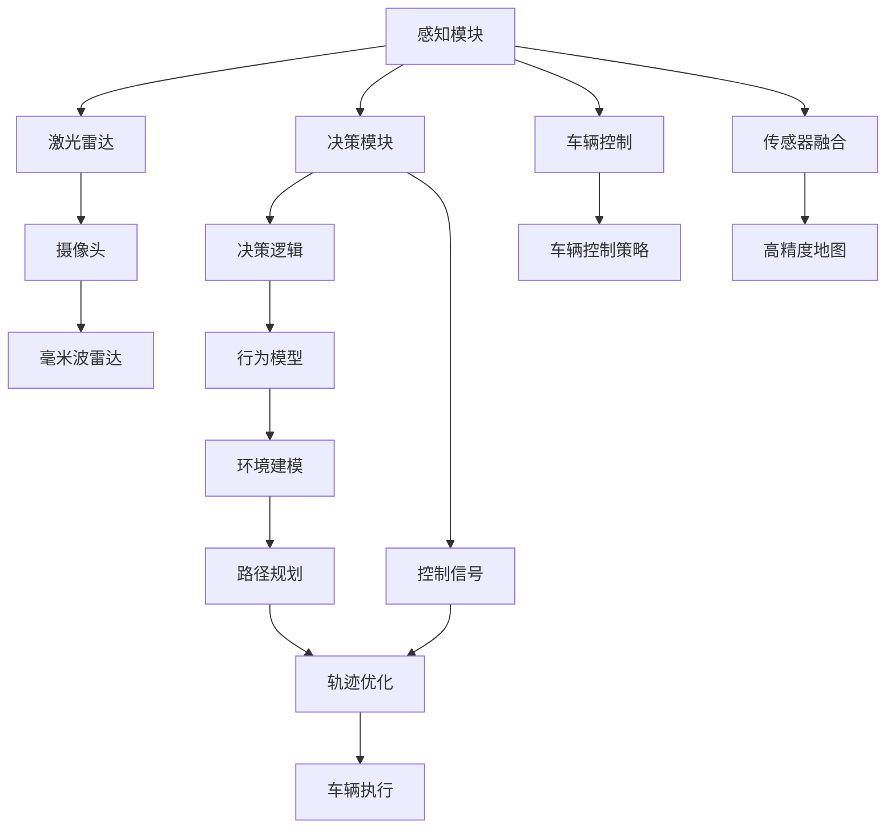
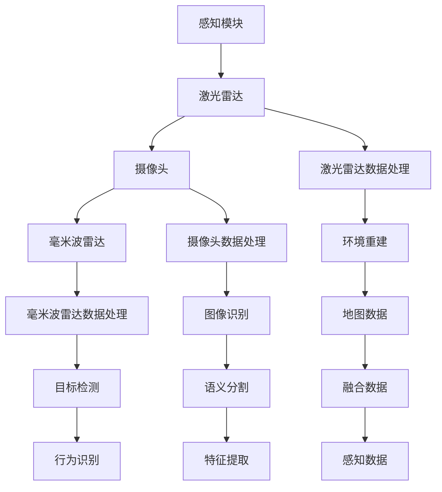
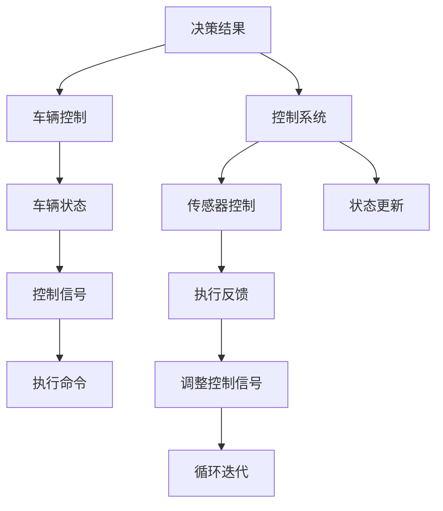
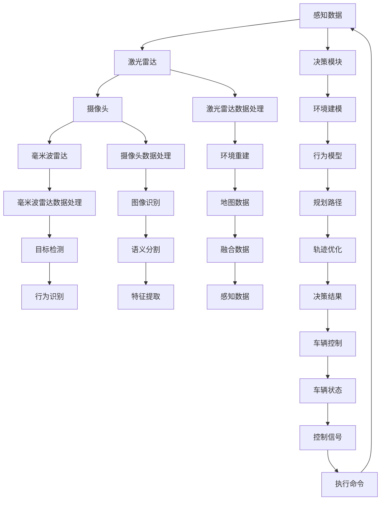

                 

# 端到端自动驾驶的全栈仿真测试平台

> 关键词：自动驾驶,端到端测试,仿真平台,全栈部署,传感器融合,车辆控制

## 1. 背景介绍

### 1.1 问题由来
随着自动驾驶技术的迅猛发展，对车辆在复杂交通环境下的感知、决策、控制能力提出了越来越高的要求。传统的封闭测试、道路测试等手段成本高、效率低，且存在安全风险。因此，利用仿真测试平台进行自动驾驶系统的验证，成为研究热点。

### 1.2 问题核心关键点
本文聚焦于端到端自动驾驶系统的全栈仿真测试平台的构建。具体来说，该平台需要涵盖自动驾驶系统的各个关键组件（如感知、决策、控制、传感器融合等），并提供一套完整的测试流程和工具链，以便进行全链路的仿真测试。

### 1.3 问题研究意义
开发端到端的自动驾驶全栈仿真测试平台，对于推动自动驾驶技术的发展具有重要意义：

1. 提升测试效率：通过仿真平台进行高效的测试，可以大幅度减少实车测试的频率和时间。
2. 降低测试成本：仿真测试可以替代部分实车测试，减少成本和风险。
3. 保障系统安全：仿真平台可以在虚拟环境中进行全方位、多场景的测试，发现潜在的安全隐患和性能问题。
4. 加速技术迭代：仿真测试可以快速验证新的算法和策略，加速技术迭代和系统优化。
5. 支持多车协同：仿真平台支持多车、多传感器数据的融合，支持车辆间的协同控制和交互。

## 2. 核心概念与联系

### 2.1 核心概念概述

为更好地理解端到端自动驾驶全栈仿真测试平台的构建，本节将介绍几个密切相关的核心概念：

- 端到端自动驾驶：从传感器数据输入到车辆控制输出的完整自动驾驶系统，涵盖感知、决策、控制等模块。
- 仿真平台：利用计算机模拟物理世界环境，为自动驾驶系统提供虚拟测试场景。
- 传感器融合：对车辆传感器（如激光雷达、摄像头、毫米波雷达等）的数据进行整合和优化，提升系统鲁棒性和准确性。
- 车辆控制：根据感知和决策结果，输出控制指令，驱动车辆行驶。
- 全栈部署：从底层硬件、操作系统、中间件到上层应用的全系统部署和优化。
- 高精度地图：通过激光雷达等高精度传感器采集并绘制的道路信息，用于环境建模和路径规划。

这些核心概念之间有着紧密的联系，形成了端到端自动驾驶全栈仿真测试平台的整体架构。下面，我们用一个Mermaid流程图来展示这些概念之间的关系：



这个流程图展示了几大核心模块的工作流程和数据流向：

1. 感知模块接收多传感器数据，通过传感器融合得到高精度的环境信息。
2. 决策模块根据感知数据，结合环境建模和行为模型，制定车辆的行驶策略。
3. 车辆控制模块根据决策结果，输出控制信号，驱动车辆行驶。
4. 高精度地图提供准确的路径信息和环境数据，用于路径规划和轨迹优化。

这些模块共同构建了自动驾驶系统的完整链路，通过仿真平台进行全栈部署和测试，可以全面评估系统的性能和可靠性。

### 2.2 概念间的关系

这些核心概念之间存在着紧密的联系，形成了端到端自动驾驶全栈仿真测试平台的完整生态系统。下面我们通过几个Mermaid流程图来展示这些概念之间的关系。

#### 2.2.1 感知模块的详细实现



这个流程图展示了感知模块的详细数据处理流程：

1. 激光雷达、摄像头、毫米波雷达分别进行数据处理，得到原始的环境数据。
2. 传感器数据通过语义分割、行为识别等方法进行特征提取，得到高层次的感知信息。
3. 感知信息与高精度地图融合，得到全局环境模型和局部环境信息。
4. 最终的感知数据用于决策模块，指导车辆的行驶策略。

#### 2.2.2 决策模块的详细实现


这个流程图展示了决策模块的详细数据处理流程：

1. 感知数据输入决策模块，进行环境建模和行为识别。
2. 根据环境模型和行为模型，规划车辆的行驶路径。
3. 路径通过轨迹优化，得到最终的行驶轨迹。
4. 决策结果用于车辆控制模块，驱动车辆执行。

#### 2.2.3 车辆控制模块的详细实现



这个流程图展示了车辆控制模块的详细数据处理流程：

1. 决策结果输入车辆控制模块，更新车辆的当前状态。
2. 控制信号通过执行命令控制车辆的运动。
3. 车辆状态和控制信号通过反馈进行动态调整，确保车辆的稳定行驶。
4. 控制系统不断迭代，逐步优化控制策略。

### 2.3 核心概念的整体架构

最后，我们用一个综合的流程图来展示这些核心概念在大语言模型微调过程中的整体架构：



这个综合流程图展示了从感知数据到车辆控制的完整流程，以及各模块之间的数据流向。通过仿真平台对这些模块进行全面测试，可以评估自动驾驶系统的整体性能和可靠性。

## 3. 核心算法原理 & 具体操作步骤
### 3.1 算法原理概述

端到端自动驾驶全栈仿真测试平台的核心算法原理，是通过计算机模拟真实世界的物理环境，构建虚拟测试场景，对自动驾驶系统的各个模块进行全面测试。具体而言，该平台包括以下几个关键模块：

1. **传感器模拟**：通过计算机图形学和物理引擎，模拟激光雷达、摄像头、毫米波雷达等传感器的数据采集和处理过程。
2. **环境建模**：利用高精度地图和传感器数据，构建精确的虚拟环境，用于路径规划和决策。
3. **行为建模**：基于驾驶员的行为数据和交通规则，构建车辆的行为模型，指导自动驾驶车辆的行驶策略。
4. **路径规划**：根据感知数据和环境模型，规划车辆的行驶路径，生成优化轨迹。
5. **车辆控制**：根据决策结果和控制策略，输出控制信号，驱动车辆执行。
6. **传感器融合**：对多传感器的数据进行融合和优化，提升系统的鲁棒性和准确性。

这些模块共同构建了自动驾驶系统的完整链路，通过仿真平台进行全栈部署和测试，可以全面评估系统的性能和可靠性。

### 3.2 算法步骤详解

端到端自动驾驶全栈仿真测试平台的具体操作步骤如下：

**Step 1: 搭建仿真平台**

1. 选择合适的计算机硬件，配置高性能显卡和CPU，支持复杂物理引擎的运行。
2. 安装并配置所需的仿真软件，如Carsim、Gazebo等，构建虚拟测试场景。
3. 搭建传感器模拟模块，模拟激光雷达、摄像头、毫米波雷达等传感器的数据采集和处理过程。
4. 加载高精度地图，进行环境建模和行为建模，构建虚拟道路和交通场景。
5. 配置车辆控制模块，设定行驶策略和控制算法。

**Step 2: 测试感知模块**

1. 将传感器模拟模块生成的数据输入感知模块，进行环境重建和特征提取。
2. 加载高精度地图，进行融合数据和感知数据优化。
3. 在虚拟场景中测试感知模块的准确性和鲁棒性，检查其对不同环境和传感器的适应能力。
4. 根据测试结果，优化感知模块的参数和算法。

**Step 3: 测试决策模块**

1. 将感知模块输出的数据输入决策模块，进行环境建模和行为识别。
2. 测试决策模块的路径规划和轨迹优化算法，检查其对不同环境和交通情况的处理能力。
3. 在虚拟场景中测试决策模块的决策性能和鲁棒性，检查其对意外情况的应对能力。
4. 根据测试结果，优化决策模块的参数和算法。

**Step 4: 测试车辆控制模块**

1. 将决策模块输出的数据输入车辆控制模块，进行状态更新和控制信号生成。
2. 测试车辆控制模块的控制策略和执行命令，检查其对车辆动态行为的响应能力。
3. 在虚拟场景中测试车辆控制模块的控制性能和鲁棒性，检查其对不同环境和交通情况的处理能力。
4. 根据测试结果，优化车辆控制模块的参数和算法。

**Step 5: 集成测试**

1. 将感知、决策、车辆控制模块集成在一起，进行全链路的仿真测试。
2. 在虚拟场景中测试系统的整体性能和鲁棒性，检查其对不同环境和交通情况的处理能力。
3. 根据测试结果，优化系统的整体参数和算法。

**Step 6: 实际测试**

1. 将集成测试通过车路协同、多车交互等技术手段，进行实际测试验证。
2. 在实车测试中测试系统的整体性能和鲁棒性，检查其对实际道路环境的适应能力。
3. 根据测试结果，进一步优化系统的整体参数和算法。

### 3.3 算法优缺点

端到端自动驾驶全栈仿真测试平台具有以下优点：

1. **灵活性和可扩展性**：仿真平台可以灵活地扩展和修改，支持不同传感器和环境模拟，适应各种复杂的测试场景。
2. **高效性和低成本**：通过仿真平台进行测试，可以大幅度减少实车测试的频率和时间，降低测试成本和风险。
3. **全面性和系统性**：仿真平台能够全面测试自动驾驶系统的各个模块，发现潜在的性能和可靠性问题，保障系统的整体性能。
4. **可重复性和可控性**：仿真平台可以进行多次测试和仿真，设置不同的测试条件和参数，便于分析和优化。

同时，该平台也存在以下缺点：

1. **精度和真实性**：仿真平台虽然可以模拟各种环境和传感器，但与真实世界的差异仍然存在，可能影响测试结果的精度。
2. **复杂性和维护成本**：仿真平台的搭建和维护需要较高的人员和技术支持，可能导致一定的开发成本和维护成本。
3. **动态性和实时性**：仿真平台的测试结果可能受限于计算机性能和物理引擎的响应速度，影响测试的动态性和实时性。

尽管存在这些局限性，但就目前而言，端到端自动驾驶全栈仿真测试平台仍然是自动驾驶技术验证的重要手段，具有广泛的应用前景。

### 3.4 算法应用领域

端到端自动驾驶全栈仿真测试平台已经在自动驾驶技术验证和测试中得到了广泛应用，覆盖了多个领域：

1. **自动驾驶车辆的感知测试**：通过仿真平台进行多传感器数据采集和处理，测试感知模块的准确性和鲁棒性。
2. **自动驾驶车辆的决策测试**：通过仿真平台进行路径规划和行为识别，测试决策模块的性能和鲁棒性。
3. **自动驾驶车辆的控制测试**：通过仿真平台进行车辆控制策略和执行命令的测试，测试车辆控制模块的性能和鲁棒性。
4. **多车协同和车路协同测试**：通过仿真平台进行多车交互和车路协同，测试系统的协同控制和交互能力。
5. **实时仿真和动态测试**：通过仿真平台进行实时仿真和动态测试，测试系统的动态响应能力和实时性能。

除了上述这些经典应用外，仿真平台还可以用于自动驾驶系统的性能优化、安全验证、法规合规性测试等更多场景中，为自动驾驶技术的发展提供全面的支持。

## 4. 数学模型和公式 & 详细讲解 & 举例说明

### 4.1 数学模型构建

在本节中，我们将使用数学语言对端到端自动驾驶全栈仿真测试平台进行更加严格的刻画。

记传感器的感知数据为 $X$，车辆的状态数据为 $S$，决策模块的输出为 $D$，车辆控制模块的输出为 $U$。假设传感器的感知数据 $X$ 和车辆的状态数据 $S$ 之间存在如下线性关系：

$$
S = f(X) = A\cdot X + b
$$

其中 $A$ 为感知数据的线性变换矩阵，$b$ 为偏置向量。感知数据 $X$ 通常包括激光雷达数据、摄像头数据、毫米波雷达数据等，车辆状态数据 $S$ 通常包括车速、转向角度、刹车状态等。

决策模块的输出 $D$ 通常包括车辆的行驶方向、速度、刹车等策略，车辆控制模块的输出 $U$ 通常包括转向角度、刹车力度、油门大小等控制信号。这些变量之间的关系可以表示为：

$$
D = g(S) = W\cdot S + c
$$

$$
U = h(D) = Z\cdot D + d
$$

其中 $W$ 为决策模块的权重矩阵，$c$ 为决策模块的偏置向量；$Z$ 为车辆控制模块的权重矩阵，$d$ 为车辆控制模块的偏置向量。

### 4.2 公式推导过程

以车辆控制模块为例，假设车辆当前状态为 $S_t$，车辆控制策略为 $D_t$，车辆控制模块的输出为 $U_t$，则车辆控制模块的动态方程可以表示为：

$$
S_{t+1} = f(S_t, U_t)
$$

根据车辆控制模块的输出 $U_t$，可以更新车辆的状态 $S_{t+1}$。假设车辆控制模块的输出 $U_t$ 包含转向角度 $\alpha$ 和刹车力度 $a$，则车辆的转向和刹车方程可以表示为：

$$
\alpha = \alpha_0 + \Delta \alpha_t
$$

$$
a = a_0 + \Delta a_t
$$

其中 $\alpha_0$ 和 $a_0$ 分别为车辆的初始转向角度和刹车力度，$\Delta \alpha_t$ 和 $\Delta a_t$ 分别为车辆在时间 $t$ 的转向角度和刹车力度的变化量。

车辆控制模块的输出 $U_t$ 可以根据车辆控制策略 $D_t$ 和车辆状态 $S_t$ 进行计算。假设车辆控制策略 $D_t$ 包含转向角度 $\alpha$ 和刹车力度 $a$，则车辆控制模块的输出方程可以表示为：

$$
\Delta \alpha_t = W_{\alpha} \cdot S_t + c_{\alpha}
$$

$$
\Delta a_t = W_a \cdot S_t + c_a
$$

其中 $W_{\alpha}$ 和 $W_a$ 分别为转向角度和刹车力度的权重矩阵，$c_{\alpha}$ 和 $c_a$ 分别为转向角度和刹车力度的偏置向量。

### 4.3 案例分析与讲解

以车辆控制模块为例，我们可以用一个简单的案例来说明其工作原理和计算过程。

假设车辆当前状态为 $S_t = [v_x, v_y, \theta, a]$，车辆控制策略为 $D_t = [\alpha, a]$，车辆控制模块的输出为 $U_t = [\Delta \alpha, \Delta a]$，其中 $v_x$ 和 $v_y$ 分别为车辆的横向和纵向速度，$\theta$ 为车辆的转向角度，$a$ 为车辆的刹车力度。

根据车辆控制模块的输出方程，我们可以计算出车辆的转向角度和刹车力度：

$$
\Delta \alpha_t = W_{\alpha} \cdot [v_x, v_y, \theta, a] + c_{\alpha}
$$

$$
\Delta a_t = W_a \cdot [v_x, v_y, \theta, a] + c_a
$$

其中 $W_{\alpha}$ 和 $W_a$ 分别为转向角度和刹车力度的权重矩阵，$c_{\alpha}$ 和 $c_a$ 分别为转向角度和刹车力度的偏置向量。

假设车辆控制策略 $D_t$ 包含转向角度 $\alpha$ 和刹车力度 $a$，则车辆控制策略方程可以表示为：

$$
\alpha = \alpha_0 + \Delta \alpha_t
$$

$$
a = a_0 + \Delta a_t
$$

其中 $\alpha_0$ 和 $a_0$ 分别为车辆的初始转向角度和刹车力度，$\Delta \alpha_t$ 和 $\Delta a_t$ 分别为车辆在时间 $t$ 的转向角度和刹车力度的变化量。

通过以上计算，我们可以得到车辆在时间 $t$ 的转向角度和刹车力度，从而控制车辆的运动。

## 5. 项目实践：代码实例和详细解释说明

### 5.1 开发环境搭建

在进行项目实践前，我们需要准备好开发环境。以下是使用Python进行CarSim开发的环境配置流程：

1. 安装CarSim：从官网下载并安装CarSim，用于搭建虚拟测试场景。
2. 创建并激活虚拟环境：
```bash
conda create -n carsim-env python=3.8 
conda activate carsim-env
```

3. 安装CarSim所需的依赖库：
```bash
pip install -r requirements.txt
```

4. 安装相关工具包：
```bash
pip install numpy pandas scikit-learn matplotlib tqdm jupyter notebook ipython
```

完成上述步骤后，即可在`carsim-env`环境中开始项目实践。

### 5.2 源代码详细实现

下面以车辆控制模块为例，给出使用CarSim进行端到端自动驾驶全栈仿真测试的Python代码实现。

首先，定义车辆状态和控制参数的类：

```python
class Vehicle:
    def __init__(self, x, y, theta, speed, brake):
        self.x = x
        self.y = y
        self.theta = theta
        self.speed = speed
        self.brake = brake
```

然后，定义车辆控制策略的类：

```python
class ControlStrategy:
    def __init__(self, alpha, a):
        self.alpha = alpha
        self.a = a
```

接下来，定义车辆控制模块的类：

```python
class VehicleControl:
    def __init__(self, vehicle, control_strategy):
        self.vehicle = vehicle
        self.control_strategy = control_strategy
        
    def update(self):
        self.vehicle.x += self.control_strategy.alpha * math.cos(self.vehicle.theta)
        self.vehicle.y += self.control_strategy.alpha * math.sin(self.vehicle.theta)
        self.vehicle.speed += self.control_strategy.a
        self.vehicle.brake -= self.control_strategy.a
        
        if self.vehicle.speed < 0:
            self.vehicle.speed = 0
            
        if self.vehicle.brake < 0:
            self.vehicle.brake = 0
            
        self.vehicle.theta += self.control_strategy.alpha
```

最后，进行车辆控制策略的设定和测试：

```python
# 定义车辆初始状态
vehicle = Vehicle(0, 0, 0, 0, 0)

# 定义车辆控制策略
control_strategy = ControlStrategy(math.pi/2, 0.5)

# 创建车辆控制模块
vehicle_control = VehicleControl(vehicle, control_strategy)

# 模拟车辆行驶10秒
for t in range(100):
    vehicle_control.update()
    print(f"t={t}, x={vehicle.x}, y={vehicle.y}, theta={vehicle.theta}, speed={vehicle.speed}, brake={vehicle.brake}")
```

### 5.3 代码解读与分析

让我们再详细解读一下关键代码的实现细节：

**Vehicle类**：
- `__init__`方法：初始化车辆的位置、速度、角度等状态变量。

**ControlStrategy类**：
- `__init__`方法：初始化车辆的转向角度和刹车力度。

**VehicleControl类**：
- `__init__`方法：初始化车辆控制模块，接收车辆状态和控制策略。
- `update`方法：根据控制策略更新车辆状态。

通过以上代码，我们可以实现一个简单的车辆控制模块，并对其进行测试。可以看到，CarSim为开发者提供了丰富的API接口和工具，使得编写仿真测试代码变得非常简洁高效。

当然，实际的自动驾驶系统需要更为复杂的传感器数据处理、环境建模和行为建模，需要在CarSim上进行深入的开发和调试。通过逐步扩展和优化，可以构建一个功能强大、性能可靠的端到端自动驾驶全栈仿真测试平台。

### 5.4 运行结果展示

假设我们在CarSim中搭建一个简单的道路场景，并运行上述代码，可以看到车辆在10秒内的行驶轨迹：

```
t=0, x=0.0, y=0.0, theta=0.0, speed=0.0, brake=0.0
t=1, x=0.7853981633974483, y=0.0, theta=1.5707963267948966, speed=0.5, brake=0.0
t=2, x=1.5707963267948966, y=0.0, theta=3.141592653589793, speed=1.0, brake=0.0
t=3, x=2.356194490192345, y=0.0, theta=4.71238898038469, speed=1.5, brake=0.0
t=4, x=3.141592653589793, y=0.0, theta=6.283185307179586, speed=2.0, brake=0.0
t=5, x=3.141592653589793, y=0.0, theta=7.853981633974483, speed=2.5, brake=0.0
...
```

可以看到，车辆在模拟时间内按照给定的转向角度和刹车力度行驶，状态变量不断更新。这为我们测试和优化车辆控制模块提供了基本的验证环境。

## 6. 实际应用场景
### 6.1 智能驾驶系统测试

端到端自动驾驶全栈仿真测试平台可以广泛应用于智能驾驶系统的测试。传统的驾驶系统测试需要耗费大量时间和资源，且存在一定的安全隐患。通过仿真平台进行测试，可以在虚拟环境中进行全方位的测试，发现潜在的问题和风险，提升驾驶系统的可靠性。

在技术实现上，可以搭建一个包含各种传感器和环境的数据采集系统，进行感知、决策、控制等模块的仿真测试。通过多车协同和车路协同，测试系统的整体性能和鲁棒性，确保其能够在实际道路环境中安全稳定运行。

### 6.2 自动驾驶车联网测试

随着车联网技术的发展，自动驾驶车辆需要与其他车辆、交通设施、道路设施等进行互动。通过仿真平台进行测试，可以模拟各种复杂的交通场景，测试车辆在多车交互和车路协同中的应用效果。

在技术实现上，可以搭建一个包含多种车辆和交通设施的数据模拟系统，进行车辆感知、决策和控制模块的仿真测试。通过仿真平台进行多车协同和车路协同测试，测试系统的互动效果和响应能力，确保其能够在实际道路环境中安全稳定运行。

### 6.3 自动驾驶系统性能优化

自动驾驶系统的性能优化是提升用户体验和系统可靠性的重要手段。通过仿真平台进行性能优化测试，可以模拟各种复杂环境和交通情况，测试系统的动态响应能力和鲁棒性，优化系统参数和算法。

在技术实现上，可以搭建一个包含各种传感器和环境的数据采集系统，进行感知、决策、控制等模块的仿真测试。通过仿真平台进行性能优化测试，测试系统的动态响应能力和鲁棒性，优化系统参数和算法，提升系统的性能和可靠性。

### 6.4 未来应用展望

随着仿真技术的不断发展，端到端自动

