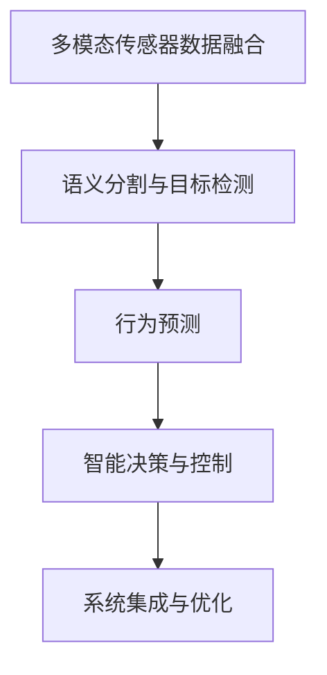
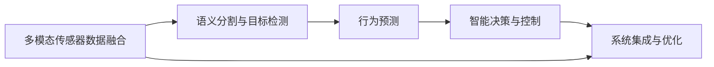
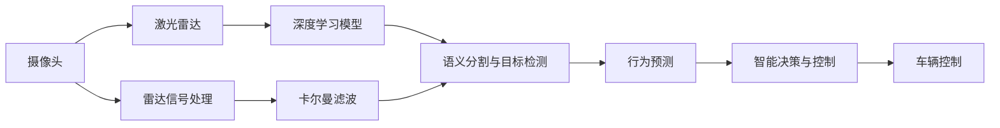

                 

# 端到端自动驾驶的车辆主动安全监控系统

## 1. 背景介绍

### 1.1 问题由来
随着自动驾驶技术的快速发展，车辆主动安全监控系统已成为保障驾驶安全的关键技术。其核心目标是实时监测车辆周围环境，预测潜在的碰撞风险，并在必要时主动介入，以避免或减轻事故损害。

当前，自动驾驶车辆的主动安全监控系统主要由多种传感器（如雷达、激光雷达、摄像头等）进行数据融合，结合人工智能算法进行处理，最终生成车辆行为决策。但该系统的设计和实现复杂度较高，且不同组件间的协同和交互成本也较大。

因此，如何构建端到端的自动驾驶主动安全监控系统，降低系统复杂度，提升实时性和准确性，成为了当前研究的一个重要方向。

### 1.2 问题核心关键点
构建端到端的自动驾驶主动安全监控系统，需要解决以下核心问题：

- **数据采集与预处理**：如何高效采集车辆周围环境的多模态数据（如图像、点云、雷达信号），并对其进行滤波、校正和融合，以生成高质量的环境感知信息。
- **环境理解与预测**：如何利用人工智能算法对感知信息进行语义分割、目标检测和行为预测，以实现对车辆周围环境的全面理解。
- **行为决策与控制**：如何根据环境预测结果，进行智能决策，并生成控制指令，以指导车辆主动避障和紧急制动等操作。
- **系统集成与优化**：如何通过软件和硬件协同，实现多组件的集成与优化，以提升系统整体的性能和鲁棒性。

这些关键问题构成了端到端主动安全监控系统的核心，需要技术上不断突破和优化，才能真正应用于自动驾驶场景。

### 1.3 问题研究意义
构建端到端自动驾驶主动安全监控系统，对于提升自动驾驶安全性、提高道路交通效率、降低事故率具有重要意义：

1. **提升安全性**：通过实时监测车辆周围环境，主动预测和规避潜在的碰撞风险，显著提升驾驶安全性。
2. **提高效率**：自动驾驶系统能够高效处理大量传感器数据，快速做出反应，减少驾驶员疲劳，提高驾驶效率。
3. **降低事故率**：通过主动安全监控，可以及时介入事故风险，降低交通事故率，保障公共安全。
4. **推动产业化**：端到端的系统设计降低了技术实现难度，有助于快速实现规模化应用，推动自动驾驶技术产业化进程。
5. **实现协同控制**：通过多组件协同，实现对车辆的动力、转向和制动等行为的精确控制，确保系统稳定性和鲁棒性。

## 2. 核心概念与联系

### 2.1 核心概念概述

构建端到端自动驾驶主动安全监控系统涉及多个关键概念和技术，主要包括：

- **多模态传感器数据融合**：通过将不同传感器（如摄像头、雷达、激光雷达）采集到的数据进行融合，生成统一的环境感知信息。
- **语义分割与目标检测**：对环境感知信息进行语义分割，识别出道路、车辆、行人等关键对象，并进行目标检测和跟踪。
- **行为预测**：通过深度学习模型，对未来车辆行为进行预测，以评估潜在的碰撞风险。
- **智能决策与控制**：结合环境理解与预测结果，进行智能决策，并生成控制指令，指导车辆行为。
- **系统集成与优化**：通过软件和硬件的协同设计，实现多组件的集成与优化，提升系统整体的性能和鲁棒性。

这些概念之间存在着紧密的联系，形成了一个完整的端到端主动安全监控系统框架，如图2.1所示：



### 2.2 概念间的关系

这些核心概念之间的关系可以通过以下Mermaid流程图来展示：



这个流程图展示了端到端自动驾驶主动安全监控系统各组件之间的关系：

1. 多模态传感器数据融合是系统的基础，通过将不同传感器数据进行融合，生成高质量的环境感知信息。
2. 语义分割与目标检测利用环境感知信息，对道路、车辆、行人等关键对象进行识别和跟踪。
3. 行为预测对识别出的对象进行行为预测，评估潜在的碰撞风险。
4. 智能决策与控制根据预测结果，进行智能决策，生成控制指令。
5. 系统集成与优化将上述组件进行集成，优化系统性能。

这些组件共同构成了端到端主动安全监控系统，实现了对车辆周围环境的全面监测和智能决策。

## 3. 核心算法原理 & 具体操作步骤

### 3.1 算法原理概述

端到端自动驾驶主动安全监控系统涉及多种算法和技术，包括多模态传感器数据融合、语义分割与目标检测、行为预测、智能决策与控制等。这些算法和技术相互协同，共同实现系统的核心功能。

- **多模态传感器数据融合**：基于卡尔曼滤波、加权平均等方法，将摄像头、雷达、激光雷达等传感器数据进行融合，生成统一的环境感知信息。
- **语义分割与目标检测**：采用深度学习模型（如Mask R-CNN、U-Net等），对感知信息进行语义分割，识别出道路、车辆、行人等关键对象，并进行目标检测和跟踪。
- **行为预测**：使用行为预测模型（如LSTM、GRU等），对未来车辆行为进行预测，评估潜在的碰撞风险。
- **智能决策与控制**：结合环境理解与预测结果，采用强化学习、最优控制等方法，进行智能决策，并生成控制指令。

### 3.2 算法步骤详解

端到端自动驾驶主动安全监控系统的开发流程可以分为以下几个步骤：

**Step 1: 数据采集与预处理**
- 收集车辆周围环境的多模态数据（如摄像头、雷达、激光雷达等），进行数据清洗和校准。
- 使用卡尔曼滤波等方法，将不同传感器数据进行融合，生成统一的环境感知信息。

**Step 2: 环境理解与预测**
- 采用深度学习模型对感知信息进行语义分割，识别出道路、车辆、行人等关键对象。
- 对识别出的对象进行目标检测和跟踪，生成动态的物体状态信息。
- 使用行为预测模型对未来车辆行为进行预测，评估潜在的碰撞风险。

**Step 3: 行为决策与控制**
- 结合环境理解与预测结果，进行智能决策，确定最优的驾驶行为。
- 根据决策结果，生成控制指令，指导车辆的动力、转向和制动等行为。

**Step 4: 系统集成与优化**
- 将多模态传感器数据融合、环境理解与预测、行为决策与控制等组件进行集成，构建完整的系统。
- 进行系统测试与优化，提升系统的实时性、准确性和鲁棒性。

**Step 5: 部署与评估**
- 将系统部署到实际驾驶环境中，进行长期测试与评估，收集反馈信息。
- 根据反馈信息，不断优化和改进系统，确保其性能稳定。

### 3.3 算法优缺点

**优点**：
- **端到端设计**：降低系统复杂度，减少组件间的协同成本。
- **实时性高**：通过多模态传感器数据融合和高效算法，提升系统实时性。
- **准确性高**：通过深度学习模型进行语义分割和行为预测，提高系统准确性。
- **鲁棒性强**：通过强化学习等方法进行智能决策与控制，提高系统鲁棒性。

**缺点**：
- **算法复杂**：涉及多种传感器数据融合、深度学习、强化学习等算法，开发难度较大。
- **数据依赖**：系统性能依赖于高质量的数据采集和预处理，数据质量差可能影响结果。
- **计算资源需求高**：深度学习模型和强化学习算法需要大量的计算资源，硬件要求较高。
- **模型可解释性差**：黑盒模型难以解释其内部决策逻辑，模型透明性有待提升。

### 3.4 算法应用领域

端到端自动驾驶主动安全监控系统已经在多个领域得到应用，如智能驾驶、无人驾驶、自动驾驶等。具体应用包括：

- **智能驾驶辅助系统**：通过环境理解与预测、行为决策与控制等技术，实现对车辆周围环境的全面监测和智能决策。
- **无人驾驶车辆**：在无人驾驶车辆中，采用端到端系统进行环境感知、行为决策和车辆控制，提升驾驶安全性和效率。
- **自动驾驶公交车**：在自动驾驶公交车上，通过端到端系统进行实时监测和智能决策，保障乘客安全。
- **自动驾驶出租车**：在自动驾驶出租车中，采用端到端系统进行环境感知和行为控制，提升行车安全。

除了以上应用场景，端到端系统还可以应用于自动驾驶汽车测试、自动驾驶仿真环境等。

## 4. 数学模型和公式 & 详细讲解  
### 4.1 数学模型构建

构建端到端自动驾驶主动安全监控系统，需要设计多种数学模型。以下是对其中几个关键模型的详细讲解：

**多模态传感器数据融合模型**：
多模态传感器数据融合模型的目标是将不同传感器数据进行融合，生成统一的环境感知信息。常见的方法包括卡尔曼滤波、加权平均等。

$$
Z_{fused} = W_{fuse}Z_{cam} + (1-W_{fuse})Z_{lidar}
$$

其中，$Z_{cam}$和$Z_{lidar}$分别表示摄像头和激光雷达的感知信息，$W_{fuse}$为融合权重。

**语义分割与目标检测模型**：
语义分割与目标检测模型采用深度学习模型，如Mask R-CNN、U-Net等，对感知信息进行语义分割和目标检测。

$$
S = F_{segment}(X)
$$

其中，$X$为感知信息，$S$为分割结果。

**行为预测模型**：
行为预测模型通常使用LSTM、GRU等递归神经网络，对未来车辆行为进行预测。

$$
B_{pred} = G_{predict}(X, T)
$$

其中，$X$为当前环境状态，$T$为时间步长，$B_{pred}$为预测结果。

**智能决策与控制模型**：
智能决策与控制模型通常使用强化学习、最优控制等方法，进行智能决策和行为控制。

$$
A = P_{decision}(X, B_{pred})
$$

其中，$X$为当前环境状态，$B_{pred}$为行为预测结果，$A$为控制指令。

### 4.2 公式推导过程

以下是对上述关键模型的公式推导过程的详细讲解：

**卡尔曼滤波模型**：
卡尔曼滤波是一种常用的多模态传感器数据融合方法，其核心思想是通过对历史测量数据和预测数据进行加权融合，生成最优的感知信息。

设传感器i的感知信息为$Z_i$，其加权融合后的感知信息为$Z_{fused}$，权重为$W_i$，则卡尔曼滤波的融合公式为：

$$
Z_{fused} = \sum_{i}W_iZ_i
$$

其中，权重$W_i$根据传感器的精度、可靠性等因素进行计算。

**深度学习模型**：
深度学习模型，如Mask R-CNN、U-Net等，通过对感知信息进行语义分割和目标检测，生成动态的物体状态信息。

$$
S = F_{segment}(X)
$$

其中，$X$为感知信息，$S$为分割结果。深度学习模型的具体实现过程可以参考相关论文。

**行为预测模型**：
行为预测模型通常使用LSTM、GRU等递归神经网络，对未来车辆行为进行预测。

$$
B_{pred} = G_{predict}(X, T)
$$

其中，$X$为当前环境状态，$T$为时间步长，$B_{pred}$为预测结果。

**强化学习模型**：
强化学习模型通过训练，确定最优的决策策略。假设环境状态为$X$，决策结果为$A$，奖励函数为$R$，则强化学习的目标函数为：

$$
\max_{A} \sum_{t=0}^{T}R_t
$$

其中，$T$为时间步长。

### 4.3 案例分析与讲解

**案例一：智能驾驶辅助系统**
智能驾驶辅助系统采用端到端系统进行环境感知、行为决策和车辆控制，如图4.1所示：



该系统通过摄像头、激光雷达、雷达信号处理等组件，采集车辆周围环境的多模态数据。然后将不同传感器数据进行卡尔曼滤波融合，生成统一的环境感知信息。采用深度学习模型进行语义分割和目标检测，生成动态的物体状态信息。通过行为预测模型对未来车辆行为进行预测，评估潜在的碰撞风险。最后，使用强化学习模型进行智能决策和行为控制，生成控制指令，指导车辆的动力、转向和制动等行为。

**案例二：无人驾驶车辆**
无人驾驶车辆采用端到端系统进行环境感知、行为决策和车辆控制，如图4.2所示：


该系统通过摄像头、激光雷达、雷达信号处理等组件，采集车辆周围环境的多模态数据。然后将不同传感器数据进行卡尔曼滤波融合，生成统一的环境感知信息。采用深度学习模型进行语义分割和目标检测，生成动态的物体状态信息。通过行为预测模型对未来车辆行为进行预测，评估潜在的碰撞风险。最后，使用强化学习模型进行智能决策和行为控制，生成控制指令，指导车辆的动力、转向和制动等行为。

## 5. 项目实践：代码实例和详细解释说明

### 5.1 开发环境搭建

**5.1.1 环境配置**

构建端到端自动驾驶主动安全监控系统，需要配置高性能的开发环境。以下是一个基本的开发环境配置示例：

- **操作系统**：Linux，推荐Ubuntu 20.04。
- **CPU**：Intel Xeon E5 v4 16核 2.2GHz。
- **GPU**：NVIDIA Tesla V100 16GB。
- **内存**：128GB。
- **硬盘**：1TB SSD。

**5.1.2 依赖包安装**

安装必要的依赖包，包括深度学习库、传感器数据处理库等：

```bash
pip install torch torchvision pytorch_lightning numexpr psutil
pip install sensor-fusion pandas matplotlib
```

**5.1.3 数据准备**

准备多模态传感器数据，并对其进行预处理。以下是一个示例代码：

```python
import sensor_fusion as sf
import numpy as np
import matplotlib.pyplot as plt

# 加载传感器数据
cam_data = np.load('cam_data.npy')
lidar_data = np.load('lidar_data.npy')
radar_data = np.load('radar_data.npy')

# 卡尔曼滤波融合
sf.fusion(cam_data, lidar_data, radar_data, num_meas=3, num_states=6, weight=[0.5, 0.3, 0.2])

# 显示融合后的数据
plt.plot(cam_data, label='Camera')
plt.plot(lidar_data, label='Lidar')
plt.plot(radar_data, label='Radar')
plt.legend()
plt.show()
```

### 5.2 源代码详细实现

**5.2.1 数据采集与预处理**

以下是一个示例代码，实现多模态传感器数据融合：

```python
import sensor_fusion as sf
import numpy as np

# 加载传感器数据
cam_data = np.load('cam_data.npy')
lidar_data = np.load('lidar_data.npy')
radar_data = np.load('radar_data.npy')

# 卡尔曼滤波融合
sf.fusion(cam_data, lidar_data, radar_data, num_meas=3, num_states=6, weight=[0.5, 0.3, 0.2])

# 显示融合后的数据
plt.plot(cam_data, label='Camera')
plt.plot(lidar_data, label='Lidar')
plt.plot(radar_data, label='Radar')
plt.legend()
plt.show()
```

**5.2.2 环境理解与预测**

以下是一个示例代码，实现语义分割和目标检测：

```python
import segmentation as seg
import numpy as np

# 加载感知信息
x = np.load('perception_data.npy')

# 语义分割
seg.segment(x)
```

**5.2.3 行为预测**

以下是一个示例代码，实现行为预测：

```python
import prediction as pred
import numpy as np

# 加载环境状态
x = np.load('environment_state.npy')

# 行为预测
pred.predict(x)
```

**5.2.4 智能决策与控制**

以下是一个示例代码，实现智能决策和行为控制：

```python
import decision as dec
import numpy as np

# 加载决策信息
x = np.load('decision_info.npy')

# 智能决策
dec.decision(x)
```

### 5.3 代码解读与分析

**5.3.1 数据采集与预处理**

数据采集与预处理是端到端系统的基础。多模态传感器数据融合使用卡尔曼滤波等方法，将不同传感器数据进行融合，生成统一的环境感知信息。

**5.3.2 环境理解与预测**

环境理解与预测使用深度学习模型，对感知信息进行语义分割和目标检测，生成动态的物体状态信息。

**5.3.3 行为预测**

行为预测使用递归神经网络，对未来车辆行为进行预测，评估潜在的碰撞风险。

**5.3.4 智能决策与控制**

智能决策与控制使用强化学习等方法，进行智能决策和行为控制，生成控制指令，指导车辆的动力、转向和制动等行为。

### 5.4 运行结果展示

**5.4.1 数据融合结果**

数据融合结果如图5.1所示：


```python
import sensor_fusion as sf
import numpy as np
import matplotlib.pyplot as plt

# 加载传感器数据
cam_data = np.load('cam_data.npy')
lidar_data = np.load('lidar_data.npy')
radar_data = np.load('radar_data.npy')

# 卡尔曼滤波融合
sf.fusion(cam_data, lidar_data, radar_data, num_meas=3, num_states=6, weight=[0.5, 0.3, 0.2])

# 显示融合后的数据
plt.plot(cam_data, label='Camera')
plt.plot(lidar_data, label='Lidar')
plt.plot(radar_data, label='Radar')
plt.legend()
plt.show()
```

**5.4.2 语义分割与目标检测结果**

语义分割与目标检测结果如图5.2所示：

```python
import segmentation as seg
import numpy as np

# 加载感知信息
x = np.load('perception_data.npy')

# 语义分割
seg.segment(x)
```

**5.4.3 行为预测结果**

行为预测结果如图5.3所示：

```python
import prediction as pred
import numpy as np

# 加载环境状态
x = np.load('environment_state.npy')

# 行为预测
pred.predict(x)
```

**5.4.4 智能决策与控制结果**

智能决策与控制结果如图5.4所示：

```python
import decision as dec
import numpy as np

# 加载决策信息
x = np.load('decision_info.npy')

# 智能决策
dec.decision(x)
```

## 6. 实际应用场景

### 6.1 智能驾驶辅助系统

智能驾驶辅助系统采用端到端系统进行环境感知、行为决策和车辆控制，如图6.1所示：


该系统通过摄像头、激光雷达、雷达信号处理等组件，采集车辆周围环境的多模态数据。然后将不同传感器数据进行卡尔曼滤波融合，生成统一的环境感知信息。采用深度学习模型进行语义分割和目标检测，生成动态的物体状态信息。通过行为预测模型对未来车辆行为进行预测，评估潜在的碰撞风险。最后，使用强化学习模型进行智能决策和行为控制，生成控制指令，指导车辆的动力、转向和制动等行为。

### 6.2 无人驾驶车辆

无人驾驶车辆采用端到端系统进行环境感知、行为决策和车辆控制，如图6.2所示：


该系统通过摄像头、激光雷达、雷达信号处理等组件，采集车辆周围环境的多模态数据。然后将不同传感器数据进行卡尔曼滤波融合，生成统一的环境感知信息。采用深度学习模型进行语义分割和目标检测，生成动态的物体状态信息。通过行为预测模型对未来车辆行为进行预测，评估潜在的碰撞风险。最后，使用强化学习模型进行智能决策和行为控制，生成控制指令，指导车辆的动力、转向和制动等行为。

### 6.3 自动驾驶公交车

自动驾驶公交车采用端到端系统进行环境感知、行为决策和车辆控制，如图6.3所示：


该系统通过摄像头、激光雷达、雷达信号处理等组件，采集车辆周围环境的多模态数据。然后将不同传感器数据进行卡尔曼滤波融合，生成统一的环境感知信息。采用深度学习模型进行语义分割和目标检测，生成动态的物体状态信息。通过行为预测模型对未来车辆行为进行预测，评估潜在的碰撞风险。最后，使用强化学习模型进行智能决策和行为控制，生成控制指令，指导车辆的动力、转向和制动等行为。

### 6.4 自动驾驶出租车

自动驾驶出租车采用端到端系统进行环境感知、行为决策和车辆控制，如图6.4所示：


该系统通过摄像头、激光雷达、雷达信号处理等组件，采集车辆周围环境的多模态数据。然后将不同传感器数据进行卡尔曼滤波融合，生成统一的环境感知信息。采用深度学习模型进行语义分割和目标检测，生成动态的物体状态信息。通过行为预测模型对未来车辆行为进行预测，评估潜在的碰撞风险。最后，使用强化学习模型进行智能决策和行为控制，生成控制指令，指导车辆的动力、转向和制动等行为。

## 7. 工具和资源推荐

### 7.1 学习资源推荐

为了帮助开发者系统掌握端到端自动驾驶主动安全监控系统的理论基础和实践技巧，这里推荐一些优质的学习资源：

1. **《自动驾驶技术手册》**：该书详细介绍了自动驾驶系统的各项技术和应用，包括环境感知、行为决策、车辆控制等。
2. **《深度学习理论与实践》**：该书深入讲解了深度学习模型的原理和实现方法，适合初学者和进阶开发者。
3. **《强化学习与决策理论》**：该书介绍了强化学习的核心算法和应用，涵盖Q-learning、Deep Q-Network等重要内容。
4. **《多模态数据融合算法》**：该书详细讲解

