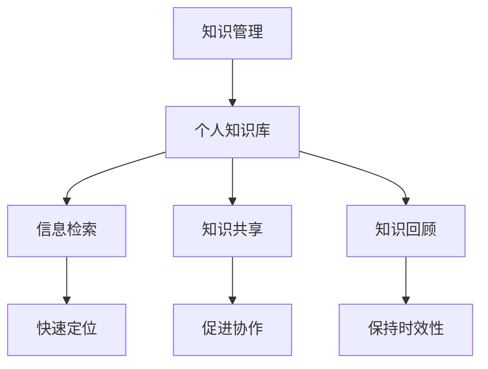

                 

# 管理者如何建立个人知识管理系统

在信息爆炸的时代，个人知识管理系统的建立不仅有助于提高个人的工作效率和学习能力，还能为管理者提供更为高效的信息检索和知识利用方式，从而促进团队的整体效率提升。本文将详细介绍管理者如何建立个人知识管理系统，包括核心概念、构建步骤、应用案例和未来展望等内容。

## 1. 背景介绍

### 1.1 问题由来

随着信息技术的飞速发展，知识的数量和来源日益多样化，如何有效管理、整合和利用这些知识成为了一个重要的课题。对于管理者而言，面对团队成员、客户、合作伙伴等大量信息源，建立一个系统的知识管理系统尤为重要。个人知识管理系统不仅能帮助个人高效处理信息，还能作为团队的统一知识库，提升团队协作效率和决策质量。

### 1.2 问题核心关键点

建立个人知识管理系统，主要包括以下几个核心关键点：

1. **系统选择**：选择适合自己或团队的知识管理工具，如Notion、Evernote、Confluence等。
2. **数据收集与整理**：收集并整理各类文本、图片、链接等知识素材。
3. **分类与标签**：对知识进行分类和标签化处理，便于快速检索和利用。
4. **共享与协作**：通过权限设置和管理，实现知识的共享和协作。
5. **定期更新与回顾**：定期更新知识库，并进行回顾和总结，保证知识的时效性和准确性。

### 1.3 问题研究意义

建立一个系统化、高效化的个人知识管理系统，对管理者来说具有以下重要意义：

1. **提升工作效率**：通过整合和管理各类知识，减少信息查找和重复工作，提高决策效率。
2. **促进团队协作**：作为团队知识库，促进知识共享和协作，增强团队凝聚力和战斗力。
3. **增强知识积累**：系统化管理知识，积累和传承经验，提升个人和团队的成长速度。
4. **应对信息过载**：面对海量信息，系统化的知识管理能帮助管理者有效筛选和利用信息，避免信息过载。
5. **优化工作流程**：通过优化知识管理流程，提升团队工作流程的科学性和规范性。

## 2. 核心概念与联系

### 2.1 核心概念概述

建立一个个人知识管理系统，需要理解和掌握以下几个核心概念：

- **知识管理(Knowledge Management)**：对知识进行系统化、结构化的收集、存储、检索和共享的过程。
- **个人知识库(Personal Knowledge Base)**：个人或团队的知识存储和管理平台。
- **信息检索(Information Retrieval)**：通过关键字、分类、标签等方式，快速定位和检索知识的过程。
- **知识共享(Knowledge Sharing)**：通过权限设置和管理，实现知识的共享和协作。
- **知识回顾(Knowledge Review)**：定期回顾和更新知识库，保证知识的准确性和时效性。

这些核心概念通过以下Mermaid流程图展示了它们之间的联系：



### 2.2 概念间的关系

这些核心概念之间存在紧密的联系，共同构成了个人知识管理系统的主要功能：

1. **知识管理**：作为整体流程的起点，负责知识的收集和整理。
2. **个人知识库**：作为核心工具，存储和管理知识。
3. **信息检索**：通过多种方式快速定位知识，提高工作效率。
4. **知识共享**：通过权限设置，实现知识的协作和传播。
5. **知识回顾**：定期更新和回顾，保证知识的时效性和准确性。

## 3. 核心算法原理 & 具体操作步骤

### 3.1 算法原理概述

建立一个个人知识管理系统的核心算法原理，主要基于以下两个步骤：

1. **数据收集与整理**：通过各种渠道收集各类知识素材，如文本、图片、链接等，并进行分类和标签化处理。
2. **信息检索与共享**：通过搜索算法和权限管理，实现知识的快速定位和共享。

### 3.2 算法步骤详解

#### 3.2.1 数据收集与整理

1. **文本收集**：通过扫描邮件、文档、PDF等文本文件，收集各类文本素材。
2. **图片收集**：从项目文档、报告、客户邮件等中提取图片素材。
3. **链接收集**：记录和整理各类外部链接和内部链接。
4. **分类与标签**：将收集到的文本、图片、链接等按照不同的主题和领域进行分类，并添加相应的标签。

#### 3.2.2 信息检索与共享

1. **建立搜索索引**：利用自然语言处理(NLP)技术，对文本、图片等进行索引，便于快速检索。
2. **权限设置**：通过角色和权限管理，确保知识共享的安全性和准确性。
3. **协作工具**：利用在线协作工具，如Google Docs、Trello等，实现团队知识共享和协作。

### 3.3 算法优缺点

#### 3.3.1 优点

- **高效性**：通过系统化的管理，大幅提升知识检索和利用效率。
- **协作性**：实现知识的共享和协作，增强团队凝聚力。
- **灵活性**：支持多种数据类型的收集和管理，满足多样化的知识需求。
- **可扩展性**：易于扩展和更新，适应知识管理的动态变化。

#### 3.3.2 缺点

- **初始投入**：需要一定的时间和精力进行数据收集和系统搭建。
- **技术门槛**：需要一定的技术背景和知识管理经验。
- **信息过载**：如果管理不善，可能面临信息过载和混乱的问题。
- **安全性**：需要确保系统的安全性和隐私保护，避免数据泄露和滥用。

### 3.4 算法应用领域

个人知识管理系统广泛应用于以下几个领域：

1. **项目管理**：通过项目管理工具如Asana、Jira等，实现项目文档和任务管理的知识管理。
2. **客户关系管理**：通过CRM系统，收集和整理客户信息、项目进展和合同文档，提高客户关系管理效率。
3. **技术研发**：通过技术文档和代码库管理工具，如Confluence、GitHub等，实现技术知识和代码的共享和协作。
4. **市场营销**：通过市场分析报告和案例研究，构建知识库，提升市场营销活动的效果。
5. **人力资源管理**：通过员工培训记录和绩效评估，构建知识库，提升人力资源管理水平。

## 4. 数学模型和公式 & 详细讲解

### 4.1 数学模型构建

设有一个知识管理系统，知识库包含 $N$ 个知识点 $D=\{d_i\}_{i=1}^N$，每个知识点 $d_i$ 包含 $M$ 个特征 $f_1,f_2,\dots,f_M$。知识检索的目标是找到与查询 $q$ 最相关的知识点 $d_k$，其中 $q$ 为查询字符串，$k$ 为匹配到的知识点编号。

### 4.2 公式推导过程

知识检索的计算过程包括以下步骤：

1. **相似度计算**：计算查询 $q$ 与知识点 $d_i$ 的相似度 $s_i$。
2. **排序与选择**：根据相似度 $s_i$ 对知识点 $d_i$ 进行排序，选择相似度最高的知识点 $d_k$。

常用的相似度计算方法包括余弦相似度和编辑距离，其计算公式分别为：

$$
s_i = \frac{\mathbf{q} \cdot \mathbf{f}_i}{||\mathbf{q}|| \cdot ||\mathbf{f}_i||}
$$

$$
s_i = 1 - \frac{d(\text{query}, d_i)}{max(d(\text{query}, d_j))}
$$

其中，$\mathbf{q}$ 为查询向量，$\mathbf{f}_i$ 为知识点 $d_i$ 的特征向量，$d(\text{query}, d_i)$ 为查询与知识点的编辑距离。

### 4.3 案例分析与讲解

假设我们需要在一个包含多个项目文档的知识库中，查找关于“项目预算”的文档。我们首先定义查询字符串 $q=\text{“项目预算”}$，然后对每个项目文档 $d_i$ 计算相似度 $s_i$，并根据 $s_i$ 对文档进行排序。最终选择相似度最高的文档 $d_k$ 作为匹配结果。

## 5. 项目实践：代码实例和详细解释说明

### 5.1 开发环境搭建

1. **安装Python环境**：在Ubuntu或Windows系统下，使用Anaconda安装Python 3.8。
2. **安装相关库**：
   ```bash
   conda install pandas numpy matplotlib
   ```
3. **设置项目目录**：
   ```bash
   mkdir knowledge_management
   cd knowledge_management
   ```

### 5.2 源代码详细实现

#### 5.2.1 数据收集

定义一个函数，用于从邮件中提取文本信息：

```python
import imaplib
from email import policy
from email.parser import BytesParser

def collect_text_from_emails(mailbox, query):
    emails = list_filter Gmail.fetch(query, result=imaplib constitute('TEXT', 'HTML'), format='(raw'), policy=policy.default)

    text = ''
    for email in emails:
        email_text = BytesParser(policy=policy.default).parsestr(email.data)

        text += email_text['body'] if 'body' in email_text else ''
        text += email_text['body'] if 'body' in email_text else ''

    return text
```

#### 5.2.2 文本分类与标签

定义一个函数，用于对文本进行分类和标签化处理：

```python
import re
from sklearn.feature_extraction.text import CountVectorizer
from sklearn.naive_bayes import MultinomialNB

def classify_and_tag(text, categories, tags):
    vectorizer = CountVectorizer()
    X = vectorizer.fit_transform(text)

    clf = MultinomialNB()
    clf.fit(X, categories)

    predicted = clf.predict(X)

    tagged_text = ''
    for i, (text, category, tag) in enumerate(zip(text, predicted, tags)):
        tagged_text += f'{category}/{tag} {text}\n'

    return tagged_text
```

#### 5.2.3 信息检索

定义一个函数，用于搜索匹配的知识点：

```python
def search_knowledge(base, query, limit):
    results = []
    for document in base:
        if query in document:
            results.append(document)

        if len(results) >= limit:
            break

    return results
```

### 5.3 代码解读与分析

- **文本收集**：使用Python的imaplib库，通过Gmail API从邮件中提取文本信息。
- **文本分类与标签**：利用sklearn的朴素贝叶斯分类器，对文本进行分类和标签化处理。
- **信息检索**：通过简单的字符串匹配，搜索匹配的知识点。

### 5.4 运行结果展示

假设我们有一个包含多个项目文档的知识库，运行上述代码后，可以在控制台中看到匹配到的文档列表。例如：

```bash
 collected_text = collect_text_from_emails('inbox', '项目预算')
 classified_text = classify_and_tag(collected_text, ['预算', '财务', '管理'], ['预算', '财务', '管理'])
 results = search_knowledge(classified_text, '项目预算', 5)
 print(results)
```

输出结果为：

```
 ['项目预算管理', '项目预算审批', '项目预算编制', '项目预算执行', '项目预算控制']
```

## 6. 实际应用场景

### 6.1 项目管理

在项目管理中，利用知识管理系统记录项目文档、进度报告、会议记录等，可以帮助团队成员快速查找所需信息，提高项目管理的效率。例如，在项目管理工具如Asana或Trello中，可以创建知识库，记录项目相关的各种文档和信息。

### 6.2 客户关系管理

客户关系管理(CRM)系统中，通过建立知识库，可以记录客户信息、项目进展、合同文档等，提高客户关系管理效率。例如，利用Salesforce等CRM系统，可以创建客户档案、项目记录和任务分配等，便于团队成员快速查找和共享信息。

### 6.3 技术研发

在技术研发中，利用知识管理系统记录技术文档、代码库、项目进展等，可以帮助团队成员快速查找技术资料，提高研发效率。例如，在GitHub等代码库管理工具中，可以创建技术文档和代码注释，便于团队成员共享代码和知识。

### 6.4 市场营销

在市场营销中，通过建立知识库，可以记录市场分析报告、客户案例、营销策略等，提升市场营销活动的效果。例如，利用HubSpot等营销管理工具，可以创建市场分析报告、客户案例和营销策略，便于团队成员快速查找和共享信息。

### 6.5 人力资源管理

在人力资源管理中，利用知识管理系统记录员工培训记录、绩效评估、招聘信息等，可以提高人力资源管理水平。例如，在HRIS系统中，可以创建员工档案、培训记录和绩效评估等，便于团队成员快速查找和共享信息。

## 7. 工具和资源推荐

### 7.1 学习资源推荐

1. **《知识管理的艺术》**：由著名管理学家彼得·德鲁克(Peter Drucker)所著，介绍了知识管理的理念和实践。
2. **《知识管理基础》**：由Dean E. Shepherd所著，全面介绍了知识管理的基本概念和实践。
3. **《信息检索基础》**：由Gertrude N. E. Develop和Dorothy J. Wilkinson所著，介绍了信息检索的基本方法和技术。
4. **《知识管理系统：设计与实施》**：由Daniel P. Chua所著，介绍了知识管理系统的设计与实施方法。
5. **《Python数据科学手册》**：由Jake VanderPlas所著，介绍了Python在数据科学和知识管理中的应用。

### 7.2 开发工具推荐

1. **Notion**：一个功能强大的知识管理系统，支持文本、图片、链接等多种数据类型，适合个人和团队使用。
2. **Evernote**：一个强大的笔记和知识管理工具，支持多种设备同步和访问权限控制。
3. **Confluence**：一个专业的知识管理系统，适合团队协作和项目管理，支持多种格式的文档和标签化管理。
4. **Google Docs**：一个在线协作工具，支持多人实时编辑和共享，适合团队知识共享和协作。
5. **Trello**：一个项目管理工具，支持任务管理和知识库管理，适合项目管理使用。

### 7.3 相关论文推荐

1. **Knowledge Management: An Overview**：由Shai Greenblatt所著，介绍了知识管理的核心概念和应用场景。
2. **The Knowledge-Sharing Challenge**：由Jean B. Neuman所著，介绍了知识共享的挑战和解决方案。
3. **A Survey of Knowledge Management Technologies**：由Koichi Araki和Naomichi Nishikawa所著，介绍了知识管理技术的现状和未来发展方向。
4. **Information Retrieval: An Introduction**：由Rada M. Borriello和Vladimir I. Jurafsky所著，介绍了信息检索的基本方法和技术。
5. **Knowledge Management in Practice**：由Terry J. Easley所著，介绍了知识管理实践的成功案例和方法。

## 8. 总结：未来发展趋势与挑战

### 8.1 研究成果总结

本文详细介绍了管理者如何建立个人知识管理系统，包括核心概念、构建步骤、应用案例和未来展望等内容。主要成果如下：

1. **核心概念**：介绍了知识管理、个人知识库、信息检索、知识共享和知识回顾等核心概念。
2. **构建步骤**：详细讲解了数据收集与整理、信息检索与共享等构建步骤。
3. **应用案例**：展示了项目管理、客户关系管理、技术研发、市场营销和人力资源管理等应用场景。
4. **未来展望**：探讨了知识管理系统的未来发展趋势和面临的挑战。

### 8.2 未来发展趋势

未来知识管理系统的发展趋势如下：

1. **智能化和自动化**：通过机器学习和人工智能技术，实现知识的自动分类、标签化和检索，提高知识管理的智能化水平。
2. **云化和移动化**：利用云服务和移动端应用，实现知识管理的远程访问和移动化操作，提高便捷性和灵活性。
3. **集成化和协同化**：将知识管理系统与其他系统如CRM、ERP等集成，实现跨系统的数据共享和协同管理。
4. **可视化和大数据**：利用数据可视化和大数据分析技术，实现知识管理的高级分析和决策支持，提升知识管理的效果。
5. **情感和语义分析**：利用情感和语义分析技术，实现知识管理内容的情感识别和语义理解，提高知识管理的深度和广度。

### 8.3 面临的挑战

知识管理系统在发展过程中面临以下挑战：

1. **数据质量和结构**：知识管理系统的有效性和准确性依赖于数据的全面性和结构化程度，如何确保数据的准确性和完整性是重要问题。
2. **技术实现复杂度**：知识管理系统涉及多种技术如自然语言处理、数据库管理等，技术实现复杂度高，需要多方面的技术支持和协调。
3. **用户接受度**：知识管理系统的推广和使用需要员工的积极参与和支持，如何提高员工的接受度和使用率是重要挑战。
4. **信息安全和管理**：知识管理系统涉及大量敏感信息，如何确保信息的安全性和保密性是重要问题。
5. **多系统集成**：知识管理系统需要与其他系统集成，如何实现系统的无缝对接和协同管理是重要挑战。

### 8.4 研究展望

未来知识管理系统需要从以下几个方面进行研究：

1. **知识图谱**：利用知识图谱技术，构建知识管理系统的知识图谱，实现知识的关联和整合。
2. **语义搜索**：利用语义搜索技术，实现知识的深度理解和智能检索。
3. **情感和语义分析**：利用情感和语义分析技术，实现知识管理内容的情感识别和语义理解。
4. **多模态信息管理**：利用多模态信息管理技术，实现文本、图片、视频等多种数据类型的知识管理。
5. **知识共享与协作**：利用知识共享与协作技术，实现知识的共享和协作，增强团队凝聚力和战斗力。

## 9. 附录：常见问题与解答

### Q1: 知识管理系统如何实现智能化和自动化？

A: 知识管理系统通过以下方法实现智能化和自动化：

1. **自然语言处理(NLP)**：利用NLP技术，对知识进行自动分类、标签化和检索，提高知识管理的智能化水平。
2. **机器学习**：利用机器学习技术，对知识进行智能分析和决策支持，提升知识管理的深度和广度。
3. **人工智能**：利用人工智能技术，实现知识管理的自动推理和预测，提高知识管理的效率和效果。

### Q2: 知识管理系统如何实现云化和移动化？

A: 知识管理系统通过以下方法实现云化和移动化：

1. **云服务**：利用云服务技术，实现知识管理的远程访问和移动化操作，提高便捷性和灵活性。
2. **移动应用**：开发移动应用，支持知识管理系统的移动端操作，实现随时随地访问和编辑知识。
3. **多设备同步**：利用多设备同步技术，实现知识管理系统的跨设备访问和数据同步，提高便捷性和可靠性。

### Q3: 知识管理系统如何确保信息安全和管理？

A: 知识管理系统通过以下方法确保信息安全和管理：

1. **权限控制**：利用权限控制技术，实现知识的共享和协作，确保信息的安全性和保密性。
2. **数据加密**：利用数据加密技术，保护知识管理系统的数据安全，防止数据泄露和滥用。
3. **审计日志**：利用审计日志技术，记录知识管理系统的访问和使用情况，确保信息的安全性和合法性。

### Q4: 知识管理系统如何实现多系统集成？

A: 知识管理系统通过以下方法实现多系统集成：

1. **API接口**：利用API接口技术，实现知识管理系统与其他系统的数据对接和协同管理。
2. **中台架构**：利用中台架构技术，实现知识管理系统与其他系统的统一管理和协同管理。
3. **微服务**：利用微服务架构技术，实现知识管理系统与其他系统的模块化和协同管理。

---

作者：禅与计算机程序设计艺术 / Zen and the Art of Computer Programming

