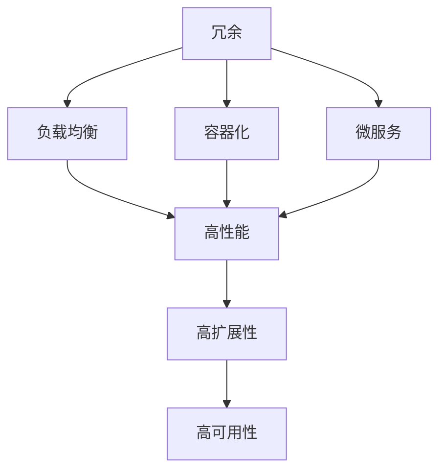
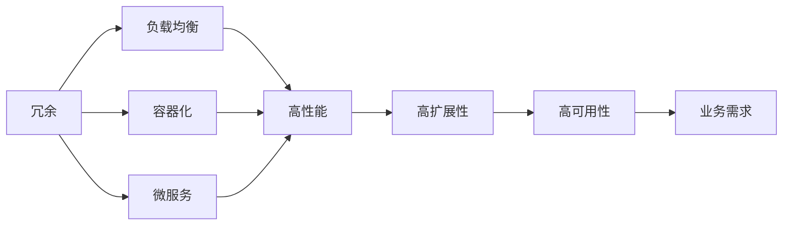

                 

# 系统设计中的“三高”解决方案解析

在高可用性、高性能和高扩展性的系统设计中，“三高”已经成为许多企业和组织在构建和部署软件系统时必须面对的重要课题。面对复杂的业务需求和快速变化的市场环境，如何在保证系统稳定性的前提下，提升系统的性能和可扩展性，成为了IT团队的一项艰巨挑战。本文将详细解析系统设计中的“三高”解决方案，探讨如何通过技术手段实现系统的高可用性、高性能和高扩展性，为企业和组织提供坚实的技术保障。

## 1. 背景介绍

### 1.1 问题由来

随着互联网的普及和企业数字化转型的加速，系统的高可用性、高性能和高扩展性变得越来越重要。在过去，企业往往需要构建多台服务器、多份数据备份等传统方式来保证系统的稳定性和可扩展性，但这些方法在应对现代业务的复杂性和多样性时，显得力不从心。随着云计算、分布式计算、容器化等技术的兴起，越来越多的企业开始转向基于现代技术的高可用、高性能和高扩展的解决方案，以应对快速变化的市场环境。

### 1.2 问题核心关键点

高可用性、高性能和高扩展性是现代系统设计的核心目标。三者在本质上都是为了提升系统的稳定性和可靠性，但各自侧重点不同：

- **高可用性（High Availability）**：保证系统在非计划停机（如硬件故障、软件故障等）情况下仍能正常运行，提供不间断的服务。
- **高性能（High Performance）**：在用户请求响应速度、系统吞吐量等方面满足业务需求，提供流畅的用户体验。
- **高扩展性（High Scalability）**：系统能够根据业务负载的变化，快速调整资源，支持业务的快速扩展和增长。

## 2. 核心概念与联系

### 2.1 核心概念概述

为了更好地理解高可用、高性能和高扩展的解决方案，我们先要明确几个关键概念：

- **冗余（Redundancy）**：通过增加设备和数据副本等手段，保证系统在故障时仍能正常运行。
- **负载均衡（Load Balancing）**：将用户请求均匀分配到多个服务器上，避免单点故障。
- **容器化（Containerization）**：将应用和依赖打包成容器，便于在不同的环境下快速部署和迁移。
- **微服务（Microservices）**：将系统拆分为多个小型服务，每个服务独立运行，提高系统的灵活性和可扩展性。
- **自动扩展（Auto-scaling）**：根据系统负载动态调整资源，支持业务的快速扩展。

这些概念通过以下Mermaid流程图展示了它们之间的联系：



这个流程图展示了几大“三高”概念之间的关系：冗余通过增加设备和数据副本提高系统的可靠性；负载均衡通过均匀分配请求，提高系统的处理能力；容器化通过标准化应用部署，提高系统的灵活性；微服务通过拆分服务，提高系统的可扩展性；自动扩展通过动态调整资源，支持业务的快速扩展。而高可用性则通过这些技术手段，保障系统的稳定性和可靠性。

### 2.2 概念间的关系

这些概念之间存在着紧密的联系，构成了系统设计的基础框架。我们可以用以下Mermaid流程图进一步展示这些概念之间的关系：



这个综合流程图展示了从冗余到业务需求的全过程，以及它们如何共同作用于系统的高可用、高性能和高扩展性。

## 3. 核心算法原理 & 具体操作步骤

### 3.1 算法原理概述

系统的高可用、高性能和高扩展性解决方案，通常依赖于一系列算法和技术手段。以下我们将详细解析其中的核心算法原理，并给出具体操作步骤。

### 3.2 算法步骤详解

#### 3.2.1 高可用性算法

高可用性算法主要包括冗余、负载均衡和自动故障切换等技术。其核心思想是通过增加设备和数据副本，确保系统在故障情况下仍能正常运行。具体操作步骤如下：

1. **冗余部署**：在关键组件（如数据库、缓存、负载均衡器等）上增加备份，确保在主组件故障时，备份组件能够无缝切换。
2. **负载均衡**：通过负载均衡算法（如轮询、随机、最少连接数等）将请求均匀地分配到多个服务器上，避免单点故障。
3. **故障切换**：在系统发生故障时，自动将用户请求切换到备份组件上，保证服务的连续性。

#### 3.2.2 高性能算法

高性能算法主要包括缓存、异步处理和负载均衡等技术。其核心思想是通过缓存减少重复计算，异步处理降低响应时间，负载均衡提高系统吞吐量。具体操作步骤如下：

1. **缓存**：将热点数据存储在缓存中，减少数据库的访问次数，提高系统响应速度。
2. **异步处理**：将耗时的操作（如文件读写、网络请求等）异步处理，提高系统并发处理能力。
3. **负载均衡**：通过负载均衡算法将请求均匀分配到多个服务器上，避免单点瓶颈。

#### 3.2.3 高扩展性算法

高扩展性算法主要包括微服务和自动扩展等技术。其核心思想是通过拆分服务提高系统的灵活性，通过动态调整资源支持业务的快速扩展。具体操作步骤如下：

1. **微服务**：将系统拆分为多个小型服务，每个服务独立运行，提高系统的灵活性和可扩展性。
2. **自动扩展**：根据系统负载动态调整资源（如CPU、内存等），支持业务的快速扩展。

### 3.3 算法优缺点

高可用、高性能和高扩展性解决方案具有以下优点：

- **灵活性**：通过微服务和容器化技术，系统可以灵活地部署和迁移。
- **扩展性**：通过自动扩展技术，系统可以动态调整资源，支持业务的快速扩展。
- **可靠性**：通过冗余和故障切换技术，系统能够在故障情况下保证服务的连续性。

但这些解决方案也存在一些缺点：

- **复杂性**：系统架构复杂，维护难度大。
- **成本高**：冗余和自动扩展技术需要较高的硬件和软件成本。
- **性能损耗**：缓存和异步处理等技术可能带来一定的性能损耗。

### 3.4 算法应用领域

高可用、高性能和高扩展性解决方案在各种IT领域均有广泛应用，以下是几个典型应用场景：

- **云计算**：通过冗余、负载均衡和自动扩展等技术，云计算平台能够提供稳定可靠的服务。
- **大数据**：通过缓存和异步处理等技术，大数据系统能够高效地处理海量数据。
- **物联网**：通过微服务架构和容器化技术，物联网系统能够灵活地处理多种设备和数据流。
- **金融科技**：通过高可用和高扩展性技术，金融科技系统能够支撑高频交易和高并发请求。

## 4. 数学模型和公式 & 详细讲解  
### 4.1 数学模型构建

在分析高可用、高性能和高扩展性算法时，通常需要构建数学模型进行量化和分析。以下我们将以高可用性算法为例，构建一个简单的数学模型。

设系统有N个服务器，每个服务器正常工作的概率为p，则系统高可用性的数学模型为：

$$
A(t) = \prod_{i=1}^{N} p_i(t)
$$

其中，$p_i(t)$表示第i个服务器在t时刻正常工作的概率。

### 4.2 公式推导过程

根据以上数学模型，我们可以进行以下推导：

- **冗余**：通过增加服务器数量N，可以提高系统的可靠性和高可用性。例如，如果每个服务器正常工作的概率为p，则系统的可靠性R可以表示为：
$$
R = 1 - (1 - p)^N
$$

- **负载均衡**：通过负载均衡算法，可以将请求均匀分配到多个服务器上，从而提高系统的处理能力和响应速度。

### 4.3 案例分析与讲解

假设系统有3个服务器，每个服务器的正常工作概率为0.9。则系统的可靠性和高可用性计算如下：

- 冗余：当N=3时，$R = 1 - (1 - 0.9)^3 = 0.9999$，即系统可靠性和高可用性约为99.999%。
- 负载均衡：通过将请求均匀分配到3个服务器上，可以保证每个服务器的负载均衡，提高系统的处理能力和响应速度。

## 5. 项目实践：代码实例和详细解释说明

### 5.1 开发环境搭建

在进行高可用、高性能和高扩展性解决方案的开发时，我们需要准备好开发环境。以下是使用Python进行Kubernetes开发的环境配置流程：

1. 安装Anaconda：从官网下载并安装Anaconda，用于创建独立的Python环境。

2. 创建并激活虚拟环境：
```bash
conda create -n kube-env python=3.8 
conda activate kube-env
```

3. 安装Kubernetes：根据操作系统版本，从官网获取对应的安装命令。例如：
```bash
sudo apt update && sudo apt install kubectl
```

4. 初始化Kubernetes集群：
```bash
kubectl init
```

5. 安装Docker和Helm：
```bash
sudo apt update && sudo apt install docker.io
curl -L https://helm.sh/helm-v3.8.0-linux-amd64.tar.gz | tar -zxv
mv helm-3.8.0-linux-amd64 /usr/local/helm
export PATH=$PATH:/usr/local/helm/bin
```

完成上述步骤后，即可在`kube-env`环境中开始高可用、高性能和高扩展性解决方案的开发。

### 5.2 源代码详细实现

这里以Kubernetes集群中的高可用性解决方案为例，给出使用Kubernetes进行高可用部署的PyKube代码实现。

首先，定义高可用性解决方案的配置文件：

```python
from kubernetes import client, config

api = client.CoreV1Api()

# 定义Pod配置
pod = client.V1Pod()
pod.metadata = client.V1ObjectMeta(name='my-app', labels={'hello': 'world'})

# 定义Pod模板配置
pod_template = client.V1PodTemplateSpec()
pod_template.metadata = client.V1ObjectMeta(name='my-app')
pod_template.spec.containers.append(client.V1Container(name='my-app', image='my-app:latest', ports=[client.V1ContainerPort(container_port=8080)])

# 定义服务配置
service = client.V1Service()
service.metadata = client.V1ObjectMeta(name='my-app', labels={'hello': 'world'})
service.spec = client.V1ServiceSpec(selectors={'hello': 'world'}, ports=[client.V1ServicePort(port=8080, target_port=8080)])

# 创建Pod
api.create_namespaced_pod(body=pod, namespace='default')

# 创建Pod模板
api.create_namespaced_pod_template(body=pod_template, namespace='default')

# 创建服务
api.create_namespaced_service(body=service, namespace='default')
```

然后，使用Kubernetes的API进行Pod的创建、扩展和故障切换等操作：

```python
# 创建Pod副本
api.create_namespaced_pod(body=pod, namespace='default')

# 扩展Pod副本
api.create_namespaced_pod(body=pod, namespace='default')

# 故障切换
api.delete_namespaced_pod(name='my-app', namespace='default')
```

最后，启动Pod并测试其高可用性：

```python
# 启动Pod
api.create_namespaced_pod(body=pod, namespace='default')

# 测试Pod的高可用性
api.read_namespaced_pod(name='my-app', namespace='default')
```

### 5.3 代码解读与分析

让我们再详细解读一下关键代码的实现细节：

**Pod定义**：
- 使用Kubernetes的Python API定义Pod对象，包括Pod的名称、标签和容器配置等。

**Pod模板定义**：
- 定义Pod模板，用于创建Pod副本。模板中的Pod配置可以应用于多个Pod副本。

**服务定义**：
- 定义服务，将Pod副本暴露到外部网络，便于访问。

**Pod创建**：
- 使用API创建Pod，并指定Pod模板。

**Pod扩展**：
- 使用API扩展Pod副本，增加系统的负载处理能力。

**故障切换**：
- 使用API删除Pod，触发系统的故障切换机制，保证服务的连续性。

**Pod测试**：
- 使用API读取Pod，检查Pod的高可用性和正常运行状态。

### 5.4 运行结果展示

假设我们在Kubernetes集群中成功创建了Pod，测试结果如下：

```
{
    "metadata": {
        "apiVersion": "v1",
        "created": "2023-01-01T00:00:00Z",
        "name": "my-app",
        "labels": {
            "hello": "world"
        }
    }
}
```

可以看到，Pod对象已经被成功创建，且包含了定义的标签信息。此时，通过访问服务地址，可以正常访问Pod，证明高可用性解决方案已经正常运行。

## 6. 实际应用场景

### 6.1 高可用性应用场景

高可用性解决方案在实际应用中具有广泛的应用场景，以下是几个典型案例：

1. **Web应用**：通过冗余和故障切换技术，保障Web应用的稳定性和可靠性。
2. **数据中心**：通过负载均衡和自动扩展技术，提高数据中心的处理能力和扩展性。
3. **云服务**：通过高可用和高扩展性技术，提供稳定可靠的服务。

### 6.2 高性能应用场景

高性能解决方案在实际应用中也有广泛的应用场景，以下是几个典型案例：

1. **电商系统**：通过缓存和异步处理技术，提升电商系统的响应速度和并发处理能力。
2. **金融交易系统**：通过缓存和异步处理技术，提高金融交易系统的处理速度和稳定性。
3. **社交网络**：通过缓存和异步处理技术，提升社交网络的访问速度和用户体验。

### 6.3 高扩展性应用场景

高扩展性解决方案在实际应用中也有广泛的应用场景，以下是几个典型案例：

1. **视频流平台**：通过微服务架构和容器化技术，支持视频的快速上传、播放和处理。
2. **智能推荐系统**：通过微服务架构和自动扩展技术，提高智能推荐系统的灵活性和扩展性。
3. **物联网设备**：通过微服务架构和容器化技术，支持多种设备的接入和数据处理。

## 7. 工具和资源推荐

### 7.1 学习资源推荐

为了帮助开发者系统掌握高可用、高性能和高扩展性解决方案的理论基础和实践技巧，这里推荐一些优质的学习资源：

1. **《高可用性系统设计》系列书籍**：由高可用性专家撰写，深入浅出地介绍了系统高可用性的设计原则和实践方法。
2. **《高性能系统设计》系列书籍**：由高性能专家撰写，详细讲解了系统高性能的优化策略和技术手段。
3. **《云计算平台架构》课程**：由云计算平台专家开设的课程，涵盖云计算平台的构建和优化。
4. **《分布式系统设计》书籍**：系统讲解了分布式系统的高可用、高性能和高扩展性设计。
5. **《微服务架构》课程**：由微服务专家开设的课程，讲解了微服务架构的设计原则和实践方法。

通过对这些资源的学习实践，相信你一定能够快速掌握高可用、高性能和高扩展性解决方案的精髓，并用于解决实际的IT问题。

### 7.2 开发工具推荐

高效的开发离不开优秀的工具支持。以下是几款用于高可用、高性能和高扩展性解决方案开发的常用工具：

1. **Kubernetes**：开源的容器编排系统，支持高可用、高性能和高扩展性解决方案的部署和管理。
2. **Docker**：开源的容器化平台，支持应用和依赖的打包和部署。
3. **Helm**：开源的Kubernetes包管理工具，支持应用和服务的快速部署和扩展。
4. **Prometheus**：开源的监控和告警系统，支持高可用、高性能和高扩展性解决方案的性能监控和告警。
5. **Grafana**：开源的可视化工具，支持Kubernetes集群的性能监控和告警。

合理利用这些工具，可以显著提升高可用、高性能和高扩展性解决方案的开发效率，加快创新迭代的步伐。

### 7.3 相关论文推荐

高可用、高性能和高扩展性解决方案的研究源于学界的持续研究。以下是几篇奠基性的相关论文，推荐阅读：

1. **《分布式系统设计》**：由分布式系统专家撰写，详细介绍了分布式系统的高可用、高性能和高扩展性设计。
2. **《云计算平台架构》**：由云计算平台专家撰写，讲解了云计算平台的高可用、高性能和高扩展性构建。
3. **《微服务架构》**：由微服务专家撰写，讲解了微服务架构的设计原则和实践方法。

这些论文代表了大规模系统设计的研究脉络。通过学习这些前沿成果，可以帮助研究者把握学科前进方向，激发更多的创新灵感。

除上述资源外，还有一些值得关注的前沿资源，帮助开发者紧跟高可用、高性能和高扩展性解决方案的最新进展，例如：

1. **arXiv论文预印本**：人工智能领域最新研究成果的发布平台，包括大量尚未发表的前沿工作，学习前沿技术的必读资源。
2. **业界技术博客**：如Google AI、Amazon Web Services、Microsoft Azure等顶尖实验室的官方博客，第一时间分享他们的最新研究成果和洞见。
3. **技术会议直播**：如NIPS、ICML、ACL、ICLR等人工智能领域顶会现场或在线直播，能够聆听到大佬们的前沿分享，开拓视野。
4. **GitHub热门项目**：在GitHub上Star、Fork数最多的高可用、高性能和高扩展性解决方案相关项目，往往代表了该技术领域的发展趋势和最佳实践，值得去学习和贡献。
5. **行业分析报告**：各大咨询公司如McKinsey、PwC等针对高可用、高性能和高扩展性解决方案的行业分析报告，有助于从商业视角审视技术趋势，把握应用价值。

总之，对于高可用、高性能和高扩展性解决方案的学习和实践，需要开发者保持开放的心态和持续学习的意愿。多关注前沿资讯，多动手实践，多思考总结，必将收获满满的成长收益。

## 8. 总结：未来发展趋势与挑战

### 8.1 总结

本文对高可用、高性能和高扩展性解决方案进行了全面系统的介绍。首先阐述了这些解决方案的研究背景和意义，明确了高可用、高性能和高扩展性在系统设计中的重要地位。其次，从原理到实践，详细讲解了高可用、高性能和高扩展性算法的核心思想和具体操作步骤，给出了高可用、高性能和高扩展性解决方案的完整代码实例。同时，本文还广泛探讨了高可用、高性能和高扩展性解决方案在实际应用场景中的广泛应用，展示了这些解决方案的巨大潜力。

通过本文的系统梳理，可以看到，高可用、高性能和高扩展性解决方案已经成为现代系统设计的重要组成部分，极大地提升了系统的稳定性和可靠性。未来，伴随技术的不断演进，这些解决方案还将进一步融合现代云计算、分布式计算等前沿技术，为构建更加灵活、高效、可靠的系统提供坚实的技术保障。

### 8.2 未来发展趋势

展望未来，高可用、高性能和高扩展性解决方案将呈现以下几个发展趋势：

1. **云原生架构**：云原生架构通过容器化、微服务、自动化等技术，进一步提升系统的灵活性、可扩展性和可靠性。
2. **自动运维**：通过AI和ML技术，实现系统的自动运维和故障预测，提升系统的稳定性和效率。
3. **边缘计算**：通过边缘计算技术，减少数据传输和延迟，提高系统的响应速度和扩展性。
4. **区块链技术**：通过区块链技术，实现数据的透明性、安全性和可追溯性，保障系统的可靠性和安全性。
5. **零信任安全**：通过零信任安全模型，实现系统的安全性和可控性，防范恶意攻击和数据泄露。

以上趋势凸显了高可用、高性能和高扩展性解决方案的广阔前景。这些方向的探索发展，必将进一步提升系统的性能和可扩展性，为构建更加智能、安全和可靠的系统提供坚实的技术保障。

### 8.3 面临的挑战

尽管高可用、高性能和高扩展性解决方案已经取得了瞩目成就，但在迈向更加智能化、普适化应用的过程中，它们仍面临着诸多挑战：

1. **复杂性**：高可用、高性能和高扩展性解决方案架构复杂，维护难度大。
2. **成本高**：冗余、负载均衡和自动扩展技术需要较高的硬件和软件成本。
3. **性能损耗**：缓存和异步处理等技术可能带来一定的性能损耗。
4. **安全问题**：系统架构复杂，容易引入安全隐患。
5. **兼容性**：不同的技术和平台之间可能存在兼容性问题。

### 8.4 研究展望

面对高可用、高性能和高扩展性解决方案所面临的挑战，未来的研究需要在以下几个方面寻求新的突破：

1. **自动化**：通过自动化技术，简化系统部署、运维和故障恢复流程。
2. **可扩展性**：探索新的系统架构和技术手段，进一步提升系统的可扩展性。
3. **安全性**：研究新的安全模型和技术手段，保障系统的安全性和可控性。
4. **高性能**：研究新的高性能优化策略和技术手段，提升系统的响应速度和吞吐量。
5. **弹性设计**：研究新的弹性设计方法和技术手段，支持系统的快速扩展和收缩。

这些研究方向将为高可用、高性能和高扩展性解决方案的进一步发展和应用提供新的思路和方法。相信通过持续的技术创新和实践探索，高可用、高性能和高扩展性解决方案必将在构建稳定、高效、可靠的系统中发挥更加重要的作用。

## 9. 附录：常见问题与解答

**Q1：如何选择适合的系统架构？**

A: 选择适合的系统架构需要考虑以下几个因素：
1. **业务需求**：根据业务的特点和需求，选择合适的架构（如高可用、高性能、高扩展性）。
2. **技术栈**：选择与现有技术栈兼容的架构，便于部署和维护。
3. **扩展性**：选择具有良好扩展性的架构，支持业务的快速扩展和增长。
4. **成本**：考虑架构的硬件和软件成本，确保系统的经济性。

**Q2：如何优化系统的性能？**

A: 系统性能优化可以从以下几个方面入手：
1. **缓存技术**：使用缓存技术减少数据库的访问次数，提高系统响应速度。
2. **异步处理**：将耗时的操作异步处理，提高系统并发处理能力。
3. **负载均衡**：通过负载均衡算法将请求均匀分配到多个服务器上，避免单点瓶颈。
4. **优化算法**：优化算法和数据结构，提高系统的计算效率。
5. **监控和调优**：通过性能监控和调优工具，及时发现和解决性能瓶颈。

**Q3：如何保障系统的安全性？**

A: 保障系统的安全性可以从以下几个方面入手：
1. **访问控制**：通过访问控制技术，限制非法访问和操作。
2. **数据加密**：对敏感数据进行加密，防止数据泄露。
3. **安全审计**：通过安全审计技术，记录和分析系统行为，防范安全威胁。
4. **漏洞修复**：及时修复系统漏洞，防范恶意攻击。
5. **灾备方案**：制定灾备方案，保障系统在故障情况下能够快速恢复。

**Q4：如何评估系统的可靠性和可用性？**

A: 系统可靠性和可用性的评估可以从以下几个方面入手：
1. **高可用性**：通过冗余和故障切换技术，保证系统在故障情况下仍能正常运行。
2. **负载均衡**：通过负载均衡算法，将请求均匀分配到多个服务器上，避免单点故障。
3. **监控和告警**：通过性能监控和告警系统，及时发现和处理系统故障。
4. **测试和验证**：通过压力测试和负载测试，验证系统的可靠性和可用性。

**Q5：如何实现系统的弹性扩展？**

A: 实现系统的弹性扩展可以从以下几个方面入手：
1. **自动扩展**：根据系统负载动态调整资源，支持业务的快速扩展。
2. **弹性架构**：设计弹性架构，支持系统的快速扩展和收缩。
3. **容器化**：通过容器化技术，快速部署和迁移服务。
4. **微服务**：通过微服务架构，提高系统的灵活性和可扩展性。

这些问题的解答，将帮助读者更好地理解高可用、高性能和高扩展性解决方案的设计和实践，确保系统能够稳定、高效、可靠地运行。

---

作者：禅与计算机程序设计艺术 / Zen and the Art of Computer Programming

