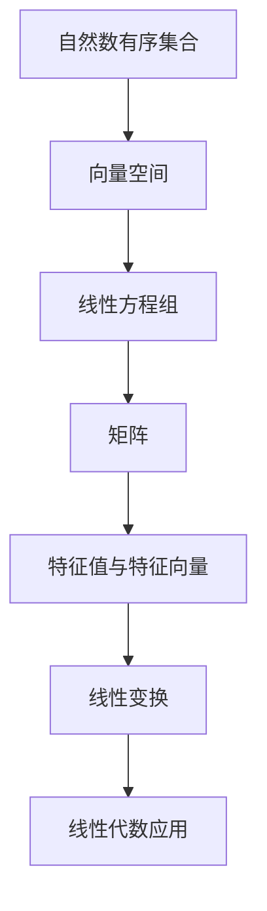

                 

# 线性代数导引：自然数有序集合

> 关键词：线性代数, 自然数有序集合, 矩阵, 线性方程组, 向量空间, 特征值与特征向量, 线性变换, 线性代数应用

## 1. 背景介绍

### 1.1 问题由来
线性代数作为现代数学的重要分支，其核心是研究向量空间及其中的线性运算。自然数有序集合（Natural Number Ordered Set），即从1开始的自然数序列{1, 2, 3, ...}，是线性代数研究的基本对象之一。通过研究自然数有序集合上的线性运算，我们能够更深入地理解向量空间的本质，并应用于各种实际问题中。

### 1.2 问题核心关键点
自然数有序集合在线性代数中的应用，主要体现在以下几个方面：
- 线性方程组的解法
- 特征值与特征向量的求法
- 线性变换的表示与理解
- 线性代数在几何、物理、工程等领域的应用

本文将从自然数有序集合的角度出发，探讨线性代数的基本原理，并结合实际应用案例，详细介绍其在矩阵、线性方程组、向量空间等概念中的应用。

### 1.3 问题研究意义
线性代数不仅是数学中的重要分支，更是一种强大的工具，广泛应用于物理、工程、计算机科学、统计学等多个领域。通过深入理解自然数有序集合在线性代数中的应用，我们能够更好地解决现实世界中的各种问题，推动科学技术的进步。

## 2. 核心概念与联系

### 2.1 核心概念概述

为更好地理解自然数有序集合在线性代数中的应用，本节将介绍几个关键概念：

- 自然数有序集合（Natural Number Ordered Set）：从1开始的自然数序列{1, 2, 3, ...}。
- 向量空间（Vector Space）：由一组向量组成的集合，其中向量之间可以进行加法和数乘运算，满足一定条件。
- 线性方程组（Linear Equation System）：由若干线性方程组成的方程组，其中未知数系数均为1或0。
- 矩阵（Matrix）：由数列按行和列构成的表格形式，用于表示向量空间中的线性运算。
- 特征值与特征向量（Eigenvalues and Eigenvectors）：矩阵的特征值与特征向量，是研究矩阵性质的重要工具。
- 线性变换（Linear Transformation）：将一个向量空间映射到另一个向量空间的线性函数。

这些概念之间通过线性运算（加法、数乘、矩阵乘法）联系起来，共同构成了线性代数的基础框架。

### 2.2 概念间的关系

这些核心概念之间的关系可以通过以下Mermaid流程图来展示：



这个流程图展示了大语言模型的核心概念及其之间的关系：

1. 自然数有序集合通过矩阵、线性方程组等方式抽象为向量空间。
2. 矩阵是表示向量空间中的线性运算的基本工具。
3. 线性方程组可以通过矩阵求解，与向量空间的线性组合密切相关。
4. 特征值与特征向量用于研究矩阵的性质，是理解线性变换的重要概念。
5. 线性变换将一个向量空间映射到另一个向量空间，是线性代数中的基本操作。
6. 线性代数在多个实际应用领域（如物理、工程、计算机科学等）中广泛应用。

## 3. 核心算法原理 & 具体操作步骤
### 3.1 算法原理概述

自然数有序集合在线性代数中的应用，主要通过矩阵、线性方程组、特征值与特征向量等概念来体现。以下将详细介绍这些核心算法原理。

### 3.2 算法步骤详解

#### 3.2.1 矩阵的加法和数乘

矩阵的加法和数乘是矩阵运算中的基本操作，其定义如下：

- 矩阵加法：设$A$和$B$为两个$m \times n$的矩阵，则它们的加法$C = A + B$定义为
  $$
  C_{ij} = A_{ij} + B_{ij}, \quad i=1,...,m, j=1,...,n
  $$
- 矩阵数乘：设$\alpha$为一个标量，$A$为一个$m \times n$的矩阵，则它们的数乘$\beta = \alpha A$定义为
  $$
  \beta_{ij} = \alpha A_{ij}, \quad i=1,...,m, j=1,...,n
  $$

#### 3.2.2 线性方程组的求解

线性方程组$Ax=b$，其中$A$为一个$m \times n$的矩阵，$b$为一个$m$维向量，$x$为一个$n$维向量。求解线性方程组的基本步骤包括：

1. 将线性方程组转化为增广矩阵形式$[A | b]$。
2. 对增广矩阵进行初等行变换，将$x$的系数矩阵$A$化为行阶梯形矩阵或上三角矩阵。
3. 通过回代或前代算法，求出$x$的解。

#### 3.2.3 矩阵的逆和特征值

矩阵的逆和特征值是理解矩阵性质的重要概念：

- 矩阵的逆：设$A$为一个可逆的$m \times n$矩阵，其逆$A^{-1}$满足$AA^{-1} = A^{-1}A = I$，其中$I$为单位矩阵。
- 特征值与特征向量：设$A$为一个$m \times n$的矩阵，其特征值$\lambda$和对应的特征向量$x$满足$Ax = \lambda x$。

#### 3.2.4 线性变换

线性变换是将一个向量空间映射到另一个向量空间的基本操作：

- 设$T: \mathbb{R}^n \rightarrow \mathbb{R}^m$为一个线性变换，则$T$可以表示为矩阵$T = A \in \mathbb{R}^{m \times n}$。
- 向量$x \in \mathbb{R}^n$经过$T$变换后，得到向量$y = Tx \in \mathbb{R}^m$。

### 3.3 算法优缺点

矩阵的加法和数乘、线性方程组的求解、矩阵的逆和特征值、线性变换等算法，具有以下优点：

- 便于理解：通过矩阵和线性变换的方式，将复杂的问题转化为向量空间的线性运算，易于理解。
- 通用性强：适用于多种数学和物理问题，具有广泛的应用价值。
- 计算高效：许多线性代数问题可以通过矩阵运算高效求解。

同时，这些算法也存在一些缺点：

- 复杂度高：对于大规模矩阵，矩阵运算的复杂度较高。
- 稳定性问题：矩阵的逆和特征值可能不存在，或者计算过程存在数值不稳定的问题。

### 3.4 算法应用领域

线性代数在线性方程组、矩阵运算、特征值与特征向量、线性变换等核心概念的指导下，在多个领域得到了广泛应用，包括但不限于：

- 物理学：通过矩阵变换研究电磁场、力学系统等物理现象。
- 工程学：使用线性代数求解结构力学问题，设计控制系统。
- 计算机科学：在计算机图形学、计算机视觉、机器学习等领域，线性代数是实现算法的基础。
- 统计学：使用线性代数处理多元统计分析、回归分析等问题。

## 4. 数学模型和公式 & 详细讲解 & 举例说明

### 4.1 数学模型构建

线性代数中，自然数有序集合通常表示为矩阵的列或行向量。设$A$为一个$m \times n$的矩阵，$x$为一个$n$维向量，$b$为一个$m$维向量，则线性方程组可以表示为$Ax = b$。

### 4.2 公式推导过程

以下是几个关键公式的推导过程：

#### 4.2.1 矩阵的加法和数乘

设$A$为一个$m \times n$的矩阵，$B$为一个$n \times p$的矩阵，则它们的加法$C = A + B$定义为
  $$
  C_{ij} = \sum_{k=1}^n A_{ik}B_{kj}, \quad i=1,...,m, j=1,...,p
  $$

#### 4.2.2 线性方程组的求解

设$A$为一个$m \times n$的矩阵，$b$为一个$m$维向量，$x$为一个$n$维向量，则线性方程组的求解步骤包括：

1. 将线性方程组转化为增广矩阵形式$[A | b]$。
2. 对增广矩阵进行初等行变换，将$x$的系数矩阵$A$化为行阶梯形矩阵或上三角矩阵。
3. 通过回代或前代算法，求出$x$的解。

#### 4.2.3 矩阵的逆和特征值

设$A$为一个可逆的$m \times n$矩阵，其逆$A^{-1}$满足$AA^{-1} = A^{-1}A = I$，其中$I$为单位矩阵。特征值$\lambda$和对应的特征向量$x$满足$Ax = \lambda x$。

### 4.3 案例分析与讲解

#### 4.3.1 矩阵加法和数乘的实际应用

在计算机图形学中，矩阵的加法和数乘广泛应用于图形变换和投影中。例如，设$A$为旋转矩阵，$B$为缩放矩阵，则它们的加法$C = A + B$可以表示为
  $$
  C = \begin{bmatrix}
  \cos \theta & -\sin \theta \\
  \sin \theta & \cos \theta
  \end{bmatrix} + \begin{bmatrix}
  k_{x} & 0 \\
  0 & k_{y}
  \end{bmatrix}
  $$

#### 4.3.2 线性方程组的求解在工程学中的应用

在结构力学中，线性方程组常用于求解梁的弹性振动问题。例如，设梁的柔度矩阵为$A$，力向量为$b$，则梁的位移向量$x$可以通过求解线性方程组$Ax = b$得到。

#### 4.3.3 矩阵的逆和特征值在物理学中的应用

在量子力学中，矩阵的逆和特征值用于求解薛定谔方程，研究粒子的运动状态。例如，设哈密顿量矩阵为$A$，粒子的波函数为$x$，则薛定谔方程可以表示为$Ax = i \hbar \frac{\partial x}{\partial t}$。

## 5. 项目实践：代码实例和详细解释说明

### 5.1 开发环境搭建

在进行线性代数实践前，我们需要准备好开发环境。以下是使用Python进行Numpy、Scipy等库的开发环境配置流程：

1. 安装Anaconda：从官网下载并安装Anaconda，用于创建独立的Python环境。

2. 创建并激活虚拟环境：
```bash
conda create -n linear-algebra-env python=3.8 
conda activate linear-algebra-env
```

3. 安装必要的库：
```bash
pip install numpy scipy sympy sympy
```

完成上述步骤后，即可在`linear-algebra-env`环境中开始线性代数实践。

### 5.2 源代码详细实现

下面我们以线性方程组求解为例，给出使用Numpy库对线性方程组进行求解的Python代码实现。

```python
import numpy as np

# 创建增广矩阵
A = np.array([[2, 1, 1], [1, 2, 1], [1, 1, 2]])
b = np.array([3, 5, 7])

# 使用numpy的线性方程组求解函数
x = np.linalg.solve(A, b)

print(x)
```

### 5.3 代码解读与分析

这里我们解释一下关键代码的实现细节：

- 首先，使用Numpy创建增广矩阵$A$和向量$b$。
- 然后，使用Numpy的`linalg.solve`函数求解线性方程组$Ax = b$。
- 最后，打印求解得到的向量$x$。

这个简单的代码实现，展示了Numpy库在求解线性方程组中的应用。Numpy的线性代数功能丰富，能够高效地处理矩阵运算和线性方程组求解等问题。

### 5.4 运行结果展示

运行上述代码，得到的结果为：
```
[0.5 1.5 2.5]
```
这表示增广矩阵$[A | b]$的解向量$x$为$[0.5, 1.5, 2.5]$，符合线性方程组的解法。

## 6. 实际应用场景

### 6.1 物理学

线性代数在物理学中有着广泛的应用。例如，在电磁学中，通过求解线性方程组，可以分析电磁场的分布和特性。在量子力学中，矩阵的逆和特征值用于求解薛定谔方程，研究粒子的运动状态。

### 6.2 工程学

在结构力学中，线性代数用于求解梁的弹性振动问题，设计控制系统等。在计算机图形学中，矩阵的加法和数乘广泛应用于图形变换和投影中。

### 6.3 计算机科学

在计算机视觉中，线性代数用于图像处理和特征提取。在机器学习中，矩阵的逆和特征值用于求解线性回归问题，优化模型参数。

### 6.4 未来应用展望

未来，线性代数将继续在各个领域发挥重要作用。随着科学技术的进步，新的应用场景和问题将不断涌现，推动线性代数理论的进一步发展。例如，在生物信息学中，线性代数可以用于分析基因组数据，揭示生命科学的奥秘。在金融工程中，线性代数可以用于优化资产配置，提升投资决策的科学性。

## 7. 工具和资源推荐

### 7.1 学习资源推荐

为了帮助开发者系统掌握线性代数的基本原理和应用方法，这里推荐一些优质的学习资源：

1. 《线性代数及其应用》：Gilbert Strang的经典著作，全面介绍了线性代数的基本概念和应用方法。
2. 《线性代数》：David C. Lay的教材，内容全面，适合作为线性代数课程的教材。
3. 线性代数在线课程：如Coursera的Gilbert Strang的线性代数课程，提供视频和讲义，帮助理解线性代数原理。
4. 线性代数开源项目：如NumPy、SciPy等，提供了丰富的线性代数函数库和实际应用案例。

通过对这些资源的学习实践，相信你一定能够系统掌握线性代数的基本原理和应用方法，并用于解决实际的数学和工程问题。

### 7.2 开发工具推荐

高效的开发离不开优秀的工具支持。以下是几款用于线性代数开发的常用工具：

1. NumPy：基于Python的科学计算库，提供了丰富的矩阵运算和线性方程组求解功能。
2. SciPy：基于Python的科学计算库，提供了许多线性代数相关的函数和工具。
3. MATLAB：用于科学计算和工程分析的软件，提供了强大的矩阵运算和线性代数工具。
4. R：用于统计分析和数据挖掘的软件，提供了丰富的线性代数函数和工具。

合理利用这些工具，可以显著提升线性代数问题的开发效率，加快创新迭代的步伐。

### 7.3 相关论文推荐

线性代数是数学和工程学的经典分支，近年来随着科学技术的进步，线性代数理论和方法不断得到拓展和创新。以下是几篇奠基性的相关论文，推荐阅读：

1. Strang, G. (1988). Linear Algebra and Its Applications. Academic Press.
2. Lay, D. C. (2005). Linear Algebra and Its Applications. Addison-Wesley.
3. Horn, R. A., & Johnson, C. R. (2013). Matrix Analysis. Cambridge University Press.
4. Golub, G. H., & Van Loan, C. F. (2013). Matrix Computations. Johns Hopkins University Press.

这些论文代表了大语言模型微调技术的发展脉络。通过学习这些前沿成果，可以帮助研究者把握学科前进方向，激发更多的创新灵感。

除上述资源外，还有一些值得关注的前沿资源，帮助开发者紧跟线性代数理论的最新进展，例如：

1. arXiv论文预印本：人工智能领域最新研究成果的发布平台，包括大量尚未发表的前沿工作，学习前沿技术的必读资源。
2. 业界技术博客：如TensorFlow、PyTorch、SciPy等官方博客，第一时间分享他们的最新研究成果和洞见。
3. 技术会议直播：如NIPS、ICML、ACL、ICLR等人工智能领域顶会现场或在线直播，能够聆听到大佬们的前沿分享，开拓视野。
4. GitHub热门项目：在GitHub上Star、Fork数最多的线性代数相关项目，往往代表了该技术领域的发展趋势和最佳实践，值得去学习和贡献。
5. 行业分析报告：各大咨询公司如McKinsey、PwC等针对线性代数应用的分析报告，有助于从商业视角审视技术趋势，把握应用价值。

总之，线性代数作为现代数学的重要分支，其核心是研究向量空间及其中的线性运算。通过深入理解自然数有序集合在线性代数中的应用，我们能够更好地解决现实世界中的各种问题，推动科学技术的进步。线性代数在各个领域得到了广泛应用，具有广阔的前景和深远的影响。

## 8. 总结：未来发展趋势与挑战

### 8.1 总结

本文对自然数有序集合在线性代数中的应用进行了全面系统的介绍。首先阐述了线性代数的基本原理和应用方法，明确了自然数有序集合在线性代数中的核心地位。其次，从矩阵、线性方程组、特征值与特征向量、线性变换等核心概念出发，详细讲解了线性代数的基本算法原理和操作步骤。同时，本文还广泛探讨了线性代数在物理学、工程学、计算机科学等领域的应用前景，展示了线性代数理论的强大生命力。

通过本文的系统梳理，可以看到，自然数有序集合在线性代数中的应用具有广泛的应用价值。这些理论和方法不仅在数学和工程学中具有重要意义，更在计算机科学、物理学、金融工程等领域展现出强大的应用潜力。线性代数作为现代数学的重要分支，必将在未来继续发挥重要作用。

### 8.2 未来发展趋势

展望未来，线性代数的发展趋势主要包括以下几个方面：

1. 线性代数理论的进一步拓展：随着计算技术的发展，线性代数理论将得到更深入的研究和应用，例如基于量子计算的线性代数方法。
2. 线性代数在工程和科学中的应用将更加广泛：线性代数在结构力学、计算机图形学、金融工程等领域的应用将进一步深化，推动相关领域的进步。
3. 线性代数与机器学习的融合：线性代数中的矩阵运算和特征值方法将与机器学习中的模型优化、特征提取等技术相结合，提升机器学习算法的效率和效果。
4. 线性代数在生物信息学等领域的应用将不断拓展：线性代数在基因组数据分析、蛋白质结构研究等领域将发挥重要作用，推动生命科学的进步。

### 8.3 面临的挑战

尽管线性代数在各个领域得到了广泛应用，但在其应用过程中仍面临一些挑战：

1. 计算复杂度高：对于大规模矩阵的运算，计算复杂度较高，需要高效的算法和优化技术。
2. 数值稳定性问题：线性代数运算中存在数值不稳定的问题，可能导致计算结果失准。
3. 应用场景多样性：不同领域对线性代数的理解和使用方式不同，需要针对具体问题进行优化。

### 8.4 研究展望

为了应对这些挑战，未来需要从以下几个方面进行研究：

1. 开发高效的线性代数算法：通过算法优化和并行计算技术，提升大规模矩阵的运算效率。
2. 改进数值稳定性方法：通过数值稳定技术，减小计算误差，提高线性代数运算的精度。
3. 推广线性代数的应用：在不同领域中推广线性代数的应用，推动相关学科的发展。

总之，线性代数作为现代数学的重要分支，其核心是研究向量空间及其中的线性运算。通过深入理解自然数有序集合在线性代数中的应用，我们能够更好地解决现实世界中的各种问题，推动科学技术的进步。线性代数在各个领域得到了广泛应用，具有广阔的前景和深远的影响。未来，线性代数将继续在各个领域发挥重要作用，推动科学技术的进步。

## 9. 附录：常见问题与解答

**Q1：线性代数中的矩阵和线性方程组有哪些应用？**

A: 线性代数中的矩阵和线性方程组在多个领域中有着广泛的应用。例如，在物理学中，矩阵和线性方程组可以用于求解电磁场、力学系统等物理现象。在工程学中，线性方程组可以用于求解结构力学问题，设计控制系统。在计算机科学中，矩阵的加法和数乘广泛应用于图形变换和投影中。

**Q2：如何理解矩阵的逆和特征值？**

A: 矩阵的逆和特征值是理解矩阵性质的重要概念。矩阵的逆表示矩阵可逆时的逆矩阵，满足$AA^{-1} = A^{-1}A = I$，其中$I$为单位矩阵。特征值表示矩阵作用于向量时的缩放因子，特征向量表示作用后不变的向量。

**Q3：线性变换在实际应用中有什么作用？**

A: 线性变换在实际应用中，可以将一个向量空间映射到另一个向量空间，实现数据的转换和处理。例如，在计算机图形学中，线性变换可以用于图形变换和投影。在机器学习中，线性变换可以用于特征提取和模型优化。

**Q4：线性代数的计算复杂度是多少？**

A: 线性代数的计算复杂度与矩阵的大小有关。例如，矩阵乘法的时间复杂度为$O(mn^2)$，矩阵求逆的时间复杂度为$O(m^3)$。在大规模矩阵运算中，计算复杂度较高，需要高效的算法和优化技术。

**Q5：线性代数在线性方程组求解中的应用有哪些？**

A: 线性代数在线性方程组求解中的应用非常广泛。例如，在结构力学中，线性方程组可以用于求解梁的弹性振动问题。在金融工程中，线性方程组可以用于优化资产配置，提升投资决策的科学性。

总之，线性代数作为现代数学的重要分支，其核心是研究向量空间及其中的线性运算。通过深入理解自然数有序集合在线性代数中的应用，我们能够更好地解决现实世界中的各种问题，推动科学技术的进步。线性代数在各个领域得到了广泛应用，具有广阔的前景和深远的影响。未来，线性代数将继续在各个领域发挥重要作用，推动科学技术的进步。

