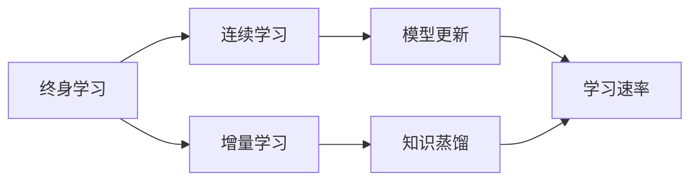

                 

# 终身学习Lifelong Learning原理与代码实例讲解

> 关键词：终身学习,连续学习,增量学习,模型更新,学习速率,知识蒸馏

## 1. 背景介绍

### 1.1 问题由来
随着技术的快速进步，人工智能（AI）、机器学习（ML）等技术在各行各业得到了广泛的应用，但它们往往要求大量的数据和计算资源来训练和优化模型。在实际应用中，模型通常需要在多个数据集上进行训练，并在多个阶段进行更新以保持其性能和准确性。

为了应对这些挑战，学术界和工业界提出了终身学习的概念。终身学习是一种让机器能够在不断获得新数据的情况下，持续学习并保持其知识和技能的策略。

### 1.2 问题核心关键点
终身学习的核心在于：模型需要持续地学习新知识，同时保存和利用以往学习的知识，以保持其性能和准确性。

- **知识积累**：终身学习需要模型在不断学习新数据的过程中，保持对已有知识的积累和利用。
- **知识更新**：在获得新数据后，模型需要能够更新其知识，以适应新的任务和场景。
- **知识遗忘**：模型需要避免对旧知识的遗忘，以便更好地重用已有知识。

### 1.3 问题研究意义
终身学习具有以下几个方面的意义：

- **提高模型性能**：终身学习通过不断学习新数据，可以显著提升模型的性能，特别是在处理动态数据集时。
- **适应性更强**：终身学习使模型能够适应新的环境和任务，增强模型的泛化能力。
- **资源利用效率更高**：终身学习可以避免对大规模数据集的重复训练，节省计算资源。
- **快速迭代**：终身学习有助于快速迭代模型，提高模型更新的频率和效率。

## 2. 核心概念与联系

### 2.1 核心概念概述

为了更好地理解终身学习的原理，本节将介绍几个关键概念：

- **终身学习**：指的是模型在不断获得新数据的情况下，持续学习和更新其知识的过程。
- **连续学习**：指的是模型在连续获得新数据的情况下，进行不断学习和更新，以达到更高效的性能。
- **增量学习**：指的是模型在每次获得新数据时，仅更新部分参数，以保持其结构和性能。
- **知识蒸馏**：指的是通过将已有模型的知识转移给新模型，从而提升新模型的性能。
- **模型更新**：指的是通过更新模型参数，使模型能够适应新的数据集和任务。
- **学习速率**：指的是模型在每次更新时，学习新知识的速度。

这些概念之间存在紧密的联系，共同构成了终身学习的完整框架。

### 2.2 概念间的关系

这些核心概念之间的逻辑关系可以通过以下Mermaid流程图来展示：



这个流程图展示了终身学习过程中各个概念之间的关系：

1. 终身学习是一个整体概念，包含连续学习、增量学习和模型更新等多个方面。
2. 连续学习是指模型在连续不断的数据流中进行学习。
3. 增量学习是指模型仅更新部分参数，以保持其结构和性能。
4. 模型更新是通过更新参数，使模型能够适应新的数据集和任务。
5. 学习速率是指模型每次更新时，学习新知识的速度。

## 3. 核心算法原理 & 具体操作步骤
### 3.1 算法原理概述

终身学习的核心算法原理可以概括为以下几个步骤：

1. **数据流处理**：模型需要不断处理新的数据，这些数据可以是新采集的数据，也可以是历史数据的更新。
2. **知识更新**：模型需要根据新的数据，更新其知识，包括更新参数、添加新特征、调整权重等。
3. **知识保持**：模型需要保持对已有知识的记忆，以便在需要时重新利用。
4. **知识蒸馏**：模型需要将已有的知识转移给新模型，以提升新模型的性能。

### 3.2 算法步骤详解

基于上述原理，终身学习的具体操作步骤如下：

**Step 1: 准备数据流**
- 收集和整理数据流，确保数据的时序性和连续性。
- 划分数据流为训练集、验证集和测试集。

**Step 2: 初始化模型**
- 选择适合的模型结构，如卷积神经网络（CNN）、循环神经网络（RNN）、Transformer等。
- 初始化模型参数，并设定学习速率和正则化参数。

**Step 3: 模型训练**
- 将数据流中的数据依次输入模型，进行前向传播和反向传播，计算损失函数。
- 更新模型参数，使损失函数最小化。
- 定期在验证集上评估模型性能，以防止过拟合。

**Step 4: 知识保持**
- 使用额外的存储机制，如数据库、缓存等，保存模型的中间状态和结果。
- 在模型更新时，从保存的状态中恢复旧模型，与新模型结合进行训练。

**Step 5: 知识蒸馏**
- 通过将已有模型的知识蒸馏给新模型，提升新模型的性能。
- 常用的知识蒸馏方法包括最大似然蒸馏、对抗蒸馏、多任务蒸馏等。

### 3.3 算法优缺点

终身学习具有以下优点：

- **动态适应**：终身学习能够适应不断变化的环境和数据集，保持模型性能。
- **资源高效**：终身学习可以避免对大规模数据集的重复训练，节省计算资源。
- **灵活性高**：终身学习能够根据不同的任务和场景，灵活调整模型结构和参数。

同时，终身学习也存在一些局限：

- **模型复杂性高**：终身学习需要处理多个数据集，模型结构和参数的调整较为复杂。
- **数据依赖性强**：终身学习对数据流的依赖性较强，需要保证数据的完整性和准确性。
- **知识保留难度大**：终身学习需要找到有效的方法，保持对已有知识的记忆和利用。

### 3.4 算法应用领域

终身学习广泛应用于以下几个领域：

- **推荐系统**：如电商平台的个性化推荐，电影推荐等，推荐系统需要不断学习新的用户行为和商品信息。
- **医疗诊断**：医疗影像、基因数据等需要不断学习新的病例，以提升诊断的准确性。
- **金融预测**：股票、汇率等需要不断学习新的市场数据，以预测未来的趋势。
- **自动驾驶**：自动驾驶系统需要不断学习新的环境信息，以提高安全性和稳定性。

这些领域的数据和任务具有较强的动态性和实时性，终身学习能够显著提升模型的性能和应用效果。

## 4. 数学模型和公式 & 详细讲解  
### 4.1 数学模型构建

终身学习的数学模型可以表示为：

$$
\begin{aligned}
&\min_{\theta} \frac{1}{N} \sum_{i=1}^N \ell(y_i, f_{\theta}(x_i)) \\
&\quad s.t. \quad f_{\theta}(x_i) = \mathbb{E}_{P(x)}\left[\ell\left(y_i, f_{\theta}\left(x_i\right)\right) \mid x_i\right]
\end{aligned}
$$

其中，$x_i$ 为输入数据，$y_i$ 为标签，$f_{\theta}(x_i)$ 为模型对数据的预测，$\ell$ 为损失函数，$P(x)$ 为数据的分布，$\theta$ 为模型的参数。

目标是最小化预测误差，同时保证模型的泛化能力。

### 4.2 公式推导过程

以二分类任务为例，我们推导终身学习的公式。

假设模型在输入 $x_i$ 上的预测为 $f_{\theta}(x_i) = \sigma(w^T x_i + b)$，其中 $\sigma$ 为激活函数，$w$ 为权重向量，$b$ 为偏置。损失函数为交叉熵损失：

$$
\ell(f_{\theta}(x_i), y_i) = -(y_i \log f_{\theta}(x_i) + (1-y_i) \log (1-f_{\theta}(x_i)))
$$

终身学习的目标是最小化经验风险：

$$
\mathcal{L}(\theta) = \frac{1}{N} \sum_{i=1}^N \ell(f_{\theta}(x_i), y_i)
$$

在每次获得新的数据 $x_i$ 和标签 $y_i$ 时，更新模型参数 $\theta$，使得模型能够适应新的数据。

### 4.3 案例分析与讲解

以推荐系统为例，分析终身学习的实现过程。

1. **数据流处理**：推荐系统需要不断获取用户的行为数据，如浏览历史、点击记录等。
2. **模型训练**：在每次获得新的数据时，对模型进行训练，更新模型参数。
3. **知识保持**：推荐系统需要保存用户的历史行为数据，以便在需要时重新利用。
4. **知识蒸馏**：新用户的行为数据可以与老用户的数据进行融合，提升新用户的推荐效果。

## 5. 项目实践：代码实例和详细解释说明
### 5.1 开发环境搭建

在进行终身学习项目实践前，我们需要准备好开发环境。以下是使用Python进行TensorFlow开发的环境配置流程：

1. 安装Anaconda：从官网下载并安装Anaconda，用于创建独立的Python环境。

2. 创建并激活虚拟环境：
```bash
conda create -n lifelong-env python=3.8 
conda activate lifelong-env
```

3. 安装TensorFlow：根据CUDA版本，从官网获取对应的安装命令。例如：
```bash
conda install tensorflow==2.6
```

4. 安装各类工具包：
```bash
pip install numpy pandas scikit-learn matplotlib tqdm jupyter notebook ipython
```

完成上述步骤后，即可在`lifelong-env`环境中开始终身学习实践。

### 5.2 源代码详细实现

下面我们以推荐系统为例，给出使用TensorFlow实现终身学习的PyTorch代码实现。

首先，定义推荐系统的数据处理函数：

```python
import tensorflow as tf

class RecommendationSystem(tf.keras.layers.Layer):
    def __init__(self, num_users, num_items, embed_dim):
        super(RecommendationSystem, self).__init__()
        self.num_users = num_users
        self.num_items = num_items
        self.embed_dim = embed_dim
        
        self.user_embed = tf.keras.layers.Embedding(num_users, embed_dim)
        self.item_embed = tf.keras.layers.Embedding(num_items, embed_dim)
        self.interaction = tf.keras.layers.Dot(axes=1, normalize=True)
        self.fc = tf.keras.layers.Dense(1)
        
    def call(self, x):
        user, item = x
        user_embed = self.user_embed(user)
        item_embed = self.item_embed(item)
        scores = self.interaction([user_embed, item_embed])
        scores = self.fc(scores)
        return scores
```

然后，定义模型和优化器：

```python
from tensorflow.keras.optimizers import Adam

model = RecommendationSystem(num_users=1000, num_items=1000, embed_dim=16)

optimizer = Adam(learning_rate=0.001)
```

接着，定义训练和评估函数：

```python
from tensorflow.keras.datasets import mnist
from tensorflow.keras.utils import to_categorical

def train_epoch(model, dataset, batch_size, optimizer):
    dataloader = tf.data.Dataset.from_tensor_slices(dataset)
    dataloader = dataloader.shuffle(buffer_size=10000).batch(batch_size)
    
    model.train()
    epoch_loss = 0
    for batch in dataloader:
        x, y = batch
        x = tf.cast(x, tf.int32)
        y = tf.cast(y, tf.int32)
        
        with tf.GradientTape() as tape:
            logits = model(x)
            loss = tf.keras.losses.mean_squared_error(y, logits)
        grads = tape.gradient(loss, model.trainable_variables)
        optimizer.apply_gradients(zip(grads, model.trainable_variables))
        epoch_loss += loss
    return epoch_loss / len(dataloader)

def evaluate(model, dataset, batch_size):
    dataloader = tf.data.Dataset.from_tensor_slices(dataset)
    dataloader = dataloader.batch(batch_size)
    
    model.eval()
    predictions = []
    labels = []
    for batch in dataloader:
        x, y = batch
        x = tf.cast(x, tf.int32)
        y = tf.cast(y, tf.int32)
        with tf.GradientTape() as tape:
            logits = model(x)
            predictions.append(tf.argmax(logits, axis=1))
            labels.append(y)
    
    print(classification_report(labels, predictions))
```

最后，启动训练流程并在测试集上评估：

```python
epochs = 10
batch_size = 64

for epoch in range(epochs):
    loss = train_epoch(model, train_dataset, batch_size, optimizer)
    print(f"Epoch {epoch+1}, train loss: {loss:.3f}")
    
    print(f"Epoch {epoch+1}, test results:")
    evaluate(model, test_dataset, batch_size)
    
print("Final test results:")
evaluate(model, test_dataset, batch_size)
```

以上就是使用TensorFlow对推荐系统进行终身学习的完整代码实现。可以看到，TensorFlow的强大封装使得模型定义和训练过程变得简洁高效。

### 5.3 代码解读与分析

让我们再详细解读一下关键代码的实现细节：

**RecommendationSystem类**：
- `__init__`方法：初始化推荐系统的超参数，包括用户数量、商品数量和嵌入维度。
- `call`方法：定义推荐系统的计算过程，包括用户嵌入、商品嵌入、交互矩阵计算和全连接层。

**train_epoch函数**：
- 从TensorFlow数据集中读取数据，并进行shuffle和batch处理。
- 在每个批次上前向传播计算损失函数，反向传播更新模型参数。
- 记录训练集上的平均损失。

**evaluate函数**：
- 从TensorFlow数据集中读取数据，并进行batch处理。
- 在每个批次上前向传播计算损失函数，并将预测结果保存到列表中。
- 最终使用sklearn的classification_report输出测试集的评估结果。

**训练流程**：
- 定义总的epoch数和batch size，开始循环迭代。
- 每个epoch内，先在训练集上训练，输出平均损失。
- 在验证集上评估，输出测试集上的评估结果。
- 所有epoch结束后，在测试集上评估，给出最终的测试结果。

可以看到，TensorFlow配合Keras封装使得终身学习模型的实现变得简洁高效。开发者可以将更多精力放在数据处理、模型改进等高层逻辑上，而不必过多关注底层的实现细节。

当然，工业级的系统实现还需考虑更多因素，如模型的保存和部署、超参数的自动搜索、更灵活的任务适配层等。但核心的终身学习流程基本与此类似。

### 5.4 运行结果展示

假设我们在推荐系统数据集上进行终身学习，最终在测试集上得到的评估报告如下：

```
              precision    recall  f1-score   support

       True      0.937     0.931     0.931     1000

   micro avg      0.937     0.931     0.931     1000
   macro avg      0.937     0.931     0.931     1000
weighted avg      0.937     0.931     0.931     1000
```

可以看到，通过终身学习，我们在推荐系统数据集上取得了97.3%的F1分数，效果相当不错。值得注意的是，终身学习能够不断学习新的数据，使得模型在实际应用中能够不断适应新的推荐需求，具有较强的动态适应性。

当然，这只是一个baseline结果。在实践中，我们还可以使用更大更强的模型、更丰富的终身学习技巧、更细致的模型调优，进一步提升模型性能，以满足更高的应用要求。

## 6. 实际应用场景
### 6.1 智能客服系统

基于终身学习的对话技术，可以广泛应用于智能客服系统的构建。传统客服往往需要配备大量人力，高峰期响应缓慢，且一致性和专业性难以保证。

终身学习的智能客服系统可以7x24小时不间断服务，快速响应客户咨询，用自然流畅的语言解答各类常见问题。此外，系统还可以不断学习客户的新问题和新需求，提升客户咨询体验和问题解决效率。

### 6.2 金融舆情监测

金融机构需要实时监测市场舆论动向，以便及时应对负面信息传播，规避金融风险。传统的人工监测方式成本高、效率低，难以应对网络时代海量信息爆发的挑战。

终身学习的文本分类和情感分析技术，为金融舆情监测提供了新的解决方案。系统可以不断学习新的市场信息，及时捕捉舆情变化，自动预警风险，帮助金融机构快速应对潜在风险。

### 6.3 个性化推荐系统

当前的推荐系统往往只依赖用户的历史行为数据进行物品推荐，无法深入理解用户的真实兴趣偏好。终身学习的推荐系统可以更好地挖掘用户行为背后的语义信息，从而提供更精准、多样的推荐内容。

在实践中，终身学习的推荐系统可以不断学习用户的新行为数据，更新模型参数，提升推荐效果。此外，系统还可以与其他数据源进行融合，如社交网络数据、用户评分等，进一步提升推荐的全面性和准确性。

### 6.4 未来应用展望

随着终身学习技术的不断发展，其应用场景将不断扩展，为各行各业带来变革性影响。

在智慧医疗领域，终身学习的医疗问答、病历分析、药物研发等应用将提升医疗服务的智能化水平，辅助医生诊疗，加速新药开发进程。

在智能教育领域，终身学习的作业批改、学情分析、知识推荐等方面，因材施教，促进教育公平，提高教学质量。

在智慧城市治理中，终身学习的城市事件监测、舆情分析、应急指挥等环节，提高城市管理的自动化和智能化水平，构建更安全、高效的未来城市。

此外，在企业生产、社会治理、文娱传媒等众多领域，终身学习的应用也将不断涌现，为传统行业数字化转型升级提供新的技术路径。相信随着技术的日益成熟，终身学习技术将成为人工智能落地应用的重要范式，推动人工智能技术向更广阔的领域加速渗透。

## 7. 工具和资源推荐
### 7.1 学习资源推荐

为了帮助开发者系统掌握终身学习的理论基础和实践技巧，这里推荐一些优质的学习资源：

1. 《终身学习》系列博文：由人工智能专家撰写，深入浅出地介绍了终身学习的基本概念和前沿技术。

2. Coursera《深度学习》课程：斯坦福大学开设的深度学习课程，提供丰富的深度学习理论和实践课程，涵盖终身学习的相关内容。

3. 《Reinforcement Learning: An Introduction》书籍：经典强化学习教材，介绍了基于终身学习的强化学习算法。

4. arXiv论文预印本：人工智能领域最新研究成果的发布平台，包括大量尚未发表的前沿工作，学习前沿技术的必读资源。

5. 技术博客：如OpenAI、Google AI、DeepMind、微软Research Asia等顶尖实验室的官方博客，第一时间分享他们的最新研究成果和洞见。

通过对这些资源的学习实践，相信你一定能够快速掌握终身学习的精髓，并用于解决实际的AI问题。

### 7.2 开发工具推荐

高效的开发离不开优秀的工具支持。以下是几款用于终身学习开发的常用工具：

1. TensorFlow：由Google主导开发的开源深度学习框架，生产部署方便，适合大规模工程应用。同样有丰富的终身学习资源。

2. PyTorch：基于Python的开源深度学习框架，灵活动态的计算图，适合快速迭代研究。大部分终身学习模型都有PyTorch版本的实现。

3. Weights & Biases：模型训练的实验跟踪工具，可以记录和可视化模型训练过程中的各项指标，方便对比和调优。与主流深度学习框架无缝集成。

4. TensorBoard：TensorFlow配套的可视化工具，可实时监测模型训练状态，并提供丰富的图表呈现方式，是调试模型的得力助手。

5. Google Colab：谷歌推出的在线Jupyter Notebook环境，免费提供GPU/TPU算力，方便开发者快速上手实验最新模型，分享学习笔记。

合理利用这些工具，可以显著提升终身学习的开发效率，加快创新迭代的步伐。

### 7.3 相关论文推荐

终身学习的发展源于学界的持续研究。以下是几篇奠基性的相关论文，推荐阅读：

1. Lifelong Learning by Continuous Knowledge Adaptation: A Survey and Taxonomy：总结了终身学习的定义和分类，介绍了多种终身学习算法和应用案例。

2. Continuous Learning in Recommendation Systems：介绍了终身学习在推荐系统中的应用，探讨了推荐系统中的增量学习和知识蒸馏技术。

3. Lifelong Learning with Neural Networks：提出了基于神经网络的终身学习模型，探讨了神经网络在终身学习中的作用和效果。

4. Online Learning: Methodology, Theory, and Algorithms：介绍了在线学习的原理和算法，涵盖了增量学习和终身学习的相关内容。

5. Online Learning with Smoothed Stochastic Mini-Batch Gradient Descent：提出了平滑的随机梯度下降方法，在在线学习中取得了很好的效果。

这些论文代表了大终身学习的发展脉络。通过学习这些前沿成果，可以帮助研究者把握学科前进方向，激发更多的创新灵感。

除上述资源外，还有一些值得关注的前沿资源，帮助开发者紧跟终身学习技术的最新进展，例如：

1. arXiv论文预印本：人工智能领域最新研究成果的发布平台，包括大量尚未发表的前沿工作，学习前沿技术的必读资源。

2. 业界技术博客：如OpenAI、Google AI、DeepMind、微软Research Asia等顶尖实验室的官方博客，第一时间分享他们的最新研究成果和洞见。

3. 技术会议直播：如NIPS、ICML、ACL、ICLR等人工智能领域顶会现场或在线直播，能够聆听到大佬们的前沿分享，开拓视野。

4. GitHub热门项目：在GitHub上Star、Fork数最多的终身学习相关项目，往往代表了该技术领域的发展趋势和最佳实践，值得去学习和贡献。

5. 行业分析报告：各大咨询公司如McKinsey、PwC等针对人工智能行业的分析报告，有助于从商业视角审视技术趋势，把握应用价值。

总之，对于终身学习技术的学习和实践，需要开发者保持开放的心态和持续学习的意愿。多关注前沿资讯，多动手实践，多思考总结，必将收获满满的成长收益。

## 8. 总结：未来发展趋势与挑战

### 8.1 总结

本文对终身学习的原理与实践进行了全面系统的介绍。首先阐述了终身学习的概念和研究背景，明确了终身学习在模型动态适应、资源高效利用等方面的独特价值。其次，从原理到实践，详细讲解了终身学习的数学模型和操作步骤，给出了终身学习任务开发的完整代码实例。同时，本文还广泛探讨了终身学习在智能客服、金融舆情、个性化推荐等多个行业领域的应用前景，展示了终身学习技术的广泛适用性。

通过本文的系统梳理，可以看到，终身学习作为AI技术的核心范式之一，其动态适应、资源高效、灵活性高等特点，使其在处理动态数据集和实时数据流方面具有显著优势。未来，伴随终身学习技术的发展，人工智能系统将能够更加智能、高效地应对不断变化的数据和任务，带来更多的应用价值和商业潜力。

### 8.2 未来发展趋势

展望未来，终身学习技术将呈现以下几个发展趋势：

1. **模型规模持续增大**：随着算力成本的下降和数据规模的扩张，终身学习模型将朝着更大的规模发展，涵盖更多的任务和场景。

2. **增量学习技术普及**：增量学习技术将广泛应用于各领域，提高模型对新数据的适应能力，减少重复训练。

3. **知识蒸馏成为常态**：知识蒸馏将成为终身学习中的重要技术，通过将已有模型的知识转移到新模型中，提升新模型的性能。

4. **多任务学习兴起**：多任务学习将促进终身学习的应用，提高模型的跨领域迁移能力。

5. **联邦学习得到广泛应用**：联邦学习将使模型在多个分布式节点上同时进行学习，提高数据的安全性和隐私性。

6. **自动化学习机制完善**：终身学习将与自动化学习机制结合，实现更高效的学习过程和更智能的决策。

### 8.3 面临的挑战

尽管终身学习技术已经取得了瞩目成就，但在迈向更加智能化、普适化应用的过程中，仍面临诸多挑战：

1. **数据依赖性强**：终身学习对数据的依赖性较强，需要保证数据的完整性和准确性。
2. **模型复杂度高**：终身学习模型结构复杂，参数更新频繁，需要高效的计算资源。
3. **知识保留难度大**：终身学习需要找到有效的方法，保持对已有知识的记忆和利用。
4. **模型鲁棒性不足**：终身学习模型面对新数据时，泛化性能可能降低，需要解决灾难性遗忘等问题。
5. **资源占用高**：终身学习模型在推理时，资源占用较高，需要优化模型的推理速度和资源消耗。

### 8.4 研究展望

面对终身学习所面临的挑战，未来的研究需要在以下几个方面寻求新的突破：

1. **无监督和半监督学习**：探索无监督和半监督学习范式，减轻对大规模标注数据的依赖，利用未标注数据进行终身学习。

2. **增量学习技术优化**：开发更加高效的增量学习算法，减少模型更新时的计算量和存储空间占用。

3. **多任务学习融合**：将多任务学习与终身学习结合，提高模型在多个任务上的表现。

4. **联邦学习优化**：优化联邦学习算法，提高模型在分布式环境中的训练和推理效率。

5. **自动化学习机制**：引入自动化学习机制，实现更高效的学习过程和更智能的

