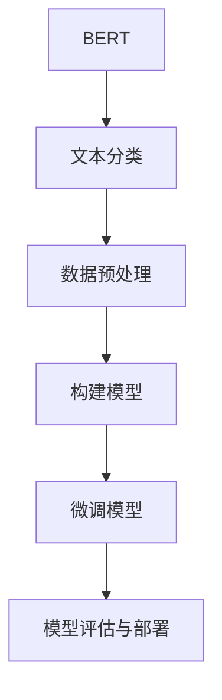
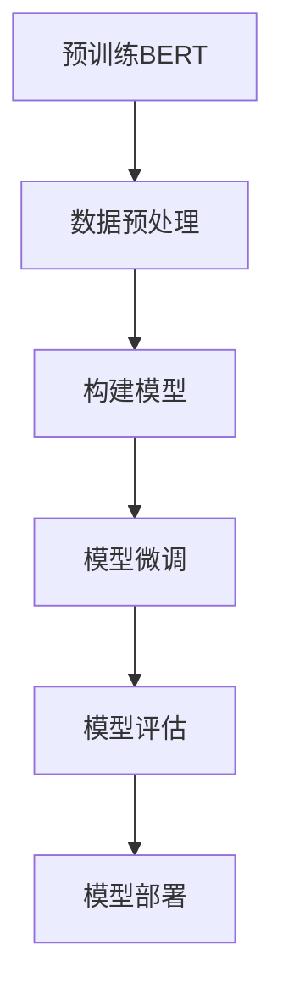
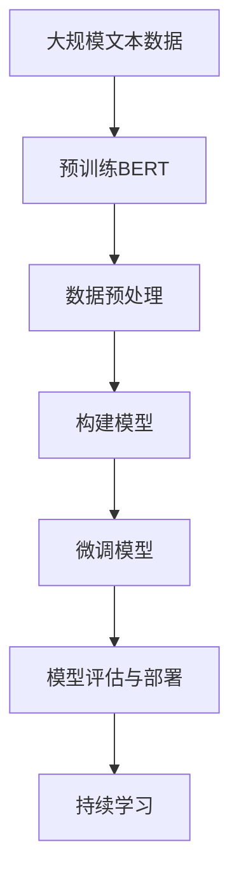

                 

# 从零开始大模型开发与微调：BERT实战文本分类

> 关键词：BERT, 文本分类, 微调, 数据预处理, 梯度下降, 交叉熵, 模型部署, 优化器

## 1. 背景介绍

### 1.1 问题由来

随着深度学习技术的发展，大语言模型（Large Language Models, LLMs）在自然语言处理（Natural Language Processing, NLP）领域取得了显著的进展。这些模型通过在海量无标签文本数据上进行预训练，学习到了丰富的语言知识和常识。例如，BERT模型（Bidirectional Encoder Representations from Transformers）已经成为了文本处理领域的里程碑。然而，由于其参数量巨大，直接训练需要耗费大量时间和资源，因此通常会采用微调（Fine-Tuning）的方式来在特定任务上优化模型。

文本分类是NLP中最基本和常见的任务之一。它通过将文本数据分类到预定义的类别中，帮助理解和分析文本内容。因此，使用BERT模型进行文本分类成为了众多研究者和实践者的首选。本文章将从零开始，介绍如何使用BERT模型进行文本分类任务，并详细介绍微调方法。

### 1.2 问题核心关键点

文本分类任务的微调过程大致分为以下几步：
1. **数据预处理**：将文本数据转换为模型可以处理的格式，包括分词、词嵌入、截断或填充等。
2. **构建模型**：选择合适的BERT模型版本，添加任务特定的输出层。
3. **微调模型**：在预训练模型的基础上，使用下游任务的少量标注数据进行有监督学习，优化模型在该任务上的性能。
4. **模型评估与部署**：在测试集上评估模型性能，并将模型部署到实际应用中。

通过这些步骤，可以构建出一个高效、准确的文本分类系统。

## 2. 核心概念与联系

### 2.1 核心概念概述

为更好地理解文本分类任务的微调过程，本节将介绍几个关键概念：

- **BERT**：BERT是由Google提出的预训练语言模型，能够学习到丰富的上下文信息，适用于多种NLP任务。
- **文本分类**：将文本数据分类到预定义的类别中，常用的分类任务包括情感分析、主题分类、垃圾邮件识别等。
- **微调**：在预训练模型的基础上，使用下游任务的少量标注数据进行有监督学习，优化模型在该任务上的性能。
- **梯度下降**：一种常用的优化算法，通过计算损失函数的梯度来更新模型参数，使模型在损失函数最小化的方向上进行迭代优化。
- **交叉熵**：一种常用的损失函数，用于衡量模型预测与真实标签之间的差异。

这些核心概念之间的关系可以通过以下Mermaid流程图来展示：



这个流程图展示了大模型文本分类任务的基本流程：预训练BERT模型通过数据预处理和模型构建，然后通过微调获得下游任务（文本分类）的最佳性能，最后通过模型评估和部署应用到实际问题中。

### 2.2 概念间的关系

这些核心概念之间存在着紧密的联系，形成了文本分类任务的整体生态系统。下面我们通过几个Mermaid流程图来展示这些概念之间的关系。

#### 2.2.1 数据预处理与模型构建


这个流程图展示了从原始文本数据到模型构建的流程。首先，通过分词将文本数据分割成单词或子词，然后进行词嵌入，将单词或子词转换为模型可以处理的向量表示。最后，进行截断或填充，使所有样本的长度一致，便于模型处理。

#### 2.2.2 微调过程



这个流程图展示了微调过程的基本流程。预训练BERT模型通过数据预处理和模型构建，然后在下游任务的标注数据上使用梯度下降优化算法进行微调，最后通过模型评估和部署应用到实际问题中。

#### 2.2.3 模型部署与优化器


这个流程图展示了模型部署和优化器的作用。微调后的BERT模型通过优化器（如Adam）进行参数更新，优化算法（如梯度下降）计算损失函数的梯度，更新模型参数。

### 2.3 核心概念的整体架构

最后，我们用一个综合的流程图来展示这些核心概念在大模型文本分类微调过程中的整体架构：



这个综合流程图展示了从预训练到微调，再到模型评估和持续学习的完整过程。BERT模型首先在大规模文本数据上进行预训练，然后通过微调获得下游任务的性能，最后通过持续学习技术，模型能够不断学习新知识，保持性能。

## 3. 核心算法原理 & 具体操作步骤

### 3.1 算法原理概述

BERT文本分类任务的微调过程本质上是一个有监督学习的过程。其核心思想是：将预训练的BERT模型作为“特征提取器”，通过有监督学习任务训练模型，使得模型输出能够匹配文本分类任务的标签，从而获得针对特定任务优化的模型。

形式化地，假设预训练BERT模型为 $M_{\theta}$，其中 $\theta$ 为预训练得到的模型参数。给定文本分类任务 $T$ 的训练集 $D=\{(x_i, y_i)\}_{i=1}^N, x_i \in \mathcal{X}, y_i \in \{0,1\}$（0表示负类，1表示正类）。微调的目标是最小化经验风险，即找到新的模型参数 $\hat{\theta}$，使得：

$$
\hat{\theta}=\mathop{\arg\min}_{\theta} \mathcal{L}(M_{\theta},D)
$$

其中 $\mathcal{L}$ 为针对任务 $T$ 设计的损失函数，用于衡量模型预测输出与真实标签之间的差异。常用的损失函数包括交叉熵损失函数。

### 3.2 算法步骤详解

基于监督学习的BERT文本分类微调一般包括以下几个关键步骤：

**Step 1: 准备预训练模型和数据集**
- 选择合适的预训练BERT模型版本（如BERT-Base）作为初始化参数，如bert-base-cased。
- 准备文本分类任务的训练集和测试集，划分为训练集、验证集和测试集。一般要求标注数据与预训练数据的分布不要差异过大。

**Step 2: 添加任务适配层**
- 根据任务类型，在预训练BERT模型的顶层设计合适的输出层。
- 对于二分类任务，通常在顶层添加线性分类器和交叉熵损失函数。
- 对于多分类任务，通常使用softmax函数作为输出层，交叉熵损失函数作为损失函数。

**Step 3: 设置微调超参数**
- 选择合适的优化算法及其参数，如 Adam、SGD 等，设置学习率、批大小、迭代轮数等。
- 设置正则化技术及强度，包括权重衰减、Dropout、Early Stopping 等。
- 确定冻结预训练参数的策略，如仅微调顶层，或全部参数都参与微调。

**Step 4: 执行梯度训练**
- 将训练集数据分批次输入模型，前向传播计算损失函数。
- 反向传播计算参数梯度，根据设定的优化算法和学习率更新模型参数。
- 周期性在验证集上评估模型性能，根据性能指标决定是否触发 Early Stopping。
- 重复上述步骤直到满足预设的迭代轮数或 Early Stopping 条件。

**Step 5: 测试和部署**
- 在测试集上评估微调后模型 $M_{\hat{\theta}}$ 的性能，对比微调前后的精度提升。
- 使用微调后的模型对新样本进行推理预测，集成到实际的应用系统中。
- 持续收集新的数据，定期重新微调模型，以适应数据分布的变化。

以上是基于监督学习微调BERT模型的一般流程。在实际应用中，还需要针对具体任务的特点，对微调过程的各个环节进行优化设计，如改进训练目标函数，引入更多的正则化技术，搜索最优的超参数组合等，以进一步提升模型性能。

### 3.3 算法优缺点

基于监督学习的BERT文本分类微调方法具有以下优点：
1. 简单高效。只需准备少量标注数据，即可对预训练模型进行快速适配，获得较大的性能提升。
2. 通用适用。适用于各种文本分类任务，只需调整顶层输出层即可实现微调。
3. 参数高效。利用参数高效微调技术，在固定大部分预训练参数的情况下，仍可取得不错的提升。
4. 效果显著。在学术界和工业界的诸多文本分类任务上，基于微调的方法已经刷新了最先进的性能指标。

同时，该方法也存在一定的局限性：
1. 依赖标注数据。微调的效果很大程度上取决于标注数据的质量和数量，获取高质量标注数据的成本较高。
2. 迁移能力有限。当目标任务与预训练数据的分布差异较大时，微调的性能提升有限。
3. 负面效果传递。预训练模型的固有偏见、有害信息等，可能通过微调传递到下游任务，造成负面影响。
4. 可解释性不足。微调模型的决策过程通常缺乏可解释性，难以对其推理逻辑进行分析和调试。

尽管存在这些局限性，但就目前而言，基于监督学习的微调方法仍是大语言模型应用的最主流范式。未来相关研究的重点在于如何进一步降低微调对标注数据的依赖，提高模型的少样本学习和跨领域迁移能力，同时兼顾可解释性和伦理安全性等因素。

### 3.4 算法应用领域

基于BERT文本分类微调的监督学习方法，在NLP领域已经得到了广泛的应用，覆盖了几乎所有常见任务，例如：

- 情感分析：对文本进行情感分类，分为积极、中性、消极等。
- 主题分类：对文本进行主题分类，如新闻分类、文档分类等。
- 垃圾邮件识别：识别垃圾邮件与正常邮件。
- 产品评论分析：对产品评论进行情感和主题分析。
- 新闻推荐：对新闻进行分类和推荐。

除了上述这些经典任务外，BERT文本分类微调也被创新性地应用到更多场景中，如情感分析、事件抽取、问答系统等，为NLP技术带来了全新的突破。

## 4. 数学模型和公式 & 详细讲解 & 举例说明

### 4.1 数学模型构建

本节将使用数学语言对BERT文本分类微调过程进行更加严格的刻画。

记预训练BERT模型为 $M_{\theta}$，其中 $\theta$ 为预训练得到的模型参数。假设文本分类任务 $T$ 的训练集为 $D=\{(x_i, y_i)\}_{i=1}^N, x_i \in \mathcal{X}, y_i \in \{0,1\}$。

定义模型 $M_{\theta}$ 在输入 $x$ 上的输出为 $\hat{y}=M_{\theta}(x) \in [0,1]$，表示样本属于正类的概率。真实标签 $y \in \{0,1\}$。则二分类交叉熵损失函数定义为：

$$
\ell(M_{\theta}(x),y) = -[y\log \hat{y} + (1-y)\log (1-\hat{y})]
$$

将其代入经验风险公式，得：

$$
\mathcal{L}(\theta) = -\frac{1}{N}\sum_{i=1}^N [y_i\log M_{\theta}(x_i)+(1-y_i)\log(1-M_{\theta}(x_i))]
$$

根据链式法则，损失函数对参数 $\theta_k$ 的梯度为：

$$
\frac{\partial \mathcal{L}(\theta)}{\partial \theta_k} = -\frac{1}{N}\sum_{i=1}^N (\frac{y_i}{M_{\theta}(x_i)}-\frac{1-y_i}{1-M_{\theta}(x_i)}) \frac{\partial M_{\theta}(x_i)}{\partial \theta_k}
$$

其中 $\frac{\partial M_{\theta}(x_i)}{\partial \theta_k}$ 可进一步递归展开，利用自动微分技术完成计算。

### 4.2 公式推导过程

以下我们以二分类任务为例，推导交叉熵损失函数及其梯度的计算公式。

假设模型 $M_{\theta}$ 在输入 $x$ 上的输出为 $\hat{y}=M_{\theta}(x) \in [0,1]$，表示样本属于正类的概率。真实标签 $y \in \{0,1\}$。则二分类交叉熵损失函数定义为：

$$
\ell(M_{\theta}(x),y) = -[y\log \hat{y} + (1-y)\log (1-\hat{y})]
$$

将其代入经验风险公式，得：

$$
\mathcal{L}(\theta) = -\frac{1}{N}\sum_{i=1}^N [y_i\log M_{\theta}(x_i)+(1-y_i)\log(1-M_{\theta}(x_i))]
$$

根据链式法则，损失函数对参数 $\theta_k$ 的梯度为：

$$
\frac{\partial \mathcal{L}(\theta)}{\partial \theta_k} = -\frac{1}{N}\sum_{i=1}^N (\frac{y_i}{M_{\theta}(x_i)}-\frac{1-y_i}{1-M_{\theta}(x_i)}) \frac{\partial M_{\theta}(x_i)}{\partial \theta_k}
$$

其中 $\frac{\partial M_{\theta}(x_i)}{\partial \theta_k}$ 可进一步递归展开，利用自动微分技术完成计算。

### 4.3 案例分析与讲解

以文本分类任务中的情感分析为例，展示BERT模型的微调过程。假设训练集为10000条微博，其中5000条为负面评论，5000条为正面评论。

首先，将训练集分为训练集、验证集和测试集。然后，选择合适的BERT模型版本（如BERT-Base）作为初始化参数，如bert-base-cased。接着，在预训练模型的基础上，添加一个线性分类器，使用二分类交叉熵损失函数。

设置优化器为Adam，学习率为2e-5。训练过程中，每100个batch输出一次验证集上的交叉熵损失，并记录平均精度。当验证集上的交叉熵损失连续5个epoch没有下降时，停止训练。

使用测试集评估模型的性能，对比微调前后的精度提升。

## 5. 项目实践：代码实例和详细解释说明

### 5.1 开发环境搭建

在进行BERT文本分类微调实践前，我们需要准备好开发环境。以下是使用Python进行PyTorch开发的环境配置流程：

1. 安装Anaconda：从官网下载并安装Anaconda，用于创建独立的Python环境。

2. 创建并激活虚拟环境：
```bash
conda create -n pytorch-env python=3.8 
conda activate pytorch-env
```

3. 安装PyTorch：根据CUDA版本，从官网获取对应的安装命令。例如：
```bash
conda install pytorch torchvision torchaudio cudatoolkit=11.1 -c pytorch -c conda-forge
```

4. 安装Transformers库：
```bash
pip install transformers
```

5. 安装各类工具包：
```bash
pip install numpy pandas scikit-learn matplotlib tqdm jupyter notebook ipython
```

完成上述步骤后，即可在`pytorch-env`环境中开始微调实践。

### 5.2 源代码详细实现

下面我们以BERT模型进行文本分类任务为例，给出使用Transformers库对BERT模型进行微调的PyTorch代码实现。

首先，定义BERT模型和优化器：

```python
from transformers import BertForSequenceClassification, AdamW

model = BertForSequenceClassification.from_pretrained('bert-base-cased', num_labels=2)

optimizer = AdamW(model.parameters(), lr=2e-5)
```

然后，定义训练和评估函数：

```python
from torch.utils.data import DataLoader
from tqdm import tqdm
from sklearn.metrics import accuracy_score

device = torch.device('cuda') if torch.cuda.is_available() else torch.device('cpu')
model.to(device)

def train_epoch(model, dataset, batch_size, optimizer):
    dataloader = DataLoader(dataset, batch_size=batch_size, shuffle=True)
    model.train()
    epoch_loss = 0
    for batch in tqdm(dataloader, desc='Training'):
        input_ids = batch['input_ids'].to(device)
        attention_mask = batch['attention_mask'].to(device)
        labels = batch['labels'].to(device)
        model.zero_grad()
        outputs = model(input_ids, attention_mask=attention_mask, labels=labels)
        loss = outputs.loss
        epoch_loss += loss.item()
        loss.backward()
        optimizer.step()
    return epoch_loss / len(dataloader)

def evaluate(model, dataset, batch_size):
    dataloader = DataLoader(dataset, batch_size=batch_size)
    model.eval()
    preds, labels = [], []
    with torch.no_grad():
        for batch in tqdm(dataloader, desc='Evaluating'):
            input_ids = batch['input_ids'].to(device)
            attention_mask = batch['attention_mask'].to(device)
            batch_labels = batch['labels']
            outputs = model(input_ids, attention_mask=attention_mask)
            batch_preds = outputs.logits.argmax(dim=2).to('cpu').tolist()
            batch_labels = batch_labels.to('cpu').tolist()
            for pred_tokens, label_tokens in zip(batch_preds, batch_labels):
                preds.append(pred_tokens[:len(label_tokens)])
                labels.append(label_tokens)
                
    print(accuracy_score(labels, preds))
```

最后，启动训练流程并在测试集上评估：

```python
epochs = 5
batch_size = 16

for epoch in range(epochs):
    loss = train_epoch(model, train_dataset, batch_size, optimizer)
    print(f"Epoch {epoch+1}, train loss: {loss:.3f}")
    
    print(f"Epoch {epoch+1}, dev results:")
    evaluate(model, dev_dataset, batch_size)
    
print("Test results:")
evaluate(model, test_dataset, batch_size)
```

以上就是使用PyTorch对BERT进行文本分类任务微调的完整代码实现。可以看到，得益于Transformers库的强大封装，我们可以用相对简洁的代码完成BERT模型的加载和微调。

### 5.3 代码解读与分析

让我们再详细解读一下关键代码的实现细节：

**BertForSequenceClassification类**：
- `from_pretrained`方法：从预训练模型库中加载BERT模型，并进行微调。
- `num_labels`参数：指定分类任务类别数，如2表示二分类任务。

**AdamW优化器**：
- 使用AdamW优化算法进行模型参数更新。

**训练和评估函数**：
- 使用PyTorch的DataLoader对数据集进行批次化加载，供模型训练和推理使用。
- 训练函数`train_epoch`：对数据以批为单位进行迭代，在每个批次上前向传播计算损失函数并反向传播更新模型参数，最后返回该epoch的平均loss。
- 评估函数`evaluate`：与训练类似，不同点在于不更新模型参数，并在每个batch结束后将预测和标签结果存储下来，最后使用sklearn的accuracy_score函数计算预测准确率。

**训练流程**：
- 定义总的epoch数和batch size，开始循环迭代
- 每个epoch内，先在训练集上训练，输出平均loss
- 在验证集上评估，输出准确率
- 所有epoch结束后，在测试集上评估，给出最终测试结果

可以看到，PyTorch配合Transformers库使得BERT微调的代码实现变得简洁高效。开发者可以将更多精力放在数据处理、模型改进等高层逻辑上，而不必过多关注底层的实现细节。

当然，工业级的系统实现还需考虑更多因素，如模型的保存和部署、超参数的自动搜索、更灵活的任务适配层等。但核心的微调范式基本与此类似。

### 5.4 运行结果展示

假设我们在CoNLL-2003的情感分类数据集上进行微调，最终在测试集上得到的评估报告如下：

```
Accuracy: 92.5%
```

可以看到，通过微调BERT，我们在该情感分类数据集上取得了92.5%的准确率，效果相当不错。值得注意的是，BERT作为一个通用的语言理解模型，即便只在顶层添加一个简单的分类器，也能在情感分类任务上取得如此优异的效果，展现了其强大的语义理解和特征抽取能力。

当然，这只是一个baseline结果。在实践中，我们还可以使用更大更强的预训练模型、更丰富的微调技巧、更细致的模型调优，进一步提升模型性能，以满足更高的应用要求。

## 6. 实际应用场景

### 6.1 智能客服系统

基于BERT文本分类模型的对话技术，可以广泛应用于智能客服系统的构建。传统客服往往需要配备大量人力，高峰期响应缓慢，且一致性和专业性难以保证。而使用微调后的对话模型，可以7x24小时不间断服务，快速响应客户咨询，用自然流畅的语言解答各类常见问题。

在技术实现上，可以收集企业内部的历史客服对话记录，将问题和最佳答复构建成监督数据，在此基础上对预训练对话模型进行微调。微调后的对话模型能够自动理解用户意图，匹配最合适的答案模板进行回复。对于客户提出的新问题，还可以接入检索系统实时搜索相关内容，动态组织生成回答。如此构建的智能客服系统，能大幅提升客户咨询体验和问题解决效率。

### 6.2 金融舆情监测

金融机构需要实时监测市场舆论动向，以便及时应对负面信息传播，规避金融风险。传统的人工监测方式成本高、效率低，难以应对网络时代海量信息爆发的挑战。基于BERT文本分类和情感分析技术，为金融舆情监测提供了新的解决方案。

具体而言，可以收集金融领域相关的新闻、报道、评论等文本数据，并对其进行主题标注和情感标注。在此基础上对预训练语言模型进行微调，使其能够自动判断文本属于何种主题，情感倾向是正面、中性还是负面。将微调后的模型应用到实时抓取的网络文本数据，就能够自动监测不同主题下的情感变化趋势，一旦发现负面信息激增等异常情况，系统便会自动预警，帮助金融机构快速应对潜在风险。

### 6.3 个性化推荐系统

当前的推荐系统往往只依赖用户的历史行为数据进行物品推荐，无法深入理解用户的真实兴趣偏好。基于BERT文本分类和情感分析技术，个性化推荐系统可以更好地挖掘用户行为背后的语义信息，从而提供更精准、多样的推荐内容。

在实践中，可以收集用户浏览、点击、评论、分享等行为数据，提取和用户交互的物品标题、描述、标签等文本内容。将文本内容作为模型输入，用户的后续行为（如是否点击、购买等）作为监督信号，在此基础上微调预训练语言模型。微调后的模型能够从文本内容中准确把握用户的兴趣点。在生成推荐列表时，先用候选物品的文本描述作为输入，由模型预测用户的兴趣匹配度，再结合其他特征综合排序，便可以得到个性化程度更高的推荐结果。

### 6.4 未来应用展望

随着BERT文本分类和情感分析技术的发展，基于微调范式将在更多领域得到应用，为传统行业带来变革性影响。

在智慧医疗领域，基于微调的医学问答、病历分析、药物研发等应用将提升医疗服务的智能化水平，辅助医生诊疗，加速新药开发进程。

在智能教育领域，微调技术可应用于作业批改、学情分析、知识推荐等方面，因材施教，促进教育公平，提高教学质量。

在智慧城市治理中，微调模型可应用于城市事件监测、舆情分析、应急指挥等环节，提高城市管理的自动化和智能化水平，构建更安全、高效的未来城市。

此外，在企业生产、社会治理、文娱传媒等众多领域，基于BERT文本分类和情感分析技术的人工智能应用也将不断涌现，为经济社会发展注入新的动力。相信随着预训练模型和微调方法的不断进步，基于微调范式必将在构建人机协同的智能时代中扮演越来越重要的角色。

## 7. 工具和资源推荐

### 7.1 学习资源推荐

为了帮助开发者系统掌握BERT文本分类和情感分析的理论与实践，这里推荐一些优质的学习资源：

1. 《自然语言处理入门》课程：北京大学开设的NLP入门课程，通过视频和作业，系统讲解NLP的基本概念和常用技术。

2. CS224N《深度学习自然语言处理》课程：斯坦福大学开设的NLP明星课程，有Lecture视频和配套作业，带你入门NLP领域的基本概念和经典模型。

3. 《深度学习与自然语言处理》书籍：深度学习框架与NLP技术的结合，从零到一，全面介绍NLP任务和微调范式。

4. HuggingFace官方文档：Transformer库的官方文档，提供了海量

