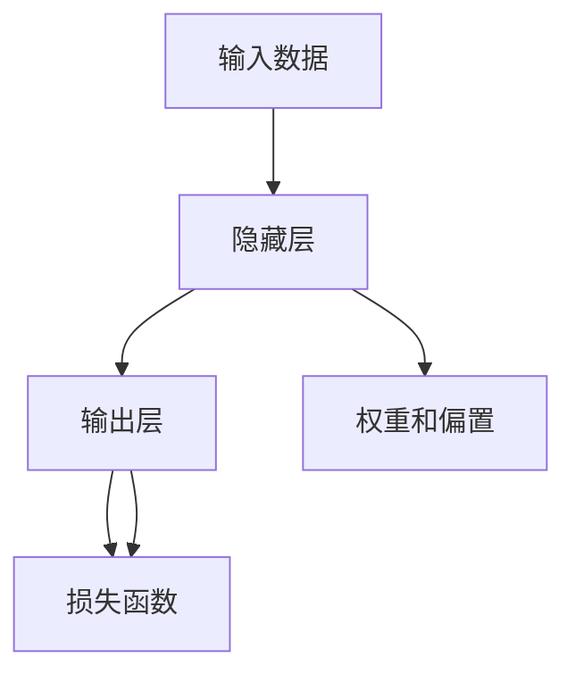

                 

# 从零开始大模型开发与微调：链式求导法则

> 关键词：大模型开发,微调,链式求导法则,深度学习,反向传播,梯度下降

## 1. 背景介绍

### 1.1 问题由来
深度学习技术在过去十年间取得了令人瞩目的进展，尤其在自然语言处理(NLP)、计算机视觉(CV)等领域的突破性应用。但在大模型开发和微调过程中，如何高效地利用链式求导法则，以实现模型参数的精准优化，成为了一个重要问题。本文将系统性地介绍大模型开发与微调中的链式求导法则，并结合实例深入分析其应用。

### 1.2 问题核心关键点
深度学习模型的核心是通过链式求导法则（chain rule）来更新参数，以最小化损失函数。本文将深入讲解链式求导法则的基本原理、具体应用，并探讨其在大模型微调中的重要性与实际操作方法。

### 1.3 问题研究意义
掌握链式求导法则对于大模型的开发与微调至关重要。它能帮助开发者更高效地设计、优化深度学习模型，提升模型在各种任务上的性能。本文旨在为读者提供清晰的指导，帮助他们在实际开发中更好地应用链式求导法则。

## 2. 核心概念与联系

### 2.1 核心概念概述

链式求导法则是大模型开发与微调中不可或缺的关键技术。它基于微积分的链式法则，用于计算复杂函数对某个变量的偏导数。在深度学习中，每个神经元对最终损失函数的贡献可以通过链式求导法则得到。

### 2.2 核心概念原理和架构的 Mermaid 流程图



上图中，数据通过隐藏层计算输出，再输入损失函数进行损失计算。每个隐藏层的权重和偏置对损失函数的影响，通过链式求导法则传递和累加。

### 2.3 核心概念的整体架构

将链式求导法则融入深度学习模型，形成了一个完整的计算图。在这个计算图中，每个层的操作都可以看作一个函数，函数之间的参数通过链式法则相互关联。这样，整个模型的参数更新便可以通过反向传播算法实现。

## 3. 核心算法原理 & 具体操作步骤

### 3.1 算法原理概述

链式求导法则的数学基础是微积分中的链式法则，用于计算复合函数的偏导数。在深度学习中，反向传播算法（backpropagation）便是基于链式求导法则，通过计算模型参数对损失函数的梯度，来更新模型参数。

### 3.2 算法步骤详解

大模型微调过程中，反向传播算法的主要步骤包括：

1. **前向传播**：将输入数据输入模型，计算模型输出。
2. **计算损失**：将模型输出与真实标签计算损失。
3. **反向传播**：计算损失函数对每个参数的偏导数。
4. **参数更新**：使用梯度下降等优化算法更新模型参数。

链式求导法则通过函数间的偏导数传递，将每个参数对最终损失的贡献逐层累加。这个过程中，权重和偏置的梯度计算尤为重要，因为它们直接影响模型的学习速度和效果。

### 3.3 算法优缺点

**优点**：
- 简单易懂：链式求导法则基于基础数学原理，易于理解和实现。
- 高效计算：反向传播算法能够高效计算梯度，加速模型训练。
- 广普适用：适用于各种深度学习模型，包括卷积神经网络、循环神经网络等。

**缺点**：
- 容易过拟合：反向传播算法对参数更新的方向没有限制，容易导致过拟合。
- 依赖初始值：初始参数的选择对模型性能有重要影响，需要精心调参。
- 计算开销大：深层网络的反向传播需要计算大量的偏导数，计算开销较大。

### 3.4 算法应用领域

链式求导法则在大模型的微调中有着广泛的应用，特别是在NLP、CV等领域的深度学习任务中。这些领域的大模型往往包含大量参数，链式求导法则在模型优化中起着关键作用。

## 4. 数学模型和公式 & 详细讲解 & 举例说明

### 4.1 数学模型构建

考虑一个简单的二分类问题，模型为线性分类器 $h(x;w)=w^Tx+b$，其中 $w$ 为权重向量，$b$ 为偏置项。模型的预测为 $\sigma(h(x;w))$，其中 $\sigma$ 为sigmoid函数。假设 $x$ 和 $y$ 分别为输入和真实标签，模型的损失函数为交叉熵损失函数。

### 4.2 公式推导过程

链式求导法则的推导基于以下几个步骤：
1. 对损失函数关于输出 $\sigma(h(x;w))$ 求导。
2. 对 $\sigma(h(x;w))$ 关于 $h(x;w)$ 求导。
3. 对 $h(x;w)$ 关于 $w$ 和 $b$ 求导。

通过链式求导法则，我们能够计算每个参数对损失函数的贡献，从而进行参数更新。

### 4.3 案例分析与讲解

以一个简单的三层神经网络为例，链式求导法则的计算过程如下：

1. **前向传播**：
   - 第一层：$z_1 = w_1^Tx_1 + b_1$
   - 第二层：$z_2 = w_2^Tz_1 + b_2$
   - 第三层：$z_3 = w_3^Tz_2 + b_3$

2. **计算损失**：
   - 输出层：$y=\sigma(z_3)$
   - 损失函数：$L(y,y')=L(\sigma(z_3),y')$

3. **反向传播**：
   - 第三层：$\nabla_{z_3}L=\frac{\partial L}{\partial z_3}=\sigma'(z_3)(1-\sigma(z_3))$

4. **参数更新**：
   - 第三层：$\nabla_w=\frac{\partial L}{\partial w}=\frac{\partial L}{\partial z_3}\frac{\partial z_3}{\partial w}=z_2'$
   - 第二层：$\nabla_w=\frac{\partial L}{\partial w}=\frac{\partial L}{\partial z_3}\frac{\partial z_3}{\partial z_2}\frac{\partial z_2}{\partial w}=z_1'$
   - 第一层：$\nabla_w=\frac{\partial L}{\partial w}=\frac{\partial L}{\partial z_3}\frac{\partial z_3}{\partial z_2}\frac{\partial z_2}{\partial z_1}\frac{\partial z_1}{\partial w}=x'$

通过链式求导法则，每个参数的梯度都可以通过链式传递得到，从而实现精确的模型优化。

## 5. 项目实践：代码实例和详细解释说明

### 5.1 开发环境搭建

以下是使用PyTorch框架搭建一个简单的三层神经网络并进行微调的Python代码示例：

```python
import torch
import torch.nn as nn
import torch.optim as optim

# 定义模型
class Model(nn.Module):
    def __init__(self):
        super(Model, self).__init__()
        self.fc1 = nn.Linear(784, 256)
        self.fc2 = nn.Linear(256, 128)
        self.fc3 = nn.Linear(128, 10)
    
    def forward(self, x):
        x = torch.relu(self.fc1(x))
        x = torch.relu(self.fc2(x))
        x = self.fc3(x)
        return x

# 准备数据
train_x = torch.randn(1000, 784)
train_y = torch.randint(0, 10, (1000,)).float()

# 定义模型、损失函数和优化器
model = Model()
loss_fn = nn.CrossEntropyLoss()
optimizer = optim.SGD(model.parameters(), lr=0.01)

# 训练模型
for epoch in range(100):
    optimizer.zero_grad()
    output = model(train_x)
    loss = loss_fn(output, train_y)
    loss.backward()
    optimizer.step()

    if (epoch+1) % 10 == 0:
        print(f"Epoch {epoch+1}, loss: {loss.item()}")
```

### 5.2 源代码详细实现

上述代码中，我们定义了一个简单的三层神经网络模型，包括两个隐藏层和一个输出层。模型的前向传播通过`forward`方法实现，包括线性变换和ReLU激活函数。损失函数和优化器分别使用交叉熵损失和随机梯度下降。

### 5.3 代码解读与分析

**模型定义**：
```python
class Model(nn.Module):
    def __init__(self):
        super(Model, self).__init__()
        self.fc1 = nn.Linear(784, 256)
        self.fc2 = nn.Linear(256, 128)
        self.fc3 = nn.Linear(128, 10)
    
    def forward(self, x):
        x = torch.relu(self.fc1(x))
        x = torch.relu(self.fc2(x))
        x = self.fc3(x)
        return x
```

在模型定义中，我们使用`nn.Linear`定义了线性层，并通过`relu`激活函数进行非线性变换。模型的`forward`方法将输入数据经过多次线性变换和激活函数计算，最终输出。

**数据准备**：
```python
train_x = torch.randn(1000, 784)
train_y = torch.randint(0, 10, (1000,)).float()
```

我们准备了1000个训练样本，每个样本包含784个特征，输出标签为10个类别。

**训练模型**：
```python
for epoch in range(100):
    optimizer.zero_grad()
    output = model(train_x)
    loss = loss_fn(output, train_y)
    loss.backward()
    optimizer.step()

    if (epoch+1) % 10 == 0:
        print(f"Epoch {epoch+1}, loss: {loss.item()}")
```

在模型训练过程中，我们首先使用`zero_grad`方法清除梯度，然后进行前向传播，计算输出。接着，通过`backward`方法计算梯度，并使用优化器`step`方法更新模型参数。最后，我们每10个epoch打印一次训练损失。

### 5.4 运行结果展示

在训练完成后，我们可以使用测试数据评估模型性能：
```python
test_x = torch.randn(100, 784)
test_y = torch.randint(0, 10, (100,)).float()

# 测试模型
with torch.no_grad():
    output = model(test_x)
    loss = loss_fn(output, test_y)

print(f"Test loss: {loss.item()}")
```

## 6. 实际应用场景

链式求导法则在大模型微调中有着广泛的应用，以下是几个具体场景：

### 6.1 图像分类

图像分类是计算机视觉中常见的任务，大模型如卷积神经网络（CNN）能够高效处理图像数据。通过链式求导法则，我们可以将模型的梯度传递到每一层，从而实现对每个卷积核和全连接层的优化。

### 6.2 语音识别

语音识别需要将音频信号转换为文本，通常使用RNN或Transformer模型。链式求导法则能够将梯度传递到每一时刻，从而优化每个时间步的参数。

### 6.3 自然语言生成

自然语言生成任务包括文本生成、对话生成等。链式求导法则能够将梯度传递到每个单词或句子上，从而优化模型在语言序列上的生成能力。

## 7. 工具和资源推荐

### 7.1 学习资源推荐

1. 《深度学习》by Ian Goodfellow：全面介绍了深度学习的基础理论和实践方法，包括链式求导法则的原理与应用。
2. CS231n《卷积神经网络》课程：斯坦福大学提供的计算机视觉课程，详细讲解了CNN的原理和实现。
3. CS224n《自然语言处理》课程：斯坦福大学提供的自然语言处理课程，介绍了Transformer等大模型。
4. 《深度学习框架PyTorch》：深入讲解PyTorch框架的使用，包括链式求导法则的实现。

### 7.2 开发工具推荐

1. PyTorch：Python深度学习框架，提供了丰富的深度学习模型和优化器。
2. TensorFlow：Google开发的深度学习框架，支持分布式计算和高性能模型训练。
3. JAX：谷歌开发的自动微分框架，支持动态计算图和高效优化。

### 7.3 相关论文推荐

1. Deep Learning（Ian Goodfellow）：经典教材，介绍了深度学习的理论基础和实践方法。
2. Convolutional Neural Networks for Visual Recognition（Alex Krizhevsky）：NIPS 2012年的论文，引入了卷积神经网络并取得了很好的效果。
3. Attention is All You Need（Ashish Vaswani）：NeurIPS 2017年的论文，介绍了Transformer模型。

## 8. 总结：未来发展趋势与挑战

### 8.1 研究成果总结

链式求导法则在大模型微调中发挥了重要作用，是深度学习模型的核心组成部分。通过链式求导法则，我们可以高效地计算模型参数的梯度，从而实现精确的模型优化。

### 8.2 未来发展趋势

未来，链式求导法则在大模型微调中的应用将更加广泛，具体趋势包括：
1. 自动化微调：自动选择最优的超参数和学习率，提高微调效率。
2. 分布式优化：在大规模分布式计算环境下，实现高效的梯度传递和优化。
3. 高效计算：优化反向传播算法的计算图，提高计算效率。

### 8.3 面临的挑战

尽管链式求导法则在大模型微调中有着广泛应用，但仍面临一些挑战：
1. 计算开销大：深度网络的反向传播需要计算大量的偏导数，计算开销较大。
2. 内存限制：大模型参数量巨大，内存限制成为瓶颈。
3. 优化复杂性：不同模型的优化算法复杂度不同，需要精心调参。

### 8.4 研究展望

未来的研究需要进一步优化链式求导法则在大模型微调中的应用，具体方向包括：
1. 计算图优化：设计更高效的计算图，减少反向传播的计算开销。
2. 分布式计算：探索分布式优化算法，提高模型的训练速度和稳定性。
3. 模型压缩：通过模型压缩和稀疏化，降低内存占用和计算开销。

## 9. 附录：常见问题与解答

**Q1：什么是链式求导法则？**

A: 链式求导法则是一种基于微积分的数学原理，用于计算复合函数的偏导数。在深度学习中，链式求导法则通过反向传播算法，将损失函数对每个参数的贡献逐层传递，从而实现精确的模型优化。

**Q2：链式求导法则在大模型微调中的应用？**

A: 链式求导法则在大模型微调中起着关键作用，通过反向传播算法，我们能够高效地计算模型参数的梯度，从而实现精确的模型优化。链式求导法则在深度学习模型的各个层级上都有应用，特别是在神经网络的输出层、隐藏层和输入层之间传递梯度，优化模型参数。

**Q3：链式求导法则的缺点是什么？**

A: 链式求导法则在大模型微调中也存在一些缺点，包括计算开销大、内存限制和优化复杂性等。为了克服这些缺点，我们需要设计更高效的计算图，优化反向传播算法，并探索分布式计算和模型压缩等方法，进一步提高大模型微调的效率和稳定性。

**Q4：如何优化链式求导法则在大模型微调中的应用？**

A: 优化链式求导法则在大模型微调中的应用需要从多个方面入手，包括计算图优化、分布式计算和模型压缩等。具体方法包括：设计更高效的计算图，减少反向传播的计算开销；探索分布式优化算法，提高模型的训练速度和稳定性；通过模型压缩和稀疏化，降低内存占用和计算开销。

---

作者：禅与计算机程序设计艺术 / Zen and the Art of Computer Programming

