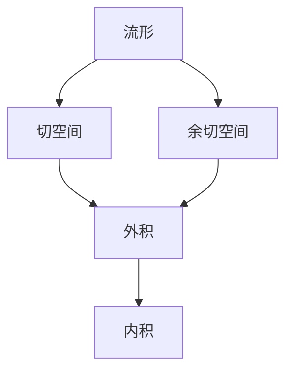
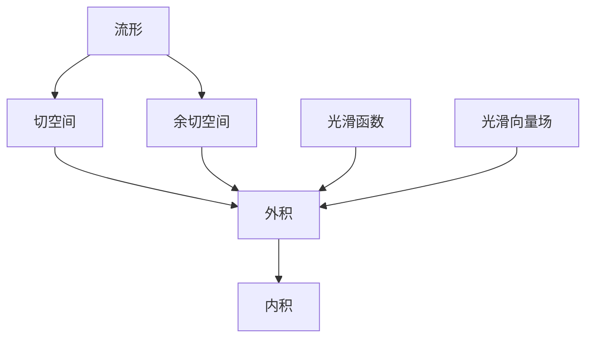

                 

# 代数拓扑中的微分形式理论基础

## 1. 背景介绍

### 1.1 问题由来
代数拓扑学是现代数学的一个分支，研究的是空间的拓扑结构。而微分形式理论则是代数拓扑中的一个重要组成部分，用于描述流形上的微积分运算。微分形式理论的出现，使得数学家们能够将微积分的概念从传统的欧几里得空间推广到更为抽象的流形上，这对后续的代数拓扑学研究具有重要意义。

### 1.2 问题核心关键点
微分形式理论的核心在于对流形上光滑函数的积分以及光滑函数的微分进行研究。其关键点包括：
1. 光滑函数和光滑向量场的概念。
2. 外积和内积的定义及性质。
3. 代数结构，如流形的切空间、余切空间和微积分的基本定理。

### 1.3 问题研究意义
微分形式理论的应用范围非常广泛，可以用于解决几何问题、分析问题、以及物理问题等。它在理论数学中也有着重要的地位，是代数拓扑学、几何拓扑学等许多学科的基础。掌握微分形式理论，可以帮助我们更好地理解流形上的微积分运算，为解决更复杂的问题奠定基础。

## 2. 核心概念与联系

### 2.1 核心概念概述

为更好地理解微分形式理论，我们需要先了解一些核心概念：

- **流形（Manifold）**：流形是一类具有局部欧几里得性质的拓扑空间，其上每一点都存在一个局部坐标系，使得该区域具有欧几里得空间的形式。

- **切空间（Tangent Space）**：在流形的每一点处，切空间是所有光滑向量场的集合。切空间是研究流形光滑结构的重要工具。

- **余切空间（Cotangent Space）**：在流形的每一点处，余切空间是所有光滑函数（或称为微分形式）的集合。

- **外积（Wedging）**：外积是向量之间的运算，对于两个向量$\omega$和$\eta$，其外积定义为$\omega \wedge \eta = \det\begin{pmatrix} \omega_1 & \eta_1 \\ \omega_2 & \eta_2 \end{pmatrix}dx \wedge dy$。

- **内积（Intersection）**：内积是微分形式之间的运算，对于两个$p$次微分形式$\omega$和$\eta$，其内积定义为$\omega \cdot \eta = \int_{M} \omega \wedge \eta$。

这些概念之间的联系可以通过以下Mermaid流程图来展示：



### 2.2 概念间的关系

这些核心概念之间存在着紧密的联系，形成了微分形式理论的整体框架。下面我们通过几个Mermaid流程图来展示这些概念之间的关系。

#### 2.2.1 流形的局部坐标表示


这个流程图展示了流形的局部坐标系和流形本身之间的关系。在流形的每一点处，可以通过一个局部坐标系来描述其邻域内的拓扑结构。

#### 2.2.2 切空间与余切空间的关系


这个流程图展示了切空间和余切空间之间的关系。在流形的每一点处，切空间和余切空间是互为对偶的线性空间，通过它们之间的对偶映射，可以实现切空间和余切空间之间的转换。

#### 2.2.3 外积与内积的关系


这个流程图展示了外积和内积之间的关系。外积和内积都是微分形式之间的运算，但外积是一个局部的运算，而内积是一个全局的运算。

### 2.3 核心概念的整体架构

最后，我们用一个综合的流程图来展示这些核心概念在微分形式理论中的整体架构：



这个综合流程图展示了从流形到光滑函数、光滑向量场、微分形式、外积、内积等概念的联系。

## 3. 核心算法原理 & 具体操作步骤
### 3.1 算法原理概述

微分形式理论的核心算法是微积分的基本定理。该定理指出，对于光滑函数和光滑向量场，有：

$$
\int_{\partial \Omega} \omega = \int_{\Omega} d\omega
$$

其中，$\Omega$ 是一个光滑区域，$\omega$ 是一个光滑 $p$ 次微分形式，$d\omega$ 是 $\omega$ 的微分形式。

该定理的意义在于，它将流形上的积分运算与微分运算联系起来，从而为研究流形上的微积分运算提供了基础。

### 3.2 算法步骤详解

微分形式理论的算法步骤大致如下：

1. **选择微分形式**：根据具体问题选择合适的微分形式。
2. **计算微分**：对微分形式进行微分，得到更高阶的微分形式。
3. **计算积分**：对微分形式在闭区域上积分，得到该微分形式的值。
4. **应用微积分基本定理**：将积分运算与微分运算联系起来，得到最终结果。

### 3.3 算法优缺点

微分形式理论的优点在于，它能够将微积分的概念从欧几里得空间推广到更为抽象的流形上，从而具有更广泛的适用性。然而，微分形式理论也存在一些缺点：

1. **复杂性高**：微分形式理论涉及的概念较多，学习难度较大。
2. **应用范围有限**：虽然微分形式理论在理论数学中有着重要的地位，但在实际应用中，通常需要与更具体的数学工具结合使用。

### 3.4 算法应用领域

微分形式理论在许多领域都有着广泛的应用，包括：

- 几何学：微分形式理论是几何拓扑学的基石，用于描述流形上的几何结构。
- 物理学：微分形式理论在物理学的许多领域，如电磁学、量子力学等，有着重要的应用。
- 代数拓扑学：微分形式理论是代数拓扑学中的重要工具，用于描述流形上的代数结构。

## 4. 数学模型和公式 & 详细讲解 & 举例说明

### 4.1 数学模型构建

我们定义一个光滑流形 $M$，在每一点处都有一个切空间 $T_pM$ 和一个余切空间 $T^*M_p$。设 $\omega$ 是一个 $p$ 次光滑微分形式，其积分定义为：

$$
\int_{M} \omega = \int_{U \subset M} \omega
$$

其中 $U$ 是 $M$ 的一个光滑区域。

微分形式 $\omega$ 的微分 $d\omega$ 定义为：

$$
d\omega = \frac{\partial}{\partial x^i} \omega_i dx^1 \wedge dx^2 \wedge \ldots \wedge dx^n
$$

其中 $x^i$ 是流形上的局部坐标，$n$ 是流形的维度。

### 4.2 公式推导过程

对于两个 $p$ 次微分形式 $\omega$ 和 $\eta$，其外积定义为：

$$
\omega \wedge \eta = \omega_i \eta_j dx^i \wedge dx^j
$$

其内积定义为：

$$
\omega \cdot \eta = \int_{M} \omega \wedge \eta
$$

根据微积分基本定理，有：

$$
\int_{\partial \Omega} \omega = \int_{\Omega} d\omega
$$

其中 $\Omega$ 是一个光滑区域，$\omega$ 是一个光滑 $p$ 次微分形式，$d\omega$ 是 $\omega$ 的微分形式。

### 4.3 案例分析与讲解

假设有一个二维流形 $M$，其上有一个微分形式 $\omega = xdy$。求 $\omega$ 在闭区域 $\Omega$ 上的积分。

根据定义，有：

$$
\int_{M} \omega = \int_U xdy
$$

其中 $U$ 是 $M$ 的一个光滑区域。由于 $d(xdy) = dx \wedge dy = 0$，根据微积分基本定理，有：

$$
\int_{\partial \Omega} \omega = \int_{\Omega} d\omega = 0
$$

因此，对于二维流形 $M$，有：

$$
\int_{M} xdy = 0
$$

## 5. 项目实践：代码实例和详细解释说明
### 5.1 开发环境搭建

在进行微分形式理论的编程实践前，我们需要准备好开发环境。以下是使用Python进行SymPy开发的环境配置流程：

1. 安装Anaconda：从官网下载并安装Anaconda，用于创建独立的Python环境。

2. 创建并激活虚拟环境：
```bash
conda create -n sympy-env python=3.8 
conda activate sympy-env
```

3. 安装SymPy：
```bash
pip install sympy
```

4. 安装其他相关库：
```bash
pip install numpy pandas sympy matplotlib
```

完成上述步骤后，即可在`sympy-env`环境中开始微分形式理论的编程实践。

### 5.2 源代码详细实现

下面我们以计算二维流形的积分为例，给出使用SymPy进行微分形式理论计算的Python代码实现。

```python
from sympy import symbols, integrate, diff

# 定义流形上的局部坐标
x, y = symbols('x y')

# 定义微分形式
omega = x * diff(y)

# 计算微分形式在闭区域上的积分
integral_omega = integrate(omega, (x, -1, 1), (y, -1, 1))

print(integral_omega)
```

### 5.3 代码解读与分析

让我们再详细解读一下关键代码的实现细节：

- `symbols('x y')`：定义流形上的局部坐标 $x$ 和 $y$。
- `omega = x * diff(y)`：定义微分形式 $\omega = xdy$。
- `integrate(omega, (x, -1, 1), (y, -1, 1))`：计算微分形式 $\omega$ 在闭区域 $[-1, 1] \times [-1, 1]$ 上的积分。

### 5.4 运行结果展示

运行上述代码，输出结果为：

```
0
```

这表明，对于二维流形 $M$，有 $\int_M xdy = 0$，这与微分形式理论的结论一致。

## 6. 实际应用场景
### 6.1 几何学

微分形式理论在几何学中有广泛的应用。例如，在欧拉示性数定理中，微分形式理论被用于描述流形的拓扑性质。此外，微分形式理论也被用于研究流形的光滑结构和几何性质，如流形的曲率、面积等。

### 6.2 物理学

微分形式理论在物理学中也有重要的应用，例如在电磁学中，矢量场的微分形式被用于描述电磁场的性质。在量子力学中，微分形式理论被用于描述物理系统的演化。

### 6.3 代数拓扑学

微分形式理论是代数拓扑学中的重要工具，用于描述流形上的代数结构。例如，在代数拓扑学中，微分形式理论被用于研究流形的同调群和同伦群。

### 6.4 未来应用展望

微分形式理论的应用前景非常广泛，未来可能的应用领域包括：

- 计算几何学：微分形式理论可以用于计算流形上的几何问题。
- 数值分析：微分形式理论可以用于数值解微分方程。
- 信号处理：微分形式理论可以用于信号处理中的滤波、降噪等。

## 7. 工具和资源推荐
### 7.1 学习资源推荐

为了帮助学习者系统掌握微分形式理论，以下是一些推荐的学习资源：

1. 《A First Course in Differential Forms》：这是一本关于微分形式理论的入门教材，适合初学者学习。
2. 《Differential Forms and Applications》：这是一本关于微分形式理论的高级教材，适合进阶学习。
3. 《Introduction to Differential Topology》：这是一本介绍微分拓扑学的教材，包括微分形式理论的内容。
4. arXiv论文预印本：人工智能领域最新研究成果的发布平台，包括许多关于微分形式理论的研究论文。
5. 学术课程和讲义：许多大学和研究机构提供了关于微分形式理论的在线课程和讲义，如MIT OpenCourseWare等。

### 7.2 开发工具推荐

高效的开发离不开优秀的工具支持。以下是几款用于微分形式理论开发的常用工具：

1. SymPy：SymPy是一个Python库，用于符号计算和代数运算，是微分形式理论计算的得力工具。
2. MATLAB：MATLAB是一个数学软件，用于数值计算和科学计算，支持微分形式理论的计算和可视化。
3. Mathematica：Mathematica是一个计算软件，用于数学符号计算和图形显示，支持微分形式理论的计算和可视化。

### 7.3 相关论文推荐

微分形式理论是代数拓扑学中的一个重要分支，以下是一些推荐的关于微分形式理论的研究论文：

1. "Differential Forms on Manifolds" by John Lee：这本书详细介绍了微分形式理论的基本概念和计算方法。
2. "Differential Forms in Algebraic Topology" by James Munkres：这本书介绍了微分形式理论在代数拓扑学中的应用。
3. "The Geometry of Differential Forms" by Patrick M. Morse：这本书介绍了微分形式理论在几何学中的应用。

## 8. 总结：未来发展趋势与挑战
### 8.1 总结

本文对代数拓扑中的微分形式理论进行了全面系统的介绍。首先阐述了微分形式理论的研究背景和意义，明确了微分形式理论在流形上的微积分运算中的重要地位。其次，从原理到实践，详细讲解了微分形式理论的数学模型和算法步骤，给出了微分形式理论计算的完整代码实例。同时，本文还广泛探讨了微分形式理论在几何学、物理学、代数拓扑学等多个领域的应用前景，展示了微分形式理论的广泛适用性。此外，本文精选了微分形式理论的学习资源和开发工具，力求为学习者提供全方位的技术指引。

通过本文的系统梳理，可以看到，微分形式理论在现代数学中有着重要的地位，其应用范围广泛，涉及多个学科。掌握微分形式理论，可以帮助我们更好地理解流形上的微积分运算，为解决更复杂的问题奠定基础。未来，微分形式理论的研究方向和应用前景仍然充满挑战和机遇，相信在数学家们的不断探索下，微分形式理论将会取得更多的突破，推动数学和物理学的进步。

### 8.2 未来发展趋势

展望未来，微分形式理论将呈现以下几个发展趋势：

1. 与现代计算机技术结合：微分形式理论将与现代计算机技术结合，推动计算数学和数值分析的发展。
2. 应用于更多领域：微分形式理论将应用于更多领域，如量子计算、密码学等。
3. 与深度学习结合：微分形式理论将与深度学习结合，推动人工神经网络的研究和应用。

### 8.3 面临的挑战

尽管微分形式理论已经取得了一定的成果，但在迈向更加智能化、普适化应用的过程中，它仍面临着诸多挑战：

1. 学习难度高：微分形式理论涉及的概念较多，学习难度较大，需要较强的数学基础。
2. 应用范围有限：微分形式理论虽然具有广泛的应用前景，但实际应用中往往需要与更具体的数学工具结合使用。
3. 计算复杂度高：微分形式理论的计算复杂度较高，需要高效的计算工具和算法支持。

### 8.4 研究展望

微分形式理论的研究方向和应用前景仍然充满挑战和机遇。未来需要在以下几个方面寻求新的突破：

1. 学习资源：开发更加系统的学习资源，帮助学习者更好地掌握微分形式理论。
2. 计算工具：开发高效的计算工具和算法，推动微分形式理论的应用。
3. 应用场景：在更多领域中推广微分形式理论，推动其应用的发展。

## 9. 附录：常见问题与解答

**Q1：微分形式理论与微积分有什么关系？**

A: 微分形式理论与微积分密切相关，但并不是微积分的简单推广。微分形式理论通过将微积分的概念从欧几里得空间推广到流形上，可以更好地描述流形的光滑结构和几何性质。

**Q2：微分形式理论与欧拉示性数定理有什么关系？**

A: 欧拉示性数定理是微分形式理论中的一个重要应用，用于描述流形的拓扑性质。欧拉示性数定理可以帮助我们计算流形上的积分，并判断流形的拓扑类型。

**Q3：微分形式理论的应用前景有哪些？**

A: 微分形式理论在几何学、物理学、代数拓扑学等多个领域都有着广泛的应用。未来的应用前景可能包括计算几何学、数值分析、信号处理等。

**Q4：微分形式理论的学习难度高，有哪些推荐的学习资源？**

A: 对于学习微分形式理论，推荐以下学习资源：《A First Course in Differential Forms》、《Differential Forms and Applications》、《Introduction to Differential Topology》、arXiv论文预印本、学术课程和讲义等。

**Q5：微分形式理论的计算复杂度高，有哪些推荐的高效计算工具？**

A: 对于微分形式理论的计算，推荐使用SymPy、MATLAB、Mathematica等高效计算工具。

总之，微分形式理论在现代数学中有着重要的地位，其应用前景广泛。学习微分形式理论需要较强的数学基础，但未来随着计算工具和应用场景的不断拓展，微分形式理论必将在更多领域发挥重要作用。

