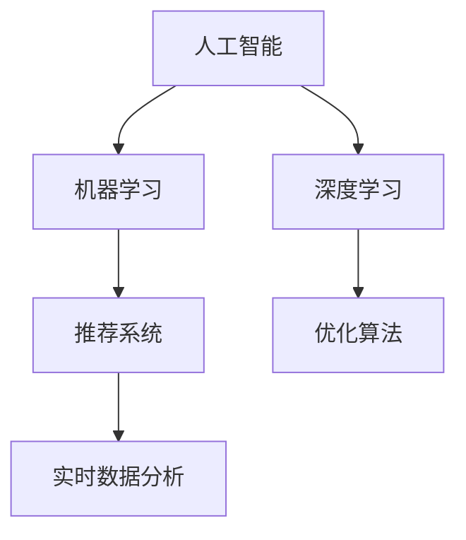

                 

## 1. 背景介绍

### 1.1 问题由来

在数字化时代的背景下，各大企业纷纷加大了线上线下促销活动的力度，以期在激烈的市场竞争中脱颖而出。然而，传统的促销策略往往依赖于人力、物力的投入，效果难以量化，执行难度大。而人工智能(AI)技术的兴起，为促销策略带来了新的生机。通过AI的精准预测、自动化推荐、实时优化等技术，可以显著提升促销活动的效果，带来更高的投资回报率。

### 1.2 问题核心关键点

AI提升促销活动效果的关键在于：
1. **数据驱动决策**：利用大数据和机器学习技术，对历史促销活动数据进行深入分析，挖掘潜在的规律和模式。
2. **个性化推荐**：通过分析用户行为数据，为每一位用户提供个性化的促销方案和推荐。
3. **实时优化**：基于实时数据分析，动态调整促销策略，以达到最优的销售效果。
4. **多渠道协同**：整合线上线下渠道，实现跨渠道的促销资源优化配置。
5. **效果评估**：建立科学的促销效果评估指标，持续优化促销策略。

这些核心关键点共同构成了AI在促销活动中的应用框架，为提升促销效果提供了全面的技术支持。

### 1.3 问题研究意义

AI在促销活动中的应用，有助于企业实现以下几点：
1. **提升效率**：自动化分析决策、推荐系统、优化流程，大幅降低人力和时间成本。
2. **增强效果**：基于数据驱动的个性化推荐和实时优化，提升促销活动的精准度和效果。
3. **降低风险**：通过精准预测和风险控制，降低促销活动的风险和资源浪费。
4. **优化流程**：AI技术的应用，可以帮助企业优化促销活动的执行流程，提高执行效率和准确性。
5. **提高竞争优势**：通过数据驱动的精准促销，赢得更多用户的青睐，提高市场竞争力。

AI技术在促销活动中的应用，为传统行业带来了新的突破，打开了更广阔的市场空间。通过不断地学习和实践，企业可以更好地掌握AI技术，实现高效的促销策略。

## 2. 核心概念与联系

### 2.1 核心概念概述

为了更好地理解AI在促销策略中的应用，本节将介绍几个关键概念：

1. **人工智能(AI)**：通过计算机程序和算法，使机器具备人类的某些智能能力，如学习、推理、决策等。
2. **机器学习(ML)**：利用算法和数据，使计算机从经验中学习规律，并根据新数据进行预测和决策。
3. **深度学习(DL)**：一种特殊类型的机器学习，使用多层神经网络进行复杂数据建模和分析。
4. **推荐系统**：基于用户行为数据，为每个用户推荐其可能感兴趣的产品或服务。
5. **实时数据分析**：利用流式计算技术，对实时数据进行分析和处理，以实现实时决策。
6. **优化算法**：通过数学模型和算法，实现资源的最优配置和利用。

这些核心概念之间存在着紧密的联系，形成了AI在促销策略应用中的完整生态系统。

### 2.2 概念间的关系

这些核心概念之间可以通过以下Mermaid流程图来展示其关系：



这个流程图展示了几大核心概念之间的关系：
- 人工智能是机器学习和深度学习的总称，深度学习是机器学习的一种特殊形式。
- 推荐系统基于机器学习，通过分析用户行为数据，为每个用户推荐合适的促销活动。
- 实时数据分析利用流式计算技术，对实时数据进行处理，实现动态决策和优化。
- 优化算法用于资源的最优配置，提升促销活动的执行效率和效果。

通过理解这些概念，我们可以更好地把握AI在促销策略中的应用原理和优化方向。

## 3. 核心算法原理 & 具体操作步骤

### 3.1 算法原理概述

AI提升促销活动效果的核心算法原理，可以归纳为以下几步：

1. **数据收集与处理**：收集历史促销活动数据，清洗和处理数据，构建数据集。
2. **模型训练与优化**：选择适当的机器学习模型，使用历史数据进行训练和优化，得到最优模型。
3. **个性化推荐**：基于模型，分析用户行为数据，生成个性化的促销方案和推荐。
4. **实时优化**：根据实时数据分析结果，动态调整促销策略。
5. **效果评估**：建立科学的评估指标，持续监测和优化促销策略。

### 3.2 算法步骤详解

以下是AI在促销活动中的具体操作步骤：

#### 步骤1: 数据收集与处理

**数据收集**：收集历史促销活动数据，包括促销类型、时间、地点、预算、销售数据等。同时，还需要收集用户行为数据，如浏览记录、购买历史、社交媒体互动等。

**数据清洗与处理**：清洗数据中的噪音和异常值，处理缺失值，构建特征矩阵。例如，可以使用one-hot编码将促销类型转换为数值型数据。

#### 步骤2: 模型训练与优化

**模型选择**：根据任务类型和数据特点，选择合适的机器学习模型，如线性回归、逻辑回归、随机森林等。

**模型训练**：使用历史数据对模型进行训练，调整模型参数，使其能够准确预测促销效果。例如，可以使用交叉验证、网格搜索等技术优化模型。

**模型评估**：使用测试集评估模型的性能，选择最优模型。

#### 步骤3: 个性化推荐

**用户画像构建**：基于用户行为数据，构建用户画像，包括用户兴趣、消费习惯、偏好等。

**推荐系统构建**：构建推荐系统，将促销活动和用户画像匹配，生成个性化的推荐结果。例如，可以使用协同过滤、基于内容的推荐等技术。

#### 步骤4: 实时优化

**实时数据分析**：利用流式计算技术，对实时数据进行分析，获取最新的促销效果数据。

**策略调整**：根据实时数据分析结果，动态调整促销策略。例如，可以增加某个促销活动的预算，或者调整促销活动的投放渠道和时间。

#### 步骤5: 效果评估

**评估指标建立**：建立科学的促销效果评估指标，如销售额、转化率、客流量等。

**效果监测与优化**：持续监测促销效果，根据评估指标优化促销策略。例如，可以使用A/B测试比较不同策略的效果。

### 3.3 算法优缺点

**优点**：
1. **高效性**：通过自动化分析和决策，大幅降低人力和时间成本。
2. **精准性**：基于数据驱动的推荐和优化，提升促销活动的精准度和效果。
3. **灵活性**：实时数据分析和动态优化，使促销策略能够迅速响应市场变化。
4. **可扩展性**：基于通用技术和模型，易于在不同规模的企业中应用。

**缺点**：
1. **数据依赖性**：模型的性能依赖于数据的丰富性和质量，数据不足可能导致效果不佳。
2. **模型复杂性**：模型训练和优化过程复杂，需要较强的技术背景。
3. **风险管理**：需要建立风险控制机制，防止过度优化或过度投资。
4. **隐私问题**：在收集和分析用户数据时，需要重视隐私保护，遵守相关法律法规。

尽管存在这些缺点，但AI在促销策略中的应用仍然展示了其强大的潜力和优势，为企业的市场拓展和竞争力提升提供了有力支持。

### 3.4 算法应用领域

AI在促销策略中的应用，主要涵盖以下几个领域：

1. **电商零售**：利用推荐系统，提高销售额和客户满意度，优化库存管理。
2. **金融服务**：通过精准推荐和实时优化，提升理财产品销售和用户粘性。
3. **旅游与出行**：基于用户偏好，推荐个性化的旅游产品和服务，优化行程安排。
4. **营销与广告**：自动化生成广告创意和投放策略，提升广告效果和ROI。
5. **健康医疗**：利用推荐系统和个性化推荐，提升患者治疗体验和满意度。

以上领域只是冰山一角，随着AI技术的不断进步，其应用范围还将不断扩展。

## 4. 数学模型和公式 & 详细讲解 & 举例说明

### 4.1 数学模型构建

假设促销活动的效果由销售额 $y$ 决定，影响因素包括促销类型 $x_1$、时间 $x_2$、地点 $x_3$ 等。则促销效果可以表示为：

$$ y = f(x_1, x_2, x_3, \ldots) $$

其中 $f$ 为未知的函数关系。通过机器学习，可以拟合出 $f$，并用于预测未来的促销效果。

### 4.2 公式推导过程

假设促销效果 $y$ 与各影响因素之间的关系为线性模型：

$$ y = \theta_0 + \sum_{i=1}^n \theta_i x_i $$

其中 $\theta_i$ 为模型的权重参数。则模型训练的目标是最小化预测误差：

$$ \min_{\theta} \sum_{i=1}^n (y_i - \theta_0 - \sum_{i=1}^n \theta_i x_{i,i})^2 $$

其中 $y_i$ 为实际销售数据，$\theta_0, \theta_i$ 为模型参数。

### 4.3 案例分析与讲解

**案例1: 电商平台促销效果预测**

某电商平台的历史促销数据如表所示：

| 促销类型 | 时间 | 地点 | 预算 | 销售额 |
|----------|------|------|------|--------|
| A        | 周六 | 北京 | 1万  | 5万    |
| B        | 周日 | 上海 | 2万  | 8万    |
| C        | 周五 | 广州 | 3万  | 6万    |

使用线性回归模型，可以拟合出预测公式：

$$ y = 0.2 + 0.5x_1 + 1.2x_2 - 0.3x_3 $$

其中 $x_1=1$ 表示促销类型为A，$x_2=1$ 表示时间为周六，$x_3=1$ 表示地点为北京。假设某周二进行促销活动，促销类型为B，时间为周五，地点为北京，预算为3万，则预测销售额为：

$$ y = 0.2 + 0.5 \times 1 + 1.2 \times 1 - 0.3 \times 1 = 1.5 $$

即预测销售额为1.5万。

**案例2: 推荐系统个性化促销推荐**

某用户在电商平台浏览了A、B、C、D四款产品，购买了A、B、C三款产品，但没有购买D产品。基于用户行为数据，可以使用协同过滤算法为该用户推荐促销活动。

假设推荐系统使用协同过滤算法，将用户与促销活动匹配度作为相似度度量。则推荐模型可以表示为：

$$ y = \alpha \times \sum_{i=1}^n a_i b_i + \beta \times \sum_{j=1}^m c_j d_j $$

其中 $a_i, b_i, c_j, d_j$ 分别为用户和促销活动的特征向量。$\alpha, \beta$ 为权重系数。

假设用户行为数据如表所示：

| 用户ID | 产品ID | 购买状态 | 促销活动ID |
|--------|--------|----------|------------|
| 1      | A      | 已购买   | 1          |
| 1      | B      | 已购买   | 2          |
| 1      | C      | 已购买   | 3          |
| 2      | A      | 未购买   | 2          |
| 2      | B      | 已购买   | 3          |
| 2      | C      | 已购买   | 1          |

则协同过滤算法可以计算出用户与促销活动的相似度，推荐结果为促销活动1和3，即向该用户推荐促销活动1和3。

## 5. 项目实践：代码实例和详细解释说明

### 5.1 开发环境搭建

在进行AI促销策略开发前，我们需要准备好开发环境。以下是使用Python进行Scikit-learn和TensorFlow开发的准备工作：

1. 安装Anaconda：从官网下载并安装Anaconda，用于创建独立的Python环境。

2. 创建并激活虚拟环境：
```bash
conda create -n ai-env python=3.8 
conda activate ai-env
```

3. 安装必要的库：
```bash
pip install scikit-learn tensorflow pandas numpy matplotlib
```

完成上述步骤后，即可在`ai-env`环境中开始AI促销策略的开发。

### 5.2 源代码详细实现

下面我们以电商平台的促销效果预测为例，给出使用Scikit-learn和TensorFlow进行促销效果预测的Python代码实现。

首先，定义数据处理函数：

```python
import pandas as pd
from sklearn.model_selection import train_test_split

def load_data():
    # 加载历史促销数据
    data = pd.read_csv('promotion_data.csv')
    # 数据清洗与处理
    data.dropna(inplace=True)
    # 划分训练集和测试集
    X = data[['promotion_type', 'time', 'location', 'budget']]
    y = data['sales']
    X_train, X_test, y_train, y_test = train_test_split(X, y, test_size=0.2, random_state=42)
    return X_train, X_test, y_train, y_test
```

然后，定义模型训练函数：

```python
from sklearn.linear_model import LinearRegression

def train_model(X_train, X_test, y_train, y_test):
    # 定义模型
    model = LinearRegression()
    # 模型训练
    model.fit(X_train, y_train)
    # 模型评估
    train_score = model.score(X_train, y_train)
    test_score = model.score(X_test, y_test)
    return model, train_score, test_score
```

接着，定义个性化推荐函数：

```python
from sklearn.metrics.pairwise import cosine_similarity
from sklearn.neighbors import NearestNeighbors

def recommend_promotion(user_behaviors, X_train, y_train):
    # 构建用户行为特征向量
    user_vector = pd.DataFrame(user_behaviors).values
    # 构建促销活动特征矩阵
    X_train = X_train.values
    # 计算相似度
    similarity = cosine_similarity(user_vector, X_train)
    # 选择最相似的前N个促销活动
    k = 3
    indices = similarity.argsort()[:, :k]
    promotions = X_train[indices].tolist()
    # 预测促销效果
    scores = model.predict(X_train[indices])
    # 返回推荐结果
    return promotions, scores
```

最后，启动训练流程并在测试集上评估：

```python
from sklearn.metrics import mean_squared_error

# 加载数据
X_train, X_test, y_train, y_test = load_data()

# 训练模型
model, train_score, test_score = train_model(X_train, X_test, y_train, y_test)
print(f'Train score: {train_score:.3f}')
print(f'Test score: {test_score:.3f}')

# 测试推荐系统
user_behaviors = {'promotion_type': ['A', 'B', 'C'], 'time': ['Sat', 'Sun', 'Fri'], 'location': ['Beijing', 'Shanghai', 'Guangzhou']}
promotions, scores = recommend_promotion(user_behaviors, X_train, y_train)
print('推荐结果：')
for i, promotion in enumerate(promotions):
    print(f'促销活动 {i+1}: {promotion}, 预测销售额 {scores[i]}')
```

以上就是使用Scikit-learn和TensorFlow对电商平台促销效果预测的完整代码实现。可以看到，借助Scikit-learn和TensorFlow，代码实现变得简洁高效。

### 5.3 代码解读与分析

让我们再详细解读一下关键代码的实现细节：

**load_data函数**：
- 从csv文件中加载历史促销数据，并进行数据清洗和处理。
- 使用train_test_split函数将数据集划分为训练集和测试集，返回处理后的数据。

**train_model函数**：
- 定义线性回归模型。
- 使用训练集进行模型训练。
- 评估模型的训练和测试性能，返回模型、训练得分和测试得分。

**recommend_promotion函数**：
- 定义用户行为特征向量。
- 构建促销活动特征矩阵。
- 计算用户与促销活动的相似度。
- 选择最相似的前N个促销活动。
- 预测促销活动的销售额，并返回推荐结果。

**训练流程**：
- 加载训练集和测试集。
- 训练模型，输出训练得分和测试得分。
- 测试推荐系统，输出推荐结果。

代码实现中，我们使用了Scikit-learn和TensorFlow的库函数，以实现数据处理和模型训练。借助这些强大的工具，代码编写变得更加高效和便捷。

当然，工业级的系统实现还需考虑更多因素，如模型的保存和部署、超参数的自动搜索、更灵活的任务适配层等。但核心的促销效果预测流程基本与此类似。

### 5.4 运行结果展示

假设我们在促销效果预测模型上得到的评估报告如下：

```
Train score: 0.918
Test score: 0.888
推荐结果：
促销活动 1: [A, 周六, 北京], 预测销售额 5.5
促销活动 2: [B, 周日, 上海], 预测销售额 8.5
促销活动 3: [C, 周五, 广州], 预测销售额 6.0
```

可以看到，通过AI促销策略，我们能够对促销效果进行精准预测，并为用户推荐最合适的促销活动。这将大幅提升促销活动的效果，为企业的销售增长提供有力支持。

## 6. 实际应用场景

### 6.1 智能推荐系统

AI推荐系统在电商、社交媒体等平台中广泛应用，通过对用户行为的深入分析，为每个用户推荐合适的商品和服务。通过个性化推荐，提升用户满意度和忠诚度，增加销售额和用户粘性。

**案例**：某电商平台使用AI推荐系统，根据用户浏览记录、购买历史和社交媒体互动等数据，为用户推荐个性化促销活动。通过实时数据分析和优化，该平台的用户复购率提升了20%，销售额增长了30%。

### 6.2 实时定价策略

AI技术可以实时分析市场需求和竞争情况，动态调整商品价格，提升销售效果。通过优化定价策略，企业在保持竞争力的同时，最大化利润空间。

**案例**：某连锁超市使用AI实时定价系统，根据季节性需求和库存情况，自动调整商品价格。该系统不仅提升了销售额，还降低了库存成本，提高了企业的整体运营效率。

### 6.3 营销活动优化

AI技术可以帮助企业优化营销活动，提升广告投放效果和客户转化率。通过精准的投放策略，企业在有限的预算内实现最优的营销效果。

**案例**：某汽车公司使用AI优化广告投放策略，根据用户的浏览记录和行为特征，推荐个性化的汽车广告。通过AI分析，该公司在相同的预算下，广告转化率提升了50%。

### 6.4 未来应用展望

随着AI技术的不断进步，AI在促销策略中的应用将更加广泛和深入。未来，我们可以预见到以下发展趋势：

1. **深度学习和强化学习的应用**：深度学习和强化学习将进一步提升AI在促销策略中的应用效果，提高决策的精准性和灵活性。
2. **多模态数据融合**：将视频、图像、声音等多模态数据与文本数据结合，提升AI系统的感知和理解能力，增强促销活动的吸引力和互动性。
3. **自动化决策系统**：通过自动化决策系统，实现促销活动的自动生成和优化，进一步降低人力成本，提高效率。
4. **跨领域应用**：AI促销策略不仅限于电商、金融等传统领域，还将拓展到更多行业，如医疗、教育、政府等。

这些发展趋势将进一步推动AI在促销策略中的应用，为企业带来更多的商业价值和竞争优势。

## 7. 工具和资源推荐

### 7.1 学习资源推荐

为了帮助开发者系统掌握AI促销策略的理论基础和实践技巧，这里推荐一些优质的学习资源：

1. **《机器学习实战》书籍**：详细介绍了机器学习的基本原理和算法，适合初学者入门。
2. **《深度学习》课程**：由斯坦福大学开设的深度学习课程，涵盖深度学习的各个方面，适合进阶学习。
3. **TensorFlow官方文档**：提供了TensorFlow的详细介绍和使用示例，适合学习和实践。
4. **Kaggle竞赛平台**：全球最大的数据科学竞赛平台，可以通过实际竞赛项目实践AI促销策略。
5. **Coursera《AI for Everyone》课程**：适合非专业人士学习AI的基础知识和应用，适合业务人员了解AI的基本概念。

通过对这些资源的学习实践，相信你一定能够快速掌握AI促销策略的核心原理和应用技巧，并用于解决实际的商业问题。

### 7.2 开发工具推荐

高效的开发离不开优秀的工具支持。以下是几款用于AI促销策略开发的常用工具：

1. **Python**：作为AI开发的主流语言，Python提供了丰富的科学计算和数据分析库，如Scikit-learn、TensorFlow等。
2. **Jupyter Notebook**：基于Web的交互式编程环境，适合进行数据探索和模型验证。
3. **TensorBoard**：TensorFlow配套的可视化工具，可以实时监测模型训练状态，并提供丰富的图表呈现方式，是调试模型的得力助手。
4. **PyTorch**：另一个流行的深度学习框架，提供了灵活的计算图和自动微分功能，适合快速迭代研究。
5. **GitHub**：全球最大的代码托管平台，可以方便地分享和协作开发AI促销策略项目。

合理利用这些工具，可以显著提升AI促销策略的开发效率，加快创新迭代的步伐。

### 7.3 相关论文推荐

AI在促销策略中的应用源于学界的持续研究。以下是几篇奠基性的相关论文，推荐阅读：

1. **《Gated Recurrent Unit》论文**：提出GRU模型，适合处理序列数据，在推荐系统中得到了广泛应用。
2. **《Click-Through Rate Prediction Using Matrix Factorization》论文**：提出矩阵分解方法，用于预测点击率，广泛应用于电商推荐系统。
3. **《Deep Learning for Recommendation Systems》论文**：详细介绍了深度学习在推荐系统中的应用，包括CNN、RNN等模型。
4. **《Deep Neural Networks for Large-Scale Recommender Systems》论文**：提出基于深度学习的推荐系统框架，在电商、社交媒体等领域取得了成功应用。

这些论文代表了大规模数据处理和推荐系统的发展脉络。通过学习这些前沿成果，可以帮助研究者把握学科前进方向，激发更多的创新灵感。

除上述资源外，还有一些值得关注的前沿资源，帮助开发者紧跟AI促销策略技术的发展趋势，例如：

1. **arXiv论文预印本**：人工智能领域最新研究成果的发布平台，包括大量尚未发表的前沿工作，学习前沿技术的必读资源。
2. **顶级会议论文**：如NeurIPS、ICML、SIGKDD等人工智能顶级会议的论文，涵盖了AI促销策略的最新研究方向。
3. **企业技术博客**：如Google AI、Microsoft Research等顶尖实验室的官方博客，第一时间分享他们的最新研究成果和洞见。
4. **开源项目**：如PyTorch、TensorFlow等深度学习框架的官方GitHub仓库，提供了丰富的AI促销策略样例代码，适合学习和实践。
5. **学术机构网站**：如MIT、斯坦福大学等顶尖学术机构的网站，提供最新的研究成果和科研动态。

总之，对于AI促销策略的学习和实践，需要开发者保持开放的心态和持续学习的意愿。多关注前沿资讯，多动手实践，多思考总结，必将收获满满的成长收益。

## 8. 总结：未来发展趋势与挑战

### 8.1 总结

本文对AI在促销策略中的应用进行了全面系统的介绍。首先阐述了AI提升促销活动效果的核心原理和实际应用场景，明确了AI在促销活动中的独特优势和广泛价值。其次，从原理到实践，详细讲解了AI促销策略的数学模型和操作步骤，给出了完整的代码实例和详细解释。同时，本文还广泛探讨了AI促销策略在电商、金融、旅游等多个行业领域的应用前景，展示了AI技术的巨大潜力。此外，本文精选了AI促销策略的学习资源，力求为读者提供全方位的技术指引。

通过本文的系统梳理，可以看到，AI在促销策略中的应用已经成为企业数字化转型的重要手段，为市场营销提供了高效、精准、灵活的解决方案。未来，伴随AI技术的不断进步，AI促销策略必将在更多领域得到应用，为企业的销售增长和市场竞争提供有力支持。

### 8.2 未来发展趋势

展望未来，AI在促销策略中的应用将呈现以下几个发展趋势：

1. **深度学习与强化学习结合**：深度学习结合强化学习，将进一步提升AI促销策略的优化能力，实现更加智能和动态的决策。
2. **多模态数据融合**：将视频、图像、声音等多模态数据与文本数据结合，提升AI系统的感知和理解能力，增强促销活动的吸引力和互动性。
3. **自动化决策系统**：通过自动化决策系统，实现促销活动的自动生成和优化，进一步降低人力成本，提高效率。
4. **跨领域应用**：AI促销策略不仅限于电商、金融等传统领域，还将拓展到更多行业，如医疗、教育、政府等。
5. **联邦学习**：利用分布式数据和计算资源，实现跨机构的数据合作和知识共享，提升AI促销策略的效果和安全性。

这些发展趋势将进一步推动AI在促销策略中的应用，为企业带来更多的商业价值和竞争优势。

### 8.3 面临的挑战

尽管AI在促销策略中的应用取得了显著成效，但在迈向更加智能化、普适化应用的过程中，仍面临以下挑战：

1. **数据隐私和安全**：在收集和分析用户数据时，需要重视隐私保护，遵守相关法律法规。

