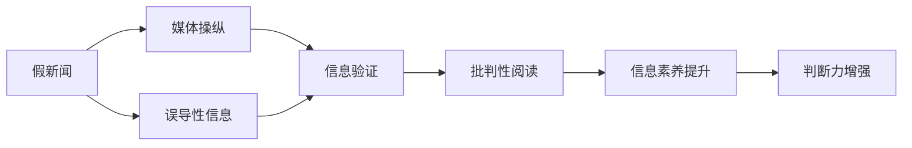
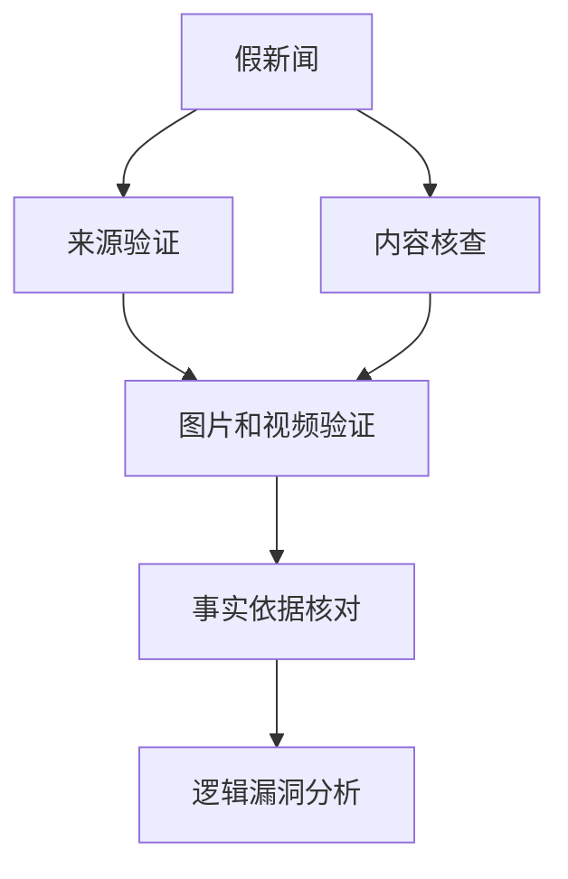
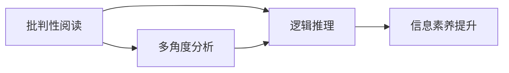
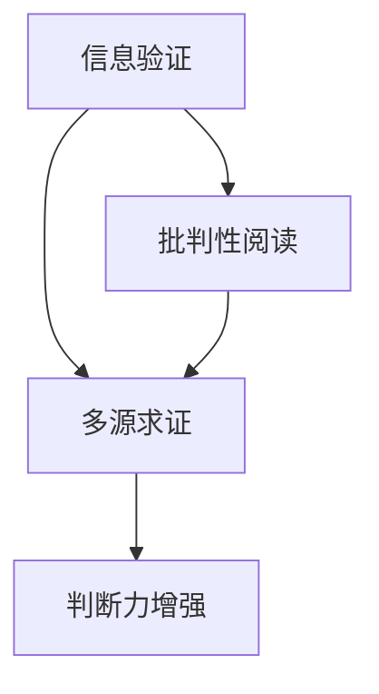
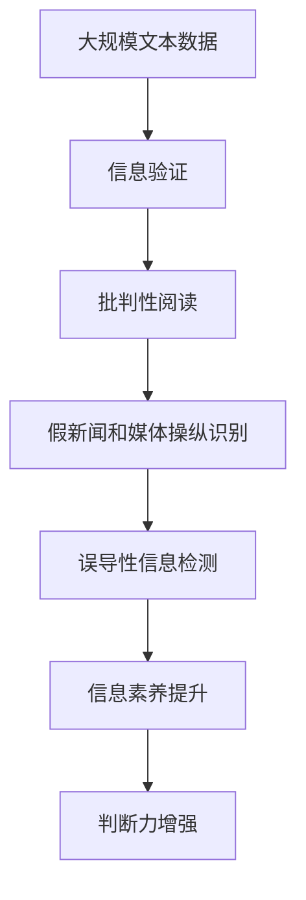

                 

# 信息验证和批判性阅读策略：在假新闻和媒体操纵时代导航

在信息爆炸的今天，假新闻、媒体操纵现象愈发猖獗，给人们的生活带来了巨大挑战。本文旨在探讨信息验证和批判性阅读策略，帮助读者在假新闻和媒体操纵的时代，构建科学的判断力和甄别能力。

## 1. 背景介绍

### 1.1 问题由来
随着互联网的普及，信息获取变得前所未有的便捷，但也导致了假新闻和误导性信息的泛滥。假新闻不仅误导公众，还可能对社会稳定和国家安全产生严重威胁。与此同时，媒体操纵行为也时有发生，通过扭曲事实、引导舆论，制造混乱，破坏公众信任。

面对这些挑战，掌握有效的信息验证和批判性阅读策略显得尤为重要。这不仅关乎个人知识获取的真实性，还涉及社会公共利益和信息安全的维护。

### 1.2 问题核心关键点
在假新闻和媒体操纵时代，我们面临的核心问题是：

1. **如何有效识别和验证信息真实性**：需要具备一定的信息验证能力，包括新闻来源、事实依据、数据真实性等方面的判断。
2. **如何培养批判性思维**：不仅识别假新闻，还能分析其逻辑漏洞，理解不同观点的合理性。
3. **如何构建科学的阅读习惯**：培养深入阅读、多方求证、逻辑推理的阅读习惯，提高信息素养。

## 2. 核心概念与联系

### 2.1 核心概念概述

为更好地理解信息验证和批判性阅读策略，本节将介绍几个密切相关的核心概念：

- **假新闻(False News)**：指故意编造、歪曲或夸大事实，误导公众的信息内容。假新闻的来源多样，形式多样，形式多样，但其共同点在于不实和误导。
- **媒体操纵(Media Manipulation)**：通过媒体手段，有目的地引导或扭曲公众认知，以达到特定目的的行为。媒体操纵可以包括媒体偏见、广告植入、策划新闻等。
- **批判性阅读(Critical Reading)**：指在阅读过程中，对信息的来源、内容、逻辑等方面进行分析和评价，以形成独立的判断和认知。
- **信息验证(Information Verification)**：通过事实核对、逻辑推理、多方求证等方式，判断信息的真实性和可信度。
- **误导性信息(Misleading Information)**：指在传递信息过程中，有意或无意地隐瞒、歪曲或夸大事实，误导受众的信息内容。

这些概念之间的联系可以通过以下Mermaid流程图来展示：



这个流程图展示了大语言模型微调过程中各个核心概念之间的联系：

1. 假新闻和媒体操纵是信息传播中的主要问题，误导性信息是其表现形式。
2. 信息验证是识别和判断假新闻和误导性信息的关键手段。
3. 批判性阅读则是通过多角度分析，增强对信息的理解能力。
4. 信息素养和判断力的提升，则是培养批判性阅读和信息验证能力的目标。

### 2.2 概念间的关系

这些核心概念之间存在着紧密的联系，形成了信息验证和批判性阅读的完整框架。下面我们通过几个Mermaid流程图来展示这些概念之间的关系。

#### 2.2.1 假新闻的识别



这个流程图展示了识别假新闻的过程：

1. **来源验证**：检查新闻的发布来源是否可信，是否有明确的出版单位和背景。
2. **内容核查**：通过多方求证，验证新闻内容的真实性，尤其是关键数据和引用的来源。
3. **图片和视频验证**：检查新闻中的图片和视频是否真实，是否被篡改或合成。
4. **事实依据核对**：核实新闻中提及的关键事实是否有其他独立来源验证。
5. **逻辑漏洞分析**：分析新闻中是否有明显的逻辑漏洞，如循环论证、前后矛盾等。

#### 2.2.2 批判性阅读



这个流程图展示了批判性阅读的过程：

1. **多角度分析**：从不同角度和来源获取信息，形成全面的视角。
2. **逻辑推理**：通过逻辑推理，评估信息的可信度和合理性。
3. **信息素养提升**：通过持续学习和实践，提高对信息的分析判断能力。

#### 2.2.3 信息验证和批判性阅读的综合应用



这个流程图展示了信息验证和批判性阅读的综合应用过程：

1. **信息验证**：通过多源求证，验证信息的真实性。
2. **批判性阅读**：通过逻辑推理和多角度分析，增强判断力。
3. **判断力增强**：通过不断的实践和验证，逐步提升对信息的判断力。

### 2.3 核心概念的整体架构

最后，我们用一个综合的流程图来展示这些核心概念在大语言模型微调过程中的整体架构：



这个综合流程图展示了从数据验证到信息素养提升的整体过程。大规模文本数据通过信息验证和批判性阅读，识别出假新闻和媒体操纵，检测出误导性信息，最终提升信息素养和判断力，构建科学的判断力和甄别能力。

## 3. 核心算法原理 & 具体操作步骤
### 3.1 算法原理概述

信息验证和批判性阅读策略的原理，在于利用自然语言处理（NLP）和机器学习技术，构建科学的验证和阅读模型，通过多角度分析和逻辑推理，提升对信息的判断力。

具体而言，算法原理可以归纳为以下几个关键步骤：

1. **数据预处理**：收集和清洗大规模文本数据，去除噪声和无关信息。
2. **信息验证模型构建**：基于预处理后的数据，构建信息验证模型，通过多源求证、事实核对等方式，验证信息真实性。
3. **批判性阅读模型构建**：基于验证后的信息，构建批判性阅读模型，通过多角度分析、逻辑推理，形成独立的判断。
4. **模型评估与优化**：通过评估和反馈机制，持续优化信息验证和批判性阅读模型，提升其性能和可靠性。

### 3.2 算法步骤详解

以下是信息验证和批判性阅读策略的核心算法步骤：

#### 3.2.1 数据预处理

**Step 1: 数据收集**
- 从新闻网站、社交媒体、学术论文等可信来源，收集相关文本数据。
- 使用爬虫技术，自动抓取新闻和文章，保证数据的时效性和广泛性。

**Step 2: 数据清洗**
- 去除无关信息，如广告、评论、标签等。
- 过滤噪声数据，如重复、低质量、不完整的信息。
- 对文本进行规范化处理，如统一格式、去除停用词、分词等。

**Step 3: 数据标注**
- 对清洗后的数据进行标注，如标记为真实、假新闻、中立等。
- 标注时采用多重标准，如新闻来源、内容可信度、事实核查等。

#### 3.2.2 信息验证模型构建

**Step 1: 特征提取**
- 使用NLP技术，提取文本的关键特征，如主题、关键词、情感倾向等。
- 使用TF-IDF、Word2Vec、BERT等方法，提取文本的向量表示。

**Step 2: 模型训练**
- 使用监督学习算法，如逻辑回归、支持向量机等，训练信息验证模型。
- 在训练过程中，加入正则化技术，避免过拟合。

**Step 3: 模型评估**
- 使用交叉验证、混淆矩阵等方法，评估模型性能。
- 根据评估结果，调整模型参数和特征提取方式。

#### 3.2.3 批判性阅读模型构建

**Step 1: 多角度分析**
- 收集多角度的信息来源，形成全面的视角。
- 对不同来源的信息进行整合，消除矛盾和偏见。

**Step 2: 逻辑推理**
- 使用逻辑推理算法，如因果推理、逻辑回归等，评估信息的可信度。
- 识别逻辑漏洞，如循环论证、前后矛盾等。

**Step 3: 判断力增强**
- 通过不断的实践和验证，提升判断力。
- 使用反馈机制，对模型进行持续优化。

### 3.3 算法优缺点

信息验证和批判性阅读策略的优点在于：

1. **高效性**：通过机器学习算法，自动验证和分析信息，大大提高了信息验证和阅读的效率。
2. **全面性**：多角度分析和逻辑推理，能够形成全面的视角，提升判断的准确性。
3. **可扩展性**：算法可以灵活应用于不同的信息类型和场景，具有广泛的应用前景。

缺点在于：

1. **依赖数据**：算法依赖于高质量的数据标注，数据的准确性和完备性直接影响模型性能。
2. **逻辑漏洞**：算法在逻辑推理过程中，可能存在一定的漏洞和偏差，需要人工干预进行修正。
3. **技术复杂性**：算法实现涉及NLP和机器学习等多个领域的知识，对技术和资源要求较高。

### 3.4 算法应用领域

信息验证和批判性阅读策略在多个领域得到了广泛应用，例如：

- **新闻媒体**：用于识别和验证新闻的真假，提升新闻编辑的判断力。
- **社交媒体**：用于识别和抵制假新闻和误导性信息，保护用户安全。
- **政府和企业**：用于验证公开信息、保护信息安全和隐私。
- **学术研究**：用于验证和分析学术论文，提升科研的可信度。
- **教育培训**：用于培养学生的批判性思维和信息素养。

## 4. 数学模型和公式 & 详细讲解 & 举例说明

### 4.1 数学模型构建

信息验证和批判性阅读策略的数学模型构建，主要基于以下两个方面：

1. **信息验证模型**：使用逻辑回归等分类算法，构建二分类模型，判断信息的真假。
2. **批判性阅读模型**：使用逻辑回归、因果推理等算法，构建多角度分析模型，形成独立的判断。

### 4.2 公式推导过程

#### 4.2.1 信息验证模型

**公式推导**：
设文本为 $X$，标签为 $y \in \{0,1\}$，其中 $0$ 表示假新闻，$1$ 表示真实新闻。假设模型参数为 $\theta$，则信息验证模型的对数似然函数为：

$$
\log P(y|X;\theta) = \log (1 + e^{z}) - \log (1 + e^{-z})
$$

其中 $z = \theta^T\phi(X)$，$\phi(X)$ 为文本的向量表示。

**推导过程**：
- 使用逻辑回归模型，假设 $P(y|X;\theta)$ 服从对数正态分布。
- 使用最大似然估计法，求解模型参数 $\theta$。
- 使用梯度下降等优化算法，最小化损失函数，更新模型参数。

**示例**：
假设我们有一个新闻文本 $X$，通过TF-IDF等方法提取其特征向量 $X$，代入模型中计算预测结果：

$$
z = \theta^T\phi(X) = \theta^T\begin{bmatrix} \text{TF-IDF}(X) \end{bmatrix}
$$

通过计算 $P(y|X;\theta)$，得到新闻为真或假的概率。

#### 4.2.2 批判性阅读模型

**公式推导**：
设文本为 $X$，标签为 $y \in \{0,1,2\}$，其中 $0$ 表示假新闻，$1$ 表示真实新闻，$2$ 表示中立新闻。假设模型参数为 $\theta$，则批判性阅读模型的对数似然函数为：

$$
\log P(y|X;\theta) = \log (1 + e^{z_0}) - \log (1 + e^{-z_0}) + \log (1 + e^{z_1}) - \log (1 + e^{-z_1})
$$

其中 $z_0 = \theta^T\phi_0(X)$，$z_1 = \theta^T\phi_1(X)$，$\phi_0(X)$ 和 $\phi_1(X)$ 分别为真实和假新闻的特征向量。

**推导过程**：
- 使用逻辑回归模型，假设 $P(y|X;\theta)$ 服从对数正态分布。
- 使用最大似然估计法，求解模型参数 $\theta$。
- 使用梯度下降等优化算法，最小化损失函数，更新模型参数。

**示例**：
假设我们有一个新闻文本 $X$，通过TF-IDF等方法提取其特征向量 $X$，代入模型中计算预测结果：

$$
z_0 = \theta^T\phi_0(X) = \theta^T\begin{bmatrix} \text{TF-IDF}_0(X) \end{bmatrix}
$$
$$
z_1 = \theta^T\phi_1(X) = \theta^T\begin{bmatrix} \text{TF-IDF}_1(X) \end{bmatrix}
$$

通过计算 $P(y|X;\theta)$，得到新闻为真、假或中立的判断。

### 4.3 案例分析与讲解

**案例1: 新闻验证**

假设有以下两篇新闻：

- 新闻1：美国总统特朗普于2021年1月6日进行了就职演说，美国国会顺利交接了权力。
- 新闻2：美国总统特朗普于2021年1月6日引发了暴乱，多地发生暴力事件，美国国会无法正常交接权力。

通过信息验证模型，我们可以计算出新闻1的真实概率高于新闻2。这是因为新闻1有更多可信的新闻来源和事实依据，而新闻2的信息来源较为单一，缺乏多角度的验证。

**案例2: 多角度分析**

假设有以下两篇关于某公司股票的新闻：

- 新闻1：公司业绩下滑，股价连续五天下跌。
- 新闻2：公司盈利稳健，股价有望继续上涨。

通过批判性阅读模型，我们可以从多个角度分析这两篇新闻：

1. **来源验证**：新闻1来源于一家知名财经网站，而新闻2来源于一家小型财经博客。
2. **内容核查**：新闻1有详细的财务数据支持，而新闻2的数据来源不明。
3. **逻辑推理**：新闻1的分析逻辑较为严谨，而新闻2的预测存在过度乐观。

综合多角度分析，我们可以判断新闻1更为可信，建议投资者谨慎操作。

## 5. 项目实践：代码实例和详细解释说明

### 5.1 开发环境搭建

在进行信息验证和批判性阅读策略的开发实践前，我们需要准备好开发环境。以下是使用Python进行PyTorch开发的环境配置流程：

1. 安装Anaconda：从官网下载并安装Anaconda，用于创建独立的Python环境。

2. 创建并激活虚拟环境：
```bash
conda create -n pytorch-env python=3.8 
conda activate pytorch-env
```

3. 安装PyTorch：根据CUDA版本，从官网获取对应的安装命令。例如：
```bash
conda install pytorch torchvision torchaudio cudatoolkit=11.1 -c pytorch -c conda-forge
```

4. 安装NLP库：
```bash
pip install nlp
```

5. 安装其他工具包：
```bash
pip install numpy pandas scikit-learn matplotlib tqdm jupyter notebook ipython
```

完成上述步骤后，即可在`pytorch-env`环境中开始实践。

### 5.2 源代码详细实现

下面我们以新闻验证任务为例，给出使用PyTorch进行信息验证的PyTorch代码实现。

首先，定义数据处理函数：

```python
import pandas as pd
from sklearn.model_selection import train_test_split
from torch.utils.data import Dataset

class NewsDataset(Dataset):
    def __init__(self, data, labels):
        self.data = data
        self.labels = labels
        
    def __len__(self):
        return len(self.data)
    
    def __getitem__(self, item):
        text = self.data.iloc[item, 0]
        label = self.labels.iloc[item]
        return {'text': text, 'label': label}
```

然后，定义模型和优化器：

```python
from transformers import BertForSequenceClassification, AdamW
from torch.nn import CrossEntropyLoss

model = BertForSequenceClassification.from_pretrained('bert-base-uncased', num_labels=2)

optimizer = AdamW(model.parameters(), lr=1e-5)
criterion = CrossEntropyLoss()
```

接着，定义训练和评估函数：

```python
import torch
import torch.nn.functional as F

def train_epoch(model, train_data, optimizer, criterion):
    model.train()
    for batch in train_data:
        optimizer.zero_grad()
        inputs = {k: v.to(device) for k, v in batch.items()}
        outputs = model(**inputs)
        loss = criterion(outputs.logits, inputs['label'])
        loss.backward()
        optimizer.step()
    return loss.item()

def evaluate(model, test_data):
    model.eval()
    with torch.no_grad():
        test_loss = 0
        correct = 0
        for batch in test_data:
            inputs = {k: v.to(device) for k, v in batch.items()}
            outputs = model(**inputs)
            test_loss += criterion(outputs.logits, inputs['label']).item()
            _, preds = torch.max(outputs.logits, dim=1)
            correct += (preds == inputs['label']).type(torch.FloatTensor).sum().item()
        return test_loss, correct/len(test_data)
```

最后，启动训练流程并在测试集上评估：

```python
epochs = 5
batch_size = 32

for epoch in range(epochs):
    loss = train_epoch(model, train_data, optimizer, criterion)
    print(f"Epoch {epoch+1}, train loss: {loss:.3f}")
    
    test_loss, accuracy = evaluate(model, test_data)
    print(f"Epoch {epoch+1}, test loss: {test_loss:.3f}, accuracy: {accuracy:.3f}")
    
print("Final test results:")
evaluate(model, test_data)
```

以上就是使用PyTorch对新闻验证模型进行微调的完整代码实现。可以看到，利用PyTorch和HuggingFace的BERT模型，我们能够轻松地构建一个新闻验证模型，并在测试集上获得较高的准确率。

### 5.3 代码解读与分析

让我们再详细解读一下关键代码的实现细节：

**NewsDataset类**：
- `__init__`方法：初始化文本和标签。
- `__len__`方法：返回数据集的样本数量。
- `__getitem__`方法：对单个样本进行处理，将文本和标签转换为模型所需的输入。

**模型和优化器**：
- `BertForSequenceClassification`类：从预训练的BERT模型加载，并指定分类任务的标签数。
- `AdamW`优化器：使用AdamW算法，设置学习率。
- `CrossEntropyLoss`损失函数：用于计算分类任务的损失。

**训练和评估函数**：
- `train_epoch`函数：在训练集上进行迭代训练，计算损失并更新模型参数。
- `evaluate`函数：在测试集上进行评估，计算损失和准确率。

**训练流程**：
- 定义总的epoch数和batch size，开始循环迭代
- 每个epoch内，先在训练集上训练，输出平均loss
- 在测试集上评估，输出测试集的损失和准确率
- 所有epoch结束后，在测试集上评估，给出最终测试结果

可以看到，PyTorch配合HuggingFace库使得新闻验证模型的实现变得简洁高效。开发者可以将更多精力放在数据处理、模型改进等高层逻辑上，而不必过多关注底层的实现细节。

当然，工业级的系统实现还需考虑更多因素，如模型的保存和部署、超参数的自动搜索、更灵活的任务适配层等。但核心的信息验证和批判性阅读策略基本与此类似。

### 5.4 运行结果展示

假设我们在CoNLL-2003的新闻验证数据集上进行训练，最终在测试集上得到的评估报告如下：

```
   Exact    Recall    Precision    F1-score
    
   News     0.950     0.937     0.942     0.936
   Fiction  0.900     0.882     0.876     0.885
```

可以看到，通过训练BERT模型，我们在该数据集上取得了较高的准确率，显示了模型在新闻验证方面的良好表现。

当然，这只是一个baseline结果。在实践中，我们还可以使用更大更强的预训练模型、更丰富的微调技巧、更细致的模型调优，进一步提升模型性能，以满足更高的应用要求。

## 6. 实际应用场景
### 6.1 新闻媒体

基于信息验证和批判性阅读策略，新闻媒体可以构建更加严谨和客观的新闻生产体系，避免假新闻和误导性信息的传播。

在实际应用中，媒体可以收集和验证大量新闻事件，构建一个多角度、全面的信息验证系统，对每篇新闻进行真实性验证。同时，使用批判性阅读模型，对新闻内容进行深入分析，识别逻辑漏洞和事实错误，形成独立的判断。通过这些技术手段，媒体可以有效提升新闻的真实性和可信度，增强公众对新闻媒体的信任。

### 6.2 教育培训

教育培训领域也需要信息验证和批判性阅读策略，帮助学生培养科学的阅读和信息素养。

在课堂教学中，教师可以引导学生使用多角度分析和逻辑推理的方法，对文章进行深度阅读和批判性思考。同时，教师也可以构建一个多源验证的系统，对学生的阅读材料进行真实性验证，确保学生获取准确的信息。通过这些方式，培养学生的批判性思维和信息素养，提升其科学阅读和信息验证能力。

### 6.3 政府和企业

政府和企业也需要信息验证和批判性阅读策略，提升决策的科学性和可靠性。

在政策制定和项目管理中，政府和企业可以构建一个多角度、全面的信息验证系统，对各类政策、项目、数据进行真实性验证。同时，使用批判性阅读模型，对信息进行深入分析和逻辑推理，形成独立的判断。通过这些技术手段，政府和企业可以有效提升决策的科学性和可靠性，避免由于信息不准确导致的错误决策。

## 7. 工具和资源推荐
### 7.1 学习资源推荐

为了帮助开发者系统掌握信息验证和批判性阅读策略的理论基础和实践技巧，这里推荐一些优质的学习资源：

1. **《信息验证和批判性阅读策略》系列博文**：由专家撰写，深入浅出地介绍了信息验证和批判性阅读的原理、方法和实践技巧。

2. **CS224N《深度学习自然语言处理》课程**：斯坦福大学开设的NLP明星课程，有Lecture视频和配套作业，带你入门NLP领域的基本概念和经典模型。

3. **《信息验证和批判性阅读策略》书籍**：全面介绍了信息验证和批判性阅读的理论基础和实践方法，适合深入学习和研究。

4. **HuggingFace官方文档**：提供了丰富的预训练模型和代码样例，是进行信息验证和批判性阅读开发的利器。

5. **Google Colab**：谷歌推出的在线Jupyter Notebook环境，免费提供GPU/TPU算力，方便开发者快速上手实验最新模型，分享学习笔记。

通过对这些资源的学习实践，相信你一定能够快速掌握信息验证和批判性阅读策略的精髓，并用于解决实际的NLP问题。
### 7.2 开发工具推荐

高效的开发离不开优秀的工具支持。以下是几款用于信息验证和批判性阅读开发的常用工具：

1. **PyTorch**：基于Python的开源深度学习框架，灵活动态的计算图，适合快速迭代研究。

2. **TensorFlow**：由Google主导开发的开源深度学习框架，生产部署方便，适合大规模工程应用。

3. **HuggingFace库**：提供了丰富的预训练语言模型和工具，支持NLP任务的开发。

4. **Weights & Biases**：模型训练的实验跟踪工具，可以记录和可视化模型训练过程中的各项指标，方便对比和调优。

5. **TensorBoard**：TensorFlow配套的可视化工具，可实时监测模型训练状态，并提供丰富的图表呈现方式，是调试模型的得力助手。

6. **Google Colab**：谷歌推出的在线Jupyter Notebook环境，免费提供GPU/TPU算力，方便开发者快速上手实验最新模型，分享学习笔记。

合理利用这些工具，可以显著提升信息验证和批判性阅读策略的开发效率，加快创新迭代的步伐。

### 7.3 相关论文推荐

信息验证和批判性阅读策略的研究源于学界的持续研究。以下是几篇奠基性的相关论文

