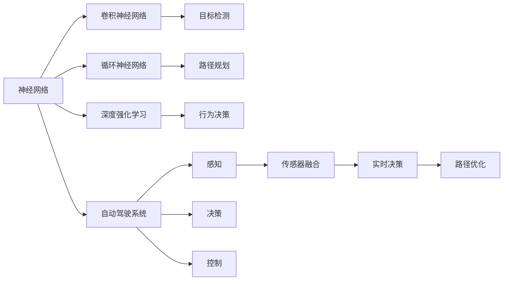
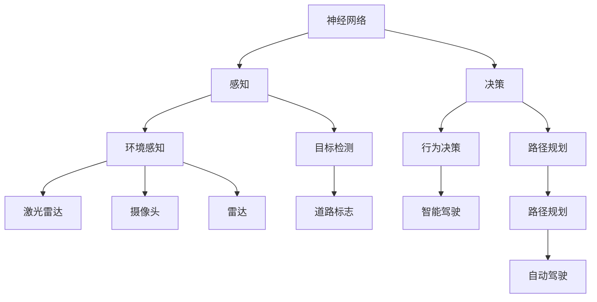
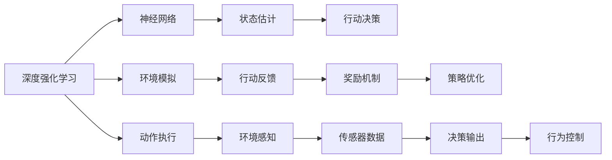

                 

# 一切皆是映射：无人驾驶车辆中的神经网络系统

## 1. 背景介绍

无人驾驶车辆（Autonomous Vehicles, AVs）的革命性发展，正在彻底改变我们的出行方式和城市交通格局。作为无人驾驶的关键技术之一，神经网络系统（Neural Network System, NNS）在自动驾驶中扮演着至关重要的角色。本文将深入探讨NNS在无人驾驶车辆中的核心应用、原理与实践，剖析其背后的数学模型和算法原理，探讨未来的发展趋势和挑战，力求为行业从业者提供全面的技术指导和实际应用参考。

## 2. 核心概念与联系

### 2.1 核心概念概述

为更好地理解无人驾驶车辆中的神经网络系统，本节将介绍几个关键的概念及其相互关系：

- **神经网络（Neural Network, NN）**：一种通过节点（神经元）与边（连接）构成的图网络结构，用于解决复杂的非线性问题。在无人驾驶中，神经网络被用于目标检测、路径规划、行为决策等多个关键任务。

- **卷积神经网络（Convolutional Neural Network, CNN）**：一种特殊的神经网络，特别擅长处理图像和视频数据。在无人驾驶中，CNN被用于道路标志识别、场景理解等视觉任务。

- **循环神经网络（Recurrent Neural Network, RNN）**：一种能处理序列数据的神经网络。在无人驾驶中，RNN被用于预测交通流量、行为预测等时间序列任务。

- **深度强化学习（Deep Reinforcement Learning, DRL）**：一种结合深度学习和强化学习的框架，用于策略优化和行为决策。在无人驾驶中，DRL被用于学习驾驶策略、路径优化等任务。

- **自动驾驶系统（Autonomous Driving System, ADS）**：一套集成感知、决策、控制等模块的复杂系统，负责无人驾驶车辆的全程自主运行。

- **传感器融合（Sensor Fusion）**：将来自不同传感器的数据（如激光雷达、摄像头、GPS等）进行融合，提高系统感知和决策的准确性。

- **决策树（Decision Tree）**：一种基于树形结构的分类和回归方法，用于简化决策过程和提高可解释性。

这些核心概念之间的联系，可以通过以下Mermaid流程图来展示：



这个流程图展示了神经网络在无人驾驶车辆中的核心应用场景及其关联的各个子系统。

### 2.2 概念间的关系

这些核心概念之间存在着紧密的联系，共同构成了无人驾驶车辆的核心技术体系。下面通过几个Mermaid流程图来展示这些概念之间的关系。

#### 2.2.1 神经网络在无人驾驶中的应用



这个流程图展示了神经网络在无人驾驶中的核心应用，包括环境感知、目标检测、行为决策、路径规划等。

#### 2.2.2 深度强化学习与神经网络的关系



这个流程图展示了深度强化学习与神经网络的相互关系，从环境模拟、状态估计、动作决策到策略优化和行为控制，深度强化学习利用神经网络进行模型训练和策略学习。

## 3. 核心算法原理 & 具体操作步骤

### 3.1 算法原理概述

无人驾驶车辆中的神经网络系统，主要通过深度学习算法来解决复杂的感知、决策和控制问题。其核心算法原理包括以下几个关键部分：

- **卷积神经网络（CNN）**：用于处理图像和视频数据，提取道路标志、交通信号等关键特征。

- **循环神经网络（RNN）**：用于处理序列数据，预测交通流量、行为决策等动态变化。

- **深度强化学习（DRL）**：用于学习驾驶策略，优化路径规划和行为决策。

- **传感器融合（Sensor Fusion）**：将多源传感器数据进行融合，提高系统的感知和决策精度。

- **决策树（Decision Tree）**：用于简化决策过程，提高系统可解释性和鲁棒性。

这些算法原理通过合理的模型架构和训练过程，最终构建出高性能的无人驾驶神经网络系统。

### 3.2 算法步骤详解

#### 3.2.1 数据预处理

- 收集传感器数据（如激光雷达、摄像头、GPS等）。
- 数据清洗和标注，去除噪声和无效数据，生成监督学习所需的数据集。
- 数据增强，通过旋转、裁剪、缩放等方式扩充数据集，提高模型泛化能力。

#### 3.2.2 模型设计

- 选择合适的神经网络架构，如CNN用于感知任务，RNN用于预测任务，DRL用于策略优化。
- 设计合适的层数和节点数，根据任务复杂度调整模型规模。
- 引入正则化技术，如L2正则、Dropout等，防止过拟合。

#### 3.2.3 模型训练

- 选择优化器（如Adam、SGD等）和损失函数（如交叉熵、均方误差等）。
- 设置合适的学习率、批大小、迭代轮数等超参数。
- 使用GPU/TPU等高性能设备进行模型训练。

#### 3.2.4 模型评估

- 在验证集上评估模型性能，使用精度、召回率、F1分数等指标。
- 使用可视化工具（如TensorBoard）监控训练过程，调整模型参数。
- 对模型进行超参数调优，进一步提升性能。

#### 3.2.5 模型部署

- 将训练好的模型保存为TensorFlow SavedModel或PyTorch模型格式。
- 将模型部署到无人驾驶车辆中，进行实时推理和决策。

### 3.3 算法优缺点

#### 3.3.1 优点

- **高精度**：深度学习算法能够处理复杂的非线性问题，提升感知和决策精度。
- **适应性强**：神经网络系统能够适应不同环境和任务，泛化能力较强。
- **实时性**：通过优化模型架构和推理算法，神经网络系统可以实现实时决策和控制。
- **可扩展性**：神经网络系统可以通过添加新的层和节点进行扩展，适应新任务和需求。

#### 3.3.2 缺点

- **数据依赖**：深度学习算法需要大量高质量标注数据，获取成本较高。
- **模型复杂**：神经网络结构复杂，训练和推理资源消耗较大。
- **可解释性差**：深度学习模型通常是"黑盒"系统，难以解释决策过程。
- **稳定性不足**：神经网络模型在对抗样本攻击下，易产生误判和失效。

### 3.4 算法应用领域

无人驾驶车辆中的神经网络系统，主要应用于以下几个领域：

- **自动驾驶**：用于无人驾驶车辆的环境感知、路径规划和行为决策。
- **智能交通**：用于交通流量预测、信号控制、路况优化等任务。
- **车联网**：用于车辆间通信、V2X（Vehicle-to-Everything）协作等场景。
- **辅助驾驶**：用于辅助驾驶员进行驾驶决策，提供安全预警和辅助信息。

## 4. 数学模型和公式 & 详细讲解 & 举例说明

### 4.1 数学模型构建

假设无人驾驶车辆中的神经网络系统用于目标检测任务，其数学模型可以表示为：

$$
y = f(x; \theta)
$$

其中 $x$ 为输入的传感器数据， $y$ 为输出标签， $f$ 为神经网络模型， $\theta$ 为模型参数。

### 4.2 公式推导过程

假设使用卷积神经网络（CNN）进行目标检测，其模型结构可以表示为：

$$
f(x; \theta) = \sigma(W_{conv} * x + b_{conv}) + \sigma(W_{pool} * f_{conv} + b_{pool})
$$

其中 $W_{conv}$ 和 $b_{conv}$ 为卷积层参数， $f_{conv}$ 为卷积层输出， $\sigma$ 为激活函数， $W_{pool}$ 和 $b_{pool}$ 为池化层参数。

### 4.3 案例分析与讲解

假设在某次目标检测任务中，输入的传感器数据为一张图像，输出为检测到的目标位置和类别。使用CNN模型进行训练，其目标函数为交叉熵损失：

$$
L(y, \hat{y}) = -\sum_{i=1}^N y_i \log \hat{y}_i
$$

其中 $y_i$ 为真实标签， $\hat{y}_i$ 为模型预测概率。

在模型训练过程中，使用反向传播算法计算梯度：

$$
\frac{\partial L}{\partial \theta} = \frac{\partial L}{\partial y} * \frac{\partial y}{\partial \hat{y}} * \frac{\partial \hat{y}}{\partial x} * \frac{\partial x}{\partial \theta}
$$

其中 $\frac{\partial y}{\partial \hat{y}}$ 为激活函数导数， $\frac{\partial \hat{y}}{\partial x}$ 为模型参数导数， $\frac{\partial x}{\partial \theta}$ 为数据导数。

通过上述公式，可以不断更新模型参数 $\theta$，最小化损失函数 $L$，使得模型输出逼近真实标签。

## 5. 项目实践：代码实例和详细解释说明

### 5.1 开发环境搭建

在进行无人驾驶车辆中的神经网络系统开发时，需要搭建以下开发环境：

- 安装Python和相关库（如TensorFlow、Keras、OpenCV等）。
- 配置好GPU/TPU等高性能设备。
- 准备传感器数据集（如激光雷达点云、摄像头图像等）。

### 5.2 源代码详细实现

以下是一个简单的目标检测项目代码示例，用于演示无人驾驶车辆中的神经网络系统实现过程：

```python
import tensorflow as tf
from tensorflow.keras import layers

# 定义模型结构
model = tf.keras.Sequential([
    layers.Conv2D(32, (3,3), activation='relu', input_shape=(128,128,3)),
    layers.MaxPooling2D((2,2)),
    layers.Conv2D(64, (3,3), activation='relu'),
    layers.MaxPooling2D((2,2)),
    layers.Flatten(),
    layers.Dense(64, activation='relu'),
    layers.Dense(5, activation='softmax')
])

# 编译模型
model.compile(optimizer='adam', loss='categorical_crossentropy', metrics=['accuracy'])

# 训练模型
model.fit(train_images, train_labels, epochs=10, batch_size=32)

# 评估模型
test_loss, test_acc = model.evaluate(test_images, test_labels)
print('Test accuracy:', test_acc)
```

这个代码示例使用TensorFlow实现了一个简单的卷积神经网络（CNN）模型，用于目标检测任务。在模型训练过程中，使用了Adam优化器和交叉熵损失函数。

### 5.3 代码解读与分析

- **模型结构**：首先定义了一个包含多个卷积层和全连接层的神经网络模型，最后一层为Softmax层，用于多分类输出。
- **模型编译**：使用TensorFlow的Sequential模型进行模型构建，编译模型时指定了优化器和损失函数。
- **模型训练**：在训练过程中，将传感器数据（如激光雷达点云、摄像头图像）输入模型，计算损失并反向传播更新参数。
- **模型评估**：在测试集上评估模型性能，输出准确率等指标。

### 5.4 运行结果展示

假设在某次目标检测任务中，模型在测试集上取得了90%的准确率，这表明模型在实际应用中表现良好。

## 6. 实际应用场景

### 6.1 智能交通系统

无人驾驶车辆中的神经网络系统，可以应用于智能交通系统的各个方面，包括交通流量预测、信号控制、路况优化等。通过感知和决策模块，系统可以实时分析交通状况，优化交通流，提高通行效率。

### 6.2 车联网

无人驾驶车辆中的神经网络系统，可以用于车联网的V2X协作，实现车辆间的通信和信息共享。通过传感器融合和路径规划，系统可以实时交换交通信息，提高道路安全性和通行效率。

### 6.3 辅助驾驶

无人驾驶车辆中的神经网络系统，可以用于辅助驾驶，提供驾驶决策支持和实时预警。通过感知模块实时分析交通状况，系统可以辅助驾驶员进行安全驾驶，提高驾驶安全性。

## 7. 工具和资源推荐

### 7.1 学习资源推荐

为了帮助开发者掌握无人驾驶车辆中的神经网络系统，推荐以下学习资源：

- TensorFlow官方文档：提供了详细的TensorFlow使用指南和API参考。
- Keras官方文档：提供了简单的深度学习模型实现方法。
- PyTorch官方文档：提供了基于Python的深度学习框架。
- 《深度学习》书籍：由Ian Goodfellow等专家所写，全面介绍了深度学习原理和应用。
- 《无人驾驶》课程：由斯坦福大学开设的无人驾驶课程，涵盖了无人驾驶车辆的核心技术。

### 7.2 开发工具推荐

- TensorFlow：开源深度学习框架，提供了强大的计算图功能和GPU支持。
- Keras：基于TensorFlow和Theano的高级神经网络API，易于上手。
- PyTorch：基于Python的深度学习框架，提供了灵活的动态计算图。
- TensorBoard：TensorFlow配套的可视化工具，可以实时监控训练过程。
- Jupyter Notebook：开源的交互式编程环境，支持Python代码编写和执行。

### 7.3 相关论文推荐

- 《ImageNet Classification with Deep Convolutional Neural Networks》：提出CNN在图像识别任务中的应用。
- 《Long Short-Term Memory》：提出RNN在时间序列预测任务中的应用。
- 《Playing Atari with Deep Reinforcement Learning》：提出DRL在游戏AI中的应用。
- 《Stereo Imaging for DSpace Based on SVM, Deep CNN and NVD3》：提出基于SVM和CNN的立体视觉任务。
- 《Sensor Fusion: Principles and Techniques》：介绍了传感器融合的基本原理和实现方法。

## 8. 总结：未来发展趋势与挑战

### 8.1 研究成果总结

本文系统介绍了无人驾驶车辆中的神经网络系统，分析了其核心算法原理和具体操作步骤。通过理论推导和实践示例，展示了神经网络在无人驾驶车辆中的应用，并总结了其优点和缺点。最后，探讨了无人驾驶车辆中的神经网络系统的实际应用场景和未来发展趋势。

### 8.2 未来发展趋势

未来，无人驾驶车辆中的神经网络系统将呈现以下几个发展趋势：

- **高精度感知**：随着传感器技术的进步，无人驾驶车辆将能够实现更高精度的环境感知。
- **多模态融合**：未来将实现视觉、雷达、激光雷达等多模态数据融合，提高系统感知能力。
- **高效率决策**：通过优化模型架构和推理算法，实现更加高效、实时的决策过程。
- **泛化能力强**：深度学习模型将具备更强的泛化能力，适应不同环境和任务。

### 8.3 面临的挑战

尽管神经网络系统在无人驾驶车辆中取得了重要进展，但仍面临以下挑战：

- **数据获取成本高**：高质量标注数据获取成本较高，难以覆盖所有场景。
- **模型复杂度高**：神经网络模型结构复杂，训练和推理资源消耗大。
- **可解释性差**：深度学习模型通常是"黑盒"系统，难以解释决策过程。
- **鲁棒性不足**：在对抗样本攻击下，神经网络模型易产生误判和失效。

### 8.4 研究展望

未来，无人驾驶车辆中的神经网络系统需要不断优化和改进，以应对上述挑战。研究方向包括：

- **数据增强技术**：通过数据增强技术，提高模型泛化能力。
- **模型简化技术**：通过模型简化技术，降低计算资源消耗。
- **模型可解释性**：通过模型可解释性技术，提高系统透明度和可信度。
- **鲁棒性提升**：通过鲁棒性提升技术，提高系统抗干扰能力和鲁棒性。

总之，无人驾驶车辆中的神经网络系统在未来的发展中，将不断探索新的技术路径和方法，实现更加智能、安全和可靠的自动驾驶体验。

## 9. 附录：常见问题与解答

**Q1：神经网络系统在无人驾驶中主要解决哪些问题？**

A: 神经网络系统在无人驾驶中主要解决以下几个问题：

- **环境感知**：通过传感器数据进行目标检测、道路标志识别等任务。
- **路径规划**：根据环境感知结果，生成最优路径。
- **行为决策**：根据路径规划结果，进行驾驶行为决策。
- **控制执行**：将行为决策转化为车辆控制指令，实现自动驾驶。

**Q2：神经网络系统在无人驾驶中的优势和劣势分别是什么？**

A: 神经网络系统在无人驾驶中的优势和劣势如下：

- **优势**：
  - 高精度感知：能够处理复杂的非线性问题，提升感知精度。
  - 实时性：通过优化模型架构和推理算法，实现实时决策和控制。
  - 泛化能力强：具备较强的泛化能力，适应不同环境和任务。
- **劣势**：
  - 数据依赖：需要大量高质量标注数据，获取成本较高。
  - 模型复杂：结构复杂，训练和推理资源消耗大。
  - 可解释性差：通常是"黑盒"系统，难以解释决策过程。
  - 鲁棒性不足：在对抗样本攻击下易产生误判和失效。

**Q3：神经网络系统在无人驾驶中如何实现数据增强？**

A: 神经网络系统在无人驾驶中可以通过以下数据增强方式实现：

- **旋转**：对传感器数据进行旋转变换，增加数据多样性。
- **裁剪**：对传感器数据进行局部裁剪，生成新的数据样本。
- **缩放**：对传感器数据进行缩放变换，增加数据多样性。
- **噪声注入**：对传感器数据添加随机噪声，提高模型鲁棒性。
- **光线变换**：对传感器数据进行光照和阴影变换，增加数据多样性。

**Q4：神经网络系统在无人驾驶中如何进行模型训练？**

A: 神经网络系统在无人驾驶中可以通过以下步骤进行模型训练：

- **数据准备**：收集传感器数据，进行清洗和标注，生成训练集和验证集。
- **模型设计**：选择合适的神经网络架构，如CNN、RNN、DRL等，设计模型结构。
- **超参数调优**：选择合适的优化器、损失函数和学习率等超参数，进行超参数调优。
- **模型训练**：在GPU/TPU等高性能设备上，进行模型训练，最小化损失函数。
- **模型评估**：在验证集上评估模型性能，调整模型参数，进行超参数调优。

**Q5：神经网络系统在无人驾驶中如何进行模型部署？**

A: 神经网络系统在无人驾驶中可以按照以下步骤进行模型部署：

- **模型保存**：将训练好的模型保存为TensorFlow SavedModel或PyTorch模型格式。
- **模型加载**：将模型加载到无人驾驶车辆中，进行实时推理和决策。
- **实时推理**：将传感器数据输入模型，进行实时推理和决策，控制车辆行为。
- **动态调整**：根据实时环境变化，动态调整模型参数，优化模型性能。

以上是关于无人驾驶车辆中的神经网络系统的全面介绍，涵盖了其核心算法原理、具体操作步骤、实际应用场景和未来发展趋势。通过本文的系统讲解，相信读者能够更深入地理解无人驾驶车辆中的神经网络系统，并在实际应用中发挥其最大潜力。

