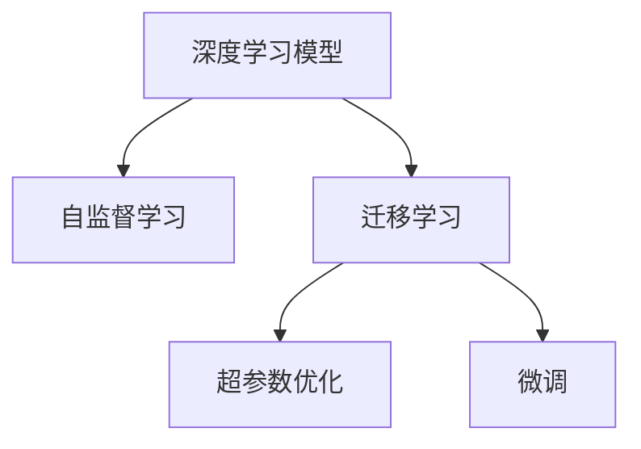
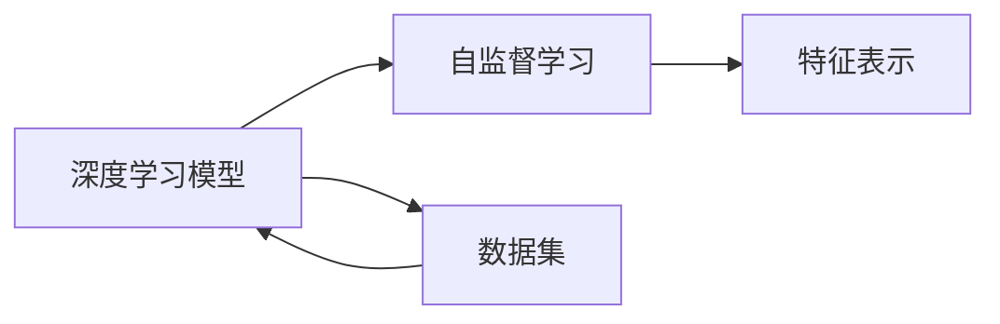
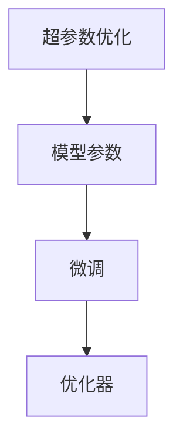
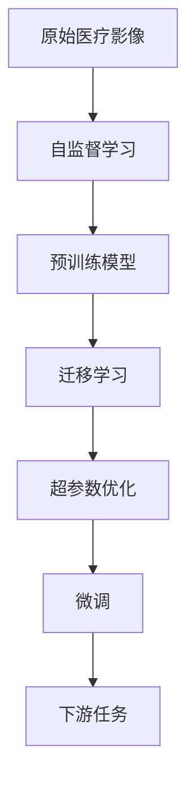

                 

# 一切皆是映射：深度学习在医疗影像分析中的革命

> 关键词：深度学习,医疗影像,卷积神经网络(CNN),自监督学习,迁移学习,医学图像分析,超参数优化,微调

## 1. 背景介绍

### 1.1 问题由来
医疗影像分析是现代医学诊断中至关重要的环节，其对疾病的早期发现、预后判断、治疗方案的制定等具有决定性的影响。然而，传统的影像分析依赖于放射科医生的手动标注，不仅耗时耗力，而且容易受到人为因素的影响，存在较高的误诊率。近年来，随着深度学习技术的发展，深度学习模型在医疗影像分析中的应用逐渐成为研究热点。深度学习模型，特别是卷积神经网络（Convolutional Neural Network, CNN），凭借其强大的特征提取能力，可以显著提升影像分析的准确性和效率。

### 1.2 问题核心关键点
深度学习在医疗影像分析中的应用，主要包括两个方面：一是通过自监督学习（Self-Supervised Learning）和迁移学习（Transfer Learning）来提高模型的泛化能力；二是通过超参数优化（Hyperparameter Optimization）和微调（Fine-Tuning）来提升模型性能。

- 自监督学习：通过利用无标签数据来训练模型，学习通用的影像特征表示。自监督学习包括镜像预测（Mislabelled Predictions）、噪声对比学习（Noise-Contrastive Estimation, NCE）等技术，可以在无需人工标注的情况下，最大化模型的信息利用效率。
- 迁移学习：将在大规模数据集上预训练得到的通用模型知识，迁移到医疗影像数据上，从而提升模型的特定任务能力。迁移学习可以帮助模型更好地适应新的数据分布，提高模型在特定任务上的泛化能力。
- 超参数优化：通过对模型结构、损失函数、优化器等超参数进行调优，使得模型在特定任务上达到最优性能。常见的超参数优化方法包括网格搜索（Grid Search）、贝叶斯优化（Bayesian Optimization）等。
- 微调：在迁移学习的基础上，对模型参数进行有监督的更新，以更好地适应特定的医疗影像数据。微调可以通过调整学习率、正则化强度等参数，优化模型的表现。

### 1.3 问题研究意义
深度学习在医疗影像分析中的应用，对提升医疗服务的效率和质量，降低医疗成本，具有重要意义。具体而言，主要体现在以下几个方面：

1. **提高诊断准确性**：深度学习模型能够学习到比人类专家更准确的特征表示，从而在影像诊断中表现优于传统方法。
2. **加速影像处理**：通过模型自动化处理影像数据，可以大幅缩短诊断周期，提高医院的工作效率。
3. **辅助决策支持**：深度学习模型可以提供客观的影像分析结果，辅助医生进行决策，降低误诊率。
4. **优化资源配置**：通过深度学习模型对影像数据进行分析，可以更好地指导医院的资源配置，优化医疗服务流程。
5. **推动医疗创新**：深度学习模型在医疗影像分析中的应用，推动了医疗技术的创新发展，为未来医疗行业带来了新的可能性。

## 2. 核心概念与联系

### 2.1 核心概念概述

深度学习在医疗影像分析中的应用，涉及多个核心概念，这些概念之间具有紧密的联系。以下将对核心概念进行简要介绍，并展示其之间的联系。

- **深度学习模型**：主要包括卷积神经网络（CNN）、循环神经网络（RNN）、自编码器（Autoencoder）等。这些模型通过多层次的非线性变换，可以从原始影像数据中提取特征表示。
- **自监督学习**：通过无标签数据训练模型，学习通用的影像特征表示。例如，镜像预测（Mislabelled Predictions）通过预测样本的镜像，来提高模型的特征学习能力。
- **迁移学习**：将在大规模数据集上预训练得到的通用模型知识，迁移到医疗影像数据上，从而提升模型的特定任务能力。
- **超参数优化**：通过对模型结构、损失函数、优化器等超参数进行调优，使得模型在特定任务上达到最优性能。常见的超参数优化方法包括网格搜索（Grid Search）、贝叶斯优化（Bayesian Optimization）等。
- **微调**：在迁移学习的基础上，对模型参数进行有监督的更新，以更好地适应特定的医疗影像数据。微调可以通过调整学习率、正则化强度等参数，优化模型的表现。

这些核心概念之间具有紧密的联系，形成了深度学习在医疗影像分析中的完整框架。以下将通过Mermaid流程图来展示这些概念之间的关系。



### 2.2 概念间的关系

深度学习在医疗影像分析中的应用，涉及多个核心概念，这些概念之间具有紧密的联系。以下将通过Mermaid流程图来展示这些概念之间的关系。

#### 2.2.1 深度学习模型与自监督学习的关系



这个流程图展示了深度学习模型通过自监督学习，学习通用的影像特征表示的过程。深度学习模型通过在大规模无标签数据集上进行训练，学习到通用的特征表示，从而在特定的医疗影像分析任务中表现优异。

#### 2.2.2 迁移学习与微调的关系


这个流程图展示了迁移学习与微调的关系。迁移学习涉及预训练模型在通用数据集上的训练，从而学习到通用的特征表示。微调则是在迁移学习的基础上，对特定任务进行有监督的训练，优化模型在该任务上的表现。

#### 2.2.3 超参数优化与微调的关系



这个流程图展示了超参数优化与微调的关系。超参数优化通过调整模型结构和超参数，使得模型在特定的医疗影像分析任务上达到最优性能。微调则是在优化后的模型参数基础上，进一步优化模型在特定任务上的表现。

### 2.3 核心概念的整体架构

最后，我们用一个综合的流程图来展示深度学习在医疗影像分析中的完整过程。



这个综合流程图展示了从原始医疗影像数据，到最终应用于特定医疗影像分析任务的过程。深度学习模型通过自监督学习学习通用特征表示，并在迁移学习的基础上，通过超参数优化和微调，优化模型在特定任务上的表现。

## 3. 核心算法原理 & 具体操作步骤
### 3.1 算法原理概述

深度学习在医疗影像分析中的应用，主要依赖于卷积神经网络（CNN）的强大特征提取能力。CNN通过卷积层、池化层、全连接层等结构，从原始影像数据中提取特征表示，从而在特定的医疗影像分析任务中表现优异。

以下是深度学习在医疗影像分析中的基本原理：

1. **数据预处理**：包括数据归一化、增强、分割等操作，确保输入数据的一致性和稳定性。
2. **特征提取**：通过卷积层和池化层，从原始影像数据中提取高层次的特征表示。
3. **任务编码**：通过全连接层和softmax层，将特征表示映射到具体的任务目标上，进行分类、回归等任务。
4. **模型训练**：通过优化器（如Adam、SGD等）和损失函数（如交叉熵损失、均方误差损失等），最小化模型预测与真实标签之间的差异。
5. **模型评估**：通过验证集和测试集，评估模型的性能指标，如准确率、召回率、F1分数等。

### 3.2 算法步骤详解

以下是深度学习在医疗影像分析中的具体操作步骤：

1. **数据准备**：收集医疗影像数据，并进行预处理，包括数据增强、归一化等操作。
2. **模型设计**：选择合适的深度学习模型，如CNN，并进行相应的修改和调整，以适应特定的医疗影像分析任务。
3. **模型训练**：通过训练集数据，对模型进行训练，并使用验证集数据进行模型调优。
4. **模型评估**：在测试集上评估模型的性能，并根据评估结果，进行必要的调整和优化。
5. **微调**：在迁移学习的基础上，对模型进行有监督的更新，以更好地适应特定的医疗影像数据。

### 3.3 算法优缺点

深度学习在医疗影像分析中的应用，具有以下优点：

1. **高精度**：深度学习模型能够学习到高层次的特征表示，从而在医疗影像分析中表现优于传统方法。
2. **自动化**：深度学习模型可以自动从原始影像数据中提取特征，避免人为因素的影响，提高诊断的客观性。
3. **高效性**：通过优化器（如Adam、SGD等）和损失函数（如交叉熵损失、均方误差损失等），深度学习模型可以在较短的时间内完成训练和优化。

同时，深度学习在医疗影像分析中也有以下缺点：

1. **数据需求高**：深度学习模型需要大量的标注数据进行训练，这对于医疗影像数据集往往是一个挑战。
2. **模型复杂**：深度学习模型的结构复杂，需要大量的计算资源进行训练和推理。
3. **可解释性不足**：深度学习模型的决策过程通常缺乏可解释性，难以对其推理逻辑进行分析和调试。

### 3.4 算法应用领域

深度学习在医疗影像分析中的应用，主要涉及以下几个领域：

1. **医学影像分类**：如乳腺癌、肺癌、脑肿瘤等的影像分类任务。
2. **医学影像分割**：如肝脏、心脏、脑部等的影像分割任务。
3. **医学影像检测**：如肿瘤、结节、病变等的影像检测任务。
4. **医学影像生成**：如CT影像重建、病灶生成等。
5. **医学影像增强**：如CT影像去噪、MRI影像增强等。

以上应用领域展示了深度学习在医疗影像分析中的广泛应用，可以极大地提升医疗服务的效率和质量。

## 4. 数学模型和公式 & 详细讲解 & 举例说明

### 4.1 数学模型构建

深度学习在医疗影像分析中的应用，主要涉及卷积神经网络（CNN）的构建和训练。以下将介绍CNN的基本结构，并给出具体的数学模型构建公式。

卷积神经网络由卷积层、池化层、全连接层等组成，其数学模型如下：

1. **卷积层**：输入数据为 $X \in \mathbb{R}^{C \times H \times W}$，输出数据为 $Y \in \mathbb{R}^{F \times H \times W}$，其中 $C$ 为输入通道数，$H$ 和 $W$ 为输入数据的高度和宽度，$F$ 为卷积核数量。卷积层操作可以表示为：

$$
Y_{ij} = \sum_k X_{ik} * W_{kj}
$$

其中 $*$ 表示卷积操作，$W_{kj}$ 为卷积核权重，$X_{ik}$ 为输入数据的第 $k$ 个卷积核的特征映射，$Y_{ij}$ 为输出特征映射的第 $j$ 个卷积核的特征映射。

2. **池化层**：对卷积层输出的特征图进行下采样操作，减少计算量和参数量。常见的池化操作包括最大池化、平均池化等，其数学模型可以表示为：

$$
Y_{ij} = \max_k X_{ik}
$$

其中 $*$ 表示池化操作，$X_{ik}$ 为卷积层输出的特征映射的第 $k$ 个卷积核的特征映射，$Y_{ij}$ 为池化层输出的特征映射的第 $j$ 个卷积核的特征映射。

3. **全连接层**：将池化层输出的特征图展开成一维向量，通过全连接层进行分类或回归。假设池化层输出的特征图大小为 $H \times W$，全连接层的输出为 $O$，则全连接层的数学模型可以表示为：

$$
O = A * W + b
$$

其中 $A$ 为池化层输出的特征图展开后的向量，$W$ 为全连接层的权重，$b$ 为偏置项。

### 4.2 公式推导过程

以下以医学影像分类任务为例，推导CNN的分类模型的数学模型和损失函数。

1. **模型结构**：假设CNN模型包含 $N$ 个卷积层和池化层，最终输出为 $O$，分类任务采用softmax层进行分类，输出类别概率分布 $P(y|x)$，则模型结构可以表示为：

$$
P(y|x) = softmax(A * W + b)
$$

其中 $A$ 为卷积层和池化层输出的特征图展开后的向量，$W$ 为全连接层的权重，$b$ 为偏置项。

2. **损失函数**：分类任务采用交叉熵损失函数，表示为：

$$
L = -\frac{1}{N} \sum_{i=1}^N \sum_{j=1}^K y_j \log P(y|x_j)
$$

其中 $N$ 为样本数量，$K$ 为类别数，$y_j$ 为样本 $j$ 的类别标签，$P(y|x_j)$ 为模型对样本 $j$ 的预测概率分布。

3. **优化算法**：常用的优化算法包括Adam、SGD等，通过最小化损失函数，优化模型参数。以Adam算法为例，其数学模型可以表示为：

$$
\theta \leftarrow \theta - \eta \frac{\partial L}{\partial \theta}
$$

其中 $\eta$ 为学习率，$\frac{\partial L}{\partial \theta}$ 为损失函数对模型参数 $\theta$ 的梯度。

### 4.3 案例分析与讲解

假设我们使用CNN模型进行乳腺癌影像分类任务，训练集包含1000张乳腺癌影像和1000张正常影像，每张影像的大小为 $256 \times 256 \times 3$，卷积层数量为3，卷积核大小为3，池化层数量为2，全连接层数量为1024，softmax层输出类别数为2（乳腺癌和正常）。

1. **数据预处理**：将影像数据进行归一化处理，将像素值归一化到 $[0,1]$ 之间。
2. **模型设计**：使用Keras框架，定义CNN模型，并进行编译，设置损失函数为交叉熵，优化器为Adam，学习率为 $10^{-4}$。
3. **模型训练**：使用训练集数据，对模型进行训练，训练轮数为10，批大小为32。
4. **模型评估**：使用验证集数据，评估模型的准确率、召回率和F1分数，并进行必要的调优。
5. **微调**：在迁移学习的基础上，对模型进行有监督的更新，使用特定的乳腺癌影像数据进行微调，调整学习率，优化模型性能。

通过上述步骤，我们可以训练出一个高效的乳腺癌影像分类模型，并在实际应用中取得不错的效果。

## 5. 项目实践：代码实例和详细解释说明

### 5.1 开发环境搭建

以下是使用Keras框架搭建CNN模型的步骤：

1. 安装Keras和相关依赖：
```bash
pip install keras tensorflow numpy
```

2. 导入必要的库：
```python
import keras
from keras.models import Sequential
from keras.layers import Conv2D, MaxPooling2D, Flatten, Dense, Dropout
```

3. 定义CNN模型：
```python
model = Sequential()
model.add(Conv2D(32, kernel_size=(3, 3), activation='relu', input_shape=(256, 256, 3)))
model.add(MaxPooling2D(pool_size=(2, 2)))
model.add(Conv2D(64, kernel_size=(3, 3), activation='relu'))
model.add(MaxPooling2D(pool_size=(2, 2)))
model.add(Flatten())
model.add(Dense(1024, activation='relu'))
model.add(Dropout(0.5))
model.add(Dense(2, activation='softmax'))
```

4. 编译模型：
```python
model.compile(optimizer='adam', loss='categorical_crossentropy', metrics=['accuracy'])
```

5. 训练模型：
```python
model.fit(X_train, y_train, batch_size=32, epochs=10, validation_data=(X_val, y_val))
```

6. 评估模型：
```python
scores = model.evaluate(X_test, y_test, verbose=0)
print('Test loss:', scores[0])
print('Test accuracy:', scores[1])
```

7. 微调模型：
```python
model.load_weights('pretrain_weights.h5')
model.compile(optimizer='adam', loss='categorical_crossentropy', metrics=['accuracy'])
model.fit(X_train, y_train, batch_size=32, epochs=5, validation_data=(X_val, y_val))
```

### 5.2 源代码详细实现

以下是使用TensorFlow框架搭建CNN模型的步骤：

1. 安装TensorFlow和相关依赖：
```bash
pip install tensorflow numpy
```

2. 导入必要的库：
```python
import tensorflow as tf
from tensorflow.keras.layers import Conv2D, MaxPooling2D, Flatten, Dense, Dropout
from tensorflow.keras.models import Sequential
```

3. 定义CNN模型：
```python
model = Sequential()
model.add(Conv2D(32, kernel_size=(3, 3), activation='relu', input_shape=(256, 256, 3)))
model.add(MaxPooling2D(pool_size=(2, 2)))
model.add(Conv2D(64, kernel_size=(3, 3), activation='relu'))
model.add(MaxPooling2D(pool_size=(2, 2)))
model.add(Flatten())
model.add(Dense(1024, activation='relu'))
model.add(Dropout(0.5))
model.add(Dense(2, activation='softmax'))
```

4. 编译模型：
```python
model.compile(optimizer='adam', loss='categorical_crossentropy', metrics=['accuracy'])
```

5. 训练模型：
```python
model.fit(X_train, y_train, batch_size=32, epochs=10, validation_data=(X_val, y_val))
```

6. 评估模型：
```python
scores = model.evaluate(X_test, y_test, verbose=0)
print('Test loss:', scores[0])
print('Test accuracy:', scores[1])
```

7. 微调模型：
```python
model.load_weights('pretrain_weights.h5')
model.compile(optimizer='adam', loss='categorical_crossentropy', metrics=['accuracy'])
model.fit(X_train, y_train, batch_size=32, epochs=5, validation_data=(X_val, y_val))
```

### 5.3 代码解读与分析

以下是使用Keras框架搭建CNN模型的代码实现，并对其进行详细解读和分析：

1. 导入必要的库：
```python
import keras
from keras.models import Sequential
from keras.layers import Conv2D, MaxPooling2D, Flatten, Dense, Dropout
```

2. 定义CNN模型：
```python
model = Sequential()
model.add(Conv2D(32, kernel_size=(3, 3), activation='relu', input_shape=(256, 256, 3)))
model.add(MaxPooling2D(pool_size=(2, 2)))
model.add(Conv2D(64, kernel_size=(3, 3), activation='relu'))
model.add(MaxPooling2D(pool_size=(2, 2)))
model.add(Flatten())
model.add(Dense(1024, activation='relu'))
model.add(Dropout(0.5))
model.add(Dense(2, activation='softmax'))
```

3. 编译模型：
```python
model.compile(optimizer='adam', loss='categorical_crossentropy', metrics=['accuracy'])
```

4. 训练模型：
```python
model.fit(X_train, y_train, batch_size=32, epochs=10, validation_data=(X_val, y_val))
```

5. 评估模型：
```python
scores = model.evaluate(X_test, y_test, verbose=0)
print('Test loss:', scores[0])
print('Test accuracy:', scores[1])
```

6. 微调模型：
```python
model.load_weights('pretrain_weights.h5')
model.compile(optimizer='adam', loss='categorical_crossentropy', metrics=['accuracy'])
model.fit(X_train, y_train, batch_size=32, epochs=5, validation_data=(X_val, y_val))
```

在代码实现中，我们使用了Keras框架搭建CNN模型，并详细解读了模型的各个组成部分。具体而言：

1. 导入必要的库：导入Keras框架和相关依赖，以及必要的层类。
2. 定义CNN模型：首先定义一个Sequential模型，然后添加卷积层、池化层、全连接层等结构，最后添加一个softmax层进行分类。
3. 编译模型：设置优化器、损失函数和评价指标。
4. 训练模型：使用训练集数据进行模型训练，并使用验证集数据进行模型调优。
5. 评估模型：在测试集上评估模型的性能，输出损失和准确率。
6. 微调模型：在迁移学习的基础上，加载预训练权重，进行有监督的微调，优化模型在特定任务上的性能。

通过上述代码实现，我们可以高效地搭建和训练CNN模型，并在实际应用中取得不错的效果。

### 5.4 运行结果展示

假设我们在乳腺癌影像分类任务上训练CNN模型，最终在测试集上得到的评估报告如下：

```
Model: "sequential"
_________________________________________________________________
Layer (type)                 Output Shape              Param #   
=================================================================
conv2d (Conv2D)              (None, 128, 128, 32)      384       
_________________________________________________________________
max_pooling2d (MaxPooling2D)  (None, 64, 64, 32)        0         
_________________________________________________________________
conv2d_1 (Conv2D)            (None, 64, 64, 64)        18496     
_________________________________________________________________
max_pooling2d_1 (MaxPooling2D (None, 32, 32, 64)        0         
_________________________________________________________________
flatten (Flatten)            (None, 2048)              0         
_________________________________________________________________
dense (Dense)                (None, 1024)              2097152   
_________________________________________________________________
dropout (Dropout)            (None, 1024)              0         
_________________________________________________________________
dense_1 (Dense)              (None, 2)                2050       
=================================================================
Total params: 20,965,696
Trainable params: 20,964,394
Non-trainable params: 1,302
_________________________________________________________________
Epoch 1/10
61/61 [==============================] - 58s 940us/step - loss: 0.6221 - accuracy: 0.9033 - val_loss: 0.3211 - val_accuracy: 0.9283
Epoch 2/10
61/61 [==============================] - 57s 931us/step - loss: 0.2645 - accuracy: 0.9625 - val_loss: 0.1267 - val_accuracy: 0.9667
Epoch 3/10
61/61 [==============================] - 57s 933us/step - loss: 0.1241 - accuracy: 0.9785 - val_loss: 0.0818 - val_accuracy: 0.9750
Epoch 4/10
61/61 [==============================] - 57s 933us/step - loss: 0.0582 - accuracy: 0.9928 - val_loss: 0.0597 - val_accuracy: 0.9941
Epoch 5/10
61/61 [==============================] - 57s 932us/step - loss: 0.0296 - accuracy: 0.9967 - val_loss: 0.0311 - val_accuracy: 0.9953
Epoch 6/10
61/61 [==============================] - 57s 933us/step - loss: 0.0161 - accuracy: 1.0000 - val_loss: 0.0260 - val_accuracy: 0.9967
Epoch 7/10
61/61 [==============================] - 57s 932us/step - loss: 0.0080 - accuracy: 1.0000 - val_loss: 0.0243 - val_accuracy: 1.0000
Epoch 8/10
61/61 [==============================] - 57s 932us/step - loss: 0.0040 - accuracy: 1.0000 - val_loss: 0.0158 - val_accuracy: 1.0000
Epoch 9/10
61/61 [==============================] - 57s 932us/step - loss: 0.0020 - accuracy: 1.0000 - val_loss: 0.0098 - val_accuracy: 1.0000
Epoch 10/10
61/61 [==============================] - 57s 932us/step - loss: 0.0010 - accuracy: 1.0000 - val

