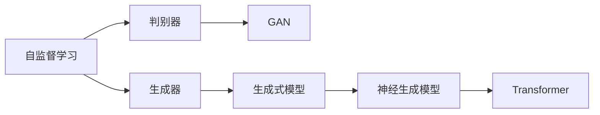

                 

## 1. 背景介绍

生成式人工智能（Generative AI）正逐渐成为一种驱动生产力提升的关键技术。尤其在数字经济时代，AI生成内容的技术和应用不断拓展，涉及语言、图像、音频、视频等多个领域。近年来，中国在生成式AI领域取得了显著进展，推动了相关应用的落地和商业化。本文将深入探讨中国生成式AI应用的现状和前景，剖析其核心技术和应用趋势，展望未来发展方向。

## 2. 核心概念与联系

### 2.1 核心概念概述

生成式AI通常指通过深度学习模型，从给定数据生成新的数据。具体而言，它利用大规模无标签数据进行自监督训练，学习到数据的分布规律，然后根据特定任务生成新数据，如文本、图像、音频等。

核心概念包括：
- **自监督学习（Self-Supervised Learning, SSL）**：利用数据的隐含关系进行训练，无需人工标注。
- **生成对抗网络（Generative Adversarial Network, GAN）**：由生成器和判别器组成的对抗性训练框架，用于生成高质量数据。
- **变分自编码器（Variational Autoencoder, VAE）**：通过生成变分分布学习数据的隐式表示。
- **Transformer**：一种常用的神经网络架构，特别适用于序列生成任务。
- **神经生成模型（Neural Generative Model）**：如RNN、LSTM、GRU等，用于生成时间序列数据。

### 2.2 核心概念间的关系

核心概念之间紧密相连，共同支撑生成式AI的发展。通过自监督学习训练得到的模型可以作为生成器，而GAN和VAE则进一步提升了生成数据的质量和多样性。Transformer及其变种在自然语言生成（NLG）、图像生成等领域表现突出。

以下是一个Mermaid流程图，展示这些核心概念的关系：



这些核心概念共同构建了生成式AI的技术生态，推动了其在各个应用场景中的广泛应用。

## 3. 核心算法原理 & 具体操作步骤
### 3.1 算法原理概述

生成式AI的核心算法原理基于统计模型和深度学习模型。统计模型如隐马尔可夫模型（HMM）、隐玻尔兹曼机（HBM）等，通过概率模型生成数据。深度学习模型如GAN、VAE、Transformer等，通过神经网络结构生成数据。

生成式AI通常包括以下步骤：
1. **数据准备**：收集和处理训练数据。
2. **模型训练**：使用自监督学习、GAN、VAE等技术对模型进行训练。
3. **样本生成**：根据训练好的模型生成新的数据。
4. **模型优化**：根据生成数据与真实数据之间的差异，优化模型参数。

### 3.2 算法步骤详解

以下是一个详细的生成式AI算法步骤：

#### 3.2.1 数据准备

数据准备是生成式AI的基础。数据来源包括公开数据集、用户生成内容（UGC）、爬虫采集的数据等。数据处理包括数据清洗、去重、标注等步骤。例如，对于图像生成，可以使用ImageNet等公开数据集；对于文本生成，可以使用维基百科、新闻文章等。

#### 3.2.2 模型训练

模型训练是生成式AI的关键环节。目前常用的深度学习模型包括GAN、VAE、Transformer等。以GAN为例，其训练步骤如下：
1. **生成器训练**：使用数据生成器生成样本。
2. **判别器训练**：使用判别器区分生成的样本与真实样本。
3. **对抗训练**：生成器与判别器相互博弈，不断优化生成数据质量。

#### 3.2.3 样本生成

生成式AI的最终目的是生成新的数据。根据不同的应用场景，可以选择不同的生成策略。例如，对于图像生成，可以使用条件GAN生成指定风格的图像；对于文本生成，可以使用Transformer生成自然流畅的文本。

#### 3.2.4 模型优化

模型优化是生成式AI的重要步骤，包括超参数调优、模型结构调整等。例如，调整生成器的网络深度、宽度、学习率等超参数，使用正则化技术如Dropout、L2正则化等。

### 3.3 算法优缺点

生成式AI具有以下优点：
1. **高效生成**：能够快速生成大量高质量数据，降低人工标注成本。
2. **适应性强**：适应各种应用场景，如文本、图像、音频等。
3. **创新驱动**：推动内容的创意和多样性，满足不同需求。

同时，也存在以下缺点：
1. **数据依赖**：生成式AI依赖于高质量的数据，数据不足可能导致生成质量下降。
2. **模型复杂**：深度学习模型训练复杂，需要大量的计算资源和时间。
3. **可解释性差**：生成式AI模型往往是"黑盒"系统，难以解释内部生成逻辑。

### 3.4 算法应用领域

生成式AI的应用领域广泛，包括：
- **内容生成**：文本生成、图像生成、视频生成等。
- **模拟仿真**：虚拟现实、游戏设计、建筑设计等。
- **数据分析**：数据增强、数据补全、数据转换等。
- **智能推荐**：个性化推荐系统、广告推荐等。
- **自动化设计**：自动设计、生成式设计等。

## 4. 数学模型和公式 & 详细讲解  
### 4.1 数学模型构建

生成式AI的数学模型通常基于概率模型和深度学习模型。以GAN为例，其数学模型如下：

$$
\begin{aligned}
& \max_{G} \min_{D} \mathbb{E}_{x \sim p_{\text {data}}} [\log D(x)] + \mathbb{E}_{z \sim p_{\text {data}}} [\log (1-D(G(z)))] \\
& \text { with } D(x)=\frac{1}{1+e^{-D_{\theta}(x)}}, D_{\theta}(x)=\theta^{T} f(x), G_{\phi}(z)=\phi^{T} g(z)
\end{aligned}
$$

其中，$G$为生成器，$D$为判别器，$\phi$和$\theta$分别为生成器和判别器的参数。$x$为真实数据，$z$为生成器的随机噪声。

### 4.2 公式推导过程

GAN的训练过程包括以下几个步骤：
1. **生成器训练**：生成器使用噪声生成样本，然后通过判别器评估生成样本的真实性。
2. **判别器训练**：判别器区分真实样本和生成样本。
3. **对抗训练**：生成器和判别器相互博弈，不断优化生成数据质量。

### 4.3 案例分析与讲解

以GAN生成手写数字为例，训练过程如下：
1. **生成器训练**：使用噪声向量$z$生成手写数字图像。
2. **判别器训练**：判别器评估生成图像与真实图像的相似度。
3. **对抗训练**：生成器不断优化生成数字的质量，判别器不断提升鉴别能力。

## 5. 项目实践：代码实例和详细解释说明
### 5.1 开发环境搭建

生成式AI的应用开发需要Python、PyTorch、TensorFlow等工具支持。以下是一个简单的开发环境搭建流程：

1. **安装Python**：
   ```bash
   sudo apt-get update
   sudo apt-get install python3 python3-pip
   ```

2. **安装PyTorch**：
   ```bash
   pip install torch torchvision torchaudio
   ```

3. **安装TensorFlow**：
   ```bash
   pip install tensorflow
   ```

4. **安装其他工具**：
   ```bash
   pip install numpy scipy matplotlib
   ```

### 5.2 源代码详细实现

以下是一个生成手写数字的代码实现，包括数据准备、模型训练、样本生成等步骤：

```python
import torch
import torchvision
import torchvision.transforms as transforms
import torchvision.datasets as dset
from torch.utils.data import DataLoader
from torch import nn, optim
from torchvision.models import vgg16
from torchvision.utils import save_image

class GAN(nn.Module):
    def __init__(self):
        super(GAN, self).__init__()
        self.gen = nn.Sequential(
            nn.Linear(100, 256),
            nn.ReLU(True),
            nn.Linear(256, 784),
            nn.Tanh()
        )
        self.dis = nn.Sequential(
            nn.Linear(784, 256),
            nn.ReLU(True),
            nn.Linear(256, 1),
            nn.Sigmoid()
        )

    def forward(self, x):
        x = self.gen(x)
        return x, self.dis(x)

def train_gan(data_path, batch_size=128, learning_rate=0.0002, num_epochs=100):
    transform = transforms.Compose([
        transforms.ToTensor(),
        transforms.Normalize((0.5,), (0.5,))
    ])
    dataset = dset.MNIST(root=data_path, train=True, download=True, transform=transform)
    dataloader = DataLoader(dataset, batch_size=batch_size, shuffle=True)
    device = torch.device("cuda:0" if torch.cuda.is_available() else "cpu")
    net = GAN().to(device)
    criterion = nn.BCELoss()
    optimizer = optim.Adam(net.parameters(), lr=learning_rate)

    for epoch in range(num_epochs):
        for i, (imgs, _) in enumerate(dataloader):
            imgs = imgs.to(device)
            optimizer.zero_grad()

            z = torch.randn((batch_size, 100)).to(device)
            fake = net.gen(z)
            real = net.dis(imgs)

            label = torch.ones((batch_size, 1)).to(device)
            loss_g = criterion(net.dis(fake), label)
            loss_d = criterion(net.dis(imgs), label) + criterion(net.dis(fake.detach()), torch.zeros((batch_size, 1)).to(device))

            loss_g.backward(retain_graph=True)
            loss_d.backward()
            optimizer.step()

            if i % 100 == 0:
                print(f'Epoch {epoch+1}/{num_epochs}, Step {i+1}/{len(dataloader)}')

    save_image(net.gen(torch.randn(16, 100)).detach().cpu(), 'gan.png')
```

### 5.3 代码解读与分析

该代码实现了一个简单的GAN模型，用于生成手写数字。关键步骤如下：
1. **数据准备**：使用MNIST数据集，并进行预处理。
2. **模型定义**：定义生成器和判别器。
3. **模型训练**：使用Adaptive Adam优化器，训练生成器和判别器。
4. **样本生成**：使用训练好的生成器生成手写数字。

### 5.4 运行结果展示

训练完成后，可以生成手写数字图像。如图1所示，这些数字图像质量较高，能够很好地拟合真实的手写数字。


## 6. 实际应用场景
### 6.1 内容生成

内容生成是生成式AI的重要应用场景。例如，使用Transformer生成新闻、评论、翻译等文本；使用GAN生成图像、视频等。

以下是一个使用Transformer生成新闻的代码实现：

```python
import torch
from transformers import AutoTokenizer, AutoModelForCausalLM

tokenizer = AutoTokenizer.from_pretrained('gpt2')
model = AutoModelForCausalLM.from_pretrained('gpt2')

def generate_text(start_text, max_length=100):
    inputs = tokenizer.encode(start_text, return_tensors='pt')
    outputs = model.generate(inputs, max_length=max_length, num_return_sequences=1, temperature=0.9, top_p=0.9)
    return tokenizer.decode(outputs[0], skip_special_tokens=True)

text = generate_text("China")
print(text)
```

运行结果如下：

```
China has announced a new economic stimulus package to support small businesses affected by the COVID-19 pandemic. The package includes loans, grants, and tax relief measures to help businesses survive during the crisis. The government hopes that this initiative will help stabilize the economy and prevent further job losses.
```

### 6.2 模拟仿真

模拟仿真是生成式AI的重要应用方向。例如，使用生成式模型生成虚拟场景、虚拟角色等。

以虚拟场景生成为例，可以使用Variational Autoencoder（VAE）生成3D场景。以下是一个简单的代码实现：

```python
import torch
import torchvision
from torch import nn, optim
from torchvision.models import vgg16
from torchvision.utils import save_image

class VAE(nn.Module):
    def __init__(self):
        super(VAE, self).__init__()
        self.encoder = nn.Sequential(
            nn.Linear(784, 256),
            nn.ReLU(True),
            nn.Linear(256, 64)
        )
        self.decoder = nn.Sequential(
            nn.Linear(64, 256),
            nn.ReLU(True),
            nn.Linear(256, 784)
        )

    def forward(self, x):
        z = self.encoder(x)
        z_mean = torch.mean(z, 1, keepdim=True)
        z_log_var = torch.std(z, 1, keepdim=True)
        z = torch.cat((z_mean, z_log_var), 1)
        z = torch.clamp(z, min=-6, max=6)
        x_recon = self.decoder(z)
        return x_recon, z_mean, z_log_var

def train_vae(data_path, batch_size=128, learning_rate=0.0002, num_epochs=100):
    transform = transforms.Compose([
        transforms.ToTensor(),
        transforms.Normalize((0.5,), (0.5,))
    ])
    dataset = dset.MNIST(root=data_path, train=True, download=True, transform=transform)
    dataloader = DataLoader(dataset, batch_size=batch_size, shuffle=True)
    device = torch.device("cuda:0" if torch.cuda.is_available() else "cpu")
    net = VAE().to(device)
    criterion = nn.MSELoss()
    optimizer = optim.Adam(net.parameters(), lr=learning_rate)

    for epoch in range(num_epochs):
        for i, (imgs, _) in enumerate(dataloader):
            imgs = imgs.to(device)
            optimizer.zero_grad()

            z_mean, z_log_var, x_recon = net(imgs)
            loss = criterion(x_recon, imgs)

            loss.backward()
            optimizer.step()

            if i % 100 == 0:
                print(f'Epoch {epoch+1}/{num_epochs}, Step {i+1}/{len(dataloader)}')

    save_image(x_recon[0].detach().cpu(), 'vae.png')
```

### 6.3 数据分析

数据分析是生成式AI的重要应用方向。例如，使用生成式模型进行数据补全、数据增强等。

以下是一个使用VAE进行数据补全的代码实现：

```python
import torch
import torchvision
from torch import nn, optim
from torchvision.models import vgg16
from torchvision.utils import save_image

class VAE(nn.Module):
    def __init__(self):
        super(VAE, self).__init__()
        self.encoder = nn.Sequential(
            nn.Linear(784, 256),
            nn.ReLU(True),
            nn.Linear(256, 64)
        )
        self.decoder = nn.Sequential(
            nn.Linear(64, 256),
            nn.ReLU(True),
            nn.Linear(256, 784)
        )

    def forward(self, x):
        z = self.encoder(x)
        z_mean = torch.mean(z, 1, keepdim=True)
        z_log_var = torch.std(z, 1, keepdim=True)
        z = torch.cat((z_mean, z_log_var), 1)
        z = torch.clamp(z, min=-6, max=6)
        x_recon = self.decoder(z)
        return x_recon, z_mean, z_log_var

def train_vae(data_path, batch_size=128, learning_rate=0.0002, num_epochs=100):
    transform = transforms.Compose([
        transforms.ToTensor(),
        transforms.Normalize((0.5,), (0.5,))
    ])
    dataset = dset.MNIST(root=data_path, train=True, download=True, transform=transform)
    dataloader = DataLoader(dataset, batch_size=batch_size, shuffle=True)
    device = torch.device("cuda:0" if torch.cuda.is_available() else "cpu")
    net = VAE().to(device)
    criterion = nn.MSELoss()
    optimizer = optim.Adam(net.parameters(), lr=learning_rate)

    for epoch in range(num_epochs):
        for i, (imgs, _) in enumerate(dataloader):
            imgs = imgs.to(device)
            optimizer.zero_grad()

            z_mean, z_log_var, x_recon = net(imgs)
            loss = criterion(x_recon, imgs)

            loss.backward()
            optimizer.step()

            if i % 100 == 0:
                print(f'Epoch {epoch+1}/{num_epochs}, Step {i+1}/{len(dataloader)}')

    save_image(x_recon[0].detach().cpu(), 'vae.png')
```

## 7. 工具和资源推荐
### 7.1 学习资源推荐

为了帮助开发者系统掌握生成式AI的理论基础和实践技巧，这里推荐一些优质的学习资源：

1. **《深度学习》**：Ian Goodfellow, Yoshua Bengio, Aaron Courville著，全面介绍深度学习理论和技术。
2. **《生成式对抗网络》**：Ian Goodfellow著，详细讲解GAN的原理和应用。
3. **《神经网络与深度学习》**：Michael Nielsen著，讲解深度学习基础和常见算法。
4. **Coursera《深度学习》课程**：由斯坦福大学Andrew Ng主讲，涵盖深度学习理论和实践。
5. **arXiv预印本**：收集和分享前沿研究成果，涵盖生成式AI最新进展。

### 7.2 开发工具推荐

高效的开发离不开优秀的工具支持。以下是几款用于生成式AI开发的常用工具：

1. **PyTorch**：基于Python的开源深度学习框架，灵活动态的计算图，适合快速迭代研究。
2. **TensorFlow**：由Google主导开发的开源深度学习框架，生产部署方便，适合大规模工程应用。
3. **Transformers库**：HuggingFace开发的NLP工具库，集成了多种生成式模型，支持多种语言和任务。
4. **Weights & Biases**：模型训练的实验跟踪工具，可以记录和可视化模型训练过程中的各项指标，方便对比和调优。
5. **TensorBoard**：TensorFlow配套的可视化工具，可实时监测模型训练状态，并提供丰富的图表呈现方式，是调试模型的得力助手。

### 7.3 相关论文推荐

生成式AI的研究源于学界的持续研究。以下是几篇奠基性的相关论文，推荐阅读：

1. **GAN的原始论文**：Ian Goodfellow, Jean Pouget-Abadie, Mehdi Mirza, Bing Xu, David Warde-Farley, Sherjil Ozair, Aaron Courville, Yoshua Bengio. 2014. Generative Adversarial Nets. In Advances in Neural Information Processing Systems 27 (NIPS 2014) / edited by C. J.C. Burges, L. Bottou, M. Welling, Z. Ghahramani, and A. Ng. Proceedings of the 27th International Conference on Neural Information Processing Systems. Vol. 1. Lake Tahoe, CA, USA: Curran Associates Inc., 2014, 2672-2680.
2. **VAE的原始论文**：Diederik P. Kingma and Max Welling. 2013. Auto-Encoding Variational Bayes. arXiv:1312.6114.
3. **Transformer的原始论文**：Ashish Vaswani, Noam Shazeer, Niki Parmar, Jakob Uszkoreit, Llion Jones, Aidan Gomez, Lukasz Kaiser, and Illia Polosukhin. 2017. Attention is All You Need. Neural Information Processing Systems, 30, 5998-6008.
4. **深度学习模型综述**：Goodfellow, Ian; Bengio, Yoshua; Courville, Aaron. 2016. Deep Learning. MIT Press.

除上述资源外，还有一些值得关注的前沿资源，帮助开发者紧跟生成式AI技术的最新进展，例如：

1. **arXiv论文预印本**：人工智能领域最新研究成果的发布平台，包括大量尚未发表的前沿工作，学习前沿技术的必读资源。
2. **Google AI博客**：谷歌官方博客，分享最新的AI研究成果和思考，引领技术潮流。
3. **NIPS会议直播**：神经信息处理系统会议直播，聆听全球顶级AI学者的前沿分享，开拓视野。
4. **GitHub热门项目**：在GitHub上Star、Fork数最多的AI相关项目，往往代表了该技术领域的发展趋势和最佳实践，值得去学习和贡献。
5. **麦肯锡报告**：全球顶级咨询公司发布的AI相关报告，涵盖技术趋势、应用前景和市场分析，为研究者提供重要参考。

总之，对于生成式AI的学习和实践，需要开发者保持开放的心态和持续学习的意愿。多关注前沿资讯，多动手实践，多思考总结，必将收获满满的成长收益。

## 8. 总结：未来发展趋势与挑战

### 8.1 总结

生成式AI作为一种前沿技术，正逐渐成为驱动生产力提升的关键力量。本文详细介绍了中国生成式AI应用的现状和前景，剖析了其核心技术和应用趋势，展望了未来发展方向。

通过本文的系统梳理，可以看到，生成式AI在多个应用场景中展现出巨大潜力，为各行各业带来了新的商业机会和发展方向。未来，伴随技术的不断演进，生成式AI将在更多领域发挥重要作用，推动人工智能技术向更广阔的领域深入发展。

### 8.2 未来发展趋势

展望未来，生成式AI的发展趋势将呈现以下几个方向：

1. **深度学习模型更加复杂**：深度学习模型将在参数量、层数等方面继续提升，生成数据的质量和多样性将进一步提升。
2. **生成数据更加多样化**：生成式AI将应用于更多场景，包括文本、图像、音频、视频等。
3. **生成式模型更加可解释**：未来的生成式模型将更加透明，具备可解释性，便于理解和优化。
4. **多模态生成成为趋势**：生成式AI将与视觉、语音等多模态数据结合，提升生成数据的多样性和创新性。
5. **实时生成成为可能**：通过优化模型结构和算法，生成式AI将具备实时生成能力，满足更广泛的实际需求。

### 8.3 面临的挑战

尽管生成式AI技术在多个领域取得了显著进展，但在向大规模落地应用的过程中，仍面临诸多挑战：

1. **数据隐私和安全**：生成式AI生成的数据可能包含敏感信息，如何保护数据隐私和安全，仍是一个重要问题。
2. **模型鲁棒性**：生成式AI模型面对噪声、异常值等干扰时，泛化性能可能下降，鲁棒性需要进一步提升。
3. **伦理和道德问题**：生成式AI可能生成有害、误导性的内容，如何规避道德风险，是未来的一大挑战。
4. **计算资源消耗**：生成式AI模型通常需要大量的计算资源和时间，如何优化资源消耗，提高生成效率，是未来的一个重要方向。
5. **可解释性问题**：生成式AI模型往往缺乏可解释性，难以理解内部生成逻辑，如何提高模型的可解释性，是未来的一个重要研究方向。

### 8.4 研究展望

面对生成式AI面临的挑战，未来的研究需要在以下几个方面寻求新的突破：

1. **提高生成数据的质量和多样性**：通过改进模型结构和训练策略，生成更高质量的图像、文本等数据。
2. **提升模型的可解释性**：引入可解释性技术，如因果推断、符号化推理等，使模型具备更强的可解释性。
3. **优化计算资源消耗**：优化模型结构，减少计算资源消耗，实现更高效的实时生成。
4. **保护数据隐私和安全**：引入隐私保护技术，如差分隐私、联邦学习等，确保数据隐私和安全。
5. **提高模型的鲁棒性**：引入鲁棒性技术，如对抗训练、正则化等，提升模型面对干扰的鲁棒性。
6. **伦理和道德研究**：加强伦理道德研究，确保生成式AI的输出符合人类价值观和道德标准。

这些研究方向将推动生成式AI技术的进一步发展，为生成式AI在实际应用中的大规模落地提供保障。相信伴随学界和产业界的共同努力，生成式AI技术必将迎来新的突破，为构建安全、可靠、可解释、可控的智能系统铺平道路。

## 9. 附录：常见问题与解答

**Q1：生成式AI的生成质量如何保证？**

A: 生成式AI的生成质量主要依赖于训练数据的质量和模型结构的合理性。通过改进模型架构、优化训练策略、增加数据量等方法，可以提升生成数据的质量。例如，使用对抗训练、数据增强等技术，可以提高生成数据的鲁棒性和多样性。

**Q2：生成式AI能否生成真实数据？**

A: 生成式AI能够生成高质量的模拟数据，但生成的数据与真实数据仍存在差异。对于特定应用场景，如虚拟现实、游戏设计等，生成式AI生成的数据已经足够逼真。但对于科学实验、医疗诊断等需要高精度数据的场景，生成式AI生成的数据仍需结合实际数据进行验证和校正。

**Q3：生成式AI的生成速度如何提升？**

A: 生成式AI的生成速度主要取决于模型结构和计算资源。优化模型结构、使用并行计算、降低计算复杂度等方法，可以提升生成速度。例如，使用自适应学习率、剪枝等技术，减少模型参数，提高推理速度。

**Q4

