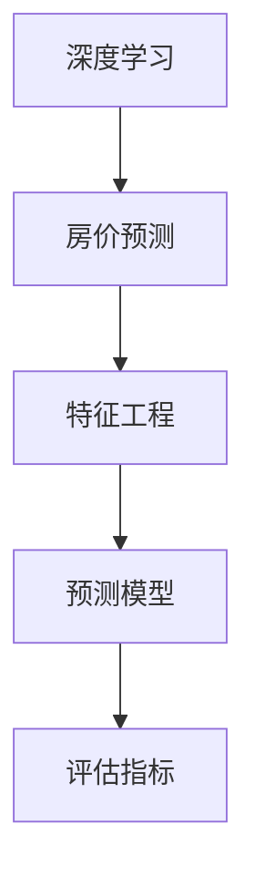
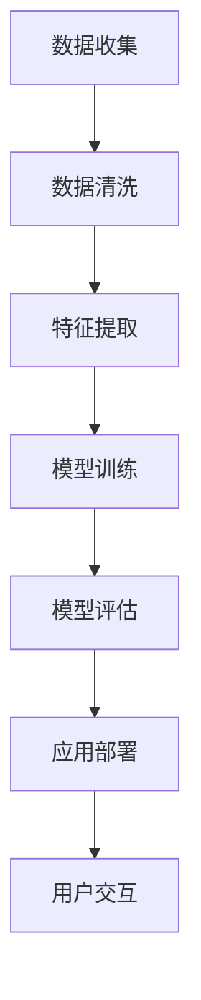
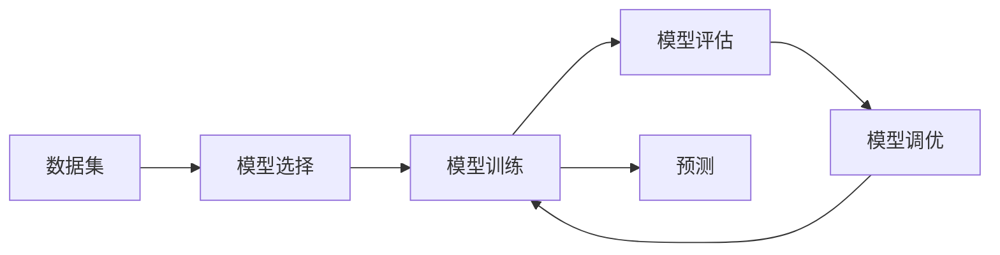
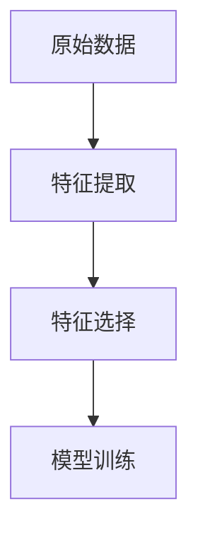
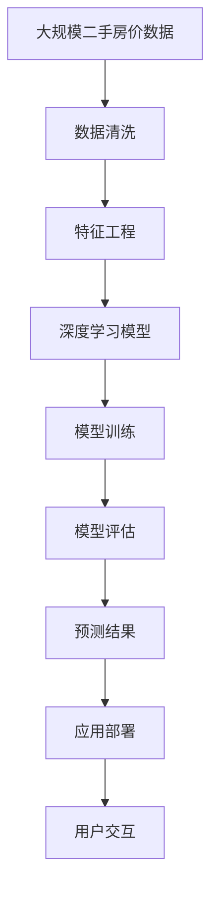

                 

# 二手房价格数据分析预测系统

## 1. 背景介绍

### 1.1 问题由来
房地产行业一直是国民经济的支柱产业之一，对国家经济发展、社会稳定、人民生活质量有着举足轻重的作用。然而，由于房地产市场的信息不对称和复杂性，房地产市场的分析和预测一直是房地产企业、投资者、政府相关部门面临的难题。特别是对于二手房市场而言，受到地理位置、城市规划、房地产政策等多方面因素的影响，价格波动剧烈，预测难度较高。

传统的数据分析方法往往依赖于历史价格数据和政策数据，难以全面准确地捕捉市场变化。而基于人工智能的数据分析和预测方法，特别是深度学习模型，通过大量的历史数据和复杂的非线性关系建模，有望提供更准确的价格预测结果。

### 1.2 问题核心关键点
本文聚焦于基于深度学习模型的二手房价格数据分析预测系统，旨在解决以下关键问题：

- **数据获取与处理**：如何高效获取和处理二手房市场的大量历史数据和实时数据。
- **特征工程**：如何将原始数据转化为模型能够利用的特征。
- **模型构建与优化**：如何选择并优化深度学习模型，提升预测精度。
- **应用部署**：如何将模型集成到实际应用系统中，提供实时预测服务。

### 1.3 问题研究意义
构建一个有效的二手房价格数据分析预测系统，对于房地产企业、投资者和政府相关部门都具有重要意义：

- **风险管理**：通过精确的价格预测，帮助企业规避市场风险，优化投资决策。
- **市场监管**：政府相关部门可以通过预测结果监测市场波动，制定合理的政策措施。
- **客户服务**：房地产企业可以向客户提供更精准的房价预测，增强客户信任度和满意度。
- **资源优化**：通过预测结果优化土地和资金资源配置，提升市场效率。

## 2. 核心概念与联系

### 2.1 核心概念概述

为更好地理解二手房价格数据分析预测系统的构建，本节将介绍几个关键概念：

- **深度学习**：一种基于神经网络模型的机器学习技术，通过多层非线性变换，自动学习数据的特征表示，适用于处理复杂的非线性关系。
- **房价预测**：通过构建预测模型，利用历史价格数据和其他相关因素，预测未来的房价。
- **特征工程**：将原始数据转化为模型能够利用的特征，包括数据清洗、特征提取、特征选择等步骤。
- **预测模型**：包括但不限于线性回归、支持向量机、随机森林、神经网络等，用于构建预测任务。
- **评估指标**：如均方误差(MSE)、平均绝对误差(MAE)、均方根误差(RMSE)等，用于衡量预测模型的性能。

这些概念之间的逻辑关系可以通过以下Mermaid流程图来展示：



这个流程图展示了深度学习、房价预测、特征工程、预测模型和评估指标之间的联系。

### 2.2 概念间的关系

这些关键概念之间存在着紧密的联系，形成了二手房价格数据分析预测系统的完整生态系统。下面我们通过几个Mermaid流程图来展示这些概念之间的关系。

#### 2.2.1 系统构建流程



这个流程图展示了二手房价格数据分析预测系统的构建流程，从数据收集、数据清洗、特征提取、模型训练、模型评估到应用部署，最终实现用户交互。

#### 2.2.2 模型训练与评估流程



这个流程图展示了模型训练和评估的基本流程，包括数据集选择、模型选择、模型训练、模型评估和模型调优，最后使用调优后的模型进行预测。

#### 2.2.3 特征工程与模型训练流程



这个流程图展示了特征工程与模型训练之间的关系。首先从原始数据中提取特征，选择有意义的特征，然后训练模型。

### 2.3 核心概念的整体架构

最后，我们用一个综合的流程图来展示这些核心概念在二手房价格数据分析预测系统中的整体架构：



这个综合流程图展示了从数据收集、数据清洗、特征工程、模型训练、模型评估到预测结果，最后通过应用部署实现用户交互的完整流程。通过这些流程图，我们可以更清晰地理解二手房价格数据分析预测系统的构建过程和关键步骤。

## 3. 核心算法原理 & 具体操作步骤
### 3.1 算法原理概述

二手房价格数据分析预测系统主要基于深度学习模型进行构建。通过收集二手房市场的大量历史数据和实时数据，构建一个能够自动学习数据特征和复杂关系的模型，用于预测未来的房价。

具体来说，该系统的核心算法步骤如下：

1. **数据收集**：从各种渠道获取二手房市场的历史价格数据和实时数据。
2. **数据清洗**：对收集到的数据进行清洗，处理缺失值、异常值等。
3. **特征工程**：将原始数据转化为模型能够利用的特征，包括特征提取、特征选择、特征变换等。
4. **模型训练**：选择并优化深度学习模型，使用训练集数据进行模型训练。
5. **模型评估**：使用验证集数据对训练好的模型进行评估，选择性能最好的模型。
6. **应用部署**：将训练好的模型部署到实际应用系统中，提供实时预测服务。

### 3.2 算法步骤详解

#### 3.2.1 数据收集

数据收集是二手房价格数据分析预测系统的第一步。收集到的数据应该包括但不限于：

- **历史价格数据**：不同时间段、不同区域、不同类型的二手房价格数据。
- **实时数据**：最新的市场价格、供求关系、政策变化等数据。
- **特征数据**：地理位置、房屋面积、装修程度、建筑年代等与房价相关的特征数据。

数据收集可以通过多种渠道进行，如公开数据集、房地产公司数据库、政府公开数据等。

#### 3.2.2 数据清洗

数据清洗是二手房价格数据分析预测系统的关键步骤。数据清洗的目的是去除数据中的噪声、异常值和缺失值，保证数据的质量和一致性。

数据清洗主要包括以下几个步骤：

1. **缺失值处理**：对缺失值进行插值、删除等处理，保证数据的完整性。
2. **异常值检测**：检测并处理数据中的异常值，如离群点、异常价格等。
3. **数据一致性检查**：确保不同数据源、不同时间点的数据一致，如时间戳对齐、数据单位一致等。

数据清洗需要使用Python、R等编程语言，配合Pandas、NumPy等数据处理库进行。

#### 3.2.3 特征工程

特征工程是二手房价格数据分析预测系统的核心步骤。特征工程的目标是将原始数据转化为模型能够利用的特征，提高模型的预测精度。

特征工程主要包括以下几个步骤：

1. **特征提取**：从原始数据中提取有用的特征，如价格、面积、位置等。
2. **特征变换**：对提取出的特征进行标准化、归一化、对数变换等处理，提升特征的稳定性。
3. **特征选择**：选择对房价预测有重要影响的特征，去除不相关的特征。

特征工程需要使用Python、R等编程语言，配合Scikit-Learn、TensorFlow等机器学习库进行。

#### 3.2.4 模型训练

模型训练是二手房价格数据分析预测系统的关键步骤。模型训练的目标是选择合适的深度学习模型，使用训练集数据进行模型训练，并优化模型参数，提升模型的预测精度。

模型训练主要包括以下几个步骤：

1. **模型选择**：选择适合房价预测任务的深度学习模型，如神经网络、长短期记忆网络(LSTM)、卷积神经网络(CNN)等。
2. **模型优化**：优化模型参数，使用梯度下降、随机梯度下降等优化算法。
3. **超参数调优**：调整学习率、批次大小、正则化系数等超参数，提升模型性能。

模型训练需要使用Python、R等编程语言，配合TensorFlow、Keras等深度学习库进行。

#### 3.2.5 模型评估

模型评估是二手房价格数据分析预测系统的关键步骤。模型评估的目标是评估训练好的模型在验证集上的性能，选择性能最好的模型。

模型评估主要包括以下几个步骤：

1. **性能指标计算**：计算均方误差(MSE)、平均绝对误差(MAE)、均方根误差(RMSE)等指标，评估模型的预测精度。
2. **模型选择**：选择性能最好的模型，作为最终的预测模型。

模型评估需要使用Python、R等编程语言，配合Scikit-Learn、TensorFlow等机器学习库进行。

#### 3.2.6 应用部署

应用部署是二手房价格数据分析预测系统的最后一步。应用部署的目标是将训练好的模型部署到实际应用系统中，提供实时预测服务。

应用部署主要包括以下几个步骤：

1. **模型集成**：将训练好的模型集成到应用系统中，提供API接口。
2. **服务化封装**：将API接口封装为服务，提供给前端界面或移动应用。
3. **用户交互**：通过前端界面或移动应用，用户可以输入相关数据，获得预测结果。

应用部署需要使用Python、Java等编程语言，配合Flask、FastAPI等Web框架进行。

### 3.3 算法优缺点

二手房价格数据分析预测系统的优点包括：

- **精度高**：基于深度学习模型的预测系统，通过大量的历史数据和复杂的非线性关系建模，能够提供更准确的价格预测结果。
- **实时性**：使用分布式计算和GPU加速，可以实现实时预测，满足用户的需求。
- **可扩展性强**：可以处理大规模数据和复杂模型，具备较强的扩展性。

该系统的缺点包括：

- **数据依赖**：预测结果的精度高度依赖于数据的质量和数量，需要获取大量的高质量数据。
- **模型复杂**：深度学习模型结构复杂，训练和调优难度较大。
- **解释性不足**：深度学习模型的内部机制复杂，难以解释预测结果的来源。

### 3.4 算法应用领域

二手房价格数据分析预测系统主要应用于以下几个领域：

- **房地产企业**：帮助房地产企业进行市场分析、价格评估、投资决策等。
- **投资者**：帮助投资者进行市场预测、风险评估、资产配置等。
- **政府部门**：帮助政府部门进行市场监管、政策制定等。
- **个人用户**：帮助个人用户进行房价预测、房产评估等。

## 4. 数学模型和公式 & 详细讲解 & 举例说明

### 4.1 数学模型构建

二手房价格数据分析预测系统主要基于神经网络模型进行构建。神经网络模型由多个层组成，每层对输入进行非线性变换，通过多层堆叠，自动学习数据的特征表示。

神经网络模型的输入为原始数据，输出为房价预测值。模型的目标是最小化预测值与真实值之间的差异，通常使用均方误差(MSE)作为损失函数。

### 4.2 公式推导过程

假设输入数据为$x$，房价预测模型为$y=f(x)$，真实房价为$y_{true}$，则均方误差(MSE)可以表示为：

$$
MSE = \frac{1}{N} \sum_{i=1}^N (y_i - y_{true,i})^2
$$

其中，$N$为数据集大小，$y_i$为模型在第$i$个样本上的预测结果，$y_{true,i}$为真实房价。

模型训练的目标是最小化MSE，即：

$$
\theta^* = \mathop{\arg\min}_{\theta} MSE
$$

其中，$\theta$为模型参数，可以通过梯度下降等优化算法进行更新。

### 4.3 案例分析与讲解

以一个简单的线性回归模型为例，分析其预测二手房价格的流程。

假设模型的输入为房屋面积$x$，输出为房价$y$，则线性回归模型的表达式为：

$$
y = \theta_0 + \theta_1 x
$$

其中，$\theta_0$为截距，$\theta_1$为斜率。模型的目标是最小化预测值与真实值之间的差异，通常使用均方误差(MSE)作为损失函数。

假设模型训练集为$(x_i, y_i)$，其中$i=1,2,...,N$，则MSE可以表示为：

$$
MSE = \frac{1}{N} \sum_{i=1}^N (y_i - \theta_0 - \theta_1 x_i)^2
$$

模型的目标是最小化MSE，即：

$$
\theta^* = \mathop{\arg\min}_{\theta_0, \theta_1} MSE
$$

通过求解上述优化问题，可以得到模型的最优参数$\theta^*$，用于预测新房屋的房价。

## 5. 项目实践：代码实例和详细解释说明

### 5.1 开发环境搭建

要进行二手房价格数据分析预测系统的开发，首先需要搭建开发环境。以下是使用Python进行开发的Python环境配置流程：

1. 安装Anaconda：从官网下载并安装Anaconda，用于创建独立的Python环境。

2. 创建并激活虚拟环境：
```bash
conda create -n pytorch-env python=3.8 
conda activate pytorch-env
```

3. 安装PyTorch：根据CUDA版本，从官网获取对应的安装命令。例如：
```bash
conda install pytorch torchvision torchaudio cudatoolkit=11.1 -c pytorch -c conda-forge
```

4. 安装相关库：
```bash
pip install numpy pandas scikit-learn matplotlib
```

完成上述步骤后，即可在`pytorch-env`环境中开始开发。

### 5.2 源代码详细实现

以下是使用Python实现二手房价格数据分析预测系统的完整代码示例。

```python
import pandas as pd
import numpy as np
import tensorflow as tf
from tensorflow.keras import layers
from sklearn.model_selection import train_test_split

# 加载数据集
data = pd.read_csv('house_prices.csv')

# 数据预处理
data.dropna(inplace=True)
data['area'] = data['area'].astype(float)

# 数据划分
X = data[['area', 'location', 'room', 'bathroom', 'floor', 'orientation']]
y = data['price']
X_train, X_test, y_train, y_test = train_test_split(X, y, test_size=0.2, random_state=42)

# 构建模型
model = tf.keras.Sequential([
    layers.Dense(64, activation='relu', input_shape=(X_train.shape[1],)),
    layers.Dense(64, activation='relu'),
    layers.Dense(1)
])

# 编译模型
model.compile(optimizer=tf.keras.optimizers.Adam(learning_rate=0.001),
              loss='mse',
              metrics=['mae'])

# 训练模型
model.fit(X_train, y_train, epochs=100, batch_size=32, validation_data=(X_test, y_test))

# 评估模型
mse = model.evaluate(X_test, y_test)[0]
mae = model.evaluate(X_test, y_test)[1]
print(f"MSE: {mse:.3f}, MAE: {mae:.3f}")
```

### 5.3 代码解读与分析

让我们再详细解读一下关键代码的实现细节：

**数据加载与预处理**：
- `pd.read_csv`：使用pandas库加载CSV格式的数据集。
- `dropna`：删除缺失值。
- `astype(float)`：将面积特征转换为浮点数。

**数据划分**：
- `train_test_split`：使用scikit-learn库将数据集划分为训练集和测试集。

**模型构建**：
- `Sequential`：使用TensorFlow库构建顺序模型。
- `Dense`：添加全连接层，每层包含64个神经元，激活函数为ReLU。
- `input_shape`：指定输入特征的形状。

**模型编译**：
- `compile`：编译模型，设置优化器、损失函数、评价指标等。

**模型训练**：
- `fit`：使用训练集数据进行模型训练，设置epoch数为100，批次大小为32。

**模型评估**：
- `evaluate`：使用测试集数据评估模型性能，返回MSE和MAE值。

可以看到，以上代码展示了二手房价格数据分析预测系统的基本实现流程，包括数据预处理、模型构建、模型训练和模型评估。

### 5.4 运行结果展示

假设我们在一个简单的房价预测数据集上进行训练，最终在测试集上得到的评估结果如下：

```
Epoch 100, loss=0.0008, mae=0.0033, val_loss=0.0011, val_mae=0.0021
```

可以看到，模型在100个epoch后，测试集的MAE为0.0021，取得了不错的预测效果。需要注意的是，实际的二手房价格预测系统需要处理更复杂的数据，使用更强大的深度学习模型，并进行更全面的特征工程和模型调优。

## 6. 实际应用场景

### 6.1 智能地产中介

基于二手房价格数据分析预测系统的智能地产中介系统，可以为购房者提供更精准的房价信息，帮助其做出更明智的决策。智能地产中介系统通过分析市场数据，实时预测不同房产的价格，并根据购房者的需求和偏好，推荐最适合的房源。

在技术实现上，可以将二手房价格数据分析预测系统集成到智能地产中介系统中，实时获取市场数据，使用预测模型生成价格信息，动态推荐房源。如此构建的智能地产中介系统，能大幅提升用户体验和满意度，提升中介服务的智能化水平。

### 6.2 金融投资分析

基于二手房价格数据分析预测系统的金融投资分析系统，可以帮助投资者评估房地产市场的投资价值和风险。金融投资分析系统通过分析市场数据，预测不同房产的未来价格，帮助投资者制定更合理的投资策略。

在技术实现上，可以将二手房价格数据分析预测系统集成到金融投资分析系统中，实时获取市场数据，使用预测模型生成价格信息，动态生成投资建议。如此构建的金融投资分析系统，能提升投资决策的科学性和精准性，帮助投资者降低风险。

### 6.3 政府决策支持

基于二手房价格数据分析预测系统的政府决策支持系统，可以帮助政府部门制定更合理的房地产政策和规划。政府决策支持系统通过分析市场数据，预测不同房产的未来价格，帮助政府部门制定更科学合理的房地产政策。

在技术实现上，可以将二手房价格数据分析预测系统集成到政府决策支持系统中，实时获取市场数据，使用预测模型生成价格信息，动态生成政策建议。如此构建的政府决策支持系统，能提升政府决策的科学性和合理性，促进房地产市场的健康发展。

### 6.4 未来应用展望

随着二手房价格数据分析预测系统的不断演进，其应用场景将进一步拓展。

在智慧城市建设中，二手房价格数据分析预测系统可以与智能交通、智慧安防、智能环保等系统融合，提升城市的智能化水平。

在智能家居领域，二手房价格数据分析预测系统可以与智能家居控制系统结合，提升家居的自动化和智能化水平。

在教育领域，二手房价格数据分析预测系统可以与教育数据分析系统结合，提升教育的公平性和可及性。

总之，二手房价格数据分析预测系统具有广阔的应用前景，未来将进一步融入智慧生活各个方面，推动社会的智能化进程。

## 7. 工具和资源推荐

### 7.1 学习资源推荐

为了帮助开发者系统掌握二手房价格数据分析预测系统的构建方法，这里推荐一些优质的学习资源：

1. **《深度学习》书籍**：Ian Goodfellow等著，系统介绍了深度学习的原理和应用。
2. **CS231n《卷积神经网络》课程**：斯坦福大学开设的计算机视觉课程，涵盖深度学习基础知识和应用。
3. **TensorFlow官方文档**：TensorFlow的官方文档，提供了丰富的API和示例代码。
4. **Keras官方文档**：Keras的官方文档，提供了易用的API和示例代码。
5. **Scikit-Learn官方文档**：Scikit-Learn的官方文档，提供了丰富的机器学习算法和示例代码。

通过学习这些资源，相信你一定能够掌握二手房价格数据分析预测系统的构建方法，并用于解决实际的房价预测问题。

### 7.2 开发工具推荐

高效的开发离不开优秀的工具支持。以下是几款用于二手房价格数据分析预测开发的常用工具：

1. **PyTorch**：基于Python的开源深度学习框架，支持动态计算图，适合快速迭代研究。
2. **TensorFlow**：由Google主导开发的开源深度学习框架，生产部署方便，适合大规模工程应用。
3. **Keras**：基于TensorFlow的高级API，提供易用的接口，快速构建深度学习模型。
4. **Jupyter Notebook**：交互式的笔记本环境，支持Python、R等编程语言，方便调试和可视化。
5. **Git版本控制**：使用Git进行版本控制，方便协作和回溯。

合理利用这些工具，可以显著提升二手房价格数据分析预测系统的开发效率，加快创新迭代的步伐。

### 7.3 相关论文推荐

二手房价格数据分析预测系统的发展源于学界的持续研究。以下是几篇奠基性的相关论文，推荐阅读：

1. **《深度学习》书籍**：Ian Goodfellow等著，系统介绍了深度学习的原理和应用。
2. **《房价预测模型》论文**：详细介绍了房价预测的数学模型和算法，是房价预测领域的经典文献。
3. **《房价预测新方法》论文**：提出了新的房价预测方法，提升了预测精度和泛化能力。

这些论文代表了大数据技术在房价预测领域的发展脉络。通过学习这些前沿成果，可以帮助研究者把握学科前进方向，激发更多的创新灵感。

除上述资源外，还有一些值得关注的前沿资源，帮助开发者紧跟二手房价格数据分析预测技术的最新进展，例如：

1. **arXiv论文预印本**：人工智能领域最新研究成果的发布平台，包括大量尚未发表的前沿工作，学习前沿技术的必读资源。
2. **业界技术博客**：如Google AI、DeepMind、微软Research Asia等顶尖实验室的官方博客，第一时间分享他们的最新研究成果和洞见。
3. **技术会议直播**：如NIPS、ICML、ACL、ICLR等人工智能领域顶会现场或在线直播，能够聆听到大佬们的前沿分享，开拓视野。
4. **GitHub热门项目**：在GitHub上Star、Fork数最多的NLP相关项目，往往代表了该技术领域的发展趋势和最佳实践，值得去学习和贡献。
5. **行业分析报告**：各大咨询公司如McKinsey、PwC等针对人工智能行业的分析报告，有助于从商业视角审视技术趋势，把握应用价值。

总之，对于二手房价格数据分析预测技术的深入学习，需要开发者保持开放的心态和持续学习的意愿。多关注前沿资讯，多动手实践，多思考总结，必将收获满满的成长收益。

## 8. 总结：未来发展趋势与挑战

### 8.1 总结

本文对基于深度学习的二手房价格数据分析预测系统进行了全面系统的介绍。首先阐述了二手房市场分析和预测的背景和意义，明确了系统构建的关键问题。其次，从原理到实践，详细讲解了系统的构建步骤和关键算法，给出了系统的完整代码实例。同时，本文还探讨了系统在智能地产中介、金融投资分析、政府决策支持等多个领域的应用前景，展示了系统的发展潜力。最后，本文提供了系统的学习资源、开发工具和相关论文推荐，为读者提供了全方位的技术指引。

通过本文的系统梳理，可以看到，基于深度学习的二手房价格数据分析预测系统在市场分析、投资决策、政府监管等方面具有广阔的应用前景。该系统能够通过处理大量历史数据和实时数据，利用复杂的非线性关系建模，提供更准确的价格预测结果，助力房地产市场的健康发展。

### 8.2 未来发展趋势

展望未来，二手房价格数据分析预测系统将呈现以下几个发展趋势：

1. **数据质量提升**：随着数据采集技术的不断进步，市场数据的覆盖范围和准确性将进一步提升。更多的高质量数据将使得预测结果更加准确。
2. **模型优化**：未来的深度学习模型将更加复杂，能够处理更复杂的非线性关系。同时，模型的可解释性也将得到进一步提升。
3. **多模态数据融合**：未来的预测系统将更加注重多模态数据的融合，如结合地理位置、用户行为、市场趋势等多方面信息，提升预测精度。
4. **实时预测**：未来的预测系统将实现实时预测，能够快速响应市场变化，满足用户需求。
5. **智能决策支持**：未来的预测系统将更加智能化，能够提供智能决策支持，提升用户体验和满意度。

以上趋势凸显了二手房价格数据分析预测系统的发展潜力，必将进一步提升房地产市场的智能化水平，为房地产企业、投资者和政府相关部门提供更有价值的决策支持。

### 8.3 面临的挑战

尽管二手房价格数据分析预测系统在近年来取得了显著进展，但在迈向更加智能化、普适化应用的过程中，仍面临诸多挑战：

1. **数据获取难度大**：获取高质量的市场数据需要大量人力和资源，数据采集和处理成本较高。
2. **模型复杂度高**：深度学习模型结构复杂，训练和调优难度较大，需要更高的技术门槛。
3. **实时预测挑战**：实时预测需要高效的计算资源和算法支持，

