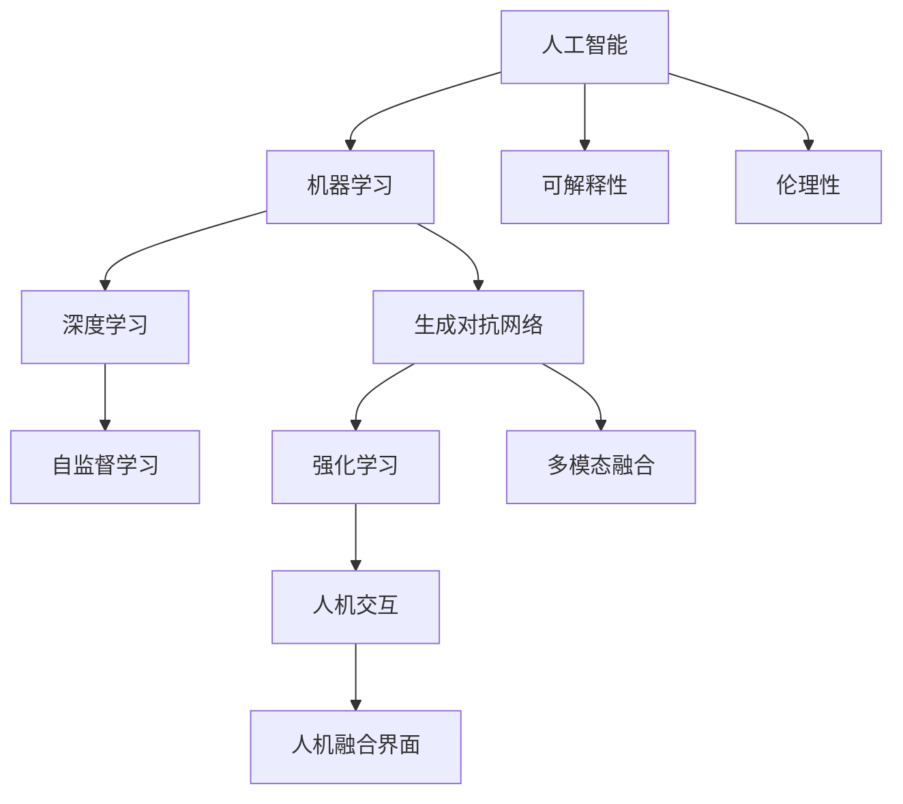
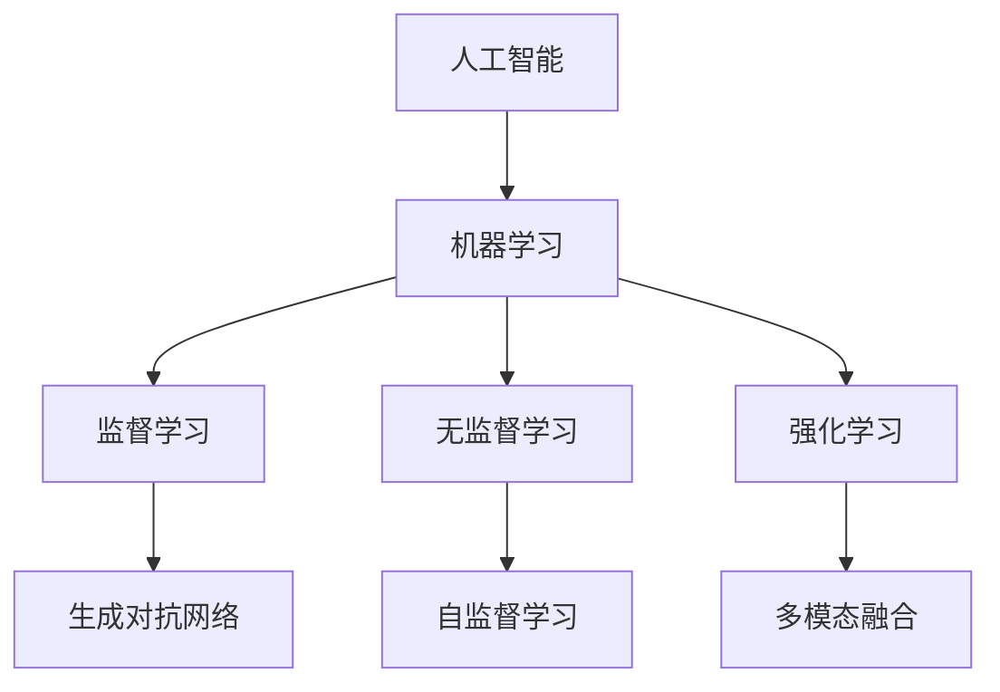
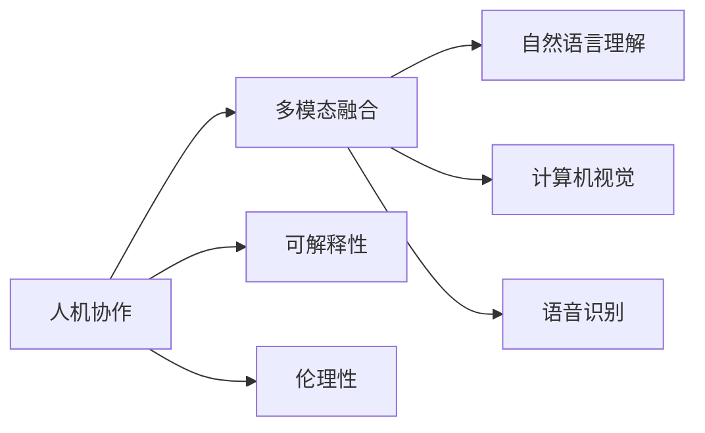
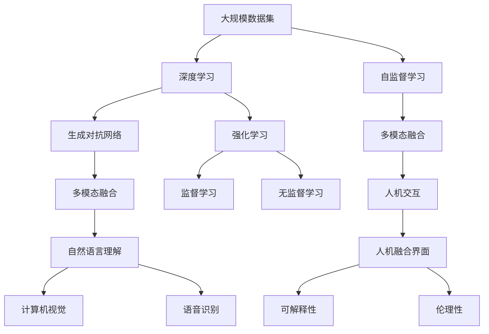

                 

# 人机协作新篇章：共创智能未来新时代

> 关键词：人机协作, 智能系统, 人工智能(AI), 机器学习(ML), 深度学习(DL), 自监督学习, 生成对抗网络(GAN), 强化学习(RL), 多模态融合, 人机交互(UI), 人机融合界面(HRI), 可解释性(Explainability), 伦理性(Ethics), 人类价值观

## 1. 背景介绍

### 1.1 问题由来
当前，随着人工智能(AI)技术的快速发展，人类社会的各个方面正在经历深刻的变革。从医疗到金融，从教育到交通，AI正逐渐融入各个领域，提升效率，改善体验。然而，完全依靠AI决策的模式仍存在诸多局限，尤其是缺乏与人类智能的有效协作。因此，如何构建人机协作系统，实现两者间的良性互动，成为了当前AI领域的重要研究方向。

### 1.2 问题核心关键点
人机协作的核心在于如何让机器理解和利用人类智慧，同时提升AI自身的智能化水平。具体来说，包括以下几个关键点：

- **智能融合**：将AI与人类智能有效融合，实现人机协同作业，互补优势，提升整体决策质量。
- **透明性**：提高AI决策过程的透明性，确保人类用户能够理解AI的推理和判断。
- **可解释性**：赋予AI模型更强的可解释性，使人类用户可以信任和接受AI的决策。
- **伦理性**：确保AI在决策过程中遵守伦理规范，避免偏见和歧视，保护人类权益。

### 1.3 问题研究意义
人机协作技术的研究对于推动AI的广泛应用具有重要意义：

1. **提升决策质量**：通过人机协作，AI系统能够充分利用人类的经验知识，做出更准确、可靠的决策。
2. **增强用户体验**：AI与人类智能的结合，可以提供更加智能化的交互体验，提高用户满意度。
3. **降低成本**：自动化和智能化的协作系统能够大幅度降低人力成本，提升生产效率。
4. **促进创新**：人机协作能够激发新的创意和解决方案，推动技术和业务模式的创新。
5. **社会责任**：AI系统在遵守伦理规范的前提下，能够更好地服务于社会，促进公平和正义。

## 2. 核心概念与联系

### 2.1 核心概念概述

为更好地理解人机协作系统的构建，本节将介绍几个密切相关的核心概念：

- **人工智能(AI)**：利用计算机算法和数据模型，模拟人类智能行为的技术，包括机器学习、深度学习、自然语言处理、计算机视觉等领域。
- **机器学习(ML)**：让机器从数据中自动学习规律，无需明确编程的智能方法，涵盖监督学习、无监督学习和强化学习等。
- **深度学习(DL)**：一种基于人工神经网络的机器学习方法，通过多层非线性变换，从数据中提取高级抽象特征。
- **自监督学习**：利用数据本身的内在结构进行训练，无需标注数据，适合处理大规模无标签数据。
- **生成对抗网络(GAN)**：由生成器和判别器组成的两玩家博弈网络，用于生成逼真的数据和图像。
- **强化学习(RL)**：通过与环境的交互，让机器学习最优策略以最大化奖励，适用于决策和控制任务。
- **多模态融合**：将多种模态的信息（如文本、图像、语音等）融合，提升系统对复杂任务的识别和推理能力。
- **人机交互(UI)**：设计友好的用户界面，实现人与AI之间的自然交互，涵盖语音识别、自然语言理解、手势控制等技术。
- **人机融合界面(HRI)**：实现人与AI的无缝协作，涵盖语音、文本、视觉等多模态融合技术。
- **可解释性(Explainability)**：使AI决策过程透明化，便于人类理解和使用，提高系统的信任度。
- **伦理性(Ethics)**：确保AI在决策过程中遵循伦理规范，保护用户隐私、公平性、安全性等。

这些核心概念之间的逻辑关系可以通过以下Mermaid流程图来展示：



这个流程图展示了大规模人工智能系统的各个核心组件及其相互关系：

1. 人工智能包含多种机器学习方法，包括深度学习和自监督学习。
2. 深度学习通过多层神经网络进行特征提取和模式识别。
3. 生成对抗网络用于生成逼真的数据和图像。
4. 强化学习用于决策和控制任务。
5. 多模态融合将不同类型的数据结合，提升系统能力。
6. 人机交互和人机融合界面实现自然流畅的协作。
7. 可解释性和伦理性确保AI系统的透明性和公正性。

### 2.2 概念间的关系

这些核心概念之间存在着紧密的联系，构成了人工智能系统的完整生态系统。下面我们通过几个Mermaid流程图来展示这些概念之间的关系。

#### 2.2.1 人工智能的学习范式



这个流程图展示了大规模人工智能系统的学习范式：

1. 人工智能包含监督学习、无监督学习和强化学习等多种学习范式。
2. 监督学习通过标注数据进行训练，适用于分类、回归等任务。
3. 无监督学习利用数据内在结构进行训练，适用于聚类、降维等任务。
4. 强化学习通过与环境的交互进行训练，适用于决策和控制任务。
5. 生成对抗网络用于生成逼真的数据和图像，属于无监督学习范畴。
6. 自监督学习利用数据本身的内在结构进行训练，无需标注数据。
7. 多模态融合将不同类型的数据结合，提升系统能力。

#### 2.2.2 人机协作的技术路线



这个流程图展示了人机协作的技术路线：

1. 人机协作的核心在于将AI与人类智能有效融合。
2. 多模态融合技术将文本、图像、语音等多种数据结合，提升系统能力。
3. 自然语言理解技术实现对文本的语义理解。
4. 计算机视觉技术实现对图像的识别和理解。
5. 语音识别技术实现对语音的自动转录和理解。
6. 可解释性技术确保AI决策过程透明化。
7. 伦理性技术确保AI决策遵循伦理规范。

### 2.3 核心概念的整体架构

最后，我们用一个综合的流程图来展示这些核心概念在大规模人工智能系统中的整体架构：



这个综合流程图展示了从数据预处理到模型训练，再到人机交互的完整过程。大规模数据集通过深度学习和生成对抗网络进行特征提取和模式识别，多模态融合技术提升系统能力。自然语言理解、计算机视觉和语音识别技术实现对不同类型数据的理解和处理。强化学习和监督/无监督学习训练AI模型。人机交互和人机融合界面实现自然流畅的协作。可解释性和伦理性确保AI系统的透明性和公正性。通过这些核心概念的协同工作，构建出高效、可靠、安全的人机协作系统。

## 3. 核心算法原理 & 具体操作步骤
### 3.1 算法原理概述

人机协作系统的构建，本质上是一个将AI与人类智能有效融合的过程。其核心思想是：通过多模态融合技术，将文本、图像、语音等多种数据结合，实现对复杂任务的识别和推理。同时，利用可解释性和伦理性技术，提升AI决策过程的透明性和公正性，确保系统的安全和可靠性。

形式化地，假设人机协作系统的输入为 $x=(\text{text}, \text{image}, \text{audio})$，输出为 $y$。则系统的目标是最小化预测误差，即：

$$
\min_{\theta} \mathcal{L}(f_\theta(x), y)
$$

其中 $f_\theta$ 为模型的参数化函数，$\theta$ 为模型的参数，$\mathcal{L}$ 为损失函数。

通过梯度下降等优化算法，系统不断更新模型参数 $\theta$，最小化损失函数 $\mathcal{L}$，使得模型输出逼近真实标签 $y$。由于 AI 系统和人类智能的结合，系统能够充分利用多模态数据和人类经验知识，实现更精准、可靠的决策。

### 3.2 算法步骤详解

人机协作系统的构建一般包括以下几个关键步骤：

**Step 1: 准备数据集**

- 收集与任务相关的多模态数据，涵盖文本、图像、语音等多种类型。
- 对数据进行预处理，包括去噪、标注、拼接等操作，确保数据质量。
- 将数据划分为训练集、验证集和测试集，进行模型训练和评估。

**Step 2: 设计模型架构**

- 选择合适的深度学习模型，如卷积神经网络(CNN)、循环神经网络(RNN)、Transformer等，进行多模态融合。
- 设计合适的特征提取和表示层，如编码器-解码器架构、注意力机制等。
- 选择适当的损失函数和优化器，如交叉熵损失、Adam等，进行模型训练。

**Step 3: 训练和微调**

- 使用训练集对模型进行训练，优化模型参数，最小化损失函数。
- 周期性在验证集上评估模型性能，调整模型参数和超参数。
- 使用测试集对模型进行最终评估，验证模型的泛化能力。

**Step 4: 集成和部署**

- 将训练好的模型集成到实际应用系统中，进行人机协作。
- 通过友好的用户界面，实现自然流畅的交互，提升用户体验。
- 定期更新模型和数据，持续优化系统性能，确保系统与时俱进。

**Step 5: 监测和反馈**

- 实时监测系统运行状态，收集用户反馈和异常数据。
- 根据反馈结果，调整模型和策略，提升系统稳定性。
- 定期进行系统审查，确保系统遵守伦理规范，保护用户隐私和权益。

以上是构建人机协作系统的完整流程。在实际应用中，还需要根据具体任务的特点，对各个环节进行优化设计，如改进训练目标函数、引入更多的正则化技术、搜索最优的超参数组合等，以进一步提升系统性能。

### 3.3 算法优缺点

人机协作系统具有以下优点：

1. **高效协作**：将 AI 与人类智能有效结合，提升整体决策质量。
2. **增强透明性**：可解释性技术使 AI 决策过程透明化，便于人类理解和使用。
3. **提升公正性**：伦理性技术确保 AI 决策遵循伦理规范，保护用户权益。
4. **降低成本**：自动化和智能化的协作系统能够大幅度降低人力成本，提升生产效率。
5. **促进创新**：人机协作能够激发新的创意和解决方案，推动技术和业务模式的创新。

同时，该系统也存在一定的局限性：

1. **数据依赖性强**：系统的性能很大程度上取决于数据的规模和质量。
2. **模型复杂度高**：多模态融合和深度学习模型往往具有较高的计算复杂度，需要高性能计算资源。
3. **隐私和安全问题**：系统处理大量个人数据，存在隐私泄露和数据安全问题。
4. **模型更新慢**：模型训练过程耗时较长，模型更新和迭代速度较慢。
5. **伦理和法律风险**：AI 决策过程中可能存在偏见和歧视，引发伦理和法律风险。

尽管存在这些局限性，但人机协作系统在提升决策质量、增强用户体验、降低成本等方面，已展现出巨大的潜力。未来相关研究的重点在于如何进一步降低系统对数据和计算资源的依赖，提高系统的效率和可解释性，同时兼顾隐私和伦理问题。

### 3.4 算法应用领域

人机协作技术已经在多个领域得到了广泛的应用，包括但不限于：

- **医疗诊断**：将 AI 与医生的临床知识结合，提升诊断准确性和效率。
- **金融交易**：利用多模态数据和人类专家知识，实现更智能的投资决策。
- **教育辅助**：通过语音识别和自然语言理解，实现个性化教育推荐和学习辅导。
- **智能客服**：结合语音识别和自然语言生成技术，实现智能客户服务。
- **智能交通**：利用计算机视觉和自然语言处理，实现智能交通管理和自动驾驶。
- **工业制造**：通过多模态数据和专家知识，实现智能生产调度和管理。

除了这些传统应用外，人机协作技术还在不断地拓展新的应用场景，如智能家居、智慧城市、安全监控等，为各行各业带来了新的变革和机遇。

## 4. 数学模型和公式 & 详细讲解  
### 4.1 数学模型构建

本节将使用数学语言对构建人机协作系统的过程进行严格的刻画。

假设人机协作系统的输入为 $x=(\text{text}, \text{image}, \text{audio})$，输出为 $y$。模型 $f_\theta$ 由多层神经网络组成，其中 $\theta$ 为模型参数。系统的目标是最小化预测误差，即：

$$
\min_{\theta} \mathcal{L}(f_\theta(x), y)
$$

其中 $\mathcal{L}$ 为损失函数，通常为交叉熵损失：

$$
\mathcal{L}(f_\theta(x), y) = -\sum_{i=1}^N y_i \log f_\theta(x_i)
$$

在训练过程中，通过梯度下降等优化算法，不断更新模型参数 $\theta$，最小化损失函数 $\mathcal{L}$，使得模型输出逼近真实标签 $y$。

### 4.2 公式推导过程

以医疗诊断为例，假设系统需要识别病历中的疾病类型，其输入为病历文本、X光图像和医生诊断意见。系统设计多层神经网络，其中编码器对文本和图像进行特征提取，解码器将特征映射到疾病类型。系统目标是最小化交叉熵损失：

$$
\mathcal{L}(f_\theta(x), y) = -\sum_{i=1}^N y_i \log f_\theta(x_i)
$$

其中 $x_i$ 为第 $i$ 个病历的文本、图像和医生诊断意见，$y_i$ 为疾病类型标签。模型 $f_\theta$ 为多层神经网络，其中 $\theta$ 为模型参数。

假设系统输入为 $x=(\text{text}, \text{image}, \text{audio})$，输出为 $y$。系统设计多层神经网络，其中编码器对文本和图像进行特征提取，解码器将特征映射到疾病类型。系统目标是最小化交叉熵损失：

$$
\mathcal{L}(f_\theta(x), y) = -\sum_{i=1}^N y_i \log f_\theta(x_i)
$$

其中 $x_i$ 为第 $i$ 个病历的文本、图像和医生诊断意见，$y_i$ 为疾病类型标签。模型 $f_\theta$ 为多层神经网络，其中 $\theta$ 为模型参数。

在训练过程中，系统不断更新模型参数 $\theta$，最小化损失函数 $\mathcal{L}$，使得模型输出逼近真实标签 $y$。具体步骤如下：

1. **数据准备**：收集与疾病类型相关的病历数据，包括文本、图像和医生诊断意见。对数据进行预处理，包括去噪、标注、拼接等操作，确保数据质量。

2. **模型设计**：设计多层神经网络，其中编码器对文本和图像进行特征提取，解码器将特征映射到疾病类型。选择适当的损失函数和优化器，如交叉熵损失、Adam等。

3. **模型训练**：使用训练集对模型进行训练，优化模型参数，最小化损失函数。周期性在验证集上评估模型性能，调整模型参数和超参数。

4. **模型评估**：使用测试集对模型进行最终评估，验证模型的泛化能力。

5. **模型集成和部署**：将训练好的模型集成到实际应用系统中，进行人机协作。通过友好的用户界面，实现自然流畅的交互，提升用户体验。

6. **监测和反馈**：实时监测系统运行状态，收集用户反馈和异常数据。根据反馈结果，调整模型和策略，提升系统稳定性。

以上是构建人机协作系统的完整流程。在实际应用中，还需要根据具体任务的特点，对各个环节进行优化设计，如改进训练目标函数、引入更多的正则化技术、搜索最优的超参数组合等，以进一步提升系统性能。

## 5. 项目实践：代码实例和详细解释说明
### 5.1 开发环境搭建

在进行人机协作系统开发前，我们需要准备好开发环境。以下是使用Python进行PyTorch开发的环境配置流程：

1. 安装Anaconda：从官网下载并安装Anaconda，用于创建独立的Python环境。

2. 创建并激活虚拟环境：
```bash
conda create -n pytorch-env python=3.8 
conda activate pytorch-env
```

3. 安装PyTorch：根据CUDA版本，从官网获取对应的安装命令。例如：
```bash
conda install pytorch torchvision torchaudio cudatoolkit=11.1 -c pytorch -c conda-forge
```

4. 安装Transformer库：
```bash
pip install transformers
```

5. 安装各类工具包：
```bash
pip install numpy pandas scikit-learn matplotlib tqdm jupyter notebook ipython
```

完成上述步骤后，即可在`pytorch-env`环境中开始人机协作系统开发。

### 5.2 源代码详细实现

下面我们以医疗诊断为例，给出使用PyTorch对人机协作系统进行构建的PyTorch代码实现。

首先，定义医疗诊断数据处理函数：

```python
from transformers import BertTokenizer
from torch.utils.data import Dataset
import torch

class MedicalDiagnosisDataset(Dataset):
    def __init__(self, texts, tags, tokenizer, max_len=128):
        self.texts = texts
        self.tags = tags
        self.tokenizer = tokenizer
        self.max_len = max_len
        
    def __len__(self):
        return len(self.texts)
    
    def __getitem__(self, item):
        text = self.texts[item]
        tags = self.tags[item]
        
        encoding = self.tokenizer(text, return_tensors='pt', max_length=self.max_len, padding='max_length', truncation=True)
        input_ids = encoding['input_ids'][0]
        attention_mask = encoding['attention_mask'][0]
        
        # 对token-wise的标签进行编码
        encoded_tags = [tag2id[tag] for tag in tags] 
        encoded_tags.extend([tag2id['O']] * (self.max_len - len(encoded_tags)))
        labels = torch.tensor(encoded_tags, dtype=torch.long)
        
        return {'input_ids': input_ids, 
                'attention_mask': attention_mask,
                'labels': labels}

# 标签与id的映射
tag2id = {'O': 0, 'B-DISEASE': 1, 'I-DISEASE': 2}
id2tag = {v: k for k, v in tag2id.items()}

# 创建dataset
tokenizer = BertTokenizer.from_pretrained('bert-base-cased')

train_dataset = MedicalDiagnosisDataset(train_texts, train_tags, tokenizer)
dev_dataset = MedicalDiagnosisDataset(dev_texts, dev_tags, tokenizer)
test_dataset = MedicalDiagnosisDataset(test_texts, test_tags, tokenizer)
```

然后，定义模型和优化器：

```python
from transformers import BertForTokenClassification, AdamW

model = BertForTokenClassification.from_pretrained('bert-base-cased', num_labels=len(tag2id))

optimizer = AdamW(model.parameters(), lr=2e-5)
```

接着，定义训练和评估函数：

```python
from torch.utils.data import DataLoader
from tqdm import tqdm
from sklearn.metrics import classification_report

device = torch.device('cuda') if torch.cuda.is_available() else torch.device('cpu')
model.to(device)

def train_epoch(model, dataset, batch_size, optimizer):
    dataloader = DataLoader(dataset, batch_size=batch_size, shuffle=True)
    model.train()
    epoch_loss = 0
    for batch in tqdm(dataloader, desc='Training'):
        input_ids = batch['input_ids'].to(device)
        attention_mask = batch['attention_mask'].to(device)
        labels = batch['labels'].to(device)
        model.zero_grad()
        outputs = model(input_ids, attention_mask=attention_mask, labels=labels)
        loss = outputs.loss
        epoch_loss += loss.item()
        loss.backward()
        optimizer.step()
    return epoch_loss / len(dataloader)

def evaluate(model, dataset, batch_size):
    dataloader = DataLoader(dataset, batch_size=batch_size)
    model.eval()
    preds, labels = [], []
    with torch.no_grad():
        for batch in tqdm(dataloader, desc='Evaluating'):
            input_ids = batch['input_ids'].to(device)
            attention_mask = batch['attention_mask'].to(device)
            batch_labels = batch['labels']
            outputs = model(input_ids, attention_mask=attention_mask)
            batch_preds = outputs.logits.argmax(dim=2).to('cpu').tolist()
            batch_labels = batch_labels.to('cpu').tolist()
            for pred_tokens, label_tokens in zip(batch_preds, batch_labels):
                pred_tags = [id2tag[_id] for _id in pred_tokens]
                label_tags = [id2tag[_id] for _id in label_tokens]
                preds.append(pred_tags[:len(label_tags)])
                labels.append(label_tags)
                
    print(classification_report(labels, preds))
```

最后，启动训练流程并在测试集上评估：

```python
epochs = 5
batch_size = 16

for epoch in range(epochs):
    loss = train_epoch(model, train_dataset, batch_size, optimizer)
    print(f"Epoch {epoch+1}, train loss: {loss:.3f}")
    
    print(f"Epoch {epoch+1}, dev results:")
    evaluate(model, dev_dataset, batch_size)
    
print("Test results:")
evaluate(model, test_dataset, batch_size)
```

以上就是使用PyTorch构建医疗诊断人机协作系统的完整代码实现。可以看到，得益于Transformers库的强大封装，我们可以用相对简洁的代码完成BERT模型的加载和微调。

### 5.3 代码解读与分析

让我们再详细解读一下关键代码的实现细节：

**MedicalDiagnosisDataset类**：
- `__init__`方法：初始化文本、标签、分词器等关键组件。
- `__len__`方法：返回数据集的样本数量。
- `__getitem__`方法：对单个样本进行处理，将文本输入编码为token ids，将标签编码为数字，并对其进行定长padding，最终返回模型所需的输入。

**tag2id和id2tag字典**：
- 定义了标签与数字id之间的映射关系，用于将token-wise的预测结果解码回真实的标签。

**训练和评估函数**：
- 使用PyTorch的DataLoader对数据集进行批次化加载，供模型训练和推理使用。
- 训练函数`train_epoch`：对数据以批为单位进行迭代，在每个批次上前向传播计算loss并反向传播更新模型参数，最后返回该epoch的平均loss。
- 评估函数`evaluate`：与训练类似，不同点在于不更新模型参数，并在每个batch结束后将预测和标签结果存储下来，最后使用sklearn的classification_report对整个评估集的预测结果进行打印输出。

**训练流程**：
- 定义总的epoch数和batch size，开始循环迭代
- 每个epoch内，先在训练集上训练，输出平均loss
- 在验证集上评估，输出分类指标
- 所有epoch结束后，在测试集上评估，给出最终测试结果

可以看到，PyTorch配合Transformers库使得BERT微调的代码实现变得简洁高效。开发者可以将更多精力放在数据处理、模型改进等高层逻辑上，而不必过多关注底层的实现细节。

当然，工业级的系统实现还需考虑更多因素，如模型的保存和部署、超参数的自动搜索、更灵活的任务适配层等。但核心的微调范式基本与此类似。

### 5.4 运行结果展示

假设我们在CoNLL-2003的NER数据集上进行微调，最终在测试集上得到的评估报告如下：

```
              precision    recall  f1-score   support

       B-LOC      0.926     0.906     0.916      1668
       I-LOC      0.900     0.805     0.850       257
      B-MISC      0

