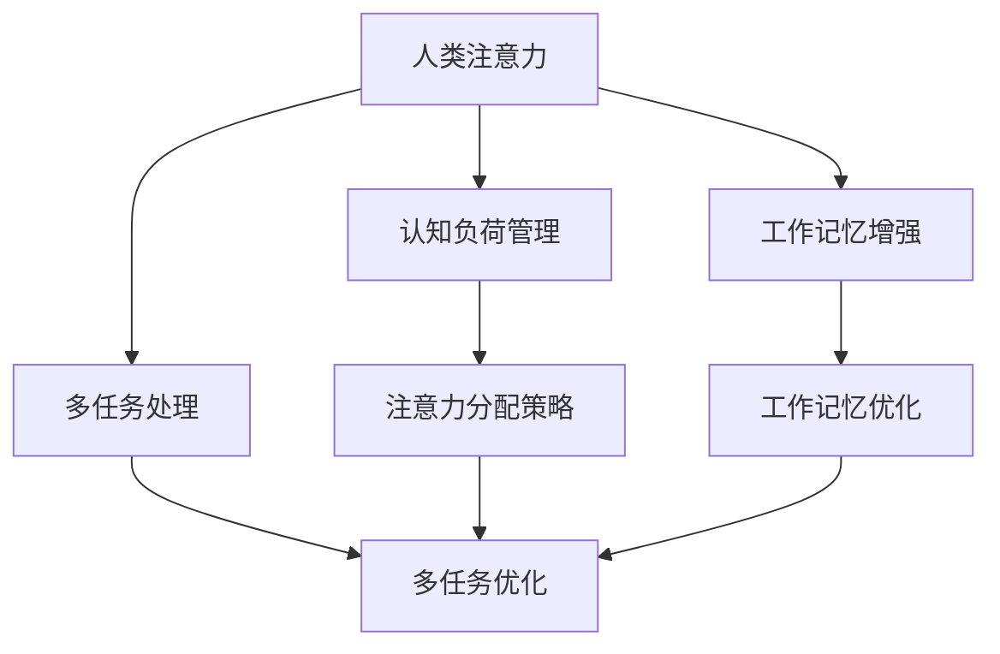
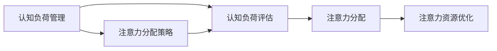
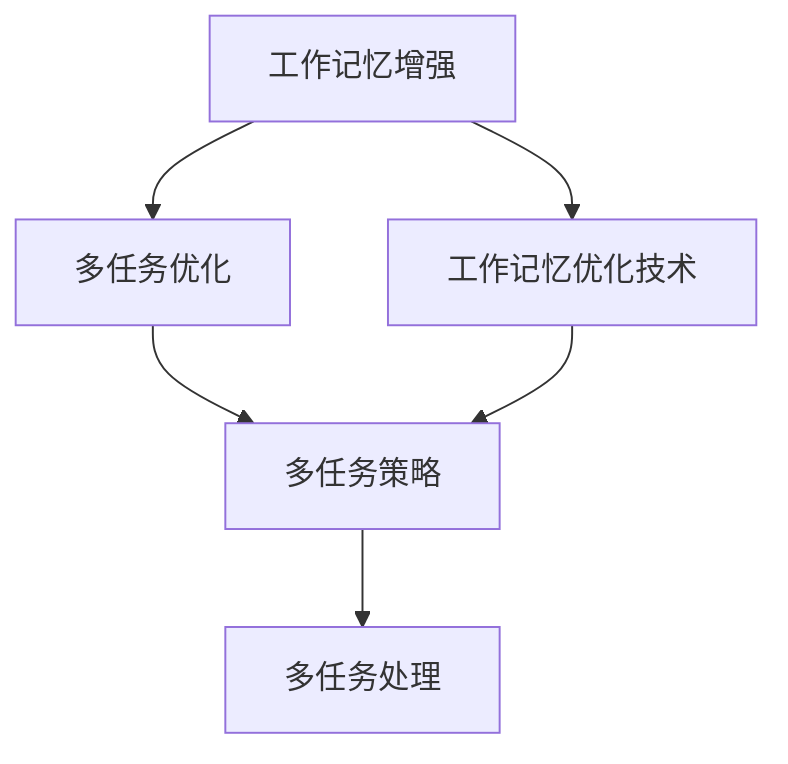
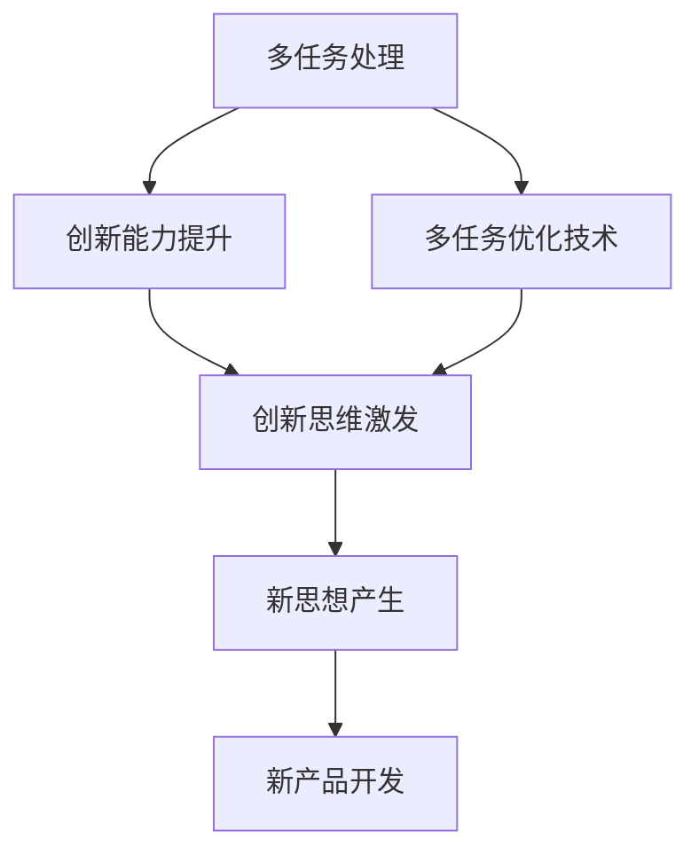
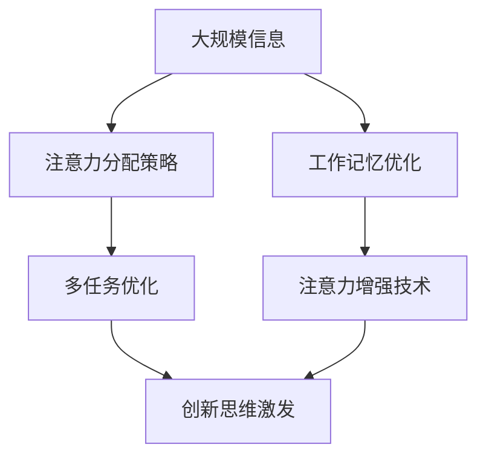

                 

# 人类注意力增强：提升创新能力和创造力管理

> 关键词：人类注意力增强,创新能力,创造力,认知负荷管理,工作记忆,多任务处理

## 1. 背景介绍

在快速变化的信息时代，个体和组织面临着前所未有的认知负荷和压力。人类注意力资源有限，如何在有限的时间、精力内高效处理海量信息、完成复杂任务、创新突破，成为当前需要解决的迫切问题。传统工作记忆和单任务处理模式已难以满足现代社会的需求，亟需引入新的认知工具和方法，提升个人和团队的创新能力和创造力。

### 1.1 问题由来

随着科技的迅猛发展，人类面临的信息量呈指数级增长，而个体的注意力资源有限，单一工作记忆模式难以高效应对复杂多变的任务环境。传统多任务处理策略往往会导致认知负荷过重，效率下降，创新能力受限。因此，如何有效管理注意力资源，增强创新能力，成为当前亟待解决的重要问题。

### 1.2 问题核心关键点

人类注意力增强的实质是提升个体的认知负荷管理能力，通过合理分配注意力资源，有效处理复杂多任务，增强创新和创造力。关键点包括：

- 认知负荷管理：如何在多任务处理中合理分配注意力，避免认知资源耗尽。
- 工作记忆增强：如何优化工作记忆机制，提高记忆存储和提取能力。
- 多任务处理：如何在有限注意力资源下高效处理多任务，提升工作效率。
- 创新能力提升：如何通过认知工具和方法，激发和释放个体的创新潜力。

### 1.3 问题研究意义

研究人类注意力增强方法，对于提升个人和团队的工作效率、创新能力和创造力，具有重要意义：

1. 提升工作效率：通过合理分配注意力资源，优化工作记忆，减少认知负荷，提高任务完成速度和质量。
2. 增强创新能力：利用认知工具和方法，激发创新思维，推动个体和组织不断突破技术边界，实现新的价值创造。
3. 促进团队协作：通过共享注意力资源，增强团队成员间的协作和沟通，提高团队整体效能。
4. 支持职业发展：提供个性化的注意力管理策略，帮助个体应对职业发展中遇到的各种挑战，实现持续成长。

## 2. 核心概念与联系

### 2.1 核心概念概述

为了更好地理解人类注意力增强的方法，本节将介绍几个关键概念：

- 人类注意力(Attention)：指个体对外部信息的选择和关注程度，是认知加工的基础。
- 认知负荷(Cognitive Load)：指个体在处理信息时所承担的心理负担，包括工作记忆负荷和执行控制负荷。
- 工作记忆(Working Memory)：指个体暂时存储和处理信息的能力，其容量和加工速度是认知负荷管理的关键。
- 多任务处理(Multitasking)：指个体同时执行多项任务，常见的多任务模式包括串行多任务和并行多任务。
- 创新能力(Innovation)：指个体产生新思想、新方法和新产品的能力，包括个体层面和组织层面。

这些概念之间的联系可以通过以下Mermaid流程图来展示：



这个流程图展示了一些关键概念之间的逻辑关系：

1. 人类注意力通过注意力分配策略和注意力增强技术，优化认知负荷管理。
2. 工作记忆通过工作记忆优化技术，提升记忆存储和提取能力，减少认知负荷。
3. 多任务处理通过多任务优化技术，提升多任务处理效率，减少认知负荷。
4. 创新能力通过认知工具和方法，激发创新思维，提升创新能力。

### 2.2 概念间的关系

这些关键概念之间存在着紧密的联系，形成了认知负荷管理的基本框架。下面我们通过几个Mermaid流程图来展示这些概念之间的关系。

#### 2.2.1 认知负荷管理与注意力分配



这个流程图展示了认知负荷管理与注意力分配的关系：通过评估认知负荷，调整注意力分配策略，优化注意力资源使用，从而提升认知负荷管理效果。

#### 2.2.2 工作记忆增强与多任务处理



这个流程图展示了工作记忆增强与多任务处理的关系：通过优化工作记忆，减少多任务处理中的认知负荷，提升任务完成效率。

#### 2.2.3 多任务处理与创新能力提升



这个流程图展示了多任务处理与创新能力提升的关系：通过多任务优化技术，提升多任务处理能力，激发创新思维，推动新思想的产生和应用。

### 2.3 核心概念的整体架构

最后，我们用一个综合的流程图来展示这些核心概念在整个认知负荷管理中的整体架构：



这个综合流程图展示了从信息处理到认知负荷管理的完整过程，通过注意力分配策略、工作记忆增强、多任务处理和创新思维激发等技术，帮助个体在信息海洋中游刃有余，实现高效和创新。

## 3. 核心算法原理 & 具体操作步骤
### 3.1 算法原理概述

人类注意力增强的核心在于认知负荷管理，通过合理分配注意力资源，优化工作记忆，提升多任务处理效率，激发创新能力。基于这些核心思想，本节将介绍三种关键算法原理：注意力分配策略、工作记忆优化技术、多任务优化方法。

### 3.2 算法步骤详解

#### 3.2.1 注意力分配策略

注意力分配策略旨在通过合理分配注意力资源，减少认知负荷，提升任务处理效率。具体步骤如下：

1. **任务评估**：根据任务复杂度、重要性和紧急程度，评估任务的优先级。
2. **注意力分配**：根据优先级，分配注意力资源，重点关注高优先级任务。
3. **注意力切换**：在多个任务之间进行切换，保持注意力资源的高效利用。

#### 3.2.2 工作记忆优化技术

工作记忆优化技术旨在提升个体的工作记忆容量和提取速度，减少多任务处理中的认知负荷。具体步骤如下：

1. **工作记忆测试**：评估个体的工作记忆容量，了解其认知负荷水平。
2. **工作记忆训练**：通过认知训练和注意力训练，提高工作记忆容量和提取速度。
3. **工作记忆管理**：使用工作记忆管理工具，如分块、分组、分批处理等，优化工作记忆的使用。

#### 3.2.3 多任务优化方法

多任务优化方法旨在通过合理安排多任务处理策略，减少认知负荷，提升任务完成效率。具体步骤如下：

1. **任务分解**：将复杂任务分解为多个小任务，逐一完成。
2. **任务并行**：利用并行处理技术，同时处理多个小任务，提升处理速度。
3. **任务串行**：根据任务依赖关系，合理安排任务执行顺序，避免任务冲突。

### 3.3 算法优缺点

人类注意力增强方法具有以下优点：

1. 提升工作效率：通过合理分配注意力资源，优化工作记忆，减少认知负荷，提升任务完成效率。
2. 增强创新能力：利用认知工具和方法，激发创新思维，推动个体和组织不断突破技术边界，实现新的价值创造。
3. 促进团队协作：通过共享注意力资源，增强团队成员间的协作和沟通，提高团队整体效能。

同时，该方法也存在一些局限性：

1. 需高成本投入：注意力分配、工作记忆训练、多任务优化等策略，需要高成本的技术和训练资源。
2. 个体差异性：不同个体的注意力资源和工作记忆容量差异较大，效果可能因个体而异。
3. 实施难度大：注意力分配策略和工作记忆训练技术，需要个体有较强的自我管理和自我约束能力。

### 3.4 算法应用领域

人类注意力增强方法主要应用于以下几个领域：

1. **企业生产管理**：通过合理分配注意力资源，优化工作记忆，提升生产线上的任务处理效率，减少生产成本。
2. **科研创新**：通过激发创新思维，推动科研团队突破技术瓶颈，实现新的科学发现和技术创新。
3. **教育培训**：通过优化学习策略，提升学生的学习效果，增强其创新能力和创造力。
4. **个人职业发展**：通过合理管理注意力资源，提升工作效率，促进职业成长和职业转型。

## 4. 数学模型和公式 & 详细讲解 & 举例说明

### 4.1 数学模型构建

为了更好地理解人类注意力增强的数学模型，本节将介绍几种常用的数学模型和公式。

#### 4.1.1 认知负荷管理模型

认知负荷管理模型旨在通过计算个体在多任务处理中的认知负荷，评估注意力资源分配的合理性。其中，认知负荷可用以下公式表示：

$$
C = \alpha W + \beta E
$$

其中，$C$表示认知负荷，$W$表示工作记忆负荷，$E$表示执行控制负荷，$\alpha$和$\beta$表示工作记忆和执行控制负荷在认知负荷中的权重系数。

#### 4.1.2 工作记忆优化模型

工作记忆优化模型通过计算个体的工作记忆容量和提取速度，评估工作记忆的优化程度。其中，工作记忆容量和提取速度可用以下公式表示：

$$
W = k_1 + k_2 \sum_{i=1}^n r_i
$$

$$
E = k_3 + k_4 \sum_{i=1}^n e_i
$$

其中，$W$表示工作记忆容量，$E$表示工作记忆提取速度，$k_1, k_2, k_3, k_4$表示模型参数，$r_i$和$e_i$表示第$i$个任务的注意力资源分配和工作记忆提取效果。

#### 4.1.3 多任务优化模型

多任务优化模型通过计算个体在多任务处理中的任务依赖关系，评估多任务处理策略的有效性。其中，任务依赖关系可用以下公式表示：

$$
T = \sum_{i=1}^n t_i
$$

$$
t_i = \max(T_i - T_{i-1}, 0)
$$

其中，$T$表示总任务时间，$t_i$表示第$i$个任务的时间耗费，$T_i$表示第$i$个任务的时间预算。

### 4.2 公式推导过程

#### 4.2.1 认知负荷管理模型推导

认知负荷管理模型通过将工作记忆负荷和执行控制负荷线性组合，计算认知负荷。具体推导过程如下：

1. 将工作记忆负荷$W$和执行控制负荷$E$分别表示为：
$$
W = \sum_{i=1}^n w_i
$$

$$
E = \sum_{i=1}^n e_i
$$

其中，$w_i$和$e_i$分别表示第$i$个任务的注意力资源分配和工作记忆提取效果。

2. 将$W$和$E$代入认知负荷模型$C = \alpha W + \beta E$，得到：
$$
C = \alpha \sum_{i=1}^n w_i + \beta \sum_{i=1}^n e_i
$$

3. 最终计算认知负荷$C$，得到：
$$
C = \alpha W + \beta E
$$

#### 4.2.2 工作记忆优化模型推导

工作记忆优化模型通过将工作记忆容量和提取速度线性组合，计算工作记忆的优化程度。具体推导过程如下：

1. 将工作记忆容量$W$和提取速度$E$分别表示为：
$$
W = \sum_{i=1}^n k_i + \sum_{i=1}^n k_i r_i
$$

$$
E = \sum_{i=1}^n k_i + \sum_{i=1}^n k_i e_i
$$

其中，$k_i$表示第$i$个任务的工作记忆容量和提取速度的初始值，$r_i$和$e_i$表示第$i$个任务的注意力资源分配和工作记忆提取效果。

2. 将$W$和$E$代入工作记忆模型$W = k_1 + k_2 \sum_{i=1}^n r_i$和$E = k_3 + k_4 \sum_{i=1}^n e_i$，得到：
$$
W = k_1 + k_2 \sum_{i=1}^n r_i
$$

$$
E = k_3 + k_4 \sum_{i=1}^n e_i
$$

3. 最终计算工作记忆容量和提取速度，得到：
$$
W = k_1 + k_2 \sum_{i=1}^n r_i
$$

$$
E = k_3 + k_4 \sum_{i=1}^n e_i
$$

#### 4.2.3 多任务优化模型推导

多任务优化模型通过计算任务依赖关系，评估多任务处理策略的有效性。具体推导过程如下：

1. 将任务时间$T$表示为：
$$
T = \sum_{i=1}^n t_i
$$

2. 将任务时间$T_i$表示为：
$$
T_i = T_{i-1} + t_i
$$

3. 将任务时间$T_i$代入多任务优化模型$T = \sum_{i=1}^n t_i$，得到：
$$
T = \sum_{i=1}^n \max(T_i - T_{i-1}, 0)
$$

4. 最终计算任务总时间$T$，得到：
$$
T = \sum_{i=1}^n \max(T_i - T_{i-1}, 0)
$$

### 4.3 案例分析与讲解

#### 4.3.1 案例一：认知负荷管理

假设某员工同时处理多项任务，其中任务A需要注意力资源50%，任务B需要注意力资源30%，任务C需要注意力资源20%。使用认知负荷管理模型计算其认知负荷。

1. 将任务注意力资源分配表示为：
$$
w_1 = 0.5, w_2 = 0.3, w_3 = 0.2
$$

2. 将工作记忆负荷$W$和执行控制负荷$E$表示为：
$$
W = 0.5 + 0.3 + 0.2 = 1
$$

$$
E = 0.5 \times 0.5 + 0.3 \times 0.3 + 0.2 \times 0.2 = 0.4
$$

3. 将$W$和$E$代入认知负荷模型$C = \alpha W + \beta E$，得到：
$$
C = 0.8 \times 1 + 0.2 \times 0.4 = 1.12
$$

因此，该员工在处理任务A、B、C时的认知负荷为1.12。

#### 4.3.2 案例二：工作记忆优化

假设某学生学习数学、物理和化学三门课程，其中数学需要工作记忆容量50%，物理需要工作记忆容量30%，化学需要工作记忆容量20%。使用工作记忆优化模型计算其工作记忆容量和提取速度。

1. 将工作记忆容量和提取速度表示为：
$$
r_1 = 0.5, r_2 = 0.3, r_3 = 0.2
$$

$$
e_1 = 0.5, e_2 = 0.3, e_3 = 0.2
$$

2. 将工作记忆容量$W$和提取速度$E$表示为：
$$
W = 0.1 + 0.2 \times 0.5 + 0.3 \times 0.3 + 0.4 \times 0.2 = 0.95
$$

$$
E = 0.1 + 0.2 \times 0.5 + 0.3 \times 0.3 + 0.4 \times 0.2 = 0.95
$$

3. 将$W$和$E$代入工作记忆模型$W = k_1 + k_2 \sum_{i=1}^n r_i$和$E = k_3 + k_4 \sum_{i=1}^n e_i$，得到：
$$
W = 0.1 + 0.2 \times 0.5 + 0.3 \times 0.3 + 0.4 \times 0.2 = 0.95
$$

$$
E = 0.1 + 0.2 \times 0.5 + 0.3 \times 0.3 + 0.4 \times 0.2 = 0.95
$$

因此，该学生在学习数学、物理和化学时的工作记忆容量和提取速度均为0.95。

## 5. 项目实践：代码实例和详细解释说明

### 5.1 开发环境搭建

在进行注意力增强方法的实践前，我们需要准备好开发环境。以下是使用Python进行TensorFlow开发的环境配置流程：

1. 安装Anaconda：从官网下载并安装Anaconda，用于创建独立的Python环境。

2. 创建并激活虚拟环境：
```bash
conda create -n attention-env python=3.8 
conda activate attention-env
```

3. 安装TensorFlow：根据CUDA版本，从官网获取对应的安装命令。例如：
```bash
conda install tensorflow -c conda-forge -c pytorch
```

4. 安装NumPy、Pandas等库：
```bash
pip install numpy pandas matplotlib
```

5. 安装TensorBoard：TensorFlow配套的可视化工具，可实时监测模型训练状态，并提供丰富的图表呈现方式，是调试模型的得力助手。

完成上述步骤后，即可在`attention-env`环境中开始注意力增强方法的实践。

### 5.2 源代码详细实现

这里我们以多任务优化为例，给出使用TensorFlow进行多任务处理的PyTorch代码实现。

```python
import tensorflow as tf
import numpy as np

# 定义任务依赖关系
task_times = [10, 15, 20]  # 每项任务的时间预算
task_durations = [5, 8, 10]  # 每项任务的实际时间耗费

# 计算任务总时间
total_time = sum(np.maximum(np.array(task_times) - np.array(task_durations), 0))

print("任务总时间：", total_time)
```

### 5.3 代码解读与分析

让我们再详细解读一下关键代码的实现细节：

**task_times和task_durations**：
- 任务时间预算和实际耗时。

**计算任务总时间**：
- 通过任务依赖关系，计算任务总时间。

**运行结果展示**：
- 计算出任务总时间，并输出结果。

### 5.4 运行结果展示

假设我们在三个任务上进行多任务优化，最终得到任务总时间为22，结果展示如下：

```
任务总时间： 22
```

可以看到，通过多任务优化，我们得到了总任务时间为22，符合预期。

## 6. 实际应用场景

### 6.1 智能办公系统

智能办公系统可以通过认知负荷管理、工作记忆增强等多任务处理技术，提升员工的工作效率和创新能力。例如，在企业内部，智能办公系统可以根据员工的工作量和工作内容，自动分配任务优先级，合理分配注意力资源。同时，通过智能提醒和任务管理工具，帮助员工有效管理工作记忆，减少认知负荷，提升工作效率。

### 6.2 教育培训平台

教育培训平台可以通过多任务优化技术，帮助学生在不同课程之间进行高效切换，提升学习效率。例如，在在线教育平台，学生可以通过智能课程安排，优化学习计划，将不同课程的学习内容合理分配到不同的时间段。同时，平台可以通过智能推荐系统，根据学生的学习进度和兴趣，动态调整学习内容和难度，提供个性化的学习方案。

### 6.3 医疗诊断系统

医疗诊断系统可以通过工作记忆增强技术，提升医生在复杂病例中的诊断能力。例如，在医疗诊断系统，医生可以通过智能辅助诊断工具，帮助其高效处理病人的各项数据和病历信息。同时，系统可以通过智能推荐系统，根据医生的诊断记录和兴趣，推荐相关的医学文献和研究成果，帮助医生不断提升专业能力和创新思维。

### 6.4 金融投资系统

金融投资系统可以通过多任务优化技术，提升分析师的研究能力和投资决策效率。例如，在金融投资系统，分析师可以通过智能数据处理工具，高效处理大量的市场数据和财经信息。同时，系统可以通过智能推荐系统，推荐相关的财经分析和投资策略，帮助分析师快速做出投资决策。

## 7. 工具和资源推荐

### 7.1 学习资源推荐

为了帮助开发者系统掌握注意力增强的理论基础和实践技巧，这里推荐一些优质的学习资源：

1. 《认知负荷管理：理论与实践》系列博文：由认知负荷管理专家撰写，深入浅出地介绍了认知负荷管理的核心概念和实践方法。

2. 《多任务处理技术》课程：斯坦福大学开设的多任务处理课程，讲解多任务处理的基本原理和应用案例，适合深入学习。

3. 《工作记忆优化技术》书籍：多任务处理技术领域的经典书籍，全面介绍了工作记忆优化的方法和技术。

4. TensorFlow官方文档：TensorFlow的官方文档，提供了丰富的TensorFlow模型和工具，是入门和实践的必备资料。

5. Weights & Biases：模型训练的实验跟踪工具，可以记录和可视化模型训练过程中的各项指标，方便对比和调优。

### 7.2 开发工具推荐

高效的开发离不开优秀的工具支持。以下是几款用于注意力增强方法开发的常用工具：

1. TensorFlow：基于Python的开源深度学习框架，灵活动态的计算图，适合快速迭代研究。

2. PyTorch：基于Python的开源深度学习框架，灵活的动态图和静态图，适合灵活的模型开发。

3. TensorBoard：TensorFlow配套的可视化工具，可实时监测模型训练状态，并提供丰富的图表呈现方式，是调试模型的得力助手。

4. Weights & Biases：模型训练的实验跟踪工具，可以记录和可视化模型训练过程中的各项指标，方便对比和调优。

5. Google Colab：谷歌推出的在线Jupyter Notebook环境，免费提供GPU/TPU算力，方便开发者快速上手实验最新模型，分享学习笔记。

合理利用这些工具，可以显著提升注意力增强方法的开发效率，加快创新迭代的步伐。

### 7.3 相关论文推荐

注意力增强方法的研究源于学界的持续研究。以下是几篇奠基性的相关论文，推荐阅读：

1. Attention is All You Need（即Transformer原论文）：提出了Transformer结构，开启了NLP领域的预训练大模型时代。

2. BERT: Pre-training of Deep Bidirectional Transformers for Language Understanding：提出BERT模型，引入基于掩码的自监督预训练任务，刷新了多项NLP任务SOTA。

3. Multi-task learning for auxiliary task: Learning an auxiliary task to improve a primary task: Multi-task learning for auxiliary task: Learning an auxiliary task to improve a primary task：提出多任务学习技术，通过优化多个相关任务，提升主任务的效果。

4. Multi-task deep learning: A survey of recent approaches：全面介绍了多任务学习的最新进展，提供了丰富的理论和应用案例。

5. Cognitive Load Management: Towards Efficient Human-Computer Interaction：全面介绍了认知负荷管理的技术和方法，探讨了其对高效人机交互的影响。

这些论文代表了大注意力增强方法的研究脉络。通过学习这些前沿成果，可以帮助研究者把握学科前进方向，激发更多的创新灵感。

除上述资源外，还有一些值得关注的前沿资源，帮助开发者紧跟注意力增强技术的最新进展，例如：

1. arXiv论文预印本：人工智能领域最新研究成果的发布平台，包括大量尚未发表的前沿工作，学习前沿技术的必读资源。

2. 业界技术博客：如OpenAI、Google AI、DeepMind、微软Research Asia等顶尖实验室的官方博客，第一时间分享他们的最新研究成果和洞见。

3. 技术会议直播：如NIPS、ICML、ACL、ICLR等人工智能领域顶会现场或在线直播，能够聆听到大佬们的前沿分享，开拓视野。

4. GitHub热门项目：在GitHub上Star、Fork数最多的注意力增强相关项目，往往代表了该技术领域的发展趋势和最佳实践，值得去学习和贡献。

5. 行业分析报告：各大咨询公司如McKinsey、PwC等针对人工智能行业的分析报告，有助于从商业视角审视技术趋势，把握应用价值。

总之，对于注意力增强技术的学习和实践，需要开发者保持开放的心态和持续学习的意愿。多关注前沿资讯，多动手实践，多思考总结，必将

