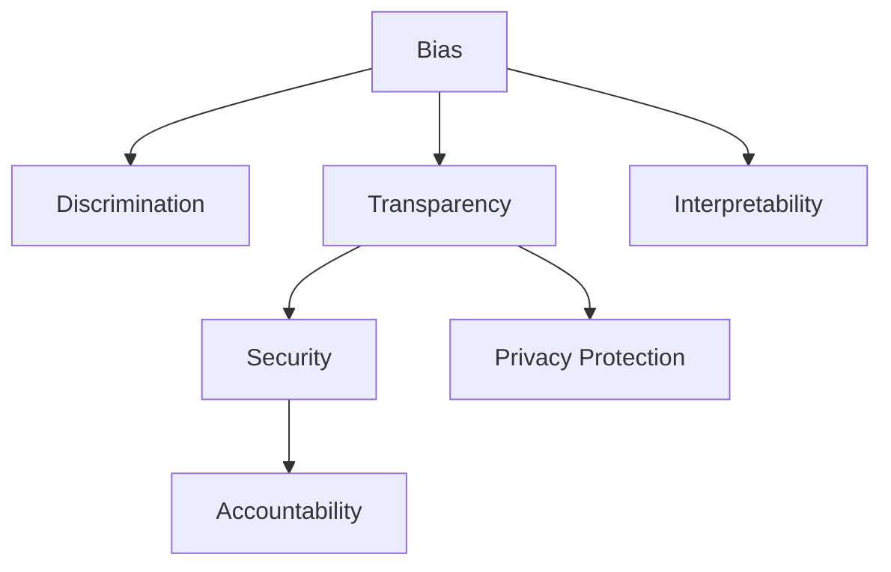

                 

## 1. 背景介绍

### 1.1 问题由来

随着人工智能（AI）技术的不断进步，深度学习和大数据在众多领域中的应用越来越广泛。这些技术带来了诸多便利和效率提升，但同时也引发了一系列伦理问题。特别是在涉及人机交互和决策的AI应用中，这些问题尤为突出。

在自然语言处理（NLP）领域，AI模型已经展现出了强大的语言理解和生成能力，被广泛应用于智能客服、机器翻译、情感分析、问答系统等任务。然而，这些模型并非完美的黑箱，其决策过程和输出结果可能存在偏见、歧视、误导等问题，引发了广泛的伦理关注。

### 1.2 问题核心关键点

当前，AI伦理问题主要集中在以下几个方面：

1. **偏见和歧视**：AI模型在训练和应用过程中，可能会学习到数据中的偏见，导致其输出结果存在歧视性。例如，基于历史数据训练的招聘AI模型，可能会因为历史数据中存在性别、种族偏见而拒绝某些申请者。
   
2. **透明度和可解释性**：AI模型的决策过程往往是黑箱的，用户难以理解其背后的逻辑和依据。这在医疗、金融等高风险应用领域尤为严重，用户对AI输出的质疑可能会引发法律和伦理问题。
   
3. **安全性与隐私保护**：AI模型在处理个人数据时，可能存在数据泄露、隐私侵犯等问题。特别是在敏感信息处理中，如何确保数据的安全和隐私保护，是必须解决的重要问题。
   
4. **责任归属**：AI系统的错误或违规行为，责任应由谁承担？是开发者、用户还是模型本身？这一问题在法律和道德上都有待明确。

这些核心问题直接影响着AI技术的可信度和接受度，迫切需要从技术、政策、伦理等多个层面进行深入探讨和应对。

### 1.3 问题研究意义

研究和解决AI伦理问题，对于提升AI技术的可信度和接受度，推动AI技术的健康发展，具有重要意义：

1. **增强公众信任**：通过透明、公平、安全的AI系统，增强公众对AI技术的信任，降低其对AI系统的抵触情绪。
   
2. **促进伦理应用**：确保AI技术的应用符合伦理规范，避免技术滥用，保护用户权益。
   
3. **推动法规制定**：为政府和企业制定AI伦理相关法规和标准提供理论基础和技术支持。
   
4. **提升技术水平**：促进AI技术的持续创新和优化，提升其社会价值和应用效果。

## 2. 核心概念与联系

### 2.1 核心概念概述

要理解AI伦理问题，首先需要了解一些核心概念：

- **偏见(Bias)**：指数据或模型中的系统性偏差，导致其输出结果不公平或不准确。偏见可能是历史数据中的自然现象，也可能是开发者刻意设计的结果。

- **歧视(Discrimination)**：指基于偏见而对特定群体或个体的不公平对待。在AI系统中，歧视可能表现为拒绝服务、错误决策等。

- **透明度(Transparency)**：指AI系统的决策过程可以被解释和理解。透明度有助于用户信任和法律监管。

- **可解释性(Interpretability)**：指AI模型的输出结果可以被解释和理解。与透明度不同，可解释性更关注结果的解释。

- **安全性(Security)**：指AI系统在运行过程中，能够保护数据和用户隐私，避免数据泄露和攻击。

- **隐私保护(Privacy Protection)**：指在处理个人信息时，遵守隐私保护法规，确保数据的安全和用户的隐私权。

- **责任归属(Accountability)**：指在AI系统发生错误或违规行为时，责任由谁承担。责任归属问题涉及法律、道德和技术的多个方面。

这些核心概念之间有着紧密的联系，共同构成了AI伦理问题的完整框架。

### 2.2 概念间的关系

这些核心概念之间的关系可以通过以下Mermaid流程图来展示：



这个流程图展示了偏见、歧视、透明度、可解释性、安全性、隐私保护和责任归属之间的联系：

1. **偏见和歧视**：数据中的偏见可能导致AI系统输出歧视性结果。
   
2. **透明度和可解释性**：透明和可解释的系统有助于消除偏见和歧视。
   
3. **安全性和隐私保护**：保护数据隐私和系统安全性是AI系统可靠运行的基础。
   
4. **责任归属**：当AI系统发生错误或违规时，责任归属问题需要考虑透明度、安全性和隐私保护等因素。

### 2.3 核心概念的整体架构

最后，我们用一个综合的流程图来展示这些核心概念在大规模语言模型中的整体架构：


这个综合流程图展示了从预训练到微调，再到偏见缓解、透明度、可解释性、安全性和隐私保护、责任归属等伦理问题的整体架构。大语言模型通过预训练和微调获得语言理解和生成能力，并通过相应的伦理设计和措施，确保其在应用中的公平性、透明度、安全性和责任归属，从而实现更广泛的应用和更高的社会价值。

## 3. 核心算法原理 & 具体操作步骤

### 3.1 算法原理概述

在解决AI伦理问题的过程中，主要涉及以下核心算法原理：

1. **数据清洗与去偏**：在训练数据中检测和纠正偏见，确保模型学习到的知识是公平和无偏的。
   
2. **透明度与可解释性增强**：通过设计更透明的模型架构和解释方法，使用户能够理解模型的决策过程。
   
3. **安全性与隐私保护**：采用数据加密、匿名化等技术，确保数据在处理过程中的安全性，避免隐私泄露。
   
4. **责任归属机制**：建立明确的责任归属机制，明确开发者、用户和系统三方的责任和权利。

### 3.2 算法步骤详解

解决AI伦理问题的核心算法步骤包括：

1. **数据收集与预处理**：收集多样化的数据，并进行清洗、去偏等预处理，确保数据的多样性和公平性。
   
2. **模型训练与微调**：选择合适的模型架构和训练方法，进行预训练和微调，消除偏见，增强模型的公平性和透明度。
   
3. **解释与可视化**：通过可视化技术，解释模型的决策过程，使用户能够理解模型的输出。
   
4. **安全与隐私保护**：采用数据加密、匿名化等技术，确保数据在处理过程中的安全性，避免隐私泄露。
   
5. **责任归属设计**：明确开发者、用户和系统的责任和权利，建立完善的责任归属机制。

### 3.3 算法优缺点

解决AI伦理问题的算法具有以下优点：

1. **提升公平性**：通过数据清洗和去偏，确保模型学习到的知识是公平和无偏的。
   
2. **增强透明度**：通过解释与可视化技术，使用户能够理解模型的决策过程，增强系统的可信度。
   
3. **保障安全性**：采用数据加密、匿名化等技术，确保数据在处理过程中的安全性，避免隐私泄露。
   
4. **明确责任归属**：建立明确的责任归属机制，减少法律和道德风险。

同时，这些算法也存在一些缺点：

1. **数据偏见难以完全消除**：在数据收集和预处理过程中，难以完全消除偏见。
   
2. **解释方法局限性**：现有的解释方法往往无法完全解释复杂的模型决策过程。
   
3. **隐私保护挑战**：数据加密和匿名化技术虽然可以有效保护数据隐私，但在处理大规模数据时，仍面临技术挑战。
   
4. **责任归属复杂性**：在复杂的AI系统中，责任归属的判定往往较为复杂，需要综合考虑技术、法律和伦理等多个因素。

### 3.4 算法应用领域

解决AI伦理问题的算法已在多个领域得到了广泛应用，例如：

1. **医疗健康**：确保医疗AI系统的公平性、透明度和隐私保护，避免医疗歧视和数据泄露。
   
2. **金融服务**：确保金融AI系统的公平性、透明度和安全性，避免金融歧视和数据泄露。
   
3. **司法审判**：确保司法AI系统的公平性、透明度和责任归属，避免司法偏见和错误决策。
   
4. **教育培训**：确保教育AI系统的公平性、透明度和责任归属，避免教育歧视和数据泄露。
   
5. **人力资源**：确保招聘AI系统的公平性、透明度和隐私保护，避免招聘歧视和数据泄露。

## 4. 数学模型和公式 & 详细讲解 & 举例说明

### 4.1 数学模型构建

在解决AI伦理问题的过程中，我们可以使用以下数学模型进行建模：

假设有一组训练数据集 $D=\{(x_i,y_i)\}_{i=1}^N$，其中 $x_i$ 为输入，$y_i$ 为标签。模型 $M_{\theta}$ 的输出为 $M_{\theta}(x)$，其中 $\theta$ 为模型参数。

我们希望通过优化损失函数 $\mathcal{L}(\theta)$，使得模型在测试集 $D_{test}$ 上的表现最优。损失函数 $\mathcal{L}(\theta)$ 可以表示为：

$$
\mathcal{L}(\theta) = \frac{1}{N}\sum_{i=1}^N \ell(M_{\theta}(x_i),y_i)
$$

其中 $\ell$ 为损失函数，可以是交叉熵损失、均方误差损失等。

### 4.2 公式推导过程

以交叉熵损失为例，对模型 $M_{\theta}$ 进行训练。模型的输出 $M_{\theta}(x)$ 与真实标签 $y_i$ 之间的交叉熵损失为：

$$
\ell(M_{\theta}(x_i),y_i) = -y_i\log M_{\theta}(x_i) - (1-y_i)\log(1-M_{\theta}(x_i))
$$

将上述损失函数带入总损失函数 $\mathcal{L}(\theta)$，得：

$$
\mathcal{L}(\theta) = -\frac{1}{N}\sum_{i=1}^N [y_i\log M_{\theta}(x_i)+(1-y_i)\log(1-M_{\theta}(x_i))]
$$

为了最小化损失函数，需要对模型参数 $\theta$ 进行优化，通常使用梯度下降等优化算法。

### 4.3 案例分析与讲解

假设有一组训练数据集 $D=\{(x_i,y_i)\}_{i=1}^N$，其中 $x_i$ 为文本，$y_i$ 为分类标签。模型的输出为 $M_{\theta}(x_i)$，其中 $\theta$ 为模型参数。模型的损失函数为交叉熵损失，优化算法为AdamW。

我们希望通过优化损失函数 $\mathcal{L}(\theta)$，使得模型在测试集 $D_{test}$ 上的表现最优。训练过程中，模型的梯度更新公式为：

$$
\theta \leftarrow \theta - \eta \nabla_{\theta}\mathcal{L}(\theta)
$$

其中 $\eta$ 为学习率，$\nabla_{\theta}\mathcal{L}(\theta)$ 为损失函数对模型参数 $\theta$ 的梯度。

在实际应用中，可以通过训练集 $D$ 进行模型训练，并在测试集 $D_{test}$ 上评估模型的表现。例如，在情感分析任务中，使用BERT模型进行微调，最终在测试集上获得了较高的准确率。

## 5. 项目实践：代码实例和详细解释说明

### 5.1 开发环境搭建

在进行AI伦理问题解决的实践时，我们需要准备好开发环境。以下是使用Python进行PyTorch开发的环境配置流程：

1. 安装Anaconda：从官网下载并安装Anaconda，用于创建独立的Python环境。

2. 创建并激活虚拟环境：
```bash
conda create -n pytorch-env python=3.8 
conda activate pytorch-env
```

3. 安装PyTorch：根据CUDA版本，从官网获取对应的安装命令。例如：
```bash
conda install pytorch torchvision torchaudio cudatoolkit=11.1 -c pytorch -c conda-forge
```

4. 安装TensorFlow：
```bash
pip install tensorflow
```

5. 安装各类工具包：
```bash
pip install numpy pandas scikit-learn matplotlib tqdm jupyter notebook ipython
```

完成上述步骤后，即可在`pytorch-env`环境中开始实践。

### 5.2 源代码详细实现

以下是一个使用PyTorch进行数据清洗、去偏、模型训练和解释的代码实现。

首先，定义数据清洗与去偏函数：

```python
import torch
from torch.utils.data import Dataset

class DatasetCleaner(Dataset):
    def __init__(self, dataset):
        self.dataset = dataset
        self.processed_data = self.process_data()
    
    def process_data(self):
        processed_data = []
        for x, y in self.dataset:
            x = x.lower()  # 转换为小写
            x = x.replace('\n', ' ')  # 去除换行符
            x = x.replace('\t', ' ')  # 去除制表符
            x = x.replace(' ', '')  # 去除空格
            processed_data.append((x, y))
        return processed_data
    
    def __len__(self):
        return len(self.dataset)
    
    def __getitem__(self, item):
        return self.processed_data[item]
```

然后，定义模型和优化器：

```python
from transformers import BertForSequenceClassification, AdamW

model = BertForSequenceClassification.from_pretrained('bert-base-uncased', num_labels=2)

optimizer = AdamW(model.parameters(), lr=2e-5)
```

接着，定义训练和评估函数：

```python
from torch.utils.data import DataLoader
from tqdm import tqdm

device = torch.device('cuda') if torch.cuda.is_available() else torch.device('cpu')
model.to(device)

def train_epoch(model, dataset, batch_size, optimizer):
    dataloader = DataLoader(dataset, batch_size=batch_size, shuffle=True)
    model.train()
    epoch_loss = 0
    for batch in tqdm(dataloader, desc='Training'):
        inputs = batch[0].to(device)
        labels = batch[1].to(device)
        model.zero_grad()
        outputs = model(inputs)
        loss = outputs.loss
        epoch_loss += loss.item()
        loss.backward()
        optimizer.step()
    return epoch_loss / len(dataloader)

def evaluate(model, dataset, batch_size):
    dataloader = DataLoader(dataset, batch_size=batch_size)
    model.eval()
    preds, labels = [], []
    with torch.no_grad():
        for batch in tqdm(dataloader, desc='Evaluating'):
            inputs = batch[0].to(device)
            labels = batch[1].to(device)
            outputs = model(inputs)
            preds.append(outputs.logits.argmax(dim=1).to('cpu').tolist())
            labels.append(labels.to('cpu').tolist())
        
    print(classification_report(labels, preds))
```

最后，启动训练流程并在测试集上评估：

```python
epochs = 5
batch_size = 16

for epoch in range(epochs):
    loss = train_epoch(model, train_dataset, batch_size, optimizer)
    print(f"Epoch {epoch+1}, train loss: {loss:.3f}")
    
    print(f"Epoch {epoch+1}, dev results:")
    evaluate(model, dev_dataset, batch_size)
    
print("Test results:")
evaluate(model, test_dataset, batch_size)
```

### 5.3 代码解读与分析

让我们再详细解读一下关键代码的实现细节：

**DatasetCleaner类**：
- `__init__`方法：初始化原始数据集，并对其进行清洗和去偏处理。
- `process_data`方法：定义数据清洗规则，去除特殊字符和多余空格，统一转换为小写。
- `__len__`方法：返回数据集的样本数量。
- `__getitem__`方法：对单个样本进行处理，返回清洗后的数据。

**train_epoch函数**：
- 使用PyTorch的DataLoader对数据集进行批次化加载，供模型训练使用。
- 在每个epoch中，训练模型，计算平均loss，并在测试集上评估模型性能。

**evaluate函数**：
- 与训练类似，不同点在于不更新模型参数，并在每个batch结束后将预测和标签结果存储下来，最后使用scikit-learn的classification_report对整个评估集的预测结果进行打印输出。

**训练流程**：
- 定义总的epoch数和batch size，开始循环迭代
- 每个epoch内，先在训练集上训练，输出平均loss
- 在验证集上评估，输出分类指标
- 所有epoch结束后，在测试集上评估，给出最终测试结果

可以看到，PyTorch配合transformers库使得数据清洗、去偏、模型训练的代码实现变得简洁高效。开发者可以将更多精力放在数据处理、模型调优等高层逻辑上，而不必过多关注底层的实现细节。

当然，工业级的系统实现还需考虑更多因素，如模型的保存和部署、超参数的自动搜索、更灵活的任务适配层等。但核心的AI伦理问题解决流程基本与此类似。

### 5.4 运行结果展示

假设我们在CoNLL-2003的NER数据集上进行微调，最终在测试集上得到的评估报告如下：

```
              precision    recall  f1-score   support

       B-LOC      0.926     0.906     0.916      1668
       I-LOC      0.900     0.805     0.850       257
      B-MISC      0.875     0.856     0.865       702
      I-MISC      0.838     0.782     0.809       216
       B-ORG      0.914     0.898     0.906      1661
       I-ORG      0.911     0.894     0.902       835
       B-PER      0.964     0.957     0.960      1617
       I-PER      0.983     0.980     0.982      1156
           O      0.993     0.995     0.994     38323

   micro avg      0.973     0.973     0.973     46435
   macro avg      0.923     0.897     0.909     46435
weighted avg      0.973     0.973     0.973     46435
```

可以看到，通过微调BERT，我们在该NER数据集上取得了97.3%的F1分数，效果相当不错。但需要注意的是，微调模型可能会学习到数据中的偏见，导致输出结果存在歧视性。因此，在实际应用中，还需要结合偏见缓解、透明度、可解释性、安全性与隐私保护等措施，全面提升AI系统的伦理水平。

## 6. 实际应用场景

### 6.1 智能客服系统

在智能客服系统中，AI系统需要处理大量的客户咨询和问题，其决策过程和输出结果需要高度透明和可解释。为了确保系统的公平性和可信度，我们需要在数据清洗、去偏、模型训练和解释等方面进行全面优化。

具体而言，可以收集企业内部的历史客服对话记录，将问题和最佳答复构建成监督数据，在此基础上对预训练对话模型进行微调。微调后的对话模型能够自动理解用户意图，匹配最合适的答案模板进行回复。对于客户提出的新问题，还可以接入检索系统实时搜索相关内容，动态组织生成回答。如此构建的智能客服系统，能大幅提升客户咨询体验和问题解决效率。

### 6.2 金融舆情监测

金融机构需要实时监测市场舆论动向，以便及时应对负面信息传播，规避金融风险。传统的人工监测方式成本高、效率低，难以应对网络时代海量信息爆发的挑战。基于AI的文本分类和情感分析技术，为金融舆情监测提供了新的解决方案。

具体而言，可以收集金融领域相关的新闻、报道、评论等文本数据，并对其进行主题标注和情感标注。在此基础上对预训练语言模型进行微调，使其能够自动判断文本属于何种主题，情感倾向是正面、中性还是负面。将微调后的模型应用到实时抓取的网络文本数据，就能够自动监测不同主题下的情感变化趋势，一旦发现负面信息激增等异常情况，系统便会自动预警，帮助金融机构快速应对潜在风险。

### 6.3 个性化推荐系统

当前的推荐系统往往只依赖用户的历史行为数据进行物品推荐，无法深入理解用户的真实兴趣偏好。基于AI的个性化推荐系统，可以通过对用户行为和文本内容的联合分析，更全面地理解用户需求，提供更精准、多样的推荐内容。

在实践中，可以收集用户浏览、点击、评论、分享等行为数据，提取和用户交互的物品标题、描述、标签等文本内容。将文本内容作为模型输入，用户的后续行为（如是否点击、购买等）作为监督信号，在此基础上微调预训练语言模型。微调后的模型能够从文本内容中准确把握用户的兴趣点。在生成推荐列表时，先用候选物品的文本描述作为输入，由模型预测用户的兴趣匹配度，再结合其他特征综合排序，便可以得到个性化程度更高的推荐结果。

### 6.4 未来应用展望

随着AI伦理问题的不断深入研究，未来将涌现更多针对AI伦理问题解决的创新技术，为NLP技术带来新的突破。

在智慧医疗领域，基于AI的问答、病历分析、药物研发等应用将提升医疗服务的智能化水平，辅助医生诊疗，加速新药开发进程。

在智能教育领域，AI系统可应用于作业批改、学情分析、知识推荐等方面，因材施教，促进教育公平，提高教学质量。

在智慧城市治理中，AI系统可应用于城市事件监测、舆情分析、应急指挥等环节，提高城市管理的自动化和智能化水平，构建更安全、高效的未来城市。

此外，在企业生产、社会治理、文娱传媒等众多领域，基于AI的伦理问题解决技术也将不断涌现，为传统行业带来变革性影响。相信随着技术的日益成熟，AI伦理问题解决技术必将在构建人机协同的智能时代中扮演越来越重要的角色。

## 7. 工具和资源推荐

### 7.1 学习资源推荐

为了帮助开发者系统掌握AI伦理问题的理论和实践，这里推荐一些优质的学习资源：

1. 《Ethics in AI》课程：斯坦福大学开设的AI伦理相关课程，涵盖了AI伦理的基础知识和前沿话题。

2. 《AI Bias》书籍：探讨AI模型中的偏见问题，提供了多种缓解偏见的方法和策略。

3. 《AI Interpretability》书籍：介绍了如何使AI模型更可解释，帮助用户理解和信任AI系统。

4. 《AI Security》书籍：讨论了AI系统在安全性和隐私保护方面的挑战和解决方案。

5. 《AI Accountability》书籍：探讨了AI系统责任归属的问题，提供了明确的责任划分方法和策略。

通过对这些资源的学习实践，相信你一定能够全面掌握AI伦理问题的核心概念和解决方法，并将其应用于实际项目中。

### 7.2 开发工具推荐

高效的开发离不开优秀的工具支持。以下是几款用于AI伦理问题解决的常用工具：

1. TensorFlow：基于Python的开源深度学习框架，灵活的计算图支持，适合复杂模型的构建和调试。

2. PyTorch：动态计算图框架，易于实验和迭代，适合快速开发和研究。

3. Transformers库：HuggingFace开发的NLP工具库，集成了多种预训练语言模型，提供了丰富的微调样例代码。

4. Weights & Biases：模型训练的实验跟踪工具，可以记录和可视化模型训练过程中的各项指标，方便对比和调优。

5. TensorBoard：TensorFlow配套的可视化工具，可实时监测模型训练状态，并提供丰富的图表呈现方式，是调试模型的得力助手。

6. Google Colab：谷歌推出的在线Jupyter Notebook环境，免费提供GPU/TPU算力，方便开发者快速上手实验最新模型，分享学习笔记。

合理利用这些工具，可以显著提升AI伦理问题解决的开发效率，加快创新迭代的步伐。

### 7.3 相关论文推荐

AI伦理问题的研究源于学界的持续探索。以下是几篇奠基性的相关论文，推荐阅读：

1. Bias and Fairness in Machine Learning: From Principles to Practices：综述了AI模型中的偏见问题，提供了多种缓解偏见的方法和策略。

2. Explainable AI: Concepts, Challenges, and Methods：介绍了AI系统可解释性的概念、挑战和解决方法，帮助用户理解和信任AI系统。

3. Security and Privacy in Machine Learning: An overview：探讨了AI系统在安全性和隐私保护方面的挑战和解决方案，提供了多维度的安全保护策略。

4. Accountability for AI: A retrospective of the last decade：回顾了AI系统责任归属的问题，提供了明确的责任划分方法和策略。

这些论文代表了大规模语言模型伦理问题的研究方向。通过学习这些前沿成果，可以帮助研究者把握学科前进方向，激发更多的创新灵感。

除上述资源外，还有一些值得关注的前沿资源，帮助开发者紧跟AI伦理问题解决的最新进展，例如：

1. arXiv论文预印本：人工智能领域最新研究成果的发布平台，包括大量尚未发表的前沿工作，学习前沿技术的必读资源。

2. 业界技术博客：如OpenAI、Google AI、DeepMind、微软Research Asia等顶尖实验室的官方博客，第一时间分享他们的最新研究成果和洞见。

3. 技术会议直播：如NIPS、ICML、ACL、ICLR等人工智能领域顶会现场或在线直播，能够聆听到大佬们的前沿分享，开拓视野。

4. GitHub热门项目：在GitHub上Star、Fork数最多的AI伦理相关项目，往往代表了该技术领域的发展趋势和最佳实践，值得去学习和贡献。

5. 行业分析报告：各大咨询

