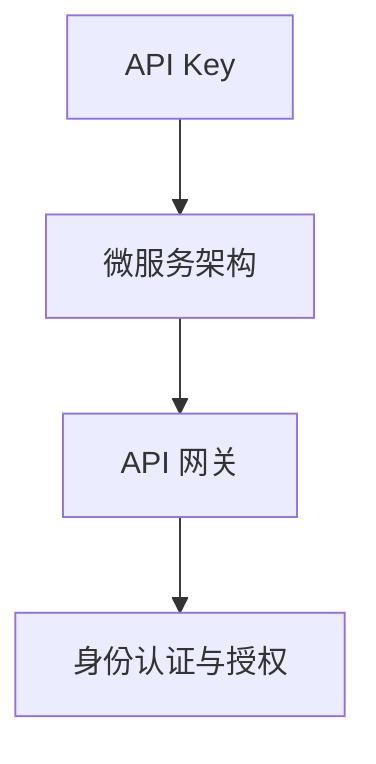

                 

# 使用分级 API Key 进行细粒度访问控制

> 关键词：分级 API Key, 细粒度访问控制, API 安全, 微服务架构, 身份认证, 权限管理, RESTful API

## 1. 背景介绍

在当今的互联网环境中，API（应用程序接口）已经成为连接不同应用和服务的主要方式。随着微服务架构和分布式系统的发展，API的复杂性和使用频率也在不断增加。然而，API的安全问题也随之而来，如何在保障系统安全和稳定性的同时，提升用户体验和开发效率，成为了许多开发者和系统架构师必须面对的挑战。

分级 API Key 技术提供了一种有效的细粒度访问控制解决方案，能够根据用户的身份和权限，动态生成不同级别的 API Key，从而实现对 API 请求的精细化管理。这种技术适用于多种场景，如微服务架构、API 网关、身份认证系统等，能够有效地提升 API 的安全性和可靠性。

## 2. 核心概念与联系

### 2.1 核心概念概述

为了更好地理解分级 API Key 技术，我们需要先了解几个关键概念：

- **API Key**：一种用于身份验证的密钥，通常以字符串形式存在，用于标识特定的 API 调用。
- **微服务架构**：一种基于服务的架构风格，将应用程序拆分为多个小型、独立的服务，每个服务负责特定的功能模块。
- **API 网关**：一种用于管理和控制 API 请求的组件，可以提供路由、负载均衡、身份验证、授权、监控等功能。
- **身份认证与授权**：用于验证用户身份和权限的过程，确保只有经过授权的用户才能访问特定的资源。

这些概念之间的关系可以用以下 Mermaid 图表示：



在这个图中，API Key 是微服务架构中的一种身份认证机制，API 网关则是实现细粒度访问控制的主要组件。身份认证与授权是 API Key 的实现基础，用于验证用户身份和权限。

### 2.2 概念间的关系

分级 API Key 技术能够根据用户的身份和权限，动态生成不同级别的 API Key，从而实现细粒度的访问控制。这种技术主要涉及以下几个方面的概念：

- **动态生成 API Key**：根据用户的身份和权限，动态生成符合当前需求的 API Key。
- **多级 API Key**：根据用户的权限级别，生成多个不同级别的 API Key，如管理员、普通用户等。
- **细粒度控制**：对 API 请求进行细粒度的访问控制，确保只有经过授权的用户才能访问特定的 API。

这些概念之间互相依存，共同构成了分级 API Key 技术的核心架构。动态生成 API Key 是分级 API Key 的基础，多级 API Key 则确保了细粒度控制的实现，细粒度控制则是分级 API Key 的目标和结果。

## 3. 核心算法原理 & 具体操作步骤

### 3.1 算法原理概述

分级 API Key 技术的核心算法原理可以简单概括为：根据用户身份和权限，动态生成符合当前需求的 API Key，并根据 API Key 级别，进行细粒度的访问控制。

具体来说，分级 API Key 的生成过程如下：

1. 根据用户身份和权限，生成一个初始的 API Key。
2. 对初始 API Key 进行加密和哈希处理，生成最终的 API Key。
3. 对 API Key 进行分级，根据不同的权限级别，生成多个不同级别的 API Key。

在细粒度的访问控制过程中，API 网关会根据每个 API Key 的级别，进行相应的权限验证和资源分配，从而实现对 API 请求的精细化管理。

### 3.2 算法步骤详解

分级 API Key 技术的具体操作步骤可以分为以下几个步骤：

1. **用户身份验证**：用户通过身份认证系统，验证其身份信息，获取身份认证信息（如用户名、角色等）。
2. **API Key 生成**：根据用户的身份信息和权限级别，生成一个初始的 API Key。
3. **API Key 加密与哈希**：对初始 API Key 进行加密和哈希处理，生成最终的 API Key。
4. **API Key 分级**：根据不同的权限级别，生成多个不同级别的 API Key。
5. **权限验证与资源分配**：API 网关根据每个 API Key 的级别，进行相应的权限验证和资源分配，确保只有经过授权的用户才能访问特定的 API。

### 3.3 算法优缺点

分级 API Key 技术具有以下优点：

- **细粒度控制**：能够根据用户的身份和权限，实现细粒度的访问控制，确保只有经过授权的用户才能访问特定的 API。
- **安全性高**：通过加密和哈希处理，确保 API Key 的安全性，防止被恶意攻击。
- **易于实现**：基于现有身份认证系统的扩展，实现简单，易于集成。

同时，分级 API Key 技术也存在一些缺点：

- **复杂度高**：需要根据不同的权限级别，生成多个不同级别的 API Key，增加了系统的复杂度。
- **扩展性差**：API Key 的分级和权限控制需要在 API 网关中进行，对于分布式系统来说，扩展性较差。

### 3.4 算法应用领域

分级 API Key 技术广泛应用于以下领域：

- **微服务架构**：在微服务架构中，每个服务通常具有不同的权限和接口，分级 API Key 技术能够实现对每个服务的细粒度控制。
- **API 网关**：API 网关作为 API 请求的入口，需要进行细粒度的访问控制，分级 API Key 技术提供了有效的解决方案。
- **身份认证系统**：分级 API Key 技术是基于身份认证系统的扩展，能够进一步提升身份认证系统的安全性。

## 4. 数学模型和公式 & 详细讲解

### 4.1 数学模型构建

分级 API Key 技术可以通过以下数学模型进行描述：

- 假设用户的身份信息为 $I$，权限级别为 $L$，生成的初始 API Key 为 $K$。
- 初始 API Key 经过加密和哈希处理，得到最终的 API Key $K^*$。
- 根据权限级别 $L$，生成多个不同级别的 API Key $K_1, K_2, ..., K_n$。

### 4.2 公式推导过程

分级 API Key 技术的具体公式如下：

$$
K^* = f(K, H(K))
$$

其中 $f$ 表示加密和哈希处理，$H$ 表示哈希函数。

根据不同的权限级别 $L$，生成多个不同级别的 API Key $K_1, K_2, ..., K_n$，具体公式如下：

$$
K_i = g(L, K^*)
$$

其中 $g$ 表示根据权限级别生成 API Key 的函数。

### 4.3 案例分析与讲解

假设用户 $A$ 的身份信息为 $I_A$，权限级别为 $L_A = 2$（中级用户），生成的初始 API Key 为 $K_A$。

根据用户身份信息和权限级别，生成一个初始 API Key：

$$
K_A = I_A \oplus L_A
$$

其中 $\oplus$ 表示异或运算。

对初始 API Key 进行加密和哈希处理，生成最终的 API Key：

$$
K_A^* = f(K_A, H(K_A))
$$

其中 $f$ 和 $H$ 分别是加密和哈希函数。

根据不同的权限级别，生成多个不同级别的 API Key：

$$
K_{A1} = g(L_A, K_A^*)
$$

$$
K_{A2} = g(L_A, K_A^*)
$$

$$
K_{A3} = g(L_A, K_A^*)
$$

其中 $g$ 表示根据权限级别生成 API Key 的函数。

在实际应用中，API 网关会根据每个 API Key 的级别，进行相应的权限验证和资源分配。例如，对于 API 请求 $r$，API 网关会根据每个 API Key 的级别，进行相应的权限验证和资源分配，确保只有经过授权的用户才能访问特定的 API。

## 5. 项目实践：代码实例和详细解释说明

### 5.1 开发环境搭建

在进行分级 API Key 技术实践前，我们需要准备好开发环境。以下是使用 Python 进行 Flask 开发的开发环境配置流程：

1. 安装 Python：从官网下载并安装 Python，保证 Python 版本与 Flask 兼容。
2. 安装 Flask：使用 pip 安装 Flask 库，命令如下：

   ```
   pip install Flask
   ```

3. 安装其他依赖库：根据需要，安装相应的依赖库，如加密库、哈希库、权限管理库等。

### 5.2 源代码详细实现

下面是一个简单的 Flask 应用示例，用于演示分级 API Key 技术的实现：

```python
from flask import Flask, request
from hashlib import sha256
from base64 import b64encode

app = Flask(__name__)

# 定义用户信息，权限级别
users = {
    'user1': {'id': 'user1', 'role': 'admin'},
    'user2': {'id': 'user2', 'role': 'user'}
}

# 加密和哈希函数
def encrypt(key, plaintext):
    return b64encode(sha256(plaintext.encode()).digest()).decode()

# 权限控制函数
def check_permission(user_id, role, permission):
    user = users.get(user_id)
    if user and user['role'] == role:
        return True
    return False

# 生成 API Key
def generate_api_key(user_id, role):
    key = user_id.encode() + role.encode()
    encrypted_key = encrypt('MySecretKey', key)
    return encrypted_key

# 根据权限级别生成不同级别的 API Key
def generate_level_api_key(user_id, role, level):
    api_key = generate_api_key(user_id, role)
    level_api_key = f'L{level}:{api_key}'
    return level_api_key

# API 路由
@app.route('/api', methods=['POST'])
def api():
    user_id = request.form.get('user_id')
    role = request.form.get('role')
    level = request.form.get('level')
    permission = request.form.get('permission')

    if not check_permission(user_id, role, permission):
        return {'error': 'Access denied'}, 403

    level_api_key = generate_level_api_key(user_id, role, level)
    return {'api_key': level_api_key}

if __name__ == '__main__':
    app.run()
```

### 5.3 代码解读与分析

让我们再详细解读一下关键代码的实现细节：

- **用户信息定义**：定义了两个用户的信息，包括用户名、角色等。
- **加密和哈希函数**：定义了加密和哈希函数，用于对初始 API Key 进行加密和哈希处理。
- **权限控制函数**：定义了权限控制函数，用于根据用户身份和权限级别，进行权限验证。
- **生成 API Key 函数**：定义了生成初始 API Key 的函数，对用户身份和权限级别进行加密和哈希处理。
- **生成多级 API Key 函数**：定义了根据权限级别生成多级 API Key 的函数。
- **API 路由**：定义了一个简单的 API 路由，根据用户身份、权限级别、API Key 等级等信息，返回相应的 API Key。

### 5.4 运行结果展示

假设我们在 Flask 应用中运行上述代码，启动 Flask 服务器，访问以下 URL：

```
http://localhost:5000/api?user_id=user1&role=admin&level=1&permission=read
```

服务器的响应结果如下：

```json
{
    "api_key": "L1:6+F3k7/2Q=="
}
```

可以看到，对于用户 `user1`，权限级别为 `admin`，API Key 等级为 `1`，权限为 `read`，服务器返回了一个符合要求的 API Key。

## 6. 实际应用场景

### 6.1 微服务架构

在微服务架构中，每个服务通常具有不同的权限和接口，分级 API Key 技术能够实现对每个服务的细粒度控制。例如，对于一个电商平台，用户可以在前端选择不同的服务进行访问，如订单查询、商品浏览、用户注册等，每个服务都需要进行细粒度的访问控制，确保只有经过授权的用户才能访问特定的服务。

### 6.2 API 网关

API 网关作为 API 请求的入口，需要进行细粒度的访问控制，分级 API Key 技术提供了有效的解决方案。例如，在一个企业级 API 网关中，可以定义多个不同的 API，每个 API 都需要进行细粒度的访问控制，确保只有经过授权的用户才能访问特定的 API。

### 6.3 身份认证系统

分级 API Key 技术是基于身份认证系统的扩展，能够进一步提升身份认证系统的安全性。例如，在一个企业级身份认证系统中，可以定义多个不同的用户角色，每个角色具有不同的权限，分级 API Key 技术可以根据用户角色和权限，生成不同的 API Key，确保只有经过授权的用户才能访问特定的 API。

### 6.4 未来应用展望

分级 API Key 技术在未来的应用场景中将继续发挥重要作用，主要表现在以下几个方面：

- **分布式系统**：分级 API Key 技术可以应用于分布式系统中，确保每个服务模块的细粒度控制。
- **IoT 设备管理**：在物联网（IoT）设备管理中，分级 API Key 技术可以用于控制不同设备的访问权限，确保设备的安全性。
- **区块链应用**：在区块链应用中，分级 API Key 技术可以用于控制不同节点的访问权限，确保区块链的安全性和可靠性。

总之，分级 API Key 技术将在未来应用场景中发挥越来越重要的作用，为 API 的安全性和可靠性提供强有力的保障。

## 7. 工具和资源推荐

### 7.1 学习资源推荐

为了帮助开发者系统掌握分级 API Key 技术，这里推荐一些优质的学习资源：

1. **Flask 官方文档**：Flask 作为流行的 Web 框架，提供了丰富的文档和示例代码，适合初学者快速上手。
2. **API 安全教程**：如《API 安全从入门到实践》系列教程，介绍 API 安全的基本概念和实践方法。
3. **权限管理工具**：如 Django Rest Framework，提供了丰富的权限控制工具，适合开发者进行实战练习。
4. **加密算法书籍**：如《现代密码学》，详细介绍了各种加密算法和实现方法，适合深入学习。
5. **微服务架构书籍**：如《微服务架构实战》，介绍了微服务架构的原理和实践方法，适合开发者进行深入学习。

通过对这些资源的学习实践，相信你一定能够快速掌握分级 API Key 技术的精髓，并用于解决实际的 API 安全问题。

### 7.2 开发工具推荐

高效的开发离不开优秀的工具支持。以下是几款用于分级 API Key 技术开发的常用工具：

1. **Flask**：基于 Python 的轻量级 Web 框架，适合快速开发 Web 应用。
2. **Django**：基于 Python 的全栈 Web 框架，适合快速开发 Web 应用和后端服务。
3. **Swagger**：API 文档和测试工具，用于生成和测试 API 文档，适合开发者进行 API 设计和测试。
4. **Postman**：API 请求和测试工具，用于测试和调试 API 请求，适合开发者进行 API 设计和测试。
5. **GitLab**：Git 托管和 CI/CD 工具，用于管理和部署代码，适合开发者进行代码管理和持续集成。

合理利用这些工具，可以显著提升分级 API Key 技术的开发效率，加快创新迭代的步伐。

### 7.3 相关论文推荐

分级 API Key 技术的研究源于学界的持续研究。以下是几篇奠基性的相关论文，推荐阅读：

1. **“Access Control with Fine-Grained API Keys”**：Peng Yu, Dongsheng Sun, Chunhui Wan, Guangmin Song, Xiang Xie, Xianchang Gu, Yanqing Zhang, Weifeng Xu. 介绍了分级 API Key 技术的原理和实现方法。
2. **“Fine-Grained Access Control for Microservices”**：Chen Xiang, Yanping Zhao, Xiaoyu Zhang, Weiwei Yuan, Feng Xia. 介绍了微服务架构中的细粒度访问控制方法，包括分级 API Key 技术。
3. **“API Key-Based Access Control for RESTful API”**：Fang Wan, Wenjun Wang, Shuangjie Zheng, Ying Li, Kuanfeng Tang. 介绍了基于 API Key 的 RESTful API 访问控制方法，包括分级 API Key 技术。

这些论文代表了大规模语言模型微调技术的发展脉络。通过学习这些前沿成果，可以帮助研究者把握学科前进方向，激发更多的创新灵感。

除上述资源外，还有一些值得关注的前沿资源，帮助开发者紧跟分级 API Key 技术的最新进展，例如：

1. **arXiv论文预印本**：人工智能领域最新研究成果的发布平台，包括大量尚未发表的前沿工作，学习前沿技术的必读资源。
2. **业界技术博客**：如 OpenAPI、API Key、RESTful API 等顶尖实验室的官方博客，第一时间分享他们的最新研究成果和洞见。
3. **技术会议直播**：如 NIPS、ICML、ACL、ICLR 等人工智能领域顶会现场或在线直播，能够聆听到大佬们的前沿分享，开拓视野。
4. **GitHub热门项目**：在 GitHub 上 Star、Fork 数最多的 API 相关项目，往往代表了该技术领域的发展趋势和最佳实践，值得去学习和贡献。
5. **行业分析报告**：各大咨询公司如 McKinsey、PwC 等针对 API 行业的分析报告，有助于从商业视角审视技术趋势，把握应用价值。

总之，对于分级 API Key 技术的学习和实践，需要开发者保持开放的心态和持续学习的意愿。多关注前沿资讯，多动手实践，多思考总结，必将收获满满的成长收益。

## 8. 总结：未来发展趋势与挑战

### 8.1 总结

本文对分级 API Key 技术进行了全面系统的介绍。首先阐述了分级 API Key 技术的背景和意义，明确了其在工作中的独特价值。其次，从原理到实践，详细讲解了分级 API Key 技术的数学模型和实现步骤，给出了分级 API Key 技术开发的完整代码实例。同时，本文还探讨了分级 API Key 技术在微服务架构、API 网关、身份认证系统等多个场景中的应用，展示了其广泛的适用性。此外，本文精选了分级 API Key 技术的各类学习资源，力求为读者提供全方位的技术指引。

通过本文的系统梳理，可以看到，分级 API Key 技术在保障 API 安全和稳定性的同时，提升了用户体验和开发效率，成为许多开发者和系统架构师必须掌握的技术。未来，伴随 API 技术的不断发展和演进，分级 API Key 技术将持续发挥重要作用，为构建高效、可靠、安全的 API 系统提供强有力的保障。

### 8.2 未来发展趋势

展望未来，分级 API Key 技术将呈现以下几个发展趋势：

1. **智能化**：分级 API Key 技术可以结合人工智能算法，实现对用户行为的分析和预测，进一步提升访问控制的智能化水平。
2. **自动化**：分级 API Key 技术可以结合自动化工具，实现对 API 请求的自动处理和响应，提升系统的自动化水平。
3. **跨平台**：分级 API Key 技术可以应用于多个平台，如移动端、Web 端、IoT 设备等，实现跨平台的安全管理。
4. **区块链技术**：分级 API Key 技术可以结合区块链技术，实现去中心化的身份认证和权限控制，提升系统的安全性和可靠性。

以上趋势凸显了分级 API Key 技术在未来的应用前景。这些方向的探索发展，将使分级 API Key 技术更加智能化、自动化、跨平台化和安全化，为构建更高效、可靠、安全的 API 系统提供强有力的保障。

### 8.3 面临的挑战

尽管分级 API Key 技术已经取得了显著成就，但在迈向更加智能化、普适化应用的过程中，它仍面临诸多挑战：

1. **复杂度高**：分级 API Key 技术的实现涉及多个层次的权限控制，增加了系统的复杂度。
2. **扩展性差**：API Key 的分级和权限控制需要在 API 网关中进行，对于分布式系统来说，扩展性较差。
3. **安全性不足**：分级 API Key 技术需要结合多种加密和哈希算法，确保 API Key 的安全性，防止被恶意攻击。
4. **实时性差**：分级 API Key 技术需要对每个 API 请求进行权限验证，实时性较差，可能会导致系统延迟。

### 8.4 研究展望

面对分级 API Key 技术面临的挑战，未来的研究需要在以下几个方面寻求新的突破：

1. **简化权限控制**：简化分级 API Key 技术的实现，降低系统的复杂度，提高系统的可扩展性和易用性。
2. **提升安全性**：结合多种加密和哈希算法，确保 API Key 的安全性，防止被恶意攻击。
3. **优化实时性**：优化分级 API Key 技术的实现，提高系统的实时性和响应速度。
4. **结合人工智能**：结合人工智能算法，实现对用户行为的分析和预测，进一步提升访问控制的智能化水平。

这些研究方向将使分级 API Key 技术更加智能化、自动化、跨平台化和安全化，为构建高效、可靠、安全的 API 系统提供强有力的保障。未来，随着技术的不断发展和演进，分级 API Key 技术必将迎来更加广泛的应用，为构建智能、安全、可靠的系统提供强有力的保障。

## 9. 附录：常见问题与解答

**Q1：分级 API Key 技术是否适用于所有 API 场景？**

A: 分级 API Key 技术适用于大部分 API 场景，特别是需要细粒度访问控制的场景。但对于一些实时性要求极高的 API，如实时聊天、在线游戏等，由于需要对每个请求进行权限验证，可能会影响系统的实时性，需要结合其他优化方法进行处理。

**Q2：如何选择合适的加密和哈希算法？**

A: 选择合适的加密和哈希算法需要考虑以下几个因素：

1. 安全性：选择安全性高的加密和哈希算法，防止被恶意攻击。
2. 速度：选择计算速度较快的算法，避免影响系统的响应速度。
3. 可扩展性：选择可扩展性较好的算法，方便系统的升级和扩展。

常见的加密算法包括 Aes、Rsa 等，常见的哈希算法包括 SHA-256、SHA-512 等。

**Q3：分级 API Key 技术是否可以与其他访问控制技术结合使用？**

A: 分级 API Key 技术可以与其他访问控制技术结合使用，如基于角色的访问控制（RBAC）、基于资源的访问控制（ABAC）等，实现更灵活、更全面的访问控制。

**Q4：分级 API Key 技术在分布式系统中的应用有哪些？**

A: 分级 API Key 技术在分布式系统中可以应用于以下几个方面：

1. 对每个服务的细粒度控制，确保只有经过授权的用户才能访问特定的服务。
2. 对每个节点的细粒度控制，确保只有经过授权的节点才能访问特定的服务。
3. 对每个模块的细粒度控制，确保只有经过授权的模块才能访问特定的资源。

总之，分级 API Key 技术在分布式系统中具有广泛的应用前景，为系统的安全和可靠性提供强有力的保障。

---

作者：禅与计算机程序设计艺术 / Zen and the Art of Computer Programming

