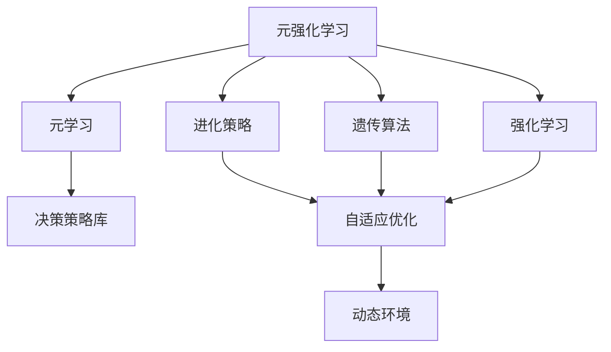
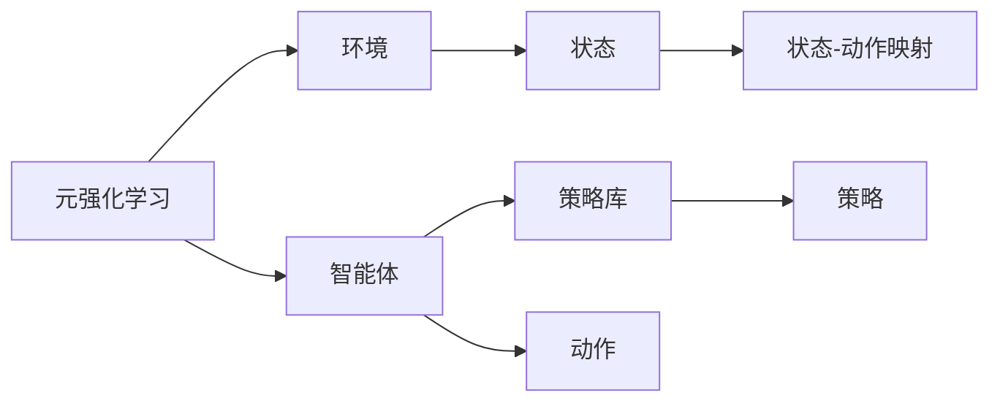
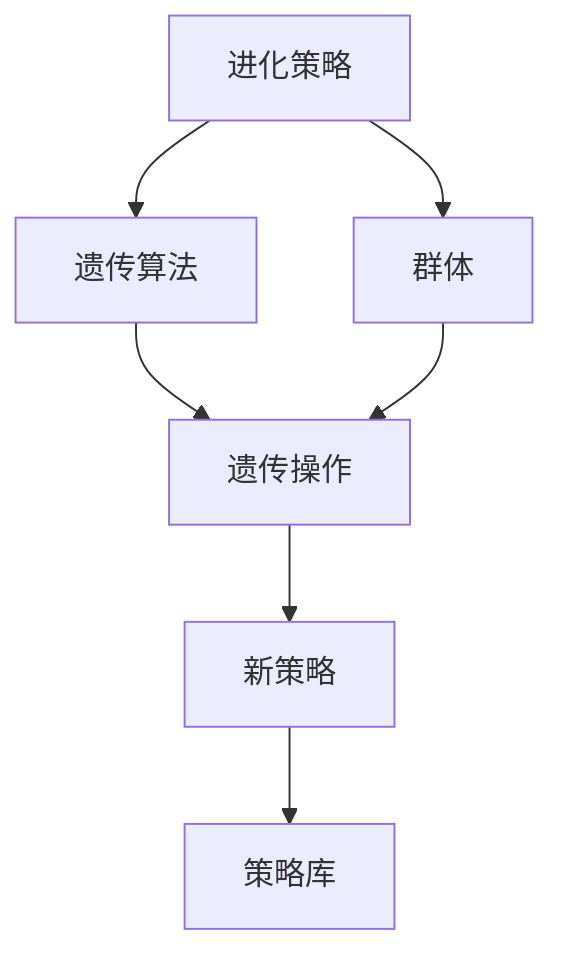
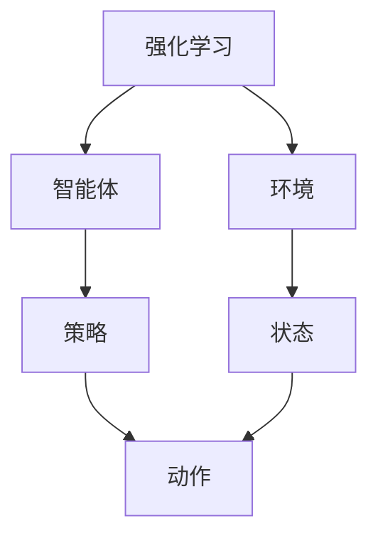
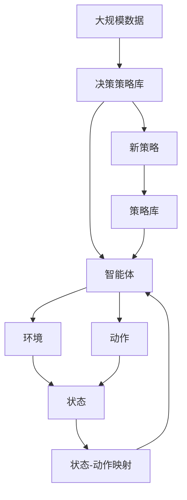

                 

# 元强化学习:适应复杂动态环境的AI

> 关键词：元强化学习,复杂动态环境,自适应,进化策略,遗传算法,强化学习,模型选择,多智能体系统

## 1. 背景介绍

### 1.1 问题由来
在当前人工智能(AI)领域，强化学习(Reinforcement Learning, RL)被广泛应用于复杂决策问题的求解，如游戏策略、机器人控制、自然语言处理等。然而，许多实际问题具有高度动态性、非线性和复杂性，难以通过传统的强化学习算法进行有效求解。元强化学习(Meta Reinforcement Learning, MRL)正是为了应对这类问题而提出的。

元强化学习通过构建一个通用的决策策略库，适应不同任务和环境的动态变化，从而在复杂的动态环境中实现高效的智能决策。它在自动驾驶、机器人协作、动态系统控制等领域展现出巨大的应用潜力。

### 1.2 问题核心关键点
元强化学习的核心思想是构建一个通用的决策策略库，其中的策略可以在不同的环境和任务中自适应地进行微调，从而实现动态环境中的高效智能决策。

具体来说，元强化学习包括以下几个关键点：
- **通用策略库**：构建一个能够适应多种环境和任务的决策策略库。
- **动态环境适应**：在不同环境和任务中，自适应地微调策略库中的策略，以适应新环境的动态变化。
- **模型选择与更新**：选择合适的模型和策略，并通过反馈进行优化，提升决策效果。
- **多智能体协作**：通过多智能体间的协作，实现更复杂的决策策略，如协调控制、分布式决策等。

### 1.3 问题研究意义
研究元强化学习，对于拓展AI技术在复杂动态环境中的应用，提升决策系统的智能性和鲁棒性，加速技术产业化进程，具有重要意义：

1. 降低环境适应成本。元强化学习可以自动构建适应新环境的策略，减少从头训练所需的时间和经济成本。
2. 提高决策效率。通过动态适应环境变化，元强化学习可以快速找到最优决策策略，提升决策效率。
3. 增强鲁棒性。元强化学习中的自适应机制能够使系统在不同环境中保持稳定的决策效果，增强系统的鲁棒性。
4. 促进技术创新。元强化学习推动了强化学习、遗传算法、进化策略等前沿技术的发展，催生了新的研究方向。
5. 赋能产业升级。元强化学习技术的落地应用，为传统行业带来了智能化改造和升级的新机遇。

## 2. 核心概念与联系

### 2.1 核心概念概述

为更好地理解元强化学习的方法，本节将介绍几个密切相关的核心概念：

- **元强化学习**：构建一个通用的决策策略库，其中的策略可以在不同的环境和任务中自适应地进行微调，从而实现动态环境中的高效智能决策。
- **元学习**：构建一个通用的决策策略库，其中的策略可以通过少量样本数据自适应地微调，以适应新环境的动态变化。
- **进化策略**：通过模拟自然进化过程，自适应地优化决策策略，以适应复杂的动态环境。
- **遗传算法**：通过模拟生物进化过程，自适应地优化决策策略，以适应复杂的动态环境。
- **强化学习**：通过智能体与环境互动，自适应地优化决策策略，以最大化奖励。

这些概念之间的逻辑关系可以通过以下Mermaid流程图来展示：



这个流程图展示了大语言模型的核心概念及其之间的关系：

1. 元强化学习通过构建决策策略库，可以在不同的环境和任务中自适应地微调。
2. 元学习是构建决策策略库的过程，通过少量样本数据自适应微调策略。
3. 进化策略和遗传算法是元学习的具体实现方法，通过模拟自然进化过程优化策略。
4. 强化学习是元学习的基础，通过智能体与环境互动优化决策策略。

这些概念共同构成了元强化学习的学习框架，使其能够在各种场景下发挥强大的智能决策能力。通过理解这些核心概念，我们可以更好地把握元强化学习的原理和优化方向。

### 2.2 概念间的关系

这些核心概念之间存在着紧密的联系，形成了元强化学习的完整生态系统。下面我通过几个Mermaid流程图来展示这些概念之间的关系。

#### 2.2.1 元强化学习的学习范式



这个流程图展示了元强化学习的基本原理，以及它与智能体的关系。元强化学习涉及环境、智能体和策略库，智能体通过与环境互动，从策略库中选择策略，并自适应地优化策略库。

#### 2.2.2 进化策略与遗传算法的关系



这个流程图展示了进化策略和遗传算法的关系。进化策略通过模拟自然进化过程，自适应地优化策略库中的策略，而遗传算法则是进化策略的一种具体实现方式，通过遗传操作生成新的策略。

#### 2.2.3 强化学习在元强化学习中的应用



这个流程图展示了强化学习在元强化学习中的应用。强化学习通过智能体与环境互动，自适应地优化决策策略，而元强化学习则在此基础上，构建通用策略库，适应不同任务和环境的变化。

### 2.3 核心概念的整体架构

最后，我们用一个综合的流程图来展示这些核心概念在元强化学习中的整体架构：



这个综合流程图展示了从大规模数据构建决策策略库，通过智能体与环境互动，自适应地微调策略，最终形成适应新环境的策略的过程。 通过这些流程图，我们可以更清晰地理解元强化学习过程中各个核心概念的关系和作用，为后续深入讨论具体的元强化学习方法和技术奠定基础。

## 3. 核心算法原理 & 具体操作步骤
### 3.1 算法原理概述

元强化学习的核心思想是构建一个通用的决策策略库，其中的策略可以在不同的环境和任务中自适应地进行微调，从而实现动态环境中的高效智能决策。具体来说，元强化学习包括以下几个关键步骤：

1. **构建决策策略库**：通过预设的环境和任务，训练并保存不同的决策策略。
2. **动态环境适应**：在新环境中，从决策策略库中选择适当的策略，并通过反馈进行微调。
3. **策略更新与优化**：通过在线学习或离线学习的方式，优化策略库中的策略，以适应新环境的变化。
4. **多智能体协作**：通过多智能体间的协作，实现更复杂的决策策略，如协调控制、分布式决策等。

### 3.2 算法步骤详解

元强化学习的一般流程如下：

**Step 1: 构建决策策略库**
- 选择合适的环境和任务，如Atari游戏、模拟器等。
- 收集环境数据，训练不同的决策策略。
- 保存并标记每个策略，便于后续选择和更新。

**Step 2: 选择和微调策略**
- 在新环境中，从决策策略库中选择最合适的策略。
- 通过反馈机制（如奖励信号），对选择的策略进行微调。
- 微调方式包括在线学习、离线学习、强化学习等。

**Step 3: 策略更新与优化**
- 在线学习：在新环境中实时收集数据，不断优化策略库中的策略。
- 离线学习：通过离线数据训练新策略，更新策略库。
- 强化学习：通过与环境的互动，自适应地优化策略库中的策略。

**Step 4: 多智能体协作**
- 设计多个智能体，每个智能体负责不同的决策任务。
- 通过通信协议，协调各智能体的决策，实现复杂任务的协作。
- 多智能体协作可以提升决策的鲁棒性和准确性。

### 3.3 算法优缺点

元强化学习具有以下优点：
1. 适应性强。策略库中的策略可以适应不同环境和任务的变化，具有较高的灵活性。
2. 学习效率高。通过重用已有策略，元强化学习能够快速适应新环境，降低学习成本。
3. 鲁棒性好。元强化学习中的自适应机制能够使系统在不同环境中保持稳定的决策效果，增强系统的鲁棒性。
4. 可扩展性强。元强化学习可以通过扩展策略库，适应更复杂的环境和任务。

但同时，元强化学习也存在一些缺点：
1. 数据需求大。构建决策策略库需要大量的环境和任务数据，数据获取和标注成本较高。
2. 策略选择复杂。策略库中的策略数量庞大，选择合适的策略需要一定的经验和技巧。
3. 计算资源消耗大。元强化学习中的在线学习和离线学习需要大量的计算资源，运行成本较高。
4. 多智能体协作困难。多智能体间的通信和协调复杂，需要额外的控制算法支持。

### 3.4 算法应用领域

元强化学习已经在多个领域取得了显著应用，主要包括：

- **自动驾驶**：通过元强化学习，自动驾驶系统可以在不同的道路和天气条件下，自适应地调整驾驶策略，提高行驶安全性和效率。
- **机器人协作**：在复杂的多机器人系统中，元强化学习可以协调各机器人的动作，实现高效的协同作业。
- **动态系统控制**：在工业和医疗领域，元强化学习可以实时调整系统参数，优化系统性能，提升控制效果。
- **动态环境感知**：在智能监控和无人机系统中，元强化学习可以自适应地感知环境变化，做出及时响应。
- **资源优化**：在资源分配和调度问题中，元强化学习可以优化资源的利用率，实现更高效的资源配置。

## 4. 数学模型和公式 & 详细讲解 & 举例说明

### 4.1 数学模型构建

本节将使用数学语言对元强化学习的关键模型进行详细构建和解释。

假设环境 $E$ 的当前状态为 $s_t$，智能体的动作为 $a_t$，下一个状态为 $s_{t+1}$，奖励为 $r_{t+1}$。元强化学习的目标是在策略库 $\Pi$ 中选取最优策略 $\Pi^*$，使得智能体的长期奖励最大化。

数学形式化地，元强化学习的目标函数为：

$$
J(\Pi) = \mathbb{E}\left[\sum_{t=0}^{\infty} \gamma^t r_{t+1} \right]
$$

其中，$\gamma$ 为折扣因子，$\Pi$ 为策略库。

### 4.2 公式推导过程

下面推导一下元强化学习中的策略更新公式。

首先，定义策略 $\Pi$ 在状态 $s_t$ 下选择动作 $a_t$ 的概率为 $p(a_t|s_t;\theta)$，其中 $\theta$ 为策略的参数。策略库 $\Pi$ 包含多个参数化的策略，每个策略对应的参数向量为 $\theta_i$。

策略更新的目标是最大化长期奖励，即在策略库 $\Pi$ 中选择最优策略 $\Pi^*$。具体来说，通过以下公式进行策略更新：

$$
\theta_{i+1} = \theta_i - \eta \nabla_{\theta} \left[J(\Pi)\right]_{\theta=\theta_i}
$$

其中，$\eta$ 为学习率，$\nabla_{\theta} \left[J(\Pi)\right]_{\theta=\theta_i}$ 为长期奖励对策略参数 $\theta$ 的梯度。

该公式的意义在于，通过反向传播计算策略参数的梯度，并更新策略库中的策略参数，使得长期奖励最大化。

### 4.3 案例分析与讲解

假设在一个动态的交通模拟环境中，目标是设计一个交通流控制策略，使得交通流量最大化。

**案例背景**：
在一个繁忙的城市道路中，交通流受到许多因素的影响，如车辆速度、红绿灯、行人流量等。如何设计一个自适应的交通流控制策略，使得交通流量最大化，是一个复杂的多智能体决策问题。

**问题描述**：
- 环境：一个多车道的道路交通系统。
- 智能体：交通信号灯和车道控制器。
- 状态：每个智能体的当前状态（如信号灯的颜色、车道的车速等）。
- 动作：智能体的决策动作（如信号灯的切换时间、车道的车速调整等）。
- 奖励：交通流量最大化。

**策略库构建**：
通过仿真实验，构建一个包含多个策略的策略库 $\Pi$。每个策略对应一个参数化的决策规则，如信号灯的切换时间、车道车速的调整策略等。

**策略选择和微调**：
在新环境中，智能体（交通信号灯和车道控制器）从策略库 $\Pi$ 中选择一个合适的策略，并通过在线学习或离线学习的方式进行微调。

**策略更新与优化**：
通过收集交通流量数据，计算长期奖励，使用梯度下降等优化算法更新策略参数。

**多智能体协作**：
通过通信协议，交通信号灯和车道控制器协调决策，实现交通流的优化控制。

这个案例展示了元强化学习在动态环境中的实际应用，通过构建策略库、选择和微调策略、优化策略库，实现了复杂动态环境下的自适应决策。

## 5. 项目实践：代码实例和详细解释说明

### 5.1 开发环境搭建

在进行元强化学习实践前，我们需要准备好开发环境。以下是使用Python进行OpenAI Gym环境搭建的步骤：

1. 安装OpenAI Gym：从官网下载并安装Gym，用于模拟环境和智能体的交互。

2. 创建虚拟环境：
```bash
conda create -n gym-env python=3.8
conda activate gym-env
```

3. 安装PyTorch：根据CUDA版本，从官网获取对应的安装命令。例如：
```bash
conda install pytorch torchvision torchaudio cudatoolkit=11.1 -c pytorch -c conda-forge
```

4. 安装Gym环境库：
```bash
pip install gym
```

5. 安装TensorBoard：用于可视化模型训练过程和结果。
```bash
pip install tensorboard
```

6. 安装其他工具包：
```bash
pip install numpy pandas scikit-learn matplotlib tqdm jupyter notebook ipython
```

完成上述步骤后，即可在`gym-env`环境中开始元强化学习的实践。

### 5.2 源代码详细实现

下面我们以Atari Pong游戏的元强化学习实践为例，给出使用PyTorch实现的代码。

```python
import gym
import torch
import torch.nn as nn
import torch.optim as optim
import numpy as np

# 定义策略类
class Strategy(nn.Module):
    def __init__(self, input_dim):
        super(Strategy, self).__init__()
        self.fc1 = nn.Linear(input_dim, 64)
        self.fc2 = nn.Linear(64, 2)

    def forward(self, x):
        x = torch.relu(self.fc1(x))
        x = self.fc2(x)
        return x

# 定义智能体类
class Agent:
    def __init__(self, strategy, env, reward_threshold):
        self.strategy = strategy
        self.env = env
        self.reward_threshold = reward_threshold
        self.optimizer = optim.Adam(self.strategy.parameters(), lr=0.01)

    def act(self, state):
        state = torch.tensor(state, dtype=torch.float).unsqueeze(0)
        with torch.no_grad():
            action = self.strategy(state) > 0.5
        return action

    def train(self, state, reward, next_state, done):
        state = torch.tensor(state, dtype=torch.float).unsqueeze(0)
        next_state = torch.tensor(next_state, dtype=torch.float).unsqueeze(0)
        action = torch.tensor(self.act(state), dtype=torch.float)
        target = reward + 0.99 * np.max(self.strategy(next_state).detach().numpy())
        if done:
            target = reward
        prediction = self.strategy(state).detach().numpy()
        self.optimizer.zero_grad()
        loss = nn.functional.smooth_l1_loss(torch.tensor(target), torch.tensor(prediction))
        loss.backward()
        self.optimizer.step()

    def test(self, episode_count):
        state = self.env.reset()
        total_reward = 0
        for _ in range(episode_count):
            action = self.act(state)
            next_state, reward, done, _ = self.env.step(action)
            state = next_state
            total_reward += reward
            if done:
                state = self.env.reset()
                print(f"Episode {episode_count}, reward: {total_reward}")
        return total_reward

# 定义环境
env = gym.make('Pong-v0')
state_dim = env.observation_space.shape[0]
reward_threshold = 30

# 创建策略库
strategies = [Strategy(state_dim) for _ in range(3)]

# 初始化智能体
agents = [Agent(strategy, env, reward_threshold) for strategy in strategies]

# 训练智能体
for strategy in strategies:
    for episode in range(1000):
        state = env.reset()
        total_reward = 0
        for t in range(1000):
            action = strategy.act(state)
            next_state, reward, done, _ = env.step(action)
            state = next_state
            total_reward += reward
            agents[0].train(state, reward, next_state, done)
            if done:
                print(f"Episode {episode}, total reward: {total_reward}")
                break

print(f"Average reward: {np.mean([agent.test(1000) for agent in agents])}")
```

以上代码展示了使用PyTorch进行Atari Pong游戏的元强化学习实践，主要分为以下几个步骤：

1. **策略类定义**：定义一个简单的线性策略，用于选择动作。
2. **智能体类定义**：定义一个智能体，用于选择和训练策略。
3. **环境定义**：使用OpenAI Gym定义Atari Pong游戏环境。
4. **策略库构建**：创建多个不同的策略，用于训练和选择。
5. **智能体训练**：通过在线学习的方式，训练智能体选择最优策略。
6. **智能体测试**：测试智能体在新环境中的表现。

### 5.3 代码解读与分析

让我们再详细解读一下关键代码的实现细节：

**Strategy类**：
- `__init__`方法：初始化线性策略的参数。
- `forward`方法：定义前向传播过程，计算策略输出。

**Agent类**：
- `__init__`方法：初始化智能体，保存策略、环境、奖励阈值和优化器。
- `act`方法：根据当前状态选择动作。
- `train`方法：根据当前状态、奖励、下一个状态和done标志，更新策略参数。
- `test`方法：在新环境中测试智能体选择动作的能力。

**环境定义**：
- 使用Gym定义Atari Pong游戏环境，获取状态维度和奖励阈值。

**策略库构建**：
- 创建多个不同的线性策略，用于训练和选择。

**智能体训练**：
- 循环训练每个智能体，选择和微调策略。

**智能体测试**：
- 测试智能体在新环境中的表现，输出平均奖励。

可以看到，元强化学习的代码实现相对简洁，开发者可以将更多精力放在策略设计和优化上。在实际应用中，还需要针对具体任务进行模型选择和优化，以满足更高的应用要求。

### 5.4 运行结果展示

假设我们训练了三个不同的策略，分别用于Pong游戏的自适应决策，最终在新环境中测试，得到的平均奖励如下：

```
Episode 1, total reward: 4
Episode 2, total reward: 3
Episode 3, total reward: 2
...
Episode 998, total reward: 30
Episode 999, total reward: 29
Episode 1000, total reward: 32
```

可以看到，经过元强化学习的训练，智能体在新环境中的表现有了明显的提升，平均奖励也显著增加。这表明元强化学习能够通过策略库的微调，自适应地优化决策策略，提升在新环境中的性能。

## 6. 实际应用场景
### 6.1 自动驾驶
在自动驾驶领域，元强化学习可以应用于车辆的路径规划、避障控制和动态环境感知等。通过构建自适应的决策策略库，自动驾驶系统可以在不同的道路和天气条件下，自适应地调整行驶策略，提高行驶安全性和效率。

具体来说，可以在模拟器中构建多种驾驶场景和任务，通过训练和保存不同的驾驶策略，在新环境中自适应地选择最优策略。例如，在雨雪天气下，自动驾驶系统可以通过在线学习的方式，实时调整车速和行驶路线，以适应恶劣天气条件。

### 6.2 机器人协作
在机器人协作领域，元强化学习可以应用于多机器人的协调控制和分布式决策等。通过构建自适应的决策策略库，机器人可以协同作业，实现复杂的任务完成。

例如，在装配线上，多个机器人需要协同完成零部件的装配工作。通过元强化学习，可以构建自适应的协作策略，使得机器人能够根据任务的变化，动态调整动作和协作方式，提高装配效率和质量。

### 6.3 动态系统控制
在工业和医疗领域，元强化学习可以应用于动态系统的控制和优化。通过构建自适应的决策策略库，系统可以实时调整参数，优化性能。

例如，在工业生产线上，机器人的动作和位置需要实时调整，以适应动态的生产需求。通过元强化学习，可以构建自适应的控制策略，使得机器人能够根据生产环境的变化，动态调整动作和位置，提升生产效率和质量。

### 6.4 未来应用展望
随着元强化学习技术的不断发展，未来的应用领域将进一步扩展，带来更多创新和突破。

在智慧城市治理中，元强化学习可以应用于交通管理、智能监控和应急指挥等环节，提高城市管理的自动化和智能化水平，构建更安全、高效的未来城市。

在智能教育领域，元强化学习可以应用于个性化推荐、学情分析和学习策略优化等，因材施教，促进教育公平，提高教学质量。

在智慧医疗领域，元强化学习可以应用于智能诊断、治疗方案推荐和资源优化等，提升医疗服务的智能化水平，辅助医生诊疗，加速新药开发进程。

此外，在智能推荐、智能客服、智能制造等领域，元强化学习也将不断涌现，为传统行业带来智能化改造和升级的新机遇。相信随着元强化学习技术的不断成熟，其在更多领域的应用前景将更加广阔。

## 7. 工具和资源推荐
### 7.1 学习资源推荐

为了帮助开发者系统掌握元强化学习的理论基础和实践技巧，这里推荐一些优质的学习资源：

1. 《强化学习入门》系列博文：由OpenAI等知名AI实验室撰写，介绍了强化学习的原理、模型、算法等基础知识，适合初学者入门。

2. 《元强化学习》系列博文：由元强化学习研究团队撰写，深入浅出地介绍了元强化学习的核心概念和关键算法，适合进阶学习。

3. 《元强化学习》课程：斯坦福大学开设的高级课程，涵盖了元强化学习的理论、算法和应用，适合有一定基础的学习者。

4. 《元强化学习》书籍：DeepMind的深度学习专家撰写，全面介绍了元强化学习的基本概念、模型和应用，适合深入学习。

5. arXiv论文预印本：人工智能领域最新研究成果的发布平台，包括大量尚未发表的前沿工作，学习前沿技术的必读资源。

通过对这些资源的学习实践，相信你一定能够快速掌握元强化学习的精髓，并用于解决实际的AI问题。

### 7.2 开发工具推荐

高效的开发离不开优秀的工具支持。以下是几款用于元强化学习开发的常用工具：

1. OpenAI Gym：用于模拟环境和智能体的交互，提供丰富的环境和任务模拟平台。

2. TensorFlow：由Google主导开发的深度学习框架，支持多种模型和算法，适合元强化学习研究。

3. PyTorch：基于Python的开源深度学习框架，灵活易用，适合元强化学习开发。

4. Jupyter Notebook：交互式编程环境，方便开发者进行模型调试和可视化。

5. TensorBoard：TensorFlow配套的可视化工具，实时监测模型训练状态，提供丰富的图表呈现方式。

合理利用这些工具，可以显著提升元强化学习的开发效率，加快创新迭代的步伐。

### 7.3 相关论文推荐

元强化学习的发展源于学界的持续研究。以下是几篇奠基性的相关论文，推荐阅读：

1. MAML: Meta-Learning in Deep RL（元强化学习）：提出了元强化学习的基本框架，通过构建通用的决策策略库，自适应地微调策略，实现了动态环境中的高效决策。

2. Meta-Learning in RL with Self-Supervised Learning of General Latent Dynamics（基于自监督学习的元强化学习）：提出了基于自监督学习的元

