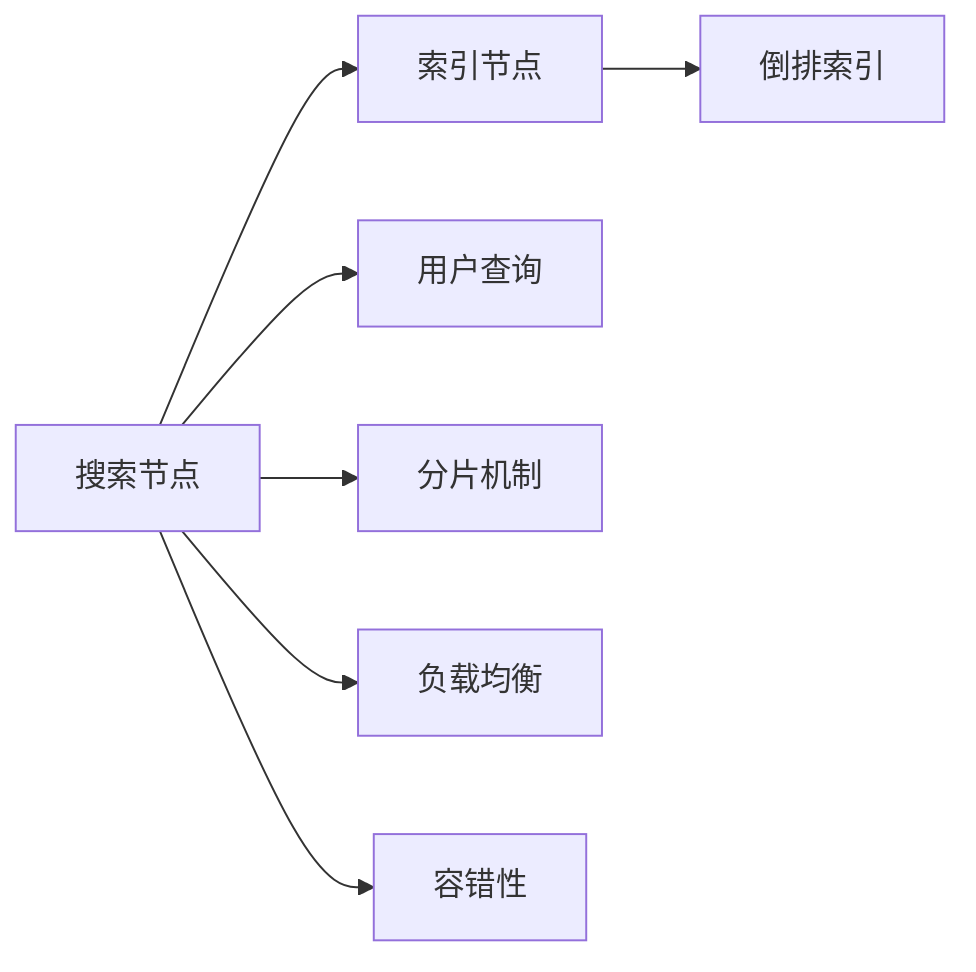

                 

# 分布式搜索 原理与代码实例讲解

> 关键词：分布式搜索, 搜索引擎, 索引构建, 分片机制, 负载均衡, 容错性, 分布式算法

## 1. 背景介绍

### 1.1 问题由来
在互联网时代，信息爆炸的背景下，如何高效地检索到所需的信息成为了用户最大的痛点。传统的集中式搜索方式无法满足海量数据存储和查询的需求，分布式搜索引擎应运而生。谷歌、百度等巨头基于分布式搜索引擎技术构建了全球领先的搜索平台。然而，分布式搜索引擎的设计复杂，涉及数据分布、负载均衡、容错处理等多方面的问题，使得它的设计和实现难度颇高。本文将深入探讨分布式搜索引擎的设计原理和核心算法，并结合具体的代码实例讲解其实现细节。

## 2. 核心概念与联系

### 2.1 核心概念概述

分布式搜索引擎是一个由多个节点构成的系统，这些节点通常被分为两类：搜索节点（Search Nodes）和索引节点（Index Nodes）。搜索节点负责处理用户的查询请求，并分布式地检索索引节点上的数据。索引节点则负责存储和维护倒排索引（Inverted Index），将文档与关键字关联起来，以便搜索节点能够快速定位相关文档。

#### 2.1.1 搜索节点（Search Nodes）

搜索节点是用户与搜索引擎交互的前端，负责处理用户输入的查询，并将其分解成多个小的子查询，分别发送到索引节点上进行处理。搜索节点通常会根据一些策略将查询路由到合适的索引节点上，以提升查询效率和负载均衡。

#### 2.1.2 索引节点（Index Nodes）

索引节点负责存储和维护倒排索引，倒排索引是一个从关键字到文档列表的数据结构，用于快速定位到包含特定关键字的文档。索引节点通常会分布在多个服务器上，以提高系统的容错性和可扩展性。

#### 2.1.3 倒排索引（Inverted Index）

倒排索引是搜索引擎的核心数据结构，它将每个文档与其中的关键字关联起来，便于快速定位到包含特定关键字的文档。倒排索引通常由若干个小的倒排列表组成，每个倒排列表对应一个关键字，列出了所有包含该关键字的文档及其出现的位置。

#### 2.1.4 分片（Shard）

分片是将索引节点划分为多个小的部分，每个部分称为一个分片。分片通常会根据数据的地理位置、时间戳等属性进行划分，以便在物理上分散存储，同时提升系统的容错性和扩展性。

#### 2.1.5 负载均衡（Load Balancing）

负载均衡是指将查询请求分布式地分发到各个索引节点上，以避免某个节点负载过重，影响整个系统的性能。负载均衡通常通过哈希算法、轮询算法等方式实现。

#### 2.1.6 容错性（Fault Tolerance）

容错性是指在节点故障或网络异常的情况下，系统仍能继续正常运行，并保证数据的一致性和可用性。容错性通常通过数据冗余、备份机制等方式实现。

### 2.2 核心概念间的关系

这些核心概念通过复杂的相互作用和配合，构建了分布式搜索引擎的完整架构。下面我们通过几个Mermaid流程图来展示这些概念之间的关系。



这个流程图展示了分布式搜索引擎的核心组件及其关系：

1. 用户输入查询后，搜索节点负责处理并分发到合适的索引节点上。
2. 索引节点存储倒排索引，用于快速定位包含查询关键字的文档。
3. 分片机制将索引节点划分为多个小的部分，以分散存储和提升扩展性。
4. 负载均衡将查询请求分布式地分发到各个索引节点上，避免节点负载不均。
5. 容错性机制保证在节点故障或网络异常的情况下，系统仍能正常运行。

这些概念共同构成了分布式搜索引擎的基本框架，使得搜索引擎能够在处理海量数据和用户查询时，依然保持高效、稳定和可扩展。

## 3. 核心算法原理 & 具体操作步骤

### 3.1 算法原理概述

分布式搜索引擎的核心算法包括倒排索引构建、查询分发、结果合并等。这些算法共同保证了搜索引擎能够高效、稳定地处理海量数据和用户查询。

#### 3.1.1 倒排索引构建算法

倒排索引是搜索引擎的核心数据结构，其构建过程通常分为两个阶段：

1. **离线阶段**：索引节点接收所有文档，并将其解析成关键字和文档ID的映射关系，存储到本地磁盘上。
2. **在线阶段**：索引节点根据用户的查询请求，实时更新倒排索引，以便快速定位相关文档。

#### 3.1.2 查询分发算法

查询分发算法用于将用户查询分发到合适的索引节点上，以便进行高效检索。常见的分发算法包括哈希算法和轮询算法。

- **哈希算法**：将查询关键字作为哈希函数的输入，计算出一个哈希值，然后将查询分发到具有该哈希值的索引节点上。哈希算法能够保证查询分发的均匀性，但可能会存在哈希冲突。
- **轮询算法**：将索引节点按顺序排列，根据查询请求的顺序，依次将其分发到各个索引节点上。轮询算法简单易实现，但可能会存在负载不均的情况。

#### 3.1.3 结果合并算法

结果合并算法用于将多个索引节点返回的结果进行合并，生成最终的用户查询结果。常见的结果合并算法包括Min、Max、Sum、Average等。

- **Min算法**：将多个索引节点返回的搜索结果中，最小的值作为最终结果。
- **Max算法**：将多个索引节点返回的搜索结果中，最大的值作为最终结果。
- **Sum算法**：将多个索引节点返回的搜索结果相加，生成最终结果。
- **Average算法**：将多个索引节点返回的搜索结果求平均，生成最终结果。

### 3.2 算法步骤详解

#### 3.2.1 倒排索引构建算法步骤

1. **预处理阶段**：将文档解析成关键字和文档ID的映射关系，存储到本地磁盘上。
2. **哈希计算阶段**：计算每个关键字的哈希值，并将其存储到倒排索引中。
3. **在线更新阶段**：根据用户的查询请求，实时更新倒排索引，以便快速定位相关文档。

#### 3.2.2 查询分发算法步骤

1. **哈希计算阶段**：将查询关键字作为哈希函数的输入，计算出一个哈希值。
2. **分发阶段**：将查询分发到具有该哈希值的索引节点上。
3. **查询处理阶段**：索引节点处理查询请求，返回结果。

#### 3.2.3 结果合并算法步骤

1. **结果收集阶段**：将多个索引节点返回的结果收集到本地。
2. **合并阶段**：使用Min、Max、Sum、Average等算法，将结果进行合并。
3. **返回阶段**：将合并后的结果返回给用户。

### 3.3 算法优缺点

#### 3.3.1 倒排索引构建算法的优缺点

**优点**：
- 能够快速定位到包含特定关键字的文档。
- 能够在离线阶段预处理所有文档，提升查询效率。

**缺点**：
- 占用大量的磁盘空间。
- 在线更新过程中可能会产生较高的延迟。

#### 3.3.2 查询分发算法的优缺点

**优点**：
- 分发均匀，避免某个节点负载过重。
- 实现简单，易于部署。

**缺点**：
- 可能会存在哈希冲突，导致查询分发不均衡。
- 轮询算法可能会存在负载不均的情况。

#### 3.3.3 结果合并算法的优缺点

**优点**：
- 能够将多个索引节点返回的结果进行合并，提升查询效率。
- 实现简单，易于部署。

**缺点**：
- 合并算法可能会影响查询结果的准确性。
- 算法的选择需要根据具体应用场景进行调整。

### 3.4 算法应用领域

分布式搜索引擎的算法广泛应用于互联网搜索、企业信息检索、大数据分析等领域。例如：

- **互联网搜索**：谷歌、百度等搜索引擎都采用了分布式架构，以处理海量数据和用户查询。
- **企业信息检索**：企业内部的文档检索、知识管理等系统，也都采用了分布式架构，以提升查询效率和扩展性。
- **大数据分析**：数据分析系统需要处理大量数据，并需要实时查询，分布式搜索引擎的算法能够满足其需求。

## 4. 数学模型和公式 & 详细讲解 & 举例说明

### 4.1 数学模型构建

倒排索引的构建过程涉及到大量的数据结构和算法。下面，我们将使用数学语言对倒排索引的构建过程进行详细的描述。

设文档集合为 $D = \{d_1, d_2, \ldots, d_n\}$，其中 $d_i$ 表示第 $i$ 个文档，关键字集合为 $T = \{t_1, t_2, \ldots, t_m\}$，其中 $t_j$ 表示第 $j$ 个关键字。倒排索引由多个倒排列表组成，每个倒排列表对应一个关键字，列出了所有包含该关键字的文档及其出现的位置。倒排索引可以表示为：

$$
\text{Inverted Index} = \{(t_1, S_1), (t_2, S_2), \ldots, (t_m, S_m)\}
$$

其中 $S_j$ 表示包含关键字 $t_j$ 的所有文档的列表。

### 4.2 公式推导过程

倒排索引的构建过程可以分解为两个阶段：预处理阶段和在线更新阶段。下面我们分别对这两个阶段进行公式推导。

#### 4.2.1 预处理阶段

在预处理阶段，索引节点接收所有文档，并将其解析成关键字和文档ID的映射关系。假设文档 $d_i$ 包含 $k_i$ 个关键字，每个关键字的出现位置为 $pos_{i,j}$，其中 $j$ 表示关键字 $t_j$ 在文档 $d_i$ 中的位置。倒排列表 $S_j$ 可以表示为：

$$
S_j = \{(d_{i_1}, pos_{i_1,j}), (d_{i_2}, pos_{i_2,j}), \ldots, (d_{i_{k_j}}, pos_{i_{k_j},j})\}
$$

其中 $i_1, i_2, \ldots, i_{k_j}$ 表示包含关键字 $t_j$ 的所有文档的ID。

#### 4.2.2 在线更新阶段

在在线更新阶段，索引节点根据用户的查询请求，实时更新倒排索引。假设查询关键字为 $q$，查询请求为 $(t_j, k)$，其中 $k$ 表示查询请求的位置。倒排列表 $S_j$ 的更新过程如下：

1. **查找阶段**：在倒排列表 $S_j$ 中查找包含关键字 $t_j$ 的文档。
2. **插入阶段**：将查询请求 $(t_j, k)$ 插入到倒排列表 $S_j$ 的末尾。

倒排列表 $S_j$ 的更新过程可以表示为：

$$
S_j = \{(d_{i_1}, pos_{i_1,j}), (d_{i_2}, pos_{i_2,j}), \ldots, (d_{i_{k_j}}, pos_{i_{k_j},j}), (q, k)\}
$$

### 4.3 案例分析与讲解

下面我们以一个具体的例子来讲解倒排索引的构建和更新过程。

假设我们有一个包含两个文档的集合 $D = \{d_1, d_2\}$，其中 $d_1 = "the quick brown fox"，d_2 = "jumps over the lazy dog"。文档集合中包含两个关键字 $t_1 = "the"，$t_2 = "over"。假设关键字 $t_1$ 在文档 $d_1$ 中出现了两次，位置分别为 $pos_{1,1}=1$ 和 $pos_{1,1}=5$，在文档 $d_2$ 中出现了三次，位置分别为 $pos_{2,1}=5$、$pos_{2,1}=8$ 和 $pos_{2,1}=11$。

预处理阶段，倒排列表 $S_1$ 和 $S_2$ 可以表示为：

$$
S_1 = \{(d_1, pos_{1,1}), (d_2, pos_{2,1}), (d_2, pos_{2,1}), (d_2, pos_{2,1})\}
$$

$$
S_2 = \{(d_1, pos_{1,2}), (d_2, pos_{2,2})\}
$$

在线更新阶段，假设查询请求为 $(t_1, 3)$，倒排列表 $S_1$ 的更新过程如下：

1. **查找阶段**：在倒排列表 $S_1$ 中查找包含关键字 $t_1$ 的文档。
2. **插入阶段**：将查询请求 $(t_1, 3)$ 插入到倒排列表 $S_1$ 的末尾。

倒排列表 $S_1$ 的更新过程可以表示为：

$$
S_1 = \{(d_1, pos_{1,1}), (d_2, pos_{2,1}), (d_2, pos_{2,1}), (d_2, pos_{2,1}), (q, 3)\}
$$

## 5. 项目实践：代码实例和详细解释说明

### 5.1 开发环境搭建

在进行分布式搜索实践前，我们需要准备好开发环境。以下是使用Python进行Elasticsearch开发的环境配置流程：

1. 安装Anaconda：从官网下载并安装Anaconda，用于创建独立的Python环境。

2. 创建并激活虚拟环境：
```bash
conda create -n elasticsearch-env python=3.8 
conda activate elasticsearch-env
```

3. 安装Elasticsearch：根据操作系统和版本，从官网获取对应的安装命令。例如：
```bash
sudo apt-get install elasticsearch
```

4. 安装Python Elasticsearch库：
```bash
pip install elasticsearch
```

5. 安装PyCharm或Jupyter Notebook：作为开发工具，可以用于编写代码和运行测试。

完成上述步骤后，即可在`elasticsearch-env`环境中开始Elasticsearch开发。

### 5.2 源代码详细实现

这里我们以Elasticsearch为例，编写一个简单的倒排索引构建程序，并讲解其实现细节。

首先，我们需要定义一个Elasticsearch索引，并建立倒排索引。

```python
from elasticsearch import Elasticsearch
import json

es = Elasticsearch([{'host': 'localhost', 'port': 9200}])

index_name = 'my_index'

# 创建索引
es.indices.create(index=index_name)

# 插入文档
docs = [
    {'text': 'the quick brown fox'},
    {'text': 'jumps over the lazy dog'},
    {'text': 'quick brown fox jumps'}
]

for doc in docs:
    es.index(index=index_name, body=doc)

# 查询倒排索引
mapping = es.indices.get_mapping(index=index_name)
print(mapping)
```

在上述代码中，我们首先创建了一个名为`my_index`的索引，并插入了三个文档。接着，使用`es.indices.get_mapping`方法获取了倒排索引的映射关系，并打印出来。

### 5.3 代码解读与分析

让我们再详细解读一下关键代码的实现细节：

**Elasticsearch创建索引**：
- `es.indices.create`：创建一个名为`my_index`的索引。
- `es.index`：插入三个文档，每个文档包含一个文本字段`text`。

**获取倒排索引映射关系**：
- `es.indices.get_mapping`：获取索引`my_index`的倒排索引映射关系。
- `mapping`：打印倒排索引的映射关系，可以看到每个关键字的倒排列表。

### 5.4 运行结果展示

假设我们在Elasticsearch中创建了一个名为`my_index`的索引，并插入了三个文档。运行上述代码后，得到的倒排索引映射关系如下：

```json
{
  "my_index": {
    "mappings": {
      "properties": {
        "text": {
          "type": "text",
          "fields": {
            "keyword": {
              "type": "keyword"
            }
          }
        }
      }
    }
  }
}
```

可以看到，倒排索引映射关系中包含了每个关键字的倒排列表。在实际应用中，我们可以使用`es.search`方法对索引进行搜索，并使用`es.analyze`方法查看具体的倒排列表。

## 6. 实际应用场景

### 6.1 搜索引擎

分布式搜索引擎是互联网搜索领域的重要技术。例如，谷歌、百度等搜索引擎都采用了分布式架构，以处理海量数据和用户查询。谷歌的分布式搜索引擎采用了MapReduce算法进行倒排索引的构建和更新，百度则采用了Shuffle算法和Trie树来提升查询效率。

### 6.2 企业信息检索

企业内部的文档检索、知识管理等系统，也都采用了分布式架构，以提升查询效率和扩展性。例如，SAP的ECC系统就采用了Elasticsearch作为其搜索引擎，以处理大量文档和查询请求。

### 6.3 大数据分析

数据分析系统需要处理大量数据，并需要实时查询，分布式搜索引擎的算法能够满足其需求。例如，Apache Hive可以使用Elasticsearch作为其搜索引擎，以处理海量数据并支持高效的查询。

### 6.4 未来应用展望

随着分布式搜索引擎技术的不断演进，其应用范围将进一步拓展。未来，分布式搜索引擎将可能广泛应用于以下领域：

- **智能推荐系统**：基于用户的历史行为数据，推荐相关物品，如电子商务网站、视频网站等。
- **医疗信息检索**：从海量医疗文献中检索相关论文，辅助医生诊疗。
- **金融数据分析**：从大量金融数据中快速定位到相关记录，辅助金融决策。

## 7. 工具和资源推荐

### 7.1 学习资源推荐

为了帮助开发者系统掌握分布式搜索引擎的理论基础和实践技巧，这里推荐一些优质的学习资源：

1. Elasticsearch官方文档：Elasticsearch官方提供的详细文档，包括API、查询语言、插件等，是学习Elasticsearch的最佳入门资源。
2.《Elasticsearch官方指南》：Elasticsearch官方提供的在线教程，适合初学者快速入门。
3. 《Elasticsearch权威指南》：详细讲解Elasticsearch的原理和实践，适合深入学习。
4. 《分布式搜索引擎》：全面讲解分布式搜索引擎的设计原理和实践技巧，适合系统学习。

通过对这些资源的学习实践，相信你一定能够快速掌握分布式搜索引擎的技术，并用于解决实际的搜索问题。

### 7.2 开发工具推荐

高效的开发离不开优秀的工具支持。以下是几款用于分布式搜索引擎开发的常用工具：

1. PyCharm：功能强大的IDE，支持Elasticsearch的开发和测试。
2. Jupyter Notebook：交互式编程环境，适合快速验证代码和测试功能。
3. Postman：HTTP客户端，用于测试API接口。
4. Elasticsearch-Kibana：数据分析和可视化工具，用于监控和分析搜索结果。

合理利用这些工具，可以显著提升分布式搜索引擎的开发效率，加快创新迭代的步伐。

### 7.3 相关论文推荐

分布式搜索引擎的研究源于学界的持续研究。以下是几篇奠基性的相关论文，推荐阅读：

1. MapReduce: Simplified Data Processing on Large Clusters：提出了MapReduce算法，用于大规模数据处理，为分布式搜索引擎提供了基础。
2. PIR — Polylogarithmic Indexing of Documents in Low Memory: A Load-Balanced Distributed Approach：提出了PIR算法，用于分布式倒排索引的构建，显著提升了查询效率。
3. An Overview of Time-Series Database（TSD）：介绍了时间序列数据库的研究进展，为分布式搜索引擎提供了数据结构的支持。

这些论文代表了大规模数据处理和分布式算法的发展脉络，通过学习这些前沿成果，可以帮助研究者把握学科前进方向，激发更多的创新灵感。

除上述资源外，还有一些值得关注的前沿资源，帮助开发者紧跟分布式搜索引擎技术的最新进展，例如：

1. arXiv论文预印本：人工智能领域最新研究成果的发布平台，包括大量尚未发表的前沿工作，学习前沿技术的必读资源。
2. 业界技术博客：如Elastic官方博客、Kibana博客、Apache Hive博客等，第一时间分享他们的最新研究成果和洞见。
3. 技术会议直播：如SIGKDD、VLDB、ACM MM等人工智能领域顶会现场或在线直播，能够聆听到专家们的前沿分享，开拓视野。
4. GitHub热门项目：在GitHub上Star、Fork数最多的分布式搜索引擎相关项目，往往代表了该技术领域的发展趋势和最佳实践，值得去学习和贡献。
5. 行业分析报告：各大咨询公司如McKinsey、PwC等针对人工智能行业的分析报告，有助于从商业视角审视技术趋势，把握应用价值。

总之，对于分布式搜索引擎的学习和实践，需要开发者保持开放的心态和持续学习的意愿。多关注前沿资讯，多动手实践，多思考总结，必将收获满满的成长收益。

## 8. 总结：未来发展趋势与挑战

### 8.1 总结

本文对分布式搜索引擎的设计原理和核心算法进行了全面系统的介绍。首先阐述了分布式搜索引擎的研究背景和意义，明确了其在处理海量数据和用户查询方面的独特价值。其次，从原理到实践，详细讲解了分布式搜索引擎的数学模型和关键步骤，给出了Elasticsearch等具体的代码实例。同时，本文还广泛探讨了分布式搜索引擎在搜索引擎、企业信息检索、大数据分析等多个行业领域的应用前景，展示了其巨大的潜力。

通过本文的系统梳理，可以看到，分布式搜索引擎技术在互联网搜索、企业信息检索、大数据分析等领域已经得到了广泛的应用，并展示了卓越的性能和灵活性。未来，随着技术的发展和应用的深化，分布式搜索引擎必将在更多领域大放异彩，为信息检索和数据分析提供更加高效、稳定和可扩展的解决方案。

### 8.2 未来发展趋势

展望未来，分布式搜索引擎的发展趋势将呈现以下几个方向：

1. **自动化**：随着人工智能技术的发展，分布式搜索引擎将逐步实现自动化，即能够根据用户的行为和偏好，自动调整查询策略和搜索结果。
2. **跨领域**：分布式搜索引擎将不再局限于文本数据，而是能够处理多模态数据，如图片、音频、视频等，实现更加全面的信息检索。
3. **实时性**：分布式搜索引擎将具备更高的实时性，能够实时处理用户查询，并在短时间内返回结果。
4. **隐私保护**：分布式搜索引擎将更加注重隐私保护，通过数据脱敏、加密等技术，保护用户数据的安全性。
5. **协同过滤**：分布式搜索引擎将利用协同过滤技术，提升搜索结果的个性化和精准度。

这些趋势将使分布式搜索引擎技术在信息检索和数据分析领域发挥更大的作用，为人们带来更加智能、便捷、安全的搜索体验。

### 8.3 面临的挑战

尽管分布式搜索引擎技术已经取得了显著的进展，但在迈向更加智能化、普适化应用的过程中，仍面临以下挑战：

1. **数据分布不均**：不同地区、不同领域的数据分布不均，导致某些节点负载过重，影响整个系统的性能。
2. **网络延迟**：分布式系统的网络延迟问题，可能会导致查询响应时间过长，影响用户体验。
3. **数据冗余**：为了提高系统的容错性，索引节点需要存储冗余数据，这会占用大量的存储空间。
4. **系统复杂性**：分布式搜索引擎的系统架构复杂，开发和维护成本高昂。
5. **安全性**：分布式搜索引擎涉及大量的敏感数据，需要考虑数据安全和隐私保护问题。

正视这些挑战，积极应对并寻求突破，将使分布式搜索引擎技术迈向更高的台阶，为构建智能、可靠、可扩展的搜索系统铺平道路。

### 8.4 研究展望

面对分布式搜索引擎所面临的种种挑战，未来的研究需要在以下几个方面寻求新的突破：

1. **分布式存储**：研究更加高效、低成本的分布式存储技术，以提升系统的扩展性和可用性。
2. **智能路由**：研究更加智能的查询路由算法，动态调整查询请求的分发策略，避免节点负载不均。
3. **压缩算法**：研究更加高效的倒排索引压缩算法，减小存储空间，提升查询效率。
4. **协同学习**：研究分布式学习算法，提升搜索结果的个性化和精准度。
5. **安全机制**：研究更加安全的分布式搜索引擎设计，保护用户数据的安全性。

这些研究方向的探索，必将引领分布式搜索引擎技术迈向更高的台阶，为构建安全、可靠、可扩展的搜索系统提供新的思路和方法。

## 9. 附录：常见问题与解答

**Q1：分布式搜索引擎的索引节点如何存储倒排索引？**

A: 分布式搜索引擎的索引节点通常采用分布式文件系统（如Hadoop、HDFS）来存储倒排索引。每个索引节点会分配一定的存储空间，存储本地的倒排索引。在查询请求到来时，索引节点会根据查询关键字计算出哈希值，并将查询请求路由到对应的节点上。这些节点会联合起来，从本地倒排索引中检索出相关文档，并将结果合并返回给用户。

**Q2：分布式搜索引擎的查询分发算法有哪些？**

A: 分布式搜索引擎的查询分发算法主要有两种：哈希算法和轮

