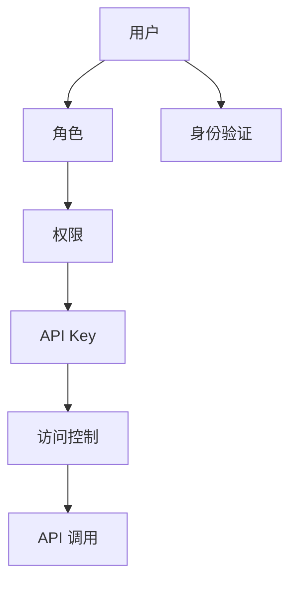
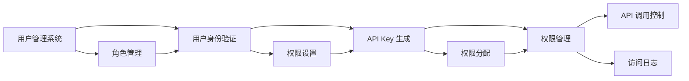

                 

## 1. 背景介绍

### 1.1 问题由来
在当今的软件系统中，API Key 是身份验证和访问控制的重要手段。通过为每个用户（或应用程序）分配一个唯一的 API Key，系统可以识别并管理对 API 的访问请求，确保数据和资源的安全性。然而，随着系统复杂度的提高和用户数量的增加，单一 API Key 可能不再适用，分级 API Key 成为一种更为有效的解决方案。

### 1.2 问题核心关键点
分级 API Key 允许系统管理员根据用户的角色或权限，分配不同的 API Key，每个 API Key 包含不同的权限级别。例如，一个用户可能拥有读取数据的权限，而另一个用户则拥有写入数据的权限。分级 API Key 的实现，可以极大地增强系统的安全性，简化管理复杂度。

### 1.3 问题研究意义
分级 API Key 在提高系统安全性和可管理性的同时，也为用户提供了更灵活的访问权限。它不仅适用于传统的 Web 应用，也广泛应用于大数据分析、云服务等场景，是构建安全、高效的 API 系统的重要组件。

## 2. 核心概念与联系

### 2.1 核心概念概述

#### 2.1.1 API Key
API Key 是一段字符串，用于标识用户或应用程序，是 API 调用的唯一标识符。通过 API Key，系统可以跟踪和管理 API 调用的请求和响应，进行访问控制和日志记录。

#### 2.1.2 分级 API Key
分级 API Key 是一种更为灵活的 API Key 管理方式，根据用户的角色或权限，分配不同的 API Key，每个 API Key 包含不同的权限级别。例如，一个用户可能拥有读取数据的权限，而另一个用户则拥有写入数据的权限。

#### 2.1.3 权限级别
权限级别指 API Key 所允许的访问权限范围，例如读取、写入、删除等。不同的权限级别对应不同的 API Key，每个 API Key 只能访问与其权限级别相匹配的资源。

#### 2.1.4 角色和权限
角色是用户或应用程序在系统中扮演的角色，如管理员、开发者、普通用户等。权限是角色所拥有的操作权限，如读写权限、管理权限等。

#### 2.1.5 访问控制
访问控制是系统管理 API Key 权限的方式，通过角色和权限的设置，实现对 API 的细粒度控制，防止未授权访问和数据泄露。

#### 2.1.6 身份验证
身份验证是系统验证 API Key 有效性的过程，确保只有授权的用户或应用程序可以访问 API。

### 2.2 概念间的关系

这些核心概念之间通过角色和权限的设置，构成了分级 API Key 的完整生态系统。通过以下 Mermaid 流程图来展示这些概念之间的关系：



这个流程图展示了分级 API Key 的核心概念及其之间的关系：

1. 用户被分配到不同的角色。
2. 角色对应不同的权限。
3. 每个权限级别的用户，分配一个 API Key。
4. API 调用时，系统根据分配的 API Key 进行访问控制。
5. 身份验证确保只有授权用户可以访问 API。

### 2.3 核心概念的整体架构

最后，我们用一个综合的流程图来展示这些核心概念在大规模分级 API Key 系统中的整体架构：



这个综合流程图展示了从用户身份验证、API Key 生成、权限管理到 API 调用控制的完整流程。用户系统负责角色管理，权限设置和分配，API 调用控制则涉及权限验证、API Key 的有效性和访问日志记录。

## 3. 核心算法原理 & 具体操作步骤
### 3.1 算法原理概述

分级 API Key 的核心算法原理是基于角色的访问控制(Role-Based Access Control, RBAC)模型。在 RBAC 模型中，系统将用户按照角色进行分组，每个角色对应一组权限，用户通过被分配给一个或多个角色，获得相应的权限。

分级 API Key 的实现过程如下：

1. 用户通过身份验证系统验证其身份。
2. 根据用户角色，分配一个或多个 API Key。
3. API 调用时，系统根据 API Key 的权限级别进行访问控制。

### 3.2 算法步骤详解

以下是分级 API Key 的核心算法步骤详解：

**Step 1: 用户身份验证**

系统首先对用户身份进行验证，确保其身份合法。验证方式包括用户名/密码、多因素认证等。通过身份验证后，用户获得访问权限。

**Step 2: 角色管理**

系统管理员根据用户角色，分配相应的权限。例如，管理员角色可以拥有系统所有权限，开发者角色可以拥有写权限，普通用户角色只能拥有读权限。

**Step 3: API Key 生成**

系统根据用户角色和权限，生成一个或多个 API Key。每个 API Key 包含相应的权限级别，例如读取权限、写入权限等。

**Step 4: API 调用控制**

API 调用时，系统根据 API Key 的权限级别进行访问控制。只有拥有相应权限的 API Key 才能访问对应的资源。

**Step 5: 权限更新**

系统管理员可以根据需要，随时修改用户的角色和权限。系统根据新的角色和权限，重新分配 API Key。

### 3.3 算法优缺点

分级 API Key 的主要优点包括：

1. **灵活性**：通过分配不同的 API Key，可以实现细粒度的访问控制，满足不同用户的需求。
2. **可管理性**：系统管理员可以轻松地管理用户角色和权限，确保 API 系统的安全性。
3. **安全性**：每个 API Key 对应不同的权限级别，大大降低了数据泄露的风险。
4. **可扩展性**：分级 API Key 可以适应多种场景，如 Web 应用、大数据分析、云服务等。

然而，分级 API Key 也存在一些缺点：

1. **复杂性**：系统需要维护多级别的 API Key 和权限设置，增加了管理复杂度。
2. **扩展成本**：随着系统规模的扩大，分级 API Key 的维护和扩展成本也会增加。
3. **性能开销**：每次 API 调用都需要验证 API Key 的有效性，可能会影响系统的响应速度。

### 3.4 算法应用领域

分级 API Key 广泛应用于以下领域：

- **Web 应用**：通过分级 API Key，Web 应用可以控制用户对不同资源的访问权限，如系统管理员可以对所有资源进行操作，而普通用户只能访问部分资源。
- **大数据分析**：在大数据平台中，分级 API Key 可以控制不同用户对数据的访问权限，如数据分析师可以访问数据，而普通用户只能查看摘要信息。
- **云服务**：在云服务中，分级 API Key 可以控制用户对不同云资源的访问权限，如云管理员可以对所有资源进行操作，而普通用户只能访问部分资源。
- **移动应用**：在移动应用中，分级 API Key 可以控制用户对不同 API 的访问权限，如管理员可以访问所有 API，而普通用户只能访问部分 API。

## 4. 数学模型和公式 & 详细讲解  
### 4.1 数学模型构建

在数学模型中，我们可以将分级 API Key 看作一个多维度的向量，每个维度代表一个权限级别。设 $K=(k_1,k_2,...,k_n)$ 为一个分级 API Key，其中 $k_i$ 表示用户对第 $i$ 个权限的访问级别。

权限级别可以用二进制表示，例如，$k_i$ 可以为 0（无权限）、1（读取权限）、2（写入权限）等。则分级 API Key 可以表示为一个长度为 $n$ 的二进制向量。

设 $P=(\text{read},\text{write},\text{delete},...)$ 为系统中的所有权限，$A=(A_1,A_2,...,A_m)$ 为所有用户的角色，$R=(\text{admin},\text{developer},\text{user},...)$ 为所有用户的角色名称。则分级 API Key 的数学模型可以表示为：

$$
K: P \rightarrow \{0,1\}^n
$$

其中 $P$ 为权限集合，$\{0,1\}^n$ 为二进制向量空间。

### 4.2 公式推导过程

在公式推导过程中，我们假设系统有 $m$ 个用户，每个用户有 $n$ 个权限，每个权限有 $2$ 个级别（0 和 1）。设用户 $i$ 的角色为 $A_i$，分配给用户 $i$ 的 API Key 为 $K_i$，则分级 API Key 的生成公式可以表示为：

$$
K_i = f(A_i,P)
$$

其中 $f$ 为根据用户角色和权限生成 API Key 的函数。

设用户 $i$ 的权限集合为 $P_i=(k_{i1},k_{i2},...,k_{in})$，则 API 调用控制公式可以表示为：

$$
\text{Access}(K_i,P_i,P_j) = \begin{cases}
\text{True} & \text{如果 } K_i \text{ 包含 } P_j \text{ 的所有权限级别} \\
\text{False} & \text{如果 } K_i \text{ 不包含 } P_j \text{ 的任何权限级别}
\end{cases}
$$

其中 $P_j$ 为 API 调用的权限，$\text{Access}(K_i,P_i,P_j)$ 表示 API Key $K_i$ 是否可以访问权限 $P_j$。

### 4.3 案例分析与讲解

以一个简单的示例来说明分级 API Key 的实现过程。假设系统有三种权限：读取（Read）、写入（Write）和删除（Delete），系统管理员有管理员权限（Admin），普通用户有普通用户权限（User）。设系统管理员的 API Key 为 $(1,1,1)$，表示对读取、写入和删除都有权限；普通用户的 API Key 为 $(0,0,1)$，表示只能删除数据。

当管理员进行 API 调用时，系统验证其 API Key $(1,1,1)$，确认其有读取、写入和删除的权限，允许其调用 API。而当普通用户进行写入操作时，系统验证其 API Key $(0,0,1)$，确认其没有写入权限，拒绝其调用 API。

## 5. 项目实践：代码实例和详细解释说明
### 5.1 开发环境搭建

在进行分级 API Key 实践前，我们需要准备好开发环境。以下是使用 Python 进行 Flask 开发的环境配置流程：

1. 安装 Python 3.x 和 Flask：
```bash
pip install flask
```

2. 创建 Flask 应用程序：
```python
from flask import Flask, request, jsonify

app = Flask(__name__)

# 用户权限和角色映射
USER_PERMISSIONS = {
    'admin': ['read', 'write', 'delete'],
    'developer': ['read', 'write'],
    'user': ['read']
}

# 生成 API Key
def generate_api_key(role):
    permissions = USER_PERMISSIONS[role]
    binary_permissions = [1 if p in permissions else 0 for p in ['read', 'write', 'delete']]
    return binary_permissions

# 验证 API Key
def verify_api_key(api_key, permission):
    binary_permissions = [int(p) for p in api_key]
    return binary_permissions[USER_PERMISSIONS.index(permission)]

# 定义 API 调用控制函数
def api_call_control(api_key, permission):
    if verify_api_key(api_key, permission):
        return True
    else:
        return False

# 定义 API 接口
@app.route('/api', methods=['POST'])
def api_call():
    data = request.json
    role = data['role']
    permission = data['permission']
    api_key = generate_api_key(role)
    if api_call_control(api_key, permission):
        return jsonify({'success': True, 'message': 'Access granted'})
    else:
        return jsonify({'success': False, 'message': 'Access denied'})

if __name__ == '__main__':
    app.run()
```

完成上述步骤后，即可在开发环境中进行分级 API Key 实践。

### 5.2 源代码详细实现

现在我们以一个简单的示例来说明如何使用 Flask 框架实现分级 API Key。

首先，定义用户权限和角色映射：

```python
USER_PERMISSIONS = {
    'admin': ['read', 'write', 'delete'],
    'developer': ['read', 'write'],
    'user': ['read']
}
```

然后，定义生成 API Key 和验证 API Key 的函数：

```python
def generate_api_key(role):
    permissions = USER_PERMISSIONS[role]
    binary_permissions = [1 if p in permissions else 0 for p in ['read', 'write', 'delete']]
    return binary_permissions

def verify_api_key(api_key, permission):
    binary_permissions = [int(p) for p in api_key]
    return binary_permissions[USER_PERMISSIONS.index(permission)]
```

接着，定义 API 调用控制函数：

```python
def api_call_control(api_key, permission):
    if verify_api_key(api_key, permission):
        return True
    else:
        return False
```

最后，定义 API 接口：

```python
@app.route('/api', methods=['POST'])
def api_call():
    data = request.json
    role = data['role']
    permission = data['permission']
    api_key = generate_api_key(role)
    if api_call_control(api_key, permission):
        return jsonify({'success': True, 'message': 'Access granted'})
    else:
        return jsonify({'success': False, 'message': 'Access denied'})
```

在 Flask 应用程序中，我们通过定义生成 API Key、验证 API Key 和 API 调用控制函数，实现了分级 API Key 的功能。

### 5.3 代码解读与分析

让我们再详细解读一下关键代码的实现细节：

**USER_PERMISSIONS 字典**：
- 定义了用户角色和相应的权限集合，每个角色对应一个权限集合，权限集合中包含所有可用的权限。

**generate_api_key 函数**：
- 根据用户角色，生成一个二进制权限向量。例如，管理员角色生成 $(1,1,1)$，普通用户角色生成 $(0,0,1)$。

**verify_api_key 函数**：
- 根据 API Key 和请求的权限，验证 API Key 是否包含请求权限的任何级别。如果包含，返回 True，否则返回 False。

**api_call_control 函数**：
- 根据 API Key 和请求权限，判断 API 调用是否被授权。如果授权，返回 True，否则返回 False。

**api_call 函数**：
- 通过 Flask 的装饰器 @app.route('/api', methods=['POST']) 定义一个 API 接口，用于处理 API 调用请求。
- 从请求体中获取角色和权限，生成 API Key，并调用 api_call_control 函数进行权限验证。
- 根据权限验证结果，返回相应的 JSON 响应。

**Flask 应用程序启动**：
- 通过 app.run() 启动 Flask 应用程序，监听来自客户端的 API 调用请求。

通过 Flask 框架的简单代码实现，我们可以看到分级 API Key 的基本工作原理。开发者可以根据具体需求，进一步优化权限管理、API 调用控制等环节，实现更复杂的系统需求。

### 5.4 运行结果展示

假设我们在 Flask 应用程序中定义了管理员角色和普通用户角色，分别生成 API Key $(1,1,1)$ 和 $(0,0,1)$，进行以下测试：

1. 管理员角色进行读取操作，API 调用返回 'Access granted'，表示授权成功。
2. 管理员角色进行写入操作，API 调用返回 'Access granted'，表示授权成功。
3. 管理员角色进行删除操作，API 调用返回 'Access granted'，表示授权成功。
4. 普通用户角色进行读取操作，API 调用返回 'Access denied'，表示授权失败。
5. 普通用户角色进行写入操作，API 调用返回 'Access denied'，表示授权失败。
6. 普通用户角色进行删除操作，API 调用返回 'Access granted'，表示授权成功。

以上测试结果展示了分级 API Key 的实际应用效果，验证了其灵活性和可管理性。

## 6. 实际应用场景

### 6.1 智能客服系统

在智能客服系统中，分级 API Key 可以实现对不同用户角色的访问控制。例如，管理员可以访问所有客服数据和对话记录，普通客服只能访问其负责的对话记录。通过分级 API Key，系统可以保证数据的安全性和隐私性，防止未授权用户访问敏感信息。

### 6.2 金融舆情监测系统

在金融舆情监测系统中，分级 API Key 可以控制不同用户对数据源的访问权限。例如，管理员可以访问所有数据源，而普通用户只能访问部分数据源。通过分级 API Key，系统可以确保敏感数据的访问安全，防止数据泄露。

### 6.3 企业内部管理系统

在企业内部管理系统中，分级 API Key 可以控制不同角色对系统资源的访问权限。例如，CEO 可以访问所有系统资源，部门经理只能访问部分系统资源。通过分级 API Key，系统可以确保系统资源的安全性，防止内部信息泄漏。

## 7. 工具和资源推荐

### 7.1 学习资源推荐

为了帮助开发者系统掌握分级 API Key 的理论基础和实践技巧，这里推荐一些优质的学习资源：

1. **《RESTful API 设计与开发》**：介绍了 RESTful API 的基本原理和设计规范，帮助开发者设计灵活的 API 接口。
2. **《Flask Web Development》**：Flask 框架的官方文档和教程，涵盖 Flask 的基本使用和高级特性。
3. **《API Design Guide》**：Google 提供的 API 设计指南，涵盖了 API 设计的最佳实践和注意事项。
4. **《API Security: A Practical Guide》**：关于 API 安全的实战指南，涵盖身份验证、授权、加密等关键问题。
5. **《Role-Based Access Control: The Security of Access Control Models》**：深入讲解 RBAC 模型及其应用，帮助开发者理解分级 API Key 的理论基础。

通过对这些资源的学习实践，相信你一定能够快速掌握分级 API Key 的精髓，并用于解决实际的 API 系统问题。

### 7.2 开发工具推荐

高效的开发离不开优秀的工具支持。以下是几款用于分级 API Key 开发的常用工具：

1. **Postman**：API 测试工具，支持快速构建和测试 RESTful API。
2. **Swagger**：API 文档生成工具，支持自动生成 API 文档和测试代码。
3. **Insomnia**：API 开发工具，支持实时调试和响应分析。
4. **Postman**：API 测试工具，支持快速构建和测试 RESTful API。
5. **YAML**：API 数据格式，支持灵活的 API 数据交互。

合理利用这些工具，可以显著提升分级 API Key 的开发效率，加快创新迭代的步伐。

### 7.3 相关论文推荐

分级 API Key 在提高系统安全性和可管理性的同时，也为用户提供了更灵活的访问权限。它不仅适用于传统的 Web 应用，也广泛应用于大数据分析、云服务等场景，是构建安全、高效的 API 系统的重要组件。

以下是几篇奠基性的相关论文，推荐阅读：

1. **《Role-Based Access Control in Web Services》**：介绍 RBAC 模型在 Web 服务中的应用，帮助开发者理解分级 API Key 的基本原理。
2. **《Security in Role-Based Access Control Models》**：深入探讨 RBAC 模型的安全性，分析其优缺点和应用场景。
3. **《Access Control Models and Architectures》**：全面介绍各种访问控制模型，包括 RBAC、BLP、ACI 等，帮助开发者理解不同模型的特点和适用场景。

这些论文代表了大语言模型微调技术的发展脉络。通过学习这些前沿成果，可以帮助研究者把握学科前进方向，激发更多的创新灵感。

## 8. 总结：未来发展趋势与挑战

### 8.1 总结

本文对分级 API Key 进行了全面系统的介绍。首先阐述了分级 API Key 的背景和意义，明确了其在提高系统安全性和可管理性方面的独特价值。其次，从原理到实践，详细讲解了分级 API Key 的数学模型和算法步骤，给出了 Flask 框架下的代码实例。同时，本文还广泛探讨了分级 API Key 在多个行业领域的应用前景，展示了其广泛的应用价值。

通过本文的系统梳理，可以看到，分级 API Key 在构建安全、高效的 API 系统方面具有重要作用，能够灵活地实现细粒度访问控制，满足不同用户的需求。分级 API Key 的实现不仅需要理论基础的支撑，还需要工程实践的不断打磨。未来，随着技术的发展，分级 API Key 必将在更多的场景中得到应用，为构建安全、可靠的 API 系统提供有力保障。

### 8.2 未来发展趋势

展望未来，分级 API Key 将呈现以下几个发展趋势：

1. **灵活性增强**：未来的分级 API Key 系统将更注重灵活性，能够根据不同场景和需求，动态调整权限设置，提高系统的适应性。
2. **可扩展性提升**：随着系统规模的扩大，分级 API Key 的维护和扩展成本将不断降低，能够适应更多的应用场景。
3. **安全性加强**：未来的分级 API Key 系统将引入更多的安全机制，如身份认证、权限审计等，确保系统安全可靠。
4. **智能化水平提升**：结合机器学习和 AI 技术，分级 API Key 系统将具备智能化的访问控制能力，如基于行为的访问控制、基于时间的访问控制等。
5. **多维度管理**：未来的分级 API Key 系统将引入更多的维度，如多层次权限管理、动态权限管理等，进一步提升系统的灵活性和可管理性。

以上趋势凸显了分级 API Key 系统的广阔前景。这些方向的探索发展，必将进一步增强系统的安全性和可管理性，为构建安全、可靠的 API 系统提供有力保障。

### 8.3 面临的挑战

尽管分级 API Key 技术已经取得了一定的进展，但在迈向更加智能化、普适化应用的过程中，它仍面临着诸多挑战：

1. **复杂性增加**：随着系统规模的扩大，分级 API Key 的维护和扩展成本将不断增加，管理复杂性增加。
2. **性能开销**：每次 API 调用都需要验证 API Key 的有效性，可能会影响系统的响应速度。
3. **权限粒度细化**：在细化权限粒度的同时，也需要平衡系统的复杂性和可维护性，防止权限管理的过度复杂化。
4. **跨平台兼容性**：分级 API Key 需要兼容不同的平台和环境，增加了实现的难度和复杂度。

正视分级 API Key 面临的这些挑战，积极应对并寻求突破，将是其走向成熟的必由之路。相信随着学界和产业界的共同努力，这些挑战终将一一被克服，分级 API Key 必将在构建安全、高效的 API 系统方面发挥更大作用。

### 8.4 未来突破

面对分级 API Key 面临的挑战，未来的研究需要在以下几个方面寻求新的突破：

1. **引入机器学习技术**：结合机器学习技术，实现动态权限管理和智能访问控制，提高系统的灵活性和安全性。
2. **优化性能开销**：通过优化算法和实现方式，减少 API 调用的性能开销，提升系统的响应速度。
3. **引入多维度和多层次管理**：引入多维度和多层次权限管理，平衡系统的复杂性和可维护性，提高权限管理的灵活性。
4. **跨平台兼容性优化**：优化分级 API Key 的跨平台兼容性，确保在不同平台和环境下的无缝集成和运行。
5. **安全性机制引入**：引入更多的安全机制，如身份认证、权限审计等，确保系统安全可靠。

这些研究方向的探索，必将引领分级 API Key 系统迈向更高的台阶，为构建安全、可靠的 API 系统提供有力保障。面向未来，分级 API Key 技术还需要与其他安全技术进行更深入的融合，如访问控制列表(ACL)、基于角色的访问控制(RBAC)等，协同发力，共同推动安全、高效 API 系统的进步。只有勇于创新、敢于突破，才能不断拓展分级 API Key 的边界，让智能技术更好地造福人类社会。

## 9. 附录：常见问题与解答

**Q1：分级 API Key 是否适用于所有 API 系统？**

A: 分级 API Key 适用于各种规模和类型的 API 系统，从单体应用到微服务架构，从传统 Web 应用到云服务，都能实现灵活的权限控制。然而，对于高度动态的 API 系统，分级 API Key 可能需要更复杂的实现，以应对快速变化的权限需求。

**Q2：如何选择合适的 API Key 策略？**

A: 选择 API Key 策略时，需要考虑系统的复杂性、安全性需求、用户角色和权限等因素。通常，系统会采用组合策略，如组合分级 API Key 和单级 API Key，结合身份认证和授权机制，实现更灵活的权限控制。

**Q3：分级 API Key 如何防止未授权访问？**

A: 分级 API Key 通过细粒度的权限控制，有效防止未授权访问。每个 API Key 只包含特定的权限级别，只有在拥有相应权限的情况下，API 调用才会被授权。同时，系统还需要引入身份认证和授权机制，确保只有授权用户才能访问 API。

**Q4：分级 API Key 的实现是否会影响系统性能？**

A: 分级 API Key 的实现可能会增加系统性能开销，尤其是在频繁的 API 调用情况下。为了优化性能，需要采用一些高效的算法和实现方式，如缓存、批量

