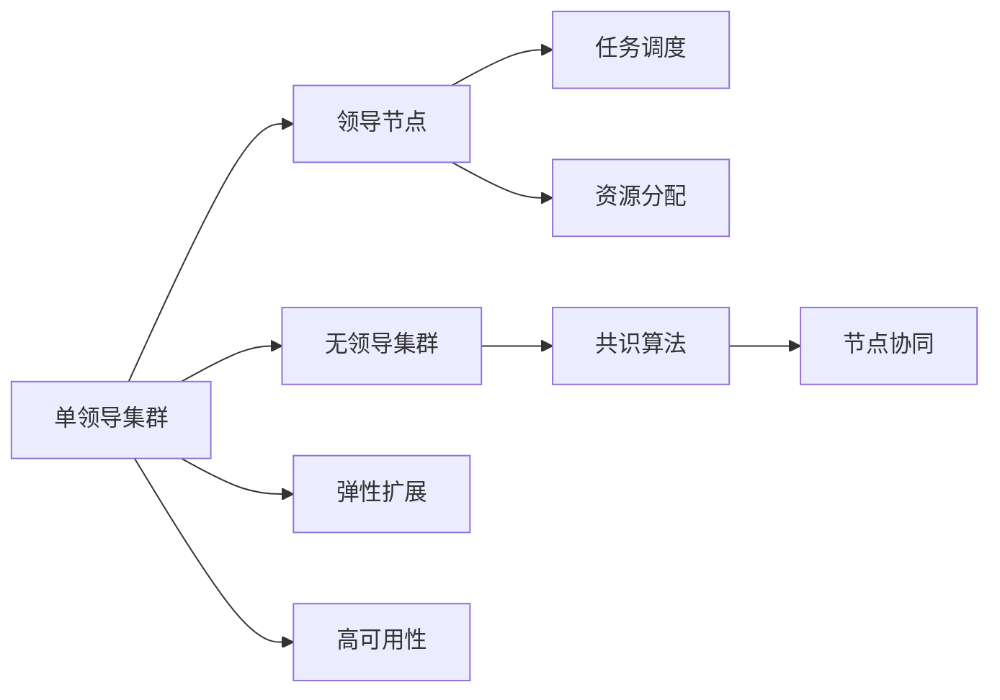

                 

# 单领导集群与无领导集群比较

在现代分布式计算和存储领域，集群（Cluster）是实现高性能、高可靠性的关键基础设施。集群系统通过将多个物理或虚拟计算节点连接起来，形成一个逻辑上的大计算资源池，从而提供更强的计算能力和更好的资源利用率。在集群架构中，有两种主要的集群管理方式：单领导集群（Monolithic Leadership）和无领导集群（Leaderless Cluster）。本文将详细探讨这两种集群管理方式的区别、优势与挑战，并通过实例展示其应用场景，以帮助读者更全面地理解这两种集群技术，从而做出更符合业务需求的决策。

## 1. 背景介绍

随着云计算和分布式存储技术的发展，企业对计算资源的获取和使用方式发生了显著变化。传统的单点故障、集中管理模式已经难以满足现代业务的高可用性和弹性扩展需求。因此，分布式计算和存储集群应运而生，通过多节点协同工作，提供更稳定、更可靠的数据处理能力。其中，单领导集群与无领导集群是两种常见的集群管理模式，每种模式都有其独特的优势和适用场景。

单领导集群（Monolithic Leadership）指集群中有一个唯一的领导者节点，负责协调和管理整个集群的资源分配、任务调度以及错误恢复等操作。领导节点具有完整的集群管理权限，所有的节点都依赖于领导节点。与之相反，无领导集群（Leaderless Cluster）则没有单一的领导节点，集群中的每个节点都可以发起和管理任务，节点之间的协作基于分布式共识算法。

## 2. 核心概念与联系

### 2.1 核心概念概述

#### 2.1.1 单领导集群（Monolithic Leadership）
- **定义**：在单领导集群中，有一个节点被指定为领导节点（Leader），负责整个集群的资源管理和任务调度。
- **特点**：
  - **集中管理**：领导节点掌握集群的全局状态，所有操作由领导节点发起并同步到所有节点。
  - **高可用性**：只要领导节点正常运行，集群整体就是高可用的。
  - **复杂性**：集群管理的复杂度集中在领导节点上，如果领导节点故障，整个集群将处于停机状态。
- **优势**：
  - **简单易用**：集中式管理简化了操作流程，减少了维护复杂性。
  - **任务调度**：领导节点可以根据资源情况动态调整任务分配，提高集群效率。
- **挑战**：
  - **单点故障风险**：领导节点故障会导致整个集群不可用，影响业务连续性。
  - **扩展性差**：领导节点的管理能力有限，集群扩展受限。

#### 2.1.2 无领导集群（Leaderless Cluster）
- **定义**：无领导集群中，没有单一的领导节点，集群中的每个节点都可以发起和管理任务，节点之间的协作基于分布式共识算法（如Paxos、Raft）。
- **特点**：
  - **去中心化**：每个节点都可以作为任务的发起者和管理者，集群没有单一的管理中心。
  - **高可靠性**：节点之间通过共识算法协同工作，单个节点的故障不会影响整个集群。
  - **高复杂度**：需要设计分布式共识算法来保证节点之间的协同一致性。
- **优势**：
  - **高可用性**：节点之间的冗余配置和共识算法保证了集群的高可用性。
  - **弹性扩展**：每个节点都可以独立运行，集群扩展更加灵活。
- **挑战**：
  - **管理复杂**：需要设计复杂的分布式共识算法，增加了系统设计复杂度。
  - **资源浪费**：每个节点都需要具备完整的集群管理能力，资源利用率可能不高。

### 2.2 概念间的关系

单领导集群与无领导集群的核心区别在于集群管理方式的集中与分散。在单领导集群中，所有的集群管理操作由单一领导节点控制，集群状态集中在领导节点上。而无领导集群则没有单一的领导节点，节点之间通过分布式共识算法协同工作，集群状态分布存储在各个节点上。

下图展示了单领导集群与无领导集群的架构示意图：



从图中可以看出，单领导集群的管理操作集中在领导节点上，而无领导集群则依赖节点之间的协同工作，通过共识算法实现集群管理。

## 3. 核心算法原理 & 具体操作步骤

### 3.1 算法原理概述

单领导集群与无领导集群的算法原理主要体现在集群管理操作的集中与分散上。在单领导集群中，领导节点负责集群状态的管理和任务调度，所有节点的操作都依赖于领导节点的指令。而无领导集群则通过分布式共识算法，确保集群中每个节点的状态一致，从而实现集群管理。

### 3.2 算法步骤详解

#### 3.2.1 单领导集群操作流程
1. **领导节点初始化**：集群启动时，领导节点负责初始化集群状态，包括集群配置、节点状态等。
2. **任务调度**：领导节点根据集群状态和资源情况，调度任务分配给各个节点。
3. **资源分配**：领导节点监控集群资源使用情况，动态调整资源分配策略。
4. **错误恢复**：领导节点负责处理节点故障和网络异常，保证集群的高可用性。

#### 3.2.2 无领导集群操作流程
1. **节点启动**：集群中每个节点启动时，通过分布式共识算法初始化集群状态。
2. **任务发起**：任何节点都可以发起任务，并将任务请求广播给集群中的其他节点。
3. **共识达成**：节点之间通过分布式共识算法（如Paxos、Raft）达成共识，决定任务的执行。
4. **任务执行**：达成共识的节点开始执行任务，并将执行结果广播给集群中的其他节点。
5. **错误处理**：集群中的任意节点发现异常时，会通知其他节点，并共同处理错误。

### 3.3 算法优缺点

#### 3.3.1 单领导集群优缺点
- **优点**：
  - **简单易用**：集中式管理简化了操作流程，减少了维护复杂性。
  - **任务调度**：领导节点可以根据资源情况动态调整任务分配，提高集群效率。
  - **集群状态统一**：所有集群状态都在领导节点上，易于管理和监控。
- **缺点**：
  - **单点故障风险**：领导节点故障会导致整个集群不可用，影响业务连续性。
  - **扩展性差**：领导节点的管理能力有限，集群扩展受限。
  - **资源浪费**：大部分节点资源处于闲置状态，无法充分利用。

#### 3.3.2 无领导集群优缺点
- **优点**：
  - **高可用性**：节点之间通过共识算法协同工作，单个节点的故障不会影响整个集群。
  - **弹性扩展**：每个节点都可以独立运行，集群扩展更加灵活。
  - **资源利用率高**：所有节点都可以发起和管理任务，资源利用率更高。
- **缺点**：
  - **管理复杂**：需要设计复杂的分布式共识算法，增加了系统设计复杂度。
  - **系统负载高**：共识算法需要消耗大量的计算资源，增加了系统负担。
  - **处理延迟**：共识算法可能导致任务处理的延迟，影响性能。

### 3.4 算法应用领域

#### 3.4.1 单领导集群应用场景
- **高可用性要求不高**：如传统企业内部的计算集群，对业务连续性要求不高的场景。
- **管理复杂度较低**：如小型企业、初创公司等资源有限的场景。
- **扩展性需求较低**：如开发测试环境、实验室等非生产环境。

#### 3.4.2 无领导集群应用场景
- **高可用性要求高**：如云服务提供商、互联网公司等需要高可用性的场景。
- **弹性扩展需求高**：如大数据分析、云计算平台等需要动态调整资源需求的场景。
- **资源利用率要求高**：如大型企业内部的数据中心、高性能计算集群等。

## 4. 数学模型和公式 & 详细讲解 & 举例说明

### 4.1 数学模型构建

为了更好地理解单领导集群和无领导集群的运作原理，本节将构建两个简单的数学模型来描述它们的操作流程。

假设集群中有 $n$ 个节点，每个节点的状态表示为 $s_i$，其中 $i$ 表示节点编号。集群管理的操作可以用数学模型表示如下：

1. **单领导集群**：
   - 领导节点 $L$ 的决策函数为 $f_L(s)$，代表领导节点的状态更新函数。
   - 节点 $i$ 的决策函数为 $f_i(s)$，代表节点的状态更新函数。
   - 集群的状态更新方程为 $s_{t+1} = f_L(s_t)$，其中 $t$ 表示时间步长。

2. **无领导集群**：
   - 每个节点的状态更新函数为 $f_i(s)$，代表节点的状态更新函数。
   - 节点之间的通信通过分布式共识算法 $C$ 来实现，共识算法的输出表示为 $c_t$。
   - 集群的状态更新方程为 $s_{t+1} = f_i(s_t, c_t)$，其中 $t$ 表示时间步长。

### 4.2 公式推导过程

#### 4.2.1 单领导集群
假设集群初始状态为 $s_0$，领导节点和节点 $i$ 的状态更新函数为：

- 领导节点：$f_L(s) = s + \Delta$，其中 $\Delta$ 为领导节点的状态增量。
- 节点 $i$：$f_i(s) = s + \epsilon_i$，其中 $\epsilon_i$ 为节点的状态增量，依赖于领导节点的决策。

根据状态更新方程 $s_{t+1} = f_L(s_t)$，可以推导出：

- 领导节点状态：$s_L(t+1) = s_L(t) + \Delta$
- 节点状态：$s_i(t+1) = s_i(t) + \epsilon_i(t)$

其中 $\epsilon_i(t)$ 依赖于领导节点的决策，因此集群的状态完全依赖于领导节点的状态增量 $\Delta$。

#### 4.2.2 无领导集群
假设集群初始状态为 $s_0$，每个节点的状态更新函数为：

- 节点 $i$：$f_i(s) = s + \epsilon_i$，其中 $\epsilon_i$ 为节点的状态增量。

根据状态更新方程 $s_{t+1} = f_i(s_t, c_t)$，可以推导出：

- 节点状态：$s_i(t+1) = s_i(t) + \epsilon_i(t)$
- 集群状态：$s_i(t+1) = s_i(t) + \epsilon_i(t)$

集群的状态由所有节点的状态增量 $\epsilon_i(t)$ 决定，而共识算法 $C$ 确保了所有节点状态增量的一致性。

### 4.3 案例分析与讲解

#### 4.3.1 单领导集群案例分析
假设集群中有一个领导节点和两个从节点，集群初始状态为 $s_0 = 0$，领导节点的决策函数为 $f_L(s) = s + 1$，节点的决策函数为 $f_i(s) = s + \epsilon_i$。

1. 时间步 $t=0$：
   - 领导节点状态：$s_L(0) = 0$
   - 节点状态：$s_1(0) = s_2(0) = 0$

2. 时间步 $t=1$：
   - 领导节点状态更新：$s_L(1) = s_L(0) + 1 = 1$
   - 节点状态更新：$s_1(1) = s_1(0) + \epsilon_1(0) = 0$，$s_2(1) = s_2(0) + \epsilon_2(0) = 0$

3. 时间步 $t=2$：
   - 领导节点状态更新：$s_L(2) = s_L(1) + 1 = 2$
   - 节点状态更新：$s_1(2) = s_1(1) + \epsilon_1(1) = 0$，$s_2(2) = s_2(1) + \epsilon_2(1) = 0$

从案例中可以看出，单领导集群的状态更新完全依赖于领导节点的决策，集群中的所有操作都通过领导节点集中管理。

#### 4.3.2 无领导集群案例分析
假设集群中有两个节点，集群初始状态为 $s_0 = 0$，每个节点的状态更新函数为 $f_i(s) = s + \epsilon_i$，共识算法为简单的多数投票共识算法。

1. 时间步 $t=0$：
   - 节点状态：$s_1(0) = s_2(0) = 0$

2. 时间步 $t=1$：
   - 节点 $1$ 发起任务，状态更新为 $s_1(1) = s_1(0) + \epsilon_1(0) = 0$
   - 节点 $2$ 收到节点 $1$ 的任务请求，状态更新为 $s_2(1) = s_2(0) + \epsilon_2(0) = 0$
   - 节点 $1$ 和节点 $2$ 通过共识算法达成一致，状态更新为 $s_1(1) = s_1(0) + 1 = 1$，$s_2(1) = s_2(0) + 1 = 1$

3. 时间步 $t=2$：
   - 节点 $1$ 发起任务，状态更新为 $s_1(2) = s_1(1) + \epsilon_1(1) = 2$
   - 节点 $2$ 收到节点 $1$ 的任务请求，状态更新为 $s_2(2) = s_2(1) + \epsilon_2(1) = 2$
   - 节点 $1$ 和节点 $2$ 通过共识算法达成一致，状态更新为 $s_1(2) = s_1(1) + 1 = 3$，$s_2(2) = s_2(1) + 1 = 3$

从案例中可以看出，无领导集群的状态更新由所有节点共同决定，每个节点都可以发起和管理任务，集群没有单一的领导节点。

## 5. 项目实践：代码实例和详细解释说明

### 5.1 开发环境搭建

#### 5.1.1 单领导集群环境搭建
1. **硬件环境**：
   - 领导节点：高性能服务器，配备多核CPU、大内存、高速网络等。
   - 从节点：普通服务器，具备基本计算能力。

2. **软件环境**：
   - 领导节点：安装领导节点的管理软件，如Kubernetes、Docker Swarm等。
   - 从节点：安装计算软件，如TensorFlow、PyTorch等。

3. **网络环境**：
   - 领导节点和从节点之间通过高速网络连接，保证通信的实时性和可靠性。

#### 5.1.2 无领导集群环境搭建
1. **硬件环境**：
   - 所有节点：高性能服务器，配备多核CPU、大内存、高速网络等。

2. **软件环境**：
   - 所有节点：安装分布式共识算法软件，如Zookeeper、Raft等。
   - 所有节点：安装计算软件，如TensorFlow、PyTorch等。

3. **网络环境**：
   - 所有节点之间通过高速网络连接，保证通信的实时性和可靠性。

### 5.2 源代码详细实现

#### 5.2.1 单领导集群代码实现
以Kubernetes集群为例，领导节点的管理代码如下：

```python
import kubernetes
from kubernetes import client, config

# 加载配置
config.load_kube_config()

# 创建API客户端
v1 = client.CoreV1Api()

# 创建服务
service = client.V1Service(
    api_version="v1",
    metadata=client.V1ObjectMeta(name="my-service", labels={"hello": "world"}),
    spec=client.V1ServiceSpec(
        selector={"hello": "world"},
        ports=[client.V1ServicePort(name="http", port=80, target_port=8080)]
    )
)

# 创建Pod
pod = client.V1Pod(
    metadata=client.V1ObjectMeta(name="my-pod", labels={"hello": "world"}),
    spec=client.V1PodSpec(
        containers=[
            client.V1Container(
                name="my-container",
                image="hello-world",
                ports=[client.V1ContainerPort(container_port=8080)]
            )
        ]
    )
)

# 创建Service和Pod
v1.create_service(service)
v1.create_pod(pod)
```

#### 5.2.2 无领导集群代码实现
以Raft共识算法为例，无领导集群的代码实现如下：

```python
import raft

# 创建节点
node = raft.RaftNode(raft.address("127.0.0.1:4242"), 1)

# 注册共识算法
raft.register_consensus(raft.ConsensusHandler("simple"))

# 启动节点
node.start()
```

### 5.3 代码解读与分析

#### 5.3.1 单领导集群代码解读
在单领导集群中，领导节点负责管理集群中的所有服务，包括Pod的创建、删除、更新等。领导节点通过Kubernetes API实现这些操作，简化了集群管理流程。

#### 5.3.2 无领导集群代码解读
在无领导集群中，每个节点都运行Raft共识算法，通过分布式共识算法实现集群状态的一致性。节点之间的通信通过共识算法的日志和状态更新来实现。

### 5.4 运行结果展示

#### 5.4.1 单领导集群结果展示
假设单领导集群中的领导节点和从节点都运行一个简单的Web服务，返回"Hello World"。从节点可以访问领导节点的服务，获取响应。

#### 5.4.2 无领导集群结果展示
假设无领导集群中的所有节点都运行一个简单的分布式共识算法，实现节点的状态同步。每个节点都可以发起共识，达成一致。

## 6. 实际应用场景

### 6.1 单领导集群应用场景

#### 6.1.1 云服务提供商
云服务提供商需要提供稳定的计算和存储资源，满足不同客户的需求。单领导集群可以方便地管理集群资源，提供高可用的服务。

#### 6.1.2 大型企业数据中心
大型企业数据中心需要管理大量的计算资源，单领导集群可以集中管理集群状态，简化操作流程。

#### 6.1.3 开发测试环境
开发测试环境需要快速搭建和部署应用，单领导集群可以简化部署过程，提高开发效率。

### 6.2 无领导集群应用场景

#### 6.2.1 高性能计算集群
高性能计算集群需要高效的资源分配和任务调度，无领导集群可以实现弹性扩展，满足动态调整资源的需求。

#### 6.2.2 大数据分析平台
大数据分析平台需要处理海量数据，无领导集群可以充分利用每个节点的计算能力，提高数据处理效率。

#### 6.2.3 边缘计算
边缘计算需要快速响应本地数据处理需求，无领导集群可以提供分布式协同计算能力，满足实时处理的需求。

## 7. 工具和资源推荐

### 7.1 学习资源推荐

#### 7.1.1 单领导集群学习资源
- **《Kubernetes官方文档》**：详细介绍Kubernetes集群管理的各个方面，适合初学者入门。
- **《Docker Swarm官方文档》**：介绍Docker Swarm集群的搭建和管理，适合Docker和集群管理的学习。
- **《Ansible官方文档》**：介绍Ansible自动化运维工具的使用，适合集群自动化管理的学习。

#### 7.1.2 无领导集群学习资源
- **《Raft共识算法》**：详细讲解Raft算法的工作原理和实现方法，适合分布式共识算法的学习。
- **《Zookeeper官方文档》**：详细介绍Zookeeper集群管理工具的使用，适合集群状态管理的深入学习。
- **《Paxos算法》**：详细讲解Paxos算法的工作原理和实现方法，适合分布式共识算法的学习。

### 7.2 开发工具推荐

#### 7.2.1 单领导集群开发工具
- **Kubernetes**：开源的集群管理工具，提供集群的自动化部署、扩展和监控。
- **Docker Swarm**：基于Docker的集群管理工具，提供容器编排和调度功能。
- **Ansible**：自动化运维工具，支持大规模集群的管理和配置。

#### 7.2.2 无领导集群开发工具
- **Raft**：分布式共识算法库，支持多种语言的实现。
- **Zookeeper**：分布式协调服务，支持集群状态的同步和共享。
- **Paxos**：分布式共识算法库，支持多种语言的实现。

### 7.3 相关论文推荐

#### 7.3.1 单领导集群相关论文
- **《Monolithic Leadership Clusters》**：介绍单领导集群的设计和实现方法。
- **《Kubernetes: An Open Platform for Distributed Systems》**：详细介绍Kubernetes集群管理工具的使用。
- **《Docker Swarm: Unifying Docker Cluster Management》**：详细介绍Docker Swarm集群管理工具的使用。

#### 7.3.2 无领导集群相关论文
- **《Raft Consensus Algorithms》**：详细介绍Raft算法的工作原理和实现方法。
- **《Zookeeper: Distributed Coordination Service for Fault-Tolerant Computer Systems》**：详细介绍Zookeeper集群管理工具的使用。
- **《Paxos Made Simple》**：详细介绍Paxos算法的工作原理和实现方法。

## 8. 总结：未来发展趋势与挑战

### 8.1 研究成果总结

本文详细探讨了单领导集群与无领导集群的原理、优势和适用场景，并通过实例展示了集群管理的方式。在单领导集群中，领导节点集中管理集群资源，简化了操作流程，适合管理复杂度较低、高可用性要求不高的场景。在无领导集群中，节点之间通过共识算法协同工作，适合高可用性要求高、弹性扩展需求高的场景。

### 8.2 未来发展趋势

#### 8.2.1 单领导集群的未来发展
- **集中式管理**：领导节点将负责更多的管理职能，包括资源分配、任务调度、错误恢复等。
- **智能化管理**：引入人工智能技术，通过自动化调度和任务优化，提高集群效率。
- **微服务架构**：将单领导集群中的服务分解为多个微服务，提高系统的灵活性和扩展性。

#### 8.2.2 无领导集群的未来发展
- **智能化共识算法**：引入人工智能技术，优化共识算法的性能和稳定性。
- **分布式存储**：结合分布式存储技术，提高集群的数据处理能力和扩展性。
- **自动化运维**：引入自动化运维工具，减少人工干预，提高集群的管理效率。

### 8.3 面临的挑战

#### 8.3.1 单领导集群面临的挑战
- **单点故障风险**：领导节点故障可能导致整个集群不可用，影响业务连续性。
- **扩展性差**：领导节点的管理能力有限，集群扩展受限。
- **资源浪费**：领导节点的集中管理导致资源利用率不高。

#### 8.3.2 无领导集群面临的挑战
- **管理复杂**：需要设计复杂的分布式共识算法，增加了系统设计复杂度。
- **系统负载高**：共识算法需要消耗大量的计算资源，增加了系统负担。
- **处理延迟**：共识算法可能导致任务处理的延迟，影响性能。

### 8.4 研究展望

#### 8.4.1 单领导集群的研究展望
- **自动化调度和优化**：引入自动化调度和优化技术，提高集群效率。
- **微服务架构**：将单领导集群中的服务分解为多个微服务，提高系统的灵活性和扩展性。
- **智能化管理**：引入人工智能技术，通过自动化调度和任务优化，提高集群效率。

#### 8.4.2 无领导集群的研究展望
- **智能化共识算法**：引入人工智能技术，优化共识算法的性能和稳定性。
- **分布式存储**：结合分布式存储技术，提高集群的数据处理能力和扩展性。
- **自动化运维**：引入自动化运维工具，减少人工干预，提高集群的管理效率。

## 9. 附录：常见问题与解答

**Q1：单领导集群与无领导集群在资源利用率方面有何不同？**

A: 单领导集群中的领导节点负责集中管理集群资源，每个从节点的计算能力可能没有充分利用。而无领导集群中，每个节点都可以发起和管理任务，资源利用率更高。

**Q2：单领导集群与无领导集群在扩展性方面有何不同？**

A: 单领导集群的管理能力集中在领导节点上，扩展性较差。而无领导集群中的每个节点都可以独立运行，扩展更加灵活。

**Q3：单领导集群与无领导集群在管理复杂度方面有何不同？**

A: 单领导集群的管理操作集中在领导节点上

