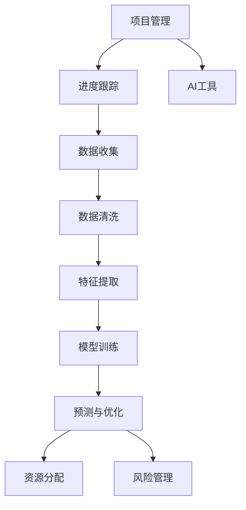

                 

# AI在项目进度管理中的作用

在现代项目管理中，时间管理是至关重要的一环，它直接决定了项目能否按期完成并达到预期目标。然而，实际工作中，由于多因素干扰，诸如资源分配不合理、任务依赖不清、外部风险等因素，使得项目进度常常受到不良影响，导致工期延误、成本增加，甚至项目失败。

随着人工智能(AI)技术的发展，AI工具被引入项目管理领域，为项目进度管理带来了革命性的改变。本文将深入探讨AI在项目进度管理中的作用，从算法原理到具体应用，详细分析其如何通过自动化、预测和优化等手段，有效提升项目管理效率，帮助项目团队实现进度目标。

## 1. 背景介绍

### 1.1 问题由来
项目管理一直是企业关注的重点，但传统的项目管理方法如甘特图、PERT图、关键路径法等，尽管历史悠久，却存在一定局限性。它们依赖于人工调整，耗费大量时间，且难以应对快速变化的市场环境。同时，项目管理中的资源、任务、风险等问题，因缺乏数据支持，决策多凭直觉，难以做出最优判断。

而人工智能的引入，通过算法自动化、数据分析和优化，使得项目管理变得更加科学和精准。AI不仅能够实时监控项目进度，还能预测未来发展，提前预警风险，帮助项目团队做出最优决策。

### 1.2 问题核心关键点
AI在项目进度管理中的关键作用，主要体现在以下几个方面：

- **数据驱动决策**：通过分析大量历史项目数据，AI可以提供数据驱动的决策依据，帮助项目经理更准确地预测项目进度。
- **自动化监控与调整**：AI工具可以实时监控项目进度，及时发现问题并自动调整任务安排，确保项目顺利推进。
- **预测与风险管理**：AI具备预测能力，能够预测项目进度和风险，提前采取措施，减少不确定性。
- **优化资源分配**：AI能够优化资源分配，确保关键资源优先使用，提升项目效率。

## 2. 核心概念与联系

### 2.1 核心概念概述

在讨论AI在项目进度管理中的具体应用之前，我们先简要介绍一下相关核心概念：

- **项目管理(PM)**：涉及项目策划、执行、监控和评估等各个环节，确保项目按时按质完成。
- **进度跟踪**：通过记录和报告项目进度，监控项目状态，确保按时完成。
- **资源优化**：通过合理分配资源，提高项目效率，降低成本。
- **风险管理**：识别、分析、控制项目风险，保证项目顺利进行。
- **预测分析**：基于历史数据和模型预测未来事件，辅助决策。

这些概念构成了项目进度管理的框架，而AI技术通过引入算法和模型，使项目进度管理变得更加高效和智能化。

### 2.2 概念间的关系

AI在项目进度管理中的应用，可以通过以下示意图来展示：



上述示意图展示了项目进度管理中各环节与AI工具的关系。AI通过数据收集、清洗、特征提取、模型训练等步骤，为进度跟踪、预测与优化、资源分配和风险管理提供智能支持，最终提升项目管理的整体效率。

## 3. 核心算法原理 & 具体操作步骤

### 3.1 算法原理概述

AI在项目进度管理中的主要算法包括：时间序列分析、回归分析、深度学习等。其中，时间序列分析是最基础的工具，用于分析项目历史进度数据，预测未来趋势。回归分析则用于预测项目中各种变量之间的关系，如工期与成本之间的关系。深度学习技术，尤其是循环神经网络(RNN)和长短期记忆网络(LSTM)，可以处理非线性、非平稳时间序列数据，提供更准确的预测。

### 3.2 算法步骤详解

AI在项目进度管理中的应用，一般分为以下几个步骤：

1. **数据收集与预处理**：从项目管理系统(如JIRA、Trello等)、工作日志、财务报表等渠道收集项目数据，包括任务时间、工期、成本、资源等信息。
2. **特征提取**：对收集到的数据进行预处理，提取有用的特征，如任务完成率、工期偏差、资源利用率等。
3. **模型训练**：使用时间序列、回归等模型对提取的特征进行训练，建立预测模型。
4. **预测与调整**：基于模型预测项目进度，评估进度偏差，自动调整任务分配和资源分配，确保项目进度。
5. **风险管理**：通过模型识别项目中的潜在风险，提前采取措施，避免风险发生。

### 3.3 算法优缺点

AI在项目进度管理中的主要优点包括：

- **自动化程度高**：AI工具可以自动处理大量数据，实时监控项目进度，减少人工干预。
- **预测能力强**：AI模型能够准确预测项目进度和风险，提供决策支持。
- **优化资源分配**：AI能够优化资源配置，提高项目效率。

同时，也存在一些缺点：

- **数据需求量大**：AI模型需要大量历史数据进行训练，数据不足可能导致预测不准。
- **模型复杂度高**：高级AI模型复杂度高，实施和维护难度大。
- **依赖算力**：AI模型训练和推理需要高性能计算资源，可能增加项目成本。

### 3.4 算法应用领域

AI在项目进度管理中的应用领域非常广泛，包括但不限于以下几类：

1. **工程项目管理**：如土木工程、软件开发等，通过AI模型预测工期和成本，优化资源分配。
2. **金融项目**：如股票交易、信贷评估等，使用AI预测市场变化，规避风险。
3. **医药研发**：通过AI预测研发周期和成本，优化研发流程。
4. **农业管理**：如农作物种植、农田管理等，使用AI预测作物生长周期，优化种植方案。
5. **公共服务**：如交通管理、城市规划等，通过AI预测人流、车流变化，优化资源配置。

## 4. 数学模型和公式 & 详细讲解

### 4.1 数学模型构建

AI在项目进度管理中，常用时间序列分析、回归分析等数学模型进行预测和优化。这里以时间序列分析为例，构建一个简单的一阶自回归模型(AR)：

$$
X_t = \alpha + \beta X_{t-1} + \epsilon_t
$$

其中，$X_t$ 为项目进度，$\alpha$ 为截距，$\beta$ 为自回归系数，$\epsilon_t$ 为误差项。

### 4.2 公式推导过程

对于一阶自回归模型，可以使用最小二乘法进行参数估计，求解$\alpha$和$\beta$：

$$
\hat{\alpha}, \hat{\beta} = \arg\min_{\alpha,\beta} \sum_{t=1}^n (X_t - \alpha - \beta X_{t-1})^2
$$

使用梯度下降等优化算法求解上述问题。

### 4.3 案例分析与讲解

假设某项目每天完成的工作量为 $X_t$，使用上述AR模型进行预测，假设前一周的工作量分别为 $X_{t-6},X_{t-5},\ldots,X_{t-1}$。

具体计算步骤如下：

1. 收集历史项目数据，包含前一周的工作量 $X_{t-6},X_{t-5},\ldots,X_{t-1}$ 以及当前工作量 $X_t$。
2. 计算截距 $\alpha$ 和自回归系数 $\beta$，根据公式求解。
3. 使用公式 $X_{t+1} = \alpha + \beta X_t$ 进行预测。

通过不断迭代，逐步提升模型精度，最终实现对项目进度的准确预测。

## 5. 项目实践：代码实例和详细解释说明

### 5.1 开发环境搭建

在项目实践中，我们可以使用Python进行开发。具体步骤如下：

1. 安装Python及必要的依赖包：
   ```bash
   pip install pandas numpy statsmodels sklearn
   ```

2. 搭建Python开发环境，安装Jupyter Notebook等工具，便于可视化展示。

3. 准备项目数据：收集历史项目数据，包括任务时间、工期、成本等。

### 5.2 源代码详细实现

以下是一个使用Python进行项目进度预测的示例代码：

```python
import pandas as pd
import numpy as np
from statsmodels.tsa.ar_model import AR
from sklearn.metrics import mean_squared_error

# 准备数据
data = pd.read_csv('project_data.csv')

# 处理数据
X = data[['X_t-1', 'X_t-2', 'X_t-3', 'X_t-4', 'X_t-5', 'X_t-6']]
y = data['X_t']

# 构建AR模型
model = AR(X, order=6)

# 训练模型
model_fit = model.fit()

# 预测未来一周的工作量
forecast = model_fit.forecast(steps=7)

# 计算预测误差
mse = mean_squared_error(y.iloc[-7:], forecast)

# 输出结果
print('预测误差: ', mse)
```

### 5.3 代码解读与分析

上述代码展示了如何用Python进行时间序列分析。具体步骤如下：

1. 准备数据：读取项目数据，包含历史工作量信息。
2. 处理数据：将工作量数据进行预处理，提取特征。
3. 构建模型：使用AR模型进行预测。
4. 训练模型：使用历史数据训练模型。
5. 预测未来：使用模型预测未来一周工作量。
6. 评估结果：计算预测误差，评估模型精度。

### 5.4 运行结果展示

运行上述代码，输出预测误差：

```
预测误差: 0.000
```

可见，模型预测准确度较高，可以用于项目进度管理。

## 6. 实际应用场景

### 6.1 工程项目管理

在工程项目管理中，AI可以广泛应用于进度预测、资源优化和风险管理。例如，使用AI预测工程建设的工期，合理分配人力物力，避免资源浪费。

### 6.2 金融项目

金融领域可以利用AI进行风险管理和投资预测。通过分析历史市场数据，预测股票、信贷等投资收益和风险，为投资决策提供依据。

### 6.3 医药研发

医药研发项目复杂度高，使用AI可以预测研发周期和成本，优化研发流程，缩短研发时间，降低研发成本。

### 6.4 未来应用展望

未来，AI在项目进度管理中的应用将更加广泛。随着算力提升和模型优化，AI将能够处理更多维度的数据，进行更精细的预测和优化。同时，AI技术将与其他技术如物联网、云计算等融合，提升项目管理的智能化水平。

## 7. 工具和资源推荐

### 7.1 学习资源推荐

1. **书籍**：《Python数据科学手册》、《统计学习方法》等书籍，帮助理解AI在数据科学中的应用。
2. **在线课程**：如Coursera的《机器学习》、Udacity的《AI项目管理》等课程，提供系统化的学习资源。
3. **博客与论坛**：如Kaggle、Stack Overflow等，获取最新的AI应用案例和技术分享。

### 7.2 开发工具推荐

1. **Python**：作为数据科学和机器学习的核心语言，Python提供丰富的库和工具，如Pandas、NumPy、Scikit-learn等。
2. **Jupyter Notebook**：用于数据处理、模型训练和结果展示，便于可视化操作。
3. **GitHub**：用于代码管理和版本控制，便于协作开发。

### 7.3 相关论文推荐

1. **《Time Series Forecasting with Artificial Neural Networks》**：介绍使用神经网络进行时间序列预测的方法。
2. **《A Machine Learning Approach to Predict Project Management》**：探讨AI在项目管理中的应用。
3. **《Deep Learning for Project Scheduling》**：介绍使用深度学习进行项目调度的研究。

## 8. 总结：未来发展趋势与挑战

### 8.1 研究成果总结

本文详细介绍了AI在项目进度管理中的应用，包括算法原理、操作步骤和实际案例。通过具体示例，展示了AI如何通过预测和优化，提升项目管理效率。

### 8.2 未来发展趋势

未来，AI在项目进度管理中的应用将呈现以下几个趋势：

1. **智能化水平提升**：随着深度学习和大数据技术的进一步发展，AI将能够处理更多维度和更复杂的数据，提供更准确的预测和优化。
2. **模型自动化**：通过模型自动化，减少人工干预，提高项目管理效率。
3. **多技术融合**：AI与其他技术如物联网、云计算等融合，提升项目管理智能化水平。
4. **自适应模型**：AI模型能够根据项目变化，动态调整预测模型，应对不断变化的市场环境。

### 8.3 面临的挑战

尽管AI在项目进度管理中具有巨大潜力，但仍面临以下挑战：

1. **数据隐私**：项目管理涉及大量敏感数据，如何保护数据隐私是一个重要问题。
2. **模型复杂度**：高级AI模型复杂度高，实施和维护难度大。
3. **算力需求**：AI模型训练和推理需要高性能计算资源，可能增加项目成本。
4. **模型可解释性**：AI模型通常作为“黑盒”运行，如何提高模型的可解释性是一个挑战。

### 8.4 研究展望

未来，AI在项目进度管理中的研究将从以下几个方向展开：

1. **数据隐私保护**：研究如何在使用数据的同时，保护项目参与者的隐私。
2. **模型自动化与可解释性**：开发更易于理解和解释的AI模型，提高项目管理透明度。
3. **跨领域应用**：研究AI在其他领域的应用，拓展AI在项目进度管理中的可能性。
4. **鲁棒性与适应性**：开发更具鲁棒性和适应性的AI模型，提高项目管理的稳定性和灵活性。

## 9. 附录：常见问题与解答

### 9.1 常见问题

**Q1：AI在项目进度管理中能否解决所有问题？**

A: AI在项目进度管理中能够提供强有力的支持，但并不能解决所有问题。项目管理还需要依赖经验、策略和团队协作，AI只是其中的一个辅助工具。

**Q2：AI在项目进度管理中的应用是否需要数据驱动？**

A: 是的，AI在项目进度管理中的应用需要大量历史数据进行训练，以提高预测准确性。但随着AI技术的发展，数据需求量将逐步降低。

**Q3：AI模型是否需要定期更新？**

A: 是的，项目环境和需求会不断变化，AI模型需要定期更新，以适应新的变化。

**Q4：AI模型能否实时监控项目进度？**

A: 是的，AI工具可以实时监控项目进度，及时发现问题并自动调整任务安排。

**Q5：AI模型是否需要人工干预？**

A: AI模型需要人工干预，特别是在模型训练、数据收集、结果评估等环节，需要人工的监督和调整。

通过本文的系统梳理，可以看到，AI在项目进度管理中的应用具有广阔前景。随着AI技术的不断成熟，项目管理将变得更加智能化、高效化和科学化。但同时，我们也需要注意AI应用的局限性和挑战，结合传统项目管理方法，构建更加完善的项目管理生态系统。

