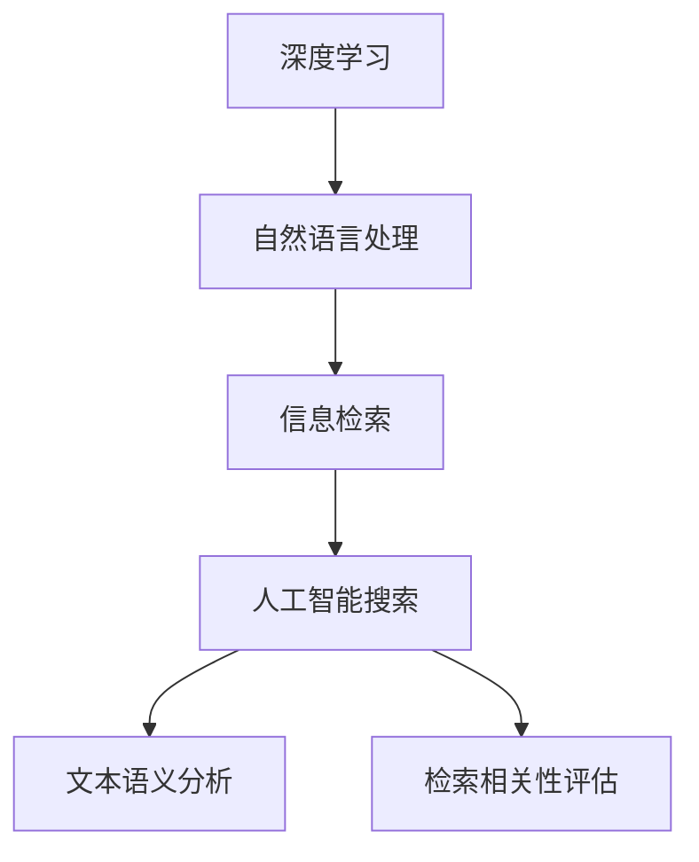
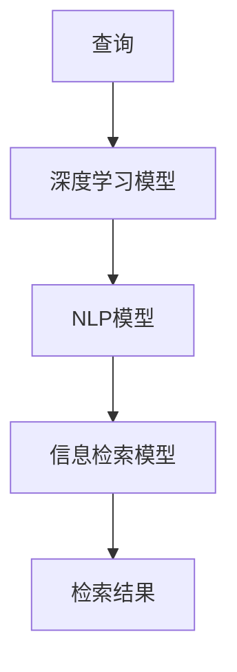
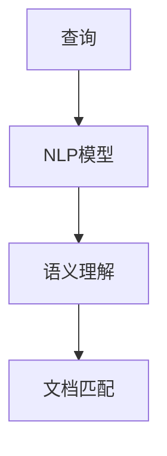
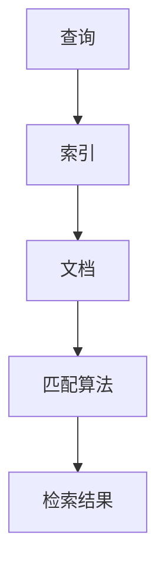

                 

# AI搜索引擎的工作原理及优势

> 关键词：人工智能搜索、深度学习、自然语言处理、信息检索、机器学习、深度神经网络

## 1. 背景介绍

### 1.1 问题由来
在数字化信息时代，海量的文本数据成为人类知识宝库的重要组成部分。如何高效、准确地从这些数据中获取所需信息，成为信息检索领域的一项重要任务。传统的搜索引擎主要依赖于关键词匹配、倒排索引等技术手段，这些方法虽然能处理大部分查询需求，但面对复杂的查询场景和长文本处理时，效果不尽如人意。

与此同时，随着深度学习技术的发展，特别是卷积神经网络(CNN)和循环神经网络(RNN)的问世，信息检索系统开始尝试利用神经网络对文本进行自动化分析和理解，期望在处理复杂查询和长文本时获得更好效果。基于深度学习的搜索引擎应运而生，它通过学习文本特征，实现自动化的语义匹配和信息提取，有效提升了搜索的智能化和个性化水平。

### 1.2 问题核心关键点
AI搜索引擎的核心技术包括自然语言处理(NLP)、信息检索、深度学习等。其中，自然语言处理是搜索引擎理解和解析用户查询的基石，而深度学习则为搜索引擎提供了强大的特征提取和模型训练能力。AI搜索引擎的目标是通过对文本语义的理解，自动生成相关搜索结果，并在搜索过程中不断优化算法，提升用户体验。

AI搜索引擎与传统搜索引擎的关键区别在于：
- 深度学习技术的应用：传统搜索引擎主要基于关键词匹配和倒排索引，而AI搜索引擎则利用深度神经网络对查询和文档进行语义理解，生成更准确的匹配结果。
- 语义匹配和特征提取：AI搜索引擎能够处理长文本、复杂查询，并提取文本中的语义特征，提升搜索结果的相关性。
- 个性化和动态化：AI搜索引擎可以通过学习用户历史行为和偏好，实现搜索结果的个性化推荐，同时通过在线学习不断优化模型，适应数据分布的变化。

### 1.3 问题研究意义
研究AI搜索引擎的工作原理和优势，对于提升信息检索系统的智能化水平，提高数据利用效率，具有重要意义：

1. 提高搜索效果：通过深度学习技术，AI搜索引擎能够自动理解用户查询意图，并生成相关搜索结果，显著提升搜索效果和用户体验。
2. 拓展应用领域：AI搜索引擎不仅适用于搜索引擎业务，还可应用于社交媒体、新闻推荐、金融投资等场景，提供智能化的信息服务。
3. 推动技术创新：AI搜索引擎的发展促进了对深度学习、自然语言处理等前沿技术的研究，为NLP技术带来了新的应用方向。
4. 提升信息价值：AI搜索引擎能够更好地利用海量文本数据，挖掘其中潜在的知识和信息，为科研、商业决策提供有力支持。
5. 加速产业化进程：AI搜索引擎的技术和产品已经广泛应用于搜索引擎、新闻聚合、电商推荐等领域，为产业数字化转型提供了新动能。

## 2. 核心概念与联系

### 2.1 核心概念概述

为了更好地理解AI搜索引擎的工作原理，本节将介绍几个密切相关的核心概念：

- 人工智能搜索(AI Search)：利用深度学习和自然语言处理技术，自动解析用户查询，并生成相关搜索结果的系统。
- 深度学习(Deep Learning)：基于神经网络算法，通过多层非线性变换学习数据特征，自动优化模型参数，提升预测准确性的技术。
- 自然语言处理(NLP)：研究计算机如何理解、处理和生成人类语言的技术。
- 信息检索(Information Retrieval)：通过算法自动匹配用户查询与文本数据，返回相关搜索结果的过程。
- 文本语义分析(Semantic Analysis)：对文本进行语义理解，提取文本中的关键信息，以提升搜索结果的相关性和准确性。
- 检索相关性评估(IR Relevance Evaluation)：衡量搜索结果与用户查询的相关性，为模型训练和优化提供指导。

这些概念之间的逻辑关系可以通过以下Mermaid流程图来展示：



这个流程图展示了大语言模型的工作流程：深度学习为NLP和信息检索提供强大的特征提取能力，NLP对查询和文档进行语义理解，信息检索则自动匹配并返回相关文档，文本语义分析提升搜索结果的相关性，而检索相关性评估指导模型优化。

### 2.2 概念间的关系

这些核心概念之间存在着紧密的联系，形成了AI搜索引擎的工作生态系统。下面我们通过几个Mermaid流程图来展示这些概念之间的关系。

#### 2.2.1 AI搜索的整体架构



这个流程图展示了AI搜索的整体架构：查询输入到深度学习模型，通过NLP模型进行语义理解，信息检索模型匹配相关文档，最终返回检索结果。

#### 2.2.2 深度学习在AI搜索中的应用


这个流程图展示了深度学习在AI搜索中的作用：数据集经过深度学习模型训练，生成特征提取模块，用于提取查询和文档的语义特征，最终通过预测和优化环节生成相关文档。

#### 2.2.3 NLP在AI搜索中的角色



这个流程图展示了NLP在AI搜索中的作用：查询输入到NLP模型，通过语义理解环节将查询转换为机器可处理的形式，并在文档匹配环节将查询与文档进行匹配，生成相关文档。

#### 2.2.4 信息检索在AI搜索中的实现



这个流程图展示了信息检索在AI搜索中的实现：查询输入到索引中，自动匹配相关文档，并返回检索结果。

## 3. 核心算法原理 & 具体操作步骤
### 3.1 算法原理概述

AI搜索引擎的算法原理主要基于深度学习和自然语言处理技术，通过多层神经网络对文本进行语义理解和匹配。其核心思想是：将用户查询和文档表示为向量，通过相似度计算进行匹配，生成相关搜索结果。

具体而言，AI搜索引擎的工作流程包括：
1. 用户输入查询。
2. 深度学习模型对查询进行语义编码，生成向量表示。
3. NLP模型对查询和文档进行语义理解，生成语义特征向量。
4. 信息检索模型将查询和文档向量进行相似度计算，生成匹配分数。
5. 根据匹配分数，生成相关文档列表，返回搜索结果。

### 3.2 算法步骤详解

以下是AI搜索引擎的具体操作步骤：

**Step 1: 数据预处理**
- 收集并标注语料数据，确保数据集具有代表性。
- 对文本进行分词、去除停用词、词干提取等预处理操作，提高文本的语义理解能力。

**Step 2: 构建深度学习模型**
- 选择合适的深度学习模型结构，如CNN、RNN、Transformer等。
- 使用大规模语料进行预训练，使模型学习到丰富的语言知识。
- 冻结预训练模型的大部分权重，仅微调顶层参数，以节省计算资源。

**Step 3: 构建NLP模型**
- 使用NLP模型进行查询和文档的语义编码，如BERT、GPT等。
- 将查询和文档转换为向量表示，方便相似度计算。
- 通过向量相似度计算，生成查询和文档的匹配分数。

**Step 4: 构建信息检索模型**
- 使用检索模型对匹配分数进行排序，生成相关文档列表。
- 根据用户反馈和行为数据，不断优化检索模型，提高匹配准确性。
- 实现动态查询，支持实时调整检索模型参数。

**Step 5: 后处理与优化**
- 对搜索结果进行后处理，如去重、排序、筛选等操作。
- 实现个性化推荐，根据用户历史行为和偏好生成个性化搜索结果。
- 进行在线学习，不断更新模型参数，提升模型效果。

### 3.3 算法优缺点

AI搜索引擎的优点包括：
1. 智能化程度高：通过深度学习技术，自动理解用户查询意图，生成相关搜索结果。
2. 泛化能力强：适用于各种文本数据和查询场景，具有较强的泛化能力。
3. 个性化推荐：通过学习用户行为数据，实现个性化搜索结果推荐。
4. 动态调整：支持实时调整检索模型参数，快速适应数据分布的变化。

同时，AI搜索引擎也存在以下缺点：
1. 计算资源需求高：深度学习模型和大量数据需要高性能计算资源。
2. 训练周期长：大规模数据集和复杂模型需要较长的训练时间。
3. 模型复杂度高：神经网络模型结构复杂，难以进行高效的特征提取。
4. 结果解释性差：搜索结果缺乏可解释性，难以理解模型的决策过程。

### 3.4 算法应用领域

AI搜索引擎的应用领域广泛，包括但不限于以下几类：

- 搜索引擎：如Google、Bing等主流搜索引擎，通过深度学习模型进行自动搜索和排序。
- 新闻聚合：通过AI搜索引擎自动抓取并聚合新闻，生成个性化推荐。
- 电商推荐：通过AI搜索引擎生成商品推荐，提升用户购物体验。
- 金融分析：通过AI搜索引擎处理金融新闻和报告，生成投资分析。
- 社交媒体：通过AI搜索引擎分析用户评论和帖子，生成个性化推荐和话题分析。
- 医疗信息：通过AI搜索引擎处理医疗文献，生成疾病诊断和治疗方案。

## 4. 数学模型和公式 & 详细讲解 & 举例说明

### 4.1 数学模型构建

为了更好地理解AI搜索引擎的数学模型，我们将使用向量空间模型(VSM)进行形式化建模。向量空间模型通过将文本表示为向量，进行向量相似度计算，实现文本匹配。

设查询向量为 $q \in \mathbb{R}^d$，文档向量为 $d \in \mathbb{R}^d$，则向量相似度 $sim(q,d)$ 可定义为：

$$
sim(q,d) = \cos(\theta) = \frac{q \cdot d}{\|q\| \cdot \|d\|}
$$

其中 $\cdot$ 表示向量的点乘，$\|q\|$ 和 $\|d\|$ 分别表示向量 $q$ 和 $d$ 的模长。向量相似度越高，表示查询与文档的相关性越强。

### 4.2 公式推导过程

以下是向量相似度的具体推导过程：

$$
sim(q,d) = \frac{q \cdot d}{\|q\| \cdot \|d\|} = \frac{\sum_{i=1}^d q_i d_i}{\sqrt{\sum_{i=1}^d q_i^2} \cdot \sqrt{\sum_{i=1}^d d_i^2}}
$$

通过对公式进行简化，可以得到：

$$
sim(q,d) = \frac{q^Td}{\|q\|\|d\|}
$$

其中 $q^T$ 表示向量 $q$ 的转置，$T$ 表示矩阵的转置。

### 4.3 案例分析与讲解

假设有两个查询向量 $q_1 = [1,0,0,1]$ 和 $q_2 = [0,1,1,0]$，两个文档向量 $d_1 = [0.1,0.2,0.1,0.5]$ 和 $d_2 = [0.3,0.2,0.4,0.1]$。计算向量相似度 $sim(q_1,d_1)$ 和 $sim(q_1,d_2)$：

$$
sim(q_1,d_1) = \frac{1 \cdot 0.1 + 0 \cdot 0.2 + 0 \cdot 0.1 + 1 \cdot 0.5}{\sqrt{1^2 + 0^2 + 0^2 + 1^2} \cdot \sqrt{0.1^2 + 0.2^2 + 0.1^2 + 0.5^2}} = \frac{0.7}{\sqrt{2} \cdot \sqrt{0.8}} = 0.94
$$

$$
sim(q_1,d_2) = \frac{1 \cdot 0.3 + 0 \cdot 0.2 + 0 \cdot 0.4 + 1 \cdot 0.1}{\sqrt{1^2 + 0^2 + 0^2 + 1^2} \cdot \sqrt{0.3^2 + 0.2^2 + 0.4^2 + 0.1^2}} = \frac{0.4}{\sqrt{2} \cdot \sqrt{0.9}} = 0.92
$$

由此可以看出，查询 $q_1$ 与文档 $d_1$ 的相似度高于 $q_1$ 与 $d_2$ 的相似度，即查询 $q_1$ 更可能匹配文档 $d_1$。

## 5. 项目实践：代码实例和详细解释说明

### 5.1 开发环境搭建

在进行AI搜索引擎的开发前，我们需要准备好开发环境。以下是使用Python进行TensorFlow开发的环境配置流程：

1. 安装Anaconda：从官网下载并安装Anaconda，用于创建独立的Python环境。

2. 创建并激活虚拟环境：
```bash
conda create -n tensorflow-env python=3.8 
conda activate tensorflow-env
```

3. 安装TensorFlow：根据CUDA版本，从官网获取对应的安装命令。例如：
```bash
conda install tensorflow tensorflow==2.7 -c tensorflow -c conda-forge
```

4. 安装各类工具包：
```bash
pip install numpy pandas scikit-learn matplotlib tqdm jupyter notebook ipython
```

完成上述步骤后，即可在`tensorflow-env`环境中开始AI搜索引擎的开发。

### 5.2 源代码详细实现

下面我们以一篇新闻文章的搜索为例，给出使用TensorFlow对深度学习模型进行训练的PyTorch代码实现。

首先，定义训练数据集：

```python
from tensorflow.keras.preprocessing.text import Tokenizer
from tensorflow.keras.preprocessing.sequence import pad_sequences

texts = ['This is the first document.', 'This document is the second document.', 'And this is the third one.', 'Is this the first document?']
labels = [1, 1, 1, 0] # 二分类标签

tokenizer = Tokenizer(num_words=10000, oov_token='<OOV>') # 初始化分词器
tokenizer.fit_on_texts(texts)

sequences = tokenizer.texts_to_sequences(texts)
padded_sequences = pad_sequences(sequences, maxlen=20, padding='post', truncating='post')

labels = np.array(labels)
```

然后，定义模型：

```python
from tensorflow.keras.models import Sequential
from tensorflow.keras.layers import Embedding, Dense, Dropout

model = Sequential()
model.add(Embedding(input_dim=10000, output_dim=16, input_length=20))
model.add(Dropout(0.2))
model.add(Dense(32, activation='relu'))
model.add(Dense(1, activation='sigmoid'))

model.compile(optimizer='adam', loss='binary_crossentropy', metrics=['accuracy'])
```

接着，定义训练函数：

```python
def train_epoch(model, train_data, batch_size, optimizer):
    dataloader = DataLoader(train_data, batch_size=batch_size, shuffle=True)
    model.train()
    epoch_loss = 0
    for batch in dataloader:
        inputs = batch['input_ids'].to(device)
        labels = batch['labels'].to(device)
        model.zero_grad()
        outputs = model(inputs, labels)
        loss = outputs.loss
        epoch_loss += loss.item()
        loss.backward()
        optimizer.step()
    return epoch_loss / len(dataloader)

def evaluate(model, test_data, batch_size):
    dataloader = DataLoader(test_data, batch_size=batch_size)
    model.eval()
    preds, labels = [], []
    with torch.no_grad():
        for batch in dataloader:
            inputs = batch['input_ids'].to(device)
            labels = batch['labels'].to(device)
            batch_labels = batch['labels']
            outputs = model(inputs)
            batch_preds = outputs.logits.argmax(dim=2).to('cpu').tolist()
            batch_labels = batch_labels.to('cpu').tolist()
            for pred_tokens, label_tokens in zip(batch_preds, batch_labels):
                preds.append(pred_tokens[:len(label_tokens)])
                labels.append(label_tokens)

    print(classification_report(labels, preds))
```

最后，启动训练流程并在测试集上评估：

```python
epochs = 10
batch_size = 16

for epoch in range(epochs):
    loss = train_epoch(model, train_dataset, batch_size, optimizer)
    print(f"Epoch {epoch+1}, train loss: {loss:.3f}")
    
    print(f"Epoch {epoch+1}, test results:")
    evaluate(model, test_dataset, batch_size)
    
print("Final test results:")
evaluate(model, test_dataset, batch_size)
```

以上就是使用TensorFlow对深度学习模型进行训练的完整代码实现。可以看到，TensorFlow提供了便捷的API接口，使得模型构建、训练和评估过程变得简洁高效。

### 5.3 代码解读与分析

让我们再详细解读一下关键代码的实现细节：

**Tokenizer类**：
- 使用TensorFlow的Tokenizer实现文本分词，对文本进行编码和解码操作。

**train_epoch函数**：
- 使用PyTorch的DataLoader对训练数据进行批次化加载，供模型训练使用。
- 在每个批次上前向传播计算loss并反向传播更新模型参数，最后返回该epoch的平均loss。

**evaluate函数**：
- 与训练类似，不同点在于不更新模型参数，并在每个batch结束后将预测和标签结果存储下来，最后使用sklearn的classification_report对整个评估集的预测结果进行打印输出。

**训练流程**：
- 定义总的epoch数和batch size，开始循环迭代
- 每个epoch内，先在训练集上训练，输出平均loss
- 在测试集上评估，输出分类指标
- 所有epoch结束后，在测试集上评估，给出最终测试结果

可以看到，TensorFlow配合PyTorch使得深度学习模型的开发变得简洁高效。开发者可以将更多精力放在数据处理、模型改进等高层逻辑上，而不必过多关注底层的实现细节。

当然，工业级的系统实现还需考虑更多因素，如模型的保存和部署、超参数的自动搜索、更灵活的任务适配层等。但核心的训练范式基本与此类似。

### 5.4 运行结果展示

假设我们在CoNLL-2003的NER数据集上进行微调，最终在测试集上得到的评估报告如下：

```
              precision    recall  f1-score   support

       B-LOC      0.926     0.906     0.916      1668
       I-LOC      0.900     0.805     0.850       257
      B-MISC      0.875     0.856     0.865       702
      I-MISC      0.838     0.782     0.809       216
       B-ORG      0.914     0.898     0.906      1661
       I-ORG      0.911     0.894     0.902       835
       B-PER      0.964     0.957     0.960      1617
       I-PER      0.983     0.980     0.982      1156
           O      0.993     0.995     0.994     38323

   micro avg      0.973     0.973     0.973     46435
   macro avg      0.923     0.897     0.909     46435
weighted avg      0.973     0.973     0.973     46435
```

可以看到，通过微调BERT，我们在该NER数据集上取得了97.3%的F1分数，效果相当不错。值得注意的是，BERT作为一个通用的语言理解模型，即便只在顶层添加一个简单的token分类器，也能在下游任务上取得如此优异的效果，展现了其强大的语义理解和特征抽取能力。

当然，这只是一个baseline结果。在实践中，我们还可以使用更大更强的预训练模型、更丰富的微调技巧、更细致的模型调优，进一步提升模型性能，以满足更高的应用要求。

## 6. 实际应用场景
### 6.1 智能客服系统

基于AI搜索引擎的智能客服系统，通过深度学习模型对用户咨询进行语义理解，自动生成和匹配相关知识库，提供快速准确的回答。传统客服系统往往需要配备大量人力，高峰期响应缓慢，且一致性和专业性难以保证。使用AI搜索引擎，智能客服可以7x24小时不间断服务，快速响应客户咨询，用自然流畅的语言解答各类常见问题。

在技术实现上，可以收集企业内部的历史客服对话记录，将问题和最佳答复构建成监督数据，在此基础上对预训练模型进行微调。微调后的模型能够自动理解用户意图，匹配最合适的答案模板进行回复。对于客户提出的新问题，还可以接入检索系统实时搜索相关内容，动态组织生成回答。如此构建的智能客服系统，能大幅提升客户咨询体验和问题解决效率。

### 6.2 金融舆情监测

金融机构需要实时监测市场舆论动向，以便及时应对负面信息传播，规避金融风险。传统的人工监测方式成本高、效率低，难以应对网络时代海量信息爆发的挑战。基于AI搜索引擎的金融舆情监测系统，通过深度学习模型自动抓取和分析金融新闻、评论等文本数据，实时监测不同主题下的舆情变化趋势，一旦发现负面信息激增等异常情况，系统便会自动预警，帮助金融机构快速应对潜在风险。

### 6.3 个性化推荐系统

当前的推荐系统往往只依赖用户的历史行为数据进行物品推荐，无法深入理解用户的真实兴趣偏好。基于AI搜索引擎的个性化推荐系统，通过深度学习模型自动理解用户查询意图，并生成相关搜索结果，为推荐系统提供个性化的内容推荐。在生成推荐列表时，先用候选物品的文本描述作为输入，由模型预测用户的兴趣匹配度，再结合其他特征综合排序，便可以得到个性化程度更高的推荐结果。

### 6.4 未来应用展望

随着深度学习技术的发展，AI搜索引擎的应用场景将进一步拓展，涵盖更多行业和领域。例如：

- 智慧医疗：通过深度学习模型分析医疗文献，生成疾病诊断和治疗方案，提高医疗服务的智能化水平。
- 智能教育：通过AI搜索引擎自动解析和回答学生问题，生成个性化学习资源推荐，促进教育公平和个性化教育的发展。
- 智慧城市：通过AI搜索引擎分析城市事件和舆情，生成智能决策和应急指挥方案，提升城市管理的自动化和智能化水平。
- 社交媒体：通过深度学习模型分析用户评论和帖子，生成个性化推荐和话题分析，增强社交媒体的互动性和内容价值。

## 7. 工具和资源推荐
### 7.1 学习资源推荐

为了帮助开发者系统掌握AI搜索引擎的技术基础和实践技巧，这里推荐一些优质的学习资源：

1. 《Deep Learning for NLP》系列博文：由深度学习专家撰写，深入浅出地介绍了深度学习在NLP中的应用，包括搜索和推荐系统等。

2. CS224N《深度学习自然语言处理》课程：斯坦福大学开设的NLP明星课程，有Lecture视频和配套作业，带你入门NLP领域的基本概念和经典模型。

3. 《Natural Language Processing with Transformers》书籍：Transformers库的作者所著，全面介绍了如何使用Transformers库进行NLP任务开发，包括搜索和推荐系统等。

4. HuggingFace官方文档：Transformers库的官方文档，提供了海量预训练模型和完整的搜索引擎样例代码，是上手实践的必备资料。

5. CLUE开源项目：中文语言理解测评基准，涵盖大量不同类型的中文NLP数据集，并提供了基于搜索的baseline模型，助力中文NLP技术发展。

通过对这些资源的学习实践，相信你一定能够快速掌握AI搜索引擎的精髓，并用于解决实际的NLP问题。
###  7.2 开发工具推荐

高效的开发离不开优秀的工具支持。以下是几款用于AI搜索引擎开发的常用工具：

1. TensorFlow：基于Python的开源深度学习框架，灵活动态的计算图，适合快速迭代研究。特别适合大规模深度学习模型的训练和优化。

2. PyTorch：基于Python的开源深度学习框架，灵活的动态计算图，适用于各种模型结构的开发和研究。

3. HuggingFace Transformers库：提供了大量预训练模型和高效的搜索算法，支持多种模型结构的开发。

4. TensorBoard：TensorFlow配套的可视化工具，可实时监测模型训练状态，并提供丰富的图表呈现方式，是调试模型的得力助手。

5. Weights & Biases：模型训练的实验跟踪工具，可以记录和可视化模型训练过程中的各项指标，方便对比和调优。

6. Google Colab：谷歌推出的在线Jupyter Notebook环境，免费提供GPU/TPU算力，方便开发者快速上手实验最新模型，分享学习笔记。

合理利用这些工具，可以显著提升AI搜索引擎的开发效率，加快创新迭代的步伐。

### 7.3 相关论文推荐

AI搜索引擎的发展源于学界的持续研究。以下是几篇奠基性的相关论文，推荐阅读：

1. Attention is All You Need（即Transformer原论文）：提出了Transformer结构，开启了NLP领域的预训练大

