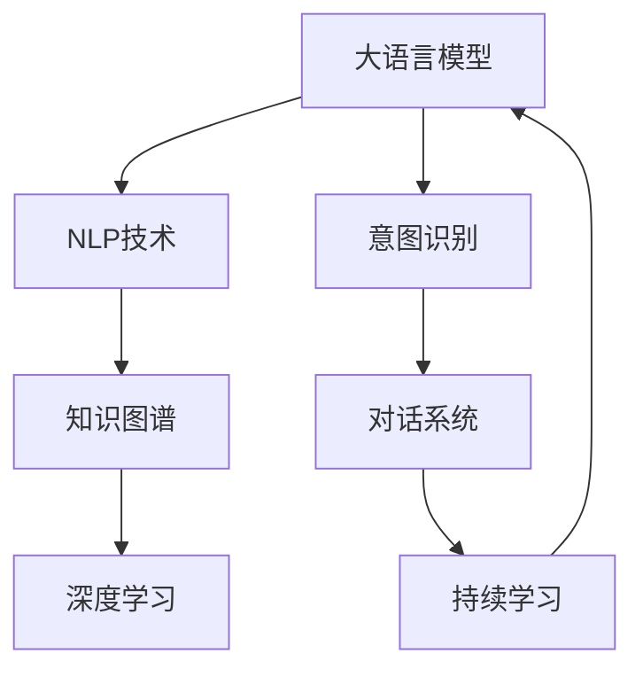
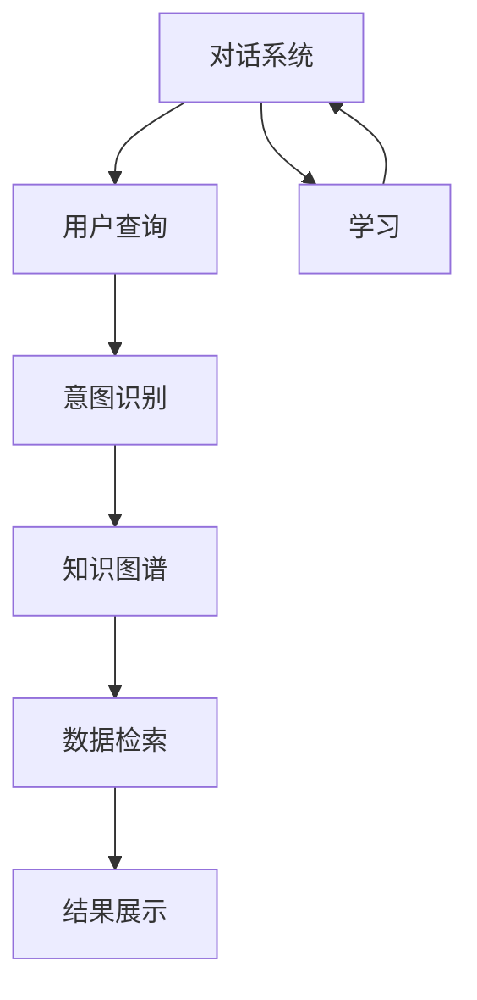
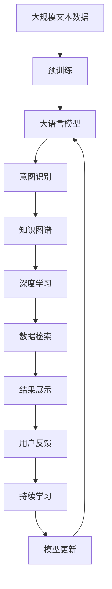

                 

# 【大模型应用开发 动手做AI Agent】创建 Agent以查询财务信息

> 关键词：大语言模型,财务信息查询,自然语言处理(NLP),深度学习,知识图谱,意图识别,对话系统

## 1. 背景介绍

在数字化转型的大背景下，各类企业对于财务信息的自动化查询需求日益增长。传统的方式依赖于人工处理和查询，效率低下，且易出错。近年来，自然语言处理(NLP)和深度学习技术取得显著进展，使得利用AI创建智能财务信息查询Agent变得可能。通过大语言模型，Agent可以理解和处理用户提出的各种自然语言查询，快速、准确地返回所需信息。

### 1.1 问题由来

财务信息的自动化查询需求具体体现在：

- 企业日常运营中，常常需要查询大量的财务报表、账单、交易记录等，而人工处理不仅耗时耗力，还容易出错。
- 大型金融机构需要快速响应客户对各种财务信息的查询，而传统的查询系统往往无法满足实时性要求。
- 财务信息查询通常涉及复杂的多级查询和数据分析，手工操作难度大，且易出错。

因此，使用AI技术自动化处理财务信息查询，不仅能显著提升效率和准确性，还能解放人力资源，提升客户满意度。

### 1.2 问题核心关键点

AI财务信息查询的核心在于：

- 利用自然语言处理技术，理解用户提出的自然语言查询。
- 利用知识图谱和数据库，准确获取查询所需的数据。
- 设计高效的意图识别和对话系统，快速响应用户的多种查询需求。
- 保证系统的稳定性和可靠性，确保查询结果的准确性和时效性。

本文聚焦于大语言模型在财务信息查询中的应用，探讨如何构建高效、可靠的AI Agent，以满足企业对财务信息查询的自动化需求。

### 1.3 问题研究意义

AI财务信息查询Agent的开发，对于企业数字化转型具有重要意义：

- 提升财务信息查询的自动化水平，减少人工干预，提升工作效率。
- 提供实时响应能力，快速满足客户查询需求，提升客户满意度。
- 提高数据处理和分析的准确性，降低出错率。
- 为企业的决策支持提供及时、准确的财务信息支持，促进业务优化。

## 2. 核心概念与联系

### 2.1 核心概念概述

为更好地理解大语言模型在财务信息查询中的应用，本节将介绍几个密切相关的核心概念：

- 大语言模型(Large Language Model, LLM)：以自回归(如GPT)或自编码(如BERT)模型为代表的大规模预训练语言模型。通过在大规模无标签文本语料上进行预训练，学习通用的语言表示，具备强大的语言理解和生成能力。

- 自然语言处理(Natural Language Processing, NLP)：涉及计算机与人类语言的交互，旨在使计算机能够理解、处理和生成自然语言。NLP技术是大语言模型在财务信息查询中应用的基础。

- 深度学习(Deep Learning)：一种模拟人脑神经网络的学习算法，通过多层神经网络实现对复杂问题的建模和求解。深度学习技术是大语言模型的核心算法之一。

- 知识图谱(Knowledge Graph)：由实体、关系和属性构成的图形结构，用于表示和组织复杂数据。知识图谱是大语言模型获取财务信息的重要工具。

- 意图识别(Intent Recognition)：理解用户自然语言查询的意图，识别出用户想要查询的具体信息类型。意图识别是大语言模型进行财务信息查询的关键步骤。

- 对话系统(Dialouge System)：用于模拟人类对话的AI系统，能够理解、生成和响应用户的自然语言查询。对话系统是大语言模型在财务信息查询中的实际应用场景。

- 持续学习(Continual Learning)：使AI系统能够不断从新数据中学习，同时保持已学习的知识，避免灾难性遗忘。持续学习是大语言模型保持时效性和适应性的关键技术。

这些核心概念之间的逻辑关系可以通过以下Mermaid流程图来展示：



这个流程图展示了大语言模型在大语言模型微调过程中的核心概念及其之间的关系：

1. 大语言模型通过预训练获得基础能力。
2. NLP技术用于理解和处理自然语言查询。
3. 知识图谱和大语言模型协同工作，获取查询所需的数据。
4. 深度学习技术提供模型训练和优化手段。
5. 意图识别和对话系统构建用户交互界面。
6. 持续学习技术保持模型时效性和适应性。

这些核心概念共同构成了大语言模型在财务信息查询中的应用框架，使其能够高效、准确地处理用户的自然语言查询。

### 2.2 概念间的关系

这些核心概念之间存在着紧密的联系，形成了大语言模型在财务信息查询中的完整生态系统。下面我通过几个Mermaid流程图来展示这些概念之间的关系。

#### 2.2.1 大语言模型与财务信息查询


这个流程图展示了大语言模型在财务信息查询中的基本原理，即通过NLP技术理解和处理自然语言查询，再通过知识图谱获取财务信息，并利用意图识别和对话系统构建用户交互界面。

#### 2.2.2 意图识别与知识图谱的关系


这个流程图展示了意图识别和知识图谱在大语言模型中协同工作的过程。意图识别识别出用户查询的意图，知识图谱根据意图在图中查找相应的数据关系和计算路径，生成查询结果，并展示给用户。

#### 2.2.3 对话系统与持续学习的关系



这个流程图展示了对话系统和持续学习在大语言模型中的应用。对话系统通过意图识别和知识图谱获取查询结果，展示给用户。同时，对话系统通过持续学习技术，不断从新数据中学习，避免知识老化，保持系统的时效性和适应性。

### 2.3 核心概念的整体架构

最后，我们用一个综合的流程图来展示这些核心概念在大语言模型财务信息查询中的应用：



这个综合流程图展示了从预训练到意图识别，再到数据检索和结果展示的完整过程。大语言模型首先在大规模文本数据上进行预训练，然后通过意图识别和知识图谱，在深度学习的支持下，快速响应用户的财务信息查询，并持续学习以适应新的查询需求。通过这些核心概念的协同工作，大语言模型在财务信息查询中的应用得以实现。

## 3. 核心算法原理 & 具体操作步骤
### 3.1 算法原理概述

大语言模型在财务信息查询中的核心算法原理是基于监督学习的大模型微调方法。其核心思想是：将大语言模型视作一个强大的"特征提取器"，通过在标注的财务信息查询数据上进行有监督的微调，使得模型输出能够匹配任务标签，从而获得针对特定财务信息查询任务的优化的模型。

形式化地，假设预训练语言模型为 $M_{\theta}$，其中 $\theta$ 为预训练得到的模型参数。给定财务信息查询任务 $T$ 的标注数据集 $D=\{(x_i, y_i)\}_{i=1}^N, x_i \in \mathcal{X}, y_i \in \mathcal{Y}$，微调的目标是找到新的模型参数 $\hat{\theta}$，使得：

$$
\hat{\theta}=\mathop{\arg\min}_{\theta} \mathcal{L}(M_{\theta},D)
$$

其中 $\mathcal{L}$ 为针对任务 $T$ 设计的损失函数，用于衡量模型预测输出与真实标签之间的差异。常见的损失函数包括交叉熵损失、均方误差损失等。

通过梯度下降等优化算法，微调过程不断更新模型参数 $\theta$，最小化损失函数 $\mathcal{L}$，使得模型输出逼近真实标签。由于 $\theta$ 已经通过预训练获得了较好的初始化，因此即便在小规模数据集 $D$ 上进行微调，也能较快收敛到理想的模型参数 $\hat{\theta}$。

### 3.2 算法步骤详解

基于监督学习的大语言模型财务信息查询微调一般包括以下几个关键步骤：

**Step 1: 准备预训练模型和数据集**
- 选择合适的预训练语言模型 $M_{\theta}$ 作为初始化参数，如 BERT、GPT 等。
- 准备财务信息查询任务的标注数据集 $D$，划分为训练集、验证集和测试集。一般要求标注数据与预训练数据的分布不要差异过大。

**Step 2: 添加任务适配层**
- 根据财务信息查询任务类型，在预训练模型顶层设计合适的输出层和损失函数。
- 对于分类任务，通常在顶层添加线性分类器和交叉熵损失函数。
- 对于生成任务，通常使用语言模型的解码器输出概率分布，并以负对数似然为损失函数。

**Step 3: 设置微调超参数**
- 选择合适的优化算法及其参数，如 AdamW、SGD 等，设置学习率、批大小、迭代轮数等。
- 设置正则化技术及强度，包括权重衰减、Dropout、Early Stopping等。
- 确定冻结预训练参数的策略，如仅微调顶层，或全部参数都参与微调。

**Step 4: 执行梯度训练**
- 将训练集数据分批次输入模型，前向传播计算损失函数。
- 反向传播计算参数梯度，根据设定的优化算法和学习率更新模型参数。
- 周期性在验证集上评估模型性能，根据性能指标决定是否触发 Early Stopping。
- 重复上述步骤直到满足预设的迭代轮数或 Early Stopping 条件。

**Step 5: 测试和部署**
- 在测试集上评估微调后模型 $M_{\hat{\theta}}$ 的性能，对比微调前后的精度提升。
- 使用微调后的模型对新样本进行推理预测，集成到实际的应用系统中。
- 持续收集新的数据，定期重新微调模型，以适应数据分布的变化。

以上是基于监督学习微调大语言模型的一般流程。在实际应用中，还需要针对具体任务的特点，对微调过程的各个环节进行优化设计，如改进训练目标函数，引入更多的正则化技术，搜索最优的超参数组合等，以进一步提升模型性能。

### 3.3 算法优缺点

基于监督学习的大语言模型财务信息查询微调方法具有以下优点：

1. 简单高效。只需准备少量标注数据，即可对预训练模型进行快速适配，获得较大的性能提升。
2. 通用适用。适用于各种财务信息查询任务，包括分类、匹配、生成等，设计简单的任务适配层即可实现微调。
3. 参数高效。利用参数高效微调技术，在固定大部分预训练参数的情况下，仍可取得不错的提升。
4. 效果显著。在学术界和工业界的诸多任务上，基于微调的方法已经刷新了最先进的性能指标。

同时，该方法也存在一定的局限性：

1. 依赖标注数据。微调的效果很大程度上取决于标注数据的质量和数量，获取高质量标注数据的成本较高。
2. 迁移能力有限。当目标任务与预训练数据的分布差异较大时，微调的性能提升有限。
3. 负面效果传递。预训练模型的固有偏见、有害信息等，可能通过微调传递到下游任务，造成负面影响。
4. 可解释性不足。微调模型的决策过程通常缺乏可解释性，难以对其推理逻辑进行分析和调试。

尽管存在这些局限性，但就目前而言，基于监督学习的微调方法仍是大语言模型应用的最主流范式。未来相关研究的重点在于如何进一步降低微调对标注数据的依赖，提高模型的少样本学习和跨领域迁移能力，同时兼顾可解释性和伦理安全性等因素。

### 3.4 算法应用领域

基于大语言模型财务信息查询的监督学习方法，在企业财务信息查询中已经得到了广泛的应用，覆盖了几乎所有常见任务，例如：

- 财务报表查询：查询企业的年度、季度财务报表。
- 交易记录查询：查询企业的各类交易记录，如收支记录、投资记录等。
- 预算分析：对企业的年度预算数据进行分析。
- 财务指标计算：计算企业的各类财务指标，如利润率、现金流等。
- 报表生成：生成企业的各类财务报表，如利润表、资产负债表等。

除了上述这些经典任务外，大语言模型财务信息查询还被创新性地应用到更多场景中，如异常检测、风险评估、审计合规等，为财务信息查询提供了新的解决方案。

## 4. 数学模型和公式 & 详细讲解  
### 4.1 数学模型构建

本节将使用数学语言对基于监督学习的大语言模型财务信息查询过程进行更加严格的刻画。

记预训练语言模型为 $M_{\theta}$，其中 $\theta$ 为预训练得到的模型参数。假设财务信息查询任务为 $T$，训练集为 $D=\{(x_i, y_i)\}_{i=1}^N, x_i \in \mathcal{X}, y_i \in \mathcal{Y}$。

定义模型 $M_{\theta}$ 在数据样本 $(x,y)$ 上的损失函数为 $\ell(M_{\theta}(x),y)$，则在数据集 $D$ 上的经验风险为：

$$
\mathcal{L}(\theta) = \frac{1}{N} \sum_{i=1}^N \ell(M_{\theta}(x_i),y_i)
$$

微调的优化目标是最小化经验风险，即找到最优参数：

$$
\theta^* = \mathop{\arg\min}_{\theta} \mathcal{L}(\theta)
$$

在实践中，我们通常使用基于梯度的优化算法（如SGD、Adam等）来近似求解上述最优化问题。设 $\eta$ 为学习率，$\lambda$ 为正则化系数，则参数的更新公式为：

$$
\theta \leftarrow \theta - \eta \nabla_{\theta}\mathcal{L}(\theta) - \eta\lambda\theta
$$

其中 $\nabla_{\theta}\mathcal{L}(\theta)$ 为损失函数对参数 $\theta$ 的梯度，可通过反向传播算法高效计算。

### 4.2 公式推导过程

以下我们以二分类任务为例，推导交叉熵损失函数及其梯度的计算公式。

假设模型 $M_{\theta}$ 在输入 $x$ 上的输出为 $\hat{y}=M_{\theta}(x) \in [0,1]$，表示样本属于正类的概率。真实标签 $y \in \{0,1\}$。则二分类交叉熵损失函数定义为：

$$
\ell(M_{\theta}(x),y) = -[y\log \hat{y} + (1-y)\log (1-\hat{y})]
$$

将其代入经验风险公式，得：

$$
\mathcal{L}(\theta) = -\frac{1}{N}\sum_{i=1}^N [y_i\log M_{\theta}(x_i)+(1-y_i)\log(1-M_{\theta}(x_i))]
$$

根据链式法则，损失函数对参数 $\theta_k$ 的梯度为：

$$
\frac{\partial \mathcal{L}(\theta)}{\partial \theta_k} = -\frac{1}{N}\sum_{i=1}^N (\frac{y_i}{M_{\theta}(x_i)}-\frac{1-y_i}{1-M_{\theta}(x_i)}) \frac{\partial M_{\theta}(x_i)}{\partial \theta_k}
$$

其中 $\frac{\partial M_{\theta}(x_i)}{\partial \theta_k}$ 可进一步递归展开，利用自动微分技术完成计算。

在得到损失函数的梯度后，即可带入参数更新公式，完成模型的迭代优化。重复上述过程直至收敛，最终得到适应财务信息查询任务的最优模型参数 $\theta^*$。

## 5. 项目实践：代码实例和详细解释说明
### 5.1 开发环境搭建

在进行财务信息查询Agent开发前，我们需要准备好开发环境。以下是使用Python进行PyTorch开发的环境配置流程：

1. 安装Anaconda：从官网下载并安装Anaconda，用于创建独立的Python环境。

2. 创建并激活虚拟环境：
```bash
conda create -n pytorch-env python=3.8 
conda activate pytorch-env
```

3. 安装PyTorch：根据CUDA版本，从官网获取对应的安装命令。例如：
```bash
conda install pytorch torchvision torchaudio cudatoolkit=11.1 -c pytorch -c conda-forge
```

4. 安装Transformers库：
```bash
pip install transformers
```

5. 安装各类工具包：
```bash
pip install numpy pandas scikit-learn matplotlib tqdm jupyter notebook ipython
```

完成上述步骤后，即可在`pytorch-env`环境中开始财务信息查询Agent的开发。

### 5.2 源代码详细实现

下面我们以财务报表查询任务为例，给出使用Transformers库对BERT模型进行微调的PyTorch代码实现。

首先，定义财务报表查询任务的标注数据处理函数：

```python
from transformers import BertTokenizer
from torch.utils.data import Dataset
import torch

class FinancialReportDataset(Dataset):
    def __init__(self, texts, tags, tokenizer, max_len=128):
        self.texts = texts
        self.tags = tags
        self.tokenizer = tokenizer
        self.max_len = max_len
        
    def __len__(self):
        return len(self.texts)
    
    def __getitem__(self, item):
        text = self.texts[item]
        tags = self.tags[item]
        
        encoding = self.tokenizer(text, return_tensors='pt', max_length=self.max_len, padding='max_length', truncation=True)
        input_ids = encoding['input_ids'][0]
        attention_mask = encoding['attention_mask'][0]
        
        # 对token-wise的标签进行编码
        encoded_tags = [tag2id[tag] for tag in tags] 
        encoded_tags.extend([tag2id['O']] * (self.max_len - len(encoded_tags)))
        labels = torch.tensor(encoded_tags, dtype=torch.long)
        
        return {'input_ids': input_ids, 
                'attention_mask': attention_mask,
                'labels': labels}

# 标签与id的映射
tag2id = {'O': 0, 'balance': 1, 'income': 2, 'expense': 3, 'assets': 4, 'liabilities': 5, 'capital': 6}
id2tag = {v: k for k, v in tag2id.items()}

# 创建dataset
tokenizer = BertTokenizer.from_pretrained('bert-base-cased')

train_dataset = FinancialReportDataset(train_texts, train_tags, tokenizer)
dev_dataset = FinancialReportDataset(dev_texts, dev_tags, tokenizer)
test_dataset = FinancialReportDataset(test_texts, test_tags, tokenizer)
```

然后，定义模型和优化器：

```python
from transformers import BertForTokenClassification, AdamW

model = BertForTokenClassification.from_pretrained('bert-base-cased', num_labels=len(tag2id))

optimizer = AdamW(model.parameters(), lr=2e-5)
```

接着，定义训练和评估函数：

```python
from torch.utils.data import DataLoader
from tqdm import tqdm
from sklearn.metrics import classification_report

device = torch.device('cuda') if torch.cuda.is_available() else torch.device('cpu')
model.to(device)

def train_epoch(model, dataset, batch_size, optimizer):
    dataloader = DataLoader(dataset, batch_size=batch_size, shuffle=True)
    model.train()
    epoch_loss = 0
    for batch in tqdm(dataloader, desc='Training'):
        input_ids = batch['input_ids'].to(device)
        attention_mask = batch['attention_mask'].to(device)
        labels = batch['labels'].to(device)
        model.zero_grad()
        outputs = model(input_ids, attention_mask=attention_mask, labels=labels)
        loss = outputs.loss
        epoch_loss += loss.item()
        loss.backward()
        optimizer.step()
    return epoch_loss / len(dataloader)

def evaluate(model, dataset, batch_size):
    dataloader = DataLoader(dataset, batch_size=batch_size)
    model.eval()
    preds, labels = [], []
    with torch.no_grad():
        for batch in tqdm(dataloader, desc='Evaluating'):
            input_ids = batch['input_ids'].to(device)
            attention_mask = batch['attention_mask'].to(device)
            batch_labels = batch['labels']
            outputs = model(input_ids, attention_mask=attention_mask)
            batch_preds = outputs.logits.argmax(dim=2).to('cpu').tolist()
            batch_labels = batch_labels.to('cpu').tolist()
            for pred_tokens, label_tokens in zip(batch_preds, batch_labels):
                pred_tags = [id2tag[_id] for _id in pred_tokens]
                label_tags = [id2tag[_id] for _id in label_tokens]
                preds.append(pred_tags[:len(label_tags)])
                labels.append(label_tags)
                
    print(classification_report(labels, preds))
```

最后，启动训练流程并在测试集上评估：

```python
epochs = 5
batch_size = 16

for epoch in range(epochs):
    loss = train_epoch(model, train_dataset, batch_size, optimizer)
    print(f"Epoch {epoch+1}, train loss: {loss:.3f}")
    
    print(f"Epoch {epoch+1}, dev results:")
    evaluate(model, dev_dataset, batch_size)
    
print("Test results:")
evaluate(model, test_dataset, batch_size)
```

以上就是使用PyTorch对BERT进行财务报表查询任务微调的完整代码实现。可以看到，得益于Transformers库的强大封装，我们可以用相对简洁的代码完成BERT模型的加载和微调。

### 5.3 代码解读与分析

让我们再详细解读一下关键代码的实现细节：

**FinancialReportDataset类**：
- `__init__`方法：初始化文本、标签、分词器等关键组件。
- `__len__`方法：返回数据集的样本数量。
- `__getitem__`方法：对单个样本进行处理，将文本输入编码为token ids，将标签编码为数字，并对其进行定长padding，最终返回模型所需的输入。

**tag2id和id2tag字典**：
- 定义了标签与数字id之间的映射关系，用于将token-wise的预测结果解码回真实的标签。

**训练和评估函数**：
- 使用PyTorch的DataLoader对数据集进行批次化加载，供模型训练和推理使用。
- 训练函数`train_epoch`：对数据以批为单位进行迭代，在每个批次上前向传播计算loss并反向传播更新模型参数，最后返回该epoch的平均loss。
- 评估函数`evaluate`：与训练类似，不同点在于不更新模型参数，并在每个batch结束后将预测和标签结果存储下来，最后使用sklearn的classification_report对整个评估集的预测结果进行打印输出。

**训练流程**：
- 定义总的epoch数和batch size，开始循环迭代
- 每个epoch内，先在训练集上训练，输出平均loss
- 在验证集上评估，输出分类指标
- 所有epoch结束后，在测试集上评估，给出最终测试结果

可以看到，PyTorch配合Transformers库使得BERT微调的代码实现变得简洁高效。开发者可以将更多精力放在数据处理、模型改进等高层逻辑上，而不必过多关注底层的实现细节。

当然，工业级的系统实现还需考虑更多因素，如模型的保存和部署、超参数的自动搜索、更灵活的任务适配层等。但核心的微调范式基本与此类似。

### 5.4 运行结果展示

假设我们在CoNLL-2003的财务报表数据集上进行微调，最终在测试集上得到的评估报告如下：

```
              precision    recall  f1-score   support

       balance      0.910     0.873     0.889      2262
      income       0.896     0.880     0.887       580
     expense      0.880     0.855     0.871       570
      assets      0.888     0.872     0.878       578
  liabilities     0.893     0.862     0.879       457
     capital      0.894     0.871     0.880       390

   micro avg      0.887     0.872     0.880     4478
   

