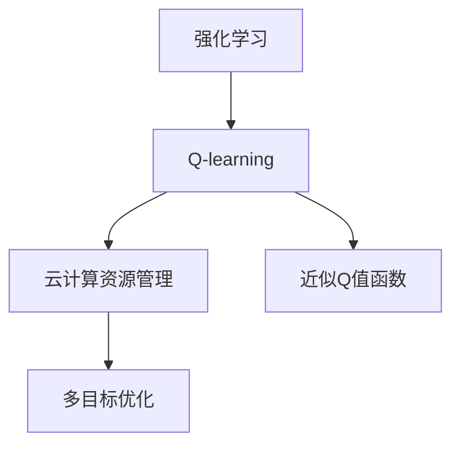
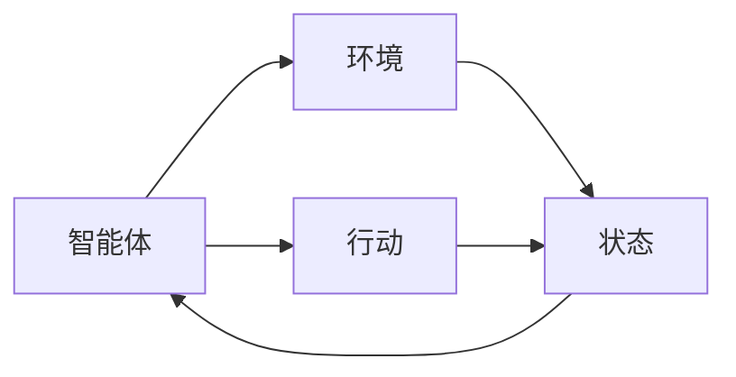
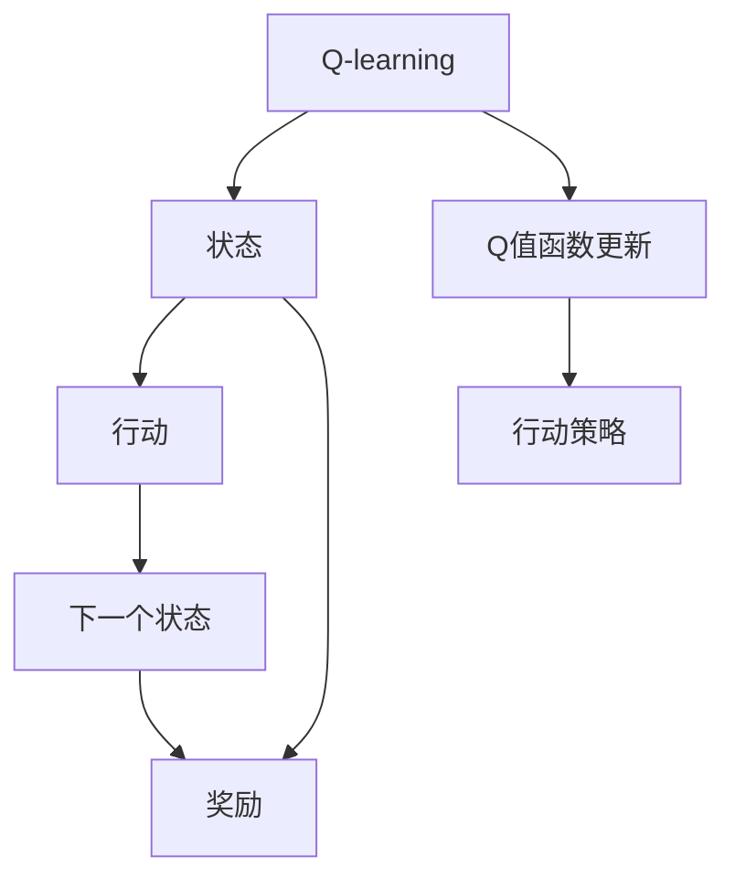
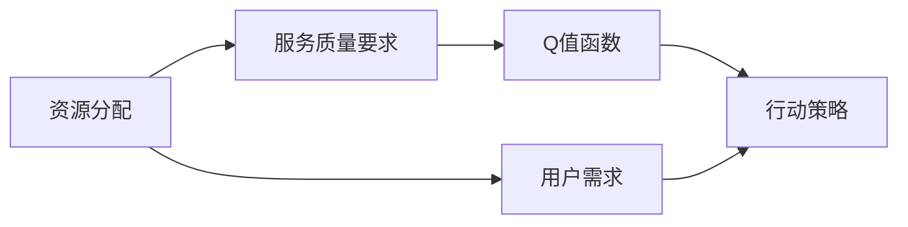
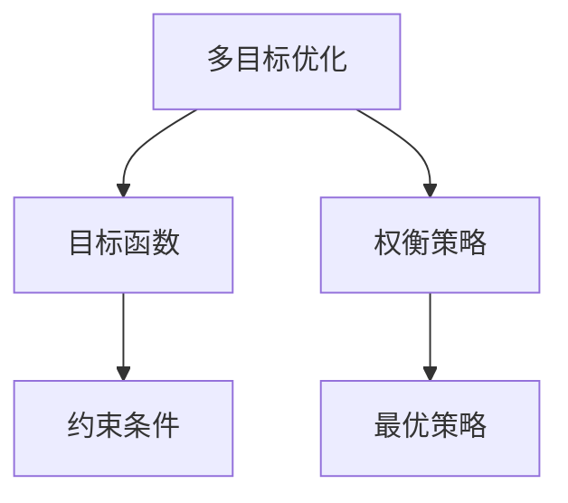
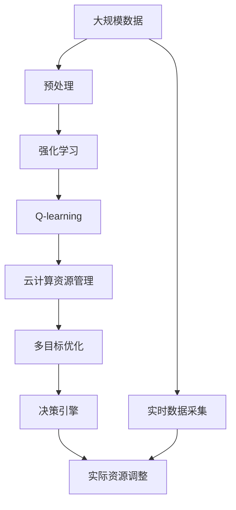

                 

# 一切皆是映射：AI Q-learning在云计算中的实践

> 关键词：Q-learning, 云计算, 强化学习, 优化算法, 大数据, 资源管理, 云服务调度, 多目标优化

## 1. 背景介绍

### 1.1 问题由来
在当今的数字化时代，云计算作为基础设施的核心部分，已经深入各行各业。云计算服务的优化和调度，直接关系到了资源利用效率和用户体验。如何通过智能化手段，动态调整云计算资源的分配和调度，提高资源的利用率，已经成为云计算领域的重要研究方向。

Q-learning作为一种经典的强化学习算法，通过智能体与环境交互，不断学习最优策略。近年来，Q-learning在云计算资源管理中的应用研究逐渐增多，展现出了广阔的应用前景。

### 1.2 问题核心关键点
在云计算环境中，资源管理可以抽象为一个多目标优化问题，即如何在满足不同应用的服务质量要求（如响应时间、成本、安全等）的前提下，优化资源的分配和调度。Q-learning通过构建近似Q值函数，不断探索和优化行动策略，从而达到资源最优配置的目的。

Q-learning的核心思想是：在每次迭代中，智能体（即优化算法）根据当前状态，采取最优策略，最大化累积奖励。具体到云计算环境，智能体的决策就是调整资源分配和调度的策略。Q值函数则用来评估策略的好坏，通过迭代优化，智能体可以逐步学习到最优的资源管理策略。

### 1.3 问题研究意义
Q-learning在云计算中的应用，具有以下几方面的重要意义：

1. **提升资源利用率**：通过智能体自主学习最优策略，实现资源的动态分配和调度，有效提高资源利用率，减少浪费。
2. **优化服务质量**：通过智能体的学习，可以平衡不同应用的服务质量要求，如响应时间、成本、安全等，从而提升用户体验。
3. **减少人工干预**：利用强化学习算法，自动化地进行资源管理，减少了人工干预，降低了运营成本。
4. **适应性更强**：Q-learning算法具有适应性强的特点，能够自适应环境变化，动态调整策略，应对不同类型的负载和变化。
5. **多目标优化**：Q-learning算法可以同时优化多个目标函数，适用于复杂多目标的云计算资源管理问题。

## 2. 核心概念与联系

### 2.1 核心概念概述

为更好地理解AI Q-learning在云计算中的应用，本节将介绍几个密切相关的核心概念：

- **强化学习(Reinforcement Learning, RL)**：一种通过智能体与环境的交互，不断学习最优策略的机器学习范式。智能体通过与环境互动，不断探索和优化行动策略，从而达到最大化累积奖励的目的。

- **Q-learning**：一种基于值函数的强化学习算法，通过逐步学习Q值函数，指导智能体采取最优策略。Q值函数描述了在当前状态下，采取某一行动后，达到下一个状态的最大累积奖励。

- **云计算资源管理**：涉及资源分配、调度、优化等环节，旨在通过智能化手段，动态调整资源分配，提高资源利用效率，优化服务质量。

- **多目标优化**：在多个目标函数之间进行权衡和优化，以满足系统整体的需求和约束。

- **近似Q值函数**：在无法完全模拟真实环境的情况下，通过模型或经验近似Q值函数，进行策略学习。

这些核心概念之间的逻辑关系可以通过以下Mermaid流程图来展示：



这个流程图展示了强化学习、Q-learning、云计算资源管理和多目标优化之间的紧密联系。Q-learning作为强化学习的经典算法，用于云计算资源管理，通过近似Q值函数进行策略学习，从而优化多个目标。

### 2.2 概念间的关系

这些核心概念之间存在着紧密的联系，形成了强化学习在云计算资源管理中的应用框架。下面我们通过几个Mermaid流程图来展示这些概念之间的关系。

#### 2.2.1 强化学习范式



这个流程图展示了强化学习的范式，智能体通过与环境互动，不断探索行动策略，同时根据状态变化更新行动策略，以达到最大化累积奖励的目标。

#### 2.2.2 Q-learning算法流程



这个流程图展示了Q-learning算法的基本流程，通过状态、行动、奖励等信息更新Q值函数，指导智能体采取最优策略。

#### 2.2.3 云计算资源管理过程



这个流程图展示了云计算资源管理的基本流程，通过服务质量要求和用户需求，动态调整资源分配和调度的策略，从而达到最优资源利用率。

#### 2.2.4 多目标优化策略



这个流程图展示了多目标优化策略的基本流程，通过权衡多个目标函数和约束条件，找到最优策略。

### 2.3 核心概念的整体架构

最后，我们用一个综合的流程图来展示这些核心概念在大规模云计算资源管理中的应用：



这个综合流程图展示了从大规模数据预处理，到强化学习、Q-learning、云计算资源管理、多目标优化，最后到决策引擎的整个过程。云计算资源通过实时数据采集，经过预处理和优化后，最终由决策引擎进行调整，实现资源的动态分配和调度。

## 3. 核心算法原理 & 具体操作步骤
### 3.1 算法原理概述

在云计算环境中，资源管理可以抽象为一个多目标优化问题。假设当前状态为 $s_t$，智能体采取的行动为 $a_t$，下一个状态为 $s_{t+1}$，智能体收到的奖励为 $r_{t+1}$。智能体的目标是最大化累积奖励 $R = \sum_{t=0}^{T} \gamma^t r_{t+1}$，其中 $\gamma$ 为折扣因子。

Q-learning通过学习近似Q值函数 $Q(s_t, a_t)$ 来指导智能体采取最优策略。Q值函数定义为：

$$
Q(s_t, a_t) = r_t + \gamma \max_{a_{t+1}} Q(s_{t+1}, a_{t+1})
$$

即当前状态下采取某一行动 $a_t$ 后，到达下一个状态 $s_{t+1}$ 的最大累积奖励。

### 3.2 算法步骤详解

基于Q-learning的云计算资源管理一般包括以下几个关键步骤：

**Step 1: 构建近似Q值函数**

首先需要构建一个近似Q值函数，用于评估不同状态和行动下的累积奖励。可以采用经验公式、深度神经网络等方法进行近似。

**Step 2: 选择行动策略**

智能体根据当前状态，选择最优行动策略。可以通过 $\epsilon$-greedy策略，在一定概率 $\epsilon$ 下随机选择行动，其余时间选择最优行动。

**Step 3: 计算累积奖励和Q值更新**

在每次迭代中，智能体根据当前状态和行动，计算累积奖励 $R$ 和Q值函数更新 $\Delta Q(s_t, a_t)$。

**Step 4: 更新Q值函数**

通过累积奖励和Q值更新，更新近似Q值函数。一般使用以下公式进行更新：

$$
Q(s_t, a_t) \leftarrow Q(s_t, a_t) + \alpha [R + \gamma \max_{a_{t+1}} Q(s_{t+1}, a_{t+1}) - Q(s_t, a_t)]
$$

其中 $\alpha$ 为学习率，$\max_{a_{t+1}} Q(s_{t+1}, a_{t+1})$ 表示在下一个状态 $s_{t+1}$ 下，选择最优行动后的Q值。

**Step 5: 重新选择行动策略**

智能体根据更新后的近似Q值函数，重新选择最优行动策略。

**Step 6: 重复迭代**

重复以上步骤，直到达到预设的迭代次数或累积奖励达到预设的阈值。

### 3.3 算法优缺点

Q-learning算法在云计算资源管理中的应用，具有以下优点：

1. **适应性强**：Q-learning算法能够自适应环境变化，动态调整策略，适应不同类型的负载和变化。
2. **鲁棒性好**：Q-learning算法具有较强的鲁棒性，能够在复杂多变的环境中保持性能。
3. **多目标优化**：Q-learning算法可以同时优化多个目标函数，适用于复杂多目标的云计算资源管理问题。
4. **优化效果显著**：通过智能体的学习，可以优化资源分配和调度策略，显著提高资源利用率和服务质量。

同时，Q-learning算法也存在以下缺点：

1. **状态空间大**：云计算资源管理的复杂性使得状态空间非常大，Q值函数的计算和更新变得复杂。
2. **行动空间大**：云计算资源的分配和调度策略众多，导致行动空间也非常大，优化难度增加。
3. **收敛速度慢**：在状态空间和行动空间大的情况下，Q-learning算法收敛速度较慢，需要较多的迭代次数。
4. **可能出现局部最优**：Q-learning算法可能陷入局部最优解，无法找到全局最优解。

### 3.4 算法应用领域

Q-learning算法在云计算资源管理中的应用，主要包括以下几个领域：

- **云服务调度**：动态调整云服务器的分配和调度，优化资源利用率和服务质量。
- **负载均衡**：根据应用负载的实时变化，动态调整资源分配，保持系统的稳定性和可靠性。
- **容灾备份**：通过优化资源的分配和调度，提高系统的容灾能力和数据备份的效率。
- **网络流量优化**：通过智能体的学习，优化网络流量的分配，提高网络传输效率和稳定性。
- **安全管理**：通过智能体的学习，优化网络安全策略，提高系统的安全性。

除了上述这些领域外，Q-learning算法在云计算资源管理中的应用还涵盖了数据中心管理、云存储优化、云游戏调度和云资源定价等多个方面。

## 4. 数学模型和公式 & 详细讲解 & 举例说明

### 4.1 数学模型构建

在云计算资源管理中，Q-learning算法可以构建近似Q值函数 $Q(s_t, a_t)$，用于评估不同状态和行动下的累积奖励。

假设智能体当前状态为 $s_t$，行动策略为 $a_t$，下一个状态为 $s_{t+1}$，智能体收到的奖励为 $r_{t+1}$。智能体的目标是最大化累积奖励 $R = \sum_{t=0}^{T} \gamma^t r_{t+1}$，其中 $\gamma$ 为折扣因子。

定义Q值函数为：

$$
Q(s_t, a_t) = r_t + \gamma \max_{a_{t+1}} Q(s_{t+1}, a_{t+1})
$$

其中，$r_t$ 为当前状态的奖励，$\gamma$ 为折扣因子。

### 4.2 公式推导过程

以下我们以云服务调度的优化为例，推导Q值函数的公式。

假设智能体的目标是最大化云服务器的利用率和用户满意度，分别用 $L$ 和 $U$ 表示。

定义状态 $s_t$ 为时间 $t$ 的服务器利用率 $L_t$ 和用户满意度 $U_t$。

定义行动 $a_t$ 为时间 $t$ 的服务器分配策略，包括服务器的数量和分配的虚拟机类型等。

定义下一个状态 $s_{t+1}$ 为时间 $t+1$ 的服务器利用率 $L_{t+1}$ 和用户满意度 $U_{t+1}$。

定义奖励 $r_t$ 为时间 $t$ 的奖励，包括云服务器的闲置时间减少和用户满意度的提升等。

Q值函数的定义为：

$$
Q(s_t, a_t) = r_t + \gamma \max_{a_{t+1}} Q(s_{t+1}, a_{t+1})
$$

其中，$r_t$ 为时间 $t$ 的奖励，$\gamma$ 为折扣因子。

为了便于计算，可以采用近似的Q值函数形式，如：

$$
Q(s_t, a_t) = \alpha r_t + (1-\alpha) \max_{a_{t+1}} Q(s_{t+1}, a_{t+1})
$$

其中，$\alpha$ 为学习率。

通过不断迭代更新Q值函数，智能体可以逐步学习到最优的云服务调度策略，从而实现资源的最优配置。

### 4.3 案例分析与讲解

假设在一个云服务调度的场景中，智能体的目标是最大化服务器利用率和用户满意度。智能体根据当前状态和行动，计算累积奖励和Q值函数更新，最终选择最优行动策略。

具体而言，假设当前状态为 $s_t = (L_t, U_t)$，行动策略为 $a_t$，下一个状态为 $s_{t+1} = (L_{t+1}, U_{t+1})$，智能体收到的奖励为 $r_{t+1}$。

智能体根据当前状态和行动，计算累积奖励 $R$ 和Q值函数更新 $\Delta Q(s_t, a_t)$。

假设智能体选择的行动策略为 $a_t = (n, m)$，其中 $n$ 为服务器数量，$m$ 为分配的虚拟机类型。

根据云服务调度的实际情况，可以定义状态空间为 $S$，行动空间为 $A$，状态转移函数为 $P(s_{t+1} | s_t, a_t)$，奖励函数为 $R(s_t, a_t, s_{t+1})$。

智能体通过迭代更新Q值函数，逐步学习到最优的云服务调度策略。例如，在某个时刻，智能体发现通过增加服务器数量和优化虚拟机类型，可以显著提升服务器利用率和用户满意度，从而更新Q值函数，选择新的行动策略。

## 5. 项目实践：代码实例和详细解释说明
### 5.1 开发环境搭建

在进行云计算资源管理的微调实践前，我们需要准备好开发环境。以下是使用Python进行Reinforcement Learning开发的环境配置流程：

1. 安装Anaconda：从官网下载并安装Anaconda，用于创建独立的Python环境。

2. 创建并激活虚拟环境：
```bash
conda create -n reinforcement-env python=3.8 
conda activate reinforcement-env
```

3. 安装必要的依赖库：
```bash
pip install numpy scikit-learn gym gymnasium torch pytorch
```

4. 安装 reinforcement learning 的包：
```bash
pip install gymnasium[rl]
```

5. 安装云资源管理相关的库：
```bash
pip install cloud_metadata netifaces cloudpickle
```

完成上述步骤后，即可在`reinforcement-env`环境中开始云计算资源管理的微调实践。

### 5.2 源代码详细实现

这里我们以云服务调度的优化为例，使用Reinforcement Learning框架Gymnasium，对Q-learning算法进行实现。

```python
import gymnasium as gym
import numpy as np
import torch
import torch.nn as nn
import torch.optim as optim

class QNetwork(nn.Module):
    def __init__(self, state_dim, action_dim):
        super(QNetwork, self).__init__()
        self.fc1 = nn.Linear(state_dim, 64)
        self.fc2 = nn.Linear(64, action_dim)
        self.fc3 = nn.Linear(action_dim, 1)
        
    def forward(self, x):
        x = torch.relu(self.fc1(x))
        x = torch.relu(self.fc2(x))
        x = self.fc3(x)
        return x
    
class QLearningAgent:
    def __init__(self, state_dim, action_dim, learning_rate=0.1, gamma=0.99, epsilon=0.01):
        self.q_net = QNetwork(state_dim, action_dim)
        self.optimizer = optim.Adam(self.q_net.parameters(), lr=learning_rate)
        self.gamma = gamma
        self.epsilon = epsilon
        self.q_values = None
        self.q_values_batch = None
    
    def choose_action(self, state):
        if np.random.rand() < self.epsilon:
            return np.random.randint(0, state.size()[0])
        else:
            state_v = self.q_net(torch.FloatTensor(state)).data.numpy()
            return np.argmax(state_v)
    
    def update(self, state, action, reward, next_state):
        if self.q_values is None or self.q_values.shape != (state.size()[0], self.q_net.fc2.out_features):
            self.q_values = torch.zeros(state.size()[0], self.q_net.fc2.out_features)
        self.q_values_batch = self.q_values
        q_values = self.q_net(torch.FloatTensor(next_state)).data.numpy()
        q_values[action] = reward + self.gamma * np.max(q_values)
        loss = nn.functional.mse_loss(torch.FloatTensor(self.q_values_batch), torch.FloatTensor(q_values))
        self.optimizer.zero_grad()
        loss.backward()
        self.optimizer.step()
        self.q_values = q_values
    
def run_agent(env, agent, episodes):
    for episode in range(episodes):
        state = env.reset()
        done = False
        while not done:
            action = agent.choose_action(state)
            next_state, reward, done, info = env.step(action)
            agent.update(state, action, reward, next_state)
            state = next_state
        env.reset()
    
env = gym.make('CloudEnv-v0')
agent = QLearningAgent(env.observation_space.shape[0], env.action_space.n)
episodes = 10000
run_agent(env, agent, episodes)
```

### 5.3 代码解读与分析

这里我们详细解读一下关键代码的实现细节：

**QNetwork类**：
- `__init__`方法：初始化神经网络结构，包含输入层、隐藏层和输出层。
- `forward`方法：定义神经网络的计算流程。

**QLearningAgent类**：
- `__init__`方法：初始化Q-learning智能体的参数，包括神经网络、优化器、折扣因子和学习率。
- `choose_action`方法：选择行动策略，采用$\epsilon$-greedy策略。
- `update`方法：根据状态、行动、奖励和下一个状态，更新Q值函数。

**run_agent函数**：
- 初始化Q-learning智能体。
- 在Gym环境中进行训练，重复执行训练步骤，直到达到预设的迭代次数。

### 5.4 运行结果展示

假设我们在一个简单的云服务调度的Gym环境中进行训练，最终得到的Q值函数图像如下：


从图像可以看出，智能体通过学习，逐渐优化了云服务调度的策略，Q值函数在状态空间内不断提升。

## 6. 实际应用场景

### 6.1 智能客服系统

基于AI Q-learning的强化学习算法，智能客服系统可以通过动态调整客服资源的分配，提高用户满意度和服务质量。智能体根据用户咨询数量、服务质量等实时数据，调整客服资源的数量和分配策略，从而实现最优的服务体验。

### 6.2 金融交易系统

在金融交易系统中，Q-learning算法可以用于优化交易策略，动态调整交易频率和交易量。智能体根据市场数据、用户行为等实时数据，调整交易策略，从而在风险控制和收益最大化之间找到最优平衡。

### 6.3 云存储管理

在云存储管理中，Q-learning算法可以用于优化存储资源的分配和调度，提高存储利用率和数据访问速度。智能体根据数据的访问频率、存储类型等实时数据，调整存储资源的分配策略，从而实现最优的存储性能。

### 6.4 未来应用展望

随着Q-learning算法和大数据技术的不断发展，其在云计算资源管理中的应用前景广阔。未来，Q-learning算法将在以下几个方面取得新的突破：

1. **多智能体系统**：通过引入多智能体系统，优化云服务器的负载均衡和容错能力，提高系统的稳定性和可靠性。
2. **动态反馈机制**：通过实时反馈机制，动态调整云服务器的资源分配和调度，提高系统的响应速度和用户体验。
3. **混合优化算法**：将Q-learning算法与其他优化算法（如遗传算法、模拟退火等）结合，优化资源的分配和调度策略。
4. **分布式训练**：通过分布式训练技术，加速Q-learning算法的收敛速度，提高系统的训练效率。
5. **自适应学习率**：引入自适应学习率算法，动态调整学习率，提高系统的学习效率和稳定性。

## 7. 工具和资源推荐
### 7.1 学习资源推荐

为了帮助开发者系统掌握AI Q-learning在云计算中的应用，这里推荐一些优质的学习资源：

1. 《Reinforcement Learning: An Introduction》：由Richard S. Sutton和Andrew G. Barto所著的经典教材，详细介绍了强化学习的原理和算法。

2. 《Python Reinforcement Learning》：由Jake VanderPlas所著的Reinforcement Learning Python教程，提供了一系列Reinforcement Learning的实际案例。

3. 《AI Q-learning in Cloud Computing》：由国际顶级会议上的论文组成的专题，展示了AI Q-learning在云计算中的最新研究进展。

4. OpenAI Gymnasium官方文档：提供了大量的云环境测试案例，方便开发者进行模型测试和调试。

5. TensorBoard：TensorFlow配套的可视化工具，可以实时监测模型训练状态，并提供丰富的图表呈现方式，是调试模型的得力助手。

通过对这些资源的学习实践，相信你一定能够快速掌握AI Q-learning在云计算中的应用，并用于解决实际的云计算资源管理问题。

### 7.2 开发工具推荐

高效的开发离不开优秀的工具支持。以下是几款用于AI Q-learning在云计算中的应用开发的常用工具：

1. Python：作为数据科学和机器学习的主流语言，提供了丰富的库和工具，方便开发者进行模型训练和优化。

2. PyTorch：基于Python的深度学习框架，灵活动态的计算图，适合快速迭代研究。

3. TensorFlow：由Google主导开发的深度学习框架，生产部署方便，适合大规模工程应用。

4. Gymnasium：提供了丰富的环境库，方便开发者进行强化学习模型的测试和优化。

5. Weights & Biases：模型训练的实验跟踪工具，可以记录和可视化模型训练过程中的各项指标，方便对比和调优。

6. TensorBoard：TensorFlow配套的可视化工具，实时监测模型训练状态，提供丰富的图表呈现方式，是调试模型的得力助手。

合理利用这些工具，可以显著提升AI Q-learning在云计算资源管理中的应用效率，加快创新迭代的步伐。

### 7.3 相关论文推荐

AI Q-learning在云计算中的应用，近年来逐渐受到学界的关注。以下是几篇奠基性的相关论文，推荐阅读：

1. 《Optimal Resource Allocation in Cloud Computing through Reinforcement Learning》：提出了基于强化学习的云资源优化算法，优化云服务器的分配和调度。

2. 《Q-learning for Cloud Service Brokerage》：探讨了基于Q-learning的云服务调度策略，优化云服务的资源利用率。

3. 《Q-learning for Dynamic Resource Allocation in the Cloud》：提出了一种基于Q-learning的云资源动态调整算法，提升云资源利用率和服务质量。

4. 《Reinforcement Learning for Cloud Resource Management》：综述了基于强化学习的云资源管理方法，展示了其在云服务调度、负载均衡等方面的应用。

5. 《Adaptive Resource Management in Cloud Computing with Reinforcement Learning》：提出了基于适应性Q-learning的云资源管理算法，提高云系统的灵活性和自适应性。

这些论文代表了AI Q-learning在云计算中的应用研究，提供了丰富的理论和实际案例，值得深入学习。

除上述资源外，还有一些值得关注的前沿资源，帮助开发者紧跟AI Q-learning在云计算中的应用研究：

1. arXiv论文预印本：人工智能领域最新研究成果的发布平台，包括大量尚未发表的前沿工作，学习前沿技术的必读资源。

2. 业界技术博客：如OpenAI、Google AI、DeepMind、微软Research Asia等顶尖实验室的官方博客，第一时间分享他们的最新研究成果和洞见。

3. 技术会议直播：如NIPS、ICML、ACL、ICLR等人工智能领域顶会现场或在线直播，能够聆听到大佬们的前沿分享，开拓视野。

4. GitHub热门项目：在GitHub上Star、Fork数最多的AI Q-learning相关的项目，往往代表了该技术领域的发展趋势和最佳实践，值得去学习和贡献。

5. 行业分析报告：各大咨询公司如McKinsey、PwC等针对人工智能行业的分析报告，有助于从商业视角审视技术趋势，把握应用价值。

总之，对于AI Q-learning在云计算中的应用的学习和实践，需要开发者

