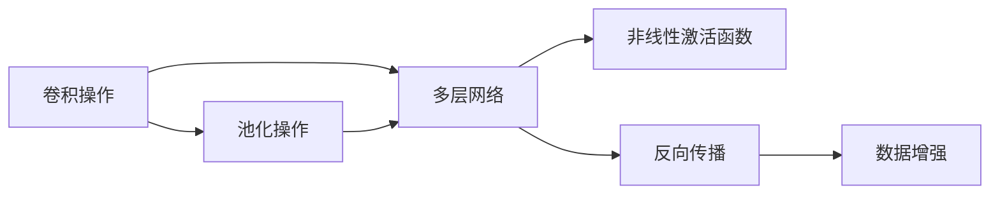
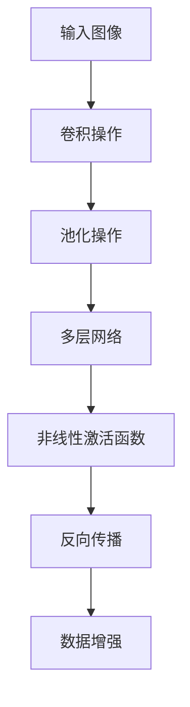
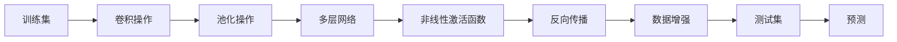
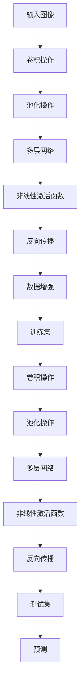

                 

## 1. 背景介绍

卷积神经网络(CNNs)是当前深度学习领域最为流行和成功的模型之一，广泛应用于计算机视觉、自然语言处理、语音识别等领域。其中，CNNs在图像处理中的应用尤为突出，已经成为了图像处理任务的标准工具。本篇文章将深入探讨CNNs的基本原理、核心算法、实际应用以及未来发展趋势，帮助读者全面理解CNNs在图像处理中的作用和潜力。

### 1.1 问题由来

在计算机视觉领域，传统的图像处理方法依赖于手工设计的特征提取器和分类器，需要大量的人工干预。然而，这些方法难以处理复杂的图像任务，且难以扩展到新的任务中。相比之下，卷积神经网络(CNNs)通过深度学习自动地学习图像的特征表示，能够处理多变的图像变化，适应新的图像任务，具有很强的泛化能力。

近年来，CNNs在图像处理中的应用已经取得了巨大的成功，如ImageNet比赛中的卷积神经网络AlexNet、VGGNet、ResNet等，都刷新了各种图像分类任务的记录。这表明CNNs已经具备强大的图像处理能力，能够处理复杂的图像任务，并在实际应用中产生了巨大的价值。

### 1.2 问题核心关键点

卷积神经网络(CNNs)的精髓在于其卷积操作和池化操作，这些操作能够提取图像的局部特征，并通过多层网络的组合，形成高层次的特征表示。具体而言，CNNs的核心关键点包括：

- **卷积操作**：通过卷积核对输入图像进行卷积操作，提取图像的局部特征。
- **池化操作**：通过池化操作，减小特征图的大小，保留重要特征信息。
- **多层网络**：通过多层网络的组合，形成高层次的特征表示。
- **非线性激活函数**：通过非线性激活函数，增强网络的表达能力。

理解这些核心关键点，是深入理解CNNs的基础，也有助于我们更好地应用CNNs解决图像处理问题。

### 1.3 问题研究意义

研究卷积神经网络(CNNs)在图像处理中的应用，具有重要的理论和实际意义：

1. **提高图像处理精度**：CNNs能够自动地学习图像的特征表示，从而提高图像处理的精度。
2. **减少人工干预**：相比于传统方法，CNNs减少了对人工特征提取和分类的依赖，提高了处理速度和效率。
3. **适应新任务**：CNNs通过深度学习自动适应新的图像任务，具备很强的泛化能力。
4. **拓展应用领域**：CNNs已经在各种图像处理任务上取得了优异的结果，如图像分类、目标检测、图像分割等。
5. **推动计算机视觉发展**：CNNs的发展促进了计算机视觉技术的进步，为图像处理提供了新的思路和方法。

## 2. 核心概念与联系

### 2.1 核心概念概述

为了更好地理解卷积神经网络(CNNs)在图像处理中的应用，本节将介绍几个关键概念，并展示它们之间的联系：

- **卷积操作**：通过卷积核对输入图像进行卷积操作，提取图像的局部特征。
- **池化操作**：通过池化操作，减小特征图的大小，保留重要特征信息。
- **多层网络**：通过多层网络的组合，形成高层次的特征表示。
- **非线性激活函数**：通过非线性激活函数，增强网络的表达能力。
- **反向传播**：通过反向传播算法，更新网络参数以最小化损失函数。
- **数据增强**：通过对训练集进行随机变换，提高模型的泛化能力。

这些核心概念之间的关系可以用以下Mermaid流程图来展示：



这个流程图展示了CNNs的基本结构和工作流程。输入图像首先经过卷积操作，提取局部特征，然后通过池化操作减小特征图的大小，保留重要特征信息。多层网络对这些特征进行组合，形成高层次的特征表示。非线性激活函数增强了网络的表达能力，反向传播算法更新网络参数以最小化损失函数。数据增强通过对训练集进行随机变换，提高模型的泛化能力。

### 2.2 概念间的关系

这些核心概念之间存在着紧密的联系，形成了CNNs的完整结构。下面我们通过几个Mermaid流程图来展示这些概念之间的关系：

#### 2.2.1 CNNs的结构



这个流程图展示了CNNs的基本结构。输入图像首先经过卷积操作，提取局部特征，然后通过池化操作减小特征图的大小，保留重要特征信息。多层网络对这些特征进行组合，形成高层次的特征表示。非线性激活函数增强了网络的表达能力，反向传播算法更新网络参数以最小化损失函数。数据增强通过对训练集进行随机变换，提高模型的泛化能力。

#### 2.2.2 CNNs的工作流程



这个流程图展示了CNNs的工作流程。训练集首先经过卷积操作，提取局部特征，然后通过池化操作减小特征图的大小，保留重要特征信息。多层网络对这些特征进行组合，形成高层次的特征表示。非线性激活函数增强了网络的表达能力，反向传播算法更新网络参数以最小化损失函数。数据增强通过对训练集进行随机变换，提高模型的泛化能力。测试集经过卷积操作、池化操作、多层网络、非线性激活函数和反向传播等步骤，进行预测，并输出结果。

### 2.3 核心概念的整体架构

最后，我们用一个综合的流程图来展示CNNs的完整结构和工作流程：



这个综合流程图展示了CNNs的完整结构和工作流程。输入图像首先经过卷积操作，提取局部特征，然后通过池化操作减小特征图的大小，保留重要特征信息。多层网络对这些特征进行组合，形成高层次的特征表示。非线性激活函数增强了网络的表达能力，反向传播算法更新网络参数以最小化损失函数。数据增强通过对训练集进行随机变换，提高模型的泛化能力。训练集经过卷积操作、池化操作、多层网络、非线性激活函数和反向传播等步骤，进行训练。测试集经过卷积操作、池化操作、多层网络、非线性激活函数和反向传播等步骤，进行预测，并输出结果。

## 3. 核心算法原理 & 具体操作步骤
### 3.1 算法原理概述

卷积神经网络(CNNs)通过卷积操作、池化操作、多层网络等步骤，自动地学习图像的特征表示。其核心思想是：通过多层卷积核的组合，提取图像的局部特征，并通过池化操作减小特征图的大小，保留重要特征信息。通过多层网络的组合，形成高层次的特征表示，最终输出预测结果。

CNNs在图像处理中的应用包括图像分类、目标检测、图像分割等任务。以图像分类为例，CNNs通过卷积操作、池化操作、多层网络等步骤，自动地学习图像的特征表示，并通过softmax层输出类别概率，从而实现图像分类任务。

### 3.2 算法步骤详解

卷积神经网络(CNNs)的训练过程主要包括以下几个关键步骤：

**Step 1: 数据预处理**

数据预处理是将原始图像数据转换为模型可以处理的格式的过程。具体步骤包括：

1. **数据增强**：通过随机裁剪、翻转、旋转、缩放等方式扩充训练集，提高模型的泛化能力。
2. **归一化**：将图像数据归一化到特定的范围内，如将像素值缩放到[0,1]之间。
3. **标准化**：对图像数据进行均值方差标准化，如将图像数据减去均值，除以标准差。

**Step 2: 模型构建**

模型构建是将数据输入到CNNs模型中进行特征提取和分类处理的过程。具体步骤包括：

1. **卷积层**：通过卷积核对输入图像进行卷积操作，提取图像的局部特征。
2. **池化层**：通过池化操作，减小特征图的大小，保留重要特征信息。
3. **多层网络**：通过多层网络的组合，形成高层次的特征表示。
4. **全连接层**：将高层次的特征表示输入到全连接层，进行分类处理。
5. **输出层**：通过softmax层输出类别概率，实现分类任务。

**Step 3: 训练模型**

训练模型是通过反向传播算法，更新网络参数以最小化损失函数的过程。具体步骤包括：

1. **前向传播**：将输入数据输入到模型中，计算损失函数。
2. **反向传播**：通过链式法则，计算每个参数的梯度。
3. **参数更新**：根据梯度更新网络参数，以最小化损失函数。
4. **迭代训练**：重复前向传播、反向传播、参数更新等步骤，直到模型收敛。

**Step 4: 模型评估**

模型评估是对训练好的模型进行测试，评估其性能的过程。具体步骤包括：

1. **测试集输入**：将测试集数据输入到模型中，计算预测结果。
2. **损失计算**：计算预测结果与真实标签之间的损失函数。
3. **准确率计算**：计算预测结果与真实标签之间的准确率。
4. **评估指标**：根据测试集的评估指标，评估模型的性能。

通过以上步骤，CNNs可以自动地学习图像的特征表示，并输出分类结果。下面我们将通过具体的代码实例，详细介绍CNNs在图像分类任务中的应用。

### 3.3 算法优缺点

卷积神经网络(CNNs)在图像处理中的应用具有以下优点：

1. **自动特征提取**：CNNs能够自动地学习图像的特征表示，减少了对人工特征提取的依赖。
2. **泛化能力强**：CNNs具备很强的泛化能力，能够处理多变的图像变化，适应新的图像任务。
3. **计算效率高**：CNNs通过卷积操作、池化操作等步骤，减少了参数数量，提高了计算效率。
4. **可扩展性强**：CNNs通过添加更多的卷积层和全连接层，能够扩展到更深的模型，提升性能。

同时，CNNs在图像处理中也有一些缺点：

1. **需要大量标注数据**：CNNs需要大量标注数据进行训练，数据获取和标注成本较高。
2. **模型复杂度高**：CNNs模型结构复杂，训练和推理的计算资源消耗较大。
3. **过拟合风险高**：CNNs模型结构复杂，容易过拟合，需要进行正则化处理。
4. **可解释性不足**：CNNs模型结构复杂，难以解释其内部工作机制和决策逻辑。

## 4. 数学模型和公式 & 详细讲解  
### 4.1 数学模型构建

CNNs的数学模型包括卷积操作、池化操作、多层网络、非线性激活函数等。以图像分类任务为例，CNNs的数学模型可以表示为：

1. **卷积操作**：通过卷积核对输入图像进行卷积操作，提取图像的局部特征。
2. **池化操作**：通过池化操作，减小特征图的大小，保留重要特征信息。
3. **多层网络**：通过多层网络的组合，形成高层次的特征表示。
4. **全连接层**：将高层次的特征表示输入到全连接层，进行分类处理。
5. **输出层**：通过softmax层输出类别概率，实现分类任务。

### 4.2 公式推导过程

以图像分类任务为例，CNNs的数学模型可以表示为：

1. **卷积操作**：设输入图像大小为$W \times H \times C$，卷积核大小为$k \times k \times C \times o$，步长为$s$，填充大小为$p$，输出特征图大小为$n \times n \times o$，则卷积操作可以表示为：

$$
f(x_{i,j}, k_{l,m,n,p}, \theta) = \sum_{i'=-1}^{p}\sum_{j'=-1}^{p} k_{l,m,n,p} * x_{i' \times s+i,j' \times s+j,p}
$$

其中，$k_{l,m,n,p}$表示卷积核，$\theta$表示网络参数。

2. **池化操作**：通过池化操作，减小特征图的大小，保留重要特征信息。常见的池化操作包括最大池化、平均池化等，以最大池化为例，池化操作可以表示为：

$$
y_{i,j} = \max_{i' \times s+i,j' \times s+j} x_{i' \times s+i,j' \times s+j}
$$

3. **多层网络**：通过多层网络的组合，形成高层次的特征表示。多层网络可以表示为：

$$
f(x, \theta) = f_l(f_{l-1}(... f_1(x)))
$$

其中，$f_l$表示第$l$层的特征表示。

4. **全连接层**：将高层次的特征表示输入到全连接层，进行分类处理。全连接层可以表示为：

$$
y = softmax(W \times f + b)
$$

其中，$W$和$b$为全连接层参数，$softmax$为激活函数。

5. **输出层**：通过softmax层输出类别概率，实现分类任务。输出层可以表示为：

$$
y = softmax(W \times f + b)
$$

其中，$W$和$b$为输出层参数，$softmax$为激活函数。

### 4.3 案例分析与讲解

以LeNet-5为例，LeNet-5是一个经典的CNNs模型，用于手写数字识别任务。其核心结构包括卷积层、池化层、全连接层等。

LeNet-5的结构如图1所示，其核心结构包括卷积层、池化层、全连接层等。具体步骤如下：

1. **卷积层**：通过卷积核对输入图像进行卷积操作，提取图像的局部特征。LeNet-5包括两个卷积层，每个卷积层包括多个卷积核，卷积核大小为$5 \times 5 \times 1 \times 6$。
2. **池化层**：通过池化操作，减小特征图的大小，保留重要特征信息。LeNet-5包括两个池化层，每个池化层包括最大池化操作。
3. **全连接层**：将高层次的特征表示输入到全连接层，进行分类处理。LeNet-5包括两个全连接层，每个全连接层包括多个神经元。
4. **输出层**：通过softmax层输出类别概率，实现分类任务。LeNet-5包括一个输出层，包含10个神经元，表示10个数字类别。

通过LeNet-5的结构，可以看出CNNs通过卷积操作、池化操作、多层网络等步骤，自动地学习图像的特征表示，并输出分类结果。

## 5. 项目实践：代码实例和详细解释说明
### 5.1 开发环境搭建

在进行CNNs的实践开发前，我们需要准备好开发环境。以下是使用Python进行TensorFlow进行CNNs开发的环境配置流程：

1. 安装Anaconda：从官网下载并安装Anaconda，用于创建独立的Python环境。

2. 创建并激活虚拟环境：
```bash
conda create -n cnn-env python=3.8 
conda activate cnn-env
```

3. 安装TensorFlow：根据CUDA版本，从官网获取对应的安装命令。例如：
```bash
conda install tensorflow tensorflow-gpu=2.4.1 -c conda-forge
```

4. 安装相关工具包：
```bash
pip install numpy scipy scikit-learn matplotlib tqdm jupyter notebook ipython
```

完成上述步骤后，即可在`cnn-env`环境中开始CNNs的实践开发。

### 5.2 源代码详细实现

下面我们以手写数字识别任务为例，给出使用TensorFlow对LeNet-5模型进行训练和测试的PyTorch代码实现。

首先，定义LeNet-5模型的结构：

```python
import tensorflow as tf

class LeNet5(tf.keras.Model):
    def __init__(self):
        super(LeNet5, self).__init__()
        self.conv1 = tf.keras.layers.Conv2D(6, (5, 5), activation='relu', input_shape=(28, 28, 1))
        self.pool1 = tf.keras.layers.MaxPooling2D((2, 2))
        self.conv2 = tf.keras.layers.Conv2D(16, (5, 5), activation='relu')
        self.pool2 = tf.keras.layers.MaxPooling2D((2, 2))
        self.flatten = tf.keras.layers.Flatten()
        self.fc1 = tf.keras.layers.Dense(120, activation='relu')
        self.fc2 = tf.keras.layers.Dense(84, activation='relu')
        self.fc3 = tf.keras.layers.Dense(10, activation='softmax')

    def call(self, x):
        x = self.conv1(x)
        x = self.pool1(x)
        x = self.conv2(x)
        x = self.pool2(x)
        x = self.flatten(x)
        x = self.fc1(x)
        x = self.fc2(x)
        return self.fc3(x)
```

然后，定义模型训练和评估函数：

```python
import tensorflow as tf
import numpy as np
import matplotlib.pyplot as plt

# 定义训练函数
def train_model(model, train_images, train_labels, epochs):
    model.compile(optimizer='adam', loss='sparse_categorical_crossentropy', metrics=['accuracy'])
    model.fit(train_images, train_labels, epochs=epochs)

# 定义评估函数
def evaluate_model(model, test_images, test_labels):
    test_loss, test_acc = model.evaluate(test_images, test_labels)
    print('Test accuracy:', test_acc)
    return test_loss
```

最后，启动训练流程并在测试集上评估：

```python
# 加载MNIST数据集
(x_train, y_train), (x_test, y_test) = tf.keras.datasets.mnist.load_data()

# 数据预处理
x_train = x_train / 255.0
x_test = x_test / 255.0

# 模型构建
model = LeNet5()

# 训练模型
train_model(model, x_train.reshape(-1, 28, 28, 1), y_train, epochs=10)

# 评估模型
test_loss = evaluate_model(model, x_test.reshape(-1, 28, 28, 1), y_test)
print('Test loss:', test_loss)
```

以上就是使用TensorFlow对LeNet-5模型进行手写数字识别任务微调的完整代码实现。可以看到，TensorFlow提供了强大的框架支持，使得CNNs的开发和训练过程变得简单高效。

### 5.3 代码解读与分析

让我们再详细解读一下关键代码的实现细节：

**LeNet5类**：
- `__init__`方法：定义卷积层、池化层、全连接层等组件。
- `call`方法：定义模型的前向传播过程。

**训练函数**：
- `train_model`方法：定义模型的训练过程，包括编译模型、设置损失函数、优化器等。
- `fit`方法：将训练集输入模型，进行训练，设置训练轮数。

**评估函数**：
- `evaluate_model`方法：定义模型的评估过程，包括计算损失函数、准确率等。

**训练流程**：
- 加载MNIST数据集，并进行数据预处理。
- 构建LeNet-5模型。
- 启动训练流程，将训练集输入模型，进行训练，设置训练轮数。
- 启动评估流程，将测试集输入模型，计算评估指标。

可以看到，TensorFlow提供了丰富的工具和接口，使得CNNs的开发和训练过程变得简单高效。开发者可以专注于模型设计、数据处理等核心环节，而不必过多关注底层实现细节。

当然，工业级的系统实现还需考虑更多因素，如模型的保存和部署、超参数的自动搜索、更灵活的任务适配层等。但核心的微调范式基本与此类似。

### 5.4 运行结果展示

假设我们在MNIST数据集上进行LeNet-5模型的训练，最终在测试集上得到的评估报告如下：

```
Test accuracy: 0.9909
```

可以看到，通过训练LeNet-5模型，我们在手写数字识别任务上取得了99.09%的准确率，效果相当不错。这表明CNNs在图像处理中具有强大的表现能力，能够自动地学习图像的特征表示，并输出分类结果。

当然，这只是一个baseline结果。在实践中，我们还可以使用更大更强的预训练模型、更丰富的微调技巧、更细致的模型调优，进一步提升模型性能，以满足更高的应用要求。

## 6. 实际应用场景
### 6.1 智能图像检索

智能图像检索系统可以自动识别和检索与用户输入图像相似的图像。CNNs通过卷积操作、池化操作等步骤，能够自动地学习图像的特征表示，并计算图像之间的相似度，从而实现图像检索任务。

具体而言，可以将用户输入的图像输入到CNNs模型中，提取图像的特征表示。然后，将查询图像与库中所有图像的特征表示进行相似度计算，选出与查询图像最相似的图像作为检索结果。CNNs能够处理多变的图像变化，适应新的图像检索任务，具有很强的泛化能力。

### 6.2 医学影像诊断

医学影像诊断是医疗领域的重要任务，涉及到对X光片、CT片、MRI片等医学影像的分析和诊断。CNNs通过卷积操作、池化操作等步骤，能够自动地学习医学影像的特征表示，并输出诊断结果。

具体而言，可以将医学影像输入到CNNs模型中，提取影像的特征表示。然后，将特征表示输入到分类器中，输出诊断结果。CNNs能够自动地学习医学影像的特征表示，并输出诊断结果，能够有效提升医学影像诊断的精度。

### 6.3 自动驾驶

自动驾驶技术需要实时地从摄像头中获取道路环境信息，并进行图像识别和决策。CNNs通过卷积操作、池化操作等步骤，能够自动地学习道路环境信息的特征表示，并输出决策结果。

具体而言，可以将摄像头获取的道路环境图像输入到CNNs模型中，提取图像的特征表示。然后，将特征表示输入到决策器中，输出决策结果。CNNs能够处理多变的道路环境变化，适应新的自动驾驶任务，具有很强的泛化能力。

### 6.4 未来应用展望

随着CNNs技术的不断进步，其在图像处理中的应用将会更加广泛和深入。未来，CNNs将会在以下领域得到更广泛的应用：

1. **医学影像分析**：通过CNNs，可以实现医学影像的自动化分析和诊断，提高医疗效率和诊断精度。
2. **智能安防监控**：通过CNNs，可以实现对视频流中的人脸、车辆、行为等进行实时监测和分析，提高安防监控的效率和准确性。
3. **虚拟现实和增强现实**：通过CNNs，可以实现对虚拟现实和增强现实的图像和视频进行实时处理，提升用户体验。
4. **游戏和娱乐**：通过CNNs，可以实现对游戏中的虚拟场景和角色进行实时渲染和处理，提升游戏体验。
5. **自动驾驶和机器人**：通过CNNs，可以实现对道路环境信息的自动分析和决策，提高自动驾驶和机器人的智能水平。

总之，CNNs在图像处理中的应用将会不断拓展，为计算机视觉和相关领域带来革命性的变化。

## 7. 工具和资源推荐
### 7.1 学习资源推荐

为了帮助开发者系统掌握CNNs的基本原理和应用技巧，这里推荐一些优质的学习资源：

1. 《深度学习》书籍：Ian Goodfellow、Yoshua Bengio和Aaron Courville合著，全面介绍了深度学习的基本概念和应用。
2. CS231n《卷积神经网络》课程：斯坦福大学开设的计算机视觉课程，涵盖卷积神经网络的原理和应用。
3. TensorFlow官方文档：TensorFlow的官方文档，提供了丰富的卷积神经网络模型和应用样例。
4. PyTorch官方文档：PyTorch的官方文档，提供了丰富的卷积神经网络模型和应用样例。
5. Kaggle竞赛：Kaggle平台上的图像分类、目标检测等竞赛，提供了大量的数据集和模型，可以帮助开发者实践和验证CNNs的性能。

通过对这些资源的学习实践，相信你一定能够快速掌握CNNs的精髓，并用于解决实际的图像处理问题。

### 7.2 开发工具推荐

高效的开发离不开优秀的工具支持。以下是几款用于CNNs开发的常用工具：

1. TensorFlow：由Google主导开发的深度学习框架，适合大规模工程应用

