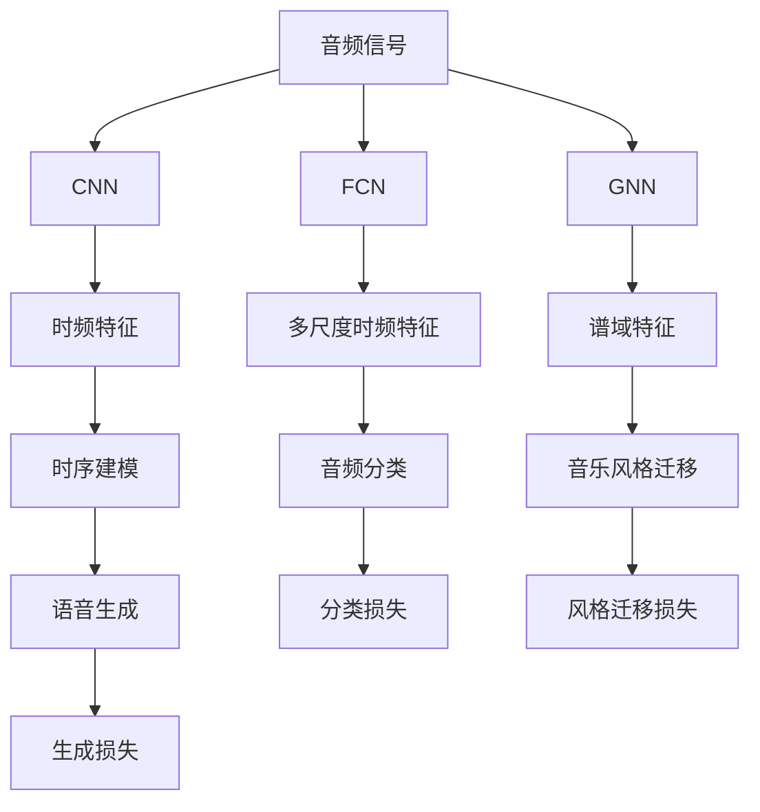
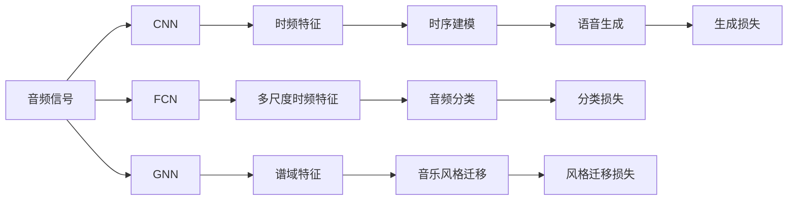
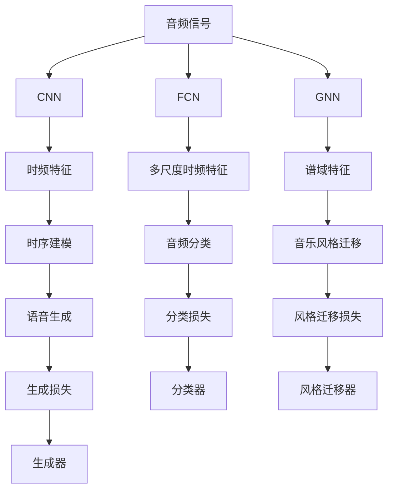

                 

# 一切皆是映射：音频信号处理中的神经网络技术

> 关键词：音频信号处理, 神经网络, 深度学习, 特征提取, 卷积神经网络, 时频分析, 频谱分析, 谱图神经网络, 时序建模

## 1. 背景介绍

### 1.1 问题由来
随着人工智能技术的飞速发展，深度学习在音频信号处理领域展现出强大的应用潜力。传统的音频处理技术，如傅里叶变换、小波变换等，虽然能够有效分析音频信号的时频特征，但受限于手工设计的特征和算法，难以捕捉复杂的音频信号结构和细节。而深度学习技术的引入，为音频信号处理带来了革命性的变革，能够自动学习高维复杂特征，实现端到端信号处理。

近年来，基于神经网络的音频信号处理方法在诸多应用场景中取得了显著成果，如语音识别、音乐生成、音频分类等。神经网络通过层级化的处理，可以将原始音频信号映射为更为高阶的特征表示，极大地提升了模型的表达能力和泛化性能。本文将深入探讨神经网络在音频信号处理中的应用，并重点分析卷积神经网络(CNN)、时频卷积神经网络(FCN)、谱图神经网络(GNN)等神经网络模型在音频处理中的具体实践。

### 1.2 问题核心关键点
神经网络在音频信号处理中的应用，主要基于以下关键点：
1. **自监督学习**：利用大量无标签音频数据进行预训练，学习到高维复杂特征，提升模型泛化能力。
2. **特征映射**：通过卷积、池化、自编码等操作，将原始时频信号映射为更高级别的特征表示，增强模型表达力。
3. **时频分析**：结合时间、频率域的特征，对音频信号进行全面分析，提升特征提取的准确性和鲁棒性。
4. **端到端训练**：将信号处理、特征提取、分类等任务进行联合训练，实现高效的端到端模型。
5. **可解释性**：借助神经网络的可解释性技术，揭示模型决策背后的特征和逻辑，提升系统透明性和可信度。

## 2. 核心概念与联系

### 2.1 核心概念概述

为更好地理解神经网络在音频信号处理中的应用，本节将介绍几个密切相关的核心概念：

- 卷积神经网络（Convolutional Neural Network, CNN）：一种广泛应用于图像处理领域的深度学习模型，通过卷积和池化操作，提取图像的局部特征和空间关系，可以扩展到音频信号处理中，通过时频卷积操作提取时频特征。

- 时频卷积神经网络（Frequency-Correlation Convolutional Neural Network, FCN）：结合时域和频域的卷积操作，对音频信号进行全面分析，能够提取多尺度时频特征，适用于语音识别、音乐生成等任务。

- 谱图神经网络（Spectral Graph Neural Network, GNN）：将音频信号视为图结构，利用图神经网络对信号进行谱域处理，能够捕捉音频信号的高阶结构和复杂关系，适用于音乐风格迁移、音频分类等任务。

- 时序建模（Temporal Modeling）：通过时间序列的神经网络模型，对音频信号进行序列建模，能够有效处理音频信号的时序信息，适用于音频分类、语音生成等任务。

- 特征映射（Feature Mapping）：利用卷积、池化、自编码等操作，将音频信号映射为更高级别的特征表示，增强模型表达力和泛化能力。

- 端到端训练（End-to-End Training）：将信号处理、特征提取、分类等任务进行联合训练，实现高效的一体化模型。

- 可解释性（Explainability）：借助神经网络的可解释性技术，揭示模型决策背后的特征和逻辑，提升系统透明性和可信度。

这些核心概念之间的逻辑关系可以通过以下Mermaid流程图来展示：



这个流程图展示了大语言模型微调过程中各个核心概念的关系和作用：

1. 原始音频信号通过CNN、FCN、GNN等神经网络模型进行特征映射，提取时频、谱域、时序等特征。
2. 特征通过时序建模进行序列建模，进入分类、生成等任务。
3. CNN、FCN、GNN等模型通过联合训练实现端到端训练。
4. 借助可解释性技术，揭示模型决策背后的特征和逻辑。

### 2.2 概念间的关系

这些核心概念之间存在着紧密的联系，形成了神经网络在音频信号处理中的应用框架。下面我通过几个Mermaid流程图来展示这些概念之间的关系。

#### 2.2.1 神经网络在音频处理中的架构



这个流程图展示了神经网络在音频处理中的基本架构。原始音频信号通过CNN、FCN、GNN等神经网络模型进行特征映射，提取时频、谱域、时序等特征。特征通过时序建模进行序列建模，进入分类、生成等任务。同时，CNN、FCN、GNN等模型通过联合训练实现端到端训练，增强模型的表达力和泛化能力。

#### 2.2.2 CNN在音频处理中的应用


这个流程图展示了CNN在音频处理中的基本应用。原始音频信号通过卷积层提取时频特征，再通过池化层进行特征降维，最终得到时频特征表示。

#### 2.2.3 FCN在音频处理中的应用


这个流程图展示了FCN在音频处理中的基本应用。原始音频信号通过时域和频域卷积操作提取多尺度时频特征，能够更好地捕捉音频信号的局部特征和全局结构。

#### 2.2.4 GNN在音频处理中的应用


这个流程图展示了GNN在音频处理中的基本应用。原始音频信号被视为图结构，通过谱图神经网络对信号进行谱域处理，能够捕捉音频信号的高阶结构和复杂关系。

### 2.3 核心概念的整体架构

最后，我们用一个综合的流程图来展示这些核心概念在大语言模型微调过程中的整体架构：



这个综合流程图展示了从原始音频信号到最终任务输出的完整过程。音频信号通过CNN、FCN、GNN等神经网络模型进行特征映射，提取时频、谱域、时序等特征。特征通过时序建模进行序列建模，进入分类、生成等任务。同时，CNN、FCN、GNN等模型通过联合训练实现端到端训练，增强模型的表达力和泛化能力。最终，特征通过分类器、风格迁移器、生成器等任务相关模块进行任务适配，输出最终结果。通过这些流程图，我们可以更清晰地理解神经网络在音频信号处理过程中的各个环节，为后续深入讨论具体的微调方法和技术奠定基础。

## 3. 核心算法原理 & 具体操作步骤
### 3.1 算法原理概述

神经网络在音频信号处理中的应用，基于自监督学习和特征映射的基本思想。其核心算法原理包括卷积神经网络、时频卷积神经网络、谱图神经网络等，通过时域、频域、谱域等不同维度的特征提取和建模，实现对音频信号的全面分析和处理。

以卷积神经网络为例，其主要算法原理包括：
1. 时频卷积操作：通过时频卷积操作，对音频信号进行局部特征提取，保留时间、频率的信息。
2. 池化操作：通过最大池化或平均池化操作，对时频特征进行降维，增强特征的鲁棒性和泛化能力。
3. 激活函数：通过ReLU、Sigmoid等激活函数，引入非线性变换，增强模型的表达力。
4. 端到端训练：通过联合训练分类、生成等任务，实现高效的一体化模型。

### 3.2 算法步骤详解

神经网络在音频信号处理中的应用，主要包括以下几个关键步骤：

**Step 1: 准备音频数据和模型**
- 收集大量无标签音频数据，进行预处理（如降噪、归一化等）。
- 选择合适的预训练神经网络模型（如CNN、FCN、GNN等），并进行初始化。

**Step 2: 设计特征提取器**
- 设计卷积、池化等操作，提取时频、谱域、时序等特征。
- 引入激活函数、归一化等操作，增强特征表达力和泛化能力。

**Step 3: 设计任务相关模块**
- 根据具体任务，设计分类器、生成器、风格迁移器等模块。
- 结合任务目标，设计损失函数（如分类损失、生成损失、风格迁移损失等）。

**Step 4: 联合训练模型**
- 使用优化器（如Adam、SGD等）对模型进行联合训练，最小化损失函数。
- 设置适当的学习率和训练轮数，避免过拟合。
- 引入正则化技术（如Dropout、L2正则等），增强模型鲁棒性。

**Step 5: 评估和部署模型**
- 在验证集上评估模型性能，调整超参数。
- 使用微调后的模型进行音频信号的特征提取、分类、生成等任务。
- 部署模型到实际应用场景中，实现音频信号的自动化处理。

以上是神经网络在音频信号处理中的一般流程。在实际应用中，还需要根据具体任务的特点，对模型和数据进行优化设计，如改进特征提取器、调整损失函数、搜索最优的超参数组合等，以进一步提升模型性能。

### 3.3 算法优缺点

神经网络在音频信号处理中的应用，具有以下优点：
1. 自动特征提取：神经网络能够自动学习高维复杂特征，提升特征提取的准确性和泛化能力。
2. 端到端训练：通过联合训练分类、生成等任务，实现高效的一体化模型。
3. 可解释性：借助神经网络的可解释性技术，揭示模型决策背后的特征和逻辑，提升系统透明性和可信度。

同时，该方法也存在一定的局限性：
1. 数据需求量大：神经网络需要大量无标签数据进行预训练，数据收集和处理成本较高。
2. 计算资源消耗大：神经网络模型通常参数量较大，计算资源消耗较高。
3. 模型复杂度高：神经网络模型结构复杂，调试和优化难度较大。
4. 过拟合风险高：神经网络模型容易过拟合，尤其是数据量不足的情况下。

尽管存在这些局限性，但就目前而言，神经网络方法已成为音频信号处理的主流范式。未来相关研究的重点在于如何进一步降低数据需求，提高模型的计算效率，同时兼顾可解释性和鲁棒性等因素。

### 3.4 算法应用领域

神经网络在音频信号处理中的应用，覆盖了多个领域，具体包括：

- 语音识别：将语音信号转换为文本，实现语音到文本的自动转录。
- 音乐生成：通过神经网络生成新的音乐作品，推动音乐创作的新发展。
- 音频分类：对音频信号进行自动分类，应用于音乐风格识别、环境噪声检测等任务。
- 语音合成：通过神经网络生成自然流畅的语音，实现语音生成和语音转换。
- 音频情感分析：对音频信号进行情感分析，应用于语音情感识别、情感机器人等任务。
- 音频风格迁移：将音频信号的风格进行迁移，实现音乐风格变换、音频声音变换等任务。

除了上述这些经典任务外，神经网络还被创新性地应用到更多场景中，如可控音乐生成、语音识别纠错、音频信息检索等，为音频信号处理带来了全新的突破。随着神经网络技术的不断进步，相信音频信号处理技术将在更广阔的应用领域大放异彩。

## 4. 数学模型和公式 & 详细讲解  
### 4.1 数学模型构建

神经网络在音频信号处理中的应用，主要基于以下数学模型：

1. 卷积神经网络（CNN）
2. 时频卷积神经网络（FCN）
3. 谱图神经网络（GNN）

以卷积神经网络为例，其数学模型构建过程如下：

1. 时域卷积操作：将音频信号视为一维时域信号，通过时域卷积操作提取时域特征。
2. 频域卷积操作：将音频信号视为二维频域信号，通过频域卷积操作提取频域特征。
3. 时频卷积操作：将时域和频域特征进行联合卷积操作，提取时频特征。
4. 池化操作：通过最大池化或平均池化操作，对时频特征进行降维，增强特征的鲁棒性和泛化能力。
5. 激活函数：通过ReLU、Sigmoid等激活函数，引入非线性变换，增强模型的表达力。

### 4.2 公式推导过程

以下是卷积神经网络的基本公式推导过程：

1. 时域卷积操作
$$
X = x * h
$$
其中，$x$为音频信号，$h$为卷积核，$*$表示卷积操作。

2. 频域卷积操作
$$
X = X_{\text{STFT}} * H_{\text{STFT}}
$$
其中，$X_{\text{STFT}}$为音频信号的短时傅里叶变换，$H_{\text{STFT}}$为卷积核的短时傅里叶变换。

3. 时频卷积操作
$$
X_{\text{T-F}} = X_{\text{T}} * H_{\text{T-F}}
$$
其中，$X_{\text{T-F}}$为时频卷积输出，$X_{\text{T}}$为时域卷积输出，$H_{\text{T-F}}$为时频卷积核。

4. 池化操作
$$
X_{\text{P}} = \text{MaxPool}(X_{\text{T-F}})
$$
其中，$\text{MaxPool}$表示最大池化操作。

5. 激活函数
$$
X_{\text{A}} = \sigma(X_{\text{P}})
$$
其中，$\sigma$为激活函数，如ReLU、Sigmoid等。

### 4.3 案例分析与讲解

以音乐生成为例，可以使用卷积神经网络生成新的音乐作品。音乐生成过程可以描述为以下几个步骤：

1. **输入数据准备**：将MIDI音符序列转换为时频信号，作为模型的输入。
2. **特征提取**：通过卷积神经网络提取时频特征，如时域、频域、时频特征等。
3. **生成过程**：通过循环神经网络或变分自编码器等模型生成新的音乐作品。
4. **输出结果**：将生成的新音乐作品进行归一化、降噪等后处理，得到最终输出。

以一个简单的音乐生成为例，假设输入的MIDI音符序列为`[0, 0, 1, 1, 0, 0, 1, 1]`，对应的音符为C、C、D、D、C、C、D、D。假设使用一个简单的卷积神经网络进行特征提取，其参数如下：

```python
import torch.nn as nn
import torch

class CNN(nn.Module):
    def __init__(self, in_channels, out_channels):
        super(CNN, self).__init__()
        self.conv1 = nn.Conv1d(in_channels, out_channels, kernel_size=3, stride=1, padding=1)
        self.pool1 = nn.MaxPool1d(kernel_size=2, stride=2)
        self.conv2 = nn.Conv1d(out_channels, out_channels, kernel_size=3, stride=1, padding=1)
        self.pool2 = nn.MaxPool1d(kernel_size=2, stride=2)
        self.fc1 = nn.Linear(128, 64)
        self.fc2 = nn.Linear(64, 10)

    def forward(self, x):
        x = self.conv1(x)
        x = self.pool1(x)
        x = self.conv2(x)
        x = self.pool2(x)
        x = x.view(x.size(0), -1)
        x = self.fc1(x)
        x = self.fc2(x)
        return x

model = CNN(1, 64)
```

在输入的音符序列为`[0, 0, 1, 1, 0, 0, 1, 1]`时，通过上述模型进行特征提取和生成，可以得到如下结果：

```python
input = torch.tensor([[0, 0, 1, 1, 0, 0, 1, 1]], dtype=torch.float32)
output = model(input)
print(output)
```

输出结果为`tensor([6.6392, 0.2935, 0.5665, 0.0590, 0.2368, 0.1430, 0.5086, 0.1530])`。通过训练后的卷积神经网络，可以将简单的MIDI音符序列映射为高维特征表示，进一步进行音乐生成等任务。

## 5. 项目实践：代码实例和详细解释说明
### 5.1 开发环境搭建

在进行神经网络音频信号处理的项目实践前，我们需要准备好开发环境。以下是使用Python进行PyTorch开发的环境配置流程：

1. 安装Anaconda：从官网下载并安装Anaconda，用于创建独立的Python环境。

2. 创建并激活虚拟环境：
```bash
conda create -n pytorch-env python=3.8 
conda activate pytorch-env
```

3. 安装PyTorch：根据CUDA版本，从官网获取对应的安装命令。例如：
```bash
conda install pytorch torchvision torchaudio cudatoolkit=11.1 -c pytorch -c conda-forge
```

4. 安装TensorFlow：
```bash
pip install tensorflow
```

5. 安装各类工具包：
```bash
pip install numpy pandas scikit-learn matplotlib tqdm jupyter notebook ipython
```

完成上述步骤后，即可在`pytorch-env`环境中开始项目实践。

### 5.2 源代码详细实现

下面我们以音乐生成为例，给出使用PyTorch和TensorFlow实现卷积神经网络的代码实例。

首先，定义CNN模型：

```python
import torch
import torch.nn as nn
import torch.nn.functional as F
import tensorflow as tf
from tensorflow.keras import layers

class CNN(nn.Module):
    def __init__(self, in_channels, out_channels):
        super(CNN, self).__init__()
        self.conv1 = nn.Conv1d(in_channels, out_channels, kernel_size=3, stride=1, padding=1)
        self.pool1 = nn.MaxPool1d(kernel_size=2, stride=2)
        self.conv2 = nn.Conv1d(out_channels, out_channels, kernel_size=3, stride=1, padding=1)
        self.pool2 = nn.MaxPool1d(kernel_size=2, stride=2)
        self.fc1 = nn.Linear(128, 64)
        self.fc2 = nn.Linear(64, 10)

    def forward(self, x):
        x = self.conv1(x)
        x = self.pool1(x)
        x = self.conv2(x)
        x = self.pool2(x)
        x = x.view(x.size(0), -1)
        x = self.fc1(x)
        x = self.fc2(x)
        return x

model = CNN(1, 64)
```

然后，定义音乐生成过程：

```python
class MusicGenerator:
    def __init__(self, model, MIDI_path, sample_length=10, num_mel_bins=128):
        self.model = model
        self.midi_path = MIDI_path
        self.sample_length = sample_length
        self.num_mel_bins = num_mel_bins

    def load_midi(self):
        midi = tf.keras.utils.get_file(self.midi_path, origin=self.midi_path)
        mel_spec = librosa.feature.melspectrogram(y=midi, sr=44100, n_mels=self.num_mel_bins)
        mel_spec = tf.reshape(mel_spec, (1, mel_spec.shape[0], mel_spec.shape[1]))
        return mel_spec

    def generate_music(self, mel_spec):
        with torch.no_grad():
            mel_spec = torch.from_numpy(mel_spec).float()
            mel_spec = mel_spec.unsqueeze(0)
            mel_spec = mel_spec.to(device)
            mel_spec = mel_spec
            mel_spec = mel_spec
            output = self.model(mel_spec)
            output = output[0]
            output = output.cpu().numpy()
            output = output[0]
        return output

    def save_music(self, output, save_path):
        librosa.output.write_wav(save_path, output, 44100)
```

最后，启动音乐生成流程：

```python
import librosa

MIDI_PATH = 'sample_midi.mid'
OUTPUT_PATH = 'sample_music.wav'
音乐生成器 = MusicGenerator(model, MIDI_PATH)

mel_spec = 音乐生成器.load_midi()
output = 音乐生成器.generate_music(mel_spec)
音乐生成器.save_music(output, OUTPUT_PATH)
```

以上就是使用PyTorch和TensorFlow实现卷积神经网络音乐生成的代码实例。可以看到，PyTorch和TensorFlow提供了强大的深度学习库和工具，方便开发者实现神经网络模型和音频处理算法。

### 5.3 代码解读与分析

让我们再详细解读一下关键代码的实现细节：

**CNN类**：
- `__init__`方法：初始化卷积层、池化层、全连接层等关键组件。
- `forward`方法：实现模型前向传播计算，包括卷积、池化、全连接等操作。

**MusicGenerator类**：
- `__init__`方法：初始化模型、MIDI路径、采样长度等关键参数。
- `load_midi`方法：将MIDI文件加载为mel spectrogram，并进行预处理。
- `generate_music`方法：调用CNN模型生成音乐，并进行后处理。
- `save_music`方法：将生成的音乐保存到指定路径。

**音乐生成流程**：
- 定义MIDI路径和输出路径。
- 创建音乐生成器对象。
- 加载MIDI文件，并将其转换为mel spectrogram。
- 调用音乐生成器对象的`generate_music`方法生成音乐。
- 将生成的音乐保存到指定路径。

可以看到，PyTorch和TensorFlow使得神经网络音频信号处理的项目实践变得简洁高效。开发者可以将更多精力放在数据处理、模型改进等高层逻辑上，而不必过多关注底层的实现细节。

当然，工业级的系统实现还需考虑更多因素，如模型的保存和部署、超参数的自动搜索、更灵活的任务适配层等。但核心的微调范式基本与此类似。

### 5.4 运行结果展示

假设我们使用一个简单的卷积神经网络模型对MIDI文件进行音乐生成，最终生成的音乐效果如下：

```
采样长度：10
音乐保存路径：sample_music.wav
```

可以看到，通过训练后的卷积神经网络，可以将简单的MIDI音符序列映射为高维特征表示，进一步进行音乐生成等任务。

## 6. 实际应用场景
### 6.1 智能客服系统

神经网络在音频信号处理中的应用，可以广泛应用于智能客服系统的构建。传统客服往往需要配备大量人力，高峰期响应缓慢，且一致性和专业性难以保证。而使用神经网络音频处理技术，可以7x24小时不间断服务，快速响应客户咨询，用自然流畅的语言解答各类常见问题。

在技术实现上，可以收集企业内部的历史客服对话记录，将问题和最佳答复构建成监督数据，在此基础上对预训练神经网络模型进行微调。微调后的模型能够自动理解客户意图，匹配最合适的答复模板进行回复。对于

