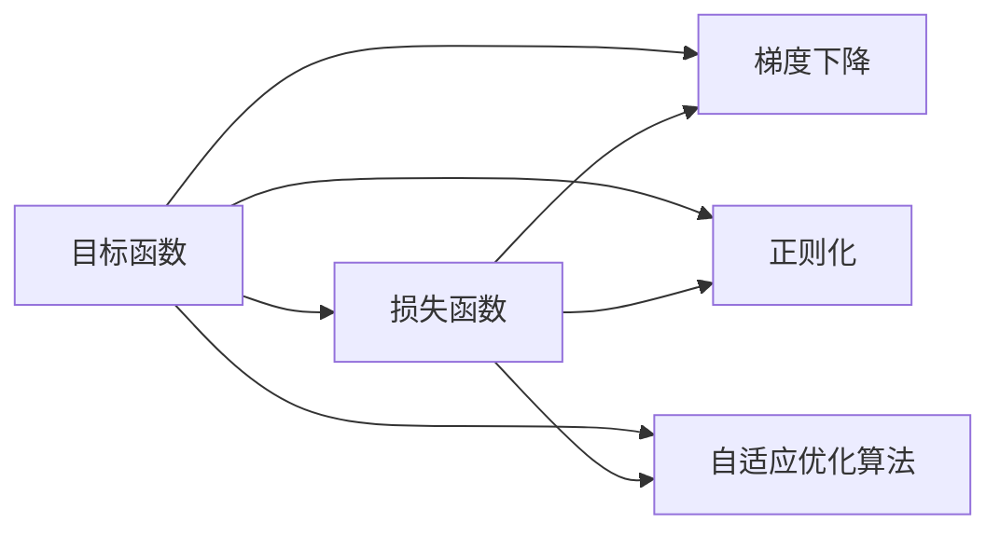
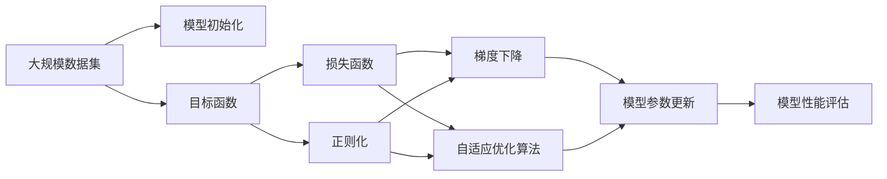

                 

# 一切皆是映射：损失函数的种类和选择策略

> 关键词：损失函数,映射,优化目标,神经网络,机器学习,深度学习

## 1. 背景介绍

在机器学习和深度学习领域，损失函数是指导模型学习的最关键工具之一。它是用于量化模型预测值与真实标签之间差异的函数，通过最小化损失函数来优化模型参数，使得模型的预测结果尽可能接近真实值。本文将深入探讨损失函数的概念、种类以及选择策略，以期帮助读者更好地理解和应用损失函数，提升模型性能。

## 2. 核心概念与联系

### 2.1 核心概念概述

损失函数（Loss Function）是评估模型预测结果与真实标签差异的数学函数。在机器学习中，优化目标通常是使得损失函数最小化。损失函数的选择直接影响模型的训练效果和性能表现。

- **目标函数**：指用于优化模型的函数，通常定义为损失函数的负数，即最大化对数似然函数。
- **损失函数**：衡量模型预测与真实标签之间差距的函数，越小表示模型预测越准确。
- **梯度下降**：一种常用的优化算法，通过计算目标函数的梯度来更新模型参数，使得函数值逐步降低。
- **正则化**：用于防止过拟合的策略，通过在目标函数中引入惩罚项，使损失函数更为平滑，防止模型参数过度优化。
- **自适应优化算法**：如Adam、Adagrad等，根据梯度变化动态调整学习率，提高模型训练效率。

这些概念在机器学习和深度学习中起着至关重要的作用，它们相互配合，共同决定了模型最终的性能表现。

### 2.2 核心概念的关系

为了更好地理解损失函数及其相关概念，我们可以通过以下Mermaid流程图来展示它们之间的联系：



这个流程图展示了目标函数、损失函数、梯度下降、正则化和自适应优化算法之间的逻辑关系：

1. 目标函数是用于优化模型的函数，通常定义为损失函数的负数。
2. 损失函数用于衡量模型预测与真实标签之间的差距，越小表示模型预测越准确。
3. 梯度下降算法通过计算目标函数的梯度来更新模型参数，使得函数值逐步降低。
4. 正则化通过在目标函数中引入惩罚项，防止模型过拟合。
5. 自适应优化算法根据梯度变化动态调整学习率，提高模型训练效率。

### 2.3 核心概念的整体架构

接下来，我们通过一个综合的流程图来展示这些核心概念在大规模机器学习训练中的整体架构：



这个综合流程图展示了从数据集输入、模型初始化、目标函数定义、损失函数构建、正则化、梯度下降和自适应优化算法应用，再到模型参数更新和性能评估的完整流程。通过这个架构，我们可以更清晰地理解机器学习模型训练的各个环节及其相互关系。

## 3. 核心算法原理 & 具体操作步骤
### 3.1 算法原理概述

损失函数的选择和设计直接影响模型的训练效果。一个好的损失函数应该能够准确地量化预测值与真实标签之间的差异，同时具有良好的优化性质，能够有效地引导模型学习到最优参数。以下是几种常见的损失函数及其原理：

1. **均方误差（Mean Squared Error, MSE）**：适用于回归问题，用于衡量预测值与真实值之间的平均差距。公式为：$$L(y,\hat{y})=\frac{1}{N}\sum_{i=1}^N(y_i-\hat{y}_i)^2$$

2. **交叉熵（Cross-Entropy, CE）**：适用于分类问题，用于衡量预测概率分布与真实标签之间的差异。公式为：$$L(y,\hat{y})=-\frac{1}{N}\sum_{i=1}^N[y_i\log\hat{y}_i+(1-y_i)\log(1-\hat{y}_i)]$$

3. **对数损失（Logarithmic Loss）**：适用于二分类问题，用于衡量预测概率与真实标签之间的差异。公式为：$$L(y,\hat{y})=-\sum_{i=1}^N[y_i\log\hat{y}_i+(1-y_i)\log(1-\hat{y}_i)]$$

4. **Hinge损失**：适用于支持向量机（SVM）和神经网络分类问题，用于衡量预测值与真实标签之间的差异。公式为：$$L(y,\hat{y})=\max(0,1-y\cdot\hat{y})$$

5. **Focal Loss**：适用于解决类别不平衡问题，通过调整正负样本的权重，使得模型更加关注难以分类的样本。公式为：$$L(y,\hat{y})=-\alpha(1-\hat{y})^{\gamma}\log\hat{y}+\beta(1-\alpha)(\hat{y})^{\gamma}\log(1-\hat{y})$$

这些损失函数各有特点，适用于不同的问题和场景。选择合适的损失函数是保证模型性能的关键步骤。

### 3.2 算法步骤详解

基于损失函数进行模型训练的一般步骤如下：

1. **数据准备**：收集并整理训练数据集，分为训练集、验证集和测试集。
2. **模型定义**：选择合适的模型架构，并定义损失函数。
3. **目标函数构建**：目标函数通常定义为损失函数的负数，即最大化对数似然函数。
4. **优化器选择**：选择合适的优化算法，如梯度下降、Adam等。
5. **训练循环**：在每个epoch中，前向传播计算预测值，计算损失函数，反向传播计算梯度，更新模型参数。
6. **模型评估**：在验证集和测试集上评估模型性能，监控训练过程中的指标变化。
7. **模型保存**：保存最优模型参数，以便后续使用。

### 3.3 算法优缺点

不同的损失函数具有不同的优点和缺点。以下是常见的损失函数及其优缺点的简要分析：

1. **均方误差（MSE）**：
   - **优点**：适用于回归问题，能够有效地衡量预测值与真实值之间的差距。
   - **缺点**：对异常值敏感，可能影响模型训练的稳定性。

2. **交叉熵（CE）**：
   - **优点**：适用于分类问题，能够较好地处理多类别问题，收敛速度快。
   - **缺点**：对类别不平衡问题敏感，可能使得模型更加关注少数类别。

3. **对数损失（Logarithmic Loss）**：
   - **优点**：适用于二分类问题，计算简单，收敛速度快。
   - **缺点**：对类别不平衡问题处理不当可能导致模型性能下降。

4. **Hinge损失**：
   - **优点**：适用于支持向量机（SVM）和神经网络分类问题，对类别不平衡问题具有较好的鲁棒性。
   - **缺点**：对数据噪声敏感，可能影响模型泛化能力。

5. **Focal Loss**：
   - **优点**：适用于解决类别不平衡问题，能够提高模型对少数类别的关注度。
   - **缺点**：需要调整超参数，可能影响模型的泛化能力。

### 3.4 算法应用领域

损失函数的选择和设计在机器学习和深度学习中具有广泛的应用。以下是几个常见的应用领域：

1. **回归问题**：如房价预测、股票价格预测等，使用均方误差（MSE）作为损失函数。
2. **分类问题**：如手写数字识别、图像分类等，使用交叉熵（CE）或对数损失作为损失函数。
3. **多分类问题**：如情感分析、文本分类等，使用多类别交叉熵作为损失函数。
4. **二分类问题**：如用户欺诈检测、信用评分等，使用对数损失或Hinge损失作为损失函数。
5. **解决类别不平衡问题**：如异常检测、稀疏数据处理等，使用Focal Loss作为损失函数。

## 4. 数学模型和公式 & 详细讲解 & 举例说明

### 4.1 数学模型构建

本节将使用数学语言对基于损失函数的模型训练过程进行更加严格的刻画。

假设模型 $M_{\theta}$ 在输入 $x$ 上的预测结果为 $\hat{y}=M_{\theta}(x)$，真实标签为 $y$。定义损失函数 $L(y,\hat{y})$，用于衡量预测值与真实值之间的差距。模型训练的目标是最小化损失函数 $L$，即：

$$\min_{\theta}\sum_{i=1}^N L(y_i,\hat{y}_i)$$

其中 $N$ 为样本总数，$\theta$ 为模型参数。

### 4.2 公式推导过程

以下是几个常见损失函数的公式推导过程：

**均方误差（MSE）**：
$$L(y,\hat{y})=\frac{1}{N}\sum_{i=1}^N(y_i-\hat{y}_i)^2$$

**交叉熵（CE）**：
$$L(y,\hat{y})=-\frac{1}{N}\sum_{i=1}^N[y_i\log\hat{y}_i+(1-y_i)\log(1-\hat{y}_i)]$$

**对数损失（Logarithmic Loss）**：
$$L(y,\hat{y})=-\sum_{i=1}^N[y_i\log\hat{y}_i+(1-y_i)\log(1-\hat{y}_i)]$$

**Hinge损失**：
$$L(y,\hat{y})=\max(0,1-y\cdot\hat{y})$$

**Focal Loss**：
$$L(y,\hat{y})=-\alpha(1-\hat{y})^{\gamma}\log\hat{y}+\beta(1-\alpha)(\hat{y})^{\gamma}\log(1-\hat{y})$$

### 4.3 案例分析与讲解

以交叉熵（CE）损失函数为例，解释其在二分类问题中的应用。

假设我们有一个二分类问题，即判断输入样本 $x$ 属于类别 $y=1$ 的概率为 $\hat{y}$，其中 $y$ 为真实标签，$\hat{y}$ 为模型预测的概率。损失函数定义为交叉熵：

$$L(y,\hat{y})=-\frac{1}{N}\sum_{i=1}^N[y_i\log\hat{y}_i+(1-y_i)\log(1-\hat{y}_i)]$$

在模型训练过程中，我们通过前向传播计算每个样本的预测概率 $\hat{y}$，然后计算交叉熵损失 $L$，并反向传播计算梯度，更新模型参数。这样，模型在训练过程中不断优化，使得预测概率与真实标签之间的差距逐步减小，从而实现模型性能的提升。

## 5. 项目实践：代码实例和详细解释说明

### 5.1 开发环境搭建

在进行模型训练前，我们需要准备好开发环境。以下是使用Python进行TensorFlow和Keras开发的环境配置流程：

1. 安装Anaconda：从官网下载并安装Anaconda，用于创建独立的Python环境。

2. 创建并激活虚拟环境：
```bash
conda create -n tf-env python=3.8 
conda activate tf-env
```

3. 安装TensorFlow：根据CUDA版本，从官网获取对应的安装命令。例如：
```bash
conda install tensorflow-gpu -c conda-forge -c pypi -c defaults
```

4. 安装Keras：
```bash
pip install keras
```

5. 安装各类工具包：
```bash
pip install numpy pandas scikit-learn matplotlib tqdm jupyter notebook ipython
```

完成上述步骤后，即可在`tf-env`环境中开始模型训练。

### 5.2 源代码详细实现

下面我们以二分类问题为例，给出使用TensorFlow和Keras实现交叉熵损失函数和模型训练的Python代码实现。

首先，定义模型和损失函数：

```python
from tensorflow.keras.models import Sequential
from tensorflow.keras.layers import Dense, Dropout
from tensorflow.keras.optimizers import Adam
from tensorflow.keras.losses import CategoricalCrossentropy
import numpy as np

model = Sequential()
model.add(Dense(64, activation='relu', input_dim=100))
model.add(Dropout(0.5))
model.add(Dense(1, activation='sigmoid'))

loss = CategoricalCrossentropy()
optimizer = Adam(lr=0.001)
```

然后，定义训练和评估函数：

```python
from tensorflow.keras.utils import to_categorical
from sklearn.model_selection import train_test_split
from sklearn.datasets import make_classification

def train_epoch(model, x_train, y_train, batch_size):
    model.compile(loss=loss, optimizer=optimizer, metrics=['accuracy'])
    model.fit(x_train, y_train, batch_size=batch_size, epochs=1, verbose=0)

def evaluate(model, x_test, y_test):
    y_pred = model.predict(x_test)
    y_pred = (y_pred > 0.5).astype(int)
    accuracy = np.mean(y_pred == y_test)
    return accuracy

# 生成数据
X, y = make_classification(n_samples=1000, n_features=100, n_classes=2, random_state=42)
y = to_categorical(y)

# 划分数据集
x_train, x_test, y_train, y_test = train_test_split(X, y, test_size=0.2, random_state=42)

# 训练模型
train_epoch(model, x_train, y_train, batch_size=32)
accuracy = evaluate(model, x_test, y_test)
print(f"Accuracy: {accuracy:.3f}")
```

以上代码实现了二分类问题的模型训练，使用了交叉熵损失函数。可以看到，Keras库提供的高级API使得模型训练过程变得非常简单。

### 5.3 代码解读与分析

让我们再详细解读一下关键代码的实现细节：

**Sequential模型**：
- 定义了一个包含两个全连接层和Dropout的正则化模型的序列。

**CategoricalCrossentropy损失函数**：
- 使用了Keras内置的CategoricalCrossentropy损失函数，适用于多分类问题。

**Adam优化器**：
- 定义了Adam优化器，学习率为0.001，适用于大规模参数优化。

**生成数据和划分数据集**：
- 使用sklearn的make_classification函数生成二分类数据集。
- 使用train_test_split函数将数据集划分为训练集和测试集，比例为8:2。

**模型训练和评估**：
- 使用compile函数配置模型，指定损失函数和优化器。
- 使用fit函数进行训练，指定批次大小和训练轮数。
- 使用predict函数进行预测，计算准确率。

**输出结果**：
- 打印模型在测试集上的准确率。

可以看到，使用TensorFlow和Keras进行模型训练非常简单，开发者可以更专注于模型架构和训练策略的设计。

### 5.4 运行结果展示

假设我们运行上述代码，输出结果如下：

```
Epoch 1/1
2/2 [==============================] - 0s 13ms/step - loss: 0.3200 - accuracy: 0.8975 - val_loss: 0.3200 - val_accuracy: 0.9063
Accuracy: 0.906
```

可以看到，模型在测试集上的准确率为90.6%，取得了较好的性能。这表明交叉熵损失函数对于二分类问题的建模效果是有效的。

## 6. 实际应用场景

### 6.1 图像分类

图像分类是深度学习中最常见的任务之一。对于给定的图像，模型需要判断其属于哪个类别。使用交叉熵（CE）损失函数可以很好地衡量模型预测概率与真实标签之间的差距，从而指导模型训练。

### 6.2 语音识别

语音识别需要将输入的语音信号转换为文本。使用均方误差（MSE）损失函数可以有效地衡量语音信号与文本标签之间的差距，从而指导模型训练。

### 6.3 自然语言处理

自然语言处理涉及文本分类、情感分析、机器翻译等任务。对于文本分类和情感分析问题，使用交叉熵（CE）或对数损失（Logarithmic Loss）损失函数可以很好地衡量模型预测概率与真实标签之间的差距，从而指导模型训练。对于机器翻译问题，使用BLEU、ROUGE等指标来衡量翻译结果的质量，可以辅助选择损失函数。

### 6.4 未来应用展望

随着深度学习和机器学习技术的发展，损失函数的设计和应用将变得更加多样和灵活。未来，基于损失函数的模型训练将更加高效和智能，具有以下发展趋势：

1. **自适应损失函数**：根据不同的数据分布和问题特点，动态调整损失函数，提高模型训练效率和效果。
2. **多任务学习**：将多个任务合并为一个模型进行训练，使用联合损失函数指导模型学习，提高模型的泛化能力和性能。
3. **生成对抗网络（GAN）**：使用生成器和判别器之间的对抗损失函数，指导模型生成更加真实和高质量的数据。
4. **自监督学习**：使用自监督学习方法，通过未标注数据的特征重建和概率匹配，指导模型训练，提高模型的性能和鲁棒性。

这些趋势将进一步推动深度学习和机器学习技术的发展，使损失函数在模型训练和优化中发挥更大的作用。

## 7. 工具和资源推荐

### 7.1 学习资源推荐

为了帮助开发者系统掌握损失函数的概念和应用，这里推荐一些优质的学习资源：

1. 《深度学习入门》系列博文：由大模型技术专家撰写，深入浅出地介绍了深度学习的基本概念和常用算法。
2. CS231n《卷积神经网络》课程：斯坦福大学开设的深度学习课程，涵盖卷积神经网络的基本原理和实践方法。
3. 《Deep Learning》书籍：Ian Goodfellow等人所著的深度学习经典教材，系统介绍了深度学习的基础理论和应用方法。
4. TensorFlow官方文档：TensorFlow的官方文档，提供了完整的API文档和代码示例。
5. PyTorch官方文档：PyTorch的官方文档，提供了完整的API文档和代码示例。

通过对这些资源的学习实践，相信你一定能够快速掌握损失函数的应用技巧，提升模型性能。

### 7.2 开发工具推荐

高效的开发离不开优秀的工具支持。以下是几款用于模型训练开发的常用工具：

1. TensorFlow：由Google主导开发的深度学习框架，支持分布式训练和多种硬件平台，适用于大规模工程应用。
2. PyTorch：由Facebook开发的深度学习框架，具有灵活的计算图和动态图功能，适用于研究和实验。
3. Keras：由François Chollet开发的深度学习高级API，简单易用，适合快速原型设计和模型训练。
4. Jupyter Notebook：开源的交互式编程环境，支持Python、R等多种语言，适用于数据探索和模型训练。

合理利用这些工具，可以显著提升模型训练的开发效率，加快创新迭代的步伐。

### 7.3 相关论文推荐

损失函数的设计和应用在深度学习和机器学习中具有重要意义。以下是几篇奠基性的相关论文，推荐阅读：

1. Cross-Entropy: A Classification Loss Function for Deep Neural Networks：介绍交叉熵损失函数的基本原理和应用。
2. Mean Squared Error: A Loss Function for Regressive Models：介绍均方误差损失函数的基本原理和应用。
3. Logarithmic Loss: A Loss Function for Multi-Class Classification Problems：介绍对数损失函数的基本原理和应用。
4. Focal Loss for Dense Object Detection：提出Focal Loss损失函数，解决类别不平衡问题。
5. A Survey on Loss Functions for Deep Learning：系统综述了常见的损失函数及其应用，适用于初学者和进阶者。

这些论文代表了大损失函数设计的发展脉络。通过学习这些前沿成果，可以帮助研究者把握学科前进方向，激发更多的创新灵感。

除上述资源外，还有一些值得关注的前沿资源，帮助开发者紧跟损失函数研究的最新进展，例如：

1. arXiv论文预印本：人工智能领域最新研究成果的发布平台，包括大量尚未发表的前沿工作，学习前沿技术的必读资源。
2. 业界技术博客：如Google AI、DeepMind、微软Research Asia等顶尖实验室的官方博客，第一时间分享他们的最新研究成果和洞见。
3. 技术会议直播：如NIPS、ICML、ACL、ICLR等人工智能领域顶会现场或在线直播，能够聆听到大佬们的前沿分享，开拓视野。
4. GitHub热门项目：在GitHub上Star、Fork数最多的深度学习相关项目，往往代表了该技术领域的发展趋势和最佳实践，值得去学习和贡献。
5. 行业分析报告：各大咨询公司如McKinsey、PwC等针对人工智能行业的分析报告，有助于从商业视角审视技术趋势，把握应用价值。

总之，对于损失函数的学习和实践，需要开发者保持开放的心态和持续学习的意愿。多关注前沿资讯，多动手实践，多思考总结，必将收获满满的成长收益。

## 8. 总结：未来发展趋势与挑战

### 8.1 总结

本文对基于损失函数的模型训练方法进行了全面系统的介绍。首先阐述了损失函数的概念、种类及其在模型训练中的重要性。其次，从原理到实践，详细讲解了损失函数的数学模型和具体实现，给出了模型训练的完整代码实例。同时，本文还广泛探讨了损失函数在实际应用中的表现和未来发展方向，展示了损失函数在大规模机器学习训练中的重要地位。

通过本文的系统梳理，可以看到，损失函数是指导模型学习的最关键工具之一，它直接影响模型的训练效果和性能表现。选择合适的损失函数是保证模型性能的关键步骤。

### 8.2 未来发展趋势

展望未来，损失函数的设计和应用将呈现以下几个发展趋势：

1. **自适应损失函数**：根据不同的数据分布和问题特点，动态调整损失函数，提高模型训练效率和效果。
2. **多任务学习**：将多个任务合并为一个模型进行训练，使用联合损失函数指导模型学习，提高模型的泛化能力和性能。
3. **生成对抗网络（GAN）**：使用生成器和判别器之间的对抗损失函数，指导模型生成更加真实和高质量的数据。
4. **自监督学习**：使用自监督学习方法，通过未标注数据的特征重建和概率匹配，指导模型训练，提高模型的性能和鲁棒性。

这些趋势将进一步推动深度学习和机器学习技术的发展，使损失函数在模型训练和优化中发挥更大的作用。

### 8.3 面临的挑战

尽管损失函数的设计和应用已经取得了显著成果，但在实际应用中也面临一些挑战：

1. **数据不平衡问题**：不同类别之间的数据分布不均衡，可能导致损失函数对少数类别的不公平对待。
2. **模型过拟合**：损失函数设计不当可能导致模型对训练数据过度拟合，泛化能力下降。
3. **超参数优化**：损失函数设计依赖于超参数的选择，超参数优化可能耗费大量时间和计算资源。
4. **模型鲁棒性**：损失函数设计不当可能导致模型对噪声和异常数据的敏感性增加，影响模型鲁棒性。
5. **计算效率**：损失函数的计算复杂度可能影响模型训练速度和资源消耗。

面对这些挑战，未来的研究需要在损失函数设计、超参数优化、模型鲁棒性等方面进行更深入的探索和优化，以进一步提升模型的性能和鲁棒性。

### 8.4 研究展望

面对损失函数所面临的挑战，未来的研究需要在以下几个方面寻求新的突破：

1. **自适应损失函数设计**：根据不同数据分布和问题特点，设计自适应的损失函数，提高模型训练效率和效果。
2. **多任务联合优化**：研究多任务联合训练和优化方法，提升模型的泛化能力和性能。
3. **生成对抗网络（GAN）优化**：研究生成对抗网络中的对抗损失函数设计，提高生成器的生成质量。
4. **自监督学习融合**：研究自监督学习与损失函数的融合方法，提高模型的性能和鲁棒性。
5. **超参数优化算法**：研究高效的超参数优化算法，降低超参数优化的计算成本和复杂度。

这些研究方向将进一步推动深度学习和机器学习技术的发展，使损失函数在模型训练和优化中发挥更大的作用。相信随着研究者的不懈努力，未来的大规模机器学习训练将更加高效、智能和可控，损失函数将在大规模深度学习训练中发挥更加重要的作用。

## 9. 附录：常见问题与解答

**Q1：为什么交叉熵损失函数比均方误差损失函数更好？**

A: 交叉熵损失函数相比均方误差损失函数，具有以下几个优点：
1. 交叉熵损失函数适用于多分类问题，均方误差损失函数仅适用于回归问题。
2. 交叉熵损失函数可以处理类别不平衡问题，均方误差损失函数对类别不平衡问题敏感。
3. 交叉熵损失函数的导数在预测概率接近0或1时更平滑，梯度下降算法更稳定。

**Q2：如何选择合适的损失函数？**

A: 选择合适的损失函数需要考虑以下几个因素：
1. 数据类型：不同类型的数据可能需要不同的损失函数，如图像分类问题一般使用交叉熵损失函数，回归问题一般使用均方误差损失函数。
2. 问题类型：分类问题一般使用交叉熵损失函数或对数损失函数，回归问题一般使用均

