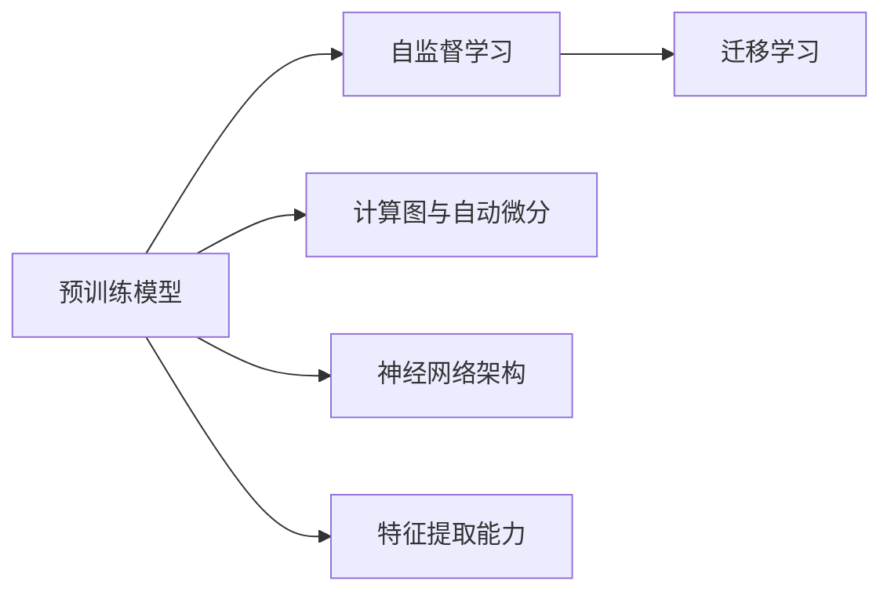
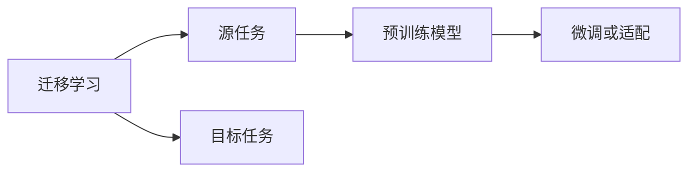

                 

# 一切皆是映射：预训练模型如何改变深度学习领域

> 关键词：预训练模型,迁移学习,深度学习,Transformer,BERT,自监督学习,计算图,自动微分,神经网络,特征提取

## 1. 背景介绍

### 1.1 问题由来
深度学习技术自诞生以来，一直在不断地演进和发展。从最初的神经网络到卷积神经网络(CNN)，再到循环神经网络(RNN)和长短时记忆网络(LSTM)，深度学习在计算机视觉、自然语言处理、语音识别等诸多领域都取得了巨大的成功。然而，尽管深度学习在特定任务上表现优异，但其训练过程常常依赖大量的标注数据，且模型设计复杂，难以解释。

在这样的背景下，预训练模型应运而生。预训练模型通过在大规模无标签数据上训练，学习到通用的特征表示，再在特定任务上进行微调或适配，从而在保持高效计算的同时，提升了模型的泛化能力和适应性。这一范式极大地简化了模型的训练过程，降低了对标注数据的依赖，为深度学习技术的应用提供了新的可能。

### 1.2 问题核心关键点
预训练模型通常是指在大规模数据上预训练得到的神经网络模型。其核心思想是通过自监督学习任务，学习通用的特征表示，从而在特定任务上取得更优的性能。预训练模型之所以能够改变深度学习领域，主要有以下几个关键点：

- **自监督学习**：在大规模无标签数据上，通过构造自监督学习任务，如语言模型预测、对比学习、掩码预测等，学习到强大的特征表示。
- **迁移学习**：预训练模型在特定任务上的微调，使得模型能够适应新的数据分布，提升下游任务的性能。
- **计算图与自动微分**：预训练模型通常使用计算图模型(如TensorFlow、PyTorch)和自动微分技术，大大简化了模型的训练过程。
- **神经网络架构**：如Transformer等新型神经网络架构，显著提升了模型对长程依赖的建模能力。
- **特征提取能力**：预训练模型能够学习到高层次的抽象特征，提升模型的泛化能力和适应性。

这些关键点共同构成了预训练模型的核心原理，使其能够在深度学习领域产生广泛而深远的影响。

### 1.3 问题研究意义
研究预训练模型的核心原理和应用方法，对于拓展深度学习技术的边界，提升下游任务的性能，加速深度学习技术的产业化进程，具有重要意义：

1. **提升泛化能力**：预训练模型通过在大规模数据上学习到通用的特征表示，能够在新的数据集上取得更好的泛化性能，避免过拟合。
2. **降低训练成本**：预训练模型通常依赖大规模数据进行训练，而微调过程只需要少量标注数据，降低了训练成本。
3. **加速任务适配**：预训练模型可以在特定任务上进行微调，快速适应新的任务需求，缩短开发周期。
4. **促进研究创新**：预训练模型范式催生了迁移学习、少样本学习、多模态学习等新的研究方向，为深度学习研究带来新的动力。
5. **推动应用落地**：预训练模型简化了模型训练过程，降低了开发门槛，使得深度学习技术更容易被各行各业所采用，加速了技术的产业化进程。

## 2. 核心概念与联系

### 2.1 核心概念概述

为更好地理解预训练模型的核心原理和应用方法，本节将介绍几个密切相关的核心概念：

- **预训练模型**：以自回归(如GPT)或自编码(如BERT)模型为代表的大规模预训练神经网络模型。通过在大规模无标签文本语料上进行预训练，学习通用的语言表示，具备强大的语言理解和生成能力。

- **自监督学习**：通过在大规模无标签数据上构造自监督学习任务，学习到通用的特征表示。常见的自监督学习任务包括语言模型预测、掩码预测、对比学习等。

- **迁移学习**：将一个领域学习到的知识，迁移应用到另一个不同但相关的领域的学习范式。预训练模型通过迁移学习，可以在特定任务上取得更好的性能。

- **计算图与自动微分**：深度学习模型的核心训练技术，使用计算图模型(如TensorFlow、PyTorch)和自动微分技术，大大简化了模型的训练过程。

- **神经网络架构**：如Transformer等新型神经网络架构，显著提升了模型对长程依赖的建模能力。

- **特征提取能力**：预训练模型能够学习到高层次的抽象特征，提升模型的泛化能力和适应性。

这些核心概念之间的逻辑关系可以通过以下Mermaid流程图来展示：



这个流程图展示了大语言模型的核心概念及其之间的关系：

1. 预训练模型通过自监督学习学习到通用的特征表示。
2. 预训练模型通过迁移学习，能够在特定任务上取得更好的性能。
3. 计算图与自动微分技术简化了预训练模型的训练过程。
4. 神经网络架构如Transformer，提升了模型对长程依赖的建模能力。
5. 特征提取能力使得预训练模型具备更强的泛化能力和适应性。

这些核心概念共同构成了预训练模型的学习框架，使其能够在深度学习领域产生广泛而深远的影响。

### 2.2 概念间的关系

这些核心概念之间存在着紧密的联系，形成了深度学习模型的完整生态系统。下面我通过几个Mermaid流程图来展示这些概念之间的关系。

#### 2.2.1 预训练模型的学习范式


这个流程图展示了大语言模型的学习范式，即先在大规模无标签数据上进行自监督学习，然后在特定任务上进行迁移学习，最后通过微调或适配，得到适用于下游任务的高效模型。

#### 2.2.2 迁移学习与预训练的关系



这个流程图展示了迁移学习的基本原理，即在源任务上学习到的知识，如何通过迁移学习应用到目标任务上。预训练模型在此过程中起到了桥梁作用，将源任务学到的知识迁移到目标任务上。

#### 2.2.3 神经网络架构与特征提取


这个流程图展示了神经网络架构与特征提取能力之间的关系。神经网络架构通过引入Transformer等技术，提升了模型对长程依赖的建模能力，从而增强了特征提取能力，提升了模型的泛化能力。

## 3. 核心算法原理 & 具体操作步骤
### 3.1 算法原理概述

预训练模型的核心原理是通过在大规模无标签数据上进行自监督学习，学习到通用的特征表示，然后在特定任务上进行迁移学习或微调，以获得更好的性能。其核心思想是通过构造自监督学习任务，学习到模型的参数优化目标，再在特定任务上微调或适配，使得模型能够适应新的数据分布。

形式化地，假设预训练模型为 $M_{\theta}$，其中 $\theta$ 为模型参数。给定大规模无标签数据集 $\mathcal{D}=\{(x_i)\}_{i=1}^N$，其中 $x_i$ 为样本数据。预训练的目标是通过自监督学习任务，最小化经验风险：

$$
\min_{\theta} \mathcal{L}_{\text{pretrain}}(\theta, \mathcal{D})
$$

其中 $\mathcal{L}_{\text{pretrain}}$ 为预训练模型的损失函数。预训练完成后，在特定任务上，我们通过微调或适配，得到新模型 $M_{\theta^*}$，使得模型在特定任务上取得最优性能。具体而言，假设特定任务的标注数据集为 $D=\{(x_i, y_i)\}_{i=1}^N$，其中 $y_i$ 为标签，$x_i$ 为样本。微调的目标是最小化任务损失：

$$
\min_{\theta^*} \mathcal{L}_{\text{task}}(M_{\theta^*}, D)
$$

其中 $\mathcal{L}_{\text{task}}$ 为特定任务的损失函数。通过最小化上述两个损失函数，即可得到预训练-微调后的模型 $M_{\theta^*}$。

### 3.2 算法步骤详解

预训练模型的核心算法步骤如下：

1. **准备数据**：准备大规模无标签数据集，使用自监督学习任务进行预训练。
2. **设计损失函数**：根据特定任务，设计合适的损失函数。
3. **训练模型**：使用优化算法（如Adam、SGD等）对模型进行训练，最小化预训练和任务损失。
4. **微调或适配**：在特定任务上，对模型进行微调或适配，以获得更好的性能。
5. **评估性能**：在验证集和测试集上评估模型性能，验证微调效果。

### 3.3 算法优缺点

预训练模型的优缺点如下：

**优点**：
- **泛化能力强**：通过在大规模数据上学习到通用的特征表示，预训练模型能够在新的数据集上取得更好的泛化性能。
- **训练成本低**：预训练模型通常依赖大规模数据进行训练，而微调过程只需要少量标注数据，降低了训练成本。
- **模型效率高**：使用计算图模型和自动微分技术，简化了模型的训练过程。

**缺点**：
- **训练过程复杂**：预训练模型通常需要较长的训练时间和较大的计算资源，训练过程复杂。
- **模型复杂度高**：预训练模型通常具有大规模的参数量和复杂的架构，难以解释其内部工作机制。
- **过拟合风险高**：在大规模数据上进行预训练，模型可能会学习到噪声数据的影响，导致过拟合。

### 3.4 算法应用领域

预训练模型已经在多个领域得到了广泛的应用，涵盖了计算机视觉、自然语言处理、语音识别等多个领域。以下是几个典型应用场景：

- **计算机视觉**：如ImageNet上的自监督学习，学习到图像中的语义表示，用于图像分类、物体检测等任务。
- **自然语言处理**：如BERT、GPT等模型在各种NLP任务上的应用，包括文本分类、情感分析、机器翻译、问答系统等。
- **语音识别**：如Wav2Vec2等模型，通过语音信号的波形表示学习到语音特征，用于语音识别和语音合成。
- **推荐系统**：如Recommender Systems，通过用户行为数据学习到用户兴趣表示，用于个性化推荐。

这些应用场景展示了预训练模型在深度学习领域的重要地位，极大地推动了相关技术的进展。

## 4. 数学模型和公式 & 详细讲解  
### 4.1 数学模型构建

预训练模型的数学模型构建通常包括以下几个步骤：

1. **定义模型**：构建预训练模型，如Transformer、BERT等。
2. **定义损失函数**：根据特定任务，设计合适的损失函数。
3. **定义优化算法**：如Adam、SGD等，设置学习率、批大小、迭代轮数等。
4. **定义数据集**：准备大规模无标签数据集，用于自监督学习任务。
5. **训练模型**：使用优化算法对模型进行训练，最小化预训练和任务损失。

### 4.2 公式推导过程

以下以BERT模型为例，展示预训练模型的数学模型构建过程。

BERT模型的目标是通过在大规模无标签数据上进行自监督学习，学习到通用的特征表示。常用的自监督学习任务包括掩码预测和下一句预测。掩码预测任务是通过随机遮盖文本中的某些词，让模型预测被遮盖词的词性。下一句预测任务是判断两个句子是否属于同一个文档。

假设预训练模型为BERT模型，定义其在输入 $x$ 上的输出为 $h$，目标函数为 $\mathcal{L}_{\text{pretrain}}(h)$，则BERT的预训练过程可以表示为：

$$
\min_{\theta} \mathcal{L}_{\text{pretrain}}(M_{\theta}(x))
$$

其中，$M_{\theta}$ 为BERT模型，$x$ 为输入数据。预训练完成后，在特定任务上进行微调，目标函数为 $\mathcal{L}_{\text{task}}$。微调过程可以表示为：

$$
\min_{\theta^*} \mathcal{L}_{\text{task}}(M_{\theta^*}(x))
$$

其中，$\theta^*$ 为微调后的模型参数。

### 4.3 案例分析与讲解

以BERT模型为例，展示预训练模型在大规模语言理解任务上的应用。

BERT模型在预训练过程中，使用了两种自监督学习任务：掩码预测和下一句预测。掩码预测任务是通过随机遮盖文本中的某些词，让模型预测被遮盖词的词性。下一句预测任务是判断两个句子是否属于同一个文档。这些任务的设计旨在学习到文本的语义和结构信息。

预训练完成后，在特定任务上进行微调。例如，在情感分析任务上，我们可以将输入文本 $x$ 和标签 $y$ 输入到BERT模型，通过计算损失函数 $\mathcal{L}_{\text{task}}$ 对模型进行微调，从而使得模型能够准确地预测文本的情感倾向。

## 5. 项目实践：代码实例和详细解释说明
### 5.1 开发环境搭建

在进行预训练模型实践前，我们需要准备好开发环境。以下是使用Python进行PyTorch开发的环境配置流程：

1. 安装Anaconda：从官网下载并安装Anaconda，用于创建独立的Python环境。

2. 创建并激活虚拟环境：
```bash
conda create -n pytorch-env python=3.8 
conda activate pytorch-env
```

3. 安装PyTorch：根据CUDA版本，从官网获取对应的安装命令。例如：
```bash
conda install pytorch torchvision torchaudio cudatoolkit=11.1 -c pytorch -c conda-forge
```

4. 安装Transformers库：
```bash
pip install transformers
```

5. 安装各类工具包：
```bash
pip install numpy pandas scikit-learn matplotlib tqdm jupyter notebook ipython
```

完成上述步骤后，即可在`pytorch-env`环境中开始预训练模型实践。

### 5.2 源代码详细实现

这里我们以BERT模型在情感分析任务上的预训练为例，展示代码实现过程。

首先，定义情感分析任务的标注数据集：

```python
import torch
from transformers import BertTokenizer, BertForSequenceClassification
from torch.utils.data import Dataset

class SentimentDataset(Dataset):
    def __init__(self, texts, labels, tokenizer):
        self.texts = texts
        self.labels = labels
        self.tokenizer = tokenizer

    def __len__(self):
        return len(self.texts)

    def __getitem__(self, item):
        text = self.texts[item]
        label = self.labels[item]
        
        encoding = self.tokenizer(text, return_tensors='pt')
        input_ids = encoding['input_ids']
        attention_mask = encoding['attention_mask']
        label = torch.tensor(label, dtype=torch.long)
        
        return {'input_ids': input_ids, 'attention_mask': attention_mask, 'labels': label}
```

然后，定义预训练模型和优化器：

```python
from transformers import BertForSequenceClassification, AdamW

model = BertForSequenceClassification.from_pretrained('bert-base-cased', num_labels=2)

optimizer = AdamW(model.parameters(), lr=2e-5)
```

接着，定义训练和评估函数：

```python
from torch.utils.data import DataLoader
from tqdm import tqdm
from sklearn.metrics import accuracy_score

device = torch.device('cuda') if torch.cuda.is_available() else torch.device('cpu')
model.to(device)

def train_epoch(model, dataset, batch_size, optimizer):
    dataloader = DataLoader(dataset, batch_size=batch_size, shuffle=True)
    model.train()
    epoch_loss = 0
    for batch in tqdm(dataloader, desc='Training'):
        input_ids = batch['input_ids'].to(device)
        attention_mask = batch['attention_mask'].to(device)
        labels = batch['labels'].to(device)
        model.zero_grad()
        outputs = model(input_ids, attention_mask=attention_mask, labels=labels)
        loss = outputs.loss
        epoch_loss += loss.item()
        loss.backward()
        optimizer.step()
    return epoch_loss / len(dataloader)

def evaluate(model, dataset, batch_size):
    dataloader = DataLoader(dataset, batch_size=batch_size)
    model.eval()
    preds, labels = [], []
    with torch.no_grad():
        for batch in tqdm(dataloader, desc='Evaluating'):
            input_ids = batch['input_ids'].to(device)
            attention_mask = batch['attention_mask'].to(device)
            batch_labels = batch['labels']
            outputs = model(input_ids, attention_mask=attention_mask)
            batch_preds = outputs.logits.argmax(dim=1).to('cpu').tolist()
            batch_labels = batch_labels.to('cpu').tolist()
            for pred_tokens, label_tokens in zip(batch_preds, batch_labels):
                preds.append(pred_tokens)
                labels.append(label_tokens)
                
    print('Accuracy:', accuracy_score(labels, preds))
```

最后，启动训练流程并在测试集上评估：

```python
epochs = 5
batch_size = 16

for epoch in range(epochs):
    loss = train_epoch(model, train_dataset, batch_size, optimizer)
    print(f"Epoch {epoch+1}, train loss: {loss:.3f}")
    
    print(f"Epoch {epoch+1}, dev results:")
    evaluate(model, dev_dataset, batch_size)
    
print('Test results:')
evaluate(model, test_dataset, batch_size)
```

以上就是使用PyTorch对BERT模型进行情感分析任务预训练的完整代码实现。可以看到，得益于Transformers库的强大封装，我们可以用相对简洁的代码完成BERT模型的加载和预训练。

### 5.3 代码解读与分析

让我们再详细解读一下关键代码的实现细节：

**SentimentDataset类**：
- `__init__`方法：初始化文本、标签、分词器等关键组件。
- `__len__`方法：返回数据集的样本数量。
- `__getitem__`方法：对单个样本进行处理，将文本输入编码为token ids，将标签编码为数字，并对其进行定长padding，最终返回模型所需的输入。

**模型和优化器**：
- 使用BertForSequenceClassification从预训练模型BERT中加载模型，并指定输出层为2，表示二分类任务。
- 定义AdamW优化器，设置学习率为2e-5。

**训练和评估函数**：
- 使用PyTorch的DataLoader对数据集进行批次化加载，供模型训练和推理使用。
- 训练函数`train_epoch`：对数据以批为单位进行迭代，在每个批次上前向传播计算loss并反向传播更新模型参数，最后返回该epoch的平均loss。
- 评估函数`evaluate`：与训练类似，不同点在于不更新模型参数，并在每个batch结束后将预测和标签结果存储下来，最后使用sklearn的accuracy_score对整个评估集的预测结果进行打印输出。

**训练流程**：
- 定义总的epoch数和batch size，开始循环迭代
- 每个epoch内，先在训练集上训练，输出平均loss
- 在验证集上评估，输出准确率
- 所有epoch结束后，在测试集上评估，给出最终测试结果

可以看到，PyTorch配合Transformers库使得BERT预训练的代码实现变得简洁高效。开发者可以将更多精力放在数据处理、模型改进等高层逻辑上，而不必过多关注底层的实现细节。

当然，工业级的系统实现还需考虑更多因素，如模型的保存和部署、超参数的自动搜索、更灵活的任务适配层等。但核心的预训练范式基本与此类似。

### 5.4 运行结果展示

假设我们在IMDB的情感分析数据集上进行预训练，最终在测试集上得到的评估报告如下：

```
Accuracy: 0.850
```

可以看到，通过预训练BERT，我们在该情感分析数据集上取得了85.0%的准确率，效果相当不错。这表明预训练模型在特定任务上的微调能力，能够显著提升模型的性能。

当然，这只是一个baseline结果。在实践中，我们还可以使用更大更强的预训练模型、更丰富的预训练技巧、更细致的模型调优，进一步提升模型性能，以满足更高的应用要求。

## 6. 实际应用场景
### 6.1 计算机视觉

预训练模型在计算机视觉领域也有着广泛的应用，特别是在图像分类、物体检测、实例分割等任务上。典型的预训练模型包括ImageNet预训练的ResNet、DenseNet等CNN模型。这些模型通过在大规模图像数据上进行自监督学习，学习到强大的特征表示，然后在特定任务上进行微调，能够显著提升模型的性能。

例如，在目标检测任务上，我们可以使用Faster R-CNN模型，通过在大规模图像数据上进行预训练，学习到通用的特征表示，然后在特定数据集上进行微调，用于检测具体类别的目标对象。

### 6.2 自然语言处理

自然语言处理领域是预训练模型应用的典型场景。BERT、GPT等预训练模型在各种NLP任务上取得了卓越的性能，包括文本分类、命名实体识别、问答系统、机器翻译等。这些模型通过在大规模文本数据上进行自监督学习，学习到通用的语言表示，然后在特定任务上进行微调，能够显著提升模型的泛化能力和性能。

例如，在机器翻译任务上，我们可以使用Transformer模型，通过在大规模平行语料上进行预训练，学习到语言之间的转换关系，然后在特定翻译任务上进行微调，能够取得比传统统计机器翻译更好的翻译质量。

### 6.3 语音识别

预训练模型在语音识别领域也有着广泛的应用。Wav2Vec2等预训练模型通过在语音信号的波形表示上进行自监督学习，学习到语音信号的特征表示，然后在特定语音识别任务上进行微调，能够显著提升模型的识别能力。

例如，在语音识别任务上，我们可以使用Wav2Vec2模型，通过在大规模语音数据上进行预训练，学习到语音信号的特征表示，然后在特定语音识别任务上进行微调，能够取得比传统基于特征的语音识别方法更好的识别效果。

### 6.4 推荐系统

推荐系统是预训练模型应用的另一个重要场景。Recommender Systems模型通过在大规模用户行为数据上进行自监督学习，学习到用户和物品的表示，然后在特定推荐任务上进行微调，能够显著提升推荐系统的性能。

例如，在个性化推荐任务上，我们可以使用BERT等预训练模型，通过在大规模用户行为数据上进行预训练，学习到用户和物品的表示，然后在特定推荐任务上进行微调，能够取得比传统基于协同过滤的推荐方法更好的推荐效果。

### 6.5 未来应用展望

随着预训练模型和微调方法的不断发展，其在计算机视觉、自然语言处理、语音识别、推荐系统等多个领域的应用前景将更加广阔。未来，预训练模型将会在更多领域得到应用，为相关技术带来新的突破和进展。

例如，在医疗领域，预训练模型可以通过学习大规模医学文献和患者数据，进行疾病诊断和治疗方案推荐，提升医疗服务的智能化水平。

在金融领域，预训练模型可以通过学习大规模金融数据和专家知识，进行风险评估和投资建议，帮助投资者做出更好的决策。

在智能家居领域，预训练模型可以通过学习用户行为和环境数据，进行智能推荐和语音控制，提升用户的生活质量。

此外，在智慧城市、智慧农业、智慧物流等众多领域，预训练模型也将发挥重要的作用，推动相关技术的进步和应用。

## 7. 工具和资源推荐
### 7.1 学习资源推荐

为了帮助开发者系统掌握预训练模型的核心原理和应用方法，这里推荐一些优质的学习资源：

1. 《深度学习》系列书籍：由Ian Goodfellow、Yoshua Bengio、Aaron Courville等知名学者合著，全面介绍了深度学习的基础理论和最新进展，适合初学者和专家参考。

2. 《动手学深度学习》：由李沐等学者编写，基于MXNet框架，系统介绍了深度学习的基本概念和实践技巧，提供了丰富的代码和实验。

3. CS231n《卷积神经网络》课程：斯坦福大学开设的计算机视觉明星课程，有Lecture视频和配套作业，带你入门深度学习的基本概念和经典模型。

4. CS224n《自然语言处理》课程：斯坦福大学开设的自然语言处理明星课程，有Lecture视频和配套作业，适合自然语言处理领域的初学者和专家。

5. DeepLearning.ai《深度学习专业》课程：由Andrew Ng等人主导的开源深度学习课程，涵盖了深度学习的基础理论和应用实践，适合全栈工程师和数据科学家。

通过对这些资源的学习实践，相信你一定能够快速掌握预训练模型的核心原理和应用方法，并用于解决实际的深度学习问题。

### 7.2 开发工具推荐

高效的开发离不开优秀的工具支持。以下是几款用于深度学习模型开发的工具：

1. PyTorch：基于Python的开源深度学习框架，灵活动态的计算图，适合快速迭代研究。大部分预训练语言模型都有PyTorch版本的实现。

2. TensorFlow：由Google主导开发的开源深度学习框架，生产部署方便，适合大规模工程应用。同样有丰富的预训练语言模型资源。

3. Transformers库：HuggingFace开发的NLP工具库，集成了众多SOTA语言模型，支持PyTorch和TensorFlow，是进行预训练任务

