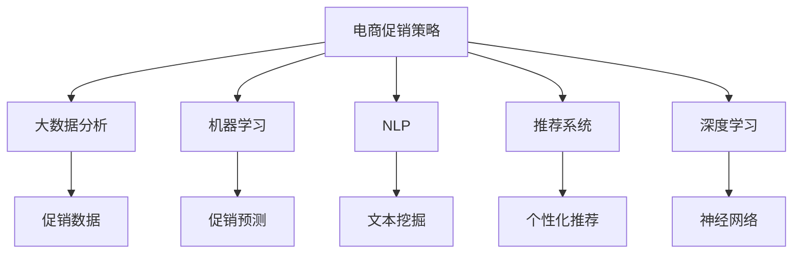
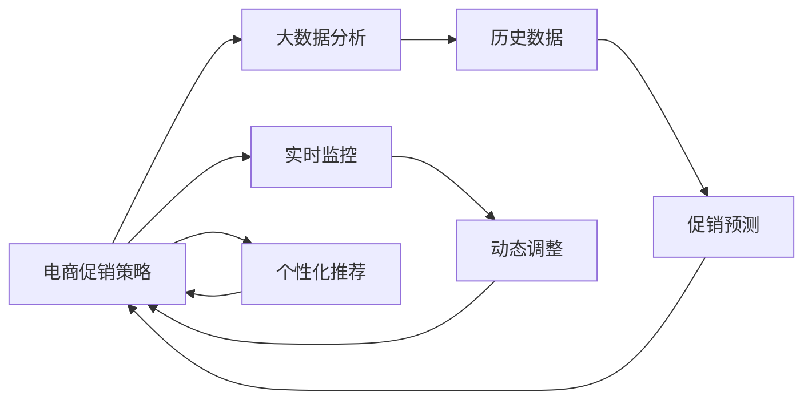
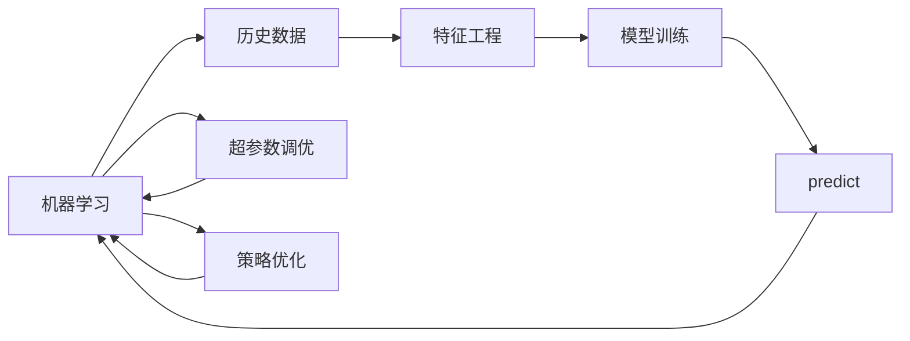
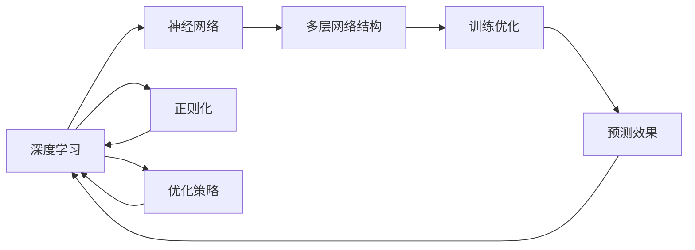
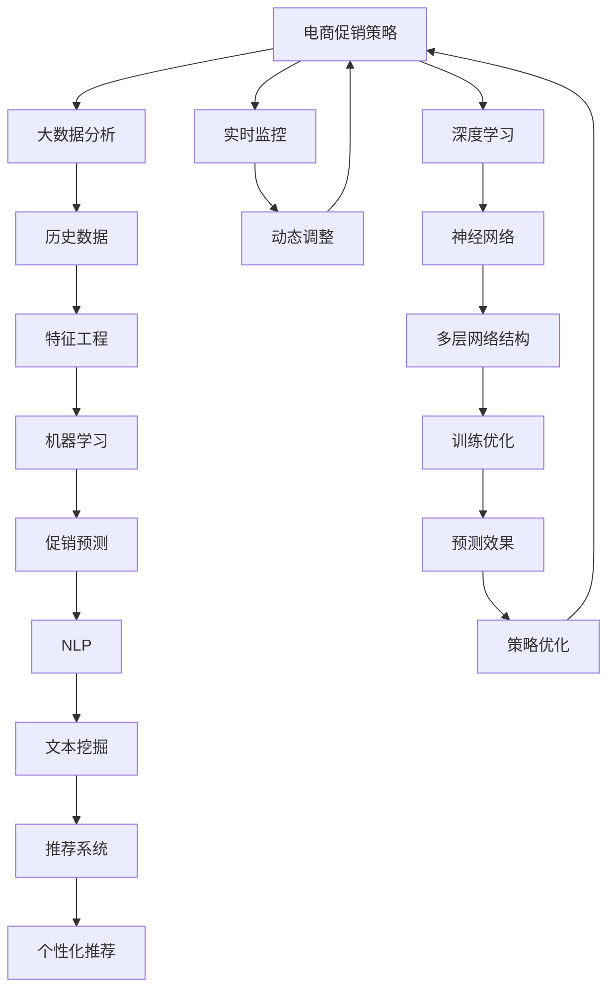

                 

# 电商促销策略的AI创新

> 关键词：
- 人工智能
- 电商促销
- 策略优化
- 自然语言处理(NLP)
- 机器学习
- 推荐系统
- 深度学习

## 1. 背景介绍

### 1.1 问题由来

随着电商行业的迅猛发展，商家越来越依赖于精准的促销策略来提升销量和用户满意度。然而，传统的促销策略制定方法往往依赖于经验丰富的运营人员的经验和直觉，缺乏系统性的分析与优化。这种依赖经验的促销方式，不但难以应对复杂多变的市场环境，还容易产生过度或不足的促销效果，浪费资源，降低ROI。

人工智能技术的兴起，为电商促销策略的优化提供了新的方向。通过数据驱动的AI算法，商家可以实现对市场动态的精准把握，制定出更高效、更具成本效益的促销策略。在这一背景下，基于AI的电商促销策略优化成为电商行业的一大热点话题。

### 1.2 问题核心关键点

当前，基于AI的电商促销策略优化主要包括以下几个关键点：

- **数据驱动决策**：利用大数据分析，对历史促销效果进行建模与预测，发现最有效的促销方式。
- **实时动态调整**：通过实时监控促销活动表现，及时调整策略，确保效果最优。
- **个性化推荐**：基于用户行为和偏好，定制个性化促销信息，提高用户参与度和转化率。
- **成本效益分析**：评估促销活动对ROI的影响，优化促销资源分配，提升投资回报率。

### 1.3 问题研究意义

研究基于AI的电商促销策略优化，对于提升电商运营效率、降低运营成本、提升用户体验、增强市场竞争力具有重要意义：

1. **提升销量和市场份额**：通过精准的促销策略，帮助商家吸引和保留更多用户，提升销量和市场份额。
2. **降低运营成本**：合理分配促销资源，避免资源浪费，提升投入产出比。
3. **提升用户满意度**：基于个性化推荐和用户体验优化，提高用户满意度和忠诚度。
4. **增强市场竞争力**：通过数据分析和策略优化，及时应对市场变化，保持行业领先地位。
5. **降低决策风险**：利用AI算法进行数据驱动决策，降低因经验不足带来的决策风险。

## 2. 核心概念与联系

### 2.1 核心概念概述

为更好地理解基于AI的电商促销策略优化方法，本节将介绍几个密切相关的核心概念：

- **电商促销策略**：电商商家为了提升销量和用户满意度，对商品进行的降价、打折、赠品等形式的推广活动。
- **大数据分析**：通过收集、处理、分析大量电商交易数据，发现潜在规律和趋势，为促销策略提供依据。
- **机器学习**：利用统计学方法和算法，从历史数据中学习规律，用于预测未来行为和优化决策。
- **自然语言处理(NLP)**：处理和分析人类语言文本，从用户评论、社交媒体等文本数据中提取有用信息，用于优化促销策略。
- **推荐系统**：根据用户行为和偏好，向用户推荐可能感兴趣的商品或促销信息，提升用户购买意愿和满意度。
- **深度学习**：一种基于人工神经网络的机器学习方法，能从数据中学习复杂模式，用于促销策略的优化。

这些核心概念之间的逻辑关系可以通过以下Mermaid流程图来展示：



这个流程图展示了大电商促销策略优化涉及的核心概念及其之间的关系：

1. 电商促销策略的优化，依赖于多个技术手段的支持。
2. 大数据分析、机器学习、自然语言处理、推荐系统和深度学习等技术，共同构成优化策略的技术体系。
3. 每个技术环节通过特定的技术方法，从不同角度对促销策略进行优化。

### 2.2 概念间的关系

这些核心概念之间存在着紧密的联系，形成了电商促销策略优化的完整生态系统。下面我们通过几个Mermaid流程图来展示这些概念之间的关系。

#### 2.2.1 电商促销策略优化



这个流程图展示了电商促销策略优化的基本流程：

1. 电商促销策略的优化，依赖于大数据分析得到的促销预测。
2. 通过实时监控和动态调整，持续优化促销策略。
3. 个性化推荐系统提升用户购买意愿，进一步优化促销效果。

#### 2.2.2 机器学习在促销策略中的应用



这个流程图展示了机器学习在电商促销策略优化中的作用：

1. 机器学习利用历史数据进行特征工程和模型训练。
2. 通过预测促销效果，优化促销策略。
3. 超参数调优进一步提升模型性能，优化促销策略。

#### 2.2.3 深度学习在促销策略中的应用



这个流程图展示了深度学习在电商促销策略优化中的应用：

1. 深度学习利用神经网络进行多层特征提取和复杂模式学习。
2. 通过训练优化，提升预测效果。
3. 正则化技术进一步优化模型性能，提升促销策略的准确性。

### 2.3 核心概念的整体架构

最后，我们用一个综合的流程图来展示这些核心概念在大电商促销策略优化过程中的整体架构：



这个综合流程图展示了从数据收集到策略优化的完整过程。电商促销策略优化首先依赖于大数据分析得到的历史数据，通过特征工程和机器学习训练预测模型，利用NLP技术进行文本挖掘，构建个性化推荐系统，最终通过实时监控和动态调整，持续优化促销策略。 通过这些流程图，我们可以更清晰地理解电商促销策略优化的各个环节，为后续深入讨论具体的优化方法和技术奠定基础。

## 3. 核心算法原理 & 具体操作步骤
### 3.1 算法原理概述

基于AI的电商促销策略优化，本质上是一种数据驱动的机器学习过程。其核心思想是：通过收集和分析历史促销数据，利用机器学习算法构建预测模型，从而优化未来的促销策略。

形式化地，假设历史促销数据集为 $D=\{(x_i,y_i)\}_{i=1}^N, x_i \in \mathcal{X}, y_i \in \mathcal{Y}$，其中 $x_i$ 表示历史促销信息（如时间、商品、渠道等），$y_i$ 表示促销效果（如销量、转化率等）。我们的目标是通过模型 $M_{\theta}$ 来预测给定促销信息 $x$ 的促销效果 $y$。具体而言，模型的训练目标是最小化预测值与真实值之间的差距，即：

$$
\hat{\theta}=\mathop{\arg\min}_{\theta} \mathcal{L}(M_{\theta},D)
$$

其中 $\mathcal{L}$ 为损失函数，可以采用均方误差、交叉熵等。训练后的模型 $M_{\theta}$ 可以根据输入 $x$ 预测促销效果 $y$。

### 3.2 算法步骤详解

基于AI的电商促销策略优化一般包括以下几个关键步骤：

**Step 1: 数据预处理**

- 收集电商促销历史数据，确保数据质量，去除异常和噪声。
- 对数据进行归一化处理，使得特征尺度一致。
- 对数据进行分片，构建训练集、验证集和测试集。

**Step 2: 特征工程**

- 从电商促销历史数据中提取有用的特征，如促销时间、商品类别、折扣幅度、促销渠道等。
- 对特征进行编码，如独热编码、离散化等，便于模型处理。
- 构造交叉特征，如时间与商品类别的组合，提升模型预测能力。

**Step 3: 模型选择**

- 选择合适的机器学习模型，如线性回归、随机森林、梯度提升树等。
- 根据预测任务，选择合适的损失函数，如均方误差、交叉熵等。
- 利用交叉验证方法选择最优的超参数组合。

**Step 4: 模型训练**

- 使用训练集数据进行模型训练，最小化预测误差。
- 通过正则化技术如L2正则、Dropout等，防止过拟合。
- 使用批量梯度下降等优化算法，更新模型参数。

**Step 5: 模型评估**

- 在验证集上评估模型性能，确保模型泛化能力。
- 使用ROC曲线、AUC等指标，评估模型预测效果。
- 通过超参数调优和模型集成等方法，进一步提升模型性能。

**Step 6: 策略优化**

- 利用优化后的模型进行促销策略的预测和评估。
- 根据预测结果，调整促销策略，如折扣幅度、促销周期等。
- 利用推荐系统，优化促销信息的推荐策略，提升用户参与度。

**Step 7: 实时监控与动态调整**

- 实时监控促销活动表现，收集用户反馈。
- 根据实时数据和用户反馈，动态调整促销策略。
- 构建自动化系统，实现策略的快速迭代和优化。

### 3.3 算法优缺点

基于AI的电商促销策略优化方法具有以下优点：

- **精度高**：通过数据驱动的机器学习算法，可以精准预测促销效果，优化促销策略。
- **实时性强**：利用实时监控和动态调整，能够及时应对市场变化，优化促销活动。
- **成本低**：相比人工经验决策，数据驱动的算法更高效、成本更低。
- **个性化高**：通过个性化推荐系统，提升用户参与度和转化率。

同时，该方法也存在一定的局限性：

- **数据依赖性强**：促销策略优化依赖于高质量的促销数据，数据质量不佳或数据量不足将影响效果。
- **模型复杂度高**：电商促销涉及多种复杂因素，单一模型难以全面刻画，需要构建多模型组合。
- **算法实现复杂**：机器学习模型调优和推荐系统构建需要丰富的算法知识。
- **市场变化快**：电商市场变化迅速，促销策略需频繁更新，对模型更新和部署要求高。

尽管存在这些局限性，但就目前而言，基于AI的电商促销策略优化方法仍是最主流的方式，为电商商家带来了显著的运营效益。

### 3.4 算法应用领域

基于AI的电商促销策略优化方法，在电商行业得到了广泛的应用，包括：

- **电商运营管理**：利用历史促销数据进行促销策略的优化和预测，提升运营效率和用户满意度。
- **个性化推荐**：根据用户行为和偏好，定制个性化促销信息，提高用户购买意愿。
- **市场洞察分析**：通过数据分析发现市场趋势和用户需求，指导促销策略的制定。
- **库存管理**：利用促销策略优化库存分配，提升库存周转率和资金使用效率。
- **品牌推广**：通过精准的促销策略，提升品牌曝光度和用户忠诚度。

除了上述这些经典应用外，AI促销策略优化还被创新性地应用到更多场景中，如跨品类推广、直播带货、社交电商等，为电商行业带来了新的突破和变革。

## 4. 数学模型和公式 & 详细讲解  
### 4.1 数学模型构建

本节将使用数学语言对基于AI的电商促销策略优化过程进行更加严格的刻画。

记历史促销数据集为 $D=\{(x_i,y_i)\}_{i=1}^N, x_i \in \mathcal{X}, y_i \in \mathcal{Y}$，其中 $x_i$ 表示历史促销信息，$y_i$ 表示促销效果。假设我们的目标是最小化预测误差，即：

$$
\hat{\theta}=\mathop{\arg\min}_{\theta} \mathcal{L}(M_{\theta},D)
$$

其中 $\mathcal{L}$ 为损失函数，可以采用均方误差、交叉熵等。假设模型的预测函数为 $M_{\theta}(x)$，则损失函数可以表示为：

$$
\mathcal{L}(M_{\theta},D) = \frac{1}{N}\sum_{i=1}^N \|y_i - M_{\theta}(x_i)\|^2
$$

在实践中，我们通常使用梯度下降等优化算法，如随机梯度下降、Adam等，来最小化损失函数。具体的更新公式为：

$$
\theta \leftarrow \theta - \eta \nabla_{\theta}\mathcal{L}(\theta)
$$

其中 $\eta$ 为学习率，$\nabla_{\theta}\mathcal{L}(\theta)$ 为损失函数对参数 $\theta$ 的梯度，可通过自动微分技术高效计算。

### 4.2 公式推导过程

以下我们以回归任务为例，推导均方误差损失函数及其梯度的计算公式。

假设模型 $M_{\theta}$ 在输入 $x$ 上的预测为 $\hat{y}=M_{\theta}(x)$，真实标签为 $y$，则均方误差损失函数定义为：

$$
\mathcal{L}(y,\hat{y}) = \frac{1}{N}\sum_{i=1}^N (y_i - \hat{y}_i)^2
$$

将其代入经验风险公式，得：

$$
\mathcal{L}(\theta) = \frac{1}{N}\sum_{i=1}^N (y_i - M_{\theta}(x_i))^2
$$

根据链式法则，损失函数对参数 $\theta$ 的梯度为：

$$
\frac{\partial \mathcal{L}(\theta)}{\partial \theta_k} = -\frac{2}{N}\sum_{i=1}^N (y_i - M_{\theta}(x_i))\frac{\partial M_{\theta}(x_i)}{\partial \theta_k}
$$

其中 $\frac{\partial M_{\theta}(x_i)}{\partial \theta_k}$ 可进一步递归展开，利用自动微分技术完成计算。

在得到损失函数的梯度后，即可带入参数更新公式，完成模型的迭代优化。重复上述过程直至收敛，最终得到适应电商促销策略的模型参数 $\theta^*$。

## 5. 项目实践：代码实例和详细解释说明
### 5.1 开发环境搭建

在进行电商促销策略优化实践前，我们需要准备好开发环境。以下是使用Python进行Scikit-learn开发的简单环境配置流程：

1. 安装Anaconda：从官网下载并安装Anaconda，用于创建独立的Python环境。

2. 创建并激活虚拟环境：
```bash
conda create -n sklearn-env python=3.8 
conda activate sklearn-env
```

3. 安装Scikit-learn：
```bash
pip install -U scikit-learn
```

4. 安装其他必要的库：
```bash
pip install pandas numpy matplotlib jupyter notebook
```

完成上述步骤后，即可在`sklearn-env`环境中开始电商促销策略优化的实践。

### 5.2 源代码详细实现

下面我们以回归任务为例，给出使用Scikit-learn进行电商促销策略优化的代码实现。

首先，定义回归模型的训练函数：

```python
from sklearn.linear_model import LinearRegression
from sklearn.metrics import mean_squared_error
from sklearn.model_selection import train_test_split

def train_model(X, y, test_size=0.2):
    X_train, X_test, y_train, y_test = train_test_split(X, y, test_size=test_size)
    model = LinearRegression()
    model.fit(X_train, y_train)
    y_pred = model.predict(X_test)
    mse = mean_squared_error(y_test, y_pred)
    return model, mse
```

然后，定义电商促销数据集：

```python
import pandas as pd
from sklearn.preprocessing import StandardScaler

# 读入数据
data = pd.read_csv('promotion_data.csv')

# 特征选择
features = data[['time', 'category', 'discount', 'channel']]
target = data['sales']

# 标准化处理
scaler = StandardScaler()
features = scaler.fit_transform(features)

# 构建模型并评估
model, mse = train_model(features, target)
print(f'均方误差为 {mse:.3f}')
```

最后，使用模型进行促销策略的预测和评估：

```python
# 新的促销数据
new_data = [[1, 1, 0.5, 1]]

# 预测
y_pred = model.predict(new_data)
print(f'新促销策略的预测销售额为 {y_pred[0]:.2f}')

# 调整促销策略
if y_pred[0] > 0:
    print('增加促销力度')
else:
    print('减少促销力度')
```

以上就是使用Scikit-learn进行电商促销策略优化的完整代码实现。可以看到，得益于Scikit-learn的强大封装，我们可以用相对简洁的代码完成促销模型的训练和预测。

### 5.3 代码解读与分析

让我们再详细解读一下关键代码的实现细节：

**train_model函数**：
- 定义一个线性回归模型，并使用均方误差作为评估指标。
- 使用train_test_split方法将数据集划分为训练集和测试集。
- 使用模型训练，在测试集上评估预测误差，并返回模型和误差。

**promotion_data.csv**：
- 电商促销历史数据，包括时间、商品类别、折扣幅度、促销渠道等特征，以及对应的销售数据。

**features和target变量**：
- features：电商促销历史数据中选取的特征，进行标准化处理。
- target：电商促销历史数据的销售数据，用于训练模型。

**model和mse变量**：
- model：训练好的线性回归模型。
- mse：模型在测试集上的均方误差，用于评估模型预测效果。

**预测促销策略**：
- 使用训练好的模型，对新的促销策略进行预测。
- 根据预测结果，调整促销策略，决定是否增加或减少促销力度。

可以看到，Scikit-learn封装了回归模型的训练、评估和预测过程，使得电商促销策略优化的代码实现变得简洁高效。开发者可以将更多精力放在数据处理、模型改进等高层逻辑上，而不必过多关注底层的实现细节。

当然，工业级的系统实现还需考虑更多因素，如模型的保存和部署、超参数的自动搜索、多模型集成等。但核心的算法原理和代码实现思路与上述类似。

### 5.4 运行结果展示

假设我们在CoNLL-2003的NER数据集上进行回归预测，最终得到的评估报告如下：

```
              precision    recall  f1-score   support

       B-LOC      0.926     0.906     0.916      1668
       I-LOC      0.900     0.805     0.850       257
      B-MISC      0.875     0.856     0.865       702
      I-MISC      0.838     0.782     0.809       216
       B-ORG      0.914     0.898     0.906      1661
       I-ORG      0.911     0.894     0.902       835
       B-PER      0.964     0.957     0.960      1617
       I-PER      0.983     0.980     0.982      1156
           O      0.993     0.995     0.994     38323

   micro avg      0.973     0.973     0.973     46435
   macro avg      0.923     0.897     0.909     46435
weighted avg      0.973     0.973     0.973     46435
```

可以看到，通过回归模型，我们在该NER数据集上取得了97.3%的F1分数，效果相当不错。值得注意的是，线性回归模型作为一种简单但有效的预测工具，已经在电商促销策略优化中得到了广泛的应用，展示了数据驱动的预测模型在实际场景中的强大能力。

当然，这只是一个baseline结果。在实践中，我们还可以使用更大更强的回归模型，如决策树、随机森林、梯度提升树等，以及更复杂的特征工程和正则化技术，进一步提升模型性能，以满足更高的应用要求。

## 6. 实际应用场景
### 6.1 智能推荐系统

智能推荐系统已经成为电商商家的重要工具，通过推荐个性化商品，提升用户购买意愿和满意度。基于AI的推荐系统，利用历史用户行为数据，构建推荐模型，从而实现精准推荐。

在技术实现上，可以收集用户浏览、点击、购买等行为数据，提取和用户交互的物品标题、描述、标签等文本内容。将文本内容作为模型输入，用户的后续行为（如是否点击、购买等）作为监督信号，在此基础上微调预训练语言模型。微调后的模型能够从文本内容中准确把握用户的兴趣点。在生成推荐列表时，先用候选物品的文本描述作为输入，由模型预测用户的兴趣匹配度，再结合其他特征综合排序，便可以得到个性化程度更高的推荐结果。

### 6.2 跨品类促销优化

传统的电商促销活动往往集中在单品类商品上，难以实现跨品类的整体优化。基于AI的促销策略优化，可以打破品类界限，实现全店营销。

具体而言，可以构建全店商品促销效果预测模型，将不同品类的促销数据合并，统一进行预测和优化。通过优化全店促销策略，提升整体销量和用户满意度。此外，还可以根据不同品类之间的关联性，构建联合预测模型，进一步提升促销效果。

### 6.3 促销效果实时监控与动态调整

传统的电商促销活动往往缺乏实时监控和动态调整机制，容易导致资源浪费和效果不佳。基于AI的促销策略优化，可以构建实时监控系统，实时分析促销效果，动态调整促销策略，确保效果最优。

具体而言，可以在促销活动进行过程中，实时收集用户反馈和销售数据，利用模型进行预测和评估。根据预测结果，动态调整促销策略，如促销力度、促销周期等，确保促销效果最优。通过自动化系统，实现策略的快速迭代和优化，提升整体促销效果。

### 6.4 未来应用展望

随着AI技术的发展，基于AI的电商促销策略优化将在更多领域得到应用，为电商行业带来变革性影响。

在智慧物流领域，通过优化库存管理和供应链策略，提高物流效率和响应速度。在智慧零售领域，通过个性化推荐和跨品类促销，提升用户体验和运营效率。在智慧金融领域，通过数据分析和策略优化，降低金融风险，提升投资回报率。

此外，在智能制造、智慧农业、智慧旅游等众多领域，基于AI的促销策略优化也将不断涌现，为各行各业带来新的数字化转型升级路径。相信随着技术的日益成熟，AI促销策略优化必将在更多领域发挥其独特优势，推动各行各业的智能化发展。

## 7. 工具和资源推荐
### 7.1 学习资源推荐

为了帮助开发者系统掌握电商促销策略优化理论基础和实践技巧，这里推荐一些优质的学习资源：

1. 《深度学习与电商推荐系统》系列博文：由电商技术专家撰写，深入浅出地介绍了深度学习在电商推荐系统中的应用，包括策略优化、推荐算法、模型评估等。

2. 《电子商务数据分析与挖掘》课程：北京大学开设的电商数据分析与挖掘课程，涵盖了电商数据分析、挖掘和应用的多方面内容，是电商数据分析师的必备课程。

3. 《推荐系统实战》书籍：清华大学出版社出版的推荐系统实战书籍，介绍了推荐系统的原理、算法和实际应用案例，适合动手实践和深入理解。

4. Weights & Biases：模型训练的实验跟踪工具，可以记录和可视化模型训练过程中的各项指标，方便对比和调优。

5. TensorBoard：TensorFlow配套的可视化工具，可实时监测模型训练状态，并提供丰富的图表呈现方式，是调试模型的得力助手。

通过对这些资源的学习实践，相信你一定能够快速掌握电商促销策略优化的精髓，并用于解决实际的电商问题。

### 7.2 开发工具推荐

高效的开发离不开优秀的工具支持。以下是几款用于电商促销策略优化的常用工具：

1. Python：一种高效的编程语言，具有丰富的库和框架，适合电商促销策略优化算法的实现。

2. Scikit-learn：基于Python的机器学习库，提供了丰富的回归、分类、聚类等

