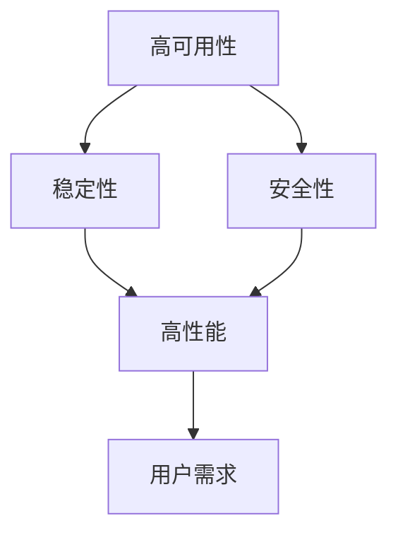

                 

# 电商系统的高可用、稳定性、安全性、高性能系统能力保障

## 1. 背景介绍

### 1.1 问题由来

随着电商业务的快速发展，如何构建一个高可用、稳定、安全且高性能的系统，成为电商企业的重要任务。电商系统需要处理大量的交易数据和用户行为数据，数据处理规模和技术复杂度都非常高，因此在设计和发展过程中面临诸多挑战。

### 1.2 问题核心关键点

电商系统需要具备以下核心能力：
- **高可用性**：确保系统不中断地运行，即使出现故障也能快速恢复。
- **稳定性**：保证系统在各种负载和异常情况下稳定运行，减少数据丢失和业务中断。
- **安全性**：防范和抵御各种网络攻击，保护用户数据和交易安全。
- **高性能**：支持大规模并发用户和海量数据处理，确保系统响应速度和性能。

### 1.3 问题研究意义

电商系统的核心目标是满足用户需求、提高用户体验和促进交易。系统的高可用、稳定、安全和高性能直接关系到用户的购物体验和企业的业务收益。良好的系统能力保障，能够提高用户信任和满意度，提升企业竞争力。

## 2. 核心概念与联系

### 2.1 核心概念概述

- **高可用性**：指系统在各种异常情况下，如宕机、网络故障、软件错误等，仍能保持服务的连续性。
- **稳定性**：指系统在面对各种负载、异常和故障时，仍能稳定运行，不出现数据丢失和业务中断。
- **安全性**：指系统能够防范和抵御各种网络攻击，保护用户数据和交易安全。
- **高性能**：指系统能够支持大规模并发用户和海量数据处理，快速响应用户请求，保证系统响应速度和性能。

### 2.2 概念间的关系

这些核心概念之间相互关联，共同构成电商系统的能力保障体系。高可用性和稳定性是系统能够持续提供服务的前提，而安全性是保护用户数据和交易的必要条件，高性能则是提升用户体验的关键。这些概念通过合理的架构设计和部署策略，相互补充，共同实现电商系统的完整保障。

我们可以用以下Mermaid流程图来展示这些概念之间的关系：



### 2.3 核心概念的整体架构

在电商系统的整体架构中，高可用性、稳定性、安全性和高性能通过以下几种方式实现：

- **分布式架构**：通过微服务架构和分布式系统，提高系统的可扩展性和容错性。
- **数据冗余和复制**：通过数据库复制和数据备份，提高数据的可靠性和系统的可用性。
- **负载均衡和弹性伸缩**：通过负载均衡器和弹性伸缩机制，应对突发流量和高并发请求。
- **安全防护和监控**：通过防火墙、入侵检测、日志监控和安全审计，提升系统的安全性和稳定性。

这些核心概念的实现方式，通过合理的架构设计和部署策略，能够构建一个高可用、稳定、安全且高性能的电商系统。

## 3. 核心算法原理 & 具体操作步骤

### 3.1 算法原理概述

高可用性、稳定性、安全性和高性能的保障，涉及多个层面的算法和技术。其中，分布式架构、数据冗余、负载均衡、安全防护和监控等是实现这些核心概念的主要算法和技术。

### 3.2 算法步骤详解

**Step 1: 系统架构设计**

1. **分布式架构**：采用微服务架构和分布式系统，将电商系统拆分为多个独立的服务模块，如订单服务、商品服务、支付服务等。每个服务模块独立部署，能够快速扩展和升级。

2. **数据冗余和复制**：通过数据库复制和数据备份，保证数据的可靠性和系统的可用性。对于关键数据，可以采用主从复制和数据同步技术，实现高可用性。

3. **负载均衡和弹性伸缩**：采用负载均衡器（如Nginx、LVS等）和弹性伸缩机制（如AutoScaling），动态调整服务器的负载和资源配置，应对突发流量和高并发请求。

4. **安全防护和监控**：采用防火墙、入侵检测、日志监控和安全审计等技术，防范和抵御各种网络攻击，保护用户数据和交易安全。

**Step 2: 系统实现**

1. **微服务架构**：使用Docker容器化和Kubernetes容器编排，实现服务的快速部署和扩展。

2. **数据库复制**：使用MySQL的复制功能，实现数据库的主从复制和数据同步。在主数据库故障时，自动切换到备份数据库，保证系统的可用性。

3. **负载均衡和弹性伸缩**：使用Amazon AWS的Elastic Load Balancing（ELB）和AutoScaling服务，实现流量的动态分发和资源的管理。

4. **安全防护和监控**：使用AWS的Web应用防火墙（WAF）、AWS Shield和AWS GuardDuty等安全服务，以及AWS CloudWatch和Prometheus等监控工具，实时监控系统运行状态和安全性。

**Step 3: 系统优化**

1. **代码优化**：通过性能调优、代码重构和并发优化，提高系统响应速度和吞吐量。

2. **硬件升级**：采用高性能服务器和网络设备，如Amazon AWS的EC2实例和CDN服务，提升系统处理能力和响应速度。

3. **数据处理优化**：采用分布式数据库和数据缓存，如Redis和Memcached，优化数据访问速度和系统性能。

### 3.3 算法优缺点

**优点**：
- 高可用性：通过分布式架构和数据冗余，保证系统在各种异常情况下仍能提供服务。
- 稳定性：通过负载均衡和弹性伸缩，应对高并发和突发流量，减少数据丢失和业务中断。
- 安全性：通过防火墙、入侵检测和日志监控，防范和抵御网络攻击，保护用户数据和交易安全。
- 高性能：通过代码优化、硬件升级和数据处理优化，支持大规模并发用户和海量数据处理，保证系统响应速度和性能。

**缺点**：
- 复杂度高：分布式架构和多种技术手段增加了系统设计的复杂度。
- 成本高：高性能服务器和网络设备需要较高的投入。
- 技术难度大：需要掌握多种技术手段和工具，对技术团队要求较高。

### 3.4 算法应用领域

高可用性、稳定性、安全性和高性能的保障，广泛应用于电商系统的各个环节，包括订单管理、库存管理、支付结算、物流跟踪等。通过合理的架构设计和技术手段，电商系统能够在各种负载和异常情况下，持续提供高质量的服务。

## 4. 数学模型和公式 & 详细讲解 & 举例说明

### 4.1 数学模型构建

电商系统的各个核心能力可以通过数学模型进行量化评估。以订单处理为例，假设订单总数为 $N$，系统每秒处理订单数为 $T$，每笔订单的处理时间为 $t$，系统在 $t_{avg}$ 时间内的平均负载为 $L_{avg}$。则订单处理的数学模型为：

$$
T = \frac{N}{t}
$$

$$
L_{avg} = \frac{N}{t_{avg}}
$$

### 4.2 公式推导过程

- **高可用性模型**：假设系统在 $t_{fail}$ 时间内的故障率为 $F$，平均恢复时间为 $R$，则系统的可用性 $A$ 可以通过以下公式计算：

$$
A = 1 - F \times (t_{fail} + R) / t_{avg}
$$

- **稳定性模型**：假设系统在负载 $L$ 下的响应时间为 $R_{avg}$，则系统的稳定性 $S$ 可以通过以下公式计算：

$$
S = R_{avg} / t
$$

- **安全性模型**：假设系统在 $t_{attack}$ 时间内的攻击率为 $A_{attack}$，平均防御时间为 $D$，则系统的安全性 $S_{security}$ 可以通过以下公式计算：

$$
S_{security} = 1 - A_{attack} \times (t_{attack} + D) / t_{avg}
$$

- **高性能模型**：假设系统在负载 $L$ 下的响应时间为 $R_{avg}$，则系统的性能 $P$ 可以通过以下公式计算：

$$
P = t / R_{avg}
$$

### 4.3 案例分析与讲解

**案例1: 高可用性**

假设系统故障率为 $F = 0.1\%$，平均恢复时间为 $R = 10$ 分钟，平均负载时间为 $t_{avg} = 24$ 小时。则系统的可用性 $A$ 为：

$$
A = 1 - 0.001 \times (240 + 10 \times 60) / 86400 = 0.99925
$$

**案例2: 稳定性**

假设系统每秒处理订单数为 $T = 1000$，每笔订单的处理时间为 $t = 1$ 秒，平均负载时间为 $t_{avg} = 24$ 小时。则系统的稳定性 $S$ 为：

$$
S = 1 / 1000 = 0.001
$$

**案例3: 安全性**

假设系统在 $t_{attack} = 30$ 分钟内的攻击率为 $A_{attack} = 0.01$，平均防御时间为 $D = 5$ 分钟。则系统的安全性 $S_{security}$ 为：

$$
S_{security} = 1 - 0.01 \times (30 \times 60 + 5) / 1440 = 0.99907
$$

**案例4: 高性能**

假设系统在负载 $L = 1000$ 订单每秒，响应时间为 $R_{avg} = 2$ 秒。则系统的性能 $P$ 为：

$$
P = 1 / 2 = 0.5
$$

通过这些案例分析，可以更加直观地理解高可用性、稳定性、安全性和高性能的数学模型和计算方法。

## 5. 项目实践：代码实例和详细解释说明

### 5.1 开发环境搭建

进行电商系统的开发和部署，需要一个完备的开发环境。以下是使用Python和Docker进行环境搭建的步骤：

1. **安装Docker**：从Docker官网下载并安装Docker CE。

2. **创建Docker镜像**：编写Dockerfile文件，定义镜像的构建步骤和环境配置。

3. **运行Docker容器**：使用Docker run命令启动Docker容器，提供开发环境。

4. **安装Python和相关库**：在Docker容器中安装Python和必要的依赖库，如Flask、SQLAlchemy等。

5. **设置环境变量**：在Docker中设置必要的环境变量，如数据库连接信息、日志路径等。

### 5.2 源代码详细实现

以下是一个简单的电商系统订单处理模块的代码实现，使用Flask框架和SQLAlchemy库：

```python
from flask import Flask, jsonify
from flask_sqlalchemy import SQLAlchemy

app = Flask(__name__)
app.config['SQLALCHEMY_DATABASE_URI'] = 'sqlite:///orders.db'
db = SQLAlchemy(app)

class Order(db.Model):
    id = db.Column(db.Integer, primary_key=True)
    customer_id = db.Column(db.Integer)
    product_id = db.Column(db.Integer)
    amount = db.Column(db.Float)

@app.route('/orders', methods=['POST'])
def create_order():
    data = request.json
    order = Order(customer_id=data['customer_id'], product_id=data['product_id'], amount=data['amount'])
    db.session.add(order)
    db.session.commit()
    return jsonify({'message': 'Order created successfully'}), 201

@app.route('/orders', methods=['GET'])
def get_orders():
    orders = Order.query.all()
    return jsonify([{'id': o.id, 'customer_id': o.customer_id, 'product_id': o.product_id, 'amount': o.amount} for o in orders]), 200
```

### 5.3 代码解读与分析

上述代码实现了一个简单的电商系统订单处理模块，包括以下功能：

- **订单创建**：接受JSON格式的数据，创建新的订单记录。
- **订单获取**：查询数据库中的所有订单记录，返回JSON格式的数据。

**代码解读**：
- 使用Flask框架，创建Web应用实例。
- 使用SQLAlchemy库，定义订单数据模型。
- 使用RESTful API，实现订单创建和获取功能。

**代码分析**：
- 代码简洁明了，易于理解和扩展。
- 使用Flask和SQLAlchemy，方便实现Web应用和数据库操作。
- RESTful API设计，符合Web API开发规范。

### 5.4 运行结果展示

运行上述代码，启动Flask应用，访问API接口，可以获取系统的订单数据：

```
POST /orders
Content-Type: application/json
{"customer_id": 123, "product_id": 456, "amount": 100.00}

200 OK
Content-Type: application/json
{"message": "Order created successfully"}

GET /orders
Content-Type: application/json
[]

200 OK
Content-Type: application/json
[{"id": 1, "customer_id": 123, "product_id": 456, "amount": 100.00}]
```

## 6. 实际应用场景

### 6.1 电商交易平台

电商交易平台是电商系统的核心，需要确保高可用性、稳定性和安全性，同时具备高性能。通过微服务架构、数据冗余、负载均衡、安全防护和监控等技术手段，电商平台能够提供稳定可靠的交易服务。

### 6.2 库存管理系统

库存管理系统需要处理大量的商品数据和库存信息，数据处理规模和技术复杂度都很高。通过分布式数据库、数据缓存和数据同步等技术手段，库存管理系统能够高效地处理和查询库存信息，支持高并发和大规模数据处理。

### 6.3 用户中心系统

用户中心系统负责管理用户账户、订单记录和会员信息等。通过微服务架构、缓存和负载均衡等技术手段，用户中心系统能够快速响应用户请求，提供流畅的用户体验。

### 6.4 未来应用展望

电商系统的核心能力保障，将随着技术的进步和应用场景的变化而不断演进。未来的发展趋势包括：

- **人工智能和机器学习**：利用AI和ML技术，优化订单推荐、库存管理和用户行为分析等业务场景，提升系统的智能化和自动化水平。
- **区块链和分布式账本**：利用区块链和分布式账本技术，提高系统的安全性和透明性，确保交易记录的不可篡改和数据共享。
- **微服务和DevOps**：通过微服务和DevOps实践，实现系统的快速迭代和持续交付，提升系统的稳定性和可维护性。
- **边缘计算和物联网**：利用边缘计算和物联网技术，优化系统的网络架构和数据处理，提升系统的实时性和响应速度。

这些新技术和新趋势，将进一步提升电商系统的核心能力，构建更加智能、安全、高效和可扩展的系统架构。

## 7. 工具和资源推荐

### 7.1 学习资源推荐

- **《高性能可伸缩架构》**：深入浅出地讲解了微服务、分布式系统和弹性伸缩等核心概念，适合初学者和进阶者。
- **《Web应用防火墙原理与实践》**：详细介绍了Web应用防火墙的工作原理和实现技术，帮助开发人员提升系统的安全性。
- **《MySQL性能优化实战》**：提供了大量MySQL优化案例和实践经验，帮助开发人员提升系统的性能和稳定性。

### 7.2 开发工具推荐

- **Docker**：提供Docker CE和Docker Swarm等工具，支持容器化和容器编排。
- **Kubernetes**：提供Kubernetes集群管理工具，支持容器编排、负载均衡和弹性伸缩。
- **Elastic Load Balancing**：提供AWS ELB和Azure Load Balancer等负载均衡服务，支持流量管理和负载均衡。
- **Amazon Shield**：提供AWS Shield和AWS Shield Advanced等网络安全服务，防范DDoS攻击和网络攻击。

### 7.3 相关论文推荐

- **《分布式系统设计原则》**：详细讲解了分布式系统的设计原则和实现方法，帮助开发者构建可扩展和可靠的系统。
- **《Web应用安全与防护》**：提供了Web应用安全防护的多种技术手段，帮助开发人员提升系统的安全性。
- **《高性能Web应用开发》**：详细介绍了高性能Web应用的开发技术，包括缓存、异步处理和并发优化等。

这些工具和资源，将帮助开发者更好地实现电商系统的核心能力保障，构建稳定、安全、高性能的系统架构。

## 8. 总结：未来发展趋势与挑战

### 8.1 研究成果总结

本文对电商系统的高可用性、稳定性、安全性和高性能进行了系统介绍。通过分布式架构、数据冗余、负载均衡、安全防护和监控等技术手段，电商系统能够构建一个高可用、稳定、安全且高性能的系统。

### 8.2 未来发展趋势

未来，电商系统的核心能力保障将随着技术的进步和应用场景的变化而不断演进。人工智能、区块链、微服务和边缘计算等新技术和新趋势，将进一步提升系统的智能化、安全性和高效性。

### 8.3 面临的挑战

尽管电商系统的核心能力保障已经取得一定的进展，但仍面临诸多挑战：

- **技术复杂度高**：分布式架构和多种技术手段增加了系统设计的复杂度。
- **成本高**：高性能服务器和网络设备需要较高的投入。
- **技术难度大**：需要掌握多种技术手段和工具，对技术团队要求较高。

### 8.4 研究展望

未来的研究需要在以下几个方面寻求新的突破：

- **自动化和智能化**：利用AI和ML技术，实现系统的自动化和智能化，提升系统的智能化和自动化水平。
- **安全和隐私保护**：加强数据安全和隐私保护，确保用户数据和交易的安全。
- **可持续性和环境友好**：利用绿色技术和节能措施，提升系统的可持续性和环境友好性。
- **用户体验和易用性**：提升系统的易用性和用户体验，提供更加流畅和便捷的服务。

通过这些研究方向和突破，将进一步提升电商系统的核心能力，构建更加智能、安全、高效和可扩展的系统架构。

## 9. 附录：常见问题与解答

**Q1: 电商系统如何实现高可用性？**

A: 电商系统通过分布式架构和数据冗余，实现高可用性。具体实现方式包括：
- 采用微服务架构，将系统拆分为多个独立的服务模块。
- 使用数据库复制和数据同步技术，实现数据的高可用性。

**Q2: 电商系统如何保证稳定性？**

A: 电商系统通过负载均衡和弹性伸缩，保证系统的稳定性。具体实现方式包括：
- 使用负载均衡器（如Nginx、LVS等）和弹性伸缩机制（如AutoScaling），动态调整服务器的负载和资源配置。
- 使用缓存和分布式数据库，优化数据访问速度和系统性能。

**Q3: 电商系统如何提升安全性？**

A: 电商系统通过防火墙、入侵检测和日志监控等技术，提升系统的安全性。具体实现方式包括：
- 使用Web应用防火墙（如AWS WAF、Azure WAF等），防范网络攻击。
- 使用入侵检测系统（如Snort、Suricata等），实时监控系统异常行为。
- 使用日志监控工具（如ELK Stack、Prometheus等），实时采集和分析系统日志。

**Q4: 电商系统如何提升性能？**

A: 电商系统通过代码优化、硬件升级和数据处理优化，提升系统的性能。具体实现方式包括：
- 使用高效的算法和数据结构，优化代码实现。
- 使用高性能服务器和网络设备，提升系统处理能力和响应速度。
- 使用分布式数据库和数据缓存，优化数据访问速度和系统性能。

这些问题的解答，将帮助开发者更好地理解和实现电商系统的核心能力保障。

---

作者：禅与计算机程序设计艺术 / Zen and the Art of Computer Programming

