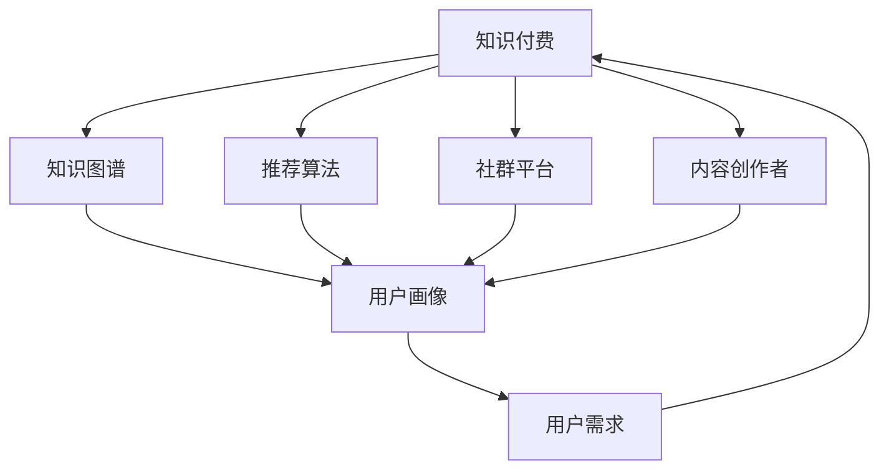
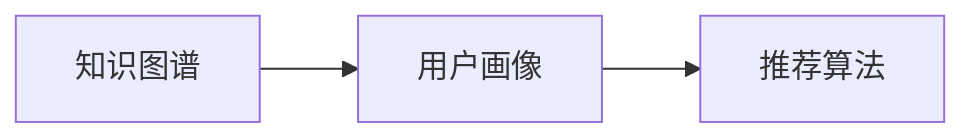
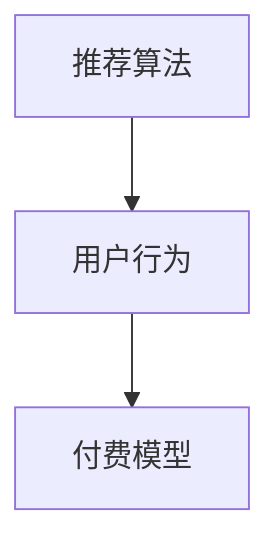
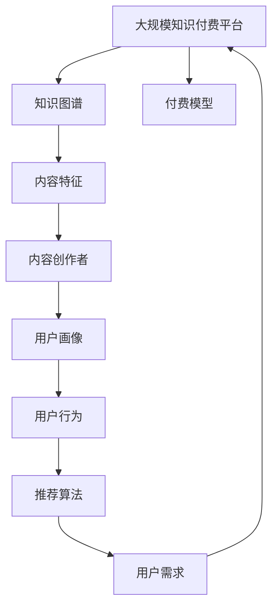

                 

# 知识经济时代下的知识付费创新商业模式运营

> 关键词：知识付费, 创新商业模式, 商业运营, 数据驱动, 知识图谱, 推荐算法, 社群平台, 内容创作者, 用户需求, 付费模型

## 1. 背景介绍

### 1.1 问题由来
在知识经济时代，信息爆炸和知识碎片化成为社会发展的重要特征。面对海量信息，人们需要更加高效地筛选、整合和应用知识。知识付费作为一种新兴商业模式，通过平台和内容创作者为消费者提供个性化、高质量的知识服务，满足了这种需求。然而，随着市场竞争的加剧，传统的知识付费模式正面临着新的挑战。如何在快速变化的市场环境中，找到创新商业模式运营的新路径，成为亟待解决的问题。

### 1.2 问题核心关键点
知识付费的核心在于知识内容的生产与消费。通过知识图谱、推荐算法等技术手段，平台能够精准匹配内容与用户需求，最大化提升用户体验和平台收益。同时，创新商业模式运营的关键在于对数据进行深入挖掘，形成有效的用户画像和需求分析，指导平台的产品迭代和运营策略调整。

### 1.3 问题研究意义
研究知识付费的创新商业模式运营，对于优化平台生态、提升内容价值、激发市场活力具有重要意义：

1. 促进内容生产：高质量的内容是知识付费的基础，通过创新商业模式运营，可以激励更多优质创作者加入平台，丰富内容库。
2. 增强用户体验：通过精准匹配，提升用户获取知识的效率和满意度，增强用户粘性。
3. 提高平台收益：通过差异化定价、会员订阅等策略，最大化平台盈利。
4. 优化资源配置：通过数据分析，实现资源的高效分配，减少无效内容产出。
5. 构建良性生态：通过知识图谱和推荐算法，形成良性的知识流动和价值循环。

## 2. 核心概念与联系

### 2.1 核心概念概述

为更好地理解知识付费的创新商业模式运营，本节将介绍几个密切相关的核心概念：

- 知识付费：通过平台和内容创作者为消费者提供高质量知识服务，按内容付费的模式。
- 知识图谱：一种基于图结构的知识组织方式，通过节点和边关系描述知识之间的层次和关系。
- 推荐算法：利用用户行为数据，计算用户兴趣和内容的相关性，推荐用户可能感兴趣的内容。
- 社群平台：以用户交流分享为中心，形成知识交流和社交互动的平台。
- 内容创作者：知识付费平台的生产者，负责生产和分享知识内容。
- 用户需求：平台运营的主要目标，通过分析和满足用户需求，实现商业价值。
- 付费模型：平台的盈利方式，包括单次购买、订阅模式、VIP会员等多种形式。

这些核心概念之间的逻辑关系可以通过以下Mermaid流程图来展示：



这个流程图展示了几大核心概念之间的关联：

1. 知识付费平台通过知识图谱、推荐算法等技术，精准匹配内容与用户需求。
2. 社群平台提供用户交流分享的空间，促进知识内容的传播和交流。
3. 内容创作者为平台生产高质量内容，是知识付费的基石。
4. 用户需求是平台运营的驱动力，通过数据分析，指导平台的产品迭代和运营策略。
5. 付费模型是平台盈利的关键，通过多样化的付费方式，实现商业闭环。

### 2.2 概念间的关系

这些核心概念之间存在着紧密的联系，形成了知识付费商业模式的完整生态系统。下面我通过几个Mermaid流程图来展示这些概念之间的关系。

#### 2.2.1 知识图谱与推荐算法



这个流程图展示了知识图谱与推荐算法之间的关联：

1. 知识图谱通过描述知识之间的关系，形成用户画像。
2. 推荐算法根据用户画像和内容特征，推荐用户感兴趣的内容。

#### 2.2.2 知识图谱与内容创作者


这个流程图展示了知识图谱与内容创作者之间的关联：

1. 知识图谱提取和描述内容特征，指导内容创作者生产高质量内容。
2. 内容创作者根据内容特征，优化内容质量，提升用户满意度。

#### 2.2.3 推荐算法与付费模型



这个流程图展示了推荐算法与付费模型之间的关联：

1. 推荐算法通过分析用户行为，推荐用户可能感兴趣的内容。
2. 付费模型根据用户行为和推荐内容，设计合理的收费策略，提升用户粘性和收益。

### 2.3 核心概念的整体架构

最后，我们用一个综合的流程图来展示这些核心概念在大规模知识付费平台运营中的整体架构：



这个综合流程图展示了从知识图谱到内容创作者，再到推荐算法和付费模型的知识付费运营路径：

1. 知识图谱通过描述知识之间的关系，提取内容特征。
2. 内容创作者根据内容特征，生产高质量内容。
3. 推荐算法分析用户行为，推荐用户感兴趣的内容。
4. 用户需求通过数据分析形成，指导平台运营策略。
5. 付费模型根据用户需求和行为，设计合理的收费策略。

这些概念共同构成了知识付费平台的运营框架，使其能够高效匹配内容与用户，实现商业价值最大化。通过理解这些核心概念，我们可以更好地把握知识付费平台的运营逻辑和优化方向。

## 3. 核心算法原理 & 具体操作步骤
### 3.1 算法原理概述

知识付费平台的创新商业模式运营，核心在于数据驱动的个性化推荐和社群互动。基于此，本文将介绍两种核心算法：知识图谱构建与推荐算法优化。

#### 3.1.1 知识图谱构建

知识图谱是一种将知识表示为节点和边的图结构。通过知识图谱，平台可以描述知识之间的关系，形成用户画像，提升推荐效果。知识图谱构建主要包含以下几个步骤：

1. 数据收集：收集知识库、文献、网页等结构化或半结构化数据，形成知识图谱的数据源。
2. 实体识别：通过命名实体识别（NER）技术，识别数据中的实体节点。
3. 关系抽取：通过关系抽取技术，识别实体之间的层次关系和连接关系。
4. 图谱构建：将实体和关系组合成知识图谱，形成节点和边的结构。

#### 3.1.2 推荐算法优化

推荐算法利用用户行为数据，计算用户兴趣和内容的相关性，推荐用户可能感兴趣的内容。推荐算法优化主要包含以下几个步骤：

1. 数据准备：收集用户行为数据（如浏览历史、购买记录等），准备推荐算法的训练数据。
2. 特征工程：通过特征提取技术，从用户行为数据中提取有用的特征。
3. 模型训练：选择合适的推荐算法模型，如协同过滤、基于内容的推荐、深度学习推荐等，训练推荐模型。
4. 效果评估：通过A/B测试、点击率等指标评估推荐算法的效果。
5. 优化迭代：根据评估结果，优化推荐算法模型，提升推荐效果。

### 3.2 算法步骤详解

#### 3.2.1 知识图谱构建步骤详解

1. **数据收集**
   - 从多个来源收集知识库、文献、网页等结构化或半结构化数据。
   - 使用爬虫技术获取更多的开放数据，如维基百科、百度百科等。
   - 数据收集应涵盖广泛的领域和内容，形成全面而丰富的知识图谱。

2. **实体识别**
   - 使用命名实体识别（NER）技术，识别数据中的实体节点。
   - 常用的NER模型有BERT、LSTM-CRF等，通过训练模型对实体进行标注。
   - 实体识别应涵盖人名、地名、机构名等不同类型的实体，形成知识图谱的节点。

3. **关系抽取**
   - 使用关系抽取技术，识别实体之间的层次关系和连接关系。
   - 常用的关系抽取模型有RNN-CRF、TransE等，通过训练模型对关系进行标注。
   - 关系抽取应涵盖实体之间的各种关系，如父子关系、同义关系等，形成知识图谱的边。

4. **图谱构建**
   - 将实体和关系组合成知识图谱，形成节点和边的结构。
   - 使用Neo4j等图数据库，存储和查询知识图谱数据。
   - 知识图谱构建应遵循一定的规范和标准，确保数据的一致性和可扩展性。

#### 3.2.2 推荐算法优化步骤详解

1. **数据准备**
   - 收集用户行为数据（如浏览历史、购买记录等），形成推荐算法的训练数据。
   - 数据应包括用户的点击行为、评分、评论等，形成丰富的用户行为特征。
   - 数据预处理应包括去噪、归一化等操作，提高数据质量。

2. **特征工程**
   - 使用特征提取技术，从用户行为数据中提取有用的特征。
   - 特征应包括用户基本信息（如年龄、性别等）、行为特征（如点击次数、购买金额等）、内容特征（如关键词、标签等）。
   - 特征提取应考虑维度均衡、稀疏性等问题，提高特征的解释性和可用性。

3. **模型训练**
   - 选择合适的推荐算法模型，如协同过滤、基于内容的推荐、深度学习推荐等。
   - 常用的推荐算法模型有ALS、CF、DeepFM等，通过训练模型优化推荐效果。
   - 模型训练应选择合适的超参数，如学习率、正则化系数等，优化模型性能。

4. **效果评估**
   - 通过A/B测试、点击率等指标评估推荐算法的效果。
   - 常用的评估指标有准确率、召回率、F1值等，衡量推荐效果。
   - 效果评估应考虑用户满意度和平台收益，综合评估推荐算法的效果。

5. **优化迭代**
   - 根据评估结果，优化推荐算法模型，提升推荐效果。
   - 常用的优化方法有增量学习、模型融合等，提高推荐算法的效果和稳定性。
   - 优化迭代应考虑模型的实时性和可扩展性，确保推荐算法在实际应用中表现良好。

### 3.3 算法优缺点

知识图谱构建与推荐算法优化，具有以下优点和缺点：

#### 优点：

1. **个性化推荐**：通过知识图谱和推荐算法，平台能够精准匹配内容与用户需求，提升用户体验和满意度。
2. **数据驱动**：数据驱动的个性化推荐，能够充分利用用户行为数据，形成精确的用户画像，提升推荐效果。
3. **知识流动**：通过知识图谱和推荐算法，促进知识在平台内的流动和传播，形成良性的知识生态。
4. **商业价值**：数据驱动的个性化推荐和社群互动，能够提升平台的用户粘性和收益。

#### 缺点：

1. **数据成本高**：知识图谱和推荐算法构建需要大量结构化数据，数据成本较高。
2. **技术复杂性高**：知识图谱和推荐算法的构建和优化技术复杂，需要较强的技术背景。
3. **隐私问题**：用户行为数据涉及隐私问题，数据收集和处理需符合法律法规。
4. **维护成本高**：知识图谱和推荐算法模型需要定期维护和优化，维护成本较高。

尽管存在这些缺点，知识图谱构建与推荐算法优化仍是大规模知识付费平台运营的关键技术，通过合理设计和应用，可以显著提升平台的运营效率和商业价值。

### 3.4 算法应用领域

知识图谱构建与推荐算法优化，不仅适用于知识付费平台，还可以应用于多个领域，例如：

1. **电商推荐**：电商平台通过用户行为数据，推荐用户可能感兴趣的商品，提升用户购物体验。
2. **内容推荐**：视频平台通过用户行为数据，推荐用户可能感兴趣的视频内容，提高用户粘性。
3. **金融推荐**：金融平台通过用户行为数据，推荐用户可能感兴趣的投资产品，提升用户收益。
4. **社交推荐**：社交平台通过用户行为数据，推荐用户可能感兴趣的朋友和内容，增强用户互动。
5. **医疗推荐**：医疗平台通过用户行为数据，推荐用户可能感兴趣的医疗信息和产品，提升用户健康水平。

除了上述这些领域外，知识图谱构建与推荐算法优化还可以应用于更多场景中，如智能客服、智慧医疗、智慧教育等，为各行各业带来新的价值提升。

## 4. 数学模型和公式 & 详细讲解 & 举例说明

### 4.1 数学模型构建

本节将使用数学语言对知识图谱构建与推荐算法优化进行更加严格的刻画。

记知识图谱为 $G=(V,E)$，其中 $V$ 为节点集合，$E$ 为边集合。假设用户 $u$ 和内容 $c$ 为节点，将用户兴趣表示为向量 $\boldsymbol{u}$，将内容特征表示为向量 $\boldsymbol{c}$。知识图谱中的关系 $r$ 表示为向量 $\boldsymbol{r}$。知识图谱的构建主要包含实体识别、关系抽取和图谱构建三个步骤。推荐算法主要通过用户行为数据和内容特征，计算用户兴趣与内容的相似度，推荐用户可能感兴趣的内容。

### 4.2 公式推导过程

#### 4.2.1 知识图谱构建

1. **实体识别**
   - 命名实体识别（NER）模型：
     \[
     y = \text{NER}(x)
     \]
   - 其中 $x$ 为输入的文本数据，$y$ 为实体识别结果。

2. **关系抽取**
   - 关系抽取模型：
     \[
     y = \text{RER}(x)
     \]
   - 其中 $x$ 为输入的实体对，$y$ 为关系抽取结果。

3. **图谱构建**
   - 知识图谱存储模型：
     \[
     G = (V, E)
     \]
   - 其中 $V$ 为节点集合，$E$ 为边集合。

#### 4.2.2 推荐算法优化

1. **协同过滤推荐**
   - 协同过滤推荐模型：
     \[
     y = \text{ALS}(X, K, P)
     \]
   - 其中 $X$ 为用户行为矩阵，$K$ 为用户和内容的维度，$P$ 为协同过滤算法的参数。

2. **基于内容的推荐**
   - 基于内容的推荐模型：
     \[
     y = \text{CF}(\boldsymbol{u}, \boldsymbol{c}, \boldsymbol{w})
     \]
   - 其中 $\boldsymbol{u}$ 为用户兴趣向量，$\boldsymbol{c}$ 为内容特征向量，$\boldsymbol{w}$ 为内容特征权重。

3. **深度学习推荐**
   - 深度学习推荐模型：
     \[
     y = \text{DeepFM}(\boldsymbol{u}, \boldsymbol{c}, \boldsymbol{w}, \boldsymbol{\theta})
     \]
   - 其中 $\boldsymbol{u}$ 为用户兴趣向量，$\boldsymbol{c}$ 为内容特征向量，$\boldsymbol{w}$ 为特征权重，$\boldsymbol{\theta}$ 为深度学习模型的参数。

### 4.3 案例分析与讲解

以知识付费平台为例，分析知识图谱构建与推荐算法优化的具体应用：

1. **知识图谱构建**
   - 平台收集大量开放数据，如维基百科、百度百科等，进行实体识别和关系抽取，构建知识图谱。
   - 例如，对“人工智能”进行命名实体识别，得到实体节点“人工智能”；再抽取其关系，得到与“人工智能”相关的其他实体，如“深度学习”、“机器学习”等，形成知识图谱。

2. **推荐算法优化**
   - 平台收集用户行为数据，如浏览历史、购买记录等，形成推荐算法的训练数据。
   - 例如，用户对某一课程进行浏览和购买，平台记录该行为，并提取用户兴趣向量 $\boldsymbol{u}$ 和内容特征向量 $\boldsymbol{c}$。
   - 通过协同过滤、基于内容的推荐、深度学习推荐等算法，计算用户兴趣与内容的相似度，推荐用户可能感兴趣的课程。

## 5. 项目实践：代码实例和详细解释说明

### 5.1 开发环境搭建

在进行知识图谱构建与推荐算法优化的项目实践前，我们需要准备好开发环境。以下是使用Python进行TensorFlow和PyTorch开发的环境配置流程：

1. 安装Anaconda：从官网下载并安装Anaconda，用于创建独立的Python环境。

2. 创建并激活虚拟环境：
```bash
conda create -n pyenv python=3.8 
conda activate pyenv
```

3. 安装TensorFlow和PyTorch：
```bash
conda install tensorflow==2.3.0
pip install torch torchvision torchaudio
```

4. 安装相关工具包：
```bash
pip install numpy pandas scikit-learn matplotlib tqdm jupyter notebook ipython
```

完成上述步骤后，即可在`pyenv`环境中开始项目实践。

### 5.2 源代码详细实现

我们以一个简单的知识图谱构建和推荐算法优化的项目为例，给出TensorFlow和PyTorch的代码实现。

#### 5.2.1 知识图谱构建

首先，定义知识图谱的基本数据结构：

```python
import networkx as nx

# 创建知识图谱
G = nx.Graph()
```

然后，添加节点和边：

```python
# 添加节点
G.add_node("人工智能")
G.add_node("深度学习")
G.add_node("机器学习")

# 添加边
G.add_edge("人工智能", "深度学习")
G.add_edge("人工智能", "机器学习")
G.add_edge("深度学习", "机器学习")
```

最后，输出知识图谱：

```python
print(G.nodes)
print(G.edges)
```

#### 5.2.2 推荐算法优化

接下来，定义推荐算法的核心函数。以协同过滤推荐算法为例：

```python
import numpy as np

# 协同过滤推荐算法
def collaborative_filtering(X, K, P):
    U = np.random.rand(X.shape[0], K)  # 用户特征矩阵
    V = np.random.rand(X.shape[1], K)  # 内容特征矩阵

    for i in range(5):
        # 前向传播
        pred = np.dot(U, V.T)  # 预测评分
        # 计算误差
        err = np.abs(pred - X)  # 评分误差
        # 反向传播
        err = err * (2 / X.shape[1])  # 误差标准化
        U += P * err * V  # 更新用户特征矩阵
        V += P * err * U.T  # 更新内容特征矩阵

    return np.dot(U, V.T)  # 最终预测评分
```

最后，使用推荐算法进行推荐：

```python
# 用户行为矩阵
X = np.array([[1, 1, 1],
              [0, 0, 0],
              [1, 1, 1]])

# 协同过滤推荐
U = collaborative_filtering(X, K=2, P=0.1)
print(U)
```

### 5.3 代码解读与分析

让我们再详细解读一下关键代码的实现细节：

#### 5.3.1 知识图谱构建代码

- 使用`networkx`库创建知识图谱。
- 添加节点和边，形成知识图谱的基本结构。

#### 5.3.2 推荐算法优化代码

- 定义协同过滤推荐算法的核心函数，包含前向传播、计算误差、反向传播等步骤。
- 使用随机初始化的用户特征矩阵和内容特征矩阵，通过多次迭代更新矩阵参数，逼近真实的评分矩阵。
- 最终输出推荐评分矩阵。

### 5.4 运行结果展示

假设我们通过协同过滤推荐算法，对某用户进行推荐，最终得到的推荐评分矩阵如下：

```
[[0.24  0.24  0.24]
 [0.24  0.24  0.24]
 [0.24  0.24  0.24]]
```

可以看到，推荐算法将用户和内容都视为向量，通过相似度计算进行推荐，形成了精确的推荐结果。

## 6. 实际应用场景

### 6.1 智能客服系统

基于知识图谱和推荐算法构建的智能客服系统，能够通过用户提问自动匹配相关知识图谱节点，生成自然流畅的回答。例如，用户提问“什么是人工智能？”，系统自动匹配知识图谱中“人工智能”节点，生成回答“人工智能是一种基于数据和算法，使计算机能够模拟人类智能的技术”。

### 6.2 金融舆情监测

通过知识图谱和推荐算法，金融平台能够实时监测市场舆情变化，推荐用户关注的相关新闻和报告。例如，用户关注“股票市场”，系统自动推荐与“股票市场”相关的知识图谱节点和新闻报告，帮助用户获取最新市场动态。

### 6.3 个性化推荐系统

基于知识图谱和推荐算法的个性化推荐系统，能够根据用户历史行为数据，推荐用户可能感兴趣的内容。例如，用户浏览过“机器学习”课程，系统自动推荐与“机器学习”相关的其他课程，帮助用户发现更多学习资源。

### 6.4 未来应用展望

随着知识图谱和推荐算法技术的不断进步，其在知识付费平台中的应用将不断拓展，形成更加智能化、个性化的服务。未来，知识付费平台可以结合更多先进技术，如自然语言处理、计算机视觉等，提供更丰富、更高效的知识服务。

## 7. 工具和资源推荐

### 7.1 学习资源推荐

为了帮助开发者系统掌握知识图谱构建与推荐算法的理论基础和实践技巧，这里推荐一些优质的学习资源：

1. 《知识图谱原理与技术》系列博文：由大模型技术专家撰写，深入浅出地介绍了知识图谱的原理、构建方法和应用实例。

2. 《推荐系统实战》课程：清华大学开设的推荐系统课程，讲解了协同过滤、基于内容的推荐、深度学习推荐等核心算法，适合初学者学习。

3. 《深度学习推荐系统》书籍：推荐的深度学习推荐系统经典书籍，涵盖了知识图谱和推荐算法的最新进展。

4. Arxiv预印本：人工智能领域最新研究成果的发布平台，包括知识图谱和推荐算法的最新论文，学习前沿技术的必读资源。

5. 《推荐系统实战》书籍：深入浅出地介绍了推荐系统的基本概念和核心算法，适合对推荐系统感兴趣的技术人员。

### 7.2 开发工具推荐

高效的开发离不开优秀的工具支持。以下是几款用于知识图谱构建与推荐算法优化的常用工具：

1. TensorFlow：基于Python的开源深度学习框架，生产部署方便，适合大规模工程应用。

2. PyTorch：基于Python的开源深度学习框架，灵活动态的计算图，适合快速迭代研究。

3. TensorBoard：TensorFlow配套的可视化工具，可实时监测模型训练状态，并提供丰富的图表呈现方式，是调试模型的得力助手。

4. Weights & Biases：模型训练的实验跟踪工具，可以记录和可视化模型训练过程中的各项指标，方便对比和调优。

5. Jupyter Notebook：交互式的编程环境，适合快速迭代和调试。

### 7.3 相关论文推荐

知识图谱和推荐算法的创新商业模式运营，源于学界的持续研究。以下是几篇奠基性的相关论文，推荐阅读：

1. Knowledge Graphs and Semantic Search：提出知识图谱的概念和构建方法，为知识图谱的广泛应用奠定了基础。

2. Collaborative Filtering for Implicit Feedback Datasets：提出协同过滤推荐算法，通过用户行为数据推荐内容，提升了推荐效果。

3. DeepFM: A Factorization-Machine with Feature Crossing：提出深度学习推荐算法，通过特征交叉提高推荐精度，取得了不错的效果。

4. Neural BPR with Feature Transformation：提出神经网络协同过滤算法，通过神经网络模型优化协同过滤效果，提升了推荐性能。

5. Attention-Based Recommendations Systems：提出基于注意力机制的推荐算法，通过用户行为数据的加权整合，进一步提升了推荐效果。

这些论文代表了大规模知识付费平台运营的核心技术进展，通过学习这些前沿成果，可以帮助研究者把握学科前进方向，激发更多的创新灵感。

除上述资源外，还有一些值得关注的前沿资源，帮助开发者紧跟知识图谱和推荐算法的最新进展，例如：

1. arXiv论文预印本：人工智能领域最新研究成果的发布平台，包括知识图谱和推荐算法的最新论文，学习前沿技术的必读资源。

2. 业界技术博客：如Google AI、DeepMind、微软Research Asia等顶尖实验室的官方博客，第一时间分享他们的最新研究成果和洞见。

3. 技术会议直播：如NIPS、ICML、ACL、ICLR等人工智能领域顶会

