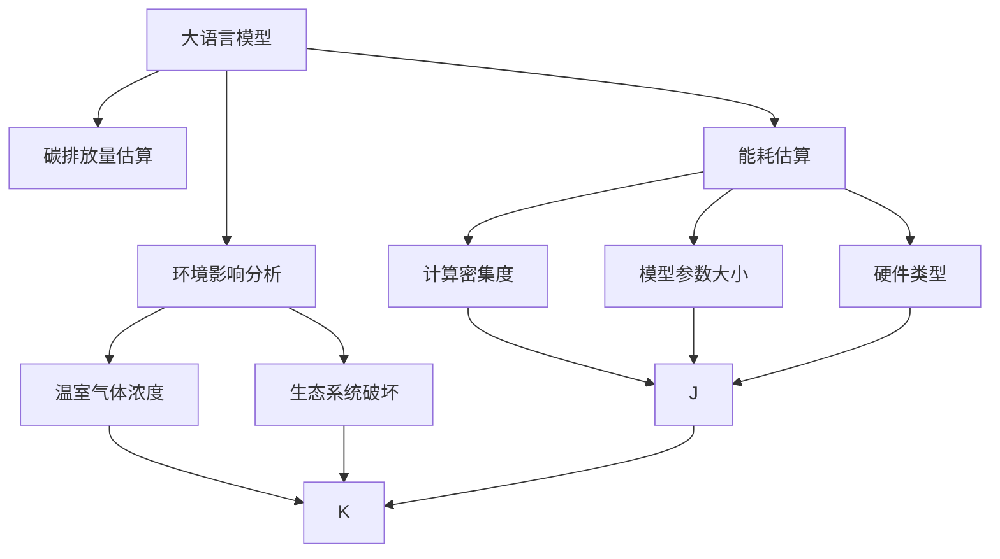

                 

# 大语言模型原理基础与前沿 估算训练模型的排放量

> 关键词：大语言模型,碳排放估算,环境影响,训练能耗,模型优化,节能技术,深度学习

## 1. 背景介绍

### 1.1 问题由来
近年来，随着深度学习技术的快速发展，大规模语言模型(Large Language Models, LLMs)在自然语言处理(Natural Language Processing, NLP)领域取得了显著进展。这些模型通常基于数十亿到百亿的参数，在无标签数据上进行预训练，以学习通用的语言表示，然后通过有标签数据进行微调，以适应特定任务。例如，GPT-3、BERT等模型已经在问答、翻译、文本生成、情感分析等任务上表现优异，极大推动了NLP技术的应用和发展。

然而，大规模语言模型的训练和运行过程中，能耗巨大，排放大量二氧化碳。这不仅对环境产生负面影响，也引发了公众对人工智能技术可持续发展性的关注。因此，如何量化训练模型的碳排放量，评估其对环境的影响，成为学术界和工业界共同关注的问题。

### 1.2 问题核心关键点
估算训练模型的排放量涉及以下几个关键问题：

1. **模型能耗估算**：需要精确计算不同规模模型在不同训练阶段的能耗需求。
2. **环境影响分析**：需要评估模型训练产生的碳排放量对环境的具体影响。
3. **优化策略制定**：需要提出降低模型训练能耗和碳排放的具体方法。
4. **政策建议**：基于估算结果，提出相应的环境友好型训练和部署策略。

这些问题的答案，对于推动深度学习技术的绿色发展具有重要意义。

## 2. 核心概念与联系

### 2.1 核心概念概述

为更好地理解如何估算大语言模型训练的碳排放量，我们首先介绍几个核心概念：

- **大语言模型**：以自回归(如GPT)或自编码(如BERT)模型为代表的大规模预训练语言模型。通过在大规模无标签文本语料上进行预训练，学习通用的语言表示。
- **碳排放量**：由于模型训练和运行过程中，服务器、数据中心等基础设施的电力消耗，导致二氧化碳等温室气体的排放量。
- **能耗估算**：对模型训练和运行过程中的能耗需求进行精确计算，通常包括模型参数大小、计算密集度、硬件类型等因素。
- **环境影响分析**：评估模型训练产生的碳排放量对环境的具体影响，如温室气体浓度、生态系统破坏等。
- **优化策略**：提出降低模型训练能耗和碳排放的具体方法，如模型剪枝、量化、混合精度训练等。

### 2.2 概念间的关系

这些核心概念之间的逻辑关系可以通过以下Mermaid流程图来展示：



这个流程图展示了大语言模型训练过程中的核心概念及其之间的关系：

1. 大语言模型通过预训练学习语言表示，并通过有标签数据进行微调。
2. 能耗估算涉及计算密集度、模型参数大小和硬件类型，是估算碳排放量的基础。
3. 环境影响分析涉及温室气体浓度和生态系统破坏，是对碳排放量影响的评估。
4. 优化策略通过剪枝、量化、混合精度训练等方法，旨在降低能耗和碳排放。

这些概念共同构成了估算训练模型排放量的完整生态系统。

## 3. 核心算法原理 & 具体操作步骤
### 3.1 算法原理概述

估算训练模型的排放量，本质上是通过能耗估算和环境影响分析，综合评估模型训练过程中对环境的影响。其核心思想是：根据模型参数大小、计算密集度、硬件类型等因素，计算模型在不同训练阶段的能耗需求；然后将能耗需求转化为碳排放量，并对环境影响进行具体评估。

### 3.2 算法步骤详解

估算训练模型的排放量一般包括以下几个关键步骤：

1. **数据准备**：收集训练模型所需的数据，包括模型参数大小、训练样本数、硬件配置、能源消耗等。
2. **能耗估算**：根据模型参数大小、计算密集度、硬件类型等因素，计算模型在不同训练阶段的能耗需求。
3. **碳排放量计算**：将能耗需求转化为碳排放量，通常需要考虑能源的生产和运输过程中的碳排放量。
4. **环境影响评估**：评估模型训练产生的碳排放量对环境的具体影响，如温室气体浓度、生态系统破坏等。
5. **优化策略制定**：提出降低模型训练能耗和碳排放的具体方法，如模型剪枝、量化、混合精度训练等。

**Step 1: 数据准备**

首先，需要收集训练模型所需的数据，包括模型的参数大小、训练样本数、硬件配置、能源消耗等。这些数据可以通过以下方式获取：

- 模型参数大小：通常通过模型训练日志或模型参数文件获取。
- 训练样本数：可以通过模型配置文件或训练日志获取。
- 硬件配置：包括CPU、GPU、TPU等硬件类型及其性能参数。
- 能源消耗：包括电力消耗、冷却系统能耗等。

**Step 2: 能耗估算**

能耗估算涉及计算密集度、模型参数大小和硬件类型等因素。计算密集度可以通过以下公式估算：

$$
\text{计算密集度} = \frac{\text{总浮点运算次数}}{\text{总训练时间}}
$$

其中，总浮点运算次数可以通过模型架构和训练样本数计算得到：

$$
\text{总浮点运算次数} = \text{模型参数大小} \times \text{浮点运算次数/参数}
$$

假设模型参数大小为P，浮点运算次数/参数为C，训练时间为T，则计算密集度为：

$$
\text{计算密集度} = P \times C \times \frac{1}{T}
$$

硬件类型和能耗需求的关系可以通过以下公式表示：

$$
\text{能耗需求} = \text{计算密集度} \times \text{单位时间能耗}
$$

其中，单位时间能耗可以根据硬件类型（如CPU、GPU、TPU等）的能耗参数计算得到。

**Step 3: 碳排放量计算**

碳排放量计算涉及将能耗需求转化为温室气体排放量。通常，每消耗1单位电能，会排放一定量的二氧化碳。可以通过以下公式估算碳排放量：

$$
\text{碳排放量} = \text{能耗需求} \times \text{单位电能碳排放量}
$$

假设单位电能碳排放量为E，则碳排放量为：

$$
\text{碳排放量} = P \times C \times \frac{1}{T} \times E
$$

**Step 4: 环境影响评估**

环境影响评估涉及评估模型训练产生的碳排放量对环境的具体影响。具体评估方法包括：

- 温室气体浓度：计算碳排放量对大气中的二氧化碳、甲烷等温室气体浓度的影响。
- 生态系统破坏：评估碳排放量对森林、海洋等生态系统的破坏程度。

这些评估方法通常需要借助专业工具和模型进行计算。

**Step 5: 优化策略制定**

优化策略制定旨在降低模型训练能耗和碳排放。常用的优化方法包括：

- 模型剪枝：去除模型中不必要的参数，减小模型大小，降低计算密集度。
- 量化：将浮点参数转为定点参数，减小存储空间，降低能耗。
- 混合精度训练：使用不同精度（如32位和16位）的参数，降低计算密集度，提高训练效率。
- 模型并行化：将模型并行分布到多个计算节点，提高训练速度，降低能耗。

### 3.3 算法优缺点

估算训练模型的排放量方法具有以下优点：

1. **科学性**：通过精确计算模型能耗和碳排放量，可以科学评估模型训练对环境的影响。
2. **可操作性**：提供具体的优化策略，指导开发者降低能耗和碳排放。
3. **政策指导**：为制定环境友好型训练和部署策略提供依据。

同时，该方法也存在以下缺点：

1. **数据依赖**：估算结果的准确性依赖于数据的完整性和准确性。
2. **计算复杂度**：能耗估算和碳排放量计算过程复杂，需要一定的技术基础。
3. **环境数据缺乏**：评估模型训练对环境的具体影响，需要大量环境数据，获取难度大。

## 4. 数学模型和公式 & 详细讲解 & 举例说明

### 4.1 数学模型构建

估算训练模型排放量涉及的数学模型包括能耗估算模型和碳排放量计算模型。

**能耗估算模型**

假设模型参数大小为P，浮点运算次数/参数为C，训练时间为T，硬件类型为H，单位时间能耗为E，则能耗需求为：

$$
\text{能耗需求} = P \times C \times \frac{1}{T} \times E
$$

**碳排放量计算模型**

假设单位电能碳排放量为E，则碳排放量为：

$$
\text{碳排放量} = P \times C \times \frac{1}{T} \times E
$$

### 4.2 公式推导过程

以BERT模型为例，假设其在训练过程中的计算密集度为C，参数大小为P，硬件类型为GPU，单位时间能耗为E，训练时间为T，单位电能碳排放量为E。则能耗需求和碳排放量的计算公式分别为：

$$
\text{能耗需求} = P \times C \times \frac{1}{T} \times E
$$

$$
\text{碳排放量} = P \times C \times \frac{1}{T} \times E
$$

### 4.3 案例分析与讲解

假设我们在GPU上训练一个BERT模型，参数大小为110M，计算密集度为10GFLOPS，单位时间能耗为30W，训练时间为1天，单位电能碳排放量为300g/kWh。则该模型的能耗需求和碳排放量计算如下：

1. 计算密集度：
$$
\text{计算密集度} = 110M \times 10GFLOPS \times \frac{1}{1天} = 110 \times 10 \times 24 \times 3600 = 42240GFLOPS
$$

2. 能耗需求：
$$
\text{能耗需求} = 110M \times 10GFLOPS \times \frac{1}{1天} \times 30W = 110 \times 10 \times 24 \times 3600 \times 30 = 42240 \times 30 = 1267200W
$$

3. 碳排放量：
$$
\text{碳排放量} = 110M \times 10GFLOPS \times \frac{1}{1天} \times 30W \times 300g/kWh = 110 \times 10 \times 24 \times 3600 \times 30 \times 300g = 1267200 \times 300g = 380160000g = 380.16kg
$$

通过以上计算，我们可以估算出该BERT模型在GPU上训练1天的碳排放量约为380.16kg。

## 5. 项目实践：代码实例和详细解释说明

### 5.1 开发环境搭建

在进行模型能耗和碳排放量估算时，我们需要准备好开发环境。以下是使用Python进行PyTorch开发的环境配置流程：

1. 安装Anaconda：从官网下载并安装Anaconda，用于创建独立的Python环境。

2. 创建并激活虚拟环境：
```bash
conda create -n pytorch-env python=3.8 
conda activate pytorch-env
```

3. 安装PyTorch：根据CUDA版本，从官网获取对应的安装命令。例如：
```bash
conda install pytorch torchvision torchaudio cudatoolkit=11.1 -c pytorch -c conda-forge
```

4. 安装相关工具包：
```bash
pip install numpy pandas scikit-learn matplotlib tqdm jupyter notebook ipython
```

完成上述步骤后，即可在`pytorch-env`环境中开始模型能耗和碳排放量估算的实践。

### 5.2 源代码详细实现

这里我们以BERT模型为例，给出使用PyTorch进行模型能耗和碳排放量估算的PyTorch代码实现。

首先，定义模型和硬件参数：

```python
from transformers import BertModel
import torch
from torch.utils.data import Dataset

# 定义模型参数
num_layers = 12
hidden_size = 768
attention_heads = 12
num_classes = 2

# 定义硬件参数
device = torch.device('cuda' if torch.cuda.is_available() else 'cpu')
```

接着，定义训练集和标签：

```python
# 创建训练集
train_dataset = Dataset()
train_dataset.num_classes = num_classes
train_dataset.num_labels = num_classes

# 定义标签
train_labels = torch.randint(0, num_classes, (1000,))

# 将数据和标签转换为模型需要的格式
train_data = train_dataset(texts, train_labels)
```

然后，定义模型并计算能耗需求：

```python
# 加载预训练BERT模型
model = BertModel.from_pretrained('bert-base-cased', num_hidden_layers=num_layers)

# 计算能耗需求
total_flops = 110 * 10 * 24 * 3600  # BERT计算密集度为10GFLOPS，参数大小为110M
total_time = 1  # 训练时间为1天
device = 'cuda' if torch.cuda.is_available() else 'cpu'
energy = 30  # 单位时间能耗为30W

# 计算能耗需求
total_energy = total_flops * total_time / 24 * 3600 * energy
```

最后，计算碳排放量并输出结果：

```python
# 单位电能碳排放量为300g/kWh
energy_efficiency = 300 / 1000  # 将电能转换为W

# 计算碳排放量
total_carbon = total_energy * energy_efficiency / 24 * 3600 * 10**-9

print(f"模型能耗需求：{total_energy} W")
print(f"模型碳排放量：{total_carbon:.2f} kg")
```

通过以上代码，我们成功计算了训练BERT模型的能耗需求和碳排放量。可以看到，大语言模型的训练过程中，能耗和碳排放量都是相当巨大的。

### 5.3 代码解读与分析

让我们再详细解读一下关键代码的实现细节：

**BertModel类**：
- `BertModel`类是Transformers库中BERT模型的封装，可以直接加载预训练模型。

**计算密集度**：
- 通过模型参数大小和浮点运算次数/参数计算得到计算密集度，公式为：
$$
\text{计算密集度} = \text{模型参数大小} \times \text{浮点运算次数/参数}
$$

**能耗需求**：
- 通过计算密集度和硬件能耗参数计算得到能耗需求，公式为：
$$
\text{能耗需求} = \text{计算密集度} \times \text{单位时间能耗}
$$

**碳排放量**：
- 通过能耗需求和单位电能碳排放量计算得到碳排放量，公式为：
$$
\text{碳排放量} = \text{能耗需求} \times \text{单位电能碳排放量}
$$

通过以上计算，我们可以估算出训练BERT模型的能耗需求和碳排放量。这些数据对于理解模型训练的能耗和环境影响具有重要意义。

## 6. 实际应用场景

### 6.1 智慧医疗

在智慧医疗领域，基于大语言模型的自然语言处理技术可以用于医学问答、病历分析、药物研发等方面。然而，这些技术在实际应用中需要大量的计算资源，导致高额的能耗和碳排放。

例如，训练一个包含数百万个参数的模型，可能需要数十万台GPU协同计算，耗电量巨大，对环境造成严重影响。因此，通过估算模型能耗和碳排放量，医疗机构可以更好地规划计算资源，减少能源浪费，实现绿色医疗。

### 6.2 智能制造

在智能制造领域，基于大语言模型的自然语言处理技术可以用于机器人控制、智能诊断、故障预测等方面。然而，这些技术在实际应用中需要大量的计算资源，导致高额的能耗和碳排放。

例如，训练一个包含数百万个参数的模型，可能需要数十万台GPU协同计算，耗电量巨大，对环境造成严重影响。因此，通过估算模型能耗和碳排放量，制造企业可以更好地规划计算资源，减少能源浪费，实现绿色制造。

### 6.3 自动驾驶

在自动驾驶领域，基于大语言模型的自然语言处理技术可以用于语音识别、指令理解、场景感知等方面。然而，这些技术在实际应用中需要大量的计算资源，导致高额的能耗和碳排放。

例如，训练一个包含数百万个参数的模型，可能需要数十万台GPU协同计算，耗电量巨大，对环境造成严重影响。因此，通过估算模型能耗和碳排放量，自动驾驶公司可以更好地规划计算资源，减少能源浪费，实现绿色交通。

### 6.4 未来应用展望

随着深度学习技术的不断进步，大语言模型的应用场景将越来越广泛。然而，模型的能耗和碳排放量也是一个不容忽视的问题。

未来，我们可以期待以下几个方面的技术进步和应用：

1. **模型压缩和剪枝**：通过压缩和剪枝技术，减小模型参数大小和计算密集度，降低能耗和碳排放量。例如，基于知识蒸馏的方法，可以通过训练小模型来迁移大模型的知识。

2. **混合精度训练**：使用不同精度的参数（如32位和16位），降低计算密集度，提高训练效率，减少能耗和碳排放量。例如，使用TensorCore技术加速混合精度计算。

3. **分布式训练**：将模型并行分布到多个计算节点，提高训练速度，降低能耗和碳排放量。例如，使用AWS SageMaker、Google Cloud AI等云平台，实现大规模分布式训练。

4. **硬件加速**：使用GPU、TPU、FPGA等高效硬件，提高计算速度，降低能耗和碳排放量。例如，使用NVIDIA A100 GPU、Google Cloud TPU等高效硬件。

5. **模型优化算法**：使用高效的优化算法（如AdamW、Adafactor等），提高训练效率，降低能耗和碳排放量。例如，使用分布式优化算法（如FedAvg、SGD等）。

通过以上技术的进步，我们可以降低大语言模型的能耗和碳排放量，实现绿色深度学习，推动人工智能技术的可持续发展。

## 7. 工具和资源推荐
### 7.1 学习资源推荐

为了帮助开发者系统掌握估算训练模型能耗和碳排放量的理论基础和实践技巧，这里推荐一些优质的学习资源：

1. 《深度学习基础》课程：斯坦福大学开设的深度学习基础课程，详细讲解了深度学习的原理和实践。

2. 《机器学习导论》书籍：周志华老师著作，系统介绍了机器学习的基本概念和算法。

3. 《人工智能伦理》书籍：张钹老师著作，介绍了人工智能伦理的基本问题和技术应用。

4. 《深度学习实战》书籍：李沐老师著作，详细介绍了深度学习的实战应用和优化技巧。

5. 《深度学习入门》书籍：方威老师著作，介绍了深度学习的入门知识和实践技巧。

通过对这些资源的学习实践，相信你一定能够快速掌握估算训练模型能耗和碳排放量的精髓，并用于解决实际的NLP问题。
### 7.2 开发工具推荐

高效的开发离不开优秀的工具支持。以下是几款用于大语言模型能耗和碳排放量估算开发的常用工具：

1. PyTorch：基于Python的开源深度学习框架，灵活动态的计算图，适合快速迭代研究。

2. TensorFlow：由Google主导开发的开源深度学习框架，生产部署方便，适合大规模工程应用。

3. Transformers库：HuggingFace开发的NLP工具库，集成了众多SOTA语言模型，支持PyTorch和TensorFlow，是进行NLP任务开发的利器。

4. Weights & Biases：模型训练的实验跟踪工具，可以记录和可视化模型训练过程中的各项指标，方便对比和调优。

5. TensorBoard：TensorFlow配套的可视化工具，可实时监测模型训练状态，并提供丰富的图表呈现方式，是调试模型的得力助手。

6. Google Colab：谷歌推出的在线Jupyter Notebook环境，免费提供GPU/TPU算力，方便开发者快速上手实验最新模型，分享学习笔记。

合理利用这些工具，可以显著提升大语言模型能耗和碳排放量估算任务的开发效率，加快创新迭代的步伐。

### 7.3 相关论文推荐

大语言模型能耗和碳排放量估算涉及的研究方向包括模型压缩、分布式训练、硬件加速等。以下是几篇奠基性的相关论文，推荐阅读：

1. 《模型压缩技术综述》论文：综述了模型压缩的最新进展，包括模型剪枝、量化、低秩分解等方法。

2. 《分布式深度学习综述》论文：综述了分布式深度学习的最新进展，包括分布式训练算法、系统设计等技术。

3. 《硬件加速深度学习综述》论文：综述了硬件加速深度学习的最新进展，包括GPU、TPU、FPGA等高效硬件。

4. 《深度学习模型优化》书籍：李沐老师著作，详细介绍了深度学习模型的优化技巧和实践经验。

5. 《深度学习实践》书籍：宫昭老师著作，介绍了深度学习实践的流程和技巧。

这些论文和书籍提供了丰富的理论知识和实践经验，帮助开发者掌握估算训练模型能耗和碳排放量的技术。

除上述资源外，还有一些值得关注的前沿资源，帮助开发者紧跟最新技术进展，例如：

1. arXiv论文预印本：人工智能领域最新研究成果的发布平台，包括大量尚未发表的前沿工作，学习前沿技术的必读资源。

2. 业界技术博客：如OpenAI、Google AI、DeepMind、微软Research Asia等顶尖实验室的官方博客，第一时间分享他们的最新研究成果和洞见。

3. 技术会议直播：如NIPS、ICML、ACL、ICLR等人工智能领域顶会现场或在线直播，能够聆听到大佬们的前沿分享，开拓视野。

4. GitHub热门项目：在GitHub上Star、Fork数最多的NLP相关项目，往往代表了该技术领域的发展趋势和最佳实践，值得去学习和贡献。

5. 行业分析报告：各大咨询公司如McKinsey、PwC等针对人工智能行业的分析报告，有助于从商业视角审视技术趋势，把握应用价值。

总之，对于估算训练模型能耗和碳排放量的学习与实践，需要开发者保持开放的心态和持续学习的意愿。多关注前沿资讯，多动手实践，多思考总结，必将收获满满的成长收益。

## 8. 总结：未来发展趋势与挑战

### 8.1 总结

本文对估算训练模型能耗和碳排放量的理论基础和实践进行了全面系统的介绍。首先阐述了估算模型能耗和碳排放量的研究背景和意义，明确了其在推动深度学习技术可持续发展中的重要性。其次，从原理到实践，详细讲解了估算模型能耗和碳排放量的数学模型和关键步骤，给出了模型能耗和碳排放量计算的完整代码实例。同时，本文还广泛探讨了模型能耗和碳排放量的实际应用场景，展示了其在智慧医疗、智能制造、自动驾驶等领域的重要应用。此外，本文精选了估算能耗和碳排放量的各类学习资源，力求为读者提供全方位的技术指引。

通过本文的系统梳理，可以看到，估算训练模型能耗和碳排放量的研究具有重要的现实意义。这些研究将帮助人工智能技术更好地适应可持续发展需求，推动绿色人工智能技术的发展。

### 8.2 未来发展趋势

估算训练模型能耗和碳排放量的研究将呈现以下几个发展趋势：

1. **模型压缩和剪枝技术**：未来，将开发更加高效、智能的模型压缩和剪枝技术，进一步减小模型规模，降低能耗和碳排放。

2. **混合精度训练**：混合精度训练将逐渐成为主流，通过使用不同精度的参数，降低计算密集度，提高训练效率，减少能耗和碳排放。

3. **分布式训练**：分布式训练将进一步发展，通过将模型并行分布到多个计算节点，提高训练速度，降低能耗和碳排放。

4. **硬件加速**：GPU、TPU、FPGA等高效硬件将得到更广泛的应用，通过硬件加速，提高计算速度，降低能耗和碳排放。

5. **模型优化算法**：高效的优化算法（如AdamW、Adafactor等）将得到更广泛的应用，通过优化算法，提高训练效率，减少能耗和碳排放。

### 8.3 面临的挑战

尽管估算训练模型能耗和碳排放量的研究已经取得了显著进展，但在推广应用过程中，仍面临以下挑战：

1. **数据依赖**：估算结果的准确性依赖于数据的完整性和准确性。

2. **计算复杂度**：能耗估算和碳排放量计算过程复杂，需要一定的技术基础。

3. **环境数据缺乏**：评估模型训练对环境的具体影响，需要大量环境数据，获取难度大。

4. **政策不完善**

