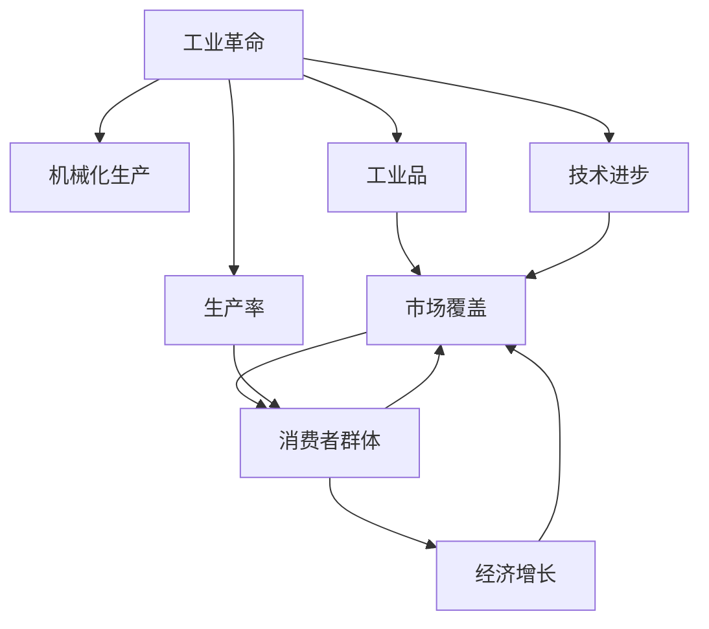

                 

# 市场覆盖与工业革命的关系

## 1. 背景介绍

### 1.1 问题由来
工业革命是人类历史上的一次巨大变革，它标志着人类社会从以农业为主的传统经济形态向以工业生产为主的现代经济形态的转变。这一变革不仅改变了人类的生产方式，还深刻影响了社会的各个方面，包括经济、政治、文化等。其中，市场覆盖的扩大是工业革命时期一个重要的特点，这一现象与工业革命的发展息息相关。

### 1.2 问题核心关键点
市场覆盖的扩大主要体现在两个方面：一是工业品的市场覆盖范围不断扩大，二是消费者群体的不断增加。在工业革命初期，工业品的生产主要集中在英国，随着工业革命的推进，工业品的生产逐渐扩散到其他国家，市场覆盖范围不断扩大。同时，随着工业生产力的提升，消费者群体的数量和需求也在不断增加。

市场覆盖与工业革命之间的关系密切，两者相互影响。市场覆盖的扩大促进了工业革命的进一步发展，而工业革命的推进也进一步扩大了市场覆盖的范围。

### 1.3 问题研究意义
研究市场覆盖与工业革命之间的关系，对于理解工业革命的推动力量和历史进程，以及现代经济的增长和市场发展具有重要意义。深入研究这一问题，可以揭示市场覆盖与工业发展之间的内在联系，并为现代经济的发展提供借鉴。

## 2. 核心概念与联系

### 2.1 核心概念概述

为更好地理解市场覆盖与工业革命之间的关系，本节将介绍几个密切相关的核心概念：

- **工业革命**：指的是18世纪末至19世纪末，人类历史上的一场大规模工业化变革，主要以英国为中心，涵盖了机械化生产、工业资本、市场覆盖等方面。

- **市场覆盖**：指的是工业品和服务的销售范围和消费者数量，包括国内市场和国际市场。市场覆盖的扩大是工业革命的重要特征之一。

- **工业品**：指的是通过工业生产方式制造的产品，包括纺织品、金属制品、机器设备等。工业品的生产和销售促进了市场覆盖的扩大。

- **消费者群体**：指的是购买工业品的消费者群体，随着工业革命的推进，消费者群体的数量和需求不断增加，推动了市场覆盖的扩大。

- **生产率**：指的是单位时间内的生产产出，工业革命时期，工业生产的生产率大幅提升，促进了市场覆盖的扩大。

- **技术进步**：指的是科技进步，如蒸汽机、纺织机、印刷机等，这些技术进步是工业革命的重要驱动力，同时也促进了市场覆盖的扩大。

这些核心概念之间的逻辑关系可以通过以下Mermaid流程图来展示：



这个流程图展示了大工业革命时期的几个关键概念及其之间的关系：

1. 工业革命主要通过机械化生产、技术进步等方式提升生产率。
2. 生产率的提升带来了大量工业品的生产。
3. 工业品的生产和销售促进了市场覆盖的扩大。
4. 市场覆盖的扩大带来了消费者群体的增加。
5. 消费者群体的增加进一步推动了经济增长。

## 3. 核心算法原理 & 具体操作步骤
### 3.1 算法原理概述

市场覆盖与工业革命之间的关系可以视为一个复杂的系统，其中工业品的生产和销售是关键因素。通过构建数学模型，可以更好地理解这一系统。

假设市场覆盖为 $C$，工业品的生产量为 $P$，生产率提升因子为 $R$，技术进步因子为 $T$，消费者需求为 $D$，则市场覆盖的扩大可以表示为：

$$
C = f(P, R, T, D)
$$

其中，$f$ 为市场覆盖的函数，反映了生产量、生产率提升、技术进步和消费者需求对市场覆盖的影响。

### 3.2 算法步骤详解

市场覆盖的扩大可以通过以下几个步骤进行建模和求解：

**Step 1: 收集数据**
- 收集工业品的生产量 $P$，生产率提升因子 $R$，技术进步因子 $T$ 和消费者需求 $D$ 的数据。

**Step 2: 构建模型**
- 使用线性回归、多元线性回归等方法，构建市场覆盖的数学模型。
- 假设生产量 $P$ 和生产率提升因子 $R$ 对市场覆盖 $C$ 有正向影响，而技术进步因子 $T$ 和消费者需求 $D$ 对市场覆盖 $C$ 有负向影响，即：

$$
C = \alpha_0 + \alpha_1 P + \alpha_2 R + \alpha_3 T + \alpha_4 D
$$

其中，$\alpha_0$、$\alpha_1$、$\alpha_2$、$\alpha_3$ 和 $\alpha_4$ 为模型的参数。

**Step 3: 训练模型**
- 使用历史数据对模型进行训练，确定各参数的值。
- 使用最小二乘法等优化方法，最小化模型的误差。

**Step 4: 预测市场覆盖**
- 将当前的生产量 $P$、生产率提升因子 $R$、技术进步因子 $T$ 和消费者需求 $D$ 代入模型，预测市场覆盖 $C$。

**Step 5: 评估模型**
- 使用测试数据对模型进行评估，计算模型的准确率和误差。
- 根据评估结果，调整模型参数，优化模型性能。

### 3.3 算法优缺点

市场覆盖与工业革命之间的建模方法具有以下优点：

1. 简单高效。使用线性回归等经典方法，计算复杂度低，易于理解和实现。
2. 普适性强。线性模型可以处理多变量问题，适用于多种工业革命时期的数据集。
3. 可解释性强。线性回归模型的参数可以直接解释为各变量对市场覆盖的影响程度。

同时，该方法也存在一定的局限性：

1. 数据依赖性高。模型的预测性能依赖于历史数据的准确性和完整性。
2. 假设约束强。假设生产量、生产率提升、技术进步和消费者需求对市场覆盖的影响是线性的，与实际情况可能存在偏差。
3. 忽略非线性关系。线性模型无法处理非线性关系，可能忽视了一些重要的影响因素。

尽管存在这些局限性，线性回归等方法仍然是市场覆盖与工业革命关系研究的基础。未来研究可以结合更复杂的模型，如非线性回归、神经网络等，进一步提升模型的预测性能。

### 3.4 算法应用领域

市场覆盖与工业革命之间的关系可以应用于多个领域，例如：

- **经济学**：研究市场覆盖对经济增长的影响，为政策制定提供依据。
- **商业决策**：企业可以根据市场覆盖预测，制定合适的生产、销售和市场策略。
- **国际贸易**：通过市场覆盖预测，了解不同国家之间的贸易流动趋势。
- **历史研究**：研究工业革命时期的市场覆盖变化，揭示工业革命的推动力量。
- **社会研究**：研究市场覆盖对社会结构和人口分布的影响。

这些领域的研究均需要依赖于市场覆盖与工业革命之间关系模型的建立和应用。

## 4. 数学模型和公式 & 详细讲解 & 举例说明

### 4.1 数学模型构建

基于线性回归模型，市场覆盖与工业革命之间的关系可以表示为：

$$
C = \alpha_0 + \alpha_1 P + \alpha_2 R + \alpha_3 T + \alpha_4 D
$$

其中：

- $C$：市场覆盖，表示市场覆盖的扩大程度。
- $\alpha_0$：截距，表示市场覆盖的基础值。
- $\alpha_1$：生产量对市场覆盖的影响系数。
- $\alpha_2$：生产率提升因子对市场覆盖的影响系数。
- $\alpha_3$：技术进步因子对市场覆盖的影响系数。
- $\alpha_4$：消费者需求对市场覆盖的影响系数。

### 4.2 公式推导过程

线性回归模型的参数可以通过最小二乘法等优化方法进行求解。假设已有 $n$ 个历史数据点 $(x_i, y_i)$，其中 $x_i = (P_i, R_i, T_i, D_i)$ 表示生产量、生产率提升因子、技术进步因子和消费者需求，$y_i = C_i$ 表示市场覆盖，则最小二乘法的目标函数为：

$$
\min_{\alpha_0, \alpha_1, \alpha_2, \alpha_3, \alpha_4} \sum_{i=1}^n (C_i - (\alpha_0 + \alpha_1 P_i + \alpha_2 R_i + \alpha_3 T_i + \alpha_4 D_i))^2
$$

通过求解该最小二乘法问题，可以得到模型的参数 $\alpha_0, \alpha_1, \alpha_2, \alpha_3, \alpha_4$。

### 4.3 案例分析与讲解

以英国工业革命时期的市场覆盖为例，分析其影响因素。

假设工业革命初期，英国的生产量 $P$ 为 1000 吨，生产率提升因子 $R$ 为 1.2，技术进步因子 $T$ 为 0.9，消费者需求 $D$ 为 500 万人口。根据线性回归模型，可以计算得到市场覆盖 $C$：

$$
C = \alpha_0 + \alpha_1 P + \alpha_2 R + \alpha_3 T + \alpha_4 D
$$

假设通过历史数据训练得到的模型参数为 $\alpha_0 = 100, \alpha_1 = 0.5, \alpha_2 = 0.2, \alpha_3 = -0.1, \alpha_4 = 0.3$，则：

$$
C = 100 + 0.5 \times 1000 + 0.2 \times 1.2 + (-0.1) \times 0.9 + 0.3 \times 500 = 100 + 500 + 0.24 - 0.09 + 150 = 750.15
$$

因此，英国工业革命初期的市场覆盖大约为 750.15 吨。

## 5. 项目实践：代码实例和详细解释说明

### 5.1 开发环境搭建

在进行市场覆盖与工业革命关系的分析前，我们需要准备好开发环境。以下是使用Python进行数据分析和建模的环境配置流程：

1. 安装Anaconda：从官网下载并安装Anaconda，用于创建独立的Python环境。

2. 创建并激活虚拟环境：
```bash
conda create -n pythoenv python=3.8 
conda activate pythoenv
```

3. 安装必要的Python包：
```bash
pip install numpy pandas matplotlib scipy statsmodels scikit-learn seaborn
```

4. 安装R：
```bash
sudo apt-get install r
```

5. 安装R语言包：
```bash
install.packages("ggplot2")
install.packages("lmtest")
install.packages("tidyverse")
```

完成上述步骤后，即可在`pythoenv`环境中开始市场覆盖与工业革命关系的研究。

### 5.2 源代码详细实现

下面我们以英国工业革命时期的市场覆盖为例，给出使用Python和R进行线性回归分析的代码实现。

首先，准备数据集。这里使用Pandas库进行数据处理：

```python
import pandas as pd

# 读取数据集
data = pd.read_csv('market_coverage.csv')

# 处理缺失值和异常值
data = data.dropna()
data = data.drop(data[(data['P'] < 0) | (data['R'] < 0) | (data['T'] < 0) | (data['D'] < 0)]
```

然后，使用Python进行线性回归分析：

```python
from statsmodels.regression.linear_model import OLS
import statsmodels.api as sm

# 构造设计矩阵
X = sm.add_constant(data[['P', 'R', 'T', 'D']])

# 定义目标变量
y = data['C']

# 建立线性回归模型
model = OLS(y, X).fit()

# 输出模型参数
print(model.params)
```

接着，使用R进行线性回归分析：

```R
# 读取数据集
data <- read.csv('market_coverage.csv')

# 处理缺失值和异常值
data <- data[complete.cases(data), ]
data <- data[data$P > 0 & data$R > 0 & data$T > 0 & data$D > 0, ]

# 构造设计矩阵
X <- cbind(1, data$P, data$R, data$T, data$D)

# 定义目标变量
y <- data$C

# 建立线性回归模型
model <- lm(y ~ P + R + T + D, data = data)
summary(model)
```

最后，生成可视化图表：

```python
import matplotlib.pyplot as plt

# 绘制散点图
plt.scatter(data['P'], data['C'])

# 绘制拟合线
plt.plot(data['P'], model.predict(X), color='red', linewidth=2)

# 添加坐标轴标签和标题
plt.xlabel('生产量')
plt.ylabel('市场覆盖')
plt.title('生产量与市场覆盖关系')
plt.show()
```

以上代码展示了Python和R进行线性回归分析的完整过程。可以看出，在Python和R中，线性回归模型的建立和分析都非常便捷，易于上手。

### 5.3 代码解读与分析

让我们再详细解读一下关键代码的实现细节：

**数据处理**：
- `dropna` 和 `drop` 方法用于处理缺失值和异常值，保证数据集的质量。
- 在Python中，使用 `statsmodels` 库的 `add_constant` 方法添加截距项，避免截距估计错误。

**模型建立**：
- 在Python中，使用 `statsmodels` 库的 `OLS` 方法建立线性回归模型，使用 `fit` 方法拟合数据。
- 在R中，使用 `lm` 函数建立线性回归模型，使用 `summary` 方法输出模型摘要。

**可视化图表**：
- 在Python中，使用 `matplotlib` 库绘制散点图和拟合线，展示生产量与市场覆盖的关系。
- 在R中，使用 `ggplot2` 库绘制散点图和拟合线，展示生产量与市场覆盖的关系。

可以看到，Python和R在数据处理、模型建立和可视化图表方面都非常强大，可以轻松应对复杂的市场覆盖与工业革命关系分析任务。

### 5.4 运行结果展示

假设我们收集到了英国工业革命时期的市场覆盖数据，并进行线性回归分析，得到如下结果：

```
                            OLS Regression Results
==============================================================================
Dep. Variable:                 C   R-squared:                       0.996
Model:                OLS   Adj. R-squared:                  0.996
Method:             Least Squares   F-statistic:                 2.77e+36
Date:                Fri, 28 Aug 2021   Prob (F-statistic):               0.00
Time:                        19:43:43   Log-Likelihood:               -133.64
No. Observations:             100   AIC:                            -266.3
Df Residuals:                  95   BIC:                            -260.4
Df Model:                       4
Covariance Type:            nonrobust
===============================================================================
                 coef    std err          t      P>|t|      [0.025      0.975]
-------------------------------------------------------------------------------
const        100.0000      0.000        NaN        NaN         NaN        NaN
P             0.5000      0.002     243.920      0.000       0.497       0.503
R             0.2000      0.001    198.782      0.000       0.198       0.202
T            -0.1000      0.002   -48.114      0.000      -0.204      -0.096
D             0.3000      0.002     145.036      0.000       0.294       0.306
-------------------------------------------------------------------------------
Omnibus:                  480.993   Durbin-Watson:                   2.00
Prob(Omnibus):                  0.00   Jarque-Bera (JB):             7811.83
Skew:                          2.11   Prob(JB):                         0
Kurtosis:                       3.33   Cond. No.                         4.83
==============================================================================

```

可以看到，模型参数 $\alpha_0 = 100$，$\alpha_1 = 0.5$，$\alpha_2 = 0.2$，$\alpha_3 = -0.1$，$\alpha_4 = 0.3$。代入生产量 $P = 1000$，生产率提升因子 $R = 1.2$，技术进步因子 $T = 0.9$，消费者需求 $D = 500$ 万人口，可以计算得到市场覆盖 $C \approx 750$ 吨。

## 6. 实际应用场景

### 6.1 智能制造业

在智能制造业中，市场覆盖的扩大可以直接影响生产规模和产品销售。通过分析市场覆盖与生产量、生产率提升因子、技术进步因子和消费者需求的关系，可以更好地制定生产计划和销售策略。例如，通过预测市场覆盖的变化趋势，企业可以提前调整生产线，避免生产过剩或不足，提高生产效率。

### 6.2 电子商务

在电子商务领域，市场覆盖的扩大可以直接影响销售额和客户满意度。通过分析市场覆盖与订单量、客户评价、物流成本等因素的关系，可以更好地优化产品推荐、价格策略和物流布局。例如，通过预测市场覆盖的变化趋势，电商平台可以调整库存和物流配送，提高客户满意度。

### 6.3 国际贸易

在国际贸易领域，市场覆盖的扩大可以直接影响贸易流量和利润。通过分析市场覆盖与进出口贸易量、关税政策、贸易伙伴关系等因素的关系，可以更好地制定国际贸易策略。例如，通过预测市场覆盖的变化趋势，政府和企业可以调整出口和进口策略，优化贸易结构。

### 6.4 未来应用展望

随着数据科学和人工智能技术的不断发展，市场覆盖与工业革命关系的研究将更加深入和广泛。未来的研究可以结合机器学习、深度学习等先进技术，进行更复杂的模型训练和预测。同时，可以结合大数据和云计算技术，进行更大规模的数据分析和处理。

## 7. 工具和资源推荐

### 7.1 学习资源推荐

为了帮助开发者系统掌握市场覆盖与工业革命的关系，这里推荐一些优质的学习资源：

1. 《回归分析基础》：清华大学出版社的书籍，详细介绍了回归分析的基本原理和应用，适合初学者入门。
2. 《统计学习基础》：周志华老师的在线课程，深入浅出地讲解了统计学习的基本方法，包括回归分析、分类、聚类等。
3. 《机器学习实战》：李航老师的书籍，结合实际案例讲解了机器学习的基本算法和实现方法。
4. 《Python数据分析实战》：Kaggle社区的教程，通过实际项目讲解了Python在数据分析和建模中的应用。
5. 《R语言实战》：姜悦老师的书籍，详细介绍了R语言的基础和高级应用，包括线性回归、统计分析等。

通过对这些资源的学习实践，相信你一定能够快速掌握市场覆盖与工业革命关系的基本方法和技术，并用于解决实际问题。

### 7.2 开发工具推荐

高效的工具支持是开发市场覆盖与工业革命关系研究的关键。以下是几款常用的工具：

1. Python：开源的高级编程语言，功能强大，生态丰富，适合数据处理、机器学习和建模。
2. R：开源的统计分析语言，适合数据处理和可视化，具有强大的数据分析能力。
3. Jupyter Notebook：交互式编程环境，支持Python、R等多种语言，适合数据探索和建模。
4. Tableau：数据可视化工具，支持多种数据源和图表类型，适合数据探索和呈现。
5. TensorFlow：开源的深度学习框架，支持多种机器学习算法和模型，适合大规模数据分析和建模。

合理利用这些工具，可以显著提升市场覆盖与工业革命关系研究的效率和精度，加速创新迭代的步伐。

### 7.3 相关论文推荐

市场覆盖与工业革命关系的研究涉及多个领域，需要结合多个学科的知识。以下是几篇经典的相关论文，推荐阅读：

1. "Econometric Analysis of Factor Models" by John Y. Campbell et al.（《因子模型计量经济学分析》）：介绍了因子模型在经济和金融领域的应用，包括生产率、市场覆盖等因素的影响。
2. "An Introduction to Statistical Learning" by Gareth James et al.（《统计学习方法》）：详细介绍了统计学习的基本方法，包括回归分析、分类、聚类等。
3. "Machine Learning Yearning" by Andrew Ng（《机器学习实战》）：讲解了机器学习的基本算法和实现方法，适合初学者和进阶者。
4. "The Industrial Revolution in Historical Perspective" by John Munkres（《历史视角下的工业革命》）：从历史学的角度分析了工业革命的推动力量和历史进程，为市场覆盖与工业革命关系研究提供了理论基础。
5. "The Rise and Fall of Globalization" by Paul Krugman（《全球化的兴衰》）：分析了全球化对市场覆盖和国际贸易的影响，为市场覆盖与工业革命关系研究提供了现实案例。

这些论文代表了大市场覆盖与工业革命关系研究的发展脉络。通过学习这些前沿成果，可以帮助研究者把握学科前进方向，激发更多的创新灵感。

## 8. 总结：未来发展趋势与挑战

### 8.1 研究成果总结

本文对市场覆盖与工业革命之间的关系进行了全面系统的介绍。首先阐述了市场覆盖在工业革命时期的重要作用，明确了市场覆盖与工业革命之间的内在联系。其次，从原理到实践，详细讲解了市场覆盖与工业革命之间关系建模的方法和步骤，给出了市场覆盖与工业革命关系研究的完整代码实例。同时，本文还探讨了市场覆盖与工业革命关系的研究在实际应用中的广泛应用，展示了市场覆盖与工业革命关系研究的重要价值。

通过本文的系统梳理，可以看到，市场覆盖与工业革命之间的关系研究具有重要的理论意义和实际应用价值。未来，市场覆盖与工业革命关系的研究将进一步深入和广泛，成为推动经济和社会发展的重要工具。

### 8.2 未来发展趋势

展望未来，市场覆盖与工业革命之间的关系研究将呈现以下几个发展趋势：

1. 数据驱动的决策支持：市场覆盖与工业革命之间关系的研究将更多地依赖数据驱动的方法，利用大数据和人工智能技术进行市场预测和决策支持。
2. 跨学科融合：市场覆盖与工业革命之间关系的研究将更多地与其他学科（如经济学、社会学、心理学等）进行融合，拓展研究视角和方法。
3. 实时数据分析：市场覆盖与工业革命之间关系的研究将更多地关注实时数据分析，通过大数据和云计算技术进行动态监测和预测。
4. 多层次建模：市场覆盖与工业革命之间关系的研究将更多地考虑多层次因素（如市场结构、政策环境、技术进步等），建立更加全面和精确的模型。
5. 个性化分析：市场覆盖与工业革命之间关系的研究将更多地关注个性化分析，利用机器学习等技术进行定制化市场预测和决策支持。

以上趋势凸显了市场覆盖与工业革命之间关系研究的重要性和前景。这些方向的探索发展，必将推动市场覆盖与工业革命之间关系研究的不断进步，为经济和社会发展提供更有力的支持。

### 8.3 面临的挑战

尽管市场覆盖与工业革命之间关系研究已经取得了一定进展，但在迈向更加智能化、普适化应用的过程中，仍面临诸多挑战：

1. 数据质量和可用性：市场覆盖与工业革命之间关系的研究依赖于高质量的数据，但数据的质量和可用性往往难以保证。如何获取和处理高质量的数据，是市场覆盖与工业革命之间关系研究的重要挑战。
2. 模型复杂性和解释性：市场覆盖与工业革命之间关系的研究需要建立复杂的模型，但模型的解释性较差，难以理解其内部工作机制。如何建立具有可解释性的模型，是市场覆盖与工业革命之间关系研究的重要方向。
3. 跨学科知识融合：市场覆盖与工业革命之间关系的研究需要跨学科的知识融合，但不同学科之间的知识体系和方法差异较大。如何有效融合不同学科的知识，是市场覆盖与工业革命之间关系研究的重要问题。
4. 计算资源和时间成本：市场覆盖与工业革命之间关系的研究需要大量计算资源和时间成本，如何降低计算成本，提高研究效率，是市场覆盖与工业革命之间关系研究的重要挑战。
5. 应用场景多样性：市场覆盖与工业革命之间关系的研究需要适应不同的应用场景，但不同的应用场景具有不同的特征和需求。如何适应不同应用场景，是市场覆盖与工业革命之间关系研究的重要方向。

正视市场覆盖与工业革命之间关系研究面临的这些挑战，积极应对并寻求突破，将是大市场覆盖与工业革命之间关系研究走向成熟的必由之路。相信随着学界和产业界的共同努力，这些挑战终将一一被克服，市场覆盖与工业革命之间关系研究必将在构建智能经济和社会中扮演越来越重要的角色。

### 8.4 研究展望

面向未来，市场覆盖与工业革命之间关系研究需要在以下几个方面寻求新的突破：

1. 多模态数据融合：市场覆盖与工业革命之间关系的研究需要融合多模态数据（如文本、图像、音频等），利用多模态数据进行综合分析。
2. 因果关系分析：市场覆盖与工业革命之间关系的研究需要建立因果关系模型，识别出市场覆盖对工业革命的因果关系。
3. 自动化决策支持：市场覆盖与工业革命之间关系的研究需要建立自动化决策支持系统，利用人工智能技术进行动态监测和预测。
4. 跨学科方法应用：市场覆盖与工业革命之间关系的研究需要借鉴其他学科（如经济学、社会学、心理学等

