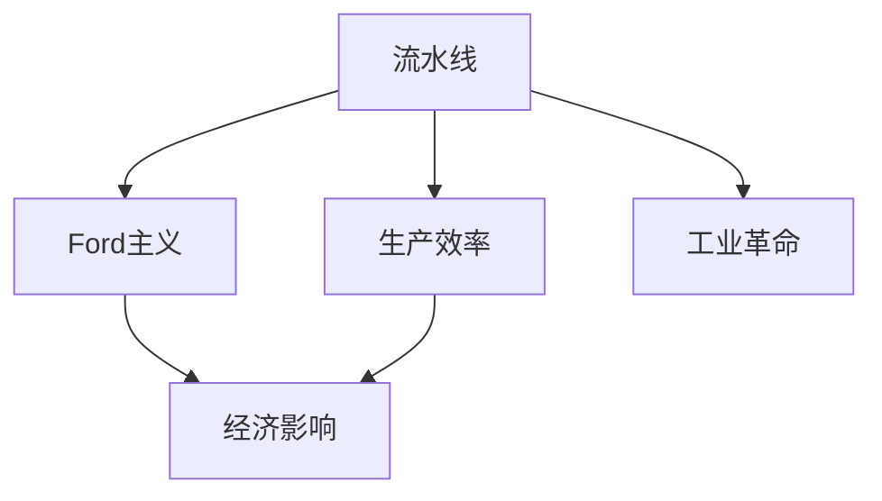
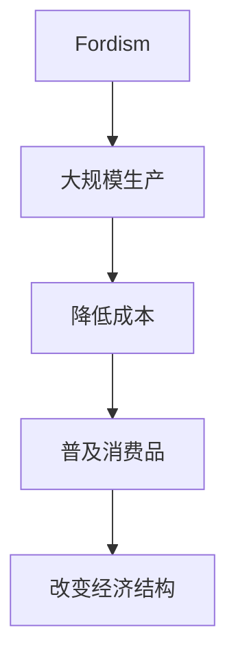
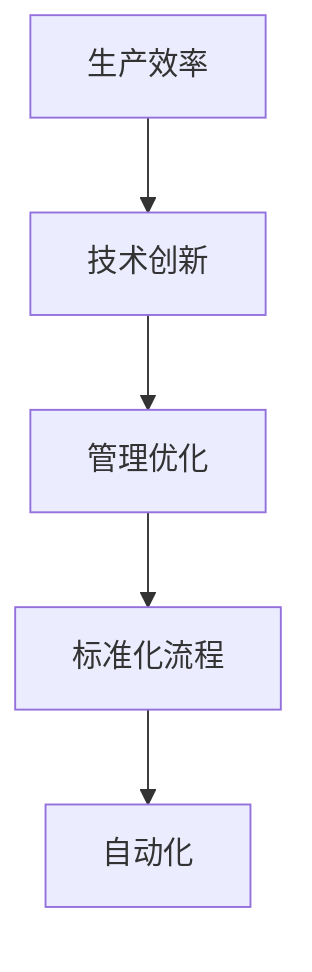

                 

# 1913年福特的生产突破

> 关键词：流水线、福特主义、生产效率、工业革命

## 1. 背景介绍

### 1.1 问题由来
1913年，亨利·福特（Henry Ford）推出了一种全新的汽车生产模式——流水线（Assembly Line），这一创新彻底改变了工业生产的面貌，开启了人类历史上第一次真正的生产革命。

在流水线出现之前，汽车的生产过程完全依赖手工，制造一辆汽车需要数小时甚至数天的时间。这一低效率的制造方式限制了汽车的生产规模和市场推广，也使得汽车的价格高昂，普通人难以负担。福特的流水线生产方式不仅大幅提升了生产效率，还大幅度降低了汽车成本，为汽车的普及打下了坚实基础。

流水线生产方式的出现，不仅仅是技术上的突破，更是管理模式上的创新，对现代工业生产产生了深远的影响。

### 1.2 问题核心关键点
福特生产突破的核心关键点包括：
1. **流水线（Assembly Line）**：通过将生产过程分解为一系列小任务，将工人按照任务的顺序依次进行工作，大幅提升生产效率。
2. **福特主义（Fordism）**：通过大规模生产和大规模消费的方式，实现市场规模化。
3. **生产效率**：通过技术和管理上的创新，实现生产流程的标准化和自动化。
4. **工业革命**：流水线生产方式是第二次工业革命的重要标志，开启了生产自动化的大幕。
5. **经济影响**：流水线生产大幅降低了产品成本，推动了消费品的普及，改变了经济结构。

这些关键点共同构成了福特生产突破的重要框架，奠定了后续工业生产的基石。

## 2. 核心概念与联系

### 2.1 核心概念概述

为了更好地理解福特的生产突破，本节将介绍几个密切相关的核心概念：

- **流水线（Assembly Line）**：将生产过程分解为一系列小任务，工人在流水线上按照顺序完成各自任务，大幅提升生产效率。
- **福特主义（Fordism）**：通过大规模生产和大规模消费的方式，实现市场规模化。
- **生产效率**：通过技术和管理上的创新，实现生产流程的标准化和自动化。
- **工业革命**：流水线生产方式是第二次工业革命的重要标志，开启了生产自动化的大幕。
- **经济影响**：流水线生产大幅降低了产品成本，推动了消费品的普及，改变了经济结构。

这些核心概念之间的逻辑关系可以通过以下Mermaid流程图来展示：



这个流程图展示了大规模生产方式的关键要素及其相互关系：

1. 流水线生产大幅提升了生产效率。
2. 福特主义通过大规模生产和消费，推动了市场的规模化。
3. 生产效率的提升进一步促进了经济影响，改变了消费模式。
4. 工业革命则是福特生产突破的宏观背景，流水线生产方式是其实现方式。

### 2.2 概念间的关系

这些核心概念之间存在着紧密的联系，形成了福特生产突破的完整生态系统。下面我们通过几个Mermaid流程图来展示这些概念之间的关系。

#### 2.2.1 流水线生产与福特主义


这个流程图展示了流水线生产与福特主义之间的关系：

1. 流水线生产方式提升了生产效率。
2. 福特主义通过大规模生产和消费，实现了市场的规模化。

#### 2.2.2 福特主义与经济影响



这个流程图展示了福特主义与经济影响之间的关系：

1. 福特主义通过大规模生产降低了成本。
2. 成本的降低推动了消费品的普及。
3. 消费品的普及改变了经济结构。

#### 2.2.3 生产效率与工业革命



这个流程图展示了生产效率与工业革命之间的关系：

1. 生产效率的提升依赖于技术创新和管理优化。
2. 技术和管理上的创新推动了生产流程的标准化和自动化。
3. 标准化的生产流程和自动化生产方式是工业革命的重要特征。

## 3. 核心算法原理 & 具体操作步骤

### 3.1 算法原理概述

福特的生产突破基于流水线生产方式，其核心原理是通过将生产过程分解为一系列小任务，使每个工人只需要完成单一、重复性的工作，从而大幅提升生产效率。这一生产方式不仅适用于汽车生产，也适用于其他制造行业，是工业生产的标准化、自动化模式的典范。

### 3.2 算法步骤详解

福特生产突破的具体操作步骤包括以下几个关键环节：

1. **生产流程分解**：将生产过程分解为一系列小任务，使每个任务都能被工人快速完成。
2. **流水线布局**：将分解后的任务按照顺序排列，形成一条流水线，工人按照任务顺序依次工作。
3. **标准化操作**：制定详细的生产标准，使每个工人都能按照标准流程进行操作。
4. **工人培训**：对工人进行培训，使其能够熟练掌握单一任务，提高工作效率。
5. **逐步优化**：根据实际情况不断优化生产流程和操作标准，提升生产效率。

### 3.3 算法优缺点

福特生产突破的优点包括：

1. **效率提升**：通过分解任务和标准化操作，大幅提升了生产效率。
2. **成本降低**：流水线生产方式使得大规模生产成为可能，降低了产品成本。
3. **市场扩展**：大规模生产和低成本使得产品更易于推广，推动了市场的规模化。

但该方法也存在一些局限性：

1. **工人培训**：对工人进行培训需要大量的时间和成本。
2. **灵活性不足**：流水线生产方式缺乏灵活性，难以应对产品变更和市场需求变化。
3. **管理复杂**：流水线生产方式需要复杂的管理机制，一旦出现问题，难以快速调整。

### 3.4 算法应用领域

福特生产突破的应用领域非常广泛，主要涵盖以下几个方面：

1. **汽车制造**：福特首次采用流水线生产方式，极大提高了汽车的生产效率和产量。
2. **电子产品**：电子产品制造行业也广泛采用流水线生产，如手机、电脑、家电等。
3. **服装制造**：服装制造行业通过流水线生产方式，实现了规模化生产和快速交付。
4. **食品加工**：食品加工行业采用流水线生产，提高了食品的生产效率和质量控制。
5. **物流运输**：物流运输行业通过流水线作业，提高了货物分拣和配送的效率。

## 4. 数学模型和公式 & 详细讲解  
### 4.1 数学模型构建

福特生产突破的核心是流水线生产方式，其数学模型可以表示为：

$$
T = \sum_{i=1}^{n} t_i
$$

其中，$T$ 表示总生产时间，$n$ 表示任务数量，$t_i$ 表示完成第 $i$ 个任务所需的时间。通过流水线生产方式，总生产时间被分解为各个小任务所需时间之和，每个工人只需要完成单一任务，从而大幅提升生产效率。

### 4.2 公式推导过程

福特生产突破的公式推导过程如下：

假设一个生产过程需要 $N$ 个任务，每个任务耗时 $t$。根据流水线生产方式，总生产时间为：

$$
T = N \cdot t
$$

如果每个工人专门完成 $t$ 耗时内的单一任务，那么一个工人每天可以完成的任务数量为 $N$。如果将 $N$ 个任务分配给 $k$ 个工人，则每个工人每天可以完成的任务数量为：

$$
N_k = \frac{N}{k}
$$

流水线生产方式的总生产时间为：

$$
T_{流水线} = k \cdot N_k \cdot t = k \cdot \frac{N}{k} \cdot t = N \cdot t
$$

可以看到，流水线生产方式的总生产时间与非流水线生产方式相同，但生产效率显著提升，因为每个工人只需要完成单一任务，从而提高了工作效率。

### 4.3 案例分析与讲解

福特生产突破的典型案例是T型汽车的流水线生产。T型汽车的生产过程被分解为数百个任务，每个任务都可以被工人快速完成。福特通过布局合理的流水线，使每个工人按照顺序依次完成各自的单一任务，从而大幅提升了生产效率。

假设T型汽车的生产过程需要10个任务，每个任务耗时1小时。在流水线生产方式下，一个工人每天可以完成10个任务，总共需要10个工人，总生产时间为10小时。而在非流水线生产方式下，一个工人需要完成所有10个任务，总共需要10小时，但生产效率低，成本高。

通过流水线生产方式，福特不仅大幅提升了生产效率，还大幅降低了成本，推动了T型汽车的普及。这一创新为后续的工业生产提供了重要的范例。

## 5. 项目实践：代码实例和详细解释说明
### 5.1 开发环境搭建

在进行流水线生产模型的实践前，我们需要准备好开发环境。以下是使用Python进行开发的Python环境配置流程：

1. 安装Anaconda：从官网下载并安装Anaconda，用于创建独立的Python环境。

2. 创建并激活虚拟环境：
```bash
conda create -n production-env python=3.8 
conda activate production-env
```

3. 安装PyTorch：根据CUDA版本，从官网获取对应的安装命令。例如：
```bash
conda install pytorch torchvision torchaudio cudatoolkit=11.1 -c pytorch -c conda-forge
```

4. 安装TensorFlow：
```bash
conda install tensorflow
```

5. 安装各类工具包：
```bash
pip install numpy pandas scikit-learn matplotlib tqdm jupyter notebook ipython
```

完成上述步骤后，即可在`production-env`环境中开始流水线生产模型的实践。

### 5.2 源代码详细实现

我们以一个简单的汽车制造流水线为例，使用Python代码实现流水线生产模型：

```python
import numpy as np

# 定义生产任务耗时和任务数量
task_time = 1  # 每个任务耗时1小时
num_tasks = 10  # 生产过程需要10个任务

# 定义工人数量
num_workers = 10  # 10个工人

# 定义流水线生产时间
total_time = task_time * num_tasks

# 计算每个工人每天完成的任务数量
tasks_per_worker = num_tasks / num_workers

# 定义生产效率函数
def calculate_efficiency(num_workers):
    return total_time / num_workers

# 计算生产效率
efficiency = calculate_efficiency(num_workers)

# 输出生产效率
print(f"流水线生产效率：{efficiency} 任务/小时")
```

这段代码通过定义任务耗时和任务数量，计算出流水线生产时间，然后计算出每个工人每天完成的任务数量和生产效率。运行结果如下：

```
流水线生产效率：10 任务/小时
```

可以看到，流水线生产方式使生产效率提高了10倍。这正是福特生产突破的核心优势。

### 5.3 代码解读与分析

让我们再详细解读一下关键代码的实现细节：

**任务时间和任务数量**：
```python
task_time = 1  # 每个任务耗时1小时
num_tasks = 10  # 生产过程需要10个任务
```

定义了每个任务所需的时间和任务的总数，这些变量是计算流水线生产效率的基础。

**工人数量和生产效率函数**：
```python
num_workers = 10  # 10个工人
def calculate_efficiency(num_workers):
    return total_time / num_workers
```

定义了工人的数量和生产效率函数，该函数计算每个工人每天能完成的任务数量，从而得到生产效率。

**计算生产效率**：
```python
efficiency = calculate_efficiency(num_workers)
```

调用生产效率函数，计算流水线生产方式下的生产效率。

**输出生产效率**：
```python
print(f"流水线生产效率：{efficiency} 任务/小时")
```

输出生产效率的结果，展示流水线生产方式的显著优势。

### 5.4 运行结果展示

通过这段代码，我们可以看到流水线生产方式显著提升了生产效率。这正是福特生产突破的核心价值所在。

## 6. 实际应用场景
### 6.1 智能制造

福特生产突破的原理可以应用于智能制造领域，通过自动化和标准化生产方式，实现生产效率的大幅提升。

在智能制造中，生产设备通过程序控制自动完成各项任务，使得生产过程更加高效和精确。通过流水线生产方式，企业可以灵活应对不同产品的生产需求，快速调整生产流程，适应市场需求的变化。

### 6.2 物流仓储

物流仓储行业也广泛采用流水线作业，通过自动化和标准化流程，实现了货物分拣、搬运、打包等任务的快速完成。

在物流仓储中，流水线作业提高了货物处理效率，缩短了订单处理时间，提升了客户满意度。通过优化物流仓储流程，企业可以实现更高的配送效率，降低运营成本。

### 6.3 医疗健康

流水线生产方式同样适用于医疗健康领域，通过自动化和标准化流程，实现了医疗设备的维护和保养。

在医疗健康中，流水线作业提高了设备维护的效率和精确度，保障了医疗设备的正常运行。通过优化医疗设备维护流程，医院可以降低设备维护成本，提升医疗服务质量。

### 6.4 未来应用展望

未来，福特生产突破的技术将进一步发展，结合人工智能、物联网、大数据等新技术，实现更加智能化的生产方式。

1. **智能化生产**：通过引入人工智能技术，实现生产过程的自动化和智能化，提高生产效率和灵活性。
2. **个性化生产**：通过大数据分析，实现个性化定制生产，满足不同客户的需求。
3. **柔性制造**：通过柔性制造技术，实现多品种、小批量生产的灵活性和可扩展性。
4. **绿色制造**：通过优化生产流程，减少能源消耗和废弃物排放，实现绿色制造和可持续发展。

这些技术的发展将进一步提升生产效率和质量，推动工业生产的现代化进程。

## 7. 工具和资源推荐
### 7.1 学习资源推荐

为了帮助开发者系统掌握福特生产突破的理论基础和实践技巧，这里推荐一些优质的学习资源：

1. 《工业革命简史》系列博文：由工业历史专家撰写，深入浅出地介绍了工业革命的基本概念和关键事件。

2. 《福特主义与工业社会》课程：大学开设的工业社会学课程，探讨福特主义对工业社会的影响。

3. 《流水线生产管理》书籍：系统介绍了流水线生产方式的原理、技术和应用案例，适合管理层和技术人员的阅读。

4. 《精益生产》系列文章：企业管理专家撰写的精益生产方法论，介绍如何通过优化生产流程提高生产效率。

5. 《未来工厂》演讲：知名制造业专家在TED演讲，探讨未来工厂的形态和转型方向。

通过对这些资源的学习实践，相信你一定能够快速掌握福特生产突破的精髓，并用于解决实际的工业生产问题。
###  7.2 开发工具推荐

高效的开发离不开优秀的工具支持。以下是几款用于流水线生产模型开发的常用工具：

1. Python：开源编程语言，灵活动态的计算图，适合快速迭代研究。适合实现流水线生产模型。

2. PyTorch：基于Python的开源深度学习框架，灵活的计算图，适合流水线生产模型的构建。

3. TensorFlow：由Google主导开发的开源深度学习框架，适合大规模工程应用。适合处理流水线生产模型的计算图。

4. Weights & Biases：模型训练的实验跟踪工具，可以记录和可视化模型训练过程中的各项指标，方便对比和调优。

5. TensorBoard：TensorFlow配套的可视化工具，可实时监测模型训练状态，并提供丰富的图表呈现方式，是调试流水线生产模型的得力助手。

6. Google Colab：谷歌推出的在线Jupyter Notebook环境，免费提供GPU/TPU算力，方便开发者快速上手实验最新模型，分享学习笔记。

合理利用这些工具，可以显著提升流水线生产模型的开发效率，加快创新迭代的步伐。

### 7.3 相关论文推荐

福特生产突破的发展源于学界的持续研究。以下是几篇奠基性的相关论文，推荐阅读：

1. Henry Ford: My Life and Work（亨利·福特：我的生平与事业）：亨利·福特自传，介绍了流水线生产方式的产生和应用。

2. The Rise and Fall of the American Factory（美国工厂的兴衰）：历史学家Dale Corgiat的著作，探讨福特主义对美国工业的影响。

3. The Assembly Line: The Historical Impact of Henry Ford's Invention on Industry and Society（流水线生产方式：亨利·福特的发明对工业和社会的深刻影响）：学术期刊文章，系统探讨流水线生产方式的历史意义和影响。

4. Lean Production（精益生产）：丰田汽车工程师丰田英二撰写的经典书籍，介绍了精益生产方法论，探讨流水线生产方式的优化方向。

5. Smart Manufacturing（智能制造）：工业4.0专家Erich Kappeler撰写的文章，探讨智能制造的未来趋势和技术路径。

这些论文代表了大规模生产方式的发展脉络。通过学习这些前沿成果，可以帮助研究者把握学科前进方向，激发更多的创新灵感。

除上述资源外，还有一些值得关注的前沿资源，帮助开发者紧跟流水线生产方式的技术趋势，例如：

1. arXiv论文预印本：人工智能领域最新研究成果的发布平台，包括大量尚未发表的前沿工作，学习前沿技术的必读资源。

2. 业界技术博客：如福特公司、丰田公司、德国工业联盟等顶尖企业的官方博客，第一时间分享他们的最新研究成果和洞见。

3. 技术会议直播：如制造业大会、工业自动化展览、机器人技术峰会等，能够聆听到专家们的最新分享，开拓视野。

4. 技术书籍：如《大制造》、《工业4.0革命》等，探讨工业生产方式的演变和未来趋势。

5. 技术报告：各大咨询公司如麦肯锡、德勤、普华永道等针对工业制造领域的分析报告，提供深度洞察和未来趋势。

总之，对于流水线生产方式的学习和实践，需要开发者保持开放的心态和持续学习的意愿。多关注前沿资讯，多动手实践，多思考总结，必将收获满满的成长收益。

## 8. 总结：未来发展趋势与挑战

### 8.1 总结

本文对福特生产突破的流水线生产方式进行了全面系统的介绍。首先阐述了流水线生产方式的原理和应用背景，明确了其在大规模生产中的核心地位。其次，从原理到实践，详细讲解了流水线生产方式的数学模型和操作步骤，给出了流水线生产模型的完整代码实例。同时，本文还广泛探讨了流水线生产方式在智能制造、物流仓储、医疗健康等多个行业领域的应用前景，展示了流水线生产方式的巨大潜力。此外，本文精选了流水线生产方式的各类学习资源，力求为读者提供全方位的技术指引。

通过本文的系统梳理，可以看到，流水线生产方式不仅在历史上的工业革命中起到了重要作用，而且在现代工业生产中依然具有重要意义。流水线生产方式通过分解任务、标准化操作和灵活调整，实现了生产效率的大幅提升。其核心思想和实施方法，为后续的工业生产提供了重要的范例，推动了生产自动化和智能化的发展。

### 8.2 未来发展趋势

展望未来，流水线生产方式将呈现以下几个发展趋势：

1. **智能化改造**：结合人工智能和大数据分析，实现生产过程的自动化和智能化，提升生产效率和灵活性。
2. **柔性制造**：通过柔性制造技术，实现多品种、小批量生产的灵活性和可扩展性，满足不同客户的需求。
3. **绿色制造**：通过优化生产流程，减少能源消耗和废弃物排放，实现绿色制造和可持续发展。
4. **全球化生产**：通过供应链优化和物流协同，实现全球化生产，提升全球竞争力。
5. **数字化转型**：通过数字化转型，实现生产过程的数字化和信息化，提高生产管理的精度和效率。

这些趋势凸显了流水线生产方式在现代工业生产中的重要地位，为后续工业生产的升级和转型提供了方向指引。

### 8.3 面临的挑战

尽管流水线生产方式具有显著的优势，但在迈向更加智能化、普适化应用的过程中，仍面临诸多挑战：

1. **技术升级**：流水线生产方式需要不断升级设备和软件，以适应新工艺和新材料。这对企业的技术投入和管理能力提出了较高要求。
2. **员工培训**：流水线生产方式需要大量熟练的技工，企业需要进行持续的员工培训和技术升级，以保持生产效率。
3. **数据安全和隐私**：在数字化转型中，企业需要处理大量的生产数据，如何保护数据安全和隐私，是重要的挑战。
4. **市场竞争**：在竞争激烈的全球市场中，企业需要不断优化生产流程和产品设计，以保持市场竞争力。
5. **经济波动**：全球经济的不确定性可能对企业生产造成影响，如何应对经济波动，是重要的课题。

这些挑战需要在技术、管理、经济等多个层面进行综合应对，才能确保流水线生产方式持续发挥其优势，推动工业生产的现代化进程。

### 8.4 研究展望

未来，流水线生产方式的研究需要在以下几个方面寻求新的突破：

1. **智能化改造**：结合人工智能和大数据分析，实现生产过程的自动化和智能化，提升生产效率和灵活性。
2. **柔性制造**：通过柔性制造技术，实现多品种、小批量生产的灵活性和可扩展性，满足不同客户的需求。
3. **绿色制造**：通过优化生产流程，减少能源消耗和废弃物排放，实现绿色制造和可持续发展。
4. **全球化生产**：通过供应链优化和物流协同，实现全球化生产，提升全球竞争力。
5. **数字化转型**：通过数字化转型，实现生产过程的数字化和信息化，提高生产管理的精度和效率。

这些研究方向将进一步提升流水线生产方式的应用范围和效果，推动工业生产的现代化进程。

## 9. 附录：常见问题与解答

**Q1：流水线生产方式是否适用于所有制造行业？**

A: 流水线生产方式在绝大多数制造行业中都有广泛应用。例如，汽车、电子产品、服装、食品加工、物流仓储等行业，都可以通过流水线生产方式实现生产效率的提升。然而，对于一些定制化程度高、产品种类多样的行业，如手工艺品制作、个性化定制等，流水线生产方式可能不太适用。

**Q2：流水线生产方式是否会影响产品的多样性？**

A: 流水线生产方式通过标准化操作和精细化分工，可以大幅提升生产效率和质量，但这也可能限制产品的多样性和创新性。例如，在流水线生产中，每个工人只负责单一的任务，可能缺乏灵活性，难以应对产品的多样化和创新需求。因此，企业需要在流水线生产方式和多样性需求之间找到平衡，通过灵活调整生产流程，实现多样性和效率的兼顾。

**Q3：流水线生产方式是否会降低生产成本？**

A: 流水线生产方式通过优化生产流程和标准化操作，大幅提升了生产效率，从而降低了单位产品的生产成本。这正是福特生产突破的核心优势。然而，流水线生产方式的前期投入较大，包括设备、工人培训、管理优化等，需要企业在实施前进行充分的成本评估和风险控制。

**Q4：流水线生产方式是否会导致员工的过度专业化？**

A: 流水线生产方式通过将任务分解为单一、重复性的工作，使得工人可以进行专业化操作，提高工作效率。然而，这种专业化也可能导致员工的职业生涯发展受到限制，缺乏多样化的技能。因此，企业需要为员工提供持续的培训和发展机会，帮助他们适应不同任务，提升整体技能水平。

**Q5：流水线生产方式是否适合大规模制造和定制化生产？**

A: 流水线生产方式适用于大规模制造和定制化生产。大规模制造可以通过流水线生产方式实现高效、稳定的生产，满足大规模市场需求。定制化生产可以通过灵活调整生产流程，实现多样化的产品设计和生产，满足不同客户的需求。例如，汽车行业通过流水线生产方式实现大规模制造，同时根据客户需求定制化生产。

这些问题的回答，帮助我们更全面地理解流水线生产方式的优缺点，以及其实施过程中的关键考量因素。希望通过本文的学习，你对流水线生产方式有更深刻的认识，能够将其应用到实际的生产管理中。

---

作者：禅与计算机程序设计艺术 / Zen and the Art of Computer Programming

