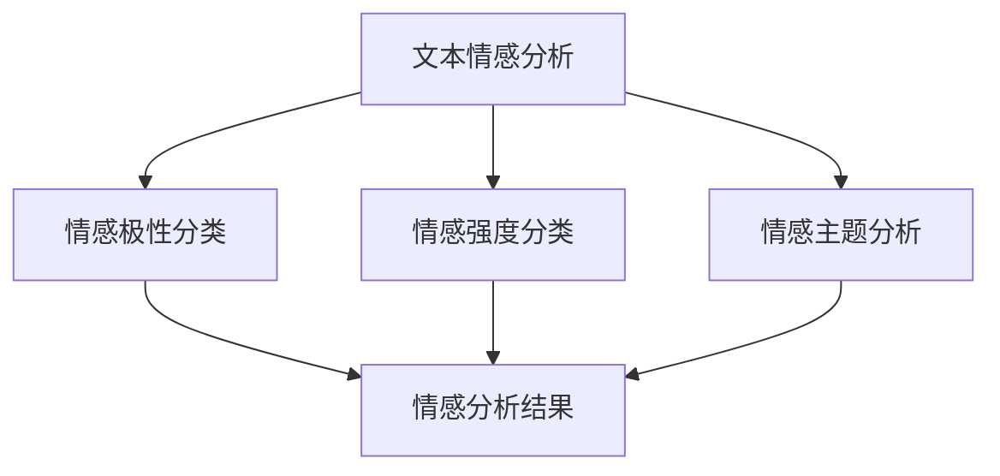

                 

# 用户情感分析的市场反馈

## 1. 背景介绍

### 1.1 问题由来
随着互联网和移动互联网的普及，用户的情感表达愈发丰富多样。无论是社交媒体上的帖子、评论，还是电商平台上的产品评价、客服对话，都有大量用户情感数据可供挖掘和分析。如何高效地从这些海量数据中提取用户的情感倾向，已成为企业获取用户反馈、改进产品和服务的重要手段。

情感分析(Sentiment Analysis)，作为自然语言处理(Natural Language Processing, NLP)的重要分支，旨在自动识别和分类文本中的情感倾向，通常分为情感极性分类、情感强度分类、情感主题分析等多种类型。通过情感分析，企业可以了解用户对产品、服务、品牌等方面的满意度和偏好，从而优化运营策略，提升用户体验。

### 1.2 问题核心关键点
情感分析的核心在于将文本中的情感信息转换为机器可理解的数值标签，常用的方法包括：
- 基于规则的方法：使用词典、情感词典等规则库，对文本中的情感词汇进行匹配和统计。
- 基于统计的方法：通过文本分类技术，训练情感分类器，自动学习情感信息的特征。
- 基于深度学习的方法：利用深度神经网络，尤其是循环神经网络(RNN)、卷积神经网络(CNN)、Transformer等模型，自动提取和建模文本中的情感信息。

近年来，基于深度学习的方法在情感分析中取得了显著效果，尤其是在大型预训练语言模型和迁移学习的推动下，情感分析模型的准确率不断提高。

### 1.3 问题研究意义
情感分析的市场反馈研究，对于企业而言，具有以下重要意义：
- 提升用户满意度：通过及时、准确的情感分析，企业可以第一时间了解用户反馈，迅速响应，提升用户体验和满意度。
- 优化产品和服务：分析用户情感数据，发现产品和服务中的问题和短板，指导产品迭代和改进。
- 市场竞争分析：对比竞争对手的情感分析结果，了解市场口碑和用户偏好，调整市场策略。
- 风险预警：通过情感分析，监测品牌声誉和市场舆情，及时发现潜在的负面舆情，提前预警。

## 2. 核心概念与联系

### 2.1 核心概念概述

情感分析涉及多个关键概念，各概念之间的关系密切：

- **文本情感分析**：识别文本中的情感倾向，通常分为正面、负面和中性三类。
- **情感极性分类**：对文本进行情感极性(正面或负面)的分类。
- **情感强度分类**：量化情感强度，如弱、中、强等。
- **情感主题分析**：识别文本中情感表达的具体主题或话题。

情感分析过程可以概括为以下几个步骤：
1. **数据预处理**：清洗、分词、去除停用词等。
2. **特征提取**：将文本转换为数值特征，如词袋模型、TF-IDF、Word2Vec、BERT等。
3. **模型训练**：使用机器学习算法（如SVM、Logistic回归）或深度学习模型（如RNN、CNN、Transformer）进行训练。
4. **情感分析**：将新文本输入模型，输出情感极性或强度。

这些概念的联系主要体现在：情感分析旨在从文本中提取情感信息，并将其转化为数值标签，最终实现对用户情感的自动分类和量化。

### 2.2 概念间的关系

这些核心概念之间的逻辑关系可以通过以下Mermaid流程图来展示：



这个流程图展示了情感分析的核心步骤和任务：

1. **文本情感分析**：是情感分析的第一步，目的是识别文本中的情感倾向。
2. **情感极性分类**：将文本分为正面或负面，是最基础的情感分类任务。
3. **情感强度分类**：在情感极性分类的基础上，进一步量化情感的强度。
4. **情感主题分析**：识别文本中情感表达的具体主题或话题，为情感分析提供更丰富的维度。
5. **情感分析结果**：整合情感极性、强度、主题等多方面信息，输出综合的情感分析结果。

## 3. 核心算法原理 & 具体操作步骤
### 3.1 算法原理概述

情感分析的算法原理主要基于文本分类和深度学习模型。其中，基于深度学习的方法在近年来取得了显著效果，尤其在预训练语言模型和迁移学习的推动下，情感分析模型的准确率不断提高。

常用的深度学习模型包括卷积神经网络(CNN)、循环神经网络(RNN)和Transformer等。这些模型通过自动提取和建模文本中的情感信息，实现高效的情感分类和强度量化。

### 3.2 算法步骤详解

情感分析的典型步骤如下：

**Step 1: 数据预处理**
- 文本清洗：去除噪声、拼写错误、标点符号等。
- 分词：将文本分割成词汇单元，使用中文分词器（如jieba）或英文分词器（如NLTK）。
- 去除停用词：过滤掉常见的停用词，如“的”、“是”等，减少噪音。

**Step 2: 特征提取**
- 词袋模型：将文本转换为词频向量，表示文本的语义信息。
- TF-IDF：计算词汇的词频和逆文档频率，过滤掉常见词汇，提取关键信息。
- Word2Vec：使用预训练的词向量表示词汇，捕捉词汇间的语义关系。
- BERT：利用Transformer结构和大规模预训练，提取文本的上下文语义信息。

**Step 3: 模型训练**
- 选择合适的深度学习模型，如RNN、CNN或Transformer。
- 定义损失函数：常用的有交叉熵损失、均方误差损失等。
- 优化算法：如Adam、SGD等，设置学习率和批量大小。
- 正则化技术：如L2正则、Dropout等，防止过拟合。

**Step 4: 情感分析**
- 将预处理后的文本输入模型，输出情感极性或强度。
- 通过阈值或后处理技术，将输出转化为具体的情感类别或强度。

### 3.3 算法优缺点

**优点：**
- 自动提取文本中的情感信息，无需人工标注，节省人力和时间。
- 深度学习模型具有强大的特征提取能力，可以处理复杂和多样化的文本数据。
- 基于预训练语言模型的方法，可以迁移学习到多种情感分析任务，提高模型的泛化能力。

**缺点：**
- 数据预处理和特征提取步骤复杂，对数据质量要求高。
- 深度学习模型需要较大的计算资源，训练时间长。
- 模型结果的解释性不足，难以理解模型的决策过程。

### 3.4 算法应用领域

情感分析在多个领域具有广泛的应用：

- **社交媒体情感分析**：分析用户在社交媒体上的情感表达，如微博、微信、Twitter等。
- **电商情感分析**：分析用户在电商平台上的评价和评论，如淘宝、京东、Amazon等。
- **品牌舆情监测**：监测品牌在社交媒体、新闻媒体等渠道的情感倾向和舆情变化。
- **客户服务分析**：分析客服对话中的情感信息，提升客户满意度。
- **市场竞争分析**：分析竞争对手的产品和服务在用户中的情感评价，调整市场策略。

## 4. 数学模型和公式 & 详细讲解 & 举例说明
### 4.1 数学模型构建

情感分析的数学模型可以构建为多分类回归或二分类回归问题。这里以二分类回归为例，假设文本情感分为正面和负面两种极性，使用二元交叉熵损失函数。

设文本$x$的情感标签为$y \in \{0,1\}$，模型预测的情感强度为$\hat{y} \in [0,1]$。则二分类交叉熵损失函数定义为：

$$
\ell(x,y) = -y \log \hat{y} - (1-y) \log (1-\hat{y})
$$

在训练过程中，使用梯度下降等优化算法，最小化经验风险：

$$
\mathcal{L}(\theta) = \frac{1}{N} \sum_{i=1}^N \ell(x_i,y_i)
$$

其中$\theta$为模型参数。

### 4.2 公式推导过程

以RNN模型为例，假设输入序列为$\{x_1, x_2, \ldots, x_T\}$，输出序列为$\{y_1, y_2, \ldots, y_T\}$。使用LSTM模型进行情感分析，其隐藏状态更新公式为：

$$
h_t = \text{LSTM}(h_{t-1}, x_t; \theta)
$$

其中$h_t$为第$t$时刻的隐藏状态，$\theta$为模型参数。

假设情感极性分类问题，输出$y_t \in \{0,1\}$，则情感分类器的输出层公式为：

$$
\log \sigma(h_t) \in [\log \sigma(z), -\log (1-\sigma(z))]
$$

其中$\sigma$为sigmoid函数。

通过以上公式，RNN模型可以自动学习文本序列的情感信息，并输出情感极性分类结果。

### 4.3 案例分析与讲解

以电商情感分析为例，分析用户在产品评论中的情感倾向。具体步骤如下：

**Step 1: 数据预处理**
- 清洗文本数据，去除噪声、拼写错误、标点符号等。
- 分词，使用jieba分词器对中文文本进行分词。
- 去除停用词，过滤掉常见词汇，如“的”、“是”等。

**Step 2: 特征提取**
- 使用Word2Vec对词汇进行嵌入，生成词向量表示。
- 构建词袋模型，统计每个词汇在文本中的出现频率。
- 使用BERT模型进行预训练，提取文本的上下文语义信息。

**Step 3: 模型训练**
- 使用RNN模型，以每个词汇的嵌入向量为输入，输出情感极性分类结果。
- 定义交叉熵损失函数，使用Adam优化算法进行训练。
- 使用Dropout技术，防止过拟合。

**Step 4: 情感分析**
- 将预处理后的文本输入模型，输出情感极性分类结果。
- 通过阈值或后处理技术，将输出转化为具体的情感类别。

## 5. 项目实践：代码实例和详细解释说明
### 5.1 开发环境搭建

在Python环境下进行情感分析的开发，需要安装一些关键库：

1. 安装Anaconda：从官网下载并安装Anaconda，用于创建独立的Python环境。

2. 创建并激活虚拟环境：
```bash
conda create -n nlp-env python=3.8 
conda activate nlp-env
```

3. 安装必要的库：
```bash
pip install numpy pandas scikit-learn nltk jieba transformers pytorch
```

4. 设置环境变量：
```bash
export PYTHONPATH=$PYTHONPATH:/path/to/transformers/
```

5. 下载预训练模型：
```bash
python -m transformers-cli download pytorch_model.bin bert-base-chinese
```

### 5.2 源代码详细实现

以下是使用BERT进行情感分析的代码实现：

```python
import torch
import torch.nn as nn
from transformers import BertTokenizer, BertForSequenceClassification
from torch.utils.data import DataLoader
from sklearn.metrics import accuracy_score

# 加载预训练模型和tokenizer
tokenizer = BertTokenizer.from_pretrained('bert-base-chinese')
model = BertForSequenceClassification.from_pretrained('bert-base-chinese', num_labels=2)

# 加载数据集
train_dataset = ...
dev_dataset = ...
test_dataset = ...

# 定义模型训练函数
def train_epoch(model, train_loader, optimizer, criterion):
    model.train()
    epoch_loss = 0
    epoch_acc = 0
    for batch in train_loader:
        input_ids, attention_mask, labels = batch
        model.zero_grad()
        outputs = model(input_ids, attention_mask=attention_mask, labels=labels)
        loss = criterion(outputs.logits, labels)
        loss.backward()
        optimizer.step()
        epoch_loss += loss.item()
        epoch_acc += accuracy_score(outputs.logits.argmax(dim=1), labels)
    return epoch_loss / len(train_loader), epoch_acc / len(train_loader)

# 定义模型评估函数
def evaluate(model, dev_loader):
    model.eval()
    dev_loss = 0
    dev_acc = 0
    for batch in dev_loader:
        input_ids, attention_mask, labels = batch
        with torch.no_grad():
            outputs = model(input_ids, attention_mask=attention_mask)
            loss = criterion(outputs.logits, labels)
            dev_loss += loss.item()
            dev_acc += accuracy_score(outputs.logits.argmax(dim=1), labels)
    return dev_loss / len(dev_loader), dev_acc / len(dev_loader)

# 训练模型
model.train()
optimizer = torch.optim.Adam(model.parameters(), lr=2e-5)
criterion = nn.CrossEntropyLoss()
device = torch.device('cuda' if torch.cuda.is_available() else 'cpu')
model.to(device)
train_loader = DataLoader(train_dataset, batch_size=16, shuffle=True)
dev_loader = DataLoader(dev_dataset, batch_size=16)
test_loader = DataLoader(test_dataset, batch_size=16)

for epoch in range(5):
    train_loss, train_acc = train_epoch(model, train_loader, optimizer, criterion)
    print(f'Epoch {epoch+1}, train loss: {train_loss:.3f}, train acc: {train_acc:.3f}')
    
    dev_loss, dev_acc = evaluate(model, dev_loader)
    print(f'Epoch {epoch+1}, dev loss: {dev_loss:.3f}, dev acc: {dev_acc:.3f}')
    
print(f'Final test acc: {evaluate(model, test_loader)[1]:.3f}')
```

### 5.3 代码解读与分析

这段代码实现了使用BERT模型进行情感分析的过程，主要步骤如下：

**Step 1: 加载模型和tokenizer**
- 使用transformers库加载BERT模型和对应的tokenizer。

**Step 2: 加载数据集**
- 定义训练集、验证集和测试集的加载函数，使用PyTorch的数据Loader加载数据集。

**Step 3: 模型训练**
- 定义训练函数，进行前向传播、损失计算和反向传播。
- 使用Adam优化算法进行模型参数更新。
- 使用交叉熵损失函数计算损失。

**Step 4: 模型评估**
- 定义评估函数，计算模型在验证集上的准确率。
- 在测试集上评估模型性能，输出最终的准确率。

## 6. 实际应用场景
### 6.1 社交媒体情感分析

社交媒体情感分析可以帮助企业了解用户在社交平台上的情感倾向，从而优化内容策略和品牌管理。例如，通过对微博、微信、Twitter等社交媒体的情感数据进行挖掘，可以分析用户对某品牌的情感变化趋势，及时调整营销策略。

### 6.2 电商情感分析

电商情感分析可以用于分析用户在电商平台上的产品评价和评论，了解用户对产品的满意度和痛点。通过情感分析，企业可以优化产品设计，提升用户满意度，增加用户粘性。

### 6.3 品牌舆情监测

品牌舆情监测可以帮助企业了解市场口碑和用户情感，及时发现潜在的负面舆情，调整市场策略。例如，通过分析用户在新闻媒体、社交媒体等渠道的情感倾向，可以及时应对市场变化，优化品牌形象。

### 6.4 客户服务分析

客户服务分析可以用于分析客服对话中的情感信息，提升客户满意度。通过情感分析，企业可以了解用户在客服对话中的情感状态，及时采取措施解决问题，提升客户体验。

### 6.5 市场竞争分析

市场竞争分析可以用于分析竞争对手在用户中的情感评价，调整市场策略。例如，通过情感分析，可以了解用户对竞争对手的情感倾向，优化自身产品和服务，提升市场竞争力。

## 7. 工具和资源推荐
### 7.1 学习资源推荐

1. 《自然语言处理入门》（张玉洁、陆云）：系统介绍自然语言处理的基本概念和常用方法，适合初学者入门。
2. 《深度学习与自然语言处理》（黄伟、李斌）：全面介绍深度学习在NLP中的应用，适合有一定基础的学习者。
3. 《Python自然语言处理》（彭健）：结合Python实现NLP项目，适合动手实践。
4. Coursera《自然语言处理》课程：斯坦福大学开设的NLP课程，涵盖自然语言处理的基本概念和前沿技术。
5. Kaggle自然语言处理竞赛：参加自然语言处理竞赛，锻炼实战能力。

### 7.2 开发工具推荐

1. PyTorch：基于Python的深度学习框架，灵活便捷。
2. TensorFlow：谷歌开源的深度学习框架，支持大规模工程应用。
3. NLTK：Python自然语言处理工具库，包含分词、词性标注等功能。
4. Jieba：中文分词工具，快速高效。
5. Transformers：HuggingFace开发的NLP库，支持多种预训练语言模型。

### 7.3 相关论文推荐

1. Attention is All You Need（即Transformer原论文）：提出了Transformer结构，开启预训练语言模型时代。
2. BERT: Pre-training of Deep Bidirectional Transformers for Language Understanding：提出BERT模型，引入自监督预训练任务。
3. Text Attention：提出Text Attention模型，使用Transformer结构进行文本分类。
4. LSTM网络：提出LSTM模型，用于处理序列数据的情感分类。
5. CNN卷积神经网络：提出CNN模型，用于文本情感分析。

## 8. 总结：未来发展趋势与挑战
### 8.1 研究成果总结

情感分析技术在近年来取得了显著进展，尤其在深度学习和大规模预训练语言模型的推动下，模型的准确率和泛化能力不断提高。情感分析广泛应用于社交媒体、电商、品牌管理、客户服务等领域，为企业的运营决策提供了重要支持。

### 8.2 未来发展趋势

1. **多模态情感分析**：未来的情感分析将拓展到视觉、语音等多模态数据，结合不同模态的信息，提升情感分析的准确性和鲁棒性。
2. **上下文感知**：使用Transformer等模型，更好地捕捉文本的上下文信息，提升情感分析的准确性和泛化能力。
3. **动态情感分析**：结合实时数据分析技术，动态监控情感变化趋势，及时响应市场变化。
4. **低资源情感分析**：在数据量不足的情况下，使用无监督和半监督学习技术，优化情感分析模型。
5. **深度情感理解**：结合认知科学和心理学理论，深入理解情感信息的生成和变化规律，提升情感分析的解释性和可靠性。

### 8.3 面临的挑战

1. **数据隐私和安全**：在情感分析过程中，如何保护用户隐私和数据安全，是一个重要的挑战。
2. **算法鲁棒性**：情感分析模型需要具备较强的鲁棒性，避免在噪声数据或新领域中的性能下降。
3. **多领域适应**：情感分析模型需要适应不同领域和场景，提升跨领域的泛化能力。
4. **计算资源消耗**：深度学习模型需要较大的计算资源，如何优化模型结构，降低计算成本，是一个重要的研究方向。
5. **模型可解释性**：情感分析模型需要具备较好的可解释性，方便用户理解模型的决策过程。

### 8.4 研究展望

未来的情感分析研究需要在以下几个方面寻求新的突破：

1. **多模态情感分析**：结合视觉、语音等多模态信息，提升情感分析的准确性和鲁棒性。
2. **上下文感知**：使用Transformer等模型，更好地捕捉文本的上下文信息，提升情感分析的准确性和泛化能力。
3. **动态情感分析**：结合实时数据分析技术，动态监控情感变化趋势，及时响应市场变化。
4. **低资源情感分析**：在数据量不足的情况下，使用无监督和半监督学习技术，优化情感分析模型。
5. **深度情感理解**：结合认知科学和心理学理论，深入理解情感信息的生成和变化规律，提升情感分析的解释性和可靠性。

## 9. 附录：常见问题与解答

**Q1: 情感分析的常见问题有哪些？**

A: 情感分析的常见问题包括数据不平衡、文本长度不一致、情感词典不准确等。数据不平衡会导致模型在极端情感类别上性能差，文本长度不一致需要统一处理，情感词典不准确需要手动调整或使用更高级的词向量表示方法。

**Q2: 如何提高情感分析的准确率？**

A: 提高情感分析准确率的关键在于数据预处理和特征提取。可以尝试以下方法：
1. 清洗数据，去除噪声、停用词等。
2. 使用词向量表示，如Word2Vec、GloVe、BERT等。
3. 引入上下文信息，使用Transformer等模型。
4. 调整模型参数，如学习率、批量大小等。
5. 使用正则化技术，如L2正则、Dropout等。

**Q3: 情感分析在实际应用中有哪些挑战？**

A: 情感分析在实际应用中的挑战包括：
1. 数据隐私和安全：保护用户隐私和数据安全，防止数据泄露。
2. 算法鲁棒性：避免在噪声数据或新领域中的性能下降。
3. 多领域适应：提升跨领域的泛化能力，适应不同领域和场景。
4. 计算资源消耗：优化模型结构，降低计算成本。
5. 模型可解释性：提高模型的可解释性，方便用户理解决策过程。

**Q4: 情感分析的未来发展趋势是什么？**

A: 情感分析的未来发展趋势包括：
1. 多模态情感分析：结合视觉、语音等多模态信息，提升情感分析的准确性和鲁棒性。
2. 上下文感知：使用Transformer等模型，更好地捕捉文本的上下文信息。
3. 动态情感分析：结合实时数据分析技术，动态监控情感变化趋势。
4. 低资源情感分析：在数据量不足的情况下，使用无监督和半监督学习技术，优化情感分析模型。
5. 深度情感理解：结合认知科学和心理学理论，深入理解情感信息的生成和变化规律。

以上为《用户情感分析的市场反馈》一文的完整内容。通过本文的详细介绍，相信读者能够全面理解情感分析技术的原理、实现和应用，为实际项目提供参考。

