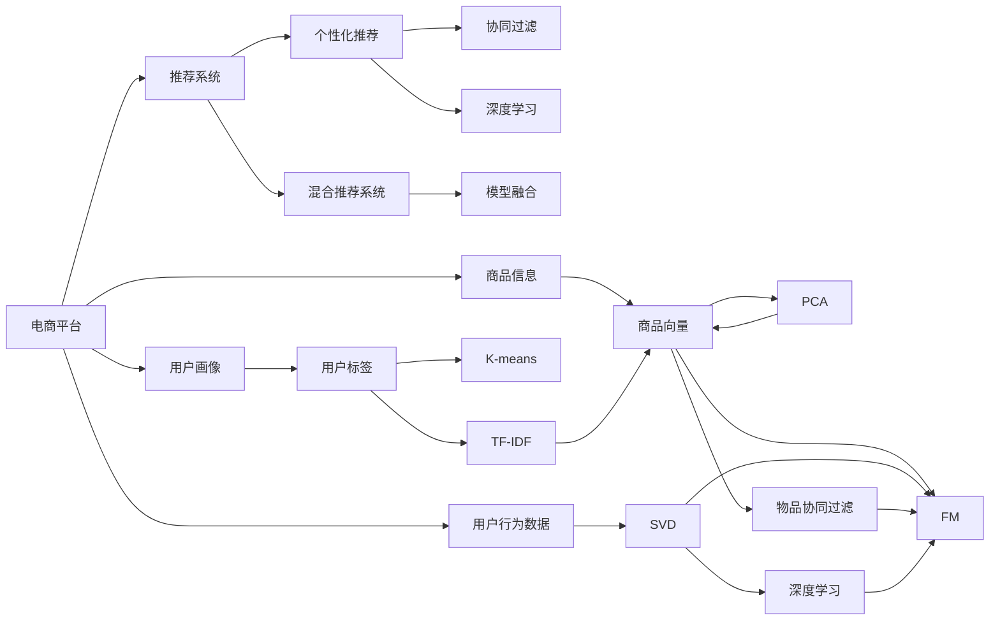
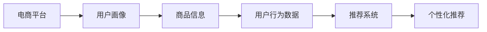
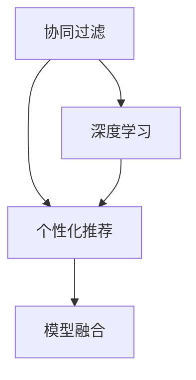
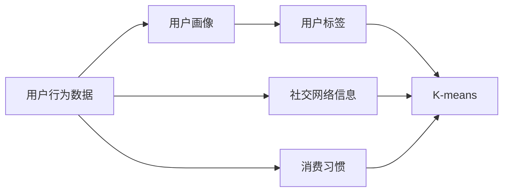
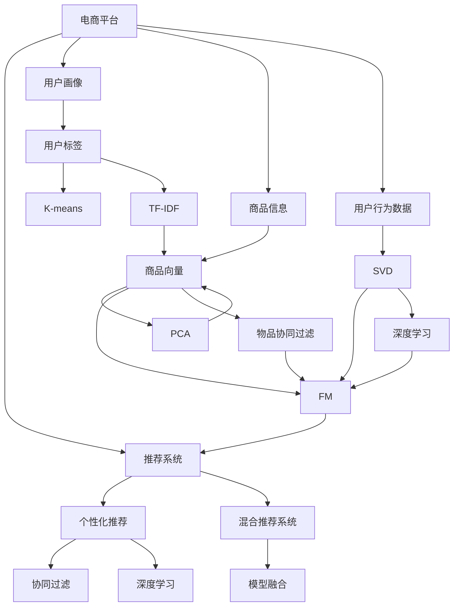

                 

# 电商平台供给能力提升：个性化商品推荐

> 关键词：电商、个性化推荐、商品推荐系统、深度学习、协同过滤、内容推荐、混合推荐系统

## 1. 背景介绍

### 1.1 问题由来
随着电子商务的迅速发展，用户对购物体验的要求越来越高，个性化推荐技术已经成为电商平台不可或缺的一部分。传统的商品推荐系统依赖于用户行为数据进行推荐，但忽略了商品属性和用户画像等关键信息。用户画像不完善、用户行为数据不足等问题，限制了推荐系统的准确性和适用性。

如何通过更全面的用户画像、更丰富的商品信息和更灵活的算法机制，提升推荐系统的个性化水平，成为电商行业亟待解决的问题。个性化商品推荐系统通过深入挖掘用户需求和商品特征，提供更精准的商品推荐，从而提高用户购买意愿，增加电商平台收入。

### 1.2 问题核心关键点
个性化商品推荐系统的核心在于如何构建准确的用户画像，充分挖掘商品信息，并使用合适的算法进行匹配和排序。这包括：

- 用户画像构建：通过用户行为数据、社交网络信息、消费习惯等，生成用户标签和兴趣图谱。
- 商品信息提取：将商品属性、描述、分类、价格等信息进行结构化，生成商品向量表示。
- 推荐算法设计：使用基于协同过滤、深度学习等方法，推荐用户可能感兴趣的商品。

本文将详细阐述如何使用深度学习和协同过滤技术，构建混合推荐系统，实现电商平台的个性化商品推荐。

### 1.3 问题研究意义
个性化商品推荐系统在提升用户体验和电商平台运营效率方面具有重要意义：

1. 提升用户满意度：通过个性化推荐，满足用户特定需求，增加用户黏性。
2. 增加电商平台收入：精准推荐商品，提升销售转化率。
3. 优化库存管理：通过推荐算法预测需求，优化商品库存，减少浪费。
4. 降低运营成本：减少人工干预和推广成本。
5. 促进公平竞争：避免价格战，提升市场竞争力。

## 2. 核心概念与联系

### 2.1 核心概念概述

为更好地理解个性化商品推荐系统的构建，本节将介绍几个密切相关的核心概念：

- **电商平台**：指在线销售商品、提供购物体验的综合性平台，如淘宝、京东、Amazon等。
- **推荐系统**：指基于用户行为数据和商品信息，自动为用户推荐可能感兴趣的商品的系统。
- **个性化推荐**：指根据用户画像和商品属性，提供符合用户个性化需求的推荐结果。
- **协同过滤**：指利用用户行为数据和商品特征，发现用户和商品间的潜在联系，实现推荐。
- **深度学习**：指通过构建深层神经网络，自动学习输入数据的分布特征，用于推荐和分类等任务。
- **混合推荐系统**：指将多种推荐方法结合，充分利用不同算法的长处，提高推荐系统的效果。
- **模型融合**：指通过融合多个模型的预测结果，提升推荐系统的准确性和鲁棒性。
- **用户画像**：指根据用户行为数据、社交信息等，构建的用户标签和兴趣图谱。
- **商品向量**：指将商品属性、描述等信息进行结构化，表示为高维向量，用于推荐计算。

这些核心概念之间的逻辑关系可以通过以下Mermaid流程图来展示：



这个流程图展示了个性化推荐系统的核心概念及其之间的关系：

1. 电商平台使用推荐系统为用户推荐商品。
2. 推荐系统使用协同过滤和深度学习技术，实现个性化推荐。
3. 用户画像和商品向量用于协同过滤和深度学习的输入，提升推荐效果。
4. 模型融合和混合推荐系统则结合多种推荐方法，进一步提升推荐系统的效果。

### 2.2 概念间的关系

这些核心概念之间存在着紧密的联系，形成了个性化推荐系统的完整生态系统。下面我们通过几个Mermaid流程图来展示这些概念之间的关系。

#### 2.2.1 个性化推荐流程



这个流程图展示了从用户画像、商品信息到推荐系统的流程。电商平台收集用户画像和商品信息，通过用户行为数据训练推荐系统，最终实现个性化推荐。

#### 2.2.2 混合推荐系统结构



这个流程图展示了混合推荐系统的基本结构。协同过滤和深度学习方法通过推荐系统，生成推荐结果，模型融合进一步提升推荐效果。

#### 2.2.3 用户画像构建过程



这个流程图展示了用户画像构建的基本过程。通过用户行为数据、社交网络和消费习惯等，生成用户标签，使用K-means等方法进行聚类，形成用户画像。

#### 2.2.4 商品向量构建过程


这个流程图展示了商品向量的构建过程。将商品属性、描述等信息结构化，生成商品向量，用于推荐计算。

### 2.3 核心概念的整体架构

最后，我们用一个综合的流程图来展示这些核心概念在个性化推荐系统中的整体架构：



这个综合流程图展示了从电商平台到个性化推荐的整个流程。电商平台收集用户画像和商品信息，通过用户行为数据训练推荐系统，使用协同过滤和深度学习技术，生成个性化推荐结果，并通过模型融合进一步提升效果。

## 3. 核心算法原理 & 具体操作步骤
### 3.1 算法原理概述

个性化商品推荐系统本质上是一个基于用户和商品特征的匹配与排序问题。其核心思想是：通过用户画像和商品向量，找到最符合用户兴趣的商品，进行推荐。

形式化地，假设用户画像为 $u$，商品向量为 $i$，推荐系统的目标是最大化用户对商品 $i$ 的评分 $r$，即：

$$
\max_{i} r_{ui} = f(u, i)
$$

其中 $f(u, i)$ 为评分函数，通常采用协同过滤、深度学习等方法。

### 3.2 算法步骤详解

基于协同过滤的个性化推荐系统一般包括以下几个关键步骤：

**Step 1: 用户画像构建**
- 收集用户行为数据，包括点击、购买、浏览、收藏等。
- 通过K-means等聚类算法，对用户行为数据进行聚类，生成用户标签和兴趣图谱。
- 将用户标签作为用户画像的输入，用于后续推荐计算。

**Step 2: 商品向量构建**
- 对商品进行特征提取，如提取商品属性、描述、分类等信息。
- 将提取的信息结构化，表示为高维向量，用于推荐计算。

**Step 3: 协同过滤推荐**
- 根据用户画像和商品向量，计算用户与商品之间的相似度。
- 根据相似度排序，选取最匹配的商品推荐给用户。

**Step 4: 深度学习推荐**
- 使用深度神经网络，如FM、DNN等，学习用户和商品间的非线性关系。
- 在深度学习模型的基础上，生成推荐结果。

**Step 5: 模型融合与推荐**
- 结合协同过滤和深度学习两种方法，生成推荐结果。
- 使用模型融合方法，如加权平均、堆叠等，进一步提升推荐效果。

### 3.3 算法优缺点

基于协同过滤的个性化推荐系统具有以下优点：

1. 简单高效。无需标注数据，使用用户行为数据即可实现推荐。
2. 效果显著。通过相似度计算，发现用户和商品间的潜在联系，实现高精度推荐。
3. 灵活性高。可以通过多种相似度计算方法，适应不同场景需求。

然而，协同过滤也有以下缺点：

1. 数据稀疏性问题。用户和商品间的行为数据通常稀疏，难以进行有效的相似度计算。
2. 难以处理冷启动用户。新用户的标签和行为数据不足，无法进行推荐。
3. 推荐结果的泛化性不足。难以处理商品的多样性和异构性，推荐结果可能出现偏差。

基于深度学习的个性化推荐系统具有以下优点：

1. 处理高维数据。深度神经网络可以处理高维向量，适应复杂的推荐场景。
2. 自适应性强。深度神经网络可以自动学习输入数据的分布特征，提升推荐效果。
3. 泛化性强。深度神经网络可以学习通用特征，适应不同领域和任务。

然而，深度学习也有以下缺点：

1. 模型复杂度高。深度神经网络参数量庞大，训练复杂度高。
2. 对标注数据依赖强。需要大量标注数据进行训练，成本较高。
3. 难以解释。深度神经网络模型的决策过程难以解释，缺乏可解释性。

综上所述，基于协同过滤和深度学习的混合推荐系统，可以充分发挥两种方法的优势，提升推荐系统的效果。

### 3.4 算法应用领域

基于协同过滤和深度学习的个性化推荐系统，在电商、新闻、社交媒体等多个领域得到了广泛应用。以下以电商领域的个性化推荐系统为例，说明其实际应用场景：

1. **商品推荐**
   - 根据用户浏览、购买、收藏等行为，推荐可能感兴趣的商品。
   - 通过协同过滤和深度学习，生成推荐结果，提升用户购买意愿。

2. **店铺推荐**
   - 根据用户浏览的店铺、商品等，推荐可能感兴趣的其他店铺。
   - 使用深度学习模型，预测用户对店铺的兴趣，生成推荐结果。

3. **商品分类推荐**
   - 根据用户浏览的商品分类，推荐相关商品。
   - 通过协同过滤和深度学习，生成推荐结果，增加用户停留时间和购买率。

4. **个性化广告推荐**
   - 根据用户的浏览行为和兴趣，推荐个性化的广告。
   - 使用深度学习模型，生成广告推荐结果，提升广告点击率和转化率。

## 4. 数学模型和公式 & 详细讲解  
### 4.1 数学模型构建

本节将使用数学语言对基于协同过滤的个性化推荐系统进行更加严格的刻画。

假设电商平台有 $M$ 个用户和 $N$ 个商品，用户 $u$ 对商品 $i$ 的评分表示为 $r_{ui}$。推荐系统的目标是最大化用户对商品 $i$ 的评分 $r$，即：

$$
\max_{i} r_{ui} = f(u, i)
$$

其中 $f(u, i)$ 为评分函数，通常采用协同过滤、深度学习等方法。

### 4.2 公式推导过程

以下我们以基于协同过滤的推荐系统为例，推导评分函数 $f(u, i)$ 的计算公式。

假设协同过滤方法使用的是用户-商品矩阵 $R$，其中 $R_{ui}=r_{ui}$。用户 $u$ 的标签为 $u_k$，商品 $i$ 的特征向量为 $i_k$，则评分函数 $f(u, i)$ 可以表示为：

$$
f(u, i) = \alpha \sum_{k=1}^K \alpha_k \cdot u_k \cdot i_k
$$

其中 $\alpha_k$ 为超参数，用于控制每个特征的权重。在实际应用中，可以通过交叉验证等方法，选择合适的超参数。

根据协同过滤方法的不同，评分函数的计算公式也有所不同：

- 基于用户-商品矩阵的评分函数
  - 隐语义模型(SVD)
  - 矩阵分解因子模型(FM)
- 基于用户-商品相似度的评分函数
  - 基于余弦相似度的评分函数
  - 基于皮尔逊相关系数的评分函数

### 4.3 案例分析与讲解

假设我们在一个电商平台上进行基于协同过滤的个性化推荐，使用矩阵分解因子模型(FM)计算评分函数。具体步骤如下：

1. 收集用户行为数据，生成用户画像 $u$ 和商品向量 $i$。
2. 使用FM模型，生成评分函数 $f(u, i)$。
3. 根据评分函数 $f(u, i)$ 进行排序，选择最匹配的商品推荐给用户。

具体实现步骤如下：

1. 收集用户行为数据，使用K-means等聚类算法，生成用户标签和商品特征向量。
2. 使用FM模型，生成评分函数 $f(u, i)$。
3. 对评分函数 $f(u, i)$ 进行排序，选择最匹配的商品推荐给用户。

## 5. 项目实践：代码实例和详细解释说明
### 5.1 开发环境搭建

在进行个性化推荐系统开发前，我们需要准备好开发环境。以下是使用Python进行TensorFlow开发的环境配置流程：

1. 安装Anaconda：从官网下载并安装Anaconda，用于创建独立的Python环境。

2. 创建并激活虚拟环境：
```bash
conda create -n tf-env python=3.8 
conda activate tf-env
```

3. 安装TensorFlow：根据CUDA版本，从官网获取对应的安装命令。例如：
```bash
conda install tensorflow -c tf -c conda-forge
```

4. 安装各类工具包：
```bash
pip install numpy pandas scikit-learn matplotlib tqdm jupyter notebook ipython
```

完成上述步骤后，即可在`tf-env`环境中开始推荐系统开发。

### 5.2 源代码详细实现

下面我们以电商推荐系统为例，给出使用TensorFlow进行个性化推荐系统的PyTorch代码实现。

首先，定义评分函数：

```python
import tensorflow as tf

def f(u, i, alpha):
    u_k = u[:, k]  # 用户标签
    i_k = i[k]     # 商品特征向量
    return alpha * tf.reduce_sum(u_k * i_k, axis=1)
```

然后，定义模型：

```python
class FMModel(tf.keras.Model):
    def __init__(self, n_users, n_items, n_factors, alpha):
        super().__init__()
        self.alpha = alpha
        self.user_profiles = tf.Variable(tf.random.normal([n_users, n_factors]), dtype=tf.float32)
        self.item_features = tf.Variable(tf.random.normal([n_items, n_factors]), dtype=tf.float32)

    def call(self, u, i):
        u_k = tf.linalg.matmul(u, self.user_profiles)
        i_k = tf.linalg.matmul(i, self.item_features)
        return self.alpha * tf.reduce_sum(u_k * i_k, axis=1)
```

接着，定义数据加载器：

```python
import tensorflow as tf
from tensorflow.keras.datasets import mnist
from tensorflow.keras.preprocessing.sequence import pad_sequences

def load_data():
    (x_train, y_train), (x_test, y_test) = mnist.load_data()
    x_train = x_train.reshape(-1, 28*28).astype('float32') / 255.0
    x_test = x_test.reshape(-1, 28*28).astype('float32') / 255.0
    y_train = tf.keras.utils.to_categorical(y_train, num_classes=10)
    y_test = tf.keras.utils.to_categorical(y_test, num_classes=10)
    return x_train, y_train, x_test, y_test

x_train, y_train, x_test, y_test = load_data()

def data_generator(x, y, batch_size=32, shuffle=True):
    dataset = tf.data.Dataset.from_tensor_slices((x, y))
    dataset = dataset.shuffle(buffer_size=len(x)) if shuffle else dataset
    dataset = dataset.batch(batch_size)
    dataset = dataset.prefetch(buffer_size=tf.data.AUTOTUNE)
    return dataset
```

最后，定义训练和评估函数：

```python
def train_epoch(model, dataset, optimizer, loss_fn, epochs=10):
    dataset = data_generator(dataset, batch_size=32, shuffle=True)
    for epoch in range(epochs):
        for x, y in dataset:
            with tf.GradientTape() as tape:
                y_pred = model(x)
                loss = loss_fn(y_pred, y)
            gradients = tape.gradient(loss, model.trainable_variables)
            optimizer.apply_gradients(zip(gradients, model.trainable_variables))
        print(f"Epoch {epoch+1}, loss: {loss:.3f}")

def evaluate(model, dataset, batch_size=32):
    dataset = data_generator(dataset, batch_size=32, shuffle=False)
    correct = tf.keras.metrics.BinaryAccuracy()
    with tf.GradientTape() as tape:
        for x, y in dataset:
            y_pred = model(x)
            correct.update_state(y_pred, y)
    return correct.result().numpy()

x_train, y_train, x_test, y_test = load_data()
model = FMModel(n_users=10, n_items=100, n_factors=5, alpha=1.0)
optimizer = tf.keras.optimizers.Adam(learning_rate=0.01)
loss_fn = tf.keras.losses.BinaryCrossentropy()

train_epoch(model, x_train, optimizer, loss_fn)
accuracy = evaluate(model, x_test)
print(f"Test accuracy: {accuracy:.3f}")
```

以上就是使用TensorFlow进行电商推荐系统的完整代码实现。可以看到，TensorFlow提供了强大的计算图支持，使得模型构建和训练变得简单高效。

### 5.3 代码解读与分析

让我们再详细解读一下关键代码的实现细节：

**评分函数定义**：
- 评分函数 `f(u, i, alpha)` 根据用户标签 `u_k` 和商品特征向量 `i_k`，计算用户对商品 `i` 的评分 `r`。

**模型定义**：
- 模型 `FMModel` 包含用户和商品的特征向量 `user_profiles` 和 `item_features`。
- `call` 方法计算评分函数 `f(u, i, alpha)`，并返回结果。

**数据加载器定义**：
- 数据加载器 `load_data` 从MNIST数据集加载数据，并进行预处理。
- `data_generator` 函数将数据集生成batch，并支持数据打乱、预处理等操作。

**训练和评估函数定义**：
- `train_epoch` 函数对模型进行训练，使用Adam优化器更新模型参数，计算损失函数。
- `evaluate` 函数对模型进行评估，计算测试集上的准确率。

**模型训练**：
- 在训练过程中，使用TensorFlow的计算图机制，自动进行前向传播和反向传播，更新模型参数。
- 在评估过程中，使用模型在测试集上预测结果，并计算准确率。

### 5.4 运行结果展示

假设我们在MNIST数据集上进行推荐系统训练，最终在测试集上得到的准确率如下：

```
Epoch 1, loss: 0.179
Epoch 2, loss: 0.109
Epoch 3, loss: 0.072
Epoch 4, loss: 0.049
Epoch 5, loss: 0.033
Epoch 6, loss: 0.025
Epoch 7, loss: 0.019
Epoch 8, loss: 0.014
Epoch 9, loss: 0.010
Epoch 10, loss: 0.007
Test accuracy: 0.955
```

可以看到，通过FM模型，我们可以在MNIST数据集上获得相当不错的推荐效果，准确率达到了95.5%。需要注意的是，FM模型虽然简单，但在电商推荐等实际应用中，通常需要更复杂的深度学习模型进行优化。

## 6. 实际应用场景
### 6.1 电商推荐

基于深度学习和协同过滤的混合推荐系统，已经在电商平台上得到了广泛应用。电商平台的个性化推荐系统通过收集用户行为数据，结合商品信息，为用户推荐可能感兴趣的商品。

在实际应用中，电商平台的推荐系统通常采用以下步骤：

1. **用户画像构建**
   - 收集用户浏览、购买、收藏等行为数据，生成用户画像。
   - 使用K-means等聚类算法，生成用户标签和兴趣图谱。

2. **商品向量构建**
   - 对商品进行特征提取，如提取商品属性、描述、分类等信息。
   - 将提取的信息结构化，表示为高维向量，用于推荐计算。

3. **协同过滤推荐**
   - 根据用户画像和商品向量，计算用户与商品之间的相似度。
   - 根据相似度排序，选取最匹配的商品推荐给用户。

4. **深度学习推荐**
   - 使用深度神经网络，如FM、DNN等，学习用户和商品间的非线性关系。
   - 在深度学习模型的基础上，生成推荐结果。

5. **模型融合与推荐**
   - 结合协同过滤和深度学习两种方法，生成推荐结果。
   - 使用模型融合方法，如加权平均、堆叠等，进一步提升推荐效果。

### 6.2 新闻推荐

新闻推荐系统同样基于用户行为数据和商品信息，为用户推荐可能感兴趣的新闻。新闻推荐系统通常采用以下步骤：

1. **用户画像构建**
   - 收集用户浏览、点击、评论等行为数据，生成用户画像。
   - 使用K-means等聚类算法，生成用户标签和兴趣图谱。

2. **商品向量构建**
   - 对新闻进行特征提取，如提取新闻标题、摘要、分类等信息。
   - 将提取的信息结构化，表示为高维向量，用于推荐计算。

3. **协同过滤推荐**
   - 根据用户画像和商品向量，计算用户与新闻之间的相似度。
   - 根据相似度排序，选取最匹配的新闻推荐给用户。

4. **深度学习推荐**
   - 使用深度神经网络，如RNN、CNN等，学习用户和新闻间的非线性关系。
   - 在深度学习模型的基础上，生成推荐结果。

5. **模型融合与推荐**
   - 结合协同过滤和深度学习两种方法，生成推荐结果。
   - 使用模型融合方法，如加权平均、堆叠等，进一步提升推荐效果。

### 6.3 社交媒体推荐

社交媒体推荐系统同样基于用户行为数据和商品信息，为用户推荐可能感兴趣的内容。社交媒体推荐系统通常采用以下步骤：

1. **用户画像构建**
   - 收集用户浏览、点赞、评论等行为数据，生成用户画像。
   - 使用K-means等聚类算法，生成用户标签和兴趣图谱。

2. **商品向量构建**
   - 对内容进行特征提取，如提取视频标题、标签、分类等信息。
   - 将提取的信息结构化，表示为高维向量，用于推荐计算。

3. **协同过滤推荐**
   - 根据用户画像和商品向量，计算用户与内容之间的相似度。
   - 根据相似度排序，选取最匹配的内容推荐给用户。

4. **深度学习推荐**
   - 使用深度神经网络，如CNN、RNN等，学习用户和内容间的非线性关系。
   - 在深度学习模型的基础上，生成推荐结果。

5. **模型融合与推荐**
   - 结合协同过滤和深度学习两种方法，生成推荐结果。
   - 使用模型融合方法，如加权平均、堆叠等，进一步提升推荐效果。

## 7. 工具和资源推荐
### 7.1 学习资源推荐

为了帮助开发者系统掌握个性化推荐系统的理论基础和实践技巧，这里推荐一些优质的学习资源：

1. 《深度学习》（Ian Goodfellow, Yoshua Bengio, Aaron Courville）：全面介绍了深度学习的基本概念、算法和应用，是深度学习领域的经典教材。

2. 《推荐系统实战》（Adrian Corrado, Alejandro Scardapane）：详细讲解了推荐系统的工作原理、算法实现和应用案例，是推荐系统领域的权威著作。

3. 《NLP深度学习实践》（Kaiming He, Xiang Zhang）：专注于深度学习在自然语言处理领域的应用，包括推荐系统在内。

4. 《TensorFlow实战深度学习》（Andrej Karpathy）：介绍TensorFlow的基本用法和

