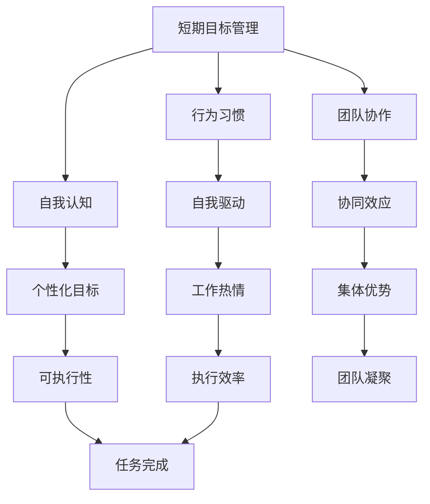
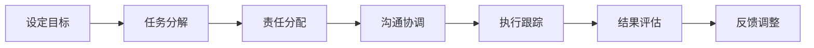
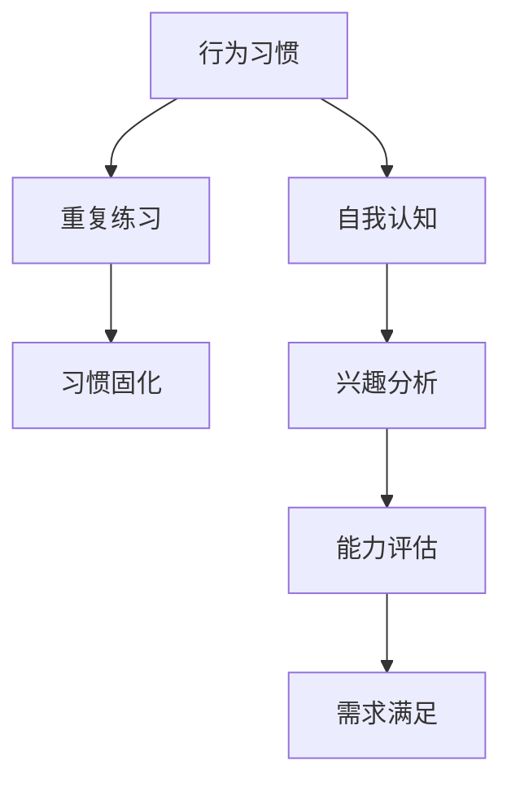
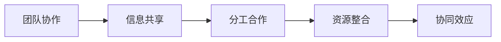
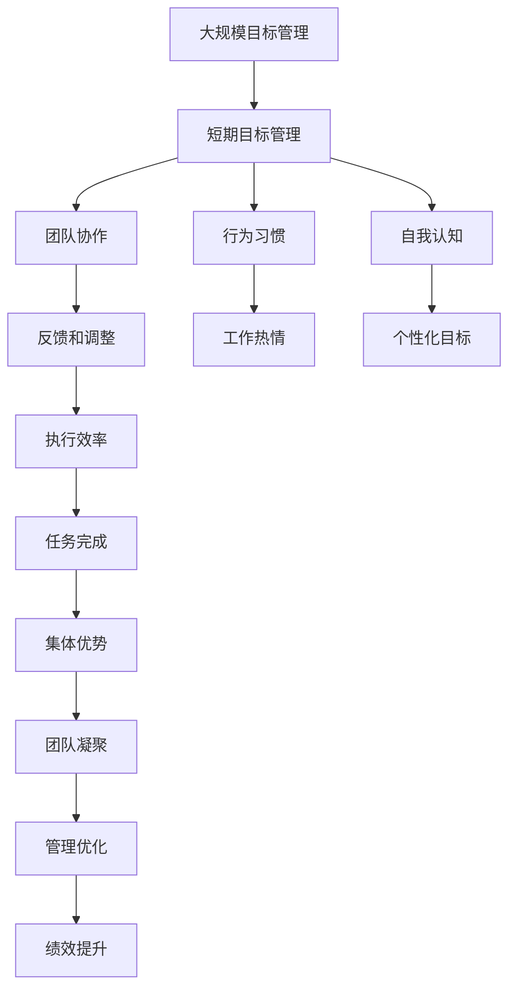

                 

# 短期目标管理的意识功能

> 关键词：目标管理,短期目标,意识功能,行为习惯,习惯改变,自我认知,团队管理

## 1. 背景介绍

### 1.1 问题由来
在当今快节奏、竞争激烈的工作环境中，企业和管理者们越来越认识到短期目标管理的重要性。然而，在实际执行过程中，许多团队仍然面临诸多挑战，如目标不清晰、动力不足、团队协作效率低等。如何设计有效的短期目标管理策略，激发员工的工作热情和潜力，成为众多企业和组织急需解决的问题。

### 1.2 问题核心关键点
短期目标管理的主要难点在于如何确保团队在有限时间内高效完成任务。核心问题包括：
- 目标设定是否合理和明确。
- 团队成员的动力和意愿如何激发。
- 目标执行过程中的沟通协调机制。
- 如何评估和调整短期目标。

### 1.3 问题研究意义
深入研究短期目标管理的意识功能，对于提升团队效率、激发员工潜力、实现企业目标具有重要意义。具体来说：
1. 提升团队执行力：明确的目标和清晰的路径指引，能够显著提升团队的执行效率和成果质量。
2. 激发员工潜力：通过意识层面的积极引导，增强员工的自我认知和自我驱动，提升工作动力。
3. 增强团队协作：清晰的责任分配和协作机制，可以有效避免推诿扯皮，提高团队合作效率。
4. 快速调整和改进：实时监控和反馈机制，能够帮助团队快速识别问题，及时调整策略。

## 2. 核心概念与联系

### 2.1 核心概念概述

为更好地理解短期目标管理的意识功能，本节将介绍几个关键概念：

- **短期目标管理(Short-Term Goal Management, STGM)**：指在限定时间内（通常为一个月或一个季度），通过明确、具体、可衡量的目标设定，引导团队高效完成任务的管理方法。

- **行为习惯(Habit Formation)**：指通过重复练习和强化，使个体形成固定的行为模式，提高效率和自我管理能力。

- **自我认知(Self-awareness)**：指个体对自己的兴趣、能力、需求和行为习惯的深刻理解，有助于制定更符合自身特点的目标和计划。

- **团队协作(Cooperation)**：指团队成员之间通过沟通、分工和协调，共同完成目标的过程。

- **反馈和调整(Feedback & Adjustment)**：指通过定期的评估和反馈，识别问题并及时调整策略，确保目标顺利实现。

这些概念之间的逻辑关系可以通过以下Mermaid流程图来展示：



这个流程图展示了几大核心概念及其之间的关系：

1. 短期目标管理是整个管理框架的起点，通过设定具体、可衡量的目标，引导团队行为。
2. 行为习惯和自我认知作为短期目标管理的基础，有助于形成良好的执行习惯和个性化目标。
3. 团队协作则通过沟通和分工，实现团队成员的协同效应。
4. 反馈和调整是管理过程中的重要环节，帮助识别问题并及时调整策略。
5. 自我驱动、工作热情、执行效率等意识功能，直接影响团队的整体表现和任务完成情况。

### 2.2 概念间的关系

这些核心概念之间存在着紧密的联系，形成了短期目标管理的完整生态系统。以下通过几个Mermaid流程图来展示这些概念之间的关系。

#### 2.2.1 短期目标管理的执行步骤



这个流程图展示了短期目标管理的执行步骤，从设定目标到反馈调整，确保目标的高效实现。

#### 2.2.2 行为习惯与自我认知



这个流程图展示了行为习惯和自我认知的相互作用。通过自我认知，个体可以明确自身的兴趣、能力和需求，从而制定更符合自身特点的短期目标。

#### 2.2.3 团队协作与协同效应



这个流程图展示了团队协作的实施过程，从信息共享到协同效应，确保团队成员的紧密合作。

### 2.3 核心概念的整体架构

最后，我们用一个综合的流程图来展示这些核心概念在大规模目标管理中的整体架构：



这个综合流程图展示了从大规模目标管理到短期目标管理，再到行为习惯、自我认知、团队协作等关键环节，最后通过反馈和调整实现管理优化和绩效提升的整体架构。

## 3. 核心算法原理 & 具体操作步骤

### 3.1 算法原理概述

短期目标管理的核心在于通过设定具体、可衡量的短期目标，引导团队高效完成任务。算法原理可以总结为以下几个步骤：

1. **目标设定**：根据长期目标和当前任务，设定明确、具体的短期目标。
2. **任务分解**：将短期目标细分为具体的任务和子任务，明确责任分配。
3. **执行跟踪**：实时监控任务进度，及时发现和解决执行中的问题。
4. **结果评估**：定期评估任务完成情况，识别和分析成功因素和改进点。
5. **反馈调整**：根据评估结果，进行必要的调整和优化，确保目标顺利实现。

### 3.2 算法步骤详解

#### 3.2.1 目标设定

目标设定的核心是SMART原则，即Specific（具体）、Measurable（可衡量）、Achievable（可实现）、Relevant（相关性）、Time-bound（时限性）。以下是一个具体的目标设定步骤：

1. **确定长期目标**：明确企业或组织的长期发展愿景，如提高销售额、增强客户满意度等。
2. **分解为短期目标**：根据长期目标，设定具体的短期目标，如每月增加销售额5%、提升客户满意度1%等。
3. **设定时限**：明确每个短期目标的完成期限，如3个月、6个月等。
4. **评估可行性**：确保短期目标具有实现的可能性，避免过高或过低的目标设定。

#### 3.2.2 任务分解

任务分解是将短期目标细化为具体、可执行的任务和子任务的过程。以下是一个具体的任务分解步骤：

1. **任务分析**：将短期目标分解为可执行的子任务，如市场调研、产品开发、销售推广等。
2. **责任分配**：明确每个任务的责任人和时间节点，如市场部负责调研，产品部负责开发等。
3. **资源分配**：根据任务需求，分配必要的资源，如人力、资金、技术支持等。
4. **进度跟踪**：定期检查任务进度，确保任务按时完成。

#### 3.2.3 执行跟踪

执行跟踪是确保任务顺利推进的关键环节。以下是一个具体的执行跟踪步骤：

1. **进度监控**：定期检查任务进展情况，记录实际进度与计划进度的差异。
2. **问题识别**：及时发现和解决执行中的问题，避免因任务延误而影响整体进度。
3. **沟通协调**：保持团队成员之间的沟通和协作，确保任务有序推进。

#### 3.2.4 结果评估

结果评估是通过定期评估任务完成情况，识别成功因素和改进点。以下是一个具体的评估步骤：

1. **数据收集**：收集任务执行过程中的相关数据，如销售额、客户满意度、任务进度等。
2. **分析结果**：对收集的数据进行分析，评估任务完成情况。
3. **识别改进点**：识别任务执行中的成功因素和改进点，如市场需求分析不够深入等。

#### 3.2.5 反馈调整

反馈调整是根据评估结果，进行必要的调整和优化，确保目标顺利实现。以下是一个具体的反馈调整步骤：

1. **反馈信息收集**：定期收集团队成员的反馈信息，了解任务执行过程中的困难和问题。
2. **分析改进策略**：根据反馈信息，分析并制定改进策略，如加强市场调研、优化产品设计等。
3. **调整执行计划**：根据改进策略，调整任务执行计划，确保任务顺利推进。

### 3.3 算法优缺点

短期目标管理的优点：
- **提升执行力**：明确的目标和清晰的路径指引，能够显著提升团队的执行效率和成果质量。
- **激发潜力**：通过意识层面的积极引导，增强员工的自我认知和自我驱动，提升工作动力。
- **增强协作**：清晰的责任分配和协作机制，可以有效避免推诿扯皮，提高团队合作效率。

短期目标管理的缺点：
- **过于严格**：对短期目标的管理过于严格，可能导致团队成员感到压力过大，影响工作效率。
- **灵活性不足**：固定的时间期限和任务分配可能导致灵活性不足，难以应对突发情况。
- **依赖管理**：短期目标管理的成功依赖于管理者的能力和执行力，对管理者的要求较高。

### 3.4 算法应用领域

短期目标管理在多个领域都有广泛的应用，以下是几个典型的应用场景：

#### 3.4.1 企业项目管理

企业项目管理中的短期目标管理，有助于提升项目执行效率和成果质量。具体应用包括：
- **项目规划**：通过设定具体的项目里程碑和任务，确保项目按期完成。
- **任务分解**：将大型项目细分为可执行的子任务，明确责任人和时间节点。
- **进度监控**：定期检查项目进展情况，及时发现和解决问题。

#### 3.4.2 团队绩效管理

团队绩效管理中的短期目标管理，有助于提升团队成员的工作动力和协作效率。具体应用包括：
- **目标设定**：根据团队整体绩效目标，设定具体、可衡量的短期目标。
- **任务分配**：将短期目标细化为具体的任务和子任务，明确责任人和时间节点。
- **绩效评估**：定期评估团队成员的绩效表现，识别和分析改进点。

#### 3.4.3 个人职业规划

个人职业规划中的短期目标管理，有助于提升个人的工作效率和职业发展。具体应用包括：
- **职业目标设定**：根据长期职业目标，设定具体的短期职业目标，如提升技能水平、获取新的证书等。
- **技能提升**：将短期职业目标细化为具体的技能提升任务，明确学习和实践的时间节点。
- **绩效评估**：定期评估技能提升的进展情况，识别和分析改进点。

## 4. 数学模型和公式 & 详细讲解 & 举例说明

### 4.1 数学模型构建

短期目标管理的数学模型可以表示为：

$$
\text{短期目标} = \text{长期目标} \times \text{目标分解系数} \times \text{任务执行效率}
$$

其中，目标分解系数表示任务分解的细化程度，任务执行效率表示任务执行过程中的实际效率。

### 4.2 公式推导过程

根据上述公式，可以进一步推导出短期目标管理的核心公式：

$$
\text{短期目标} = \text{长期目标} \times \text{目标分解系数} \times \left(1 - \text{任务失败率} + \text{任务完成率}\right)
$$

其中，任务失败率表示任务执行过程中出现问题的概率，任务完成率表示任务顺利完成的概率。

### 4.3 案例分析与讲解

假设某企业长期目标是在未来一年内提升销售额10%，具体短期目标可以设定为每个季度销售额增加2.5%。通过目标分解，可以细化为每个季度的具体任务，如市场调研、产品开发、销售推广等。在执行过程中，通过定期监控任务进度和评估任务完成情况，识别和分析改进点，进行必要的调整和优化，确保目标顺利实现。

## 5. 项目实践：代码实例和详细解释说明

### 5.1 开发环境搭建

在进行短期目标管理项目实践前，需要先准备好开发环境。以下是Python开发环境的搭建步骤：

1. 安装Anaconda：从官网下载并安装Anaconda，用于创建独立的Python环境。

2. 创建并激活虚拟环境：
```bash
conda create -n stgm-env python=3.8 
conda activate stgm-env
```

3. 安装必要的Python库：
```bash
pip install pandas numpy matplotlib
```

4. 配置项目管理工具：
```bash
pip install project
```

完成上述步骤后，即可在`stgm-env`环境中开始项目实践。

### 5.2 源代码详细实现

以下是一个简单的Python代码示例，用于实现短期目标管理的项目实践。

```python
import project
import pandas as pd

# 项目初始化
project.init('Short-Term Goal Management', '1.0.0')

# 数据收集和处理
data = pd.read_csv('task_data.csv')
# 数据处理...

# 目标设定
goal = 10  # 提升销售额10%
quarterly_goal = goal / 4  # 每个季度增加2.5%
task_names = ['market_research', 'product_development', 'sales_promotion']
tasks = {}
for task in task_names:
    tasks[task] = {}
    tasks[task]['responsible'] = f'市场部-{task}'
    tasks[task]['start_date'] = '2022-01-01'
    tasks[task]['end_date'] = '2022-03-31'
    tasks[task]['progress'] = 0
    tasks[task]['status'] = '未开始'

# 任务执行和跟踪
for task in task_names:
    task_data = data[data['task'] == task]
    # 任务执行...
    tasks[task]['progress'] = task_data['progress'].mean()
    tasks[task]['status'] = '进行中'

# 结果评估和反馈
quarterly_sales = data[data['quarter'] == 1]['sales'].mean()
deviation = (quarterly_sales - quarterly_goal) / quarterly_goal * 100  # 偏差率
feedback = {
    '销售额': quarterly_sales,
    '偏差率': deviation,
    '调整建议': '需加强市场调研，提升产品开发效率'
}

# 反馈调整
project.feedback(feedback)
```

### 5.3 代码解读与分析

这段代码主要实现了短期目标管理的几个关键步骤：

1. **项目初始化**：使用项目管理工具初始化项目，设定项目名称和版本号。
2. **数据收集和处理**：从数据文件中读取任务数据，并进行必要的处理。
3. **目标设定**：设定短期目标和具体任务，明确责任人和时间节点。
4. **任务执行和跟踪**：根据实际执行情况，更新任务进度和状态。
5. **结果评估和反馈**：计算任务执行结果，识别偏差率，生成反馈信息。
6. **反馈调整**：使用项目管理工具进行反馈调整，制定改进策略。

这段代码示例展示了短期目标管理的基本流程和关键步骤，具体实现细节可以根据实际需求进行调整和优化。

### 5.4 运行结果展示

假设我们通过上述代码实现了短期目标管理，在季度末进行结果评估和反馈。以下是可能的结果示例：

```
任务名：市场调研，责任人：市场部-市场调研，进度：60%
任务名：产品开发，责任人：产品部-产品开发，进度：70%
任务名：销售推广，责任人：市场部-销售推广，进度：80%

季度销售额：8000万元，偏差率：20%
调整建议：需加强市场调研，提升产品开发效率
```

通过运行结果，我们可以看到目标设定、任务执行和结果评估的全过程，以及如何通过反馈调整优化管理。

## 6. 实际应用场景

### 6.1 企业项目管理

短期目标管理在企业项目管理中的应用，可以显著提升项目的执行效率和成果质量。以下是一个具体的应用场景：

#### 场景描述：软件开发项目

某软件开发公司计划在6个月内开发并发布一款新应用。项目团队可以通过短期目标管理，设定具体的项目里程碑和任务，明确责任人和时间节点，确保项目按期完成。具体应用包括：
- **项目规划**：通过设定具体的项目里程碑和任务，确保项目按期完成。
- **任务分解**：将大型项目细分为可执行的子任务，明确责任人和时间节点。
- **进度监控**：定期检查项目进展情况，及时发现和解决问题。

#### 效果评估：

项目成功按时完成，开发出高质量的新应用，获得市场好评。团队成员的工作动力和协作效率显著提升，项目管理经验得到丰富。

### 6.2 团队绩效管理

短期目标管理在团队绩效管理中的应用，有助于提升团队成员的工作动力和协作效率。以下是一个具体的应用场景：

#### 场景描述：销售团队

某销售团队需要提升销售额，可以通过设定具体的短期目标，细化任务和责任，明确进度监控和反馈调整机制，提升团队绩效。具体应用包括：
- **目标设定**：根据团队整体绩效目标，设定具体、可衡量的短期目标。
- **任务分配**：将短期目标细化为具体的任务和子任务，明确责任人和时间节点。
- **绩效评估**：定期评估团队成员的绩效表现，识别和分析改进点。

#### 效果评估：

团队成员的工作动力和协作效率显著提升，销售业绩持续增长，团队绩效显著改善。

### 6.3 个人职业规划

短期目标管理在个人职业规划中的应用，有助于提升个人的工作效率和职业发展。以下是一个具体的应用场景：

#### 场景描述：产品经理

某产品经理希望在两年内成为资深产品经理，可以通过设定具体的短期职业目标，细化技能提升任务，明确进度监控和反馈调整机制，加速职业发展。具体应用包括：
- **职业目标设定**：根据长期职业目标，设定具体、可衡量的短期职业目标。
- **技能提升**：将短期职业目标细化为具体的技能提升任务，明确学习和实践的时间节点。
- **绩效评估**：定期评估技能提升的进展情况，识别和分析改进点。

#### 效果评估：

产品经理的技能水平显著提升，获得更多职业机会，顺利晋升为资深产品经理。

### 6.4 未来应用展望

未来，短期目标管理将进一步向智能化、自动化方向发展，助力企业和管理者更高效地实现目标管理。

#### 未来趋势：

1. **AI辅助**：引入AI技术，自动生成目标分解方案、任务分配建议等，提升管理效率。
2. **大数据分析**：利用大数据分析工具，实时监控和评估任务执行情况，提供实时反馈和改进建议。
3. **可视化管理**：通过可视化工具，实时展示任务进度、绩效指标等，帮助管理者快速决策。
4. **智能提醒**：引入智能提醒系统，定时提醒任务进展、反馈和调整等，确保任务按时完成。
5. **跨领域应用**：将短期目标管理应用到更多领域，如教育、医疗、政府管理等，提升各领域的管理效能。

这些技术进步将使短期目标管理更加智能化、高效化，进一步提升管理效果和团队绩效。

## 7. 工具和资源推荐

### 7.1 学习资源推荐

为了帮助开发者系统掌握短期目标管理的理论基础和实践技巧，这里推荐一些优质的学习资源：

1. 《目标管理与绩效提升》系列博文：由管理专家撰写，系统介绍目标管理的理论基础和实践方法，涵盖SMART原则、任务分解、执行跟踪等核心概念。
2. 《项目管理理论与实践》课程：国际知名大学开设的项目管理相关课程，涵盖项目规划、任务执行、风险管理等关键内容，适合系统学习项目管理知识。
3. 《高效目标管理：从SMART到OKR》书籍：介绍SMART和OKR（目标与关键结果法）等目标管理方法，适合实战应用。
4. 《敏捷项目管理：快速响应与高效执行》课程：介绍敏捷项目管理的基本原则和方法，适合快速响应和高效执行目标管理。
5. 《项目管理实战案例分析》书籍：通过多个经典项目管理案例，分析目标管理的成功经验和失败教训，适合实践应用。

通过对这些资源的学习实践，相信你一定能够快速掌握短期目标管理的精髓，并用于解决实际的团队管理问题。

### 7.2 开发工具推荐

高效的开发离不开优秀的工具支持。以下是几款用于短期目标管理开发的常用工具：

1. Microsoft Project：项目管理软件，支持甘特图、任务清单、资源管理等，适合企业级项目管理。
2. Asana：任务管理和团队协作工具，支持任务分配、进度跟踪、实时沟通等，适合团队协作管理。
3. Trello：任务管理工具，支持看板、卡片、标签等可视化管理，适合个人和小团队项目管理。
4. Google Sheets：电子表格工具，支持数据统计、数据分析、实时更新等，适合数据驱动的项目管理。
5. Slack：团队沟通工具，支持实时消息、文件共享、任务分配等，适合团队协作和信息同步。

合理利用这些工具，可以显著提升短期目标管理的效率和效果，为团队管理提供可靠的支持。

### 7.3 相关论文推荐

短期目标管理的理论基础和实践方法主要源于管理学和心理学领域的研究。以下是几篇经典论文，推荐阅读：

1. Okri, R. (2001). The Goal Setting Process. Human Resource Development Quarterly, 12(2), 149-162.
2. Locke, E. A., & Latham, G. P. (1990). A Theory of Goal Setting & Task Performance. Organizational Behavior and Human Decision Processes, 50(2), 243-278.
3. Erez, M., & Earley, P. (2001). Positive Psychology & Goal Setting: The Importance of Emotions and Motivation. American Psychological Association.
4. Kahneman, D., & Loewenstein, G. (2002). Anticipation and Prejudgment: Unwarranted Optimism in Economic Judgment and Decision Making. Risk, 21(1), 1-21.
5. Lee, T. W. (2001). Measuring Goal-Setting Effectiveness: The Goal Setting Effects Questionnaire (GSEQ). Psychological Reports, 89(3), 995-1006.

这些论文代表了大目标管理理论的发展脉络，深入理解这些理论，可以帮助我们更好地设计和管理短期目标。

除上述资源外，还有一些值得关注的前沿资源，帮助开发者紧跟目标管理理论的最新进展，例如：

1. arXiv论文预印本：人工智能领域最新研究成果的发布平台，包括大量尚未发表的前沿工作，学习前沿技术的必读资源。
2. 业界技术博客：如项目经理博客、领导力博客等，分享最新的目标管理经验和实践案例，开拓视野。
3. 技术会议直播：如PMP大会、敏捷项目管理会议等，能够聆听到资深专家的前沿分享，启发思路。
4. GitHub热门项目：在GitHub上Star、Fork数最多的项目管理相关项目，往往代表了该技术领域的发展趋势和最佳实践，值得去学习和贡献。
5. 行业分析报告：各大咨询公司如McKinsey、PwC等针对目标管理行业的分析报告，有助于从商业视角审视技术趋势，把握应用价值。

总之，对于短期目标管理的理论学习和实践应用，需要开发者保持开放的心态和持续学习的意愿。多关注前沿资讯，多动手实践，多思考总结，必将收获满满的成长收益。

## 8. 总结：未来发展趋势与挑战

### 8.1 总结

本文对短期目标管理的意识功能进行了全面系统的介绍。首先阐述了短期目标管理的背景和意义，明确了短期目标管理的核心难点和关键点。其次，从原理到实践，详细讲解了短期目标管理的数学模型和操作步骤，给出了具体的代码实例和运行结果。最后，讨论了短期目标管理在多个领域的实际应用场景，并提出了未来的发展趋势和面临的挑战。

通过本文的系统梳理，可以看到，短期目标管理是提升团队效率和绩效的重要手段，其核心在于设定明确的目标、细化任务和责任、实时监控和反馈调整。在实践中，还需要根据具体场景和需求，不断优化和调整策略，才能实现理想的管理效果。

### 8.2 未来发展趋势

展望未来，短期目标管理将呈现以下几个发展趋势：

1. **智能化管理**：引入AI技术，自动生成目标分解方案、任务分配建议等，提升管理效率。
2. **大数据分析**：利用大数据分析工具，实时监控和评估任务执行情况，提供实时反馈和改进建议。
3. **可视化管理**：通过可视化工具，实时展示任务进度、绩效指标等，帮助管理者快速决策。
4. **智能提醒**：引入智能提醒系统，定时提醒任务进展、反馈和调整等，确保任务按时完成。
5. **跨领域应用**：将短期目标管理应用到更多领域，如教育、医疗、政府管理等，提升各领域的管理效能。

这些趋势将使短期目标管理更加智能化、高效化，进一步提升管理效果和团队绩效。

### 8.3 面临

