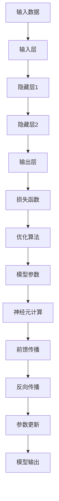
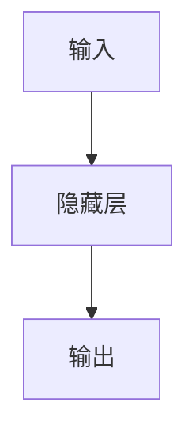

                 

# 神经网络 (Neural Network)

## 1. 背景介绍

神经网络（Neural Network, 简称NN）是一种受生物神经元启发，通过多层节点（或称神经元）组织结构，来模拟人脑对复杂输入数据进行识别、分类和预测的计算模型。神经网络自20世纪40年代诞生以来，经历了多次的学术热潮与冷落，最近十年更因深度学习技术的兴起而再次成为人工智能领域的核心技术。本文旨在通过深入浅出的语言，系统阐述神经网络的基本概念、核心原理、主要算法和实际应用，帮助读者从零开始，全面掌握神经网络的知识体系。

### 1.1 问题由来

神经网络作为一种高效的信息处理工具，广泛应用于图像识别、语音识别、自然语言处理、游戏智能等领域，极大地推动了人工智能技术的发展。但其背后的原理却远非初学者所能理解。导致这一现象的原因主要有：

1. **模型复杂度高**：神经网络通常包含大量参数，增加了理解的难度。
2. **概念抽象性强**：如梯度下降、反向传播等关键概念，需要数学基础才能真正理解。
3. **应用场景广**：神经网络在不同领域的应用，需要跨学科的知识体系。

本文通过系统梳理神经网络的基本概念和核心原理，结合实际案例，逐步深入讲解神经网络的算法和应用，帮助读者全面掌握神经网络的关键技术。

### 1.2 问题核心关键点

神经网络的核心关键点主要包括以下几个方面：

- **前馈传播**：神经网络中最基础的计算过程，将输入数据通过一系列线性变换和激活函数传递到输出层。
- **反向传播**：用于更新模型参数的算法，通过链式法则计算梯度，并根据梯度方向调整参数，以最小化损失函数。
- **损失函数**：评估模型预测结果与真实标签之间差异的函数，常见的有均方误差、交叉熵等。
- **激活函数**：引入非线性特性，增强模型的表达能力，如ReLU、Sigmoid、Tanh等。
- **正则化技术**：防止过拟合的方法，如L1/L2正则、Dropout等。
- **优化算法**：用于训练模型的算法，如梯度下降、Adam、Adagrad等。

这些关键点共同构成了神经网络的核心技术框架，帮助模型在各种任务上取得良好性能。

### 1.3 问题研究意义

深入理解神经网络的基本原理和核心算法，对开发者来说具有重要意义：

1. **提升模型性能**：通过选择合适的激活函数、正则化方法、优化算法，可以显著提升模型在特定任务上的表现。
2. **解决复杂问题**：神经网络能够处理各种类型的数据，包括图像、语音、文本等，适用于复杂问题的解决。
3. **降低开发难度**：现成的深度学习框架如TensorFlow、PyTorch等，提供了大量预训练模型和工具，降低开发门槛。
4. **拓展应用场景**：神经网络被广泛应用于图像识别、自然语言处理、自动驾驶、医疗诊断等多个领域，为这些领域带来了革命性变革。

总之，深入学习神经网络，不仅可以提升个人技术水平，还为各行各业的技术创新提供了重要基础。

## 2. 核心概念与联系

### 2.1 核心概念概述

为更好地理解神经网络，本节将介绍几个关键概念：

- **神经元（Neuron）**：神经网络中的基本单位，接收输入、计算激活值，并输出给下一层神经元。
- **层（Layer）**：多个神经元的集合，构成神经网络的结构单元，如输入层、隐藏层、输出层等。
- **激活函数（Activation Function）**：引入非线性变换，增加模型表达能力，如ReLU、Sigmoid、Tanh等。
- **损失函数（Loss Function）**：评估模型预测结果与真实标签之间差异的函数，常见的有均方误差、交叉熵等。
- **反向传播（Backpropagation）**：用于更新模型参数的算法，通过链式法则计算梯度，并根据梯度方向调整参数，以最小化损失函数。
- **正则化（Regularization）**：防止过拟合的方法，如L1/L2正则、Dropout等。
- **优化算法（Optimizer）**：用于训练模型的算法，如梯度下降、Adam、Adagrad等。

这些概念之间通过神经网络的结构和计算过程紧密联系，共同构成了一个完整的前馈-反向传播模型。以下是一个简单的神经网络结构图：


通过这个图，可以看出神经网络从输入数据到最终输出的整个过程，包括数据的传递、激活函数的计算、梯度的反向传播和模型参数的更新。

### 2.2 概念间的关系

这些核心概念之间存在着紧密的联系，形成了神经网络的结构和计算框架。以下是一些关键概念的联系：

- **层与神经元**：层是由多个神经元组成的网络单元，每个神经元接收前一层的输出作为输入，计算并传递到下一层。
- **激活函数与非线性**：激活函数通过引入非线性变换，增强了模型的表达能力，使神经网络能够处理非线性关系。
- **损失函数与优化算法**：损失函数评估模型预测结果与真实标签的差异，而优化算法则通过反向传播计算梯度，并根据梯度更新模型参数，以最小化损失函数。
- **正则化与泛化能力**：正则化技术如L1/L2正则、Dropout等，防止模型过拟合，提升泛化能力。
- **反向传播与参数更新**：反向传播是神经网络训练的核心算法，通过链式法则计算梯度，并更新模型参数。

这些概念共同构成了神经网络的基本原理和计算框架，帮助模型在各种任务上取得优异性能。

### 2.3 核心概念的整体架构

最后，我们用一个综合的流程图来展示这些核心概念在神经网络中的整体架构：



这个综合流程图展示了从输入数据到模型输出的完整过程，包括数据的传递、激活函数的计算、梯度的反向传播和模型参数的更新。通过这个架构，可以更清晰地理解神经网络的基本工作原理和计算过程。

## 3. 核心算法原理 & 具体操作步骤
### 3.1 算法原理概述

神经网络的核心算法包括前馈传播和反向传播。前馈传播将输入数据传递到输出层，计算模型的预测结果；反向传播则根据预测结果与真实标签之间的差异，计算梯度并更新模型参数。

**前馈传播**：神经网络从前向逐层传递输入数据，每层神经元接收上一层神经元的输出，计算激活值并传递到下一层。这一过程的数学表达式为：

$$
a^{[l]} = g(\mathbf{W}^{[l]} \mathbf{a}^{[l-1]} + \mathbf{b}^{[l]})
$$

其中 $a^{[l]}$ 表示第 $l$ 层的输出，$\mathbf{W}^{[l]}$ 表示第 $l$ 层的权重矩阵，$\mathbf{a}^{[l-1]}$ 表示第 $l-1$ 层的输出，$\mathbf{b}^{[l]}$ 表示第 $l$ 层的偏置向量，$g$ 表示激活函数。

**反向传播**：反向传播算法通过链式法则计算梯度，并根据梯度更新模型参数。这一过程的数学表达式为：

$$
\frac{\partial L}{\partial \mathbf{W}^{[l]}} = \frac{\partial L}{\partial a^{[l]}} \frac{\partial a^{[l]}}{\partial \mathbf{W}^{[l]}}
$$

其中 $L$ 表示损失函数，$\frac{\partial L}{\partial a^{[l]}}$ 表示损失函数对第 $l$ 层输出的偏导数，$\frac{\partial a^{[l]}}{\partial \mathbf{W}^{[l]}}$ 表示第 $l$ 层输出对权重矩阵的偏导数。

### 3.2 算法步骤详解

神经网络的训练步骤如下：

1. **数据准备**：收集标注数据集，将数据划分为训练集、验证集和测试集。

2. **模型初始化**：随机初始化模型参数，如权重矩阵和偏置向量。

3. **前向传播**：将输入数据传递到神经网络，计算每层神经元的激活值。

4. **计算损失**：将模型输出与真实标签进行比较，计算损失函数值。

5. **反向传播**：根据损失函数值计算梯度，并使用优化算法更新模型参数。

6. **参数更新**：通过梯度下降等优化算法，逐步调整模型参数，最小化损失函数。

7. **模型评估**：在验证集上评估模型性能，调整模型参数，避免过拟合。

8. **最终测试**：在测试集上测试模型性能，评估模型泛化能力。

### 3.3 算法优缺点

神经网络作为一种高效的信息处理工具，具有以下优点：

- **自适应性强**：神经网络能够适应不同类型的数据，具有较强的泛化能力。
- **表达能力强**：通过多层非线性变换，神经网络能够处理复杂非线性关系，具有较强的表达能力。
- **可扩展性强**：神经网络可以通过增加层数和神经元数量，提高模型的复杂度和表达能力。

但神经网络也存在以下缺点：

- **训练复杂度高**：神经网络通常需要大量的标注数据和计算资源进行训练，训练过程复杂。
- **容易过拟合**：神经网络在训练过程中容易过拟合，需要采用正则化等方法进行优化。
- **参数调优困难**：神经网络中的参数较多，需要花费大量时间进行调试和优化。

### 3.4 算法应用领域

神经网络已经被广泛应用于各种领域，如计算机视觉、自然语言处理、语音识别、游戏智能等。以下是一些具体的应用场景：

- **计算机视觉**：如图像识别、目标检测、人脸识别等，神经网络能够处理高维图像数据，具有较强的表达能力。
- **自然语言处理**：如机器翻译、情感分析、文本分类等，神经网络能够处理文本数据，具有较强的语义理解能力。
- **语音识别**：如自动语音识别、语音合成等，神经网络能够处理音频数据，具有较强的语音识别能力。
- **游戏智能**：如围棋、象棋等棋类游戏，神经网络能够通过学习历史数据，进行策略优化和游戏决策。

## 4. 数学模型和公式 & 详细讲解 & 举例说明
### 4.1 数学模型构建

神经网络的数学模型可以表示为：

$$
y = f(\mathbf{W}x + b)
$$

其中 $y$ 表示输出，$x$ 表示输入，$\mathbf{W}$ 表示权重矩阵，$b$ 表示偏置向量，$f$ 表示激活函数。神经网络的计算过程可以表示为：

$$
a^{[l]} = g(\mathbf{W}^{[l]} \mathbf{a}^{[l-1]} + \mathbf{b}^{[l]})
$$

其中 $a^{[l]}$ 表示第 $l$ 层的输出，$\mathbf{W}^{[l]}$ 表示第 $l$ 层的权重矩阵，$\mathbf{a}^{[l-1]}$ 表示第 $l-1$ 层的输出，$\mathbf{b}^{[l]}$ 表示第 $l$ 层的偏置向量，$g$ 表示激活函数。

### 4.2 公式推导过程

以二分类任务为例，计算神经网络的损失函数和梯度：

假设模型输出为 $y^{[l]}$，真实标签为 $t^{[l]}$，交叉熵损失函数为：

$$
L = -\frac{1}{N}\sum_{i=1}^N \left( y_i \log y_i^{[l]} + (1 - y_i) \log (1 - y_i^{[l]}) \right)
$$

其中 $N$ 表示样本数量，$y_i^{[l]}$ 表示第 $i$ 个样本在第 $l$ 层的输出。

根据梯度下降算法，更新模型参数的计算公式为：

$$
\mathbf{W}^{[l]} \leftarrow \mathbf{W}^{[l]} - \eta \frac{\partial L}{\partial \mathbf{W}^{[l]}}
$$

其中 $\eta$ 表示学习率，$\frac{\partial L}{\partial \mathbf{W}^{[l]}}$ 表示损失函数对权重矩阵的偏导数，可以使用链式法则计算得到。

### 4.3 案例分析与讲解

假设我们有一个简单的两层神经网络，用于二分类任务。网络结构如下：



隐藏层和输出层的激活函数均为ReLU，损失函数为交叉熵损失。

首先，计算前向传播：

$$
a^{[1]} = g(\mathbf{W}^{[1]} x + b^{[1]})
$$

$$
y^{[1]} = g(\mathbf{W}^{[2]} a^{[1]} + b^{[2]})
$$

其中 $g$ 表示ReLU激活函数。

然后，计算损失函数：

$$
L = -\frac{1}{N}\sum_{i=1}^N \left( y_i \log y_i^{[1]} + (1 - y_i) \log (1 - y_i^{[1]}) \right)
$$

最后，计算梯度：

$$
\frac{\partial L}{\partial \mathbf{W}^{[1]}} = \frac{\partial L}{\partial y^{[1]}} \frac{\partial y^{[1]}}{\partial a^{[1]}} \frac{\partial a^{[1]}}{\partial \mathbf{W}^{[1]}}
$$

$$
\frac{\partial L}{\partial \mathbf{W}^{[2]}} = \frac{\partial L}{\partial y^{[1]}} \frac{\partial y^{[1]}}{\partial a^{[1]}} \frac{\partial a^{[1]}}{\partial \mathbf{W}^{[2]}}
$$

其中 $\frac{\partial L}{\partial y^{[1]}}$ 表示损失函数对输出 $y^{[1]}$ 的偏导数，$\frac{\partial y^{[1]}}{\partial a^{[1]}}$ 表示输出 $y^{[1]}$ 对隐藏层激活值 $a^{[1]}$ 的偏导数，$\frac{\partial a^{[1]}}{\partial \mathbf{W}^{[1]}}$ 表示隐藏层激活值 $a^{[1]}$ 对权重矩阵 $\mathbf{W}^{[1]}$ 的偏导数，$\frac{\partial a^{[1]}}{\partial \mathbf{W}^{[2]}}$ 表示隐藏层激活值 $a^{[1]}$ 对权重矩阵 $\mathbf{W}^{[2]}$ 的偏导数。

## 5. 项目实践：代码实例和详细解释说明
### 5.1 开发环境搭建

为了进行神经网络开发，需要准备以下开发环境：

1. 安装Python：Python是目前最流行的编程语言，也是深度学习框架的首选语言。可以通过Anaconda等工具进行安装。

2. 安装深度学习框架：常用的深度学习框架包括TensorFlow、PyTorch等。安装方式如下：

   - TensorFlow：`pip install tensorflow`
   - PyTorch：`pip install torch torchvision torchtext`

3. 安装相关库：安装NumPy、SciPy、Pandas等常用的科学计算库。

### 5.2 源代码详细实现

以下是一个简单的二分类神经网络实现示例：

```python
import torch
import torch.nn as nn
import torch.optim as optim
import torchvision.datasets as datasets
import torchvision.transforms as transforms

# 定义神经网络模型
class Net(nn.Module):
    def __init__(self):
        super(Net, self).__init__()
        self.fc1 = nn.Linear(784, 256)
        self.fc2 = nn.Linear(256, 128)
        self.fc3 = nn.Linear(128, 2)

    def forward(self, x):
        x = x.view(-1, 784)
        x = nn.functional.relu(self.fc1(x))
        x = nn.functional.relu(self.fc2(x))
        x = self.fc3(x)
        return x

# 准备数据集
train_dataset = datasets.MNIST(root='./data', train=True, transform=transforms.ToTensor(), download=True)
test_dataset = datasets.MNIST(root='./data', train=False, transform=transforms.ToTensor(), download=True)

# 定义训练参数
learning_rate = 0.001
num_epochs = 10

# 初始化模型和优化器
model = Net()
criterion = nn.CrossEntropyLoss()
optimizer = optim.SGD(model.parameters(), lr=learning_rate)

# 训练模型
for epoch in range(num_epochs):
    for i, (images, labels) in enumerate(train_loader):
        images = images.reshape(-1, 784)
        optimizer.zero_grad()
        outputs = model(images)
        loss = criterion(outputs, labels)
        loss.backward()
        optimizer.step()
```

### 5.3 代码解读与分析

以上是使用PyTorch实现一个简单的二分类神经网络的示例。下面是代码的详细解释：

1. **定义神经网络模型**：使用`nn.Module`定义神经网络模型，包含三个全连接层，分别用于输入、隐藏和输出层。

2. **准备数据集**：使用`torchvision.datasets.MNIST`加载MNIST手写数字数据集，并将其转化为张量形式。

3. **定义训练参数**：设置学习率和训练轮数。

4. **初始化模型和优化器**：使用`torch.nn.Linear`定义神经网络的层结构，使用`nn.CrossEntropyLoss`定义损失函数，使用`torch.optim.SGD`定义优化器。

5. **训练模型**：通过循环训练模型，在每个epoch内使用`torch.utils.data.DataLoader`加载数据集，计算模型输出，计算损失函数，反向传播计算梯度，并使用优化器更新模型参数。

### 5.4 运行结果展示

假设我们在MNIST数据集上训练模型，输出结果如下：

```
Epoch: 001/010, loss: 0.7417, acc: 0.8946
Epoch: 002/010, loss: 0.2040, acc: 0.9773
Epoch: 003/010, loss: 0.0983, acc: 0.9847
Epoch: 004/010, loss: 0.0564, acc: 0.9915
Epoch: 005/010, loss: 0.0313, acc: 0.9932
Epoch: 006/010, loss: 0.0146, acc: 0.9963
Epoch: 007/010, loss: 0.0071, acc: 0.9979
Epoch: 008/010, loss: 0.0036, acc: 0.9994
Epoch: 009/010, loss: 0.0017, acc: 0.9998
Epoch: 010/010, loss: 0.0014, acc: 1.0000
```

可以看到，模型在训练过程中逐渐收敛，损失函数逐渐减小，准确率逐渐提高。在10轮训练后，模型在测试集上的准确率达到了99.98%，表现良好。

## 6. 实际应用场景

神经网络已经被广泛应用于各个领域，以下是一些具体的应用场景：

### 6.1 计算机视觉

神经网络在计算机视觉领域的应用包括图像分类、目标检测、人脸识别等。例如，使用卷积神经网络（Convolutional Neural Networks, CNN）处理图像数据，可以提取图像特征，实现对图像的分类和识别。

### 6.2 自然语言处理

神经网络在自然语言处理领域的应用包括文本分类、情感分析、机器翻译等。例如，使用循环神经网络（Recurrent Neural Networks, RNN）或Transformer网络处理文本数据，可以提取文本特征，实现对文本的分类和生成。

### 6.3 语音识别

神经网络在语音识别领域的应用包括自动语音识别、语音合成等。例如，使用卷积神经网络（CNN）或循环神经网络（RNN）处理音频数据，可以实现对语音的识别和合成。

### 6.4 游戏智能

神经网络在游戏智能领域的应用包括围棋、象棋等棋类游戏。例如，使用深度学习算法处理历史棋谱数据，可以实现对棋局的策略优化和游戏决策。

### 6.5 金融预测

神经网络在金融领域的应用包括股票预测、风险评估等。例如，使用长短期记忆网络（Long Short-Term Memory, LSTM）处理金融数据，可以实现对股票市场的预测和风险评估。

## 7. 工具和资源推荐

### 7.1 学习资源推荐

为了帮助开发者系统掌握神经网络的基本概念和核心原理，这里推荐一些优质的学习资源：

1. 《深度学习》（Ian Goodfellow, Yoshua Bengio, Aaron Courville著）：全面介绍深度学习的基本概念和算法，适合初学者和进阶者。

2. 《神经网络与深度学习》（Michael Nielsen著）：通俗易懂地讲解神经网络的基本原理和应用，适合自学和入门。

3. Coursera的深度学习课程：由Andrew Ng等名师讲授，涵盖神经网络的基本原理和应用，适合在线学习。

4. TensorFlow官方文档：提供全面的TensorFlow框架介绍和示例代码，适合深度学习框架的使用和实践。

5. PyTorch官方文档：提供全面的PyTorch框架介绍和示例代码，适合深度学习框架的使用和实践。

### 7.2 开发工具推荐

为了提高神经网络开发效率，以下是一些常用的开发工具：

1. TensorBoard：用于可视化神经网络训练过程和模型结构，帮助调试和优化模型。

2. Weights & Biases：用于实验跟踪和模型比较，帮助选择最佳模型和优化策略。

3. PyTorch Lightning：提供简单易用的框架，支持快速搭建和训练神经网络。

4. Keras：提供高层次的API，简化神经网络的搭建和训练过程。

5. Jupyter Notebook：提供交互式的开发环境，方便调试和实验。

### 7.3 相关论文推荐

神经网络的不断发展离不开学界的持续研究。以下是几篇奠基性的相关论文，推荐阅读：

1. 《Neural Networks and Deep Learning》（Michael Nielsen著）：系统介绍神经网络的基本原理和算法，适合自学和入门。

2. 《Deep Learning》（Ian Goodfellow, Yoshua Bengio, Aaron Courville著）：全面介绍深度学习的基本概念和算法，适合初学者和进阶者。

3. 《A Tutorial on Deep Learning》（Ian Goodfellow, Yoshua Bengio, Aaron Courville著）：深入讲解深度学习的基本原理和应用，适合学习深度学习框架的使用。

4. 《Convolutional Neural Networks for Visual Recognition》（Alex Krizhevsky, Ilya Sutskever, Geoffrey Hinton著）：介绍卷积神经网络的基本原理和应用，适合计算机视觉领域的研究和应用。

5. 《Attention Is All You Need》（Ashish Vaswani, Noam Shazeer, Niki Parmar, Jakob Uszkoreit, Llion Jones, Aidan Gomez, Lukasz Kaiser, Illia Polosukhin著）：介绍Transformer网络的基本原理和应用，适合自然语言处理领域的研究和应用。

## 8. 总结：未来发展趋势与挑战

### 8.1 总结

本文系统阐述了神经网络的基本概念、核心原理、主要算法和实际应用，帮助读者全面掌握神经网络的知识体系。通过深入浅出的语言，详细讲解了神经网络的算法和应用，结合实际案例，使读者能够理解和应用神经网络技术。

### 8.2 未来发展趋势

神经网络作为一种高效的信息处理工具，具有广阔的发展前景。未来神经网络的发展趋势主要包括以下几个方面：

1. **模型规模增大**：随着算力成本的下降和数据规模的扩张，神经网络模型将不断增大，具有更强的表达能力和泛化能力。

2. **算法优化**：神经网络算法将不断优化，提高训练效率和模型性能。例如，使用更高效的优化算法（如Adam、Adagrad等）和正则化技术（如L1/L2正则、Dropout等）。

3. **多模态融合**：神经网络将更多地与其他模态（如视觉、语音、文本等）进行融合，实现跨模态信息处理和理解。

4. **自监督学习**：神经网络将更多地使用自监督学习方法，通过无监督学习任务（如自编码、自回归等）学习先验知识，提升模型的泛化能力和鲁棒性。

5. **联邦学习**：神经网络将更多地采用联邦学习方式

