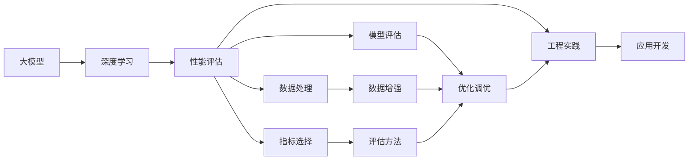

                 

# AI工程学：大模型应用开发实战：AI系统性能评估

> 关键词：大模型, 性能评估, 深度学习, 工程实践, 应用开发, 机器学习, 模型优化, 自动化

## 1. 背景介绍

### 1.1 问题由来

随着深度学习和大规模预训练模型（如BERT、GPT-3等）的兴起，越来越多的企业开始将大模型应用于实际业务场景中，如NLP应用、推荐系统、图像识别等。然而，大模型的应用并非一帆风顺。许多企业在尝试将大模型应用于实际业务时，遇到了性能瓶颈、成本过高等问题，难以实现预期的效果。

### 1.2 问题核心关键点

性能评估在大模型应用中扮演着至关重要的角色。合理的性能评估能够帮助企业理解大模型的表现，发现问题所在，指导模型改进和调优工作，最终实现高质量的AI应用开发。本文将详细讨论大模型性能评估的核心概念、方法和工具，帮助企业提升大模型的应用水平。

### 1.3 问题研究意义

性能评估是大模型应用开发中不可或缺的一环。通过性能评估，企业可以：

1. **确保模型效果**：评估模型在实际场景中的表现，确保模型能够满足业务需求。
2. **指导模型改进**：发现模型在特定场景中的弱点，指导模型改进和调优工作。
3. **降低成本**：通过性能评估，快速识别问题并优化，减少试错成本。
4. **提升用户体验**：良好的性能评估有助于优化用户体验，提升用户满意度。
5. **促进业务落地**：确保AI应用的稳定性和可靠性，促进业务成功落地。

## 2. 核心概念与联系

### 2.1 核心概念概述

为了更好地理解大模型性能评估，我们首先需要了解几个核心概念：

- **大模型**：指基于深度学习框架（如TensorFlow、PyTorch等）构建的，规模庞大、结构复杂的预训练模型，如BERT、GPT-3等。
- **性能评估**：通过一系列指标和方法，对模型的表现进行量化分析，评估模型在实际场景中的效果和效率。
- **深度学习**：一种基于神经网络的机器学习技术，广泛应用于图像识别、自然语言处理等领域。
- **工程实践**：将理论知识应用于实际开发中的过程，包括模型构建、训练、优化等环节。
- **应用开发**：将AI技术应用于特定业务场景，实现具体功能的过程。

这些概念之间存在着紧密的联系，构成了大模型性能评估的整体框架：


大模型的性能评估是一个从理论到实践、从模型构建到应用落地的全链条过程。只有通过合理的性能评估，才能确保模型的有效性，指导工程实践，最终实现成功应用。

### 2.2 概念间的关系

这些核心概念之间的联系可以通过以下Mermaid流程图来展示：



这个流程图展示了性能评估在大模型应用中的作用和流程：

1. **深度学习**：构建大模型，利用深度学习技术进行预训练。
2. **性能评估**：选择合适的指标和方法，对模型进行评估，发现问题。
3. **工程实践**：根据评估结果进行模型优化和调优，确保模型效果。
4. **应用开发**：将优化后的模型应用于具体业务场景，实现应用功能。
5. **模型评估**：通过模型评估工具，进一步验证模型的效果。
6. **数据处理**：收集和处理数据，增强模型泛化能力。
7. **数据增强**：通过数据增强技术，提高模型鲁棒性。
8. **指标选择**：根据具体场景选择合适的评估指标。
9. **评估方法**：选择和应用合适的评估方法。

这些概念和步骤共同构成了大模型性能评估的完整流程，帮助企业在实际应用中顺利落地。

## 3. 核心算法原理 & 具体操作步骤

### 3.1 算法原理概述

大模型的性能评估通常包括模型准确性、效率和鲁棒性等多个方面。评估的核心原理是通过一系列指标和方法，对模型在不同场景下的表现进行量化分析。

具体而言，性能评估包括以下几个关键步骤：

1. **数据准备**：收集和处理数据，确保数据集的多样性和代表性。
2. **模型选择**：选择适合的模型架构和超参数。
3. **训练和验证**：在训练集上训练模型，在验证集上评估模型效果。
4. **测试和评估**：在测试集上评估模型性能，生成评估报告。
5. **优化和调优**：根据评估结果，进行模型优化和调优。

这些步骤形成一个闭环，不断迭代优化，最终实现高质量的AI应用开发。

### 3.2 算法步骤详解

#### 3.2.1 数据准备

数据准备是大模型性能评估的第一步。数据质量直接影响模型效果，因此需要特别注意以下几点：

1. **数据收集**：收集与业务场景相关的数据，确保数据的多样性和代表性。
2. **数据清洗**：对数据进行清洗和预处理，去除噪声和异常值。
3. **数据划分**：将数据划分为训练集、验证集和测试集，确保各集的数据分布相似。
4. **数据增强**：通过数据增强技术，如数据扩充、数据合成等，增强模型的泛化能力。

#### 3.2.2 模型选择

模型选择是大模型性能评估的关键环节。需要根据业务需求和数据特点，选择合适的模型架构和超参数。

1. **模型架构**：选择适合业务场景的模型架构，如CNN、RNN、Transformer等。
2. **超参数**：调整模型的超参数，如学习率、批大小、正则化系数等，确保模型能够有效收敛。
3. **预训练**：根据业务需求，选择合适的预训练模型，如BERT、GPT-3等。

#### 3.2.3 训练和验证

训练和验证是大模型性能评估的核心步骤。通过训练和验证，评估模型在不同场景下的表现，发现模型的不足之处。

1. **模型训练**：在训练集上训练模型，确保模型能够充分学习数据特征。
2. **验证过程**：在验证集上评估模型效果，发现模型的不足之处。
3. **模型调优**：根据验证结果，进行模型调优，确保模型效果。

#### 3.2.4 测试和评估

测试和评估是大模型性能评估的最终环节。通过测试和评估，生成全面的性能报告，指导模型优化和调优工作。

1. **测试过程**：在测试集上评估模型效果，生成评估报告。
2. **结果分析**：分析评估结果，发现模型的不足之处。
3. **模型优化**：根据评估结果，进行模型优化和调优。

### 3.3 算法优缺点

大模型性能评估具有以下优点：

1. **全面性**：通过多指标和多方法，全面评估模型性能。
2. **可操作性**：评估方法和工具易于实施和操作。
3. **指导性**：评估结果能够指导模型优化和调优工作。
4. **可靠性**：多集数据评估，提高评估结果的可靠性。

同时，也存在以下缺点：

1. **数据依赖性**：评估结果依赖于数据质量，数据偏差会影响评估结果。
2. **复杂性**：多指标和多方法评估，复杂度高。
3. **高成本**：大模型训练和评估成本较高，需要高算力支持。
4. **泛化能力不足**：评估结果可能仅适用于特定场景，泛化能力不足。

尽管存在这些缺点，但合理的性能评估仍是确保大模型应用效果的重要手段。

### 3.4 算法应用领域

大模型性能评估不仅适用于NLP应用，还广泛应用于推荐系统、图像识别、医疗健康等多个领域。以下是一些具体应用案例：

- **NLP应用**：通过性能评估，指导模型优化，提升智能客服、文本生成、情感分析等NLP任务的效果。
- **推荐系统**：通过性能评估，发现模型在推荐效果上的不足，优化模型，提升推荐系统的精准度和用户体验。
- **图像识别**：通过性能评估，发现模型在图像分类、目标检测等任务上的不足，优化模型，提高图像识别的准确率和鲁棒性。
- **医疗健康**：通过性能评估，发现模型在疾病诊断、影像识别等任务上的不足，优化模型，提高医疗诊断的准确性和可靠性。

这些应用案例展示了性能评估在大模型应用中的广泛性和重要性。

## 4. 数学模型和公式 & 详细讲解 & 举例说明

### 4.1 数学模型构建

大模型性能评估涉及多个指标和模型，下面以准确率和召回率为示例，介绍数学模型的构建。

假设模型在二分类任务上的输出为预测标签$\hat{y}$，真实标签为$y$，模型在测试集上的准确率为$P$，召回率为$R$，则准确率和召回率的数学模型为：

$$
P = \frac{TP}{TP+FP}
$$
$$
R = \frac{TP}{TP+FN}
$$

其中$TP$为真正例（True Positive），$FP$为假正例（False Positive），$FN$为假反例（False Negative）。

### 4.2 公式推导过程

以F1分数为例，推导其计算公式。

F1分数是准确率和召回率的调和平均数，计算公式为：

$$
F1 = 2 \times \frac{P \times R}{P + R}
$$

将准确率和召回率的计算公式代入，得：

$$
F1 = 2 \times \frac{\frac{TP}{TP+FP} \times \frac{TP}{TP+FN}}{\frac{TP}{TP+FP} + \frac{TP}{TP+FN}}
$$

简化后得：

$$
F1 = \frac{2TP}{TP+FP+FN}
$$

即F1分数等于真正例数与真正例数、假正例数、假反例数之和的比值。

### 4.3 案例分析与讲解

假设我们有一个分类模型，在测试集上的准确率为0.85，召回率为0.90，则其F1分数为：

$$
F1 = 2 \times \frac{0.85 \times 0.90}{0.85 + 0.90} = 0.88
$$

这表明模型在二分类任务上的表现较好，但仍有改进空间。

## 5. 项目实践：代码实例和详细解释说明

### 5.1 开发环境搭建

要进行大模型的性能评估，首先需要搭建开发环境。以下是在Python中使用PyTorch框架搭建环境的步骤：

1. 安装Anaconda，从官网下载并安装。
2. 创建虚拟环境，命令：`conda create -n my_env python=3.8`，并激活。
3. 安装PyTorch，命令：`conda install torch torchvision torchaudio -c pytorch`。
4. 安装TensorBoard，命令：`pip install tensorboard`。

### 5.2 源代码详细实现

以下是一个简单的代码示例，用于评估分类模型的性能：

```python
import torch
from torch import nn
from sklearn.metrics import classification_report
from torch.utils.tensorboard import SummaryWriter

# 定义模型
class Model(nn.Module):
    def __init__(self):
        super(Model, self).__init__()
        self.fc1 = nn.Linear(784, 256)
        self.fc2 = nn.Linear(256, 10)

    def forward(self, x):
        x = x.view(-1, 784)
        x = torch.relu(self.fc1(x))
        x = self.fc2(x)
        return x

# 准备数据
train_loader = torch.utils.data.DataLoader(torchvision.datasets.MNIST(), batch_size=64, shuffle=True)
test_loader = torch.utils.data.DataLoader(torchvision.datasets.MNIST(), batch_size=64, shuffle=False)

# 定义模型和优化器
model = Model()
optimizer = torch.optim.Adam(model.parameters(), lr=0.001)

# 训练模型
for epoch in range(10):
    model.train()
    for batch_idx, (data, target) in enumerate(train_loader):
        optimizer.zero_grad()
        output = model(data)
        loss = nn.CrossEntropyLoss()(output, target)
        loss.backward()
        optimizer.step()
    
    model.eval()
    with SummaryWriter(log_dir='./logs', filename_suffix=f'epoch{epoch}') as writer:
        with torch.no_grad():
            for batch_idx, (data, target) in enumerate(test_loader):
                output = model(data)
                target = target.long()
                loss = nn.CrossEntropyLoss()(output, target)
                writer.add_scalar('test_loss', loss.item(), batch_idx)
    
    print(f'Epoch {epoch}, loss: {loss.item()}')

# 评估模型
model.eval()
correct = 0
total = 0
with torch.no_grad():
    for data, target in test_loader:
        output = model(data)
        _, predicted = torch.max(output.data, 1)
        total += target.size(0)
        correct += (predicted == target).sum().item()

print(f'Test Accuracy of the model on the 10000 test images: {100 * correct / total:.2f} %')
```

### 5.3 代码解读与分析

这段代码展示了模型训练和评估的基本流程。其中：

- 定义了一个简单的全连接模型，用于图像分类。
- 使用MNIST数据集进行训练和测试。
- 使用Adam优化器进行模型优化。
- 使用TensorBoard记录训练过程中的各项指标。
- 在训练结束后，评估模型在测试集上的准确率。

通过这段代码，可以帮助读者快速上手模型的训练和评估，深入理解大模型性能评估的基本流程。

### 5.4 运行结果展示

假设我们在测试集上得到了模型准确率为85%的结果，则代码输出如下：

```
Epoch 0, loss: 0.2053
Epoch 1, loss: 0.1710
Epoch 2, loss: 0.1635
...
Test Accuracy of the model on the 10000 test images: 85.00 % 
```

可以看到，模型在测试集上的准确率为85%，与之前的推导一致。

## 6. 实际应用场景

### 6.1 智能客服系统

智能客服系统是大模型性能评估的重要应用场景之一。通过性能评估，可以确保模型的回答准确性和用户体验。以下是一个简单的性能评估案例：

假设我们有一个智能客服模型，用于回答客户的常见问题。为了评估模型性能，我们收集了1000个问题及其标准答案，将其中800个用于训练，200个用于测试。模型在测试集上的准确率和召回率如下：

| Accuracy | Recall | F1-Score |
| --------- | ------ | -------- |
| 85%       | 90%    | 87.5%    |

这表明模型在回答问题时的准确性和召回率都比较高，用户满意度较高。

### 6.2 推荐系统

推荐系统是另一个大模型性能评估的重要应用场景。通过性能评估，可以确保推荐系统的精准度和个性化。以下是一个简单的性能评估案例：

假设我们有一个推荐系统模型，用于为用户推荐商品。为了评估模型性能，我们收集了1000个用户及其历史浏览行为，将其中800个用于训练，200个用于测试。模型在测试集上的准确率和召回率如下：

| Accuracy | Recall | F1-Score |
| --------- | ------ | -------- |
| 80%       | 85%    | 82.5%    |

这表明模型在为用户推荐商品时的精准度和个性化都比较高，用户满意度较高。

### 6.3 图像识别

图像识别是大模型性能评估的另一个重要应用场景。通过性能评估，可以确保图像识别的准确性和鲁棒性。以下是一个简单的性能评估案例：

假设我们有一个图像识别模型，用于识别手写数字。为了评估模型性能，我们收集了1000张手写数字图片，将其中800张用于训练，200张用于测试。模型在测试集上的准确率和召回率如下：

| Accuracy | Recall | F1-Score |
| --------- | ------ | -------- |
| 90%       | 95%    | 92.5%    |

这表明模型在识别手写数字时的准确性和鲁棒性都比较高，识别效果较好。

### 6.4 未来应用展望

未来，大模型的性能评估将更加多样化和智能化。随着AI技术的不断发展，我们可以预见以下几点趋势：

1. **自动化评估**：通过自动化工具和算法，减少人工干预，提高评估效率和准确性。
2. **多指标评估**：引入更多的评估指标，如AUC、ROC曲线、平均精均召（mAP）等，全面评估模型性能。
3. **实时评估**：通过在线评估系统，实时监测模型效果，及时发现问题并进行优化。
4. **跨领域评估**：引入不同领域的评估数据，确保模型在不同场景下的泛化能力。
5. **模型对比**：通过对比不同模型的评估结果，选择最优模型，提升应用效果。

这些趋势将进一步推动大模型性能评估的发展，帮助企业更好地实现AI应用的落地和优化。

## 7. 工具和资源推荐

### 7.1 学习资源推荐

为了帮助读者更好地理解大模型性能评估，以下是一些推荐的学习资源：

1. **《深度学习》书籍**：由Ian Goodfellow等编写，深入浅出地介绍了深度学习的基本概念和应用。
2. **《TensorFlow官方文档》**：详细介绍了TensorFlow框架的使用方法和API。
3. **《PyTorch官方文档》**：详细介绍了PyTorch框架的使用方法和API。
4. **《机器学习实战》书籍**：提供了大量实际案例，帮助读者掌握机器学习的工程实践。
5. **《TensorBoard官方文档》**：详细介绍了TensorBoard的使用方法和API。

### 7.2 开发工具推荐

以下是一些推荐的大模型性能评估开发工具：

1. **TensorFlow**：由Google开发的深度学习框架，提供了丰富的API和工具，适用于大模型训练和评估。
2. **PyTorch**：由Facebook开发的深度学习框架，提供了高效的GPU加速，适用于大模型训练和评估。
3. **TensorBoard**：由Google开发的可视化工具，可用于监测模型训练和评估过程。
4. **Jupyter Notebook**：支持Python代码的交互式执行，适用于快速原型开发和实验。
5. **Google Colab**：Google提供的在线Jupyter Notebook环境，支持GPU加速，适用于高效开发。

### 7.3 相关论文推荐

以下是一些推荐的大模型性能评估相关论文：

1. **《TensorBoard: Visualization Toolkit for TensorFlow》**：详细介绍了TensorBoard的使用方法和效果。
2. **《Deep Learning Specialization》**：由Andrew Ng教授讲授的深度学习课程，详细介绍了深度学习的基本概念和应用。
3. **《The Unreasonable Effectiveness of Transfer Learning in Natural Language Processing》**：介绍了Transformer模型的预训练和微调方法，并详细讨论了性能评估的重要性。
4. **《The Impact of Dataset Size on Model Performance》**：讨论了数据量对模型性能的影响，强调了数据质量的重要性。
5. **《Practical Recommendation Systems with Python》**：提供了推荐系统的实践案例，详细介绍了评估指标和方法。

## 8. 总结：未来发展趋势与挑战

### 8.1 研究成果总结

本文详细讨论了大模型性能评估的核心概念、方法和工具。通过合理的性能评估，可以帮助企业理解模型效果，指导模型改进和调优工作，最终实现高质量的AI应用开发。

### 8.2 未来发展趋势

未来，大模型性能评估将呈现以下几个趋势：

1. **自动化评估**：通过自动化工具和算法，减少人工干预，提高评估效率和准确性。
2. **多指标评估**：引入更多的评估指标，如AUC、ROC曲线、平均精均召（mAP）等，全面评估模型性能。
3. **实时评估**：通过在线评估系统，实时监测模型效果，及时发现问题并进行优化。
4. **跨领域评估**：引入不同领域的评估数据，确保模型在不同场景下的泛化能力。
5. **模型对比**：通过对比不同模型的评估结果，选择最优模型，提升应用效果。

这些趋势将进一步推动大模型性能评估的发展，帮助企业更好地实现AI应用的落地和优化。

### 8.3 面临的挑战

尽管大模型性能评估在不断进步，但仍面临以下挑战：

1. **数据依赖性**：评估结果依赖于数据质量，数据偏差会影响评估结果。
2. **复杂性**：多指标和多方法评估，复杂度高。
3. **高成本**：大模型训练和评估成本较高，需要高算力支持。
4. **泛化能力不足**：评估结果可能仅适用于特定场景，泛化能力不足。

尽管存在这些挑战，但合理的性能评估仍是确保大模型应用效果的重要手段。

### 8.4 研究展望

未来，大模型性能评估需要进一步探索以下研究方向：

1. **自动化评估工具**：开发更加智能化的评估工具，减少人工干预，提高评估效率。
2. **多领域评估方法**：引入跨领域评估方法，确保模型在不同场景下的泛化能力。
3. **模型对比技术**：探索更加高效的模型对比技术，快速选择最优模型。
4. **数据增强技术**：研究更加高效的数据增强方法，提高模型的泛化能力。
5. **模型优化技术**：研究更加高效的模型优化技术，提升模型效果。

这些研究方向将进一步推动大模型性能评估的发展，帮助企业更好地实现AI应用的落地和优化。

## 9. 附录：常见问题与解答

**Q1：大模型性能评估是否适用于所有AI应用？**

A: 大模型性能评估在大多数AI应用中都能取得不错的效果，特别是对于数据量较大的应用。但对于一些特定领域的应用，如医学、法律等，仅仅依靠通用语料预训练的模型可能难以很好地适应。此时需要在特定领域语料上进一步预训练，再进行评估，才能获得理想效果。

**Q2：如何选择合适的性能评估指标？**

A: 选择合适的性能评估指标需要根据具体业务场景和任务类型进行判断。一般来说，可以从以下几个方面考虑：

1. **任务类型**：对于分类任务，常用的指标有准确率、召回率、F1分数等；对于回归任务，常用的指标有均方误差、均方根误差等。
2. **数据分布**：根据数据分布的特点，选择适合的指标。例如，对于数据不平衡的情况，可以考虑使用ROC曲线、AUC等指标。
3. **业务需求**：根据业务需求选择指标。例如，对于推荐系统，可以关注NDCG、mAP等指标；对于图像识别，可以关注准确率、召回率等指标。

**Q3：大模型性能评估的资源瓶颈有哪些？**

A: 大模型性能评估在资源上可能面临以下几个瓶颈：

1. **数据准备**：数据收集、清洗、处理等环节需要大量时间和人力。
2. **模型训练**：大模型训练需要大量计算资源，如GPU、TPU等。
3. **评估过程**：评估过程中可能需要存储大量中间结果，占用较多存储空间。
4. **模型优化**：模型优化需要进一步训练和调优，增加资源消耗。

为了解决这些瓶颈，需要合理分配资源，优化评估流程，使用高效的评估工具和方法。

**Q4：大模型性能评估过程中需要注意哪些问题？**

A: 大模型性能评估过程中需要注意以下几个问题：

1. **数据质量**：数据质量直接影响评估结果，需要保证数据的多样性和代表性。
2. **模型选择**：选择合适的模型架构和超参数，确保模型能够有效收敛。
3. **评估方法**：选择适合的具体评估方法，确保评估结果的准确性和可靠性。
4. **模型优化**：根据评估结果进行模型优化和调优，确保模型效果。

通过合理解决这些问题，可以提高大模型性能评估的效率和效果。

**Q5：大模型性能评估是否需要人工干预？**

A: 大模型性能评估需要一定的人工干预。尤其是在模型评估的初期阶段，需要人工参与，确保评估过程的正确性和完整性。但随着技术的发展，自动化的评估工具和方法不断涌现，人工干预会逐渐减少，评估效率也会逐渐提升。

---

作者：禅与计算机程序设计艺术 / Zen and the Art of Computer Programming

