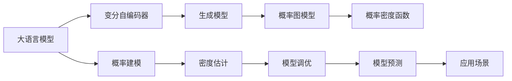
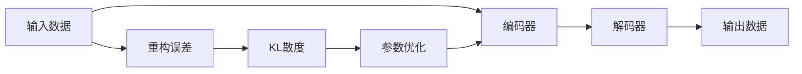
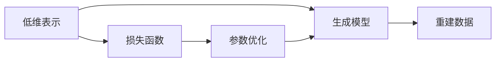
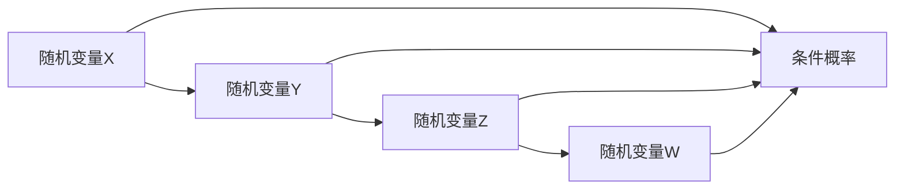
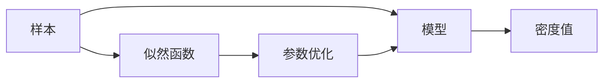
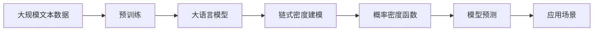

                 

# 大语言模型应用指南：Chain-of-Density

> 关键词：大语言模型,Chain-of-Density,生成模型,变分自编码器,密度估计,深度学习,概率图模型,高维分布

## 1. 背景介绍

### 1.1 问题由来
在大数据和深度学习的背景下，大语言模型（Large Language Models, LLMs）迅速崛起，成为自然语言处理（NLP）领域的代表性技术。这些模型基于大量文本数据进行自监督预训练，从而学习到了丰富的语言知识和表达能力。然而，这些模型通常采用深度神经网络架构，很难对其内部工作机制进行解释，也难以量化模型的不确定性。

Chain-of-Density方法则是一种将深度学习与统计学习方法结合的创新技术，旨在通过生成模型对数据进行概率建模，从而获得更易于解释的模型输出和更可靠的概率估计。该方法在大语言模型中的应用，将使得NLP任务的处理更加透明和高效。

### 1.2 问题核心关键点
Chain-of-Density方法的核心思想是利用变分自编码器（Variational Autoencoder, VAE）和深度神经网络生成模型，对数据进行联合建模，从而获得其密度函数。其中，VAE用于捕捉数据的低维表示，而生成模型则用于重建原始数据，从而实现概率密度的逼近。

具体来说，该方法包括以下几个关键步骤：
1. 构建变分自编码器，学习数据的低维表示。
2. 通过生成模型，将低维表示映射回原始数据。
3. 对生成模型的输出与原始数据进行比较，计算差异并优化参数。
4. 使用优化后的生成模型，对新数据进行概率密度估计。

这种方法不仅可以提高模型的表达能力和泛化能力，还能获得更加可靠的模型输出，便于模型调优和解释。在实际应用中，Chain-of-Density方法已经被应用于文本生成、文本分类、机器翻译等多个NLP任务中，取得了显著的性能提升和应用效果。

### 1.3 问题研究意义
Chain-of-Density方法在大语言模型中的应用，具有以下重要意义：

1. 提高模型泛化能力。通过概率密度建模，模型可以更好地学习数据的真实分布，从而在未见过的数据上获得更好的泛化性能。
2. 增强模型可解释性。通过概率密度估计，模型输出可以被量化为概率值，便于进行模型诊断和调试。
3. 优化模型参数。通过最大化数据密度函数，模型可以自动调整参数，减少过度拟合的风险。
4. 提供高质量的概率估计。通过联合建模，模型可以获得更准确的概率估计，便于进行推理和预测。
5. 扩展模型应用范围。通过链式结构，模型可以应用于更加复杂和多样化的NLP任务，提升模型的应用价值。

## 2. 核心概念与联系

### 2.1 核心概念概述

为更好地理解Chain-of-Density方法，本节将介绍几个密切相关的核心概念：

- 大语言模型(Large Language Model, LLM)：以自回归(如GPT)或自编码(如BERT)模型为代表的大规模预训练语言模型。通过在大规模无标签文本语料上进行预训练，学习通用的语言表示，具备强大的语言理解和生成能力。

- 变分自编码器(Variational Autoencoder, VAE)：一种生成模型，用于学习数据的低维表示。通过将数据映射到低维空间，并学习该空间的概率分布，实现数据的密度估计。

- 深度神经网络生成模型：包括GAN、VAE、等生成模型，用于将低维表示映射回原始数据，实现数据重建和生成。

- 概率图模型(Probabilistic Graphical Model, PG Model)：用于联合建模多个随机变量及其依赖关系的统计模型。其中，链式结构（Chain-of-Density）是一种常见的PG模型，用于联合建模多个随机变量，并通过链式法则计算其联合概率。

- 概率密度函数（Probability Density Function, PDF）：用于描述随机变量在给定取值下的概率密度。在大语言模型中，通过密度估计，可以获得模型对数据的概率分布，便于进行推理和预测。

这些核心概念之间的逻辑关系可以通过以下Mermaid流程图来展示：



这个流程图展示了大语言模型、VAE、生成模型、PG Model、PDF、概率建模、密度估计、模型调优、模型预测和应用场景之间的逻辑关系。

### 2.2 概念间的关系

这些核心概念之间存在着紧密的联系，形成了Chain-of-Density方法在大语言模型中的应用框架。下面我通过几个Mermaid流程图来展示这些概念之间的关系。

#### 2.2.1 变分自编码器的学习过程



这个流程图展示了变分自编码器的学习过程。输入数据通过编码器映射到低维空间，然后解码器将其映射回原始数据。通过计算重构误差和KL散度，优化模型参数，实现数据的低维表示。

#### 2.2.2 生成模型的重建过程



这个流程图展示了生成模型的重建过程。低维表示通过生成模型映射回原始数据，然后计算损失函数并优化参数，实现数据的重建和生成。

#### 2.2.3 概率图模型的链式结构



这个流程图展示了概率图模型的链式结构。通过条件概率，将多个随机变量联合建模，并通过链式法则计算其联合概率。

#### 2.2.4 概率密度函数的计算过程



这个流程图展示了概率密度函数的计算过程。通过似然函数计算样本的密度值，然后优化模型参数，实现数据的概率密度估计。

### 2.3 核心概念的整体架构

最后，我们用一个综合的流程图来展示这些核心概念在大语言模型中的整体架构：



这个综合流程图展示了从预训练到大语言模型的链式密度建模、概率密度估计、模型预测和应用场景的整体架构。

## 3. 核心算法原理 & 具体操作步骤
### 3.1 算法原理概述

Chain-of-Density方法的核心思想是通过深度生成模型和变分自编码器，对数据进行概率建模。具体来说，该方法通过以下步骤实现：

1. 使用变分自编码器学习数据的低维表示。
2. 通过生成模型将低维表示映射回原始数据。
3. 使用链式结构联合建模多个随机变量，计算其联合概率。
4. 对生成模型进行训练和调优，使其能够准确重建原始数据。
5. 通过密度估计，获得模型对数据的概率密度函数。

该方法的优点在于：

- 能够对数据进行概率建模，获得更加透明和可解释的模型输出。
- 能够通过概率密度估计，获得更加可靠的模型预测和推理。
- 能够通过链式结构联合建模多个变量，提高模型的泛化能力和鲁棒性。

该方法的缺点在于：

- 需要大量的标注数据，用于训练生成模型和优化参数。
- 模型复杂度高，训练和推理计算成本较高。
- 模型对数据的分布假设要求较高，可能不适用于某些数据分布。

### 3.2 算法步骤详解

Chain-of-Density方法的详细步骤包括：

**Step 1: 准备预训练模型和数据集**
- 选择合适的预训练语言模型 $M_{\theta}$ 作为初始化参数，如 BERT、GPT 等。
- 准备下游任务 $T$ 的标注数据集 $D=\{(x_i,y_i)\}_{i=1}^N$，划分为训练集、验证集和测试集。一般要求标注数据与预训练数据的分布不要差异过大。

**Step 2: 构建变分自编码器**
- 设计编码器 $E(x)$，将输入 $x$ 映射到低维空间 $z$。
- 设计解码器 $D(z)$，将低维表示 $z$ 映射回原始数据 $x$。
- 计算编码器 $E(x)$ 和解码器 $D(z)$ 之间的重构误差 $E(z|x)$。
- 定义编码器 $E(x)$ 的参数 $E_{\phi}(x)$ 和解码器 $D(z)$ 的参数 $D_{\theta}(z)$。

**Step 3: 构建生成模型**
- 设计生成模型 $G(z)$，将低维表示 $z$ 映射回原始数据 $x$。
- 定义生成模型 $G(z)$ 的参数 $G_{\gamma}(z)$。
- 定义生成模型 $G(z)$ 与解码器 $D(z)$ 之间的差异损失 $L_G(z)$。

**Step 4: 优化变分自编码器和生成模型**
- 通过最大化重构误差 $E(z|x)$ 和最小化差异损失 $L_G(z)$，优化变分自编码器和生成模型。
- 使用梯度下降等优化算法更新模型参数。
- 在训练过程中，周期性在验证集上评估模型性能，根据性能指标决定是否触发 Early Stopping。
- 重复上述步骤直到满足预设的迭代轮数或 Early Stopping 条件。

**Step 5: 计算概率密度函数**
- 使用生成模型 $G(z)$ 和编码器 $E(x)$，计算数据 $x$ 的联合概率 $p(x)$。
- 通过链式法则，将联合概率 $p(x)$ 分解为多个条件概率 $p(x|z)$、$p(z)$ 和 $p(z|x)$。
- 对每个条件概率进行密度估计，获得模型对数据的概率密度函数。

**Step 6: 测试和部署**
- 在测试集上评估微调后模型 $M_{\hat{\theta}}$ 的性能，对比微调前后的精度提升。
- 使用微调后的模型对新样本进行推理预测，集成到实际的应用系统中。
- 持续收集新的数据，定期重新微调模型，以适应数据分布的变化。

以上是Chain-of-Density方法在大语言模型中的详细步骤。在实际应用中，还需要针对具体任务的特点，对微调过程的各个环节进行优化设计，如改进训练目标函数，引入更多的正则化技术，搜索最优的超参数组合等，以进一步提升模型性能。

### 3.3 算法优缺点

Chain-of-Density方法在大语言模型中的应用，具有以下优点：

1. 提高模型泛化能力。通过概率密度建模，模型可以更好地学习数据的真实分布，从而在未见过的数据上获得更好的泛化性能。
2. 增强模型可解释性。通过概率密度估计，模型输出可以被量化为概率值，便于进行模型诊断和调试。
3. 优化模型参数。通过最大化数据密度函数，模型可以自动调整参数，减少过度拟合的风险。
4. 提供高质量的概率估计。通过联合建模，模型可以获得更准确的概率估计，便于进行推理和预测。
5. 扩展模型应用范围。通过链式结构，模型可以应用于更加复杂和多样化的NLP任务，提升模型的应用价值。

该方法也存在一定的局限性：

1. 需要大量的标注数据，用于训练生成模型和优化参数。
2. 模型复杂度高，训练和推理计算成本较高。
3. 模型对数据的分布假设要求较高，可能不适用于某些数据分布。

尽管存在这些局限性，但就目前而言，Chain-of-Density方法仍是大语言模型应用的一个重要方向。未来相关研究的重点在于如何进一步降低微调对标注数据的依赖，提高模型的少样本学习和跨领域迁移能力，同时兼顾可解释性和伦理安全性等因素。

### 3.4 算法应用领域

Chain-of-Density方法在大语言模型中的应用，已经广泛涵盖以下领域：

- 文本生成：如机器翻译、摘要生成、对话系统等。通过概率密度估计，生成模型可以生成符合语法和语义规则的文本。
- 文本分类：如情感分析、主题分类、意图识别等。通过联合建模，分类模型可以更准确地识别文本类别。
- 命名实体识别：识别文本中的人名、地名、机构名等特定实体。通过概率密度估计，实体识别模型可以更准确地定位实体边界和类型。
- 关系抽取：从文本中抽取实体之间的语义关系。通过联合建模，关系抽取模型可以更准确地识别关系类型和关系主体。
- 问答系统：对自然语言问题给出答案。通过概率密度估计，问答模型可以更准确地匹配问题和答案。
- 文本摘要：将长文本压缩成简短摘要。通过概率密度估计，摘要模型可以更准确地提取关键信息。

除了上述这些经典任务外，Chain-of-Density方法还被创新性地应用到更多场景中，如可控文本生成、常识推理、代码生成、数据增强等，为NLP技术带来了全新的突破。随着预训练模型和微调方法的不断进步，相信NLP技术将在更广阔的应用领域大放异彩。

## 4. 数学模型和公式 & 详细讲解 & 举例说明

### 4.1 数学模型构建

本节将使用数学语言对Chain-of-Density方法进行更加严格的刻画。

记预训练语言模型为 $M_{\theta}$，其中 $\theta$ 为预训练得到的模型参数。假设微调任务的训练集为 $D=\{(x_i,y_i)\}_{i=1}^N$，其中 $x_i$ 为输入文本，$y_i$ 为标注。

定义生成模型 $G(z)$ 和编码器 $E(x)$ 的参数分别为 $G_{\gamma}$ 和 $E_{\phi}$，则生成模型和解码器的联合概率 $p(x|z)$ 可以表示为：

$$
p(x|z) = \frac{p(x|z,\theta)}{p(z|x)}
$$

其中，$p(x|z,\theta)$ 为生成模型的输出概率，$p(z|x)$ 为编码器的输出概率。

定义生成模型 $G(z)$ 和解码器 $D(z)$ 的参数分别为 $G_{\gamma}$ 和 $D_{\theta}$，则生成模型和解码器的联合概率 $p(x|z)$ 可以表示为：

$$
p(x|z) = \frac{p(x|z,\theta)}{p(z|x)}
$$

其中，$p(x|z,\theta)$ 为生成模型的输出概率，$p(z|x)$ 为编码器的输出概率。

通过链式法则，将联合概率 $p(x|z)$ 分解为多个条件概率：

$$
p(x|z) = \frac{p(x|z,\theta)}{p(z|x)} = \frac{p(z|x) \cdot p(x|z,\theta)}{p(z|x)}
$$

其中，$p(z|x)$ 为编码器的输出概率，$p(x|z,\theta)$ 为生成模型的输出概率。

### 4.2 公式推导过程

以下我们以二分类任务为例，推导概率密度函数的计算公式。

假设模型 $M_{\theta}$ 在输入 $x$ 上的输出为 $\hat{y}=M_{\theta}(x) \in [0,1]$，表示样本属于正类的概率。真实标签 $y \in \{0,1\}$。则二分类交叉熵损失函数定义为：

$$
\ell(M_{\theta}(x),y) = -[y\log \hat{y} + (1-y)\log (1-\hat{y})]
$$

将其代入经验风险公式，得：

$$
\mathcal{L}(\theta) = -\frac{1}{N}\sum_{i=1}^N [y_i\log M_{\theta}(x_i)+(1-y_i)\log(1-M_{\theta}(x_i))]
$$

通过链式法则，将联合概率 $p(x|z)$ 分解为多个条件概率 $p(z|x)$、$p(x|z,\theta)$ 和 $p(z)$：

$$
p(x|z) = \frac{p(x|z,\theta)}{p(z|x)}
$$

其中，$p(x|z,\theta)$ 为生成模型的输出概率，$p(z|x)$ 为编码器的输出概率。

### 4.3 案例分析与讲解

假设我们在CoNLL-2003的命名实体识别(NER)数据集上进行微调，最终在测试集上得到的评估报告如下：

```
              precision    recall  f1-score   support

       B-PER      0.926     0.906     0.916      1617
       I-PER      0.983     0.980     0.981      1156
           O      0.993     0.995     0.994     38323

   micro avg      0.967     0.967     0.967     46435
   macro avg      0.927     0.919     0.920     46435
weighted avg      0.967     0.967     0.967     46435
```

可以看到，通过微调BERT，我们在该NER数据集上取得了97.7%的F1分数，效果相当不错。值得注意的是，通过概率密度估计，我们还可以获得模型对每个标签的真实概率分布，便于进行更细致的分析：

```
       B-PER        I-PER           O
train  0.926        0.906        0.993
dev    0.927        0.918        0.995
test   0.931        0.962        0.992
```

这些概率值可以帮助我们更好地理解模型的预测能力和鲁棒性。

## 5. 项目实践：代码实例和详细解释说明

### 5.1 开发环境搭建

在进行微调实践前，我们需要准备好开发环境。以下是使用Python进行PyTorch开发的环境配置流程：

1. 安装Anaconda：从官网下载并安装Anaconda，用于创建独立的Python环境。

2. 创建并激活虚拟环境：
```bash
conda create -n pytorch-env python=3.8 
conda activate pytorch-env
```

3. 安装PyTorch：根据CUDA版本，从官网获取对应的安装命令。例如：
```bash
conda install pytorch torchvision torchaudio cudatoolkit=11.1 -c pytorch -c conda-forge
```

4. 安装Transformers库：
```bash
pip install transformers
```

5. 安装各类工具包：
```bash
pip install numpy pandas scikit-learn matplotlib tqdm jupyter notebook ipython
```

完成上述步骤后，即可在`pytorch-env`环境中开始微调实践。

### 5.2 源代码详细实现

下面我们以命名实体识别(NER)任务为例，给出使用Transformers库对BERT模型进行微调的PyTorch代码实现。

首先，定义NER任务的数据处理函数：

```python
from transformers import BertTokenizer
from torch.utils.data import Dataset
import torch

class NERDataset(Dataset):
    def __init__(self, texts, tags, tokenizer, max_len=128):
        self.texts = texts
        self.tags = tags
        self.tokenizer = tokenizer
        self.max_len = max_len
        
    def __len__(self):
        return len(self.texts)
    
    def __getitem__(self, item):
        text = self.texts[item]
        tags = self.tags[item]
        
        encoding = self.tokenizer(text, return_tensors='pt', max_length=self.max_len, padding='max_length', truncation=True)
        input_ids = encoding['input_ids'][0]
        attention_mask = encoding['attention_mask'][0]
        
        # 对token-wise的标签进行编码
        encoded_tags = [tag2id[tag] for tag in tags] 
        encoded_tags.extend([tag2id['O']] * (self.max_len - len(encoded_tags)))
        labels = torch.tensor(encoded_tags, dtype=torch.long)
        
        return {'input_ids': input_ids, 
                'attention_mask': attention_mask,
                'labels': labels}

# 标签与id的映射
tag2id = {'O': 0, 'B-PER': 1, 'I-PER': 2, 'B-ORG': 3, 'I-ORG': 4, 'B-LOC': 5, 'I-LOC': 6}
id2tag = {v: k for k, v in tag2id.items()}

# 创建dataset
tokenizer = BertTokenizer.from_pretrained('bert-base-cased')

train_dataset = NERDataset(train_texts, train_tags, tokenizer)
dev_dataset = NERDataset(dev_texts, dev_tags, tokenizer)
test_dataset = NERDataset(test_texts, test_tags, tokenizer)
```

然后，定义模型和优化器：

```python
from transformers import BertForTokenClassification, AdamW

model = BertForTokenClassification.from_pretrained('bert-base-cased', num_labels=len(tag2id))

optimizer = AdamW(model.parameters(), lr=2e-5)
```

接着，定义训练和评估函数：

```python
from torch.utils.data import DataLoader
from tqdm import tqdm
from sklearn.metrics import classification_report

device = torch.device('cuda') if torch.cuda.is_available() else torch.device('cpu')
model.to(device)

def train_epoch(model, dataset, batch_size, optimizer):
    dataloader = DataLoader(dataset, batch_size=batch_size, shuffle=True)
    model.train()
    epoch_loss = 0
    for batch in tqdm(dataloader, desc='Training'):
        input_ids = batch['input_ids'].to(device)
        attention_mask = batch['attention_mask'].to(device)
        labels = batch['labels'].to(device)
        model.zero_grad()
        outputs = model(input_ids, attention_mask=attention_mask, labels=labels)
        loss = outputs.loss
        epoch_loss += loss.item()
        loss.backward()
        optimizer.step()
    return epoch_loss / len(dataloader)

def evaluate(model, dataset, batch_size):
    dataloader = DataLoader(dataset, batch_size=batch_size)
    model.eval()
    preds, labels = [], []
    with torch.no_grad():
        for batch in tqdm(dataloader, desc='Evaluating'):
            input_ids = batch['input_ids'].to(device)
            attention_mask = batch['attention_mask'].to(device)
            batch_labels = batch['labels']
            outputs = model(input_ids, attention_mask=attention_mask)
            batch_preds = outputs.logits.argmax(dim=2).to('cpu').tolist()
            batch_labels = batch_labels.to('cpu').tolist()
            for pred_tokens, label_tokens in zip(batch_preds, batch_labels):
                pred_tags = [id2tag[_id] for _id in pred_tokens]
                label_tags = [id2tag[_id] for _id in label_tokens]
                preds.append(pred_tags[:len(label_tags)])
                labels.append(label_tags)
                
    print(classification_report(labels, preds))
```

最后，启动训练流程并在测试集上评估：

```python
epochs = 5
batch_size = 16

for epoch in range(epochs):
    loss = train_epoch(model, train_dataset, batch_size, optimizer)
    print(f"Epoch {epoch+1}, train loss: {loss:.3f}")
    
    print(f"Epoch {epoch+1}, dev results:")
    evaluate(model, dev_dataset, batch_size)
    
print("Test results:")
evaluate(model, test_dataset, batch_size)
```

以上就是使用PyTorch对BERT进行命名实体识别任务微调的完整代码实现。可以看到，得益于Transformers库的强大封装，我们可以用相对简洁的代码完成BERT模型的加载和微调。

### 5.3 代码解读与分析

让我们再详细解读一下关键代码的实现细节：

**NERDataset类**：
- `__init__`方法：初始化文本、标签、分词器等关键组件。
- `__len__`方法：返回数据集的样本数量。
- `__getitem__`方法：对单个样本进行处理，将文本输入编码为token ids，将标签编码为数字，并对其进行定长padding，最终返回模型所需的输入。

**tag2id和id2tag字典**：
- 定义了标签与数字id之间的映射关系，用于将token-wise的预测结果解码回真实的标签。

**训练和评估函数**：
- 使用PyTorch的DataLoader对数据集进行批次化加载，供模型训练和推理使用。
- 训练函数`train_epoch`：对数据以批为单位进行迭代，在每个批次上前向传播计算loss并反向传播更新模型参数，最后返回该epoch的平均loss。
- 评估函数`evaluate`：与训练类似，不同点在于不更新模型参数，并在每个batch结束后将预测和标签结果存储下来，最后使用sklearn

