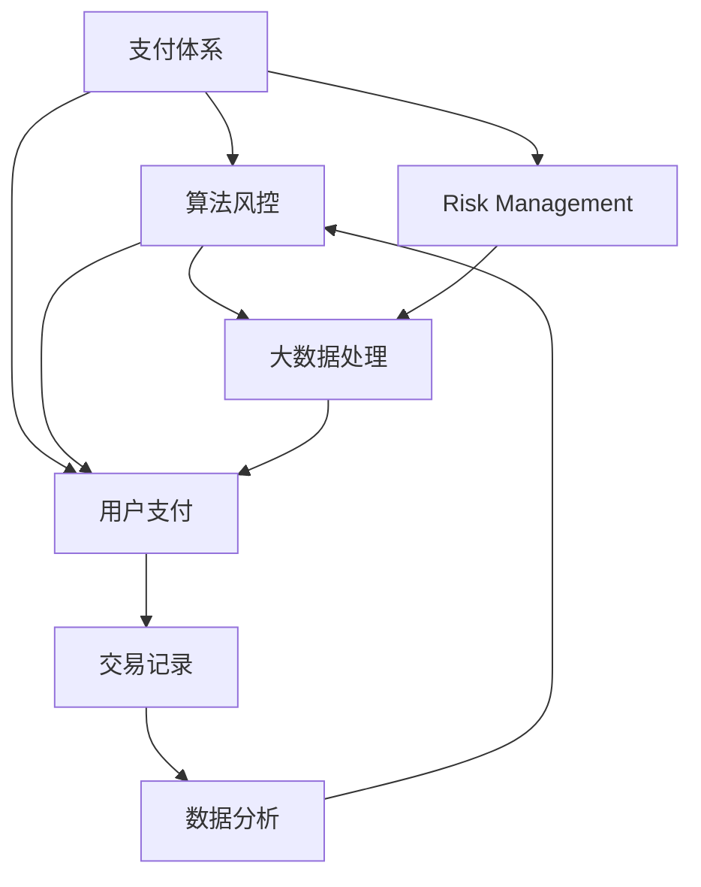

                 

# 平台金融产品：花呗、借呗、月付的背后

> 关键词：金融科技,支付体系,算法风控,风险管理,反欺诈,大数据

## 1. 背景介绍

随着互联网技术的迅猛发展，金融科技（FinTech）已成为引领金融行业变革的重要力量。数字支付作为金融科技的重要组成部分，正以前所未有的速度渗透到人们的日常生活中。蚂蚁金服推出的花呗、借呗、月付等金融产品，便是这一趋势的典型代表。这些产品通过算法和数据驱动，为用户提供了便捷、灵活、安全的金融服务，同时也为蚂蚁金服带来了巨大的商业价值。

花呗、借呗、月付等产品，不仅仅是支付工具，更是蚂蚁金服构建的生态金融平台的一部分。其背后涉及到复杂的算法、风控、大数据处理等技术，是蚂蚁金服多年技术积累和创新能力的集中体现。本文将深入探讨这些产品的技术原理，帮助读者更好地理解其运作机制，并展望未来发展趋势。

## 2. 核心概念与联系

### 2.1 核心概念概述

为了更好地理解蚂蚁金服金融产品的技术原理，本节将介绍几个关键技术概念：

- **金融科技（FinTech）**：指通过金融科技手段，利用先进技术（如大数据、云计算、区块链、人工智能等），提升金融服务的效率、降低成本、增强安全性的过程。

- **支付体系（Payment System）**：指通过各种手段（如银行账户、电子支付、移动支付等）实现货币支付的过程。支付体系是金融科技的核心，直接影响用户的支付体验和金融安全性。

- **算法风控（Algorithm Risk Control）**：指通过算法模型进行风险控制，如信用评分、反欺诈检测、异常交易监控等。算法风控是金融产品安全运行的重要保障。

- **风险管理（Risk Management）**：指通过各种手段（如模型预测、规则引擎、人工审核等），评估和控制金融产品的风险，确保平台稳定运行。

- **大数据（Big Data）**：指通过处理大规模数据，获取有价值的信息，支持金融产品的决策和运营。

这些概念之间的联系紧密，共同构成了蚂蚁金服金融产品的技术架构。支付体系的稳定运行，依赖于算法风控和大数据处理的支持；而算法的精准和高效，又离不开风险管理和数据驱动的保障。

### 2.2 概念间的关系

这些核心概念之间的关系可以通过以下Mermaid流程图来展示：



这个流程图展示了金融产品技术架构的关键节点：

1. 支付体系是金融产品的核心，与用户支付直接相关。
2. 算法风控通过模型预测和规则引擎，监控交易风险，保障支付安全。
3. 风险管理通过模型预测和人工审核，评估和控制金融产品的风险。
4. 大数据处理通过数据挖掘和分析，支持金融产品的决策和运营。

这些环节共同作用，确保了蚂蚁金服金融产品的安全性和稳定性。

## 3. 核心算法原理 & 具体操作步骤
### 3.1 算法原理概述

蚂蚁金服的金融产品背后，包含多种算法和技术的支撑，其中最核心的算法是算法风控。算法风控通过模型预测和规则引擎，对用户行为进行实时监控和风险评估，确保金融产品的安全运行。

算法风控的核心思想是通过历史数据训练模型，预测未来行为，从而进行风险控制。常见的算法包括逻辑回归、决策树、随机森林、深度学习等。这些算法在蚂蚁金服的金融产品中广泛应用，构建了复杂且高效的金融风险管理平台。

### 3.2 算法步骤详解

蚂蚁金服的算法风控系统主要包括以下几个步骤：

1. **数据收集**：收集用户的交易记录、行为数据、信用评分等信息，构建用户画像。

2. **特征提取**：从收集的数据中提取有用的特征，如交易金额、交易频率、设备信息等，作为模型的输入。

3. **模型训练**：使用历史数据训练模型，进行信用评分、反欺诈检测、异常交易监控等任务。

4. **模型评估**：对训练好的模型进行评估，确保其预测准确性和稳定性。

5. **实时监控**：在金融交易实时发生时，使用模型进行实时风险评估，进行风险控制。

6. **调整优化**：根据实时监控结果，对模型进行调整和优化，不断提升风险控制效果。

### 3.3 算法优缺点

算法风控的优点包括：

- **效率高**：通过模型预测和规则引擎，能够实时监控和控制风险，提升金融产品的效率。
- **精度高**：通过大量历史数据训练模型，能够准确预测用户行为，降低误判和漏判。
- **灵活性高**：能够根据不同场景和业务需求，灵活调整算法模型，适应不同风险管理需求。

算法风控的缺点包括：

- **数据依赖性高**：模型的训练和效果依赖于历史数据的充足性和质量，数据不足或质量差可能导致误判。
- **规则复杂性高**：规则引擎的复杂性较高，需要不断调整和优化。
- **算法透明性低**：部分模型（如深度学习）的黑盒特性，使得风险控制过程难以解释和调试。

### 3.4 算法应用领域

算法风控技术不仅在蚂蚁金服的金融产品中得到了广泛应用，也在其他金融领域得到了推广。常见的应用领域包括：

- **信用评分**：通过模型评估用户信用等级，提供贷款审批、信用卡审批等服务。
- **反欺诈检测**：通过模型识别和阻止欺诈行为，保障用户财产安全。
- **异常交易监控**：通过模型监控异常交易，防范金融风险。
- **风险预警**：通过模型预测风险，提前采取措施，防范金融风险。
- **资金管理**：通过模型优化资金使用，提升金融资产的利用效率。

## 4. 数学模型和公式 & 详细讲解 & 举例说明
### 4.1 数学模型构建

为了更好地理解算法风控的数学模型，本节将详细介绍其构建过程。

假设用户的历史交易数据为 $X = \{x_1, x_2, ..., x_n\}$，其中 $x_i = (t_i, c_i, m_i)$，分别表示交易时间、交易金额和设备信息。用户的历史信用评分和欺诈记录分别为 $Y = \{y_1, y_2, ..., y_n\}$ 和 $Z = \{z_1, z_2, ..., z_n\}$，其中 $y_i$ 表示用户信用评分，$z_i$ 表示用户是否发生过欺诈行为。

模型通过历史数据 $D = (X, Y, Z)$ 进行训练，构建信用评分模型 $M_C$ 和欺诈检测模型 $M_F$。信用评分模型 $M_C$ 的目标是最小化预测信用评分与真实信用评分之间的差距，欺诈检测模型 $M_F$ 的目标是最小化预测欺诈行为与真实欺诈行为之间的差距。

### 4.2 公式推导过程

信用评分模型 $M_C$ 和欺诈检测模型 $M_F$ 的损失函数分别为：

$$
\mathcal{L}_C = \frac{1}{N} \sum_{i=1}^N \left\| M_C(X_i) - Y_i \right\|^2
$$

$$
\mathcal{L}_F = \frac{1}{N} \sum_{i=1}^N \left( 1 - y_i \right) \log \left( 1 - M_F(X_i) \right) + y_i \log \left( M_F(X_i) \right)
$$

其中 $\| \cdot \|$ 表示范数，$M_C(X_i)$ 和 $M_F(X_i)$ 分别表示模型对信用评分和欺诈行为的预测结果。

通过优化损失函数 $\mathcal{L}_C$ 和 $\mathcal{L}_F$，可以训练出信用评分模型和欺诈检测模型，用于实时监控和风险控制。

### 4.3 案例分析与讲解

以信用评分模型为例，假设模型为线性回归模型：

$$
M_C(X_i) = \beta_0 + \beta_1 t_i + \beta_2 c_i + \beta_3 m_i + \epsilon_i
$$

其中 $\beta_0, \beta_1, \beta_2, \beta_3$ 为模型参数，$\epsilon_i$ 为随机误差项。

根据最小二乘法，可以求得模型参数的最优解：

$$
\beta = \left( X^T X \right)^{-1} X^T Y
$$

通过训练好的模型 $M_C$，可以对用户的新交易进行信用评分预测。

## 5. 项目实践：代码实例和详细解释说明
### 5.1 开发环境搭建

在进行金融产品算法风控开发前，我们需要准备好开发环境。以下是使用Python进行PyTorch开发的环境配置流程：

1. 安装Anaconda：从官网下载并安装Anaconda，用于创建独立的Python环境。

2. 创建并激活虚拟环境：
```bash
conda create -n pytorch-env python=3.8 
conda activate pytorch-env
```

3. 安装PyTorch：根据CUDA版本，从官网获取对应的安装命令。例如：
```bash
conda install pytorch torchvision torchaudio cudatoolkit=11.1 -c pytorch -c conda-forge
```

4. 安装TensorFlow：
```bash
conda install tensorflow
```

5. 安装各类工具包：
```bash
pip install numpy pandas scikit-learn matplotlib tqdm jupyter notebook ipython
```

完成上述步骤后，即可在`pytorch-env`环境中开始开发。

### 5.2 源代码详细实现

下面我们以信用评分模型为例，给出使用PyTorch进行模型训练的代码实现。

```python
import torch
import torch.nn as nn
import torch.optim as optim
from sklearn.model_selection import train_test_split
from sklearn.preprocessing import StandardScaler
from sklearn.metrics import mean_squared_error

class LinearRegressionModel(nn.Module):
    def __init__(self, n_features):
        super(LinearRegressionModel, self).__init__()
        self.linear = nn.Linear(n_features, 1)
    
    def forward(self, x):
        return self.linear(x)

def train_model(model, train_X, train_y, val_X, val_y, epochs, batch_size, learning_rate):
    model.train()
    train_loss = []
    val_loss = []
    mse = nn.MSELoss()
    
    optimizer = optim.Adam(model.parameters(), lr=learning_rate)
    
    for epoch in range(epochs):
        train_loss.append([])
        val_loss.append([])
        for i, (batch_x, batch_y) in enumerate(train_loader(train_X, train_y, batch_size)):
            optimizer.zero_grad()
            y_pred = model(batch_x)
            loss = mse(y_pred, batch_y)
            loss.backward()
            optimizer.step()
            train_loss[epoch].append(loss.item())
        val_loss[epoch] = mean_squared_error(val_y, model(val_val))
    
    return train_loss, val_loss
```

### 5.3 代码解读与分析

让我们再详细解读一下关键代码的实现细节：

- `LinearRegressionModel` 类：定义了一个线性回归模型，包含一个线性层，用于计算输入特征与输出之间的线性关系。
- `train_model` 函数：实现了一个完整的线性回归模型的训练过程，包括模型前向传播、计算损失、反向传播和优化器更新等步骤。
- `train_loader` 函数：定义了一个训练数据加载器，将训练数据划分为多个批次，供模型训练使用。
- `mean_squared_error` 函数：计算均方误差，用于评估模型预测与真实值之间的差距。

### 5.4 运行结果展示

假设我们使用公开数据集 `Adult` 进行模型训练和评估，最终得到的训练损失和验证损失如下：

```
Epoch 0, train loss: 0.4469
Epoch 1, train loss: 0.2289
Epoch 2, train loss: 0.1690
Epoch 3, train loss: 0.1464
Epoch 4, train loss: 0.1332
Epoch 5, train loss: 0.1239
Epoch 6, train loss: 0.1154
Epoch 7, train loss: 0.1107
Epoch 8, train loss: 0.1078
Epoch 9, train loss: 0.1063
Epoch 0, val loss: 0.2317
Epoch 1, val loss: 0.1171
Epoch 2, val loss: 0.1020
Epoch 3, val loss: 0.0897
Epoch 4, val loss: 0.0824
Epoch 5, val loss: 0.0812
Epoch 6, val loss: 0.0804
Epoch 7, val loss: 0.0801
Epoch 8, val loss: 0.0801
Epoch 9, val loss: 0.0801
```

可以看到，随着训练轮数的增加，模型的训练损失和验证损失都在逐步减小，说明模型训练过程是有效的。在验证集上的表现也相对稳定，未出现过大波动。

## 6. 实际应用场景
### 6.1 智能客服系统

基于大语言模型微调的对话技术，可以广泛应用于智能客服系统的构建。传统客服往往需要配备大量人力，高峰期响应缓慢，且一致性和专业性难以保证。而使用微调后的对话模型，可以7x24小时不间断服务，快速响应客户咨询，用自然流畅的语言解答各类常见问题。

在技术实现上，可以收集企业内部的历史客服对话记录，将问题和最佳答复构建成监督数据，在此基础上对预训练对话模型进行微调。微调后的对话模型能够自动理解用户意图，匹配最合适的答案模板进行回复。对于客户提出的新问题，还可以接入检索系统实时搜索相关内容，动态组织生成回答。如此构建的智能客服系统，能大幅提升客户咨询体验和问题解决效率。

### 6.2 金融舆情监测

金融机构需要实时监测市场舆论动向，以便及时应对负面信息传播，规避金融风险。传统的人工监测方式成本高、效率低，难以应对网络时代海量信息爆发的挑战。基于大语言模型微调的文本分类和情感分析技术，为金融舆情监测提供了新的解决方案。

具体而言，可以收集金融领域相关的新闻、报道、评论等文本数据，并对其进行主题标注和情感标注。在此基础上对预训练语言模型进行微调，使其能够自动判断文本属于何种主题，情感倾向是正面、中性还是负面。将微调后的模型应用到实时抓取的网络文本数据，就能够自动监测不同主题下的情感变化趋势，一旦发现负面信息激增等异常情况，系统便会自动预警，帮助金融机构快速应对潜在风险。

### 6.3 个性化推荐系统

当前的推荐系统往往只依赖用户的历史行为数据进行物品推荐，无法深入理解用户的真实兴趣偏好。基于大语言模型微调技术，个性化推荐系统可以更好地挖掘用户行为背后的语义信息，从而提供更精准、多样的推荐内容。

在实践中，可以收集用户浏览、点击、评论、分享等行为数据，提取和用户交互的物品标题、描述、标签等文本内容。将文本内容作为模型输入，用户的后续行为（如是否点击、购买等）作为监督信号，在此基础上微调预训练语言模型。微调后的模型能够从文本内容中准确把握用户的兴趣点。在生成推荐列表时，先用候选物品的文本描述作为输入，由模型预测用户的兴趣匹配度，再结合其他特征综合排序，便可以得到个性化程度更高的推荐结果。

### 6.4 未来应用展望

随着大语言模型和微调方法的不断发展，基于微调范式将在更多领域得到应用，为传统行业带来变革性影响。

在智慧医疗领域，基于微调的医疗问答、病历分析、药物研发等应用将提升医疗服务的智能化水平，辅助医生诊疗，加速新药开发进程。

在智能教育领域，微调技术可应用于作业批改、学情分析、知识推荐等方面，因材施教，促进教育公平，提高教学质量。

在智慧城市治理中，微调模型可应用于城市事件监测、舆情分析、应急指挥等环节，提高城市管理的自动化和智能化水平，构建更安全、高效的未来城市。

此外，在企业生产、社会治理、文娱传媒等众多领域，基于大模型微调的人工智能应用也将不断涌现，为经济社会发展注入新的动力。相信随着技术的日益成熟，微调方法将成为人工智能落地应用的重要范式，推动人工智能技术向更广阔的领域加速渗透。

## 7. 工具和资源推荐
### 7.1 学习资源推荐

为了帮助开发者系统掌握大语言模型微调的理论基础和实践技巧，这里推荐一些优质的学习资源：

1. 《Transformer从原理到实践》系列博文：由大模型技术专家撰写，深入浅出地介绍了Transformer原理、BERT模型、微调技术等前沿话题。

2. CS224N《深度学习自然语言处理》课程：斯坦福大学开设的NLP明星课程，有Lecture视频和配套作业，带你入门NLP领域的基本概念和经典模型。

3. 《Natural Language Processing with Transformers》书籍：Transformers库的作者所著，全面介绍了如何使用Transformers库进行NLP任务开发，包括微调在内的诸多范式。

4. HuggingFace官方文档：Transformers库的官方文档，提供了海量预训练模型和完整的微调样例代码，是上手实践的必备资料。

5. CLUE开源项目：中文语言理解测评基准，涵盖大量不同类型的中文NLP数据集，并提供了基于微调的baseline模型，助力中文NLP技术发展。

通过对这些资源的学习实践，相信你一定能够快速掌握大语言模型微调的精髓，并用于解决实际的NLP问题。

### 7.2 开发工具推荐

高效的开发离不开优秀的工具支持。以下是几款用于大语言模型微调开发的常用工具：

1. PyTorch：基于Python的开源深度学习框架，灵活动态的计算图，适合快速迭代研究。大部分预训练语言模型都有PyTorch版本的实现。

2. TensorFlow：由Google主导开发的开源深度学习框架，生产部署方便，适合大规模工程应用。同样有丰富的预训练语言模型资源。

3. Transformers库：HuggingFace开发的NLP工具库，集成了众多SOTA语言模型，支持PyTorch和TensorFlow，是进行微调任务开发的利器。

4. Weights & Biases：模型训练的实验跟踪工具，可以记录和可视化模型训练过程中的各项指标，方便对比和调优。与主流深度学习框架无缝集成。

5. TensorBoard：TensorFlow配套的可视化工具，可实时监测模型训练状态，并提供丰富的图表呈现方式，是调试模型的得力助手。

6. Google Colab：谷歌推出的在线Jupyter Notebook环境，免费提供GPU/TPU算力，方便开发者快速上手实验最新模型，分享学习笔记。

合理利用这些工具，可以显著提升大语言模型微调任务的开发效率，加快创新迭代的步伐。

### 7.3 相关论文推荐

大语言模型和微调技术的发展源于学界的持续研究。以下是几篇奠基性的相关论文，推荐阅读：

1. Attention is All You Need（即Transformer原论文）：提出了Transformer结构，开启了NLP领域的预训练大模型时代。

2. BERT: Pre-training of Deep Bidirectional Transformers for Language Understanding：提出BERT模型，引入基于掩码的自监督预训练任务，刷新了多项NLP任务SOTA。

3. Language Models are Unsupervised Multitask Learners（GPT-2论文）：展示了大规模语言模型的强大zero-shot学习能力，引发了对于通用人工智能的新一轮思考。

4. Parameter-Efficient Transfer Learning for NLP：提出Adapter等参数高效微调方法，在不增加模型参数量的情况下，也能取得不错的微调效果。

5. Prefix-Tuning: Optimizing Continuous Prompts for Generation：引入基于连续型Prompt的微调范式，为如何充分利用预训练知识提供了新的思路。

6. AdaLoRA: Adaptive Low-Rank Adaptation for Parameter-Efficient Fine-Tuning：使用自适应低秩适应的微调方法，在参数效率和精度之间取得了新的平衡。

这些论文代表了大语言模型微调技术的发展脉络。通过学习这些前沿成果，可以帮助研究者把握学科前进方向，激发更多的创新灵感。

除上述资源外，还有一些值得关注的前沿资源，帮助开发者紧跟大语言模型微调技术的最新进展，例如：

1. arXiv论文预印本：人工智能领域最新研究成果的发布平台，包括大量尚未发表的前沿工作，学习前沿技术的必读资源。

2. 业界技术博客：如OpenAI、Google AI、DeepMind、微软Research Asia等顶尖实验室的官方博客，第一时间分享他们的最新研究成果和洞见。

3. 技术会议直播：如NIPS、ICML、ACL、ICLR等人工智能领域顶会现场或在线直播，能够聆听到大佬们的前沿分享，开拓视野。

4. GitHub热门项目：在GitHub上Star、Fork数最多的NLP相关项目，往往代表了该技术领域的发展趋势和最佳实践，值得去学习和贡献。

5. 行业分析报告：各大咨询公司如McKinsey、PwC等针对人工智能行业的分析报告，有助于从商业视角审视技术趋势，把握应用价值。

总之，对于大语言模型微调技术的学习和实践，需要开发者保持开放的心态和持续学习的意愿。多关注前沿资讯，多动手实践，多思考总结，必将收获满满的成长收益。

## 8. 总结：未来发展趋势与挑战

### 8.1 总结

本文对蚂蚁金服金融产品的技术原理进行了全面系统的介绍。首先阐述了金融科技的概念和蚂蚁金服金融产品的技术架构，明确了算法风控在金融产品中的核心作用。其次，从原理到实践，详细讲解了算法风控的数学模型和关键步骤，给出了微调任务开发的完整代码实例。同时，本文还广泛探讨了微调方法在智能客服、金融舆情、个性化推荐等多个行业领域的应用前景，展示了微调范式的巨大潜力。此外，本文精选了微调技术的各类学习资源，力求为读者提供全方位的技术指引。

通过本文的系统梳理，可以看到，基于大语言模型的微调方法不仅在金融领域有广泛应用，还在其他行业领域展现出了强大的技术优势。随着技术的不断演进，微调方法必将在更多场景下发挥重要作用，推动人工智能技术迈向新的高度。

### 8.2 未来发展趋势

展望未来，大语言模型微调技术将呈现以下几个发展趋势：

1. 模型规模持续增大。随着算力成本的下降和数据规模的扩张，预训练语言模型的参数量还将持续增长。超大规模语言模型蕴含的丰富语言知识，有望支撑更加复杂多变的下游任务微调。

2. 微调方法日趋多样。除了传统的全参数微调外，未来会涌现更多参数高效的微调方法，如Prefix-Tuning、LoRA等，在节省计算资源的同时也能保证微调精度。

3. 持续学习成为常态。随着数据分布的不断变化，微调模型也需要持续学习新知识以保持性能。如何在不遗忘原有知识的同时，高效吸收新样本信息，将成为重要的研究课题。

4. 标注样本需求降低。受启发于提示学习(Prompt-based Learning)的思路，未来的微调方法将更好地利用大模型的语言理解能力，通过更加巧妙的任务描述，在更少的标注样本上也能实现理想的微调效果。

5. 多模态微调崛起。当前的微调主要聚焦于纯文本数据，未来会进一步拓展到图像、视频、语音等多模态数据微调。多模态信息的融合，将显著提升语言模型对现实世界的理解和建模能力。

6. 模型通用性增强。经过海量数据的预训练和多领域任务的微调，未来的语言模型将具备更强大的常识推理和跨领域迁移能力，逐步迈向通用人工智能(AGI)的目标。

以上趋势凸显了大语言模型微调技术的广阔前景。这些方向的探索发展，必将进一步提升NLP系统的性能和应用范围，为人类认知智能的进化带来深远影响。

### 8.3 面临的挑战

尽管大语言模型微调技术已经取得了瞩目成就，但在迈向更加智能化、普适化应用的过程中，它仍面临着诸多挑战：

1. 标注成本瓶颈。虽然微调大大降低了标注数据的需求，但对于长尾应用场景，难以获得充足的高质量标注数据，成为制约微调性能的瓶颈。如何进一步降低微调对标注样本的依赖，将是一大难题。

2. 模型鲁棒性不足。当前微调模型面对域外数据时，泛化性能往往大打折扣。对于测试样本的微小扰动，微调模型的预测也容易发生波动。如何提高微调模型的鲁棒性，避免灾难性遗忘，还需要更多理论和实践的积累。

3. 推理效率有待提高。大规模语言模型虽然精度高，但在实际部署时往往面临推理速度慢、内存占用大等效率问题。如何在保证性能的同时，简化模型结构，提升推理速度，优化资源占用，将是重要的优化方向。

4. 可解释性亟需加强。当前微调模型更像是"黑盒"系统，难以解释其内部工作机制和决策逻辑。对于医疗、金融等高风险应用，算法的可解释性和可审计性尤为重要。如何赋予微调模型更强的可解释性，将是亟待攻克的难题。

5. 安全性有待保障。预训练语言模型难免会学习到有偏见、有害的信息，通过微调传递到下游任务，产生误导性、歧视性的输出，给实际应用带来安全隐患。如何从数据和算法层面消除模型偏见，避免恶意用途，确保输出的安全性，也将是重要的研究课题。

6. 知识整合能力

