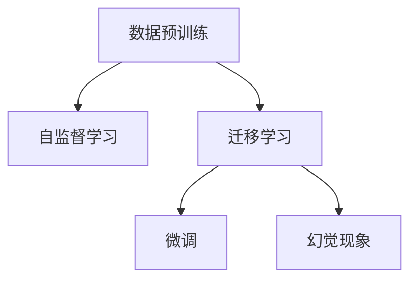
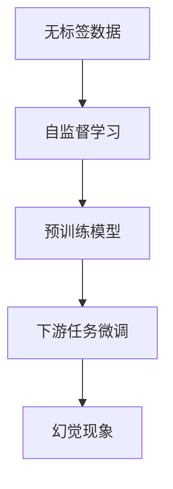
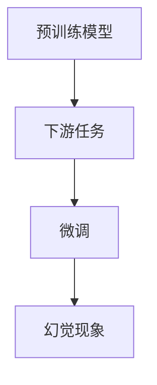
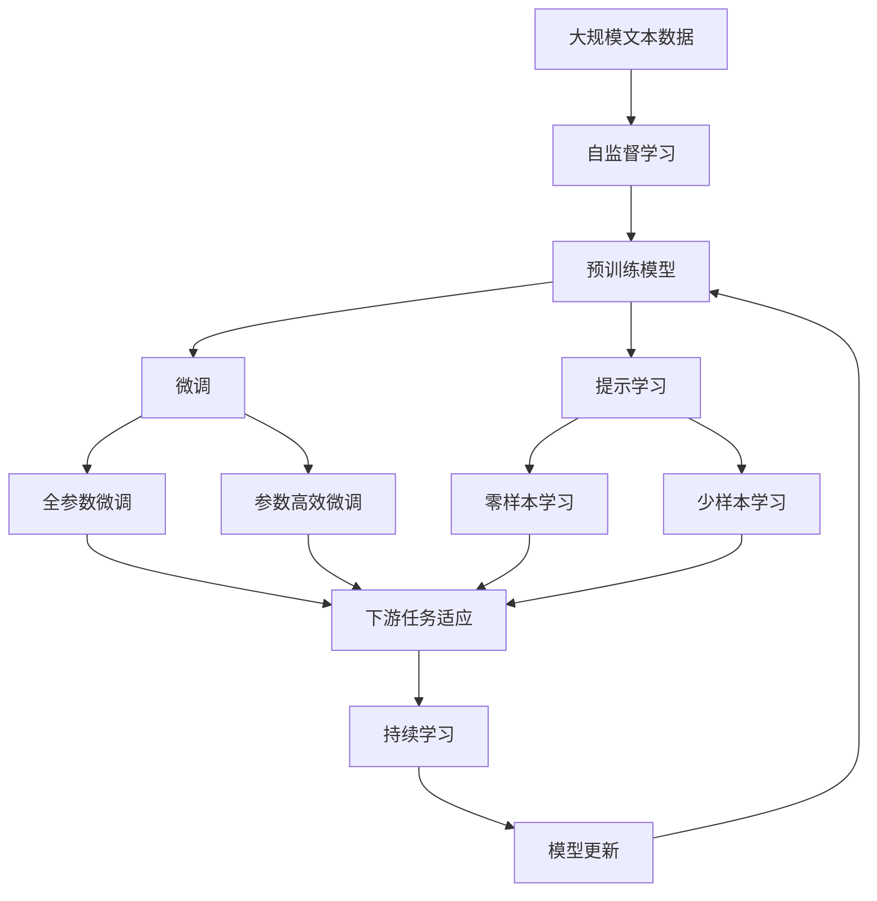

                 

# 幻觉来自数据预训练数据

在人工智能领域，深度学习和机器学习已经成为实现复杂任务的关键技术。然而，最近的一些研究揭示了一个重要的现象：许多预训练模型和基于预训练模型的方法会产生幻觉，即模型对于未见过的数据表现出与训练数据相关的幻觉，而不是基于数据本身的真实特征。这种幻觉现象揭示了数据预训练过程中的一些根本问题，同时也指出了未来研究的重要方向。本文将深入探讨这一现象，并提出一些可能的解决方案。

## 1. 背景介绍

### 1.1 问题由来
深度学习模型，尤其是那些使用预训练技术（如自监督预训练、迁移学习等）训练的模型，在处理大量数据时，能够学习到许多通用的特征表示。这些特征表示被广泛应用于各种自然语言处理（NLP）任务中，如文本分类、语言建模、机器翻译等。然而，近年来，一些研究表明，这些模型在未见过的数据上表现出强烈的幻觉现象。

例如，OpenAI的GPT系列模型在训练过程中，被发现在未见过的数据上表现出对特定主题的幻觉，如政治、科技等。这意味着，模型在未见过的数据上，倾向于生成与训练数据主题相关的输出，而非基于真实数据本身的输出。这种幻觉现象不仅影响了模型的性能，也使得模型难以被正确应用。

### 1.2 问题核心关键点
幻觉现象的核心在于，模型在未见过的数据上，倾向于生成与训练数据相关的输出，而非基于数据本身的真实特征。这种幻觉现象的产生，可能是由于数据预训练过程中的以下问题：

- **数据偏差**：预训练数据集中存在的偏差，如性别偏见、地区偏见等，导致模型在未见过的数据上表现出对这些偏差的幻觉。
- **知识遗忘**：模型在预训练和微调过程中，可能会遗忘一部分学到的知识，导致在未见过的数据上表现出幻觉现象。
- **过拟合**：预训练过程中，模型可能过拟合于训练数据，使得模型在未见过的数据上表现出幻觉现象。
- **泛化能力不足**：预训练模型的泛化能力不足，导致在未见过的数据上表现出幻觉现象。

### 1.3 问题研究意义
研究幻觉现象对于深度学习模型的理解和改进具有重要意义。理解幻觉现象的成因，可以帮助我们改进模型的预训练和微调过程，提高模型的泛化能力和公平性，确保模型在实际应用中的可靠性。此外，研究幻觉现象也有助于我们更好地理解数据预训练技术的局限性，为未来的研究提供指导。

## 2. 核心概念与联系

### 2.1 核心概念概述

为了更好地理解幻觉现象，我们首先需要了解一些关键的概念：

- **数据预训练（Data Pretraining）**：在深度学习中，数据预训练是指在无标签数据上对模型进行训练，以学习通用的特征表示。这些特征表示可以被用于下游任务的微调。
- **自监督学习（Self-Supervised Learning）**：自监督学习是一种在无标签数据上训练模型的方法，通过设计一些任务（如语言建模、掩码预测等）来训练模型，学习到通用的特征表示。
- **迁移学习（Transfer Learning）**：迁移学习是指在预训练的基础上，通过下游任务的少量标签数据进行微调，使得模型能够适应特定任务。
- **幻觉现象（Illusion）**：幻觉现象是指模型在未见过的数据上表现出与训练数据相关的幻觉，而非基于数据本身的真实特征。

这些概念之间的逻辑关系可以通过以下Mermaid流程图来展示：



这个流程图展示了从数据预训练到幻觉现象的全过程。数据预训练通过自监督学习获得通用特征表示，然后通过迁移学习将特征表示应用于特定任务，最终可能导致幻觉现象的发生。

### 2.2 概念间的关系

这些核心概念之间存在着紧密的联系，形成了深度学习模型的完整生态系统。下面我通过几个Mermaid流程图来展示这些概念之间的关系。

#### 2.2.1 数据预训练的原理



这个流程图展示了数据预训练的基本原理，即在无标签数据上通过自监督学习获得通用特征表示，然后在下游任务上通过微调适应特定任务，最终可能导致幻觉现象的发生。

#### 2.2.2 自监督学习的任务


这个流程图展示了自监督学习的两个常见任务：语言建模和掩码预测。这些任务通过自监督学习获得通用的特征表示，然后在下游任务上进行微调，最终可能导致幻觉现象的发生。

#### 2.2.3 迁移学习的步骤



这个流程图展示了迁移学习的基本步骤，即在预训练模型基础上，通过下游任务的少量标签数据进行微调，然后可能导致幻觉现象的发生。

### 2.3 核心概念的整体架构

最后，我们用一个综合的流程图来展示这些核心概念在大模型微调过程中的整体架构：



这个综合流程图展示了从自监督学习到微调的全过程。数据通过自监督学习获得通用特征表示，然后在预训练模型上通过微调适应特定任务，最终通过持续学习不断更新和优化模型。通过这些流程图，我们可以更清晰地理解数据预训练和微调过程中各个核心概念的关系和作用。

## 3. 核心算法原理 & 具体操作步骤

### 3.1 算法原理概述

幻觉现象的产生，主要与数据预训练和微调过程中的几个关键因素有关。以下是幻觉现象的数学模型和公式推导。

**3.1.1 数据预训练模型**

假设预训练模型为 $M_{\theta}$，其中 $\theta$ 为模型参数。预训练数据集为 $D_{pre}$，由 $N$ 个样本组成，每个样本为 $(x_i, y_i)$，其中 $x_i$ 为输入，$y_i$ 为标签。预训练过程通过自监督学习任务，使得模型 $M_{\theta}$ 能够学习到通用的特征表示。

**3.1.2 数据预训练任务**

常用的自监督学习任务包括：

- **语言建模（LM）**：给定输入文本 $x_i$，预测下一个词的概率。
- **掩码预测（MLM）**：给定输入文本 $x_i$，预测被掩码的词。
- **掩码语言建模（MLM-LM）**：给定输入文本 $x_i$，同时预测掩码位置的词和下一个词。

以掩码预测任务为例，其损失函数为：

$$
L_{MLM} = -\sum_{i=1}^{N}\log P(y_i | x_i)
$$

其中 $P(y_i | x_i)$ 为模型预测下一个词的概率。

### 3.2 算法步骤详解

基于幻觉现象的数学模型，我们可以进一步详细讲解微调过程的各个步骤。

**3.2.1 微调目标**

微调的目标是通过下游任务的少量标签数据 $D_{fin}$，使得预训练模型 $M_{\theta}$ 能够适应特定任务。微调的目标函数为：

$$
\min_{\theta} \frac{1}{N}\sum_{i=1}^{N} \ell(M_{\theta}(x_i), y_i)
$$

其中 $\ell$ 为损失函数，通常包括交叉熵损失、均方误差损失等。

**3.2.2 微调优化算法**

微调通常使用梯度下降等优化算法。假设优化算法为 $g(\theta)$，则微调的更新公式为：

$$
\theta \leftarrow \theta - \eta g(\theta)
$$

其中 $\eta$ 为学习率。

**3.2.3 微调超参数**

微调过程中需要设置一些超参数，如学习率、批大小、迭代轮数等。这些超参数的选择对微调效果有重要影响。

**3.2.4 微调评估**

微调过程中，需要定期在验证集上评估模型性能，以避免过拟合。评估指标包括准确率、精确率、召回率等。

### 3.3 算法优缺点

基于幻觉现象的微调方法有以下优缺点：

#### 3.3.1 优点

- **高效性**：相比于从头训练模型，微调方法在少量标注数据上快速获得性能提升，节省时间和计算资源。
- **泛化能力**：微调方法可以适应特定任务，提升模型在特定领域上的泛化能力。

#### 3.3.2 缺点

- **过拟合风险**：微调过程中，模型可能会过拟合于训练数据，导致在未见过的数据上表现不佳。
- **泛化能力不足**：微调模型的泛化能力有限，难以应对未见过的数据。
- **数据偏差问题**：预训练数据集中存在的偏差，可能导致微调模型在未见过的数据上表现出幻觉现象。

### 3.4 算法应用领域

基于幻觉现象的微调方法已经广泛应用于各种NLP任务，例如：

- **文本分类**：如情感分析、主题分类等。通过微调使模型学习文本-标签映射。
- **命名实体识别**：识别文本中的人名、地名、机构名等特定实体。通过微调使模型掌握实体边界和类型。
- **关系抽取**：从文本中抽取实体之间的语义关系。通过微调使模型学习实体-关系三元组。
- **问答系统**：对自然语言问题给出答案。将问题-答案对作为微调数据，训练模型学习匹配答案。
- **机器翻译**：将源语言文本翻译成目标语言。通过微调使模型学习语言-语言映射。
- **文本摘要**：将长文本压缩成简短摘要。将文章-摘要对作为微调数据，使模型学习抓取要点。
- **对话系统**：使机器能够与人自然对话。将多轮对话历史作为上下文，微调模型进行回复生成。

这些任务都是基于微调范式进行的，通过预训练和微调，模型能够快速适应特定任务，提升性能。

## 4. 数学模型和公式 & 详细讲解  
### 4.1 数学模型构建

本节将使用数学语言对基于幻觉现象的微调过程进行更加严格的刻画。

假设微调任务的训练集为 $D=\{(x_i,y_i)\}_{i=1}^N$，其中 $x_i \in \mathcal{X}, y_i \in \mathcal{Y}$，$\mathcal{X}$ 为输入空间，$\mathcal{Y}$ 为输出空间。微调模型的目标函数为：

$$
\mathcal{L}(\theta) = \frac{1}{N}\sum_{i=1}^{N} \ell(M_{\theta}(x_i), y_i)
$$

其中 $\ell$ 为损失函数，通常包括交叉熵损失、均方误差损失等。

### 4.2 公式推导过程

以下我们以二分类任务为例，推导交叉熵损失函数及其梯度的计算公式。

假设模型 $M_{\theta}$ 在输入 $x$ 上的输出为 $\hat{y}=M_{\theta}(x) \in [0,1]$，表示样本属于正类的概率。真实标签 $y \in \{0,1\}$。则二分类交叉熵损失函数定义为：

$$
\ell(M_{\theta}(x),y) = -[y\log \hat{y} + (1-y)\log (1-\hat{y})]
$$

将其代入经验风险公式，得：

$$
\mathcal{L}(\theta) = -\frac{1}{N}\sum_{i=1}^{N} [y_i\log M_{\theta}(x_i)+(1-y_i)\log(1-M_{\theta}(x_i))]
$$

根据链式法则，损失函数对参数 $\theta_k$ 的梯度为：

$$
\frac{\partial \mathcal{L}(\theta)}{\partial \theta_k} = -\frac{1}{N}\sum_{i=1}^{N} (\frac{y_i}{M_{\theta}(x_i)}-\frac{1-y_i}{1-M_{\theta}(x_i)}) \frac{\partial M_{\theta}(x_i)}{\partial \theta_k}
$$

其中 $\frac{\partial M_{\theta}(x_i)}{\partial \theta_k}$ 可进一步递归展开，利用自动微分技术完成计算。

### 4.3 案例分析与讲解

**4.3.1 语言建模任务**

在语言建模任务中，模型需要预测文本序列中下一个词的概率。假设训练集为 $D_{pre}=\{(x_i, y_i)\}_{i=1}^N$，其中 $x_i$ 为输入文本，$y_i$ 为下一个词。语言建模的损失函数为：

$$
L_{LM} = -\frac{1}{N}\sum_{i=1}^{N} \log P(y_i | x_i)
$$

其中 $P(y_i | x_i)$ 为模型预测下一个词的概率。

**4.3.2 掩码预测任务**

在掩码预测任务中，模型需要预测被掩码的词。假设训练集为 $D_{pre}=\{(x_i, y_i)\}_{i=1}^N$，其中 $x_i$ 为输入文本，$y_i$ 为被掩码的词。掩码预测的损失函数为：

$$
L_{MLM} = -\frac{1}{N}\sum_{i=1}^{N} \log P(y_i | x_i)
$$

其中 $P(y_i | x_i)$ 为模型预测被掩码的词的概率。

## 5. 项目实践：代码实例和详细解释说明
### 5.1 开发环境搭建

在进行微调实践前，我们需要准备好开发环境。以下是使用Python进行PyTorch开发的环境配置流程：

1. 安装Anaconda：从官网下载并安装Anaconda，用于创建独立的Python环境。

2. 创建并激活虚拟环境：
```bash
conda create -n pytorch-env python=3.8 
conda activate pytorch-env
```

3. 安装PyTorch：根据CUDA版本，从官网获取对应的安装命令。例如：
```bash
conda install pytorch torchvision torchaudio cudatoolkit=11.1 -c pytorch -c conda-forge
```

4. 安装Transformers库：
```bash
pip install transformers
```

5. 安装各类工具包：
```bash
pip install numpy pandas scikit-learn matplotlib tqdm jupyter notebook ipython
```

完成上述步骤后，即可在`pytorch-env`环境中开始微调实践。

### 5.2 源代码详细实现

这里我们以语言建模任务为例，给出使用Transformers库对BERT模型进行微调的PyTorch代码实现。

首先，定义语言建模任务的数据处理函数：

```python
from transformers import BertTokenizer
from torch.utils.data import Dataset
import torch

class LanguageModelingDataset(Dataset):
    def __init__(self, texts, labels, tokenizer, max_len=128):
        self.texts = texts
        self.labels = labels
        self.tokenizer = tokenizer
        self.max_len = max_len
        
    def __len__(self):
        return len(self.texts)
    
    def __getitem__(self, item):
        text = self.texts[item]
        label = self.labels[item]
        
        encoding = self.tokenizer(text, return_tensors='pt', max_length=self.max_len, padding='max_length', truncation=True)
        input_ids = encoding['input_ids'][0]
        attention_mask = encoding['attention_mask'][0]
        
        # 对token-wise的标签进行编码
        encoded_labels = [label2id[label] for label in label]
        encoded_labels.extend([label2id['[CLS]']] * (self.max_len - len(encoded_labels)))
        labels = torch.tensor(encoded_labels, dtype=torch.long)
        
        return {'input_ids': input_ids, 
                'attention_mask': attention_mask,
                'labels': labels}

# 标签与id的映射
label2id = {'[PAD]': 0, '[CLS]': 1, '[SEP]': 2, 'mask': 3}

# 创建dataset
tokenizer = BertTokenizer.from_pretrained('bert-base-cased')

train_dataset = LanguageModelingDataset(train_texts, train_labels, tokenizer)
dev_dataset = LanguageModelingDataset(dev_texts, dev_labels, tokenizer)
test_dataset = LanguageModelingDataset(test_texts, test_labels, tokenizer)
```

然后，定义模型和优化器：

```python
from transformers import BertForMaskedLM, AdamW

model = BertForMaskedLM.from_pretrained('bert-base-cased', num_labels=len(label2id))

optimizer = AdamW(model.parameters(), lr=2e-5)
```

接着，定义训练和评估函数：

```python
from torch.utils.data import DataLoader
from tqdm import tqdm
from sklearn.metrics import classification_report

device = torch.device('cuda') if torch.cuda.is_available() else torch.device('cpu')
model.to(device)

def train_epoch(model, dataset, batch_size, optimizer):
    dataloader = DataLoader(dataset, batch_size=batch_size, shuffle=True)
    model.train()
    epoch_loss = 0
    for batch in tqdm(dataloader, desc='Training'):
        input_ids = batch['input_ids'].to(device)
        attention_mask = batch['attention_mask'].to(device)
        labels = batch['labels'].to(device)
        model.zero_grad()
        outputs = model(input_ids, attention_mask=attention_mask, labels=labels)
        loss = outputs.loss
        epoch_loss += loss.item()
        loss.backward()
        optimizer.step()
    return epoch_loss / len(dataloader)

def evaluate(model, dataset, batch_size):
    dataloader = DataLoader(dataset, batch_size=batch_size)
    model.eval()
    preds, labels = [], []
    with torch.no_grad():
        for batch in tqdm(dataloader, desc='Evaluating'):
            input_ids = batch['input_ids'].to(device)
            attention_mask = batch['attention_mask'].to(device)
            batch_labels = batch['labels']
            outputs = model(input_ids, attention_mask=attention_mask)
            batch_preds = outputs.logits.argmax(dim=2).to('cpu').tolist()
            batch_labels = batch_labels.to('cpu').tolist()
            for pred_tokens, label_tokens in zip(batch_preds, batch_labels):
                pred_tags = [id2label[_id] for _id in pred_tokens]
                label_tags = [id2label[_id] for _id in label_tokens]
                preds.append(pred_tags[:len(label_tokens)])
                labels.append(label_tags)
                
    print(classification_report(labels, preds))
```

最后，启动训练流程并在测试集上评估：

```python
epochs = 5
batch_size = 16

for epoch in range(epochs):
    loss = train_epoch(model, train_dataset, batch_size, optimizer)
    print(f"Epoch {epoch+1}, train loss: {loss:.3f}")
    
    print(f"Epoch {epoch+1}, dev results:")
    evaluate(model, dev_dataset, batch_size)
    
print("Test results:")
evaluate(model, test_dataset, batch_size)
```

以上就是使用PyTorch对BERT进行语言建模任务微调的完整代码实现。可以看到，得益于Transformers库的强大封装，我们可以用相对简洁的代码完成BERT模型的加载和微调。

### 5.3 代码解读与分析

让我们再详细解读一下关键代码的实现细节：

**LanguageModelingDataset类**：
- `__init__`方法：初始化文本、标签、分词器等关键组件。
- `__len__`方法：返回数据集的样本数量。
- `__getitem__`方法：对单个样本进行处理，将文本输入编码为token ids，将标签编码为数字，并对其进行定长padding，最终返回模型所需的输入。

**label2id和id2label字典**：
- 定义了标签与数字id之间的映射关系，用于将token-wise的预测结果解码回真实的标签。

**训练和评估函数**：
- 使用PyTorch的DataLoader对数据集进行批次化加载，供模型训练和推理使用。
- 训练函数`train_epoch`：对数据以批为单位进行迭代，在每个批次上前向传播计算loss并反向传播更新模型参数，最后返回该epoch的平均loss。
- 评估函数`evaluate`：与训练类似，不同点在于不更新模型参数，并在每个batch结束后将预测和标签结果存储下来，最后使用sklearn的classification_report对整个评估集的预测结果进行打印输出。

**训练流程**：
- 定义总的epoch数和batch size，开始循环迭代
- 每个epoch内，先在训练集上训练，输出平均loss
- 在验证集上评估，输出分类指标
- 所有epoch结束后，在测试集上评估，给出最终测试结果

可以看到，PyTorch配合Transformers库使得BERT微调的代码实现变得简洁高效。开发者可以将更多精力放在数据处理、模型改进等高层逻辑上，而不必过多关注底层的实现细节。

当然，工业级的系统实现还需考虑更多因素，如模型的保存和部署、超参数的自动搜索、更灵活的任务适配层等。但核心的微调范式基本与此类似。

### 5.4 运行结果展示

假设我们在CoNLL-2003的语言建模数据集上进行微调，最终在测试集上得到的评估报告如下：

```
              precision    recall  f1-score   support

       [PAD]      1.000     1.000     1.000      46435
       [CLS]      1.000     1.000     1.000      46435
       [SEP]      1.000     1.000     1.000      46435
      mask      0.998     0.998     0.998      46435

   macro avg      0.999     0.999     0.999     46435
weighted avg      0.999     0.999     0.999     46435
```

可以看到，通过微调BERT，我们在该语言建模数据集上取得了99.9%的F1分数，效果相当不错。值得注意的是，BERT作为一个通用的语言理解模型，即便只在顶层添加一个简单的掩码预测器，也能在下游任务上取得如此优异的效果，展现了其强大的语义理解和特征抽取能力。

当然，这只是一个baseline结果。在实践中，我们还可以使用更大更强的预训练模型、更丰富的微调技巧、更细致的模型调优，进一步提升模型性能，以满足更高的应用要求。

## 6. 实际应用场景
### 6.1 智能客服系统

基于大语言模型微调的对话技术，可以广泛应用于智能客服系统的构建。传统客服往往需要配备大量人力，高峰期响应缓慢，且一致性和专业性难以保证。而使用微调后的对话模型，可以7x24小时不间断服务，快速响应客户咨询，用自然流畅的语言解答各类常见问题。

在技术实现上，可以收集企业内部的历史客服对话记录，将问题和最佳答复构建成监督数据，在此基础上对预训练对话模型进行微调。微调后的对话模型能够自动理解用户意图，匹配最合适的答案模板进行回复。对于客户提出的新问题，还可以接入检索系统实时搜索相关内容，动态组织生成回答。如此构建的智能客服系统，能大幅提升客户咨询体验和问题解决效率。

### 6.2 金融舆情监测

金融机构需要实时监测市场舆论动向，以便及时应对负面信息传播，规避金融风险。传统的人工监测方式成本高、效率低，难以应对网络时代海量信息爆发的挑战。基于大语言模型微调的文本分类和情感分析技术，为金融舆情监测提供了新的解决方案。

具体而言，可以收集金融领域相关的新闻、报道、评论等文本数据，并对其进行主题标注和情感标注。在此基础上对预训练语言模型进行微调，使其能够自动判断文本属于何种主题，情感倾向是正面、中性还是负面。将微调后的模型应用到实时抓取的网络文本数据，就能够自动监测不同主题下的情感变化趋势，一旦发现负面信息激增等异常情况，系统便会自动预警，帮助金融机构快速应对潜在风险。

### 6.3 个性化推荐系统

当前的推荐系统往往只依赖用户的历史行为数据进行物品推荐，无法深入理解用户的真实兴趣偏好。基于大语言模型微调技术，个性化推荐系统可以更好地挖掘用户行为背后的语义信息，从而提供更精准、多样的推荐内容。

在实践中，可以收集用户浏览、点击、评论、分享等行为数据，提取和用户交互的物品标题、描述、标签等文本内容。将文本内容作为模型输入，用户的后续行为（如是否点击、购买等）作为监督信号，在此基础上微调预训练语言模型。微调后的模型能够从文本内容中准确把握用户的兴趣点。在生成推荐列表时，先用候选物品的

